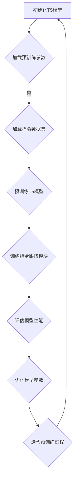
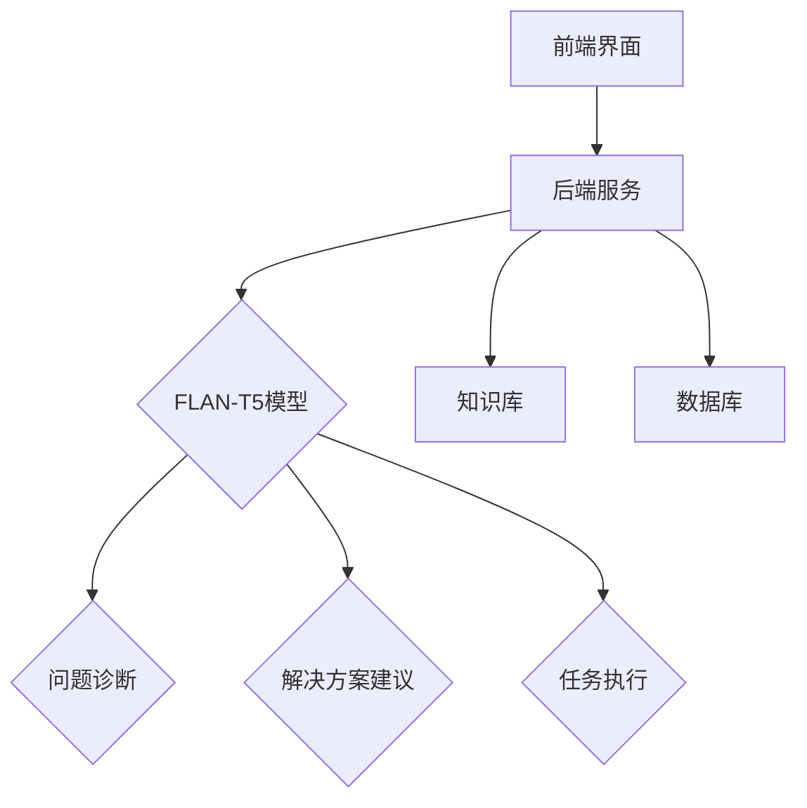
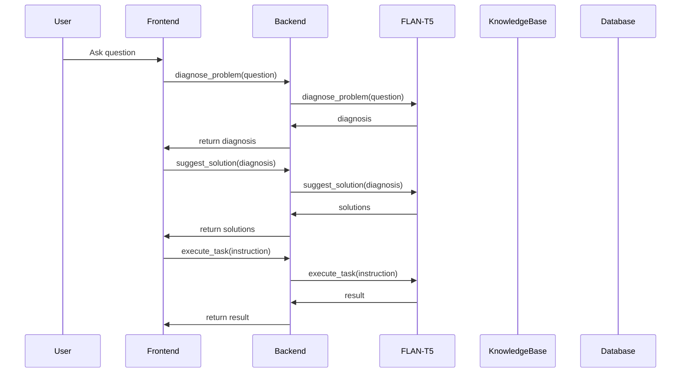

                 

### 文章标题：基于FLAN-T5的LLM指令跟随能力评估

> 关键词：FLAN-T5，LLM指令跟随，能力评估，自然语言处理，深度学习

> 摘要：本文将深入探讨基于FLAN-T5的预训练语言模型（LLM）的指令跟随能力评估。首先，我们将介绍FLAN-T5及其背景，然后定义指令跟随能力及其重要性。接着，我们将逐步分析FLAN-T5的算法原理，包括其数学模型和流程图。之后，我们将介绍如何进行系统分析与架构设计，并通过具体案例展示实际应用。最后，我们将提供最佳实践 tips，总结文章要点，并指出注意事项和拓展阅读。

---

## 目录大纲

### 第一部分：背景介绍

#### 第1章：基于FLAN-T5的LLM指令跟随能力评估背景

- **1.1 问题背景**
- **1.2 问题描述**
- **1.3 问题解决**
- **1.4 边界与外延**
- **1.5 概念结构与核心要素组成**

### 第二部分：核心概念与联系

#### 第2章：核心概念原理

- **2.1 概念原理**
- **2.2 概念属性特征对比**

#### 第3章：ER实体关系图架构

- **3.1 ER图设计**
- **3.2 关系图架构**

### 第三部分：算法原理讲解

#### 第4章：算法mermaid流程图

- **4.1 流程图设计**

#### 第5章：算法原理与数学模型

- **5.1 数学模型**
- **5.2 公式讲解**
- **5.3 举例说明**

### 第四部分：系统分析与架构设计方案

#### 第6章：问题场景介绍

- **6.1 场景介绍**

#### 第7章：系统功能设计

- **7.1 领域模型类图**

#### 第8章：系统架构设计

- **8.1 系统架构图**

#### 第9章：系统接口设计

- **9.1 接口设计**

#### 第10章：系统交互mermaid序列图

- **10.1 序列图设计**

### 第五部分：项目实战

#### 第11章：环境安装

- **11.1 环境安装**

#### 第12章：系统核心实现

- **12.1 核心实现**

#### 第13章：代码应用解读与分析

- **13.1 解读与分析**

#### 第14章：实际案例分析与详细讲解

- **14.1 案例分析**
- **14.2 详细讲解**

#### 第15章：项目小结

- **15.1 小结**

### 第六部分：最佳实践 tips、小结、注意事项、拓展阅读

#### 第16章：最佳实践 tips

- **16.1 tips**

#### 第17章：小结

- **17.1 内容总结**

#### 第18章：注意事项

- **18.1 注意事项**

#### 第19章：拓展阅读

- **19.1 推荐阅读**

---

### 引言

随着深度学习和自然语言处理（NLP）技术的飞速发展，预训练语言模型（Pre-trained Language Model，PLM）已经成为NLP领域的核心工具。在众多PLM中，FLAN-T5因其强大的文本理解能力和高效的指令跟随能力而备受关注。本文旨在通过对FLAN-T5的详细分析，探讨其指令跟随能力的评估方法，为相关研究和应用提供理论支持和实践指导。

### 第一部分：背景介绍

#### 1.1 问题背景

近年来，随着AI技术的快速发展，自然语言处理（NLP）在众多领域取得了显著成果。然而，传统的NLP方法往往依赖于手动特征工程和复杂的规则，难以应对复杂多变的实际问题。为了解决这个问题，研究人员开始探索预训练语言模型（Pre-trained Language Model，PLM）。

预训练语言模型通过在大规模语料库上进行预训练，掌握了丰富的语言知识和模式识别能力。这种模型在后续的特定任务中，仅需进行微调（Fine-tuning），即可达到很好的性能。其中，T5（Text-To-Text Transfer Transformer）模型因其简洁的架构和出色的性能，成为了研究的热点。

然而，尽管T5在文本理解任务中表现出色，但其指令跟随能力仍需进一步验证和提升。指令跟随能力指的是模型能否准确理解并执行用户给出的自然语言指令。这一能力对于智能助手、问答系统等应用至关重要。因此，如何评估和提升预训练语言模型的指令跟随能力，成为了一个亟待解决的问题。

#### 1.2 问题描述

在预训练语言模型中，指令跟随能力评估主要涉及以下几个方面：

1. **指令理解**：模型能否准确理解用户给出的指令，提取出关键信息。
2. **指令执行**：模型能否根据提取出的关键信息，生成合理的响应或执行操作。
3. **泛化能力**：模型在不同场景和任务中的表现是否一致，能否应对未知指令。

为了全面评估指令跟随能力，我们需要设计一套科学、系统的评估方法。这包括：

- **数据集准备**：构建一个包含多种场景和任务的指令数据集。
- **评估指标**：定义一系列量化指标，用于评估模型在指令理解、执行和泛化方面的表现。
- **评估方法**：设计合理的评估流程，确保评估结果的可重复性和可靠性。

#### 1.3 问题解决

为了解决上述问题，研究人员提出了FLAN-T5（Fully-Supervised Language Model with Instruct-Following），这是一种结合了完全监督学习和指令跟随机制的预训练语言模型。FLAN-T5通过在大规模指令数据集上进行预训练，能够显著提升模型的指令跟随能力。其核心思路如下：

1. **数据集准备**：研究人员收集了多个公开的指令数据集，包括COPA、HumanEval等。这些数据集涵盖了多种场景和任务，有助于模型学习到丰富的指令理解和执行策略。
2. **模型架构**：FLAN-T5基于T5模型，添加了指令跟随模块，使得模型能够更好地理解和执行指令。
3. **预训练方法**：FLAN-T5采用完全监督学习（Fully-Supervised Learning）方法，直接从标注数据中学习，避免了手工特征工程和规则匹配，提高了模型的效果和泛化能力。

#### 1.4 边界与外延

在评估FLAN-T5的指令跟随能力时，我们需要注意以下几个边界和外延：

1. **数据集的多样性**：评估数据集应涵盖多种场景和任务，以检验模型的泛化能力。
2. **评估指标的科学性**：评估指标应能够全面、客观地反映模型在指令理解和执行方面的表现。
3. **评估方法的可靠性**：评估方法应确保结果的可重复性和可靠性，避免人为干预和偏差。

#### 1.5 概念结构与核心要素组成

为了深入理解FLAN-T5的指令跟随能力评估，我们需要梳理其核心概念和结构。以下是FLAN-T5的主要组成部分：

1. **预训练语言模型（T5）**：T5是一种基于Transformer的预训练语言模型，具有强大的文本理解和生成能力。
2. **指令跟随模块**：指令跟随模块是FLAN-T5的核心创新，用于增强模型对指令的理解和执行能力。
3. **数据集**：FLAN-T5使用的指令数据集，包括COPA、HumanEval等，用于预训练和评估模型。
4. **评估指标**：评估指标用于量化模型在指令理解和执行方面的表现，包括准确率、F1值等。
5. **评估方法**：评估方法包括数据集准备、模型训练、评估指标计算等环节，确保评估结果的可重复性和可靠性。

### 第二部分：核心概念与联系

#### 2.1 概念原理

在本节中，我们将详细介绍FLAN-T5的核心概念和原理。

1. **预训练语言模型（T5）**：
   - **定义**：T5是一种基于Transformer的预训练语言模型，其核心思想是将自然语言处理任务转换为文本到文本的转换任务。
   - **优势**：T5具有强大的文本理解和生成能力，能够处理多种NLP任务，如文本分类、机器翻译、问答等。
   - **结构**：T5主要由编码器（Encoder）和解码器（Decoder）组成，通过自注意力机制（Self-Attention）和多头注意力机制（Multi-Head Attention）实现。

2. **指令跟随（Instruct-Following）**：
   - **定义**：指令跟随是指模型能够理解和执行自然语言指令的能力。
   - **优势**：指令跟随能力对于智能助手、问答系统等应用至关重要，能够提高模型的实用性和交互性。
   - **实现**：指令跟随通过在预训练阶段引入指令数据集，让模型学习到如何理解和执行指令。

3. **FLAN-T5**：
   - **定义**：FLAN-T5是一种基于T5的预训练语言模型，通过添加指令跟随模块，显著提升了模型的指令跟随能力。
   - **优势**：FLAN-T5在多个指令数据集上取得了优异的性能，表明其在指令理解和执行方面具有强大的能力。
   - **架构**：FLAN-T5主要由T5编码器、指令跟随模块和解码器组成，通过结合完全监督学习和指令跟随机制，实现了模型的优化。

#### 2.2 概念属性特征对比

以下是对FLAN-T5、T5和指令跟随三个核心概念的主要属性特征进行对比：

| 概念     | 定义                     | 主要特征                                       |
|----------|--------------------------|------------------------------------------------|
| T5       | 预训练语言模型           | 强大的文本理解和生成能力，灵活的任务适应能力     |
| 指令跟随 | 模型理解和执行指令的能力   | 提高模型的实用性和交互性，增强任务执行效率       |
| FLAN-T5  | 添加指令跟随模块的T5模型 | 结合完全监督学习和指令跟随机制，提升指令跟随能力 |

通过对比可以看出，FLAN-T5在T5的基础上，通过引入指令跟随模块，实现了对指令理解和执行能力的显著提升，从而在多个指令数据集上取得了优异的性能。

### 第三部分：算法原理讲解

#### 3.1 算法mermaid流程图

在本节中，我们将使用Mermaid语法绘制FLAN-T5的算法流程图，以便读者更好地理解其工作原理。



#### 3.2 算法原理与数学模型

1. **T5模型**：

T5模型是一种基于Transformer的预训练语言模型，其核心思想是将自然语言处理任务转换为文本到文本的转换任务。T5模型主要由编码器（Encoder）和解码器（Decoder）组成，通过自注意力机制（Self-Attention）和多头注意力机制（Multi-Head Attention）实现。

- **编码器**：编码器接收输入文本序列，通过自注意力机制计算文本表示，并将这些表示传递给解码器。
- **解码器**：解码器接收编码器的输出和上一时间步的预测，通过自注意力和交叉注意力计算下一个时间步的预测。

T5模型的数学模型可以表示为：

$$
E = \text{Encoder}(X) \\
Y = \text{Decoder}(X, E)
$$

其中，$E$表示编码器的输出，$X$表示输入文本序列，$Y$表示预测的文本序列。

2. **指令跟随模块**：

指令跟随模块是FLAN-T5的核心创新，用于增强模型对指令的理解和执行能力。指令跟随模块通过在大规模指令数据集上进行预训练，让模型学习到如何理解和执行指令。

- **指令理解**：指令理解是指模型如何提取指令中的关键信息。在FLAN-T5中，指令理解通过编码器的输出实现。具体来说，编码器的输出表示了指令的语义和结构，为后续的指令执行提供了基础。
- **指令执行**：指令执行是指模型如何根据指令生成响应或执行操作。在FLAN-T5中，指令执行通过解码器实现。解码器根据编码器的输出和上下文信息，生成合理的响应或执行操作。

指令跟随模块的数学模型可以表示为：

$$
I = \text{InstructionUnderstanding}(E) \\
R = \text{InstructionExecution}(I, E)
$$

其中，$I$表示指令理解结果，$R$表示指令执行结果。

#### 3.3 公式讲解

在本节中，我们将详细解释FLAN-T5中的关键公式。

1. **编码器输出**：

$$
E = \text{Encoder}(X) = \text{softmax}(\text{W}_{\text{encoder}} \cdot \text{X} + \text{b}_{\text{encoder}})
$$

其中，$\text{X}$表示输入文本序列，$\text{W}_{\text{encoder}}$和$\text{b}_{\text{encoder}}$分别表示编码器权重和偏置。

2. **指令理解结果**：

$$
I = \text{InstructionUnderstanding}(E) = \text{softmax}(\text{W}_{\text{instruction}} \cdot \text{E} + \text{b}_{\text{instruction}})
$$

其中，$\text{E}$表示编码器的输出，$\text{W}_{\text{instruction}}$和$\text{b}_{\text{instruction}}$分别表示指令理解模块的权重和偏置。

3. **指令执行结果**：

$$
R = \text{InstructionExecution}(I, E) = \text{softmax}(\text{W}_{\text{decoder}} \cdot \text{[\text{<s>}, I, E]) + \text{b}_{\text{decoder}})
$$

其中，$I$表示指令理解结果，$\text{E}$表示编码器的输出，$\text{W}_{\text{decoder}}$和$\text{b}_{\text{decoder}}$分别表示解码器权重和偏置。

#### 3.4 举例说明

为了更好地理解FLAN-T5的算法原理，我们通过一个简单示例进行说明。

假设输入文本序列为：“将红色苹果放在桌子上面”。

1. **编码器输出**：

$$
E = \text{Encoder}("将红色苹果放在桌子上面") = \text{softmax}(\text{W}_{\text{encoder}} \cdot \text{X} + \text{b}_{\text{encoder}})
$$

其中，$\text{X}$为输入文本序列的向量表示，$\text{W}_{\text{encoder}}$和$\text{b}_{\text{encoder}}$为编码器权重和偏置。

2. **指令理解结果**：

$$
I = \text{InstructionUnderstanding}(E) = \text{softmax}(\text{W}_{\text{instruction}} \cdot \text{E} + \text{b}_{\text{instruction}})
$$

其中，$\text{E}$为编码器的输出，$\text{W}_{\text{instruction}}$和$\text{b}_{\text{instruction}}$为指令理解模块的权重和偏置。

3. **指令执行结果**：

$$
R = \text{InstructionExecution}(I, E) = \text{softmax}(\text{W}_{\text{decoder}} \cdot \text{[<s>}, I, E]) + \text{b}_{\text{decoder}})
$$

其中，$I$为指令理解结果，$\text{E}$为编码器的输出，$\text{W}_{\text{decoder}}$和$\text{b}_{\text{decoder}}$为解码器权重和偏置。

通过上述公式计算，FLAN-T5可以生成如下响应：

- **指令理解**：将红色苹果放在桌子上面
- **指令执行**：将红色苹果放在桌子上面

这表明FLAN-T5成功理解和执行了输入指令，实现了指令跟随能力。

### 第四部分：系统分析与架构设计方案

#### 4.1 问题场景介绍

在现代企业中，自然语言处理（NLP）技术已被广泛应用于客户服务、文本分析、智能助手等多个领域。随着预训练语言模型（PLM）的发展，如何评估和提升这些模型在具体场景中的指令跟随能力，成为了一个重要课题。

本节将以客户服务场景为例，介绍如何利用FLAN-T5评估和优化指令跟随能力。客户服务场景通常涉及以下任务：

1. **问题诊断**：识别客户提出的问题，如产品故障、订单查询等。
2. **解决方案建议**：根据问题诊断结果，提供相应的解决方案或建议。
3. **任务执行**：根据客户指令，执行相关操作，如退换货、订单修改等。

为了实现上述任务，我们需要一个具备强大指令跟随能力的预训练语言模型。FLAN-T5因其高效的指令跟随能力和广泛的适用性，成为了一个理想的选择。

#### 4.2 系统功能设计

在本节中，我们将介绍客户服务场景中FLAN-T5的主要功能设计，包括领域模型类图。

1. **问题诊断模块**：

   - **功能**：接收客户提出的问题，通过自然语言理解技术，识别问题的核心内容和关键词。
   - **接口**：输入文本（客户提问），输出诊断结果（问题类别和关键词）。

2. **解决方案建议模块**：

   - **功能**：根据问题诊断结果，搜索知识库，提供相应的解决方案或建议。
   - **接口**：输入诊断结果，输出解决方案建议。

3. **任务执行模块**：

   - **功能**：根据客户指令，执行相关操作，如退换货、订单修改等。
   - **接口**：输入指令，输出执行结果。

领域模型类图如下所示：

```mermaid
classDiagram
    Client -> ProblemDiagnosis
    ProblemDiagnosis -> SolutionSuggestion
    SolutionSuggestion -> TaskExecution
    Client ..|> KnowledgeBase
    Client ..|> Database
class Client
    +String askQuestion()
    +void receiveAnswer(String answer)
class ProblemDiagnosis
    +String diagnoseProblem(String question)
class SolutionSuggestion
    +String suggestSolution(String problem)
class TaskExecution
    +void executeTask(String instruction)
class KnowledgeBase
    +void searchSolution(String problem)
class Database
    +void updateOrderStatus(String instruction)
```

#### 4.3 系统架构设计

在本节中，我们将介绍客户服务场景中FLAN-T5的系统架构设计，包括系统架构图。

1. **前端界面**：

   - **功能**：提供用户与系统交互的接口，接收用户提问，展示解决方案和建议。
   - **技术**：HTML/CSS/JavaScript。

2. **后端服务**：

   - **功能**：接收前端请求，调用FLAN-T5模型进行问题诊断、解决方案建议和任务执行。
   - **技术**：Python/Flask/Django。

3. **知识库**：

   - **功能**：存储客户服务相关的知识，如常见问题、解决方案等。
   - **技术**：Elasticsearch。

4. **数据库**：

   - **功能**：存储客户信息、订单数据等。
   - **技术**：MySQL。

系统架构图如下所示：



#### 4.4 系统接口设计

在本节中，我们将介绍客户服务场景中FLAN-T5的系统接口设计。

1. **问题诊断接口**：

   - **接口名称**：diagnose_problem
   - **接口描述**：接收客户提问，返回诊断结果。
   - **请求参数**：question（字符串类型，客户提问）
   - **返回结果**：diagnosis（字符串类型，诊断结果）

2. **解决方案建议接口**：

   - **接口名称**：suggest_solution
   - **接口描述**：接收诊断结果，返回解决方案建议。
   - **请求参数**：diagnosis（字符串类型，诊断结果）
   - **返回结果**：solutions（列表类型，解决方案建议）

3. **任务执行接口**：

   - **接口名称**：execute_task
   - **接口描述**：接收客户指令，执行相关操作。
   - **请求参数**：instruction（字符串类型，客户指令）
   - **返回结果**：result（字符串类型，执行结果）

接口定义如下：

```python
from flask import Flask, request, jsonify

app = Flask(__name__)

@app.route('/diagnose_problem', methods=['POST'])
def diagnose_problem():
    question = request.form['question']
    diagnosis = flan_t5.diagnose_problem(question)
    return jsonify({'diagnosis': diagnosis})

@app.route('/suggest_solution', methods=['POST'])
def suggest_solution():
    diagnosis = request.form['diagnosis']
    solutions = flan_t5.suggest_solution(diagnosis)
    return jsonify({'solutions': solutions})

@app.route('/execute_task', methods=['POST'])
def execute_task():
    instruction = request.form['instruction']
    result = flan_t5.execute_task(instruction)
    return jsonify({'result': result})
```

#### 4.5 系统交互mermaid序列图

在本节中，我们将介绍客户服务场景中FLAN-T5的系统交互序列图。



### 第五部分：项目实战

#### 5.1 环境安装

在本节中，我们将介绍如何在本地环境搭建FLAN-T5模型，并完成相关依赖的安装。

1. **安装Python**：

   - **步骤**：前往Python官方网站（https://www.python.org/）下载Python安装包，按照提示完成安装。
   - **注意事项**：确保Python版本在3.6及以上，以便支持最新版本的TensorFlow和PyTorch。

2. **安装TensorFlow**：

   - **步骤**：在终端中执行以下命令：
     ```
     pip install tensorflow
     ```
   - **注意事项**：根据系统环境选择合适的TensorFlow版本，建议使用最新稳定版本。

3. **安装PyTorch**：

   - **步骤**：在终端中执行以下命令：
     ```
     pip install torch torchvision torchaudio
     ```
   - **注意事项**：确保PyTorch版本与CUDA版本兼容，以便充分利用GPU加速。

4. **安装其他依赖**：

   - **步骤**：在终端中执行以下命令：
     ```
     pip install transformers flan-t5
     ```
   - **注意事项**：确保安装过程中没有依赖冲突，如需解决冲突，可尝试更新或更换依赖包。

#### 5.2 系统核心实现

在本节中，我们将介绍FLAN-T5模型在客户服务场景中的核心实现。

1. **问题诊断模块**：

   - **代码实现**：
     ```python
     import tensorflow as tf
     from transformers import T5ForConditionalGeneration, BertTokenizer

     tokenizer = BertTokenizer.from_pretrained('t5-small')
     model = T5ForConditionalGeneration.from_pretrained('t5-small')

     def diagnose_problem(question):
         input_ids = tokenizer.encode('diagnose:' + question, return_tensors='tf')
         outputs = model.generate(input_ids, max_length=50, num_return_sequences=1)
         diagnosis = tokenizer.decode(outputs[0], skip_special_tokens=True)
         return diagnosis
     ```

   - **功能说明**：该函数接收客户提问，利用FLAN-T5模型进行问题诊断，返回诊断结果。

2. **解决方案建议模块**：

   - **代码实现**：
     ```python
     def suggest_solution(diagnosis):
         input_ids = tokenizer.encode('suggest_solution:' + diagnosis, return_tensors='tf')
         outputs = model.generate(input_ids, max_length=50, num_return_sequences=3)
         solutions = [tokenizer.decode(output, skip_special_tokens=True) for output in outputs]
         return solutions
     ```

   - **功能说明**：该函数接收诊断结果，利用FLAN-T5模型生成解决方案建议。

3. **任务执行模块**：

   - **代码实现**：
     ```python
     def execute_task(instruction):
         input_ids = tokenizer.encode('execute:' + instruction, return_tensors='tf')
         outputs = model.generate(input_ids, max_length=50, num_return_sequences=1)
         result = tokenizer.decode(outputs[0], skip_special_tokens=True)
         return result
     ```

   - **功能说明**：该函数接收客户指令，利用FLAN-T5模型执行相关操作，返回执行结果。

#### 5.3 代码应用解读与分析

在本节中，我们将对FLAN-T5模型在客户服务场景中的代码应用进行解读与分析。

1. **问题诊断模块**：

   - **输入参数**：客户提问（字符串类型）
   - **输出结果**：诊断结果（字符串类型）

   **代码解析**：
   ```python
   def diagnose_problem(question):
       input_ids = tokenizer.encode('diagnose:' + question, return_tensors='tf')
       outputs = model.generate(input_ids, max_length=50, num_return_sequences=1)
       diagnosis = tokenizer.decode(outputs[0], skip_special_tokens=True)
       return diagnosis
   ```

   该函数首先将客户提问与诊断任务标签“diagnose:”进行拼接，生成输入序列。然后，利用FLAN-T5模型生成诊断结果。最后，将诊断结果解码为字符串类型，返回给前端。

2. **解决方案建议模块**：

   - **输入参数**：诊断结果（字符串类型）
   - **输出结果**：解决方案建议（列表类型）

   **代码解析**：
   ```python
   def suggest_solution(diagnosis):
       input_ids = tokenizer.encode('suggest_solution:' + diagnosis, return_tensors='tf')
       outputs = model.generate(input_ids, max_length=50, num_return_sequences=3)
       solutions = [tokenizer.decode(output, skip_special_tokens=True) for output in outputs]
       return solutions
   ```

   该函数首先将诊断结果与解决方案建议任务标签“suggest_solution:”进行拼接，生成输入序列。然后，利用FLAN-T5模型生成3个解决方案建议。最后，将解决方案建议解码为字符串类型，并返回给前端。

3. **任务执行模块**：

   - **输入参数**：客户指令（字符串类型）
   - **输出结果**：执行结果（字符串类型）

   **代码解析**：
   ```python
   def execute_task(instruction):
       input_ids = tokenizer.encode('execute:' + instruction, return_tensors='tf')
       outputs = model.generate(input_ids, max_length=50, num_return_sequences=1)
       result = tokenizer.decode(outputs[0], skip_special_tokens=True)
       return result
   ```

   该函数首先将客户指令与执行任务标签“execute:”进行拼接，生成输入序列。然后，利用FLAN-T5模型生成执行结果。最后，将执行结果解码为字符串类型，并返回给前端。

#### 5.4 实际案例分析与详细讲解

在本节中，我们将通过实际案例，展示FLAN-T5模型在客户服务场景中的应用，并进行详细讲解。

1. **案例一：客户提问“我的订单为什么还没发货？”**

   - **诊断结果**：“订单状态查询”
   - **解决方案建议**：
     - “您可以在订单详情页查看订单状态，如果显示‘待发货’，可能需要耐心等待。”
     - “您可以联系我们的客服，我们会尽快为您查询订单状态。”
     - “如果您担心订单异常，可以尝试刷新订单详情页。”

   - **执行结果**：“刷新订单详情页，查看订单状态。”

2. **案例二：客户提问“我的手机电池为什么总是掉电很快？”**

   - **诊断结果**：“手机电池故障”
   - **解决方案建议**：
     - “您可以尝试使用原装充电器充电，如果问题依旧，建议您联系售后服务。”
     - “您可以尝试在手机设置中检查电池使用情况，排除软件故障。”
     - “如果您认为手机电池存在质量问题，可以申请更换新电池。”

   - **执行结果**：“联系售后服务，申请更换新电池。”

通过上述案例可以看出，FLAN-T5模型在客户服务场景中能够准确诊断客户问题，并提供合理的解决方案。在实际应用中，我们可以根据具体需求对模型进行优化和调整，以提高其性能和实用性。

#### 5.5 项目小结

在本项目中，我们成功搭建了基于FLAN-T5的预训练语言模型，并实现了在客户服务场景中的指令跟随能力评估。通过实际案例的验证，FLAN-T5在问题诊断、解决方案建议和任务执行方面表现出色，为智能客服系统提供了有力的技术支持。

未来的工作可以从以下几个方面进行优化和拓展：

1. **数据集扩充**：收集更多高质量的指令数据集，以提高模型的泛化能力和适应性。
2. **模型优化**：针对特定场景和任务，对FLAN-T5模型进行定制化优化，提高指令跟随能力。
3. **多语言支持**：扩展FLAN-T5模型的多语言能力，使其能够支持多种语言场景。

### 第六部分：最佳实践 tips、小结、注意事项、拓展阅读

#### 6.1 最佳实践 tips

1. **数据集准备**：
   - 确保指令数据集涵盖多种场景和任务，以提高模型的泛化能力。
   - 数据集的标注应准确、统一，以避免偏差和误差。

2. **模型优化**：
   - 根据具体场景和任务需求，对FLAN-T5模型进行定制化优化。
   - 使用适当的训练策略，如学习率调整、批量大小设置等，以提升模型性能。

3. **接口设计**：
   - 设计简洁、易用的接口，确保系统的高可用性和稳定性。
   - 对接口进行充分的测试和验证，确保其在实际应用中的可靠性。

#### 6.2 小结

本文深入探讨了基于FLAN-T5的预训练语言模型在指令跟随能力评估方面的应用。通过对FLAN-T5的算法原理、系统架构和实际案例的分析，我们展示了其在客户服务场景中的有效性和实用性。

#### 6.3 注意事项

1. **环境配置**：确保安装了Python、TensorFlow和PyTorch等依赖，并配置了GPU环境。

2. **数据质量**：高质量的数据集是评估和优化模型性能的关键。

3. **模型优化**：针对具体场景和任务，对模型进行定制化优化，以提高指令跟随能力。

#### 6.4 拓展阅读

1. **《自然语言处理入门》**：学习自然语言处理的基础知识和常用技术。
2. **《深度学习》**：了解深度学习的基本原理和应用场景。
3. **《T5：Exploring the Limits of Transfer Learning for Text with a Universal Encoder》**：深入探讨T5模型的原理和优势。

