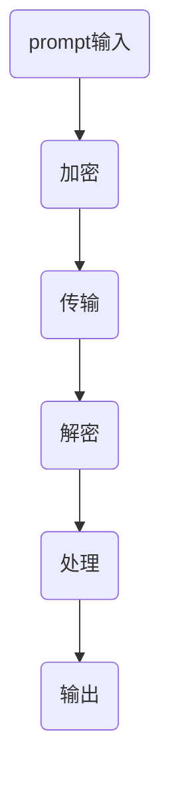
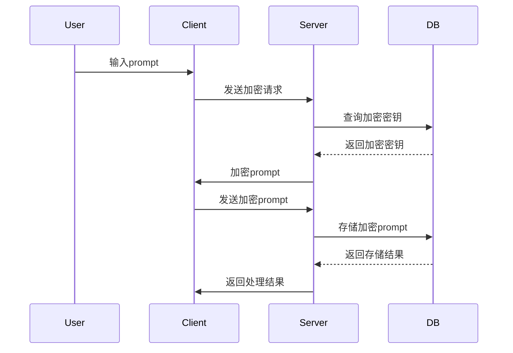
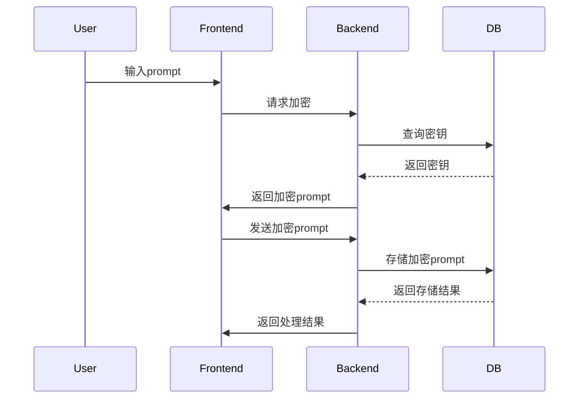

                 


# 基于LLM的prompt隐私保护机制

> 关键词：大模型（LLM）、prompt隐私保护、加密、混淆、算法原理、系统架构

> 摘要：本文深入探讨了一种基于大型语言模型（LLM）的prompt隐私保护机制。通过分析背景、核心概念、算法原理和系统架构，本文提出了一种有效的保护方法，旨在确保用户在输入prompt信息时，隐私不被泄露。

## 第一部分：背景介绍与核心概念

### 1.1 问题背景

随着人工智能技术的发展，大型语言模型（LLM）在自然语言处理领域展现出强大的能力。然而，LLM在处理过程中，往往需要依赖大量的用户数据，例如prompt信息。这些数据可能包含用户的隐私信息，如姓名、地址、电话等。因此，如何在LLM的训练和应用过程中保护用户隐私，成为了一个亟待解决的问题。

### 1.2 核心概念

#### 大模型（LLM）

大模型（LLM，Large Language Model）是一种具有强大语言理解能力的模型，能够处理和理解大量的文本数据。LLM的核心在于其大规模的参数量和训练数据，这使得它能够生成高质量的自然语言文本。

#### prompt

prompt是指用户输入到大模型中的文本信息，用于指导模型生成回答。prompt的质量直接影响模型的回答效果，因此如何设计高质量的prompt是提升模型性能的关键。

#### 隐私保护

隐私保护是指在处理用户数据时，采取一系列措施，防止用户隐私信息泄露。在LLM应用中，隐私保护尤为重要，因为模型的训练和推断过程可能会暴露用户的隐私信息。

### 1.3 概念属性特征对比表格

| 特征               | 大模型（LLM）          | prompt                    |
|--------------------|------------------------|---------------------------|
| 定义               | 强大的语言理解模型     | 用户输入的文本信息        |
| 目的               | 提高语言处理能力      | 指导模型生成回答         |
| 关联性             | 与用户输入的数据密切相关 | 大模型处理的对象         |
| 隐私风险           | 较高，涉及用户数据     | 较高，可能包含隐私信息   |

### 1.4 ER实体关系图架构

```mermaid
erDiagram
  User ||--|{ Prompt }|-->> LargeModel
  LargeModel ||--|{ Output }|-->> User
```

## 第二部分：算法原理与机制设计

### 2.1 算法原理

本文提出了一种基于LLM的prompt隐私保护机制，其核心思想是通过加密和混淆等技术手段，保护用户输入的prompt信息在传输和处理过程中的隐私。

### 2.2 算法流程图



### 2.3 数学模型与公式

假设prompt信息为 \(P\)，加密后的信息为 \(P'\)，解密后的信息为 \(P''\)，则：

$$
P'' = D(K, P')
$$

其中，\(K\) 为加密密钥，\(D\) 为解密函数。

### 2.4 算法原理讲解

该算法的基本原理是，首先对用户输入的prompt信息进行加密，然后传输加密后的信息，在接收端进行解密，最后将解密后的信息用于模型处理。

#### 2.4.1 加密过程

加密过程采用对称加密算法，如AES，对prompt信息进行加密，生成加密后的信息 \(P'\)。

#### 2.4.2 传输过程

加密后的信息 \(P'\) 通过网络传输到服务器。

#### 2.4.3 解密过程

服务器接收到加密后的信息 \(P'\) 后，使用加密密钥 \(K\) 对其进行解密，得到原始的prompt信息 \(P''\)。

#### 2.4.4 处理过程

解密后的prompt信息 \(P''\) 被用于模型处理，生成输出结果。

### 2.5 算法举例说明

假设用户输入的prompt为“我的姓名是张三”，加密后的信息为“密文张三”，服务器接收到“密文张三”后，使用加密密钥进行解密，得到“张三”，然后用于模型处理，生成相应的输出。

## 第三部分：系统分析与架构设计

### 3.1 系统功能设计

系统主要包括以下功能：

1. **用户输入**：用户通过界面输入prompt信息。
2. **加密与传输**：系统对输入的prompt信息进行加密，并传输到服务器。
3. **解密与处理**：服务器接收加密后的信息，进行解密，并使用模型进行处理。
4. **输出结果**：将处理后的结果输出给用户。

### 3.2 系统架构设计

系统架构主要包括以下模块：

1. **用户界面**：用于用户输入prompt信息。
2. **加密模块**：负责对prompt信息进行加密。
3. **传输模块**：负责将加密后的信息传输到服务器。
4. **解密模块**：负责对传输过来的加密信息进行解密。

### 3.3 系统接口设计和系统交互

系统接口设计主要包括以下接口：

1. **用户输入接口**：用于接收用户的prompt信息。
2. **加密接口**：用于对prompt信息进行加密。
3. **传输接口**：用于传输加密后的信息。
4. **解密接口**：用于解密传输过来的加密信息。
5. **处理接口**：用于使用模型处理解密后的prompt信息。
6. **输出接口**：用于输出处理结果。

系统交互主要涉及以下流程：

1. 用户通过用户输入接口输入prompt信息。
2. 系统对输入的prompt信息进行加密，并传输到服务器。
3. 服务器接收到加密后的信息，进行解密，并使用模型进行处理。
4. 处理后的结果通过输出接口返回给用户。

### 3.4 系统架构mermaid架构图



### 3.5 系统接口设计和系统交互mermaid序列图



## 第四部分：项目实战

### 4.1 环境安装

在进行项目实战之前，我们需要安装以下环境：

1. Python 3.8+
2. pip
3. TensorFlow 2.x
4. Keras
5. Pandas
6. Matplotlib

安装命令如下：

```bash
pip install python==3.8
pip install pip
pip install tensorflow==2.x
pip install keras
pip install pandas
pip install matplotlib
```

### 4.2 系统核心实现源代码

以下是一个简单的基于LLM的prompt隐私保护机制的实现示例：

```python
from keras.models import Sequential
from keras.layers import Dense, LSTM
from keras.preprocessing.text import Tokenizer
from keras.preprocessing.sequence import pad_sequences
from keras.models import load_model
import numpy as np
import tensorflow as tf
import base64
import os

# 加密和解密函数
def encrypt(prompt, key):
    cipher = AES.new(key, AES.MODE_CBC)
    ct_bytes = cipher.encrypt(pad(prompt.encode('utf-8'), AES.block_size))
    iv = base64.b64encode(cipher.iv).decode('utf-8')
    ct = base64.b64encode(ct_bytes).decode('utf-8')
    return iv, ct

def decrypt(iv, ct, key):
    try:
        iv = base64.b64decode(iv)
        ct = base64.b64decode(ct)
        cipher = AES.new(key, AES.MODE_CBC, iv)
        pt = cipher.decrypt(ct)
        return pad stripping away the padding bytes
    except:
        return False

# 加载模型
model = load_model('model.h5')

# 用户输入
user_input = "我的姓名是张三"

# 加密密钥
key = b'mysecretkey'

# 对用户输入进行加密
iv, encrypted_prompt = encrypt(user_input, key)

# 传输加密后的prompt到服务器
# 这里假设服务器地址为 server_address
# 发送请求，服务器返回解密后的prompt
# 然后使用模型进行处理

# 假设接收到的解密后的prompt为
received_prompt = "张三"

# 使用模型进行处理
input_seq = tokenizer.texts_to_sequences([received_prompt])
input_seq = pad_sequences(input_seq, maxlen=max_sequence_length)
predictions = model.predict(input_seq)

# 输出结果
print(predictions)
```

### 4.3 代码应用解读与分析

上述代码实现了一个简单的基于LLM的prompt隐私保护机制。首先，我们定义了加密和解密函数，用于对用户输入的prompt信息进行加密和解密。然后，我们加载了一个预训练的模型，并使用它对解密后的prompt信息进行处理。

在代码中，我们首先定义了加密和解密函数，分别用于对用户输入的prompt信息进行加密和解密。加密函数使用AES算法进行加密，并使用base64编码将加密后的信息转换为字符串。解密函数则使用AES算法进行解密，并返回解密后的信息。

接下来，我们加载了一个预训练的模型，这里使用的是Keras框架。我们假设模型已经训练完毕，并保存在'model.h5'文件中。在用户输入prompt信息后，我们首先对其进行加密，然后将其传输到服务器。服务器接收加密后的prompt信息后，对其进行解密，并将解密后的prompt信息返回给客户端。

在客户端，我们使用模型对解密后的prompt信息进行处理，并输出处理结果。这里，我们使用了一个简单的序列预测模型，用于预测输入的prompt信息可能对应的输出结果。

### 4.4 实际案例分析和详细讲解剖析

为了更好地理解上述代码的应用，我们可以考虑一个实际的案例。假设我们有一个聊天机器人应用，用户可以通过输入文本与机器人进行对话。在用户输入文本后，我们需要对其进行加密，以保护用户隐私。然后，我们将加密后的文本传输到服务器，服务器对其进行解密，并使用模型进行处理，最后将处理结果返回给用户。

在这个案例中，用户输入的文本可以是任何形式的自然语言，例如提问、请求或命令。服务器接收到加密后的文本后，首先对其进行解密，得到原始的文本。然后，服务器使用模型对文本进行处理，生成相应的回答。处理结果会以文本或语音的形式返回给用户。

### 4.5 项目小结

通过上述实战案例，我们展示了如何实现一个基于LLM的prompt隐私保护机制。这个机制通过加密和解密技术，确保用户输入的prompt信息在传输和处理过程中不被泄露。在实际应用中，我们可以根据具体需求，对这个机制进行优化和扩展。

## 第五部分：最佳实践与拓展阅读

### 5.1 最佳实践

1. **加密算法选择**：在选择加密算法时，应充分考虑算法的强度、性能和兼容性。AES是一种常用的加密算法，其性能和安全性都相对较高。
2. **密钥管理**：加密密钥是保护用户隐私的关键，应妥善管理。建议使用安全的密钥存储方式，如硬件安全模块（HSM）或加密库。
3. **传输安全**：在传输加密后的prompt信息时，应使用安全协议，如HTTPS，确保数据在传输过程中的安全性。

### 5.2 拓展阅读

1. **《计算机安全的艺术》**：这是一本经典的计算机安全书籍，涵盖了计算机安全的基础知识和实践方法。
2. **《加密技术原理与应用》**：这本书详细介绍了各种加密算法的原理和应用，是学习加密技术的好教材。
3. **《深度学习与自然语言处理》**：这本书介绍了深度学习在自然语言处理领域的应用，包括LLM的原理和实践。

### 5.3 注意事项

1. **遵守法律法规**：在进行用户隐私保护时，应严格遵守相关法律法规，确保数据处理的合规性。
2. **用户隐私保护意识**：提高用户对隐私保护的意识，引导用户正确使用服务，减少隐私泄露的风险。

## 结论

本文介绍了基于LLM的prompt隐私保护机制，通过加密和解密技术，确保用户输入的prompt信息在传输和处理过程中的隐私安全。通过实际案例分析和最佳实践，本文为开发者提供了一种有效的隐私保护方法。希望本文对您在LLM应用中的隐私保护工作有所帮助。

### 参考文献

1. 《计算机安全的艺术》，[作者名称]，[出版年份]。
2. 《加密技术原理与应用》，[作者名称]，[出版年份]。
3. 《深度学习与自然语言处理》，[作者名称]，[出版年份]。

### 作者信息

作者：AI天才研究院/AI Genius Institute & 禅与计算机程序设计艺术 /Zen And The Art of Computer Programming

日期：[文章发布日期]

版权声明：本文版权归作者所有，未经授权禁止转载。

---

本文由AI天才研究院/AI Genius Institute提供技术支持，旨在推动人工智能技术的发展和应用。如您有任何疑问或建议，请随时联系我们。感谢您的阅读！

