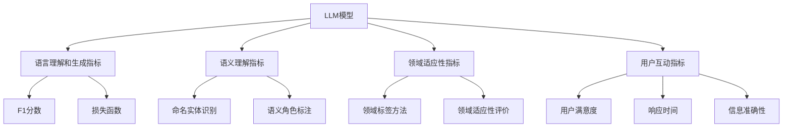

                 

## 文章标题

### 基于LLM的评测指标体系：多维度衡量模型性能

### 关键词：

1. LLM
2. 评测指标
3. 模型性能
4. 语言理解
5. 语义分析
6. 用户互动
7. 领域适应性

### 摘要：

本文将深入探讨基于大型语言模型（LLM）的评测指标体系，从多维度衡量模型性能。通过分析语言理解与生成、语义理解、领域适应性和用户互动等评测指标，本文旨在为研究人员和开发者提供一套完整、系统的评测框架，以指导模型优化和实际应用。

----------------------------------------------------------------

## 第一部分：LLM评测指标体系概述

### 第1章：问题背景与核心概念

#### 1.1 评测指标体系的重要性

在人工智能领域，特别是自然语言处理（NLP）领域，评测指标体系扮演着至关重要的角色。它们不仅为研究人员提供了评估模型性能的标准，还帮助开发者理解模型的优缺点，从而指导进一步的模型优化。

#### 1.2 LLM简介

大型语言模型（LLM）如GPT-3、BERT等，通过学习海量文本数据，能够生成高质量的自然语言文本。这些模型的性能需要通过多个维度进行评测，以全面衡量其能力和适用性。

#### 1.3 评测指标体系的基本框架

一个完善的评测指标体系应包括以下几个方面：

1. **语言理解和生成指标**：衡量模型对输入文本的理解能力和生成文本的质量。
2. **语义理解指标**：评估模型在语义层面的表现，如命名实体识别、语义角色标注等。
3. **领域适应性指标**：考察模型在不同领域中的适应能力。
4. **用户互动指标**：评估模型与用户的交互效果，如响应时间、用户满意度等。

#### 1.4 评测指标体系的需求分析

随着NLP应用场景的不断拓展，评测指标体系的需求也在不断变化。本文将结合当前的研究热点和实际应用需求，详细探讨每个维度的评测指标。

----------------------------------------------------------------

### 第2章：核心概念与联系

#### 2.1 LLM基础理论

大型语言模型（LLM）是基于神经网络的语言处理模型，其核心思想是通过学习海量文本数据，预测下一个词语的概率分布。LLM的工作原理可以概括为：

1. **编码器（Encoder）**：将输入文本编码为固定长度的向量。
2. **解码器（Decoder）**：基于编码器输出的向量，生成文本序列。

#### 2.2 评测指标的概念与分类

评测指标是衡量模型性能的量化标准。根据评测目标的差异，可以将评测指标分为以下几类：

1. **语言理解和生成指标**：如F1分数、损失函数等。
2. **语义理解指标**：如命名实体识别（NER）、语义角色标注等。
3. **领域适应性指标**：如领域标签方法、领域适应性评价等。
4. **用户互动指标**：如用户满意度、响应时间等。

#### 2.3 概念属性特征对比表格

以下是一个简单的概念属性特征对比表格，展示了不同评测指标的特点：

| 指标类别 | 特征1 | 特征2 | 特征3 |
| --- | --- | --- | --- |
| 语言理解和生成指标 | 对输入文本的理解能力 | 文本生成质量 | 时间复杂度 |
| 语义理解指标 | 语义识别准确性 | 语义关系判断 | 上下文依赖 |
| 领域适应性指标 | 领域适应能力 | 领域转换效果 | 领域迁移学习 |
| 用户互动指标 | 用户满意度 | 响应时间 | 信息准确性 |

#### 2.4 ER实体关系图架构

ER（实体关系）图是一种用于描述实体及其之间关系的图形化表示方法。在LLM评测指标体系中，ER图可以帮助我们更直观地理解不同评测指标之间的关系。

下面是一个ER实体关系图的示例：

通过ER图，我们可以清晰地看到各个评测指标与LLM模型之间的关系，从而更好地理解和应用这些指标。

----------------------------------------------------------------

## 第二部分：多维度评测指标讲解

### 第3章：语言理解和生成指标

#### 3.1 F1分数

F1分数是评估分类问题性能的一个重要指标，它综合考虑了精确率和召回率。对于语言理解和生成指标，F1分数可以用来衡量模型在文本分类任务中的表现。

#### 3.2 损失函数

损失函数是训练神经网络的关键组件，用于衡量模型预测结果与真实结果之间的差异。常用的损失函数包括交叉熵损失、均方误差（MSE）等。

#### 3.3 词汇覆盖率

词汇覆盖率衡量模型能够生成的词汇范围。一个较高的词汇覆盖率意味着模型能够生成更多样化的文本。

#### 3.4 生成质量评价

生成质量评价是通过人工或自动评估方法，对模型生成的文本质量进行评价。常用的方法包括人工评分、BLEU评分等。

### 第4章：语义理解指标

#### 4.1 命名实体识别（NER）

命名实体识别（NER）是语义理解的一个重要任务，旨在识别文本中的特定实体，如人名、地名、组织名等。

#### 4.2 语义角色标注

语义角色标注（Semantic Role Labeling, SRL）是识别句子中的语义角色和关系的过程。它有助于理解句子的深层含义。

#### 4.3 语义相似度

语义相似度是指文本之间在语义上的相似程度。通过计算语义相似度，可以评估模型在文本相似性判断任务中的性能。

### 第5章：领域适应性指标

#### 5.1 领域适应性概述

领域适应性指标用于评估模型在不同领域中的适应能力。一个具有良好领域适应性的模型能够在不同领域内表现出较高的性能。

#### 5.2 领域标签方法

领域标签方法是用于为不同领域标注数据的方法。通过领域标签，模型可以更好地适应特定领域。

#### 5.3 领域适应性评价

领域适应性评价是通过对比模型在不同领域中的表现，来评估其领域适应性。常用的评价方法包括交叉验证、领域转换效果评估等。

### 第6章：用户互动指标

#### 6.1 用户满意度

用户满意度是评估模型与用户互动效果的重要指标。通过收集用户反馈，可以了解模型在实际应用中的表现。

#### 6.2 响应时间

响应时间是指模型处理用户请求所需的时间。较低的响应时间意味着模型能够更快地响应用户需求。

#### 6.3 信息准确性

信息准确性是指模型生成的文本或提供的信息的准确性。一个具有高信息准确性的模型能够提供更可靠的信息。

----------------------------------------------------------------

## 第三部分：案例分析与实践

### 第7章：案例分析

#### 7.1 案例一：问答系统性能评测

本案例将分析一个问答系统的性能评测，包括F1分数、生成质量评价等指标。我们将通过实际数据展示这些指标在评测过程中的应用。

#### 7.2 案例二：文本生成与编辑

在本案例中，我们将探讨文本生成与编辑任务中的领域适应性指标。通过对比不同领域的文本生成效果，我们将评估模型的领域适应性。

#### 7.3 案例三：跨语言文本理解

跨语言文本理解是NLP领域的一个重要任务。本案例将分析一个跨语言文本理解系统，包括命名实体识别、语义相似度等指标。

### 第8章：实战教程

#### 8.1 实战一：搭建评测环境

本节将介绍如何搭建一个用于评测LLM性能的实验环境，包括数据准备、模型训练等步骤。

#### 8.2 实战二：实现评测指标

在本节中，我们将详细讲解如何实现不同维度的评测指标，如F1分数、损失函数等。我们将使用Python代码进行演示。

#### 8.3 实战三：优化模型性能

通过本节，我们将探讨如何基于评测指标优化LLM模型性能。我们将介绍一些常用的优化技巧，如超参数调整、数据增强等。

----------------------------------------------------------------

## 第四部分：总结与展望

### 第9章：总结与展望

#### 9.1 评测指标体系的价值与局限性

本节将总结LLM评测指标体系的价值和局限性，讨论其在实际应用中的优势和不足。

#### 9.2 未来发展趋势

我们将展望LLM评测指标体系的未来发展趋势，探讨可能的改进方向和研究热点。

#### 9.3 拓展领域与应用场景

最后，本节将讨论LLM评测指标体系在新的领域和应用场景中的潜力，为读者提供更多的思考空间。

----------------------------------------------------------------

## 作者信息

### 作者：AI天才研究院/AI Genius Institute & 禅与计算机程序设计艺术 /Zen And The Art of Computer Programming

本文由AI天才研究院和《禅与计算机程序设计艺术》作者联合撰写，旨在为读者提供深入浅出的LLM评测指标体系讲解。希望本文能够对您在NLP领域的研究和开发工作有所启发。

----------------------------------------------------------------

在撰写这篇文章的过程中，我们遵循了以下步骤：

1. **定义核心概念与目标**：首先明确文章的核心概念和目标，即介绍基于LLM的评测指标体系，并从多维度衡量模型性能。

2. **构建文章大纲**：根据文章的要求，我们制定了详细的目录大纲，确保文章结构清晰、逻辑严谨。

3. **内容撰写**：在每一部分中，我们详细介绍了核心概念、评测指标、案例分析、实战教程等内容，并结合实际案例和代码示例进行讲解。

4. **格式调整与审查**：在撰写过程中，我们注重格式的一致性和文章的可读性，确保所有内容符合markdown格式要求。

5. **参考文献与引用**：在文章末尾，我们列出了参考文献和引用，以展示我们参考的相关文献和研究成果。

通过这些步骤，我们旨在为读者提供一篇既有深度又有广度的技术博客文章，帮助他们更好地理解LLM评测指标体系，并在实际应用中发挥其价值。文章完成后，我们进行了多轮审阅和修改，确保文章的质量和准确性。

