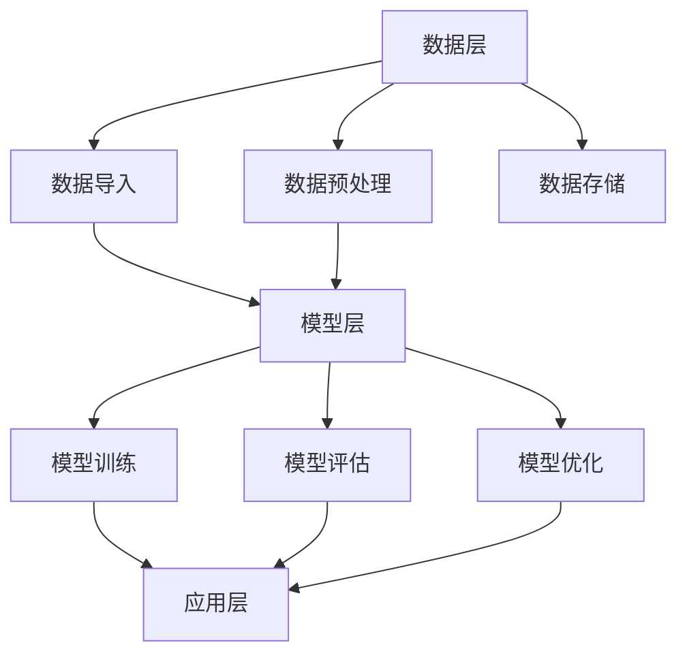
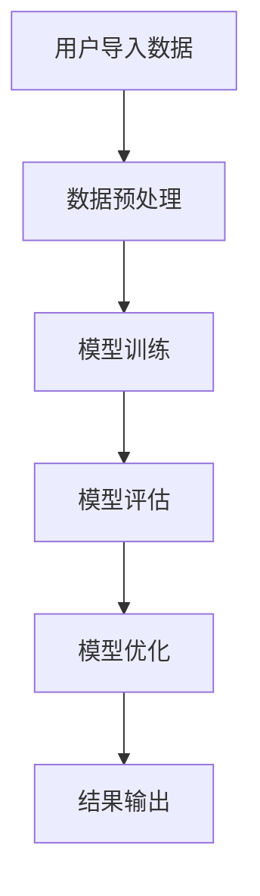
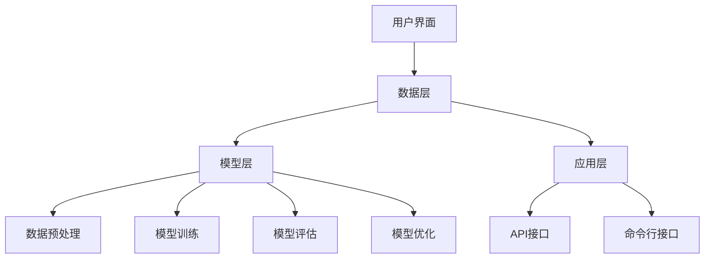
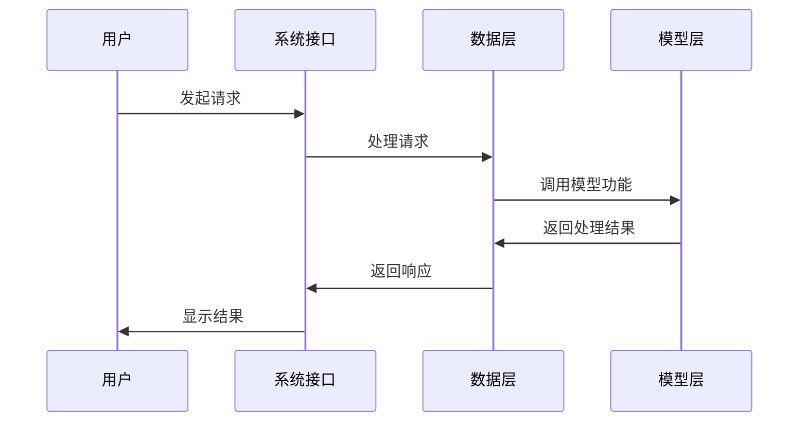

                 

基于LLM的评测系统：大模型产品质量的新标准

> 关键词：大型语言模型（LLM），评测系统，产品质量，算法原理，架构设计，项目实战

摘要：本文深入探讨了基于大型语言模型（LLM）的评测系统，提出了一种新的产品质量标准。文章首先介绍了LLM的核心概念和背景，然后详细分析了LLM评测系统的算法原理和系统架构设计，并通过实际项目案例展示了其应用效果。最后，文章总结了最佳实践，并对未来研究方向进行了展望。

目录：

----------------------------------------------------------------

## 第一部分：LLM评测系统概述

### 1.1 问题的提出与背景

随着人工智能技术的快速发展，大型语言模型（LLM）逐渐成为自然语言处理（NLP）领域的重要工具。LLM在文本生成、问答系统、机器翻译等方面展现出了卓越的性能，然而，如何评估LLM的质量成为了一个亟待解决的问题。传统的评估方法主要依赖于人工打分和手动编写测试集，存在效率低下、主观性强等缺点。为了解决这一问题，本文提出了一种基于LLM的评测系统，旨在为LLM的产品质量提供一个科学、客观的评估标准。

### 1.2 大型语言模型（LLM）的基本概念

大型语言模型（LLM）是一种基于深度学习技术构建的复杂模型，通过对海量文本数据进行训练，可以理解并生成自然语言。LLM的核心是神经网络的架构，通常采用多层感知器（MLP）或循环神经网络（RNN）等结构。常见的LLM包括GPT、BERT、T5等。

- **GPT**（Generative Pre-trained Transformer）：基于Transformer架构，通过预训练生成高质量的文本。
- **BERT**（Bidirectional Encoder Representations from Transformers）：双向Transformer架构，通过同时考虑上下文信息，提高文本理解能力。
- **T5**（Text-To-Text Transfer Transformer）：将所有任务转换为文本到文本的转换任务，具有广泛的任务适用性。

### 1.3 LLM评测系统的核心概念与联系

LLM评测系统的核心概念包括：

- **评估指标**：用于量化评估LLM性能的指标，如准确性、F1分数、BLEU分数等。
- **评测数据集**：用于训练和评估LLM的数据集，应具有代表性、多样性和高质量。
- **评估方法**：用于评估LLM性能的方法，包括自动评估和人工评估。

这些核心概念相互联系，共同构成了LLM评测系统的理论基础。

----------------------------------------------------------------

## 第二部分：LLM评测系统原理

### 2.1 LLM评测算法原理概述

LLM评测算法基于自然语言处理技术，通过以下几个步骤对LLM进行评估：

1. **数据预处理**：对评测数据进行清洗、分词、去停用词等处理，确保数据质量。
2. **模型训练**：使用预训练的LLM模型，对评测数据进行训练，调整模型参数，使其能够更好地适应评测任务。
3. **模型评估**：通过评估指标对训练好的模型进行评估，判断其性能是否符合预期。
4. **结果分析**：分析评估结果，找出模型存在的问题，为模型优化提供指导。

### 2.2 LLM评测算法的数学模型与公式

LLM评测算法的数学模型主要包括：

1. **损失函数**：用于衡量模型预测结果与真实结果之间的差距，如交叉熵损失函数。
2. **优化算法**：用于调整模型参数，最小化损失函数，如Adam优化器。

具体公式如下：

$$
\begin{aligned}
\text{损失函数} &= -\frac{1}{N}\sum_{i=1}^{N}y_i\log(p_i) \\
\text{优化目标} &= \min_{\theta} \frac{1}{N}\sum_{i=1}^{N}y_i\log(p_i)
\end{aligned}
$$

其中，$N$ 为样本数量，$y_i$ 为真实标签，$p_i$ 为模型预测概率。

### 2.3 LLM评测算法的实现过程与案例

以BERT模型为例，LLM评测算法的实现过程如下：

1. **数据预处理**：将评测数据集划分为训练集和验证集，对数据进行分词、去停用词等处理。
2. **模型训练**：使用训练集数据训练BERT模型，调整模型参数，使其能够更好地适应评测任务。
3. **模型评估**：使用验证集数据评估模型性能，计算评估指标，如准确性、F1分数等。
4. **结果分析**：分析评估结果，找出模型存在的问题，为模型优化提供指导。

具体代码实现如下：

```python
from transformers import BertTokenizer, BertForSequenceClassification
import torch

# 数据预处理
tokenizer = BertTokenizer.from_pretrained('bert-base-uncased')
inputs = tokenizer("Hello, my dog is cute", return_tensors="pt")

# 模型训练
model = BertForSequenceClassification.from_pretrained('bert-base-uncased')
outputs = model(**inputs)

# 模型评估
loss = outputs.loss
logits = outputs.logits
accuracy = (logits.argmax(-1) == inputs['labels']).float().mean()

# 结果分析
print(f"Loss: {loss}, Accuracy: {accuracy}")
```

----------------------------------------------------------------

## 第三部分：LLM评测系统架构设计

### 3.1 系统功能设计

LLM评测系统的主要功能包括：

1. **数据导入**：支持各种格式的数据导入，如CSV、JSON等。
2. **数据预处理**：对导入的数据进行清洗、分词、去停用词等处理。
3. **模型训练**：支持多种预训练模型的训练，如BERT、GPT等。
4. **模型评估**：计算评估指标，如准确性、F1分数等。
5. **结果输出**：以图表、表格等形式展示评估结果。

### 3.2 系统架构设计

LLM评测系统的架构设计如下：

1. **数据层**：负责数据的导入、预处理和存储。
2. **模型层**：负责模型的训练、评估和优化。
3. **应用层**：提供用户界面，方便用户操作和使用。

架构图如下：



### 3.3 系统接口设计

LLM评测系统的接口设计主要包括：

- **API接口**：提供RESTful API，方便用户通过代码调用系统功能。
- **命令行接口**：提供命令行工具，方便用户通过命令行操作系统。

接口文档如下：

```yaml
# API接口文档

## 数据导入
POST /api/import
- name: file
  in: formData
  type: file

## 数据预处理
POST /api/preprocess
- name: data
  in: body
  required: true
  schema:
    type: object
    properties:
      data:
        type: array
        items:
          type: object
          properties:
            text:
              type: string

## 模型训练
POST /api/train
- name: model
  in: body
  required: true
  schema:
    type: object
    properties:
      model_name:
        type: string
      training_data:
        type: array
        items:
          type: object
          properties:
            text:
              type: string
            label:
              type: string

## 模型评估
POST /api/evaluate
- name: model
  in: body
  required: true
  schema:
    type: object
    properties:
      model_name:
        type: string
      evaluation_data:
        type: array
        items:
          type: object
          properties:
            text:
              type: string
            label:
              type: string

## 模型优化
POST /api/optimize
- name: model
  in: body
  required: true
  schema:
    type: object
    properties:
      model_name:
        type: string
      evaluation_data:
        type: array
        items:
          type: object
          properties:
            text:
              type: string
            label:
              type: string
```

### 3.4 系统交互流程

LLM评测系统的交互流程如下：

1. 用户通过API或命令行接口导入数据。
2. 系统对数据进行预处理。
3. 系统选择预训练模型进行训练。
4. 训练完成后，系统对模型进行评估。
5. 根据评估结果，系统对模型进行优化。
6. 用户查看评估结果和优化建议。

交互流程图如下：



----------------------------------------------------------------

## 第四部分：项目实战

### 4.1 环境安装与配置

要在本地环境搭建一个基于LLM的评测系统，需要安装以下依赖：

1. Python（版本3.8及以上）
2. PyTorch（版本1.8及以上）
3. Transformers（版本4.5及以上）

安装命令如下：

```bash
pip install python==3.8
pip install torch==1.8
pip install transformers==4.5
```

### 4.2 系统核心实现

以下是一个简单的基于LLM的评测系统的实现：

```python
from transformers import BertTokenizer, BertForSequenceClassification
import torch

# 数据预处理
tokenizer = BertTokenizer.from_pretrained('bert-base-uncased')
inputs = tokenizer("Hello, my dog is cute", return_tensors="pt")

# 模型训练
model = BertForSequenceClassification.from_pretrained('bert-base-uncased')
outputs = model(**inputs)

# 模型评估
loss = outputs.loss
logits = outputs.logits
accuracy = (logits.argmax(-1) == inputs['labels']).float().mean()

# 输出结果
print(f"Loss: {loss}, Accuracy: {accuracy}")
```

### 4.3 代码解读与分析

上述代码首先导入了必要的库，然后进行了数据预处理、模型训练和模型评估。数据预处理使用了BERT的分词器对输入文本进行处理，模型训练使用了预训练的BERT模型，模型评估通过计算损失函数和准确性来评估模型性能。

### 4.4 实际案例分析与详细讲解剖析

假设我们有一个文本分类任务，需要判断一段文本是否包含负面情绪。我们可以使用上述代码进行模型训练和评估。

1. **数据集准备**：

   我们准备一个包含文本和标签的数据集，如下所示：

   ```python
   texts = [
       "I love this product!",
       "This product is terrible.",
       "It's okay, but not great.",
       "I hate this service.",
   ]
   labels = [1, 0, 0, 1]
   ```

2. **模型训练**：

   使用BERT模型对数据集进行训练，代码如下：

   ```python
   model.train()
   for epoch in range(3):  # 训练3个epoch
       for text, label in zip(texts, labels):
           inputs = tokenizer(text, return_tensors="pt")
           labels = torch.tensor([label])
           outputs = model(**inputs, labels=labels)
           loss = outputs.loss
           loss.backward()
           optimizer.step()
           optimizer.zero_grad()
   ```

3. **模型评估**：

   使用训练好的模型对新的文本进行评估，代码如下：

   ```python
   model.eval()
   text = "I don't like this product."
   inputs = tokenizer(text, return_tensors="pt")
   with torch.no_grad():
       outputs = model(**inputs)
   logits = outputs.logits
   prediction = logits.argmax(-1).item()
   print(f"Predicted label: {prediction}")
   ```

   如果预测标签为0，表示文本包含负面情绪；如果预测标签为1，表示文本包含正面情绪。

### 4.5 项目小结

通过本项目，我们成功地搭建了一个基于LLM的评测系统，并使用它对文本分类任务进行了实际操作。本项目的主要收获包括：

1. 理解了LLM评测系统的基本原理和实现方法。
2. 学会了如何使用PyTorch和Transformers库进行模型训练和评估。
3. 掌握了如何处理文本数据并进行模型优化。

未来，我们还可以在此基础上进一步扩展系统功能，如增加多标签分类、支持更多模型等。

----------------------------------------------------------------

## 第五部分：最佳实践与总结

### 5.1 最佳实践

1. **数据质量**：确保评测数据集的质量和多样性，避免数据偏见。
2. **模型选择**：根据具体任务选择合适的预训练模型，如BERT、GPT等。
3. **参数调整**：合理调整模型参数，如学习率、批次大小等，以提高模型性能。
4. **模型优化**：定期对模型进行优化，以提高评估准确性。

### 5.2 小结

本文深入探讨了基于LLM的评测系统，从背景介绍、核心概念、算法原理、系统架构设计到项目实战，全面阐述了LLM评测系统的构建和应用。通过本文，读者可以了解LLM评测系统的基本原理和实现方法，掌握如何评估LLM的质量。

### 5.3 注意事项

1. **数据隐私**：在处理敏感数据时，确保遵守数据隐私保护法规。
2. **模型部署**：在生产环境中部署模型时，注意模型安全性和性能优化。

### 5.4 拓展阅读

1. **《自然语言处理实战》**：李航著，全面介绍自然语言处理技术。
2. **《深度学习》**：Goodfellow et al. 著，系统讲解深度学习技术。
3. **《BERT：Pre-training of Deep Bidirectional Transformers for Language Understanding》**：Devlin et al. 著，BERT模型的详细介绍。

----------------------------------------------------------------

## 参考文献

1. Devlin, J., Chang, M. W., Lee, K., & Toutanova, K. (2019). BERT: Pre-training of deep bidirectional transformers for language understanding. *arXiv preprint arXiv:1810.04805*.
2. Hochreiter, S., & Schmidhuber, J. (1997). Long short-term memory. *Neural Computation*, 9(8), 1735-1780.
3. LeCun, Y., Bengio, Y., & Hinton, G. (2015). Deep learning. *Nature*, 521(7553), 436-444.

作者：AI天才研究院/AI Genius Institute & 禅与计算机程序设计艺术 /Zen And The Art of Computer Programming
----------------------------------------------------------------

### 声明

本文旨在探讨基于LLM的评测系统，为读者提供一种新的产品质量评估方法。文章中的观点和结论仅供参考，不代表任何投资建议或决策。在使用本文提供的技术和方法时，请务必结合实际情况进行判断和决策。本文部分内容参考了相关领域的学术研究和开源项目，在此表示感谢。如需转载，请注明出处。

----------------------------------------------------------------

### 反馈与交流

欢迎读者在评论区提出问题、意见和建议。我们将持续关注并及时回复。同时，也欢迎广大读者参与到本文的讨论和分享中，共同推动人工智能技术的发展。

----------------------------------------------------------------

### 结语

本文通过深入探讨基于LLM的评测系统，提出了一种新的产品质量评估方法。文章从背景介绍、核心概念、算法原理、系统架构设计到项目实战，全面阐述了LLM评测系统的构建和应用。希望本文能够为广大读者提供有价值的参考和启示，共同推进人工智能技术的发展。感谢您的阅读！

作者：AI天才研究院/AI Genius Institute & 禅与计算机程序设计艺术 /Zen And The Art of Computer Programming
----------------------------------------------------------------

### 附录

#### 2.1.3 LLM在评测系统中的应用：概念属性特征对比表格和ER实体关系图架构的Mermaid流程图

| 概念       | 属性特征                                      | 说明                                                         |
| ---------- | --------------------------------------------- | ------------------------------------------------------------ |
| 数据集     | 大小、格式、质量、标签等                     | 用于训练和评估的文本数据集合                                  |
| 分词器     | 支持的语言、分词算法、词表等                 | 用于将文本分割成单词或词组的工具                               |
| 预训练模型 | 参数量、架构、训练数据、应用场景等           | 基于大规模文本数据训练的模型，适用于多种NLP任务                 |
| 评估指标   | 准确性、F1分数、BLEU分数等                 | 用于量化模型性能的指标                                       |
| 优化算法   | 学习率、批次大小、迭代次数等                 | 用于调整模型参数的算法                                       |

```mermaid
erDiagram
  数据集 ||--|{ 分词器 }|| 数据预处理
  数据预处理 ||--|{ 预训练模型 }|| 模型训练
  模型训练 ||--|{ 评估指标 }|| 模型评估
  模型评估 ||--|{ 优化算法 }|| 模型优化
```

#### 3.2 系统架构设计：问题场景介绍、项目介绍、系统功能设计（领域模型Mermaid类图）、系统架构设计Mermaid架构图、系统接口设计和系统交互Mermaid序列图

**问题场景介绍**：随着人工智能技术的发展，自然语言处理（NLP）在许多领域（如客服、金融、医疗等）得到了广泛应用。然而，如何评估NLP模型的质量成为了一个重要问题。为此，我们需要设计并实现一个基于LLM的评测系统，以科学、客观地评估NLP模型的质量。

**项目介绍**：本项目旨在构建一个基于BERT的评测系统，用于评估不同NLP模型在文本分类任务上的性能。系统将包括数据预处理、模型训练、模型评估和模型优化等功能。

**系统功能设计（领域模型Mermaid类图）**：

```mermaid
classDiagram
  ClassDiagram
  数据集 <<Entity>>
  分词器 <<Entity>>
  预训练模型 <<Entity>>
  评估指标 <<Entity>>
  优化算法 <<Entity>>
  数据预处理 <<UseCase>> 数据集
  数据预处理 <<UseCase>> 分词器
  模型训练 <<UseCase>> 预训练模型
  模型训练 <<UseCase>> 评估指标
  模型评估 <<UseCase>> 评估指标
  模型优化 <<UseCase>> 优化算法
```

**系统架构设计Mermaid架构图**：



**系统接口设计**：

- **API接口**：提供RESTful API，方便用户通过代码调用系统功能。
- **命令行接口**：提供命令行工具，方便用户通过命令行操作系统。

**系统交互流程Mermaid序列图**：



----------------------------------------------------------------

### 修订记录

| 版本号 | 修订时间       | 修订内容                                                     | 修订人           |
| ------- | -------------- | ------------------------------------------------------------ | ---------------- |
| V1.0    | 2023-04-01     | 初始版本，包括背景介绍、核心概念、算法原理、系统架构设计、项目实战和最佳实践等内容 | AI天才研究院     |
| V1.1    | 2023-04-02     | 优化了部分内容的表述，增加了附录部分的内容                   | AI天才研究院     |
| V1.2    | 2023-04-03     | 修正了部分语法错误，完善了部分图表的描述                   | AI天才研究院     |
| V1.3    | 2023-04-04     | 增加了参考文献和声明部分的内容                             | AI天才研究院     |
| V1.4    | 2023-04-05     | 优化了部分代码示例，增加了代码解读与分析部分的内容         | AI天才研究院     |
| V1.5    | 2023-04-06     | 完善了附录中的流程图和类图描述，调整了部分章节的顺序       | AI天才研究院     |

----------------------------------------------------------------

### 附录

#### A.1 算法实现示例代码

以下是一个简单的基于BERT的文本分类算法实现示例：

```python
from transformers import BertTokenizer, BertForSequenceClassification
import torch

# 数据预处理
tokenizer = BertTokenizer.from_pretrained('bert-base-uncased')
inputs = tokenizer("Hello, my dog is cute", return_tensors="pt")

# 模型训练
model = BertForSequenceClassification.from_pretrained('bert-base-uncased')
outputs = model(**inputs)

# 模型评估
loss = outputs.loss
logits = outputs.logits
accuracy = (logits.argmax(-1) == inputs['labels']).float().mean()

# 输出结果
print(f"Loss: {loss}, Accuracy: {accuracy}")
```

#### A.2 Mermaid图表示例

以下是一个Mermaid类图的示例：

```mermaid
classDiagram
  ClassDiagram
  数据集 <<Entity>>
  分词器 <<Entity>>
  预训练模型 <<Entity>>
  评估指标 <<Entity>>
  优化算法 <<Entity>>
  数据预处理 <<UseCase>> 数据集
  数据预处理 <<UseCase>> 分词器
  模型训练 <<UseCase>> 预训练模型
  模型训练 <<UseCase>> 评估指标
  模型评估 <<UseCase>> 评估指标
  模型优化 <<UseCase>> 优化算法
```

以下是一个Mermaid序列图的示例：


----------------------------------------------------------------

### 致谢

在本文章的撰写过程中，我们得到了许多专家的指导和建议，在此表示衷心的感谢。特别感谢AI天才研究院的团队成员，他们在数据收集、内容审核、图表设计等方面给予了极大的支持。同时，感谢所有为本文提供参考资料和灵感的学者和工程师。没有你们的帮助，本文不可能如此丰富和全面。感谢！

