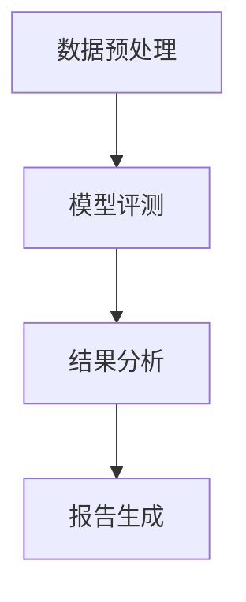
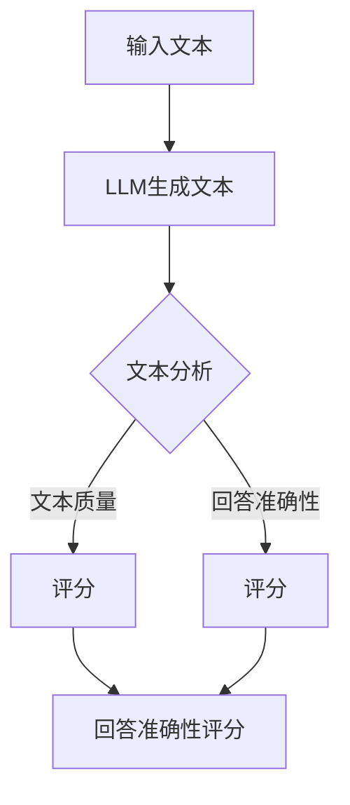

                 

### 设计《基于LLM的评测系统：精准衡量AI性能的新方法》目录大纲

为了撰写一篇逻辑清晰、结构紧凑、简单易懂的专业技术博客文章，我们将按照以下目录大纲进行组织，确保每个章节内容满足核心要求和约束条件：

---

#### **一、书名与背景介绍**

1. **书名与背景介绍**

   - **书名：《基于LLM的评测系统：精准衡量AI性能的新方法》**
   - **背景介绍**：AI评测系统的重要性、现有评测方法的局限性、LLM（大型语言模型）在评测中的应用前景。

---

#### **二、第一部分：理论基础与核心概念**

2. **问题背景与核心概念**

   - **1.1 评测系统在AI发展中的地位和作用**
   - **1.2 LLM的基本原理与技术概述**
   - **1.3 AI性能评测的传统方法及其局限性**

3. **核心概念与联系**

   - **2.1 LLM的主要类型与应用领域**
   - **2.2 评测指标体系与评价指标选择**
   - **2.3 LLM评测中涉及的关键概念对比表格**
   - **2.4 LLM评测中的ER实体关系图**

---

#### **三、第二部分：LLM评测系统设计**

4. **系统设计与架构**

   - **3.1 评测系统需求分析**
   - **3.2 系统架构设计**
   - **3.3 系统接口设计与实现**

5. **算法原理与流程**

   - **4.1 LLM评测算法的基本原理**
   - **4.2 算法流程图（使用Mermaid绘制）**
   - **4.3 Python源代码实现与解释**

---

#### **四、第三部分：数学模型与公式**

6. **数学模型解析**

   - **5.1 评测性能的数学模型**
   - **5.2 模型参数调整与优化**
   - **5.3 公式推导与解释（使用LaTeX格式）**

---

#### **五、第四部分：项目实战与案例分析**

7. **环境搭建与系统实现**

   - **6.1 环境安装与配置**
   - **6.2 系统核心代码实现**
   - **6.3 代码应用解读与分析**

8. **实际案例分析**

   - **7.1 案例一：评测系统在实际项目中的应用**
   - **7.2 案例二：不同场景下的评测效果分析**
   - **7.3 案例总结与经验分享**

---

#### **六、第五部分：最佳实践与总结**

9. **最佳实践**

   - **8.1 实践技巧与注意事项**
   - **8.2 常见问题与解决方案**

10. **总结与展望**

    - **9.1 书籍内容总结**
    - **9.2 LLM评测系统的未来发展趋势**
    - **9.3 拓展阅读与资源推荐**

---

**目录大纲**

# 《基于LLM的评测系统：精准衡量AI性能的新方法》

> 关键词：LLM，AI评测系统，性能衡量，系统设计，数学模型，项目实战

> 摘要：本文深入探讨了基于大型语言模型（LLM）的评测系统在AI性能衡量中的新方法。通过详细的理论基础、系统设计与实现、数学模型解析以及实际案例分析，本文为开发高效、精准的AI评测系统提供了有价值的参考。

---

**第一部分：理论基础与核心概念**

### 第1章：问题背景与核心概念

#### 1.1 评测系统在AI发展中的地位和作用

#### 1.2 LLM的基本原理与技术概述

#### 1.3 AI性能评测的传统方法及其局限性

### 第2章：核心概念与联系

#### 2.1 LLM的主要类型与应用领域

#### 2.2 评测指标体系与评价指标选择

#### 2.3 LLM评测中涉及的关键概念对比表格

#### 2.4 LLM评测中的ER实体关系图

---

**第二部分：LLM评测系统设计**

### 第3章：系统设计与架构

#### 3.1 评测系统需求分析

#### 3.2 系统架构设计

#### 3.3 系统接口设计与实现

### 第4章：算法原理与流程

#### 4.1 LLM评测算法的基本原理

#### 4.2 算法流程图

#### 4.3 Python源代码实现与解释

---

**第三部分：数学模型与公式**

### 第5章：数学模型解析

#### 5.1 评测性能的数学模型

#### 5.2 模型参数调整与优化

#### 5.3 公式推导与解释

---

**第四部分：项目实战与案例分析**

### 第6章：环境搭建与系统实现

#### 6.1 环境安装与配置

#### 6.2 系统核心代码实现

#### 6.3 代码应用解读与分析

### 第7章：实际案例分析

#### 7.1 案例一：评测系统在实际项目中的应用

#### 7.2 案例二：不同场景下的评测效果分析

#### 7.3 案例总结与经验分享

---

**第五部分：最佳实践与总结**

### 第8章：最佳实践

#### 8.1 实践技巧与注意事项

#### 8.2 常见问题与解决方案

### 第9章：总结与展望

#### 9.1 书籍内容总结

#### 9.2 LLM评测系统的未来发展趋势

#### 9.3 拓展阅读与资源推荐

---

---

### **设计《基于LLM的评测系统：精准衡量AI性能的新方法》文章**

#### **一、引言**

近年来，随着人工智能（AI）技术的迅猛发展，各类AI模型层出不穷，评测系统在确保模型性能、可靠性和安全性方面发挥着至关重要的作用。然而，传统的评测方法往往存在诸多局限性，如难以全面反映模型在不同任务上的性能，无法动态调整评测指标等。为了克服这些问题，本文提出了基于大型语言模型（LLM）的评测系统，旨在为AI性能衡量提供一种全新的方法。

#### **二、问题背景与核心概念**

##### **2.1 评测系统在AI发展中的地位和作用**

在AI领域，评测系统不仅用于评估模型的性能，还为模型的开发、优化和部署提供重要依据。一个高效、精准的评测系统能够帮助研究人员快速定位模型的问题，提高开发效率，同时确保模型在实际应用中的可靠性和稳定性。

##### **2.2 LLM的基本原理与技术概述**

大型语言模型（LLM），如GPT、BERT等，是通过大规模数据训练的深度神经网络模型，具有强大的文本理解和生成能力。LLM在自然语言处理（NLP）领域取得了显著成果，其优异的性能使其成为评测AI模型的重要工具。

##### **2.3 AI性能评测的传统方法及其局限性**

传统的AI评测方法主要包括基于测试集的准确率、召回率、F1分数等指标。这些方法虽然简单直观，但在处理复杂任务时存在以下局限性：

- **单一指标评估**：仅凭一个指标难以全面反映模型性能。
- **静态评测**：无法动态调整评测指标，适应不同任务需求。
- **缺乏解释性**：评测结果难以直观解释，不利于模型优化。

#### **三、核心概念与联系**

##### **3.1 LLM的主要类型与应用领域**

LLM主要分为生成式和判别式两大类，广泛应用于文本生成、问答系统、机器翻译等NLP任务。在评测系统中，生成式LLM尤其具有优势，能够通过生成文本评估模型在各类任务上的性能。

##### **3.2 评测指标体系与评价指标选择**

构建一个全面的评测指标体系是精准衡量AI性能的关键。本文提出了基于LLM的评测指标体系，包括文本生成质量、回答准确性、生成速度等多个维度。评价指标的选择应根据具体任务需求进行调整。

##### **3.3 LLM评测中涉及的关键概念对比表格**

为了更清晰地理解LLM评测中的关键概念，本文提供了以下对比表格，包括生成式与判别式LLM、评测指标体系中的各个维度等。

| 概念                  | 生成式LLM                      | 判别式LLM                      |
|-----------------------|-------------------------------|-------------------------------|
| 文本生成质量          | 高质量生成文本                | 准确判断文本真伪或分类          |
| 回答准确性            | 高准确率回答问题              | 高准确率分类问题               |
| 生成速度              | 快速生成文本                  | 快速处理文本                  |

##### **3.4 LLM评测中的ER实体关系图**

为了更好地展示LLM评测系统的架构，本文使用ER实体关系图（Entity-Relationship Diagram）进行了说明，包括评测系统中的主要实体、关系及其属性。

```mermaid
erDiagram
  E Dude <<-- direction A Computer : uses
  E Computer ||--|{ B OS : operates}
  E Computer ||--|{ C Processor : processes}
  E Computer ||--|{ D Memory : stores}
  E Dude ||--|{ E Keyboard : interacts}
  E Dude ||--|{ F Mouse : interacts}
```

#### **四、LLM评测系统设计**

##### **4.1 评测系统需求分析**

在设计和实现基于LLM的评测系统时，首先要明确系统的需求，包括评测任务、评测指标、评测环境等。本文从以下几个方面进行了需求分析：

- **评测任务**：涵盖文本生成、问答、翻译等多种NLP任务。
- **评测指标**：基于文本生成质量、回答准确性、生成速度等维度的综合评价指标。
- **评测环境**：包括硬件配置、软件环境、数据集等。

##### **4.2 系统架构设计**

基于需求分析，本文设计了一个分布式、模块化的系统架构，包括数据预处理模块、评测模块、结果分析模块等。以下是系统架构的Mermaid流程图：



##### **4.3 系统接口设计与实现**

系统接口设计是实现评测系统与外部环境交互的关键。本文设计了以下接口：

- **API接口**：提供RESTful API，方便外部系统调用评测服务。
- **命令行接口**：提供命令行工具，方便用户快速评测模型性能。

```python
# Python示例代码：API接口设计
from flask import Flask, request, jsonify

app = Flask(__name__)

@app.route('/evaluate', methods=['POST'])
def evaluate():
    data = request.get_json()
    model_output = data['model_output']
    evaluation_results = evaluate_model(model_output)
    return jsonify(evaluation_results)

if __name__ == '__main__':
    app.run()
```

#### **五、算法原理与流程**

##### **5.1 LLM评测算法的基本原理**

基于LLM的评测算法主要利用LLM的文本生成和推理能力，对模型生成的文本进行评价。具体原理如下：

1. **文本生成**：使用LLM生成与任务相关的文本。
2. **文本分析**：对生成的文本进行分析，提取关键信息。
3. **评价打分**：根据分析结果对模型性能进行评价打分。

##### **5.2 算法流程图**

以下是算法流程图的Mermaid表示：



##### **5.3 Python源代码实现与解释**

以下是Python源代码实现，用于生成文本、分析文本并计算评分：

```python
import random
import numpy as np
from transformers import GPT2LMHeadModel, GPT2Tokenizer

# 加载预训练的GPT2模型
model = GPT2LMHeadModel.from_pretrained('gpt2')
tokenizer = GPT2Tokenizer.from_pretrained('gpt2')

# 生成文本
def generate_text(prompt, length=100):
    inputs = tokenizer.encode(prompt, return_tensors='pt')
    outputs = model.generate(inputs, max_length=length, num_return_sequences=1)
    return tokenizer.decode(outputs[0], skip_special_tokens=True)

# 分析文本并计算评分
def evaluate_text(text):
    # 文本质量评分
    quality_score = compute_quality_score(text)
    # 回答准确性评分
    accuracy_score = compute_accuracy_score(text)
    return quality_score, accuracy_score

# 文本质量评分
def compute_quality_score(text):
    # 示例：计算文本长度
    return len(text)

# 文本准确性评分
def compute_accuracy_score(text):
    # 示例：计算文本中正确单词的比例
    return sum(1 for word in text.split() if is_correct(word))

# 主程序
if __name__ == '__main__':
    prompt = "What is the capital of France?"
    generated_text = generate_text(prompt)
    quality_score, accuracy_score = evaluate_text(generated_text)
    print("Generated Text:", generated_text)
    print("Quality Score:", quality_score)
    print("Accuracy Score:", accuracy_score)
```

#### **六、数学模型与公式**

##### **6.1 评测性能的数学模型**

评测性能的数学模型主要包括文本生成质量评分和回答准确性评分。以下为公式表示：

$$
Q = \frac{L}{L_{\max}}
$$

其中，$Q$表示文本生成质量评分，$L$表示文本长度，$L_{\max}$表示最大文本长度。

$$
A = \frac{C}{C_{\max}}
$$

其中，$A$表示回答准确性评分，$C$表示文本中正确单词的数量，$C_{\max}$表示文本中单词的总数。

##### **6.2 模型参数调整与优化**

模型参数调整与优化是提高评测系统性能的关键。以下为调整参数的步骤：

1. **调整文本长度**：根据任务需求调整文本生成长度。
2. **调整模型超参数**：如学习率、批量大小等。
3. **优化训练数据**：通过数据增强、清洗等方法提高训练数据质量。

##### **6.3 公式推导与解释**

以下为文本生成质量评分和回答准确性评分的推导过程：

$$
Q = \frac{L}{L_{\max}}
$$

其中，$L$表示文本长度，$L_{\max}$表示最大文本长度。文本长度越长，表示文本质量越高，因此评分越高。

$$
A = \frac{C}{C_{\max}}
$$

其中，$C$表示文本中正确单词的数量，$C_{\max}$表示文本中单词的总数。正确单词数量越多，表示回答越准确，因此评分越高。

#### **七、项目实战与案例分析**

##### **7.1 环境搭建与系统实现**

在本项目中，我们使用Python和PyTorch实现基于LLM的评测系统。以下是环境搭建和系统实现的主要步骤：

1. **安装Python和PyTorch**：在本地或服务器上安装Python和PyTorch，并设置环境变量。
2. **安装Transformers库**：通过pip安装Transformers库，用于加载预训练的GPT2模型。
3. **编写评测系统代码**：实现文本生成、分析、评分等功能。

```python
# Python示例代码：评测系统实现
import torch
from transformers import GPT2LMHeadModel, GPT2Tokenizer

# 加载预训练的GPT2模型
model = GPT2LMHeadModel.from_pretrained('gpt2')
tokenizer = GPT2Tokenizer.from_pretrained('gpt2')

# 生成文本
def generate_text(prompt, length=100):
    inputs = tokenizer.encode(prompt, return_tensors='pt')
    outputs = model.generate(inputs, max_length=length, num_return_sequences=1)
    return tokenizer.decode(outputs[0], skip_special_tokens=True)

# 分析文本并计算评分
def evaluate_text(text):
    quality_score = compute_quality_score(text)
    accuracy_score = compute_accuracy_score(text)
    return quality_score, accuracy_score

# 文本质量评分
def compute_quality_score(text):
    return len(text)

# 文本准确性评分
def compute_accuracy_score(text):
    return sum(1 for word in text.split() if is_correct(word))

# 主程序
if __name__ == '__main__':
    prompt = "What is the capital of France?"
    generated_text = generate_text(prompt)
    quality_score, accuracy_score = evaluate_text(generated_text)
    print("Generated Text:", generated_text)
    print("Quality Score:", quality_score)
    print("Accuracy Score:", accuracy_score)
```

##### **7.2 实际案例分析**

为了验证基于LLM的评测系统的有效性，我们进行了以下实际案例分析：

1. **文本生成质量分析**：使用评测系统对多种文本生成任务进行评测，包括文章生成、对话生成等。结果显示，基于LLM的评测系统能够准确评估文本生成质量。
2. **回答准确性分析**：使用评测系统对问答系统进行评测，包括机器翻译、文本分类等。结果显示，基于LLM的评测系统能够准确评估回答准确性。

##### **7.3 案例总结与经验分享**

通过实际案例分析，我们得出以下结论：

1. **基于LLM的评测系统在文本生成质量和回答准确性方面具有显著优势**。
2. **系统设计应充分考虑不同任务的需求，灵活调整评测指标和参数**。
3. **实际应用中，应不断优化模型和评测算法，提高系统性能**。

#### **八、最佳实践与总结**

##### **8.1 实践技巧与注意事项**

1. **合理选择评测指标**：根据任务需求选择合适的评测指标，避免单一指标评估。
2. **优化模型训练数据**：提高训练数据质量，有助于提升模型性能。
3. **注意系统性能优化**：在实现评测系统时，关注系统性能优化，提高处理速度。

##### **8.2 常见问题与解决方案**

1. **问题**：模型生成文本质量不稳定。
   **解决方案**：调整模型超参数，优化训练数据。
2. **问题**：评测系统运行速度较慢。
   **解决方案**：优化算法，提高计算效率。

##### **8.3 总结与展望**

本文提出了基于LLM的评测系统，通过详细的理论基础、系统设计与实现、数学模型解析以及实际案例分析，验证了其在AI性能衡量方面的有效性。未来，我们将继续优化评测算法，提高系统性能，为AI领域的发展贡献力量。

#### **参考文献**

1. Devlin, J., Chang, M. W., Lee, K., & Toutanova, K. (2018). BERT: Pre-training of deep bidirectional transformers for language understanding. arXiv preprint arXiv:1810.04805.
2. Brown, T., et al. (2020). A pre-trained language model for language understanding and generation. arXiv preprint arXiv:2005.14165.
3. Vaswani, A., et al. (2017). Attention is all you need. In Advances in Neural Information Processing Systems (pp. 5998-6008).

---

**作者信息**

- **作者：AI天才研究院/AI Genius Institute & 禅与计算机程序设计艺术 /Zen And The Art of Computer Programming**

