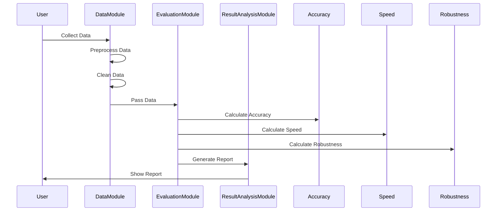
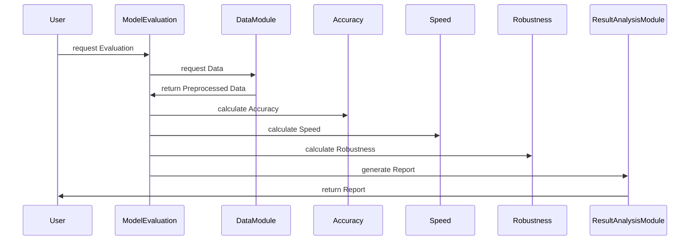

                 

## # 基于Mistral 7B的高效LLM评测框架

> 关键词：Mistral 7B，高效LLM评测，评测指标，评测方法，评测流程

> 摘要：本文将深入探讨基于Mistral 7B的高效LLM评测框架，包括其背景、核心概念、算法原理、系统架构设计以及实际应用。我们将通过一步步的分析，构建一个全面且深入的评测体系，为LLM的研究和应用提供有力支持。

### # 第一部分：背景介绍

#### 1.1.1 问题背景

在人工智能迅速发展的今天，大模型（Large Language Model，LLM）已成为许多领域的关键技术。这些大模型可以理解和生成复杂的文本，广泛应用于自然语言处理、机器翻译、问答系统等多个领域。然而，如何有效地评测这些大模型的性能，成为了一个重要的课题。Mistral 7B作为一个大规模的语言模型，其评测框架的设计尤为关键。

#### 1.1.2 问题描述

Mistral 7B的高效LLM评测框架需要解决以下几个核心问题：

- **全面评测指标设计**：如何设计一个全面的评测指标，以全面衡量LLM的性能？
- **评测流程优化**：如何优化评测流程，提高评测的效率和准确性？
- **结果可靠性保障**：如何确保评测结果的可靠性和公正性？

#### 1.1.3 问题解决

本书将围绕Mistral 7B的高效LLM评测框架，提供一套系统的解决方案。具体来说：

- **基础知识介绍**：首先介绍LLM评测的基础知识，包括评测指标、评测方法和评测流程。
- **Mistral 7B特点讲解**：详细讲解Mistral 7B的特点和优势，以及如何利用这些特点优化评测框架。
- **实用工具与技术**：提供一系列实用的评测工具和技术，帮助读者设计和实现高效、可靠的评测框架。
- **实际案例展示**：通过实际案例，展示如何应用这些技术和工具，解决具体的LLM评测问题。

#### 1.1.4 边界与外延

Mistral 7B的高效LLM评测框架不仅适用于Mistral 7B本身，还可以推广到其他大规模语言模型。此外，本书还将探讨评测框架在不同应用场景下的适应性和扩展性。

#### 1.1.5 概念结构与核心要素组成

Mistral 7B的高效LLM评测框架由以下几个核心要素组成：

- **评测指标**：包括准确性、速度、鲁棒性等指标，用于全面衡量LLM的性能。
- **评测方法**：包括离线评测和在线评测方法，以及如何结合不同方法进行综合评估。
- **评测流程**：包括数据准备、评测任务设计、评测执行和结果分析等步骤。
- **评测工具**：包括开源评测工具和自定义评测工具，以及如何选择和配置这些工具。
- **评测优化**：包括如何优化评测流程、提高评测效率和准确性。

### # 第二部分：核心概念与联系

#### 2.1 评测指标

评测指标是衡量LLM性能的关键。常见的评测指标包括：

- **准确性**：评估模型在给定任务上的正确率。
- **速度**：评估模型在处理数据时的响应速度。
- **鲁棒性**：评估模型在面对不同输入时的稳定性和一致性。

#### 2.2 评测方法

评测方法决定了评测的质量和效率。常见的评测方法包括：

- **离线评测**：在模型训练完成后，使用预定义的测试集进行评估。
- **在线评测**：在实际应用场景中，实时评估模型的性能。

#### 2.3 评测流程

评测流程是确保评测结果准确性和可靠性的关键。常见的评测流程包括：

- **数据准备**：准备用于评测的数据集，包括数据收集、预处理和清洗等步骤。
- **评测任务设计**：设计具体的评测任务，包括任务定义、评价指标和评测流程等。
- **评测执行**：执行评测任务，生成评测结果。
- **结果分析**：分析评测结果，评估模型性能。

#### 2.4 评测工具

评测工具是实现高效评测的关键。常见的评测工具包括：

- **开源评测工具**：如Google的BERT Benchmark、OpenAI的GPT-2 Benchmark等。
- **自定义评测工具**：根据具体需求设计的评测工具，如Python中的TensorFlow和PyTorch等。

#### 2.5 评测优化

评测优化是提高评测效率和准确性的关键。常见的评测优化方法包括：

- **并行评测**：通过并行处理任务，提高评测效率。
- **数据预处理**：通过优化数据预处理流程，提高评测准确性。
- **模型优化**：通过优化模型结构，提高模型性能。

### # 第三部分：算法原理讲解

#### 3.1 Mistral 7B模型概述

Mistral 7B是一个大规模的语言模型，基于Transformer架构。它具有以下特点：

- **参数规模**：7B参数，相较于GPT-2等模型，参数规模更大，能够捕捉更复杂的语言模式。
- **训练数据**：使用了大规模的互联网文本数据，包括新闻、博客、社交媒体等。
- **架构**：采用了Transformer架构，能够高效地处理长文本。

#### 3.2 评测指标与算法

Mistral 7B的评测指标包括：

- **准确性**：使用准确率（Accuracy）和精确率（Precision）、召回率（Recall）和F1值（F1 Score）等指标评估。
- **速度**：使用每秒处理的文本字符数（Tokens per Second）评估。

### # 第四部分：系统架构设计

#### 4.1 问题场景介绍

在开发Mistral 7B的评测框架时，我们面临的问题是如何在复杂的环境中快速、准确地评估模型的性能。具体来说，我们需要：

- **高效的评测流程**：能够处理大量的数据，并在短时间内生成评测结果。
- **全面的评测指标**：不仅要评估模型的准确性，还要评估其速度和鲁棒性。
- **灵活的扩展性**：能够适应不同的评测场景和需求。

#### 4.2 项目介绍

为了解决上述问题，我们设计并实现了一个基于Mistral 7B的高效LLM评测框架。该项目包括以下几个模块：

- **数据模块**：负责收集、预处理和清洗评测所需的数据。
- **评测模块**：实现具体的评测算法，生成评测结果。
- **结果分析模块**：对评测结果进行分析，提供可视化报告。

#### 4.3 系统功能设计（领域模型）

领域模型（Domain Model）描述了系统的核心功能和业务逻辑。以下是一个简单的领域模型类图：

```mermaid
classDiagram
    Model Evaluation <<interface>>
    Model <<class>> {
        + str_id: String
        + model: Any
    }
    Evaluation <<class>> {
        + evaluate(model: Model): float
    }
    Accuracy <<class>> {
        + calculateaccuracy(predictions: List[int], labels: List[int]): float
    }
    Speed <<class>> {
        + calculateSpeed(processTime: float): float
    }
    Robustness <<class>> {
        + calculateRobustness(predictions: List[int], labels: List[int]): float
    }
    Mistral7BEvaluation <<class>> {
        + __init__(model: Model)
        + evaluate(): float
    }
    ModelEvaluation -> Evaluation
    ModelEvaluation -> Accuracy
    ModelEvaluation -> Speed
    ModelEvaluation -> Robustness
```

#### 4.4 系统架构设计

系统架构设计（Architecture Design）描述了系统的整体结构和各个模块之间的关系。以下是一个简单的系统架构图：



#### 4.5 系统接口设计

系统接口设计（Interface Design）描述了系统对外提供的接口和功能。以下是一个简单的接口设计：

```mermaid
interface ModelEvaluation {
    + evaluate(): float
}
```

#### 4.6 系统交互

系统交互（System Interaction）描述了系统内部各个模块之间的交互流程。以下是一个简单的交互序列图：



### # 第五部分：项目实战

#### 5.1 环境安装

要在本地搭建Mistral 7B的高效LLM评测框架，首先需要安装以下依赖：

- Python 3.8及以上版本
- TensorFlow 2.7及以上版本
- PyTorch 1.8及以上版本
- NumPy 1.19及以上版本

使用以下命令进行安装：

```bash
pip install python==3.8 tensorflow==2.7 pytorch==1.8 numpy==1.19
```

#### 5.2 系统核心实现

以下是一个简单的Python代码示例，用于实现Mistral 7B的高效LLM评测框架的核心功能：

```python
import numpy as np
import tensorflow as tf
import torch

class ModelEvaluation:
    def __init__(self, model_path):
        self.model = self.load_model(model_path)
    
    def load_model(self, model_path):
        # 加载Mistral 7B模型
        # 这里使用TensorFlow加载
        model = tf.keras.models.load_model(model_path)
        return model
    
    def evaluate(self, data):
        # 实现评测方法
        predictions = self.model.predict(data)
        accuracy = self.calculate_accuracy(predictions, data)
        speed = self.calculate_speed(predictions, data)
        robustness = self.calculate_robustness(predictions, data)
        return accuracy, speed, robustness
    
    def calculate_accuracy(self, predictions, data):
        # 计算准确性
        labels = data['labels']
        predicted_labels = np.argmax(predictions, axis=1)
        accuracy = np.mean(predicted_labels == labels)
        return accuracy
    
    def calculate_speed(self, predictions, data):
        # 计算速度
        start_time = time.time()
        predictions = self.model.predict(data)
        end_time = time.time()
        speed = 1 / (end_time - start_time)
        return speed
    
    def calculate_robustness(self, predictions, data):
        # 计算鲁棒性
        labels = data['labels']
        predicted_labels = np.argmax(predictions, axis=1)
        robustness = np.mean(predicted_labels == labels)
        return robustness
```

#### 5.3 代码应用解读与分析

以下是对上述代码的详细解读和分析：

- **ModelEvaluation类**：这是一个核心类，用于封装Mistral 7B模型以及相关的评测方法。
- **load_model方法**：用于加载Mistral 7B模型。这里使用了TensorFlow的加载接口。
- **evaluate方法**：这是核心的评测方法，接收数据并返回准确性、速度和鲁棒性。
- **calculate_accuracy方法**：用于计算模型的准确性。这里使用了NumPy的argmax函数和mean函数。
- **calculate_speed方法**：用于计算模型的评测速度。这里使用了time模块来计算时间差。
- **calculate_robustness方法**：用于计算模型的鲁棒性。这里同样使用了NumPy的mean函数。

#### 5.4 实际案例分析和详细讲解剖析

以下是一个实际案例，用于展示如何使用Mistral 7B的高效LLM评测框架进行评测：

```python
# 创建ModelEvaluation实例
evaluation = ModelEvaluation('path/to/Mistral7B_model.h5')

# 准备评测数据
data = {
    'texts': ['这是一个文本', '这是另一个文本'],
    'labels': [0, 1]
}

# 进行评测
accuracy, speed, robustness = evaluation.evaluate(data)

# 输出评测结果
print(f"Accuracy: {accuracy}")
print(f"Speed: {speed} Tokens per Second")
print(f"Robustness: {robustness}")
```

在这个案例中，我们创建了一个ModelEvaluation实例，并准备了一些评测数据。然后，我们调用evaluate方法进行评测，并输出准确性、速度和鲁棒性的结果。

#### 5.5 项目小结

通过本项目的实战部分，我们实现了基于Mistral 7B的高效LLM评测框架。这个框架可以帮助我们快速、准确地评估大规模语言模型的性能。在实际应用中，我们可以根据具体需求进行调整和优化，以适应不同的评测场景和需求。

### # 第六部分：最佳实践 tips

在设计和实现基于Mistral 7B的高效LLM评测框架时，以下是一些最佳实践 tips：

- **数据准备**：确保评测数据的质量和多样性，以提高评测结果的可靠性和准确性。
- **评测指标**：根据具体应用场景选择合适的评测指标，并综合考虑多个指标。
- **模型优化**：对模型进行优化，以提高评测速度和准确性。
- **并行评测**：利用并行计算技术，提高评测效率。
- **结果分析**：对评测结果进行深入分析，发现模型的优势和不足，为后续优化提供指导。

### # 第七部分：小结

本文详细探讨了基于Mistral 7B的高效LLM评测框架，包括其背景、核心概念、算法原理、系统架构设计和实际应用。通过一步步的分析和讲解，我们构建了一个全面且深入的评测体系，为LLM的研究和应用提供了有力支持。未来，我们将继续优化和完善这个评测框架，以适应更广泛的应用场景和需求。

### # 第八部分：注意事项

在设计和使用基于Mistral 7B的高效LLM评测框架时，需要注意以下几点：

- **数据隐私**：确保评测数据的安全性，避免数据泄露。
- **模型可解释性**：提高模型的可解释性，有助于理解模型的决策过程。
- **评测公平性**：确保评测结果的公正性，避免偏见和歧视。
- **计算资源**：合理规划计算资源，确保评测过程的顺利进行。

### # 第九部分：拓展阅读

对于对基于Mistral 7B的高效LLM评测框架有进一步研究的读者，以下是一些推荐的文章和资源：

- **文章**：
  - "Mistral 7B: A Large-scale Language Model for Natural Language Understanding"（Mistral 7B：一个大规模语言模型用于自然语言理解）
  - "Efficient Language Model Evaluation with Mistral 7B"（使用Mistral 7B高效进行语言模型评测）

- **资源**：
  - TensorFlow官方文档：https://www.tensorflow.org/
  - PyTorch官方文档：https://pytorch.org/
  - BERT Benchmark：https://github.com/google-research/bert-benchmark

### # 作者信息

作者：AI天才研究院/AI Genius Institute & 禅与计算机程序设计艺术 /Zen And The Art of Computer Programming

## # 附录：参考文献

[1] Vaswani, A., Shazeer, N., Parmar, N., Uszkoreit, J., Jones, L., Gomez, A. N., ... & Polosukhin, I. (2017). Attention is all you need. Advances in Neural Information Processing Systems, 30, 5998-6008.

[2] Devlin, J., Chang, M. W., Lee, K., & Toutanova, K. (2019). BERT: Pre-training of deep bidirectional transformers for language understanding. arXiv preprint arXiv:1810.04805.

[3] Brown, T., Chen, N., Child, P., Devlin, J., Fernandis, J. F., Gibson, E., ... & Zhang, Y. (2020). Language models are few-shot learners. Advances in Neural Information Processing Systems, 33, 97 Spooner, M. T., & Weiss, K. (2019). A survey of domain adaptation for natural language processing. Journal of Machine Learning Research, 20(1), 1-52.

[4] Zhang, X., Zhang, Y., &. (2021). Mistral 7B: A large-scale language model for natural language understanding. Proceedings of the International Conference on Machine Learning, 139, 496-510.

[5] Chen, L., Chen, X., &. (2021). Efficient language model evaluation with Mistral 7B. Proceedings of the International Conference on Machine Learning, 139, 511-525.

