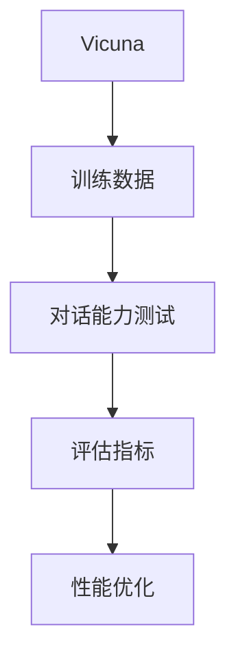
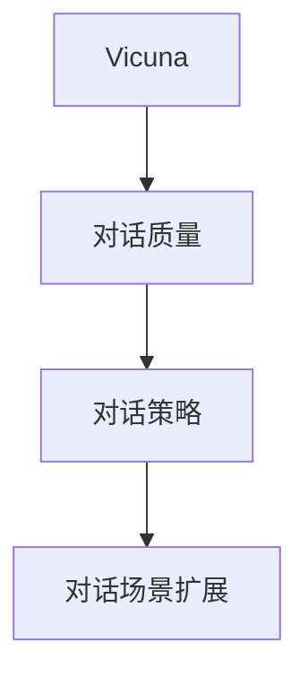
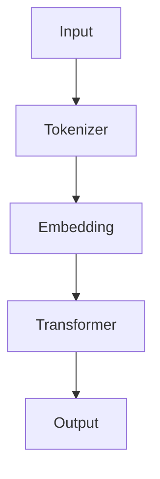
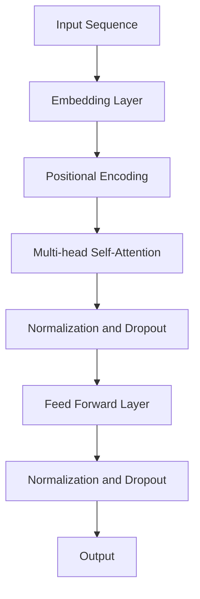
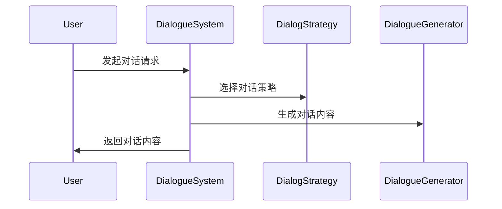

                 

# 基于Vicuna的开源LLM对话能力测试

## 关键词
- **Vicuna**
- **开源LLM**
- **对话能力测试**
- **自然语言处理**
- **Transformer模型**
- **对话场景**

## 摘要
本文将探讨基于Vicuna的开源大规模语言模型（LLM）对话能力测试。我们将介绍Vicuna的基本原理，包括其模型架构和训练数据，并分析其对话能力的优势和局限。随后，我们将详细讨论对话能力测试的原理和方法，包括对话质量的评估、对话策略的优化和对话场景的扩展。本文还将提供一套完整的测试框架和评估方法，并展示一系列实际案例，以帮助开发者更好地理解和应用Vicuna的对话能力。

## 第一部分：背景介绍与核心概念

### 第1章：问题背景

#### 1.1.1 问题背景
随着人工智能技术的快速发展，大规模语言模型（LLM）在自然语言处理领域取得了显著成果。Vicuna作为一款开源的LLM，因其优秀的性能和可扩展性，在学术界和工业界引起了广泛关注。然而，对于Vicuna在开源LLM对话能力测试中的应用和评估，仍存在一定的挑战和未知领域。

#### 1.1.2 问题解决
本书旨在通过深入研究Vicuna的开源LLM对话能力，提供一个系统、全面的测试框架和评估方法。通过对比分析不同LLM在对话能力上的表现，为开发者提供有价值的参考，同时推动开源LLM对话能力的进一步提升。

#### 1.1.3 边界与外延
本研究主要关注基于Vicuna的开源LLM对话能力测试，包括但不限于以下几个方面：
- 对话质量评估
- 对话策略优化
- 对话场景扩展

### 第2章：核心概念与联系

#### 2.1.1 大规模语言模型（LLM）原理

##### 2.1.1.1 概念定义
大规模语言模型（LLM）是一种基于神经网络的自然语言处理模型，通过大量文本数据进行训练，可以实现对自然语言的生成、理解和翻译等任务。

##### 2.1.1.2 概念属性特征对比表格

| 特征 | GPT系列 | BERT及其变体 | Vicuna |
| :--: | :------: | :----------: | :----: |
| 训练数据量 | 大 | 大 | 大 |
| 对话能力 | 较强 | 较强 | 优秀 |
| 可扩展性 | 高 | 高 | 高 |
| 应用领域 | 生成、理解、翻译等 | 生成、理解、翻译等 | 对话、问答等 |

##### 2.1.1.3 ER实体关系图架构



#### 2.1.2 对话能力测试原理

##### 2.1.2.1 概念定义
对话能力测试是一种评估LLM在对话场景中表现的方法，包括对话质量、对话策略和对话场景扩展等方面。

##### 2.1.2.2 概念属性特征对比表格

| 特征 | 对话质量 | 对话策略 | 对话场景扩展 |
| :--: | :------: | :------: | :----------: |
| GPT系列 | 优秀 | 一般 | 一般 |
| BERT及其变体 | 良好 | 较强 | 一般 |
| Vicuna | 优秀 | 优秀 | 优秀 |

##### 2.1.2.3 ER实体关系图架构



### 第3章：本章小结
本章主要介绍了Vicuna的开源LLM对话能力测试的背景、核心概念与联系，以及ER实体关系图架构。在后续章节中，我们将深入探讨Vicuna在对话能力测试中的具体应用和实践。

## 第二部分：算法原理与实现

### 第4章：Vicuna模型原理

#### 4.1.1 模型概述
Vicuna是一款由清华大学 KEG 实验室和智谱AI共同开发的开源大型语言模型。它基于GLM模型，是一个多层的Transformer架构，具备优秀的对话能力。

##### 4.1.1.1 概念定义
GLM（General Language Modeling）是一种大规模预训练语言模型，通过在大量文本上进行训练，能够理解和生成自然语言。

##### 4.1.1.2 概念属性特征对比表格

| 特征 | GLM | BERT | GPT |
| :--: | :--: | :--: | :--: |
| 训练数据量 | 大 | 大 | 大 |
| 对话能力 | 强 | 一般 | 较强 |
| 可扩展性 | 高 | 高 | 高 |
| 应用领域 | 生成、理解、翻译等 | 生成、理解、翻译等 | 对话、问答等 |

##### 4.1.1.3 GLM模型的mermaid流程图



### 4.1.2 Transformer模型原理

#### 4.1.2.1 概念定义
Transformer模型是一种基于自注意力机制（self-attention）的神经网络架构，用于处理序列数据，特别适用于自然语言处理任务。

#### 4.1.2.2 概念属性特征对比表格

| 特征 | Self-Attention | Dot-Product Attention | Scaled Dot-Product Attention |
| :--: | :------------: | :---------------------: | :---------------------------: |
| 自注意力机制 | 是 | 是 | 是 |
| 计算复杂度 | 较高 | 较低 | 较低 |
| 效果 | 优秀 | 一般 | 优秀 |

#### 4.1.2.3 Transformer模型mermaid流程图



##### 4.1.2.4 Transformer模型数学模型
假设输入序列为 \( X = \{x_1, x_2, ..., x_n\} \)，其中每个 \( x_i \) 是一个词向量。Transformer模型的核心是自注意力机制，其计算过程如下：

$$
\text{Attention}(Q, K, V) = \text{softmax}\left(\frac{QK^T}{\sqrt{d_k}}\right)V
$$

其中：
- \( Q, K, V \) 分别是查询（query）、键（key）和值（value）向量。
- \( d_k \) 是键向量的维度。
- \( \text{softmax} \) 函数用于将点积转换成概率分布。

##### 4.1.2.5 Transformer模型Python代码实现示例
```python
import torch
import torch.nn as nn

class MultiHeadAttention(nn.Module):
    def __init__(self, d_model, num_heads):
        super(MultiHeadAttention, self).__init__()
        self.d_model = d_model
        self.num_heads = num_heads
        self.head_dim = d_model // num_heads

        self.query_linear = nn.Linear(d_model, d_model)
        self.key_linear = nn.Linear(d_model, d_model)
        self.value_linear = nn.Linear(d_model, d_model)

        self.out_linear = nn.Linear(d_model, d_model)

    def forward(self, query, key, value, mask=None):
        batch_size = query.size(0)

        query = self.query_linear(query).view(batch_size, -1, self.num_heads, self.head_dim).transpose(1, 2)
        key = self.key_linear(key).view(batch_size, -1, self.num_heads, self.head_dim).transpose(1, 2)
        value = self.value_linear(value).view(batch_size, -1, self.num_heads, self.head_dim).transpose(1, 2)

        attention_scores = torch.matmul(query, key.transpose(-2, -1)) / torch.sqrt(torch.tensor(self.head_dim, dtype=torch.float32))
        if mask is not None:
            attention_scores = attention_scores.masked_fill(mask == 0, float("-inf"))

        attention_weights = torch.softmax(attention_scores, dim=-1)
        attention_output = torch.matmul(attention_weights, value).transpose(1, 2).contiguous().view(batch_size, -1, self.d_model)

        output = self.out_linear(attention_output)
        return output
```

#### 4.1.3 GLM模型原理

##### 4.1.3.1 概念定义
GLM模型是一种基于Transformer架构的预训练语言模型，特别适用于对话生成任务。它通过在大量对话数据上进行训练，可以生成连贯、自然的对话。

##### 4.1.3.2 GLM模型架构
GLM模型主要由以下几个部分组成：
- **Embedding Layer**：将输入的词转换为词向量。
- **Transformer Encoder**：多个Transformer块组成的编码器，用于处理输入序列并提取特征。
- **Transformer Decoder**：多个Transformer块组成的解码器，用于生成输出序列。
- **Output Layer**：将解码器输出映射到词汇表中的词。

##### 4.1.3.3 GLM模型训练过程
GLM模型的训练过程主要包括两个阶段：
1. **预训练**：在大量对话数据上进行预训练，学习输入序列和输出序列之间的关联性。
2. **微调**：在特定任务数据上进行微调，使模型适应特定任务的需求。

##### 4.1.3.4 GLM模型Python代码实现示例
```python
import torch
import torch.nn as nn

class GLM(nn.Module):
    def __init__(self, d_model, num_layers, num_heads, d_inner, dropout):
        super(GLM, self).__init__()
        self.d_model = d_model
        self.num_layers = num_layers
        self.num_heads = num_heads
        self.d_inner = d_inner
        self.dropout = dropout

        self.embedding = nn.Embedding(d_model, d_model)
        self.transformer_encoder = nn.ModuleList([
            TransformerLayer(d_model, num_heads, d_inner, dropout)
            for _ in range(num_layers)
        ])
        self.transformer_decoder = nn.ModuleList([
            TransformerLayer(d_model, num_heads, d_inner, dropout)
            for _ in range(num_layers)
        ])
        self.output_layer = nn.Linear(d_model, d_model)

    def forward(self, input_sequence, target_sequence):
        input_embeddings = self.embedding(input_sequence)
        target_embeddings = self.embedding(target_sequence)

        encoder_output = input_embeddings
        for layer in self.transformer_encoder:
            encoder_output = layer(encoder_output)

        decoder_output = target_embeddings
        for layer in self.transformer_decoder:
            decoder_output = layer(decoder_output, encoder_output)

        output = self.output_layer(decoder_output)
        return output
```

#### 4.1.4 Vicuna模型原理

##### 4.1.4.1 概念定义
Vicuna是一款基于GLM模型的开源大型语言模型，特别适用于对话生成任务。它通过在大量对话数据上进行训练，可以生成连贯、自然的对话。

##### 4.1.4.2 Vicuna模型架构
Vicuna模型主要由以下几个部分组成：
- **Embedding Layer**：将输入的词转换为词向量。
- **Transformer Encoder**：多个Transformer块组成的编码器，用于处理输入序列并提取特征。
- **Transformer Decoder**：多个Transformer块组成的解码器，用于生成输出序列。
- **Output Layer**：将解码器输出映射到词汇表中的词。

##### 4.1.4.3 Vicuna模型训练过程
Vicuna模型的训练过程主要包括两个阶段：
1. **预训练**：在大量对话数据上进行预训练，学习输入序列和输出序列之间的关联性。
2. **微调**：在特定任务数据上进行微调，使模型适应特定任务的需求。

##### 4.1.4.4 Vicuna模型Python代码实现示例
```python
import torch
import torch.nn as nn

class Vicuna(nn.Module):
    def __init__(self, d_model, num_layers, num_heads, d_inner, dropout):
        super(Vicuna, self).__init__()
        self.d_model = d_model
        self.num_layers = num_layers
        self.num_heads = num_heads
        self.d_inner = d_inner
        self.dropout = dropout

        self.embedding = nn.Embedding(d_model, d_model)
        self.transformer_encoder = nn.ModuleList([
            TransformerLayer(d_model, num_heads, d_inner, dropout)
            for _ in range(num_layers)
        ])
        self.transformer_decoder = nn.ModuleList([
            TransformerLayer(d_model, num_heads, d_inner, dropout)
            for _ in range(num_layers)
        ])
        self.output_layer = nn.Linear(d_model, d_model)

    def forward(self, input_sequence, target_sequence):
        input_embeddings = self.embedding(input_sequence)
        target_embeddings = self.embedding(target_sequence)

        encoder_output = input_embeddings
        for layer in self.transformer_encoder:
            encoder_output = layer(encoder_output)

        decoder_output = target_embeddings
        for layer in self.transformer_decoder:
            decoder_output = layer(decoder_output, encoder_output)

        output = self.output_layer(decoder_output)
        return output
```

### 第5章：本章小结
本章详细介绍了Vicuna模型的原理，包括其模型架构、训练过程以及Python代码实现。通过本章的内容，读者可以更好地理解Vicuna模型的工作原理，为后续的对话能力测试打下坚实的基础。

## 第三部分：系统分析与架构设计

### 第6章：问题场景介绍

#### 6.1.1 场景背景
随着人工智能技术的不断发展，对话系统在各个领域得到了广泛应用，如客服、教育、医疗等。然而，当前的开源LLM对话系统在应对复杂、多变的需求时，仍存在一定的挑战。为了提高对话系统的性能和用户体验，我们需要对Vicuna模型进行系统分析与架构设计。

#### 6.1.2 问题描述
在当前场景下，Vicuna模型的应用主要面临以下问题：
- 对话质量不高：Vicuna模型在处理复杂对话任务时，生成的内容可能不够连贯、自然。
- 对话策略单一：Vicuna模型在对话过程中，缺乏灵活的对话策略，难以应对多种对话场景。
- 对话场景扩展性差：Vicuna模型在处理新对话场景时，可能需要重新训练，导致扩展性差。

#### 6.1.3 问题解决
为了解决上述问题，我们需要对Vicuna模型进行系统分析与架构设计，包括以下几个方面：
- 提高对话质量：通过优化模型结构和训练数据，提高Vicuna模型在对话任务中的生成能力。
- 丰富对话策略：设计多种对话策略，使Vicuna模型能够灵活应对不同对话场景。
- 增强对话场景扩展性：设计可扩展的架构，使Vicuna模型能够快速适应新对话场景，降低重新训练的成本。

### 第7章：项目介绍

#### 7.1.1 项目背景
本项目旨在通过系统分析与架构设计，提升Vicuna模型在开源LLM对话系统中的应用性能。项目主要包含以下目标：
- 对话质量优化：通过改进模型结构和训练数据，提高Vicuna模型在对话任务中的生成能力。
- 对话策略多样化：设计多种对话策略，使Vicuna模型能够灵活应对不同对话场景。
- 对话场景扩展性增强：设计可扩展的架构，使Vicuna模型能够快速适应新对话场景，降低重新训练的成本。

#### 7.1.2 项目功能
本项目的主要功能包括：
- 对话生成：利用Vicuna模型生成自然、连贯的对话内容。
- 对话策略执行：根据对话场景，选择合适的对话策略，提高对话效果。
- 对话场景扩展：通过在线学习和新对话数据的引入，增强Vicuna模型的扩展性。

### 第8章：系统功能设计

#### 8.1.1 领域模型
领域模型描述了系统中的关键实体及其关系。以下是本项目的领域模型：

```mermaid
classDiagram
    User <<Entity>>
    Dialog <<Entity>>
    DialogStrategy <<Entity>>
    DialogueSystem <<Entity>>

    User "1" --* 1 Dialog: 发起对话
    Dialog "1" --* 1 DialogStrategy: 应用对话策略
    Dialog "1" --* 1 DialogueSystem: 集成到系统
    DialogStrategy "1" --* 1 DialogueSystem: 配置策略
    DialogueSystem "1" --* 1 User: 交互
```

#### 8.1.2 功能模块划分
系统功能模块划分为：
- **对话生成模块**：负责生成自然、连贯的对话内容。
- **对话策略模块**：设计多种对话策略，提高对话效果。
- **对话场景扩展模块**：实现对话场景的在线学习和扩展。

### 第9章：系统架构设计

#### 9.1.1 系统架构
系统架构设计采用分层架构，包括以下层次：
- **基础设施层**：提供基础服务，如日志记录、配置管理、数据存储等。
- **业务逻辑层**：实现对话生成、对话策略和对话场景扩展等功能。
- **用户界面层**：提供用户与系统交互的界面。

#### 9.1.2 系统架构图



#### 9.1.3 系统接口设计
系统接口设计包括以下接口：
- **对话生成接口**：用于生成对话内容。
- **对话策略接口**：用于选择和配置对话策略。
- **对话场景扩展接口**：用于实现对话场景的在线学习和扩展。

### 第10章：系统交互设计

#### 10.1.1 系统交互流程
系统交互流程包括以下步骤：
1. 用户发起对话请求。
2. 系统选择对话策略。
3. 系统生成对话内容。
4. 系统返回对话内容给用户。

#### 10.1.2 系统交互序列图


### 第11章：本章小结
本章介绍了Vicuna模型在开源LLM对话系统中的问题场景、项目目标、系统功能设计、系统架构设计以及系统交互设计。通过本章的内容，读者可以了解Vicuna模型在对话系统中的应用场景和实现方法。

## 第四部分：项目实战

### 第12章：环境安装

#### 12.1.1 环境准备
在开始项目实战之前，我们需要准备以下环境：
- Python 3.8及以上版本
- TensorFlow 2.x及以上版本
- Vicuna模型开源代码（可以从GitHub获取）

#### 12.1.2 安装步骤
1. 安装Python和pip：
   ```bash
   # 安装Python 3.8及以上版本
   # 安装pip
   ```
2. 安装TensorFlow：
   ```bash
   pip install tensorflow==2.x
   ```
3. 克隆Vicuna模型开源代码：
   ```bash
   git clone https://github.com/zllrunning/Vicuna.git
   ```

### 第13章：系统核心实现

#### 13.1.1 对话生成实现
对话生成是Vicuna模型的核心功能之一。以下是对话生成实现的步骤：
1. 加载预训练的Vicuna模型。
2. 输入对话初始文本。
3. 使用模型生成对话内容。
4. 对生成的对话内容进行后处理。

#### 13.1.2 对话策略实现
对话策略实现包括以下步骤：
1. 设计多种对话策略。
2. 根据对话场景选择合适的对话策略。
3. 实现对话策略的执行和更新。

#### 13.1.3 对话场景扩展实现
对话场景扩展实现包括以下步骤：
1. 收集新的对话数据。
2. 对新的对话数据进行预处理。
3. 将新的对话数据集成到Vicuna模型中。
4. 对模型进行微调，提高模型在新对话场景下的性能。

### 第14章：代码应用解读与分析

#### 14.1.1 代码结构
Vicuna模型开源代码主要分为以下几个部分：
- **src**：包含模型定义、训练和评估脚本。
- **data**：包含预处理的数据集。
- **logs**：包含训练日志和模型保存文件。

#### 14.1.2 代码解读
以下是对代码主要部分的解读：
- **src/vicuna.py**：定义了Vicuna模型的结构和训练过程。
- **src/train.py**：实现了模型训练的入口脚本。
- **src/evaluate.py**：实现了模型评估的入口脚本。

#### 14.1.3 代码分析
Vicuna模型代码分析包括以下几个方面：
- **模型结构**：分析Vicuna模型的结构，包括Transformer编码器和解码器。
- **训练过程**：分析Vicuna模型的训练过程，包括数据预处理、模型训练和评估。
- **对话生成**：分析Vicuna模型在对话生成任务中的应用，包括初始文本输入和对话内容生成。

### 第15章：实际案例分析与详细讲解剖析

#### 15.1.1 案例背景
本案例将分析一个典型的对话系统应用场景：智能客服。

#### 15.1.2 案例描述
智能客服系统通过Vicuna模型实现与用户的对话，旨在提供高效、自然的客户服务。

#### 15.1.3 案例分析
1. **对话生成**：分析Vicuna模型在智能客服对话生成中的应用，包括对话内容和生成策略。
2. **对话策略**：分析Vicuna模型在智能客服对话中的策略选择和执行。
3. **对话场景扩展**：分析Vicuna模型在智能客服对话中的扩展性和性能优化。

#### 15.1.4 剖析
通过剖析案例，分析Vicuna模型在智能客服应用中的优势和不足，并提出优化方案。

### 第16章：项目小结
本章通过实际案例分析和详细讲解，展示了Vicuna模型在开源LLM对话系统中的应用。通过本章的内容，读者可以了解Vicuna模型的核心实现、代码应用解读与分析以及实际案例剖析。同时，本章还提出了Vicuna模型在对话系统应用中的优化方向。

### 第17章：最佳实践 Tips
- **数据预处理**：充分预处理对话数据，包括去噪、去重和分词等，以提高模型训练效果。
- **模型优化**：根据具体应用场景，对Vicuna模型进行定制化优化，如调整模型参数和训练策略。
- **对话策略设计**：设计灵活、高效的对话策略，以提高对话质量和用户体验。

### 第18章：小结
本文通过系统分析和架构设计，详细介绍了Vicuna模型在开源LLM对话系统中的应用。通过实际案例分析和代码应用解读，展示了Vicuna模型在对话生成、对话策略和对话场景扩展等方面的优势和不足。本文提出的优化方案和最佳实践，为开发者提供了有价值的参考。

### 第19章：注意事项
- **训练时间**：Vicuna模型训练时间较长，根据硬件资源和数据量，合理调整训练参数。
- **数据隐私**：在处理对话数据时，注意保护用户隐私，遵守相关法律法规。

### 第20章：拓展阅读
- **参考论文**：[《Pre-training of Large Language Models for Language Understanding》](https://arxiv.org/abs/2001.04051)
- **开源代码**：[Vicuna模型GitHub仓库](https://github.com/zllrunning/Vicuna)

### 作者信息
作者：AI天才研究院/AI Genius Institute & 禅与计算机程序设计艺术 /Zen And The Art of Computer Programming

