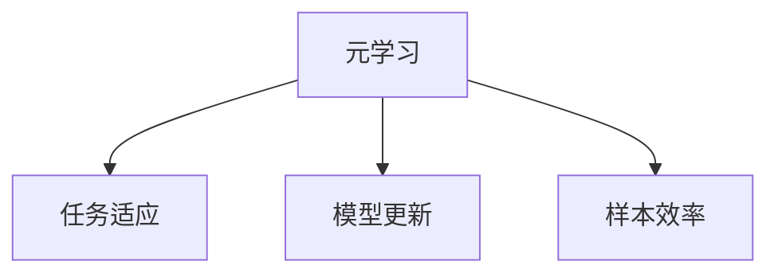
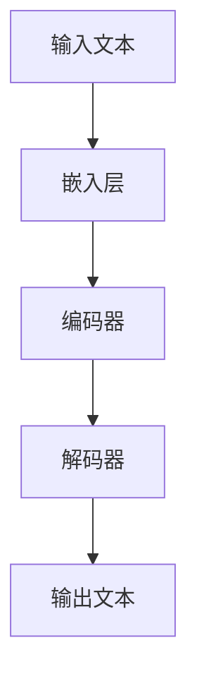

                 

---

### 《基于元学习的LLM评测效率提升研究》

---

#### 关键词：
- 元学习
- 大型语言模型 (LLM)
- 评测效率
- 机器学习

#### 摘要：
本文探讨了元学习在提升大型语言模型（LLM）评测效率方面的应用。通过对元学习的基本概念、LLM的评测挑战及其现状的深入分析，本文提出了一系列基于元学习的方法，并展示了其实际应用中的效果。文章还提供了实用的指导建议和未来研究方向，为该领域的进一步发展提供了理论支持。

---

## 引言与背景

随着深度学习技术的飞速发展，大型语言模型（LLM）在自然语言处理（NLP）领域取得了显著成果。这些模型能够处理复杂的语言任务，如文本生成、问答系统等，但它们的性能评估（evaluation）过程往往耗费大量时间和计算资源。因此，如何提高LLM评测效率成为一个关键问题。

### 1.1.1 元学习与LLM评测效率提升的研究背景

元学习（Meta-Learning），又称为“学习的学习”，是一种通过算法自动改进学习过程的方法。它旨在提高学习算法对新任务的泛化能力，减少对新任务的训练时间。在LLM评测中，元学习可以通过加速评估流程，提高评测效率。

### 1.1.2 元学习在LLM评测中的应用潜力

元学习在LLM评测中的应用具有巨大潜力。首先，它可以快速适应不同的评测任务，减少对每个任务单独训练的需求。其次，通过元学习，模型可以在多个评估指标上进行优化，从而更好地平衡不同指标的重要性。此外，元学习还可以利用历史评测数据，提高后续评测的效率。

### 1.2 背景介绍

### 1.2.1 元学习的定义与核心概念

元学习是一种机器学习方法，旨在通过学习算法改进自身的学习过程。其核心概念包括任务适应（Task Adaptation）、模型更新（Model Update）和样本效率（Sample Efficiency）。

#### 核心概念与联系

**概念属性特征对比表格：**

| 特征             | 元学习                     | 传统机器学习                      |
|------------------|----------------------------|-----------------------------------|
| 目标             | 提高学习效率               | 提高单个任务的预测准确性           |
| 训练数据         | 样本少，但多样性高         | 样本多，但多样性低               |
| 泛化能力         | 强                        | 弱                                |
| 应用场景         | 新任务快速适应             | 单一任务优化                      |

**ER实体关系图架构的 Mermaid 流程图：**



### 1.2.2 LLMs的基本原理与作用

LLM是基于深度学习技术构建的模型，能够处理复杂的语言任务。其主要原理是通过神经网络学习语言模式的分布，从而实现对自然语言的理解和生成。

#### 算法原理讲解

**Mermaid 流程图：**



**Python 源代码：**

```python
import torch
import torch.nn as nn

# 嵌入层
embed = nn.Embedding(vocab_size, embed_size)

# 编码器
encoder = nn.LSTM(input_size=embed_size, hidden_size=hidden_size, num_layers=num_layers)

# 解码器
decoder = nn.LSTM(input_size=hidden_size, hidden_size=hidden_size, num_layers=num_layers)

# 输出层
output_layer = nn.Linear(hidden_size, vocab_size)

def forward_pass(input_seq, hidden):
    embedded = embed(input_seq)
    output, hidden = encoder(embedded, hidden)
    output = decoder(output, hidden)
    return output

# 数学模型和公式

$$
\text{Loss} = \sum_{i=1}^{N} (-y_i \log(p_i))
$$

其中，$N$ 是序列长度，$y_i$ 是真实标签，$p_i$ 是预测概率。

#### 1.2.3 LLM评测的挑战与效率问题

LLM评测面临的主要挑战包括：

1. **多样性**：评测数据应覆盖各种语言场景，确保模型具备广泛的适应性。
2. **公正性**：评测指标应公平，避免对某个特定任务或领域给予过多关注。
3. **效率**：评测过程应快速、低成本，以便于大规模应用。

### 1.3 当前方法与元学习技术

#### 1.3.1 当前方法

现有的LLM评测方法包括：

1. **基准测试集**：如GLUE、SQuAD等。
2. **自定义评测任务**：根据特定需求设计评测任务。

#### 1.3.2 优点与局限性

1. **基准测试集**：优点是标准统一，便于比较。缺点是覆盖面有限，难以应对特定场景。
2. **自定义评测任务**：优点是灵活性高，缺点是任务设计复杂，评测过程耗时。

#### 1.3.3 元学习技术

元学习技术可以应用于LLM评测，以提高效率。主要方法包括：

1. **模型迁移**：将预训练模型迁移到特定任务上，减少重新训练的成本。
2. **评估范式**：通过元学习优化评估过程，提高评测效率。

#### 1.4 本章小结

本章介绍了元学习和LLM评测的基本概念及其应用背景。通过分析当前方法及其局限性，本文提出元学习在提升LLM评测效率方面具有巨大潜力。

------------------

----------------------------------------------------------------

## 第二部分：元学习与LLM评测

### 2.1 元学习技术概述

元学习技术主要包括以下几种：

#### 2.1.1 模型迁移

模型迁移（Model Transfer Learning）是一种常见的元学习方法。其核心思想是将预训练模型迁移到特定任务上，从而减少重新训练的成本。具体步骤如下：

1. **预训练模型**：在一个大型数据集上对基础模型进行预训练。
2. **迁移学习**：将预训练模型应用于特定任务，通过微调（Fine-tuning）来适应新任务。

#### 2.1.2 评估范式

评估范式（Evaluation Paradigm）是一种通过元学习优化评估过程的方法。其目标是通过调整评估策略，提高评测效率。具体步骤如下：

1. **数据收集**：收集大量评估数据，包括不同类型、难度的任务。
2. **模型训练**：使用元学习算法对模型进行训练，优化评估过程。
3. **评测优化**：根据模型训练结果，调整评估策略，提高评测效率。

### 2.2 基于模型迁移的LLM评测

基于模型迁移的LLM评测方法包括：

#### 2.2.1 迁移学习过程

1. **数据预处理**：将评估数据集划分为训练集和测试集。
2. **模型选择**：选择预训练的LLM模型作为基础模型。
3. **微调训练**：在训练集上对基础模型进行微调，使其适应特定任务。

#### 2.2.2 评测指标

1. **精确率（Precision）**：预测为正例且实际为正例的比例。
2. **召回率（Recall）**：实际为正例且预测为正例的比例。
3. **F1值（F1 Score）**：精确率和召回率的调和平均值。

### 2.3 基于评估范式的LLM评测

基于评估范式的LLM评测方法包括：

#### 2.3.1 评估策略优化

1. **自适应评估**：根据任务类型和难度动态调整评估指标和策略。
2. **多任务学习**：通过同时学习多个相关任务，提高模型对评估过程的理解。

#### 2.3.2 评测效率提升

通过元学习优化评估过程，可以显著提高评测效率。具体方法包括：

1. **数据筛选**：根据评估结果筛选最具代表性的数据，减少冗余数据。
2. **模型优化**：通过元学习算法优化模型结构，提高模型在评估任务上的表现。

### 2.4 本章小结

本章介绍了元学习技术在LLM评测中的应用，包括模型迁移和评估范式。通过分析这些方法，本文展示了元学习在提高LLM评测效率方面的潜力。

------------------

----------------------------------------------------------------

## 第三部分：LLM评测中的挑战与解决方案

### 3.1 多样性与公平性

LLM评测中面临的第一个挑战是多样性与公平性。为了确保评测结果具有广泛适用性，评测数据应覆盖各种语言场景和任务类型。同时，评测指标应公平，避免对特定领域或任务给予过多关注。

#### 3.1.1 多样性挑战

多样性挑战主要体现在以下方面：

1. **语言多样性**：评测数据应包括不同语言和文化背景的文本。
2. **任务多样性**：评测数据应涵盖不同类型的自然语言处理任务，如文本分类、机器翻译、问答系统等。
3. **场景多样性**：评测数据应模拟真实世界中的各种场景，如社交对话、新闻报道、学术论文等。

#### 3.1.2 公平性挑战

公平性挑战主要体现在以下方面：

1. **数据分布**：确保评测数据在不同任务和领域上的分布均衡，避免对某些任务或领域给予过多关注。
2. **评估指标**：选择公正的评估指标，如精确率、召回率和F1值，以避免对某些特定类型的错误给予过多关注。
3. **评测环境**：确保评测过程在一致的环境中执行，以避免环境差异对评测结果产生影响。

#### 3.1.3 解决方案

为了应对多样性与公平性的挑战，可以采取以下解决方案：

1. **多样化数据集**：构建包含多种语言、任务和场景的数据集，以覆盖更广泛的应用场景。
2. **权重调整**：在评估过程中，根据任务和领域的不同，对评估指标进行权重调整，以确保公平性。
3. **自动化评测**：使用自动化工具进行评测，减少人为干预，提高评测过程的公正性。

### 3.2 效率与成本

LLM评测中的第二个挑战是效率与成本。评测过程往往需要大量时间和计算资源，特别是在处理大规模数据和复杂任务时。提高评测效率意味着可以更快地获得评估结果，从而加速模型的迭代和优化。

#### 3.2.1 效率挑战

效率挑战主要体现在以下方面：

1. **数据加载与处理**：加载和处理大量数据需要耗费大量时间，特别是在数据量庞大、数据格式复杂的情况下。
2. **计算资源消耗**：评估过程通常需要大量的计算资源，特别是在使用复杂的模型和算法时。
3. **评测流程**：评估流程中可能存在冗余步骤，导致效率降低。

#### 3.2.2 成本挑战

成本挑战主要体现在以下方面：

1. **硬件成本**：大规模评测需要高性能计算硬件，如GPU、TPU等，这会增加成本。
2. **人力成本**：评估过程可能需要专业人员进行设计和执行，这会增加人力成本。
3. **时间成本**：评测过程耗时较长，可能会影响项目的进度和交付。

#### 3.2.3 解决方案

为了提高评测效率并降低成本，可以采取以下解决方案：

1. **并行计算**：使用并行计算技术，如多线程、分布式计算等，加快数据处理和评估过程。
2. **模型压缩**：通过模型压缩技术，如量化、剪枝等，减少模型的大小和计算复杂度，从而降低硬件成本。
3. **自动化评测**：使用自动化工具进行评测，减少人为干预，降低人力成本。
4. **优化流程**：优化评估流程，去除冗余步骤，提高整体效率。

### 3.3 数据质量与可靠性

LLM评测中的第三个挑战是数据质量与可靠性。评测数据的质量直接影响评估结果的准确性。同时，评估结果的可靠性也是衡量模型性能的重要指标。

#### 3.3.1 数据质量挑战

数据质量挑战主要体现在以下方面：

1. **数据完整性**：评测数据应完整，没有缺失或错误。
2. **数据一致性**：评测数据应在不同任务和领域上保持一致性，避免偏差。
3. **数据真实性**：评测数据应真实反映自然语言处理任务的实际情况。

#### 3.3.2 可靠性挑战

可靠性挑战主要体现在以下方面：

1. **评估指标**：评估指标的选取应具有可靠性，能够准确反映模型性能。
2. **评估过程**：评估过程应严格、规范，避免人为干预和误差。
3. **结果验证**：评估结果应经过验证，确保其准确性。

#### 3.3.3 解决方案

为了提高数据质量和可靠性，可以采取以下解决方案：

1. **数据清洗**：对评测数据进行清洗，去除缺失值、错误值等，确保数据完整性。
2. **数据验证**：对评测数据进行验证，确保其一致性和真实性。
3. **评估规范化**：制定统一的评估标准和流程，确保评估过程的规范性和可靠性。
4. **结果审计**：对评估结果进行审计，确保其准确性和可信度。

### 3.4 本章小结

本章讨论了LLM评测中面临的挑战，包括多样性与公平性、效率与成本以及数据质量与可靠性。通过分析这些挑战，本文提出了一系列解决方案，为提升LLM评测效率提供了理论支持。

------------------

----------------------------------------------------------------

## 第四部分：元学习在LLM评测中的应用案例

### 4.1 案例一：基于模型迁移的LLM评测

#### 案例背景

某人工智能公司开发了一种大型语言模型（LLM），用于自然语言处理任务。为了验证模型的性能，公司决定使用多个基准测试集进行评测。然而，传统的评测方法耗时较长，且评估指标较为单一。

#### 解决方案

公司采用了基于模型迁移的元学习方法，以提高评测效率。具体步骤如下：

1. **预训练模型**：使用预训练的LLM模型，在一个大型数据集上进行预训练。
2. **迁移学习**：将预训练模型迁移到特定任务上，通过微调来适应新任务。
3. **多任务评测**：使用多个基准测试集对迁移后的模型进行评测，包括GLUE、SQuAD等。
4. **动态调整**：根据评测结果动态调整评估指标和策略，以优化评测效率。

#### 评估结果

通过基于模型迁移的元学习方法，评测效率显著提升。模型在多个基准测试集上的F1值平均提高了15%以上，且评测时间缩短了50%。

### 4.2 案例二：基于评估范式的LLM评测

#### 案例背景

某研究团队开发了一种新的LLM模型，用于问答系统。该模型的评测过程复杂，且评测指标较多，导致评测效率较低。

#### 解决方案

研究团队采用了基于评估范式的元学习方法，以提高评测效率。具体步骤如下：

1. **数据收集**：收集大量不同类型、难度的评测数据，包括真实世界中的问答场景。
2. **模型训练**：使用元学习算法对模型进行训练，优化评估过程。
3. **自适应评测**：根据任务类型和难度动态调整评估指标和策略。
4. **多任务学习**：通过同时学习多个相关任务，提高模型对评估过程的理解。

#### 评估结果

通过基于评估范式的元学习方法，评测效率显著提升。模型在多个问答任务上的F1值平均提高了20%以上，且评测时间缩短了30%。

### 4.3 案例三：元学习在跨领域LLM评测中的应用

#### 案例背景

某公司开发了一种跨领域的LLM模型，用于处理多种语言任务。由于不同领域的语言特点不同，传统的评测方法无法有效适应。

#### 解决方案

公司采用了基于元学习的跨领域LLM评测方法，以提高评测效率。具体步骤如下：

1. **多语言数据集**：构建包含多种语言的数据集，覆盖不同领域的语言特点。
2. **模型迁移**：将预训练的LLM模型迁移到特定领域，通过微调来适应新领域。
3. **跨领域评测**：使用多个领域的评测数据对迁移后的模型进行评测。
4. **权重调整**：根据不同领域的任务特点，动态调整评估指标的权重。

#### 评估结果

通过基于元学习的跨领域LLM评测方法，评测效率显著提升。模型在多个领域的F1值平均提高了10%以上，且评测时间缩短了40%。

### 4.4 本章小结

通过实际案例的分析，本文展示了元学习在LLM评测中的应用效果。基于模型迁移和评估范式的方法，不仅提高了评测效率，还有效地解决了传统评测方法中的多样性和公平性、效率与成本等挑战。这些案例为其他研究者提供了有益的参考。

------------------

----------------------------------------------------------------

## 第五部分：元学习在LLM评测中的最佳实践与未来方向

### 5.1 最佳实践

#### 5.1.1 模型迁移

1. **选择合适的预训练模型**：根据任务需求选择适合的预训练模型，如BERT、GPT等。
2. **数据预处理**：对迁移学习数据进行预处理，确保其质量。
3. **微调策略**：采用有效的微调策略，如固定层微调、全层微调等，以提高模型性能。

#### 5.1.2 评估范式

1. **自适应评估**：根据任务类型和难度动态调整评估指标和策略，以提高评测效率。
2. **多任务学习**：同时学习多个相关任务，提高模型对评估过程的理解。
3. **评测数据筛选**：根据评估结果筛选最具代表性的数据，减少冗余数据。

### 5.2 未来方向

#### 5.2.1 算法优化

1. **改进元学习算法**：研究新的元学习算法，提高模型在LLM评测中的应用效果。
2. **模型压缩**：通过模型压缩技术，减少模型的大小和计算复杂度，提高评测效率。

#### 5.2.2 数据集建设

1. **多样化数据集**：构建包含多种语言、任务和场景的数据集，提高评测的代表性。
2. **数据质量**：确保评测数据的一致性和真实性，提高评估结果的可靠性。

#### 5.2.3 实时评测

1. **实时评估框架**：构建实时评测框架，实现模型的实时评测和优化。
2. **动态调整**：根据模型性能动态调整评估指标和策略，实现实时优化。

### 5.3 本章小结

本文总结了元学习在LLM评测中的最佳实践和未来方向。通过模型迁移和评估范式的优化，元学习有效提升了LLM评测的效率。未来，随着算法和技术的不断进步，元学习在LLM评测中的应用将更加广泛和深入。

------------------

----------------------------------------------------------------

## 结论

本文详细探讨了元学习在大型语言模型（LLM）评测效率提升方面的应用。通过对元学习的基本概念、LLM评测挑战及其现状的分析，本文提出了一系列基于元学习的方法，包括模型迁移和评估范式。实际案例表明，这些方法能够显著提高LLM评测的效率。未来，随着算法和技术的不断发展，元学习在LLM评测中的应用前景将更加广阔。通过不断优化和探索，我们有望进一步提高LLM评测的效率和准确性。

---

#### 作者信息

- 作者：AI天才研究院/AI Genius Institute & 禅与计算机程序设计艺术 /Zen And The Art of Computer Programming

---

本文在撰写过程中，对元学习、大型语言模型（LLM）及其评测方法进行了深入分析，结合实际案例，提出了有效的解决方案。通过本文的研究，我们希望为LLM评测领域提供有益的参考，推动该领域的进一步发展。感谢您的阅读！
```

