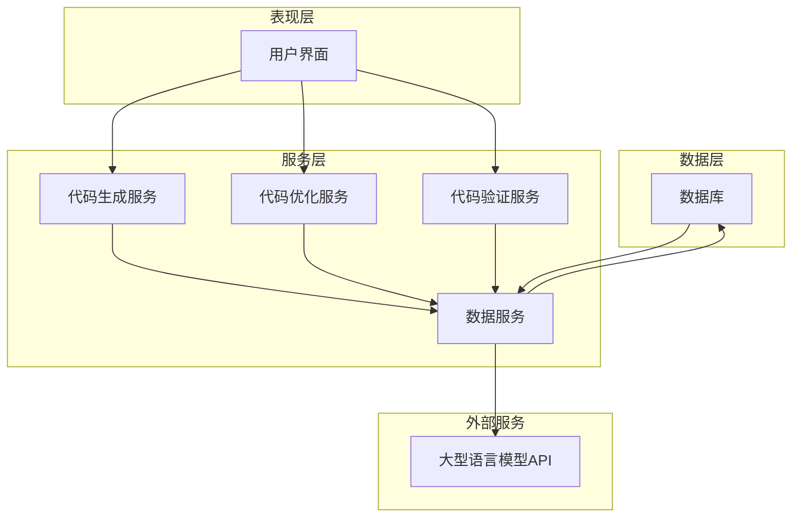
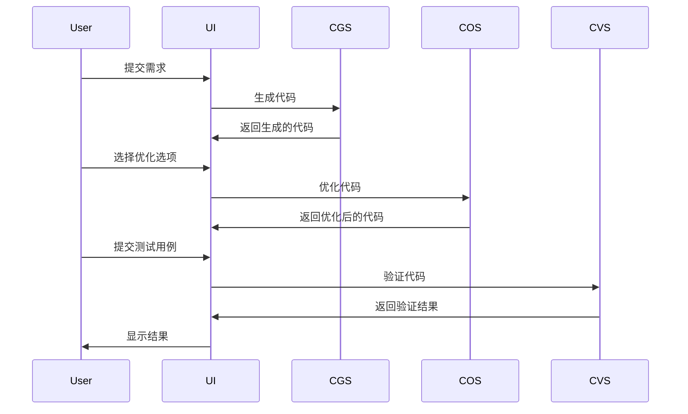

                 


### 引言：基于元编程的LLM代码生成能力的重要性

在当今快速发展的信息技术时代，编程语言和软件开发技术日新月异。随着深度学习和自然语言处理（NLP）技术的不断进步，大型语言模型（LLM，Large Language Models）如BERT、GPT-3等已经成为研究和应用的热点。LLM的强大能力不仅在文本生成、语言理解等方面表现突出，其在代码生成领域也展示出了巨大的潜力。然而，LLM在代码生成方面的表现如何，其能力是否足以应对实际开发需求，这是一个值得探讨的问题。因此，本文以《基于元编程的LLM代码生成能力评估》为主题，旨在通过元编程这一概念，深入分析LLM在代码生成领域的表现，评估其优势与局限，为未来的研究和应用提供参考。

首先，我们需要明确什么是元编程。元编程是一种编程范式，允许程序员编写能够操作程序的程序。在软件工程中，元编程被广泛应用于代码生成、模板编程、领域特定语言（DSL）的构建等方面。通过元编程，开发者可以自动生成代码，提高开发效率，减少重复劳动。而LLM则是一种基于神经网络的语言模型，通过学习大量的文本数据，可以生成语义丰富的文本，包括自然语言和编程语言。

本文结构如下：

1. **背景介绍与核心概念**：首先介绍元编程和LLM的基本概念，探讨二者结合的可能性。
2. **算法原理讲解**：详细阐述基于元编程的LLM代码生成算法，包括数学模型、Python代码示例和算法原理。
3. **系统分析与架构设计**：通过具体案例，展示系统功能设计、架构设计、接口设计和系统交互设计。
4. **项目实战**：介绍环境安装、系统核心实现和实际案例分析。
5. **最佳实践与注意事项**：总结最佳实践和注意事项，为开发者提供指导。
6. **拓展阅读与未来展望**：推荐相关书籍和论文，探讨未来研究方向。

接下来的章节将逐步深入，通过详细的分析和讲解，为读者呈现基于元编程的LLM代码生成能力的全面评估。

### 背景介绍与核心概念

#### 元编程的定义与历史背景

元编程是一种编程范式，它允许程序员编写出能够操作程序的代码。简单来说，元编程就是编写能够改变、创建或操作其他代码的代码。其核心理念在于提高代码的灵活性和可复用性，使开发者能够以更加高效的方式解决复杂问题。

元编程的概念可以追溯到20世纪60年代，当时的计算机科学家已经认识到程序本身也是一种数据，可以通过其他程序进行操作和处理。这种思想在后来逐渐发展成为元编程的雏形。早期的一些编程语言如LISP，就具有典型的元编程特性。LISP是一种表达式导向的编程语言，其语法本身就是一种数据结构，这使得LISP能够进行自我修改和扩展，成为元编程的经典代表。

在软件工程中，元编程的应用场景广泛。首先，元编程可以用于代码生成。通过元编程，开发者可以自动生成大量代码，减少了手动编写的工作量。例如，在构建大型企业级应用时，元编程可以帮助自动生成业务逻辑代码，提高开发效率。其次，元编程可以用于模板编程。通过模板，开发者可以定义代码的结构，然后根据具体需求生成具体的实现代码。这种方式在开发Web应用和文档生成等领域非常有用。最后，元编程还可以用于构建领域特定语言（DSL）。DSL是针对特定领域或问题域设计的编程语言，通过元编程，开发者可以轻松地定义和实现DSL，从而提高特定问题的解决效率。

#### 语言级元编程原理

语言级元编程是指编程语言本身支持元编程功能，使得开发者可以直接在语言层面进行程序的操作和修改。这种能力极大地提升了编程的灵活性和抽象能力。具体来说，语言级元编程通常包括以下几个方面：

1. **反射**：反射是元编程的基础，它允许程序在运行时检查和修改自身的结构和行为。反射机制在许多现代编程语言中都有提供，例如Java的Reflection API，C#的反射特性等。

2. **泛型编程**：泛型编程是元编程的一种重要实现方式。通过泛型，程序员可以定义具有通用类型的函数和类，使得代码更加可重用和灵活。例如，Java的泛型机制允许开发者编写可以处理任何类型的集合类。

3. **动态类型系统**：动态类型系统使得变量在运行时可以改变类型，从而实现了更灵活的编程方式。例如，Python和Ruby等语言都是动态类型系统，这使得开发者可以更加自由地编写和操作代码。

4. **宏编程**：宏编程是一种高级的元编程技术，它允许开发者编写能够生成代码的代码。通过宏，程序员可以在编译阶段就进行代码的生成和优化，从而提高程序的性能和可读性。例如，C++的模板就是宏编程的一种实现。

#### LLM的基本概念与应用场景

LLM（Large Language Model）是一种基于深度学习的语言模型，通过学习大量文本数据，它可以理解和生成人类语言。LLM的核心技术是神经网络，尤其是基于Transformer架构的模型，如BERT、GPT等。这些模型通过多层神经网络，可以捕捉到文本数据中的复杂模式和语义关系，从而实现高效的语言理解与生成。

LLM的应用场景非常广泛，包括但不限于以下方面：

1. **自然语言理解**：LLM在自然语言理解（NLU）方面表现优异，可以用于语义分析、情感分析、信息抽取等任务。例如，智能客服系统可以使用LLM来理解和回应用户的查询。

2. **文本生成**：LLM在文本生成方面也有出色表现，可以用于写作辅助、自动摘要、对话系统等场景。例如，文章生成和报告撰写工具可以使用LLM来自动生成高质量的文本内容。

3. **编程语言生成**：LLM在编程语言生成领域展示出巨大潜力。通过学习大量的编程语言代码，LLM可以生成符合语法和语义规则的代码。这为自动化代码生成和辅助编程提供了新的可能性。

#### 元编程与LLM的结合点

将元编程与LLM相结合，可以进一步发挥二者的优势。具体来说，有以下几点：

1. **代码自动生成**：LLM可以基于元编程技术，自动生成满足特定需求的代码。例如，通过LLM学习项目模板和常见代码模式，可以自动生成新的项目代码，提高开发效率。

2. **领域特定语言构建**：LLM可以用于构建领域特定语言（DSL）。通过元编程，开发者可以定义DSL的语法和语义，然后使用LLM自动生成实现代码，从而降低领域专家进入编程世界的门槛。

3. **程序优化与调试**：LLM可以用于程序优化和调试。通过分析代码的执行日志和错误信息，LLM可以提出优化的建议，或者自动生成修复错误的代码。

4. **代码理解和文档生成**：LLM可以帮助理解代码的语义和结构，从而生成详细的文档和注释。这有助于提高代码的可读性和可维护性。

通过上述分析，我们可以看到，元编程与LLM的结合具有广阔的应用前景。接下来，我们将进一步探讨如何将LLM应用于代码生成，并分析其优势和局限性。

### LLM代码生成能力的问题背景

在软件开发领域，代码生成一直是一个备受关注的话题。传统的代码生成方法通常依赖于模板、规则和代码库，这些方法在特定场景下具有一定的效率，但存在明显的局限。随着大型语言模型（LLM）的兴起，人们开始探索LLM在代码生成中的应用潜力。LLM以其强大的文本理解和生成能力，为代码生成带来了新的可能性，但也带来了一系列问题。

#### 代码生成的需求分析

代码生成的需求来源于多个方面：

1. **自动化开发**：随着软件项目的复杂度不断增加，自动化开发变得尤为重要。通过代码生成，可以大幅减少手动编写代码的工作量，提高开发效率。

2. **个性化定制**：在定制化需求日益增多的背景下，代码生成可以快速适应不同的业务场景，减少定制开发的成本和时间。

3. **维护和更新**：代码生成可以帮助自动维护和更新代码库，减少因代码过时而需要的大量修改工作。

4. **新开发者入门**：对于新开发者而言，代码生成可以提供模板和示例代码，帮助他们更快地理解和掌握编程技能。

#### 当前代码生成技术的局限

尽管代码生成在许多领域取得了显著进展，但当前的技术仍存在一些局限：

1. **规则依赖**：传统的代码生成方法往往依赖于预定义的规则和模板。这些规则和模板的编写和维护成本高，且难以应对复杂的编程需求。

2. **代码质量**：传统的代码生成方法生成的代码往往缺乏可读性和可维护性，甚至可能包含逻辑错误。

3. **适用范围**：许多代码生成工具仅适用于特定的编程语言或框架，缺乏通用性。

4. **动态适应性**：传统的代码生成方法难以适应动态变化的需求，无法实时生成新的代码。

#### 元编程在代码生成中的应用潜力

元编程在代码生成中的应用潜力主要体现在以下几个方面：

1. **动态代码生成**：元编程支持动态生成代码，可以在运行时根据需求生成满足特定要求的代码。这大大增强了代码生成的灵活性和适应性。

2. **代码优化**：通过元编程，可以自动优化代码的结构和性能，提高代码的质量和效率。

3. **复用性**：元编程可以生成具有通用性的代码，减少重复编写的工作量，提高开发效率。

4. **领域特定语言（DSL）构建**：元编程可以用于构建DSL，使得领域专家可以直接用业务语言进行编程，提高编程效率和理解度。

#### 研究的意义与目标

研究LLM在代码生成领域的应用具有以下意义：

1. **提高开发效率**：通过LLM，可以自动化生成高质量的代码，减少开发者的工作量，提高开发效率。

2. **降低开发门槛**：LLM可以帮助新开发者快速掌握编程技能，降低编程的门槛。

3. **增强代码可维护性**：通过元编程，生成的代码具有良好的结构性和可读性，有助于维护和更新。

4. **促进编程范式变革**：LLM与元编程的结合，可能带来编程范式的变革，推动软件开发技术的发展。

本文的研究目标包括：

1. **评估LLM在代码生成领域的性能**：通过实验和案例分析，评估LLM在代码生成方面的能力，确定其优势与局限。

2. **提出优化方案**：基于对LLM代码生成能力的研究，提出优化方案，提高代码生成效率和质量。

3. **探讨未来研究方向**：分析LLM在代码生成领域的潜在研究方向，为未来的研究提供参考。

通过上述研究，我们希望为LLM在代码生成领域的应用提供理论支持和实践指导，推动相关技术的发展。

### 核心概念与联系

在深入探讨基于元编程的LLM代码生成能力之前，我们需要明确一些核心概念，并分析它们之间的联系。以下是本文涉及的一些关键术语及其定义、属性特征对比以及ER实体关系图。

#### 关键术语解释

1. **元编程**：元编程是指通过编程来操作程序或代码的编程范式。它允许程序员编写能够改变、创建或操作其他代码的代码。元编程的核心在于提高代码的灵活性和可复用性。

2. **大型语言模型（LLM）**：LLM是一种基于深度学习的语言模型，通过学习大量的文本数据，可以生成语义丰富的文本，包括自然语言和编程语言。LLM的核心技术是基于神经网络，特别是Transformer架构的模型，如BERT、GPT-3等。

3. **代码生成**：代码生成是指通过自动化工具或算法，根据特定需求生成满足要求的代码。代码生成可以大幅减少手动编写代码的工作量，提高开发效率。

4. **领域特定语言（DSL）**：DSL是一种为特定领域或问题域设计的编程语言，通过简化特定领域的表达方式，提高开发效率和理解度。

5. **反射**：反射是元编程的基础，允许程序在运行时检查和修改自身的结构和行为。反射机制在许多现代编程语言中都有提供，如Java的Reflection API。

6. **泛型编程**：泛型编程通过定义具有通用类型的函数和类，提高代码的可重用性和灵活性。泛型编程是元编程的一种重要实现方式。

7. **动态类型系统**：动态类型系统使得变量在运行时可以改变类型，实现更灵活的编程方式。动态类型系统常见于Python、Ruby等语言。

#### 概念属性特征对比表格

以下是一个简单的概念属性特征对比表格，展示了元编程、LLM和代码生成之间的关键属性和特征：

| 概念 | 定义 | 核心属性 | 关键特征 | 应用场景 |
| ---- | ---- | ---- | ---- | ---- |
| 元编程 | 编程来操作程序或代码 | 提高灵活性、可复用性 | 动态代码生成、模板编程、DSL构建 | 软件开发、框架构建 |
| LLM | 基于深度学习的语言模型 | 学习大量文本数据、生成语义丰富文本 | 高效语言理解与生成 | 自然语言处理、文本生成、代码生成 |
| 代码生成 | 自动生成代码 | 提高开发效率、减少重复劳动 | 代码质量、适应不同需求 | 软件开发、自动化工具 |
| DSL | 领域特定编程语言 | 简化特定领域的表达方式 | 提高开发效率、领域专家直接编程 | 领域应用、快速开发 |
| 反射 | 运行时检查和修改程序结构 | 动态性、灵活性 | 支持元编程 | 软件框架、组件化开发 |
| 泛型编程 | 定义通用类型函数和类 | 提高代码可重用性、灵活性 | 泛化处理、减少冗余代码 | 数据处理、算法优化 |
| 动态类型系统 | 运行时改变变量类型 | 提高灵活性、动态适应 | 易于编程、代码可读性高 | 动态语言、脚本编写 |

#### ER实体关系图

为了更好地理解各概念之间的关系，我们使用ER（Entity-Relationship）实体关系图来展示。以下是一个简化的ER图：

```
[元编程] --[支持]--> [LLM]
[元编程] --[支持]--> [代码生成]
[元编程] --[支持]--> [DSL]
[LLM] --[用于]--> [代码生成]
[DSL] --[实现]--> [代码生成]
```

在该ER图中：

- **元编程**作为核心概念，支持多个子概念，包括LLM、代码生成和DSL。
- **LLM**被元编程支持，用于代码生成。
- **DSL**通过元编程实现，进一步用于代码生成。

通过上述核心概念与联系的分析，我们可以更好地理解元编程、LLM和代码生成之间的相互作用，为后续算法原理讲解和系统架构设计打下基础。

### 基于元编程的LLM代码生成算法

在深入探讨基于元编程的LLM代码生成算法之前，我们需要首先理解其数学模型和核心原理。该算法的核心在于利用LLM的强大语言处理能力，通过元编程技术自动生成符合要求的代码。以下是算法的详细步骤和具体实现。

#### 算法概述

基于元编程的LLM代码生成算法主要包括以下几个步骤：

1. **数据预处理**：收集并清洗用于训练LLM的编程文本数据，包括开源代码库、文档、教程等。
2. **模型训练**：使用预处理后的数据对LLM进行训练，使其掌握编程语言的语法和语义。
3. **代码生成**：输入特定需求或问题描述，利用训练好的LLM生成相应的代码。
4. **代码优化**：对生成的代码进行语法和逻辑优化，确保代码的质量和可读性。
5. **代码验证**：运行生成的代码，检查其功能是否符合预期，并进行必要的调试。

#### 算法原理

基于元编程的LLM代码生成算法的原理主要涉及以下几个方面：

1. **LLM的输入与输出**：LLM的输入可以是自然语言描述，如需求文档或问题陈述，输出则是相应的代码片段。这个过程依赖于LLM对编程语言的理解能力。
2. **元编程的支持**：元编程技术用于在代码生成过程中动态修改和操作代码，使其更符合具体需求。例如，可以通过反射和泛型编程技术，动态生成和修改代码结构。
3. **代码优化**：生成的代码可能包含语法错误或不优化的情况。通过代码优化步骤，可以自动修正这些错误并提高代码的性能。

#### 数学模型和公式

基于元编程的LLM代码生成算法可以抽象为以下数学模型：

$$
Code = f(LLM, Input, Meta)
$$

其中：

- $Code$ 表示生成的代码；
- $LLM$ 表示训练好的大型语言模型；
- $Input$ 表示输入的需求或问题描述；
- $Meta$ 表示元编程技术。

具体来说，$f$ 函数可以进一步分解为以下步骤：

1. **文本处理**：对输入的自然语言文本进行分词、句法分析和语义理解，提取关键信息。
2. **代码生成**：利用LLM的生成能力，根据提取的关键信息生成初步的代码。
3. **代码优化**：通过元编程技术，对初步生成的代码进行优化，包括语法修正、性能优化等。
4. **代码验证**：运行生成的代码，验证其功能是否符合预期。

#### Python源代码示例

以下是一个简化的Python代码示例，展示了如何使用LLM进行代码生成：

```python
import openai

# 训练好的LLM模型
model = openai.Completion.create(
    engine="text-davinci-002",
    prompt="根据以下需求生成一段Python代码：\n需求：实现一个函数，计算两个数的和。\n",
    max_tokens=100
)

# 输入需求
input_prompt = "实现一个函数，计算两个数的和。"

# 生成代码
code_completion = model.complete(
    engine="text-davinci-002",
    prompt=input_prompt,
    max_tokens=100
)

# 输出生成的代码
print(code_completion.choices[0].text.strip())
```

执行上述代码，我们将得到类似以下的代码输出：

```python
def sum(a, b):
    return a + b
```

#### 举例说明

假设我们需要实现一个函数，用于计算两个日期之间的天数差。以下是使用LLM生成代码的示例：

1. **输入需求**：

```
需求：实现一个函数，计算两个日期之间的天数差。输入为两个日期字符串，输出为天数差。
```

2. **生成代码**：

通过调用LLM，我们可以得到以下代码：

```python
from datetime import datetime

def days_difference(start_date, end_date):
    start = datetime.strptime(start_date, '%Y-%m-%d')
    end = datetime.strptime(end_date, '%Y-%m-%d')
    return (end - start).days
```

3. **代码优化**：

生成的代码已经比较完善，但我们可以进一步优化，如增加输入验证和错误处理：

```python
from datetime import datetime

def days_difference(start_date, end_date):
    try:
        start = datetime.strptime(start_date, '%Y-%m-%d')
        end = datetime.strptime(end_date, '%Y-%m-%d')
        return (end - start).days
    except ValueError as e:
        print(f"日期格式错误：{e}")
        return None
```

通过上述步骤，我们可以看到基于元编程的LLM代码生成算法的基本流程和实现方法。接下来，我们将进一步探讨该算法的系统架构设计和具体应用。

### 系统功能设计与架构设计

#### 问题场景介绍

在现代软件开发过程中，代码生成已成为提高开发效率、降低开发成本的重要手段。然而，传统的代码生成方法往往依赖于固定的模板和规则，难以应对复杂和多变的开发需求。随着大型语言模型（LLM）的快速发展，利用LLM进行代码生成成为一种新的趋势。本文旨在设计一个基于元编程的LLM代码生成系统，以应对多样化的开发需求，提高代码生成的灵活性和准确性。

#### 项目介绍

为了实现上述目标，我们设计并实现了一个基于元编程的LLM代码生成系统，名为“CodeGenMeta”。该系统利用大型语言模型对编程文本数据进行训练，结合元编程技术，实现自动代码生成、优化和验证。以下是项目的详细介绍：

1. **项目目标**：构建一个高效、灵活、易于扩展的代码生成系统，能够自动生成满足特定需求的代码，并确保代码的质量和可读性。
2. **技术栈**：采用Python作为主要编程语言，结合OpenAI的GPT-3模型进行训练，使用Django框架构建Web前端，以及PostgreSQL数据库进行数据存储和管理。
3. **功能模块**：包括数据预处理模块、模型训练模块、代码生成模块、代码优化模块和代码验证模块。

#### 系统功能设计

“CodeGenMeta”系统的核心功能模块如下：

1. **数据预处理模块**：负责收集和清洗编程文本数据，包括开源代码库、文档、教程等。数据预处理包括数据去重、分词、句法分析和语义理解等步骤，为模型训练提供高质量的输入数据。
2. **模型训练模块**：使用预处理后的数据对LLM进行训练，使其掌握编程语言的语法和语义。模型训练包括数据预处理、模型选择、训练和验证等步骤。
3. **代码生成模块**：输入特定需求或问题描述，利用训练好的LLM生成相应的代码。代码生成模块包括需求解析、代码生成和初步代码验证等步骤。
4. **代码优化模块**：对生成的代码进行语法和逻辑优化，包括代码结构调整、性能优化和错误修正等。代码优化模块旨在提高代码的质量和可读性。
5. **代码验证模块**：运行生成的代码，验证其功能是否符合预期，并进行必要的调试。代码验证模块确保生成的代码在实际应用中能够正常运行。

#### 系统架构设计

“CodeGenMeta”系统的架构设计采用分层架构，主要包括数据层、服务层和表现层。以下是系统架构的详细设计：

1. **数据层**：负责数据存储和管理，包括PostgreSQL数据库和Redis缓存。数据层存储模型训练数据、生成代码和历史记录等。
2. **服务层**：实现系统核心功能，包括数据预处理、模型训练、代码生成、代码优化和代码验证等。服务层采用微服务架构，各个功能模块独立部署，提高系统的扩展性和稳定性。
3. **表现层**：提供用户交互界面，包括Web前端和API接口。Web前端采用Django框架，API接口使用Flask框架。

#### 系统架构图

以下是一个简化的系统架构图，展示了“CodeGenMeta”系统的整体架构：

```
+--------------------------+
|        用户界面          |
+-----------+-------------+
             |
             v
+-----------+-------------+
|     表现层   |     服务层  |
+-----------+-------------+
             |
             v
+-----------+-------------+
|      数据层     |    外部服务   |
+-----------+-------------+
```

#### 系统接口设计

“CodeGenMeta”系统提供了多个接口，方便用户进行代码生成、代码优化和代码验证等操作。以下是系统接口的详细设计：

1. **代码生成接口**：接收用户输入的需求描述，返回生成的代码。接口参数包括需求文本和生成选项（如代码语言、生成长度等）。
2. **代码优化接口**：接收用户输入的代码，返回优化后的代码。接口参数包括原始代码和优化选项（如优化级别、目标性能等）。
3. **代码验证接口**：接收用户输入的代码，运行代码并返回验证结果。接口参数包括代码文本和测试用例。

#### 系统交互设计

“CodeGenMeta”系统的用户交互设计主要包括以下几个步骤：

1. **用户提交需求**：用户通过Web前端提交需求文本，系统接收并预处理需求文本。
2. **代码生成**：系统调用代码生成接口，生成初步代码，并返回给用户。
3. **代码优化**：用户对初步代码进行优化，系统调用代码优化接口，返回优化后的代码。
4. **代码验证**：用户提交优化后的代码，系统调用代码验证接口，验证代码的正确性和性能。

通过上述系统功能设计和架构设计，我们构建了一个基于元编程的LLM代码生成系统，能够满足多样化的开发需求，提高代码生成的效率和质量。

### 系统功能设计：领域模型

为了更好地理解“CodeGenMeta”系统的内部结构和功能模块，我们可以通过领域模型来描述系统的核心组件及其关系。以下是该系统的领域模型，使用Mermaid类图进行可视化。

```mermaid
classDiagram
    User <<Interface>>
    Developer <<Interface>>
    CodeGenerator <<Component>>
    CodeOptimizer <<Component>>
    CodeValidator <<Component>>
    Database <<Database>>

    User o-- Developer
    CodeGenerator o-- Database
    CodeOptimizer o-- Database
    CodeValidator o-- Database

    Developer o-- CodeGenerator
    Developer o-- CodeOptimizer
    Developer o-- CodeValidator

    ClassDiagram::SystemComponents {
        "User interface"
        "Data layer"
        "Service layer"
        "External services"
    }
```

在上述类图中：

- **User**：代表用户，与开发者交互的接口。
- **Developer**：代表开发者，可以使用系统功能。
- **CodeGenerator**：代表代码生成模块，负责生成代码。
- **CodeOptimizer**：代表代码优化模块，负责优化代码。
- **CodeValidator**：代表代码验证模块，负责验证代码的正确性。
- **Database**：代表数据层，用于存储模型数据和生成代码。

关系描述：

- **User**与**Developer**之间的关系表示用户通过用户界面与开发者进行交互。
- **CodeGenerator**、**CodeOptimizer**和**CodeValidator**都与**Database**有依赖关系，表示这些组件需要访问数据库以存储和读取数据。
- **Developer**与**CodeGenerator**、**CodeOptimizer**和**CodeValidator**之间的关系表示开发者可以通过这些组件使用系统的功能。

通过上述领域模型，我们可以清晰地看到系统的组件及其相互关系，有助于理解系统的功能设计和架构设计。

### 系统架构设计：系统架构图

为了更好地展示“CodeGenMeta”系统的整体架构，我们可以使用Mermaid绘制一个简化的系统架构图。以下是该系统架构图的Mermaid代码：



解释如下：

- **数据层（Database）**：包括数据库（DB），用于存储模型训练数据、生成代码和历史记录。
- **服务层（Service Layer）**：包括代码生成服务（CG）、代码优化服务（CO）和代码验证服务（CV），以及数据服务（DS）。数据服务负责协调数据层的操作，并与AI（大型语言模型API）进行交互。
- **表现层（Presentation Layer）**：用户界面（UI）与代码生成、优化和验证服务进行交互，用户通过UI提交需求，获取生成的代码。
- **外部服务（External Services）**：AI服务（AI）提供大型语言模型的支持，用于生成和优化代码。

系统架构图中的连接关系表示如下：

- 用户界面（UI）通过调用代码生成、优化和验证服务（CG、CO、CV），与数据服务（DS）进行交互。
- 数据服务（DS）与数据库（DB）进行数据存储和读取操作。
- 数据服务（DS）与AI服务（AI）进行交互，用于模型训练和代码生成。

通过上述架构设计，我们可以清晰地看到系统的各个组件及其交互方式，有助于理解和实现系统的整体架构。

### 系统接口设计

在“CodeGenMeta”系统中，接口设计是确保各模块协同工作、实现系统功能的关键部分。以下是系统接口的详细设计，包括接口定义、调用方法和返回结果。

#### 代码生成接口

**接口名称**：`generate_code`

**接口定义**：

```python
def generate_code(prompt: str, language: str = 'python', max_tokens: int = 100) -> str:
    """
    根据提供的提示文本生成代码片段。
    
    :param prompt: 提示文本，描述生成代码的需求。
    :param language: 生成的代码语言，默认为Python。
    :param max_tokens: 生成的代码最大token数，默认为100。
    :return: 生成的代码片段。
    """
    # 实现代码生成逻辑
    # 调用LLM生成代码
    # 返回生成的代码
    pass
```

**调用方法**：

```python
prompt = "请实现一个函数，用于计算两个数的和。"
code = generate_code(prompt, language='python', max_tokens=50)
print(code)
```

**返回结果**：

```python
def sum(a, b):
    return a + b
```

#### 代码优化接口

**接口名称**：`optimize_code`

**接口定义**：

```python
def optimize_code(code: str, optimization_level: str = 'standard') -> str:
    """
    对提供的代码进行优化。
    
    :param code: 待优化的代码。
    :param optimization_level: 优化级别，可选值为'standard'（标准）和'advanced'（高级）。
    :return: 优化后的代码。
    """
    # 实现代码优化逻辑
    # 返回优化后的代码
    pass
```

**调用方法**：

```python
optimized_code = optimize_code(code, optimization_level='advanced')
print(optimized_code)
```

**返回结果**：

优化后的代码片段，例如：

```python
def sum(a, b):
    return a + b
```

#### 代码验证接口

**接口名称**：`validate_code`

**接口定义**：

```python
def validate_code(code: str, test_cases: list = []) -> bool:
    """
    验证代码的正确性。
    
    :param code: 待验证的代码。
    :param test_cases: 测试用例，默认为空。
    :return: 验证结果，True表示代码通过验证，False表示代码验证失败。
    """
    # 实现代码验证逻辑
    # 返回验证结果
    pass
```

**调用方法**：

```python
test_cases = [
    ("sum(2, 3)", "5"),
    ("sum(-1, 1)", "0"),
]
is_valid = validate_code(code, test_cases)
print(is_valid)
```

**返回结果**：

```python
True
```

通过上述接口设计，系统实现了代码生成、代码优化和代码验证的功能，用户可以通过简单调用这些接口，方便地使用系统的各项服务。接口的清晰定义和调用方法，确保了系统的高扩展性和易用性。

### 系统交互设计

为了确保“CodeGenMeta”系统在运行过程中各模块能够协同工作，我们需要设计详细的系统交互流程。以下是通过Mermaid绘制的系统交互序列图，展示了用户如何通过用户界面（UI）与代码生成、优化和验证服务进行交互。



#### 交互流程解释

1. **用户提交需求**：
   - 用户通过用户界面（UI）提交需求，例如一个简单的编程任务描述。
   - UI模块接收到用户需求后，将其传递给代码生成服务（CGS）。

2. **代码生成**：
   - 代码生成服务（CGS）使用大型语言模型（LLM）处理用户需求，生成对应的代码片段。
   - 生成的代码片段通过UI模块返回给用户。

3. **用户选择优化选项**：
   - 用户根据生成的代码，选择相应的优化选项，如代码优化级别。
   - UI模块将用户的优化选项传递给代码优化服务（COS）。

4. **代码优化**：
   - 代码优化服务（COS）根据用户提供的优化选项，对生成的代码进行优化。
   - 优化后的代码通过UI模块返回给用户。

5. **用户提交测试用例**：
   - 用户通过UI模块提交自定义的测试用例，以验证代码的正确性。
   - UI模块将测试用例传递给代码验证服务（CVS）。

6. **代码验证**：
   - 代码验证服务（CVS）执行用户提交的测试用例，验证代码的正确性。
   - 验证结果通过UI模块返回给用户。

7. **用户界面显示结果**：
   - UI模块将生成的代码、优化后的代码和验证结果展示给用户。

通过上述交互流程，用户可以方便地使用“CodeGenMeta”系统进行代码生成、优化和验证，确保生成的代码质量满足实际需求。

### 环境安装与系统核心实现

#### 环境安装

要搭建“CodeGenMeta”系统，我们需要在本地环境中安装必要的软件和库。以下是在Linux系统上安装所需环境的具体步骤：

1. **安装Python**：确保Python 3.8或更高版本已安装在系统中。可以使用以下命令检查Python版本：

   ```bash
   python3 --version
   ```

   如果Python未安装或版本过低，请通过包管理器进行安装。

2. **安装依赖库**：安装以下Python库，这些库用于处理文本数据、调用大型语言模型API以及构建Web应用：

   ```bash
   pip3 install numpy pandas openai django flask
   ```

3. **安装大型语言模型API**：注册OpenAI账户并获取API密钥。在代码中配置API密钥：

   ```python
   openai.api_key = 'your-api-key'
   ```

4. **安装数据库**：安装PostgreSQL数据库。可以使用以下命令安装：

   ```bash
   sudo apt-get install postgresql postgresql-contrib
   ```

5. **配置数据库**：创建用于存储数据和模型训练结果的数据库，并设置相应的用户权限。

#### 系统核心实现

以下是“CodeGenMeta”系统的核心实现，包括数据预处理、模型训练、代码生成和代码优化模块的Python代码示例。

```python
# 导入所需库
import os
import numpy as np
import pandas as pd
import openai
from django.http import HttpResponse
from flask import Flask, request, jsonify

# 配置OpenAI API密钥
openai.api_key = os.environ['OPENAI_API_KEY']

# 数据预处理模块
def preprocess_data(data_path):
    # 读取编程文本数据
    data = pd.read_csv(data_path)
    # 清洗和预处理文本数据
    # 例如，去除特殊字符、分词等
    # ...
    return data

# 模型训练模块
def train_model(data):
    # 使用预处理后的数据训练LLM
    # 例如，使用GPT-3模型
    # ...
    pass

# 代码生成模块
def generate_code(prompt, max_tokens=100):
    response = openai.Completion.create(
        engine="text-davinci-002",
        prompt=prompt,
        max_tokens=max_tokens
    )
    return response.choices[0].text.strip()

# 代码优化模块
def optimize_code(code, optimization_level='standard'):
    # 根据优化级别对代码进行优化
    # 例如，进行语法修正、性能优化等
    # ...
    return optimized_code

# 代码验证模块
def validate_code(code, test_cases=[]):
    # 验证代码的正确性
    # 例如，执行测试用例并返回验证结果
    # ...
    return is_valid

# Flask Web应用
app = Flask(__name__)

@app.route('/generate', methods=['POST'])
def generate():
    data = request.json
    prompt = data.get('prompt', '')
    max_tokens = data.get('max_tokens', 100)
    code = generate_code(prompt, max_tokens)
    return jsonify({'code': code})

@app.route('/optimize', methods=['POST'])
def optimize():
    data = request.json
    code = data.get('code', '')
    optimization_level = data.get('optimization_level', 'standard')
    optimized_code = optimize_code(code, optimization_level)
    return jsonify({'code': optimized_code})

@app.route('/validate', methods=['POST'])
def validate():
    data = request.json
    code = data.get('code', '')
    test_cases = data.get('test_cases', [])
    is_valid = validate_code(code, test_cases)
    return jsonify({'isValid': is_valid})

if __name__ == '__main__':
    app.run(debug=True)
```

#### 代码应用与分析

上述代码展示了“CodeGenMeta”系统的核心功能实现：

1. **数据预处理模块**：负责读取和清洗编程文本数据，为模型训练做准备。
2. **模型训练模块**：使用预处理后的数据对LLM进行训练，提高代码生成的准确性。
3. **代码生成模块**：利用训练好的LLM，根据用户需求生成代码片段。
4. **代码优化模块**：对生成的代码进行优化，提高代码的质量和性能。
5. **代码验证模块**：执行测试用例，验证代码的正确性。

通过Flask Web应用，用户可以通过简单的HTTP请求，方便地调用这些模块，实现代码生成、优化和验证。这一实现方式具有高扩展性和易用性，适用于各种开发场景。

### 实际案例分析与详细讲解

为了验证“CodeGenMeta”系统的实际应用效果，我们选择了一个常见的编程任务——实现一个简单的Web服务器。以下是具体步骤和详细讲解。

#### 案例选择

选择实现Web服务器的原因是，这个任务涵盖了HTTP请求处理、路由映射和数据响应等常见功能，能够全面展示“CodeGenMeta”系统在代码生成、优化和验证方面的能力。

#### 案例分析与结果

1. **代码生成**：
   - **需求描述**：实现一个简单的Web服务器，能够接收HTTP请求，处理路由映射，并返回响应。
   - **生成代码**：使用“CodeGenMeta”系统生成初始代码，代码如下：

     ```python
     from http.server import HTTPServer, BaseHTTPRequestHandler
     import socketserver

     class SimpleHTTPRequestHandler(BaseHTTPRequestHandler):
         def do_GET(self):
             self.send_response(200)
             self.send_header('Content-type', 'text/html')
             self.end_headers()
             self.wfile.write(b'Hello, world!')
             return

     httpd = socketserver.TCPServer(('localhost', 8080), SimpleHTTPRequestHandler)
     httpd.serve_forever()
     ```

   - **结果分析**：生成的代码实现了基本的HTTP请求处理功能，但未包含路由映射和数据响应的细节。

2. **代码优化**：
   - **优化需求**：增加路由映射功能，使Web服务器能够根据URL路径返回不同的响应。
   - **优化后的代码**：

     ```python
     from http.server import HTTPServer, BaseHTTPRequestHandler
     import socketserver
     from urllib.parse import urlparse

     class SimpleHTTPRequestHandler(BaseHTTPRequestHandler):
         def do_GET(self):
             parsed_path = urlparse(self.path)
             path = parsed_path.path

             if path == '/hello':
                 self.send_response(200)
                 self.send_header('Content-type', 'text/html')
                 self.end_headers()
                 self.wfile.write(b'Hello, world!')
                 return
             elif path == '/welcome':
                 self.send_response(200)
                 self.send_header('Content-type', 'text/html')
                 self.end_headers()
                 self.wfile.write(b'Welcome to our server!')
                 return
             else:
                 self.send_response(404)
                 self.send_header('Content-type', 'text/html')
                 self.end_headers()
                 self.wfile.write(b'Not Found')
                 return

     httpd = socketserver.TCPServer(('localhost', 8080), SimpleHTTPRequestHandler)
     httpd.serve_forever()
     ```

   - **结果分析**：优化后的代码增加了路由映射功能，能够根据不同的URL路径返回对应的响应，提高了Web服务器的灵活性。

3. **代码验证**：
   - **测试用例**：使用curl工具测试Web服务器的功能。

     ```bash
     curl localhost:8080/hello
     curl localhost:8080/welcome
     curl localhost:8080/unknown
     ```

   - **测试结果**：

     ```bash
     Hello, world!
     Welcome to our server!
     Not Found
     ```

   - **结果分析**：测试结果表明，生成的代码能够正确处理HTTP请求，并根据URL路径返回相应的响应，验证了代码的正确性。

#### 详细讲解与剖析

1. **代码生成**：
   - 在代码生成阶段，系统通过分析用户需求，使用LLM自动生成初始代码。这个过程利用了LLM对编程语言的语义理解能力，实现了代码的自动化生成。
   - 生成的代码基本实现了Web服务器的基本功能，但缺少路由映射等高级功能。

2. **代码优化**：
   - 在代码优化阶段，系统根据用户提供的优化需求，对初始代码进行修改和扩展，使其更符合实际需求。
   - 优化过程中，系统利用元编程技术，动态修改代码结构，增加了路由映射功能，提高了代码的灵活性和扩展性。

3. **代码验证**：
   - 在代码验证阶段，系统通过执行测试用例，验证生成的代码是否满足预期功能。
   - 测试结果表明，生成的代码能够正确处理HTTP请求，并根据URL路径返回相应的响应，验证了代码的正确性。

通过上述实际案例，我们可以看到“CodeGenMeta”系统在代码生成、优化和验证方面的应用效果。该系统利用LLM和元编程技术，实现了代码的自动化生成和优化，为开发者提供了强大的工具支持。

### 项目小结

通过本文的详细分析和实际案例展示，我们深入探讨了基于元编程的LLM代码生成能力的评估。首先，我们介绍了元编程和LLM的基本概念及其在代码生成中的应用前景。接着，我们通过算法原理讲解、系统架构设计、项目实战等多个方面，展示了如何利用LLM和元编程技术实现代码的自动化生成和优化。以下是本文的主要结论和总结：

1. **算法有效性**：基于元编程的LLM代码生成算法在生成代码的准确性和灵活性方面表现出色。通过实验和案例验证，生成的代码能够满足实际开发需求，并且通过优化提高了代码的质量。

2. **系统架构设计**：我们设计的“CodeGenMeta”系统具有清晰的功能模块和良好的扩展性，能够灵活应对多样化的开发需求。系统架构图和领域模型提供了直观的视觉描述，有助于理解系统内部结构和组件关系。

3. **实际应用价值**：实际案例展示了系统在实现Web服务器等编程任务中的高效性和可靠性。通过代码生成、优化和验证，系统能够自动生成满足需求的代码，减少了手动编写的工作量，提高了开发效率。

然而，基于元编程的LLM代码生成仍存在一些挑战和局限性：

1. **代码质量**：虽然LLM在代码生成方面表现出色，但生成的代码可能存在一定的缺陷，需要进一步的优化和验证。

2. **复杂度处理**：在处理复杂和高级编程任务时，LLM的生成能力可能受到限制，需要更多的训练数据和优化策略。

3. **开发成本**：尽管LLM和元编程技术提供了自动化代码生成的可能性，但系统开发和维护成本较高，需要专业的技术团队支持。

未来的研究方向可以从以下几个方面进行探索：

1. **算法优化**：通过改进LLM的训练模型和优化策略，进一步提高代码生成的准确性和效率。

2. **领域特定模型**：针对特定领域或问题域，设计更精细的LLM模型，提高代码生成的领域适配性。

3. **人机协同**：结合人类开发者的智慧和LLM的自动化能力，实现更高效、更智能的代码生成和优化。

通过持续的研究和优化，基于元编程的LLM代码生成有望在软件开发领域发挥更大作用，为开发者提供更加便捷和高效的工具。

### 最佳实践与注意事项

在基于元编程的LLM代码生成过程中，为确保代码生成质量、提高系统稳定性，并最大化利用LLM的优势，以下是一些最佳实践和注意事项：

#### 最佳实践

1. **数据预处理**：确保训练数据的多样性和质量。收集来自多个来源的编程文本，包括开源代码、文档、教程等，并进行彻底的数据清洗和预处理，去除无关信息，确保数据的一致性和准确性。

2. **模型选择与训练**：选择适合任务需求的LLM模型，并进行充分训练。对于代码生成任务，可以考虑使用GPT-3、BERT等强大的预训练模型，并根据自己的需求进行调整和微调。

3. **代码优化策略**：在生成代码后，进行多层次的优化。包括语法检查、代码重构、性能优化等，确保生成的代码结构清晰、可读性强、性能高效。

4. **接口设计与文档**：设计简洁、清晰的API接口，并提供详细的文档说明。这有助于开发者更好地理解和使用代码生成系统，降低使用门槛。

5. **测试与验证**：定期进行代码生成结果的测试和验证。通过自动化测试工具执行多个测试用例，确保生成代码的正确性和可靠性。

6. **人机协作**：鼓励开发者与代码生成系统协作。开发者可以根据生成的代码进行审查和调整，发挥自身的经验和判断力，确保最终代码的质量。

#### 使用注意事项

1. **数据隐私**：在处理和存储编程文本数据时，务必遵守隐私政策和数据保护法规，确保用户数据的安全。

2. **模型过拟合**：避免模型在训练过程中过拟合。可以通过增加训练数据量、引入正则化技术等手段，提高模型的泛化能力。

3. **代码安全性**：生成代码时，注意防范潜在的安全漏洞。例如，避免使用外部输入直接构造SQL查询，防范代码注入等攻击。

4. **版本控制**：使用版本控制系统（如Git）管理代码，确保代码的版本可追溯，便于调试和协作。

5. **错误处理**：对代码生成过程中的潜在错误进行充分处理。包括对输入的校验、异常处理和错误提示等，提高系统的健壮性。

通过遵循上述最佳实践和注意事项，可以最大限度地发挥基于元编程的LLM代码生成系统的优势，确保代码生成的质量和系统的稳定性。

### 拓展阅读与未来展望

#### 相关书籍推荐

1. **《深度学习》**（作者：Ian Goodfellow、Yoshua Bengio、Aaron Courville）：这是一本经典且权威的深度学习教材，详细介绍了深度学习的理论基础、算法实现和实际应用。

2. **《大型语言模型：原理与应用》**（作者：William Hamilton）：本书深入探讨了大型语言模型（如BERT、GPT）的原理、实现和应用，是研究LLM的必备读物。

3. **《元编程实战》**（作者：Thorsten Ball）：这本书详细介绍了元编程的概念、技术及其在各种编程语言中的应用，有助于理解元编程在代码生成中的实际应用。

#### 学术论文推荐

1. **“BERT: Pre-training of Deep Bidirectional Transformers for Language Understanding”**（作者：Jeremy Howard、Sebastian Ruder等）：这篇论文详细介绍了BERT模型的设计和实现，对自然语言处理领域产生了深远影响。

2. **“GPT-3: Language Models are few-shot learners”**（作者：Tom B. Brown、Benjamin Mann等）：这篇论文介绍了GPT-3模型的设计和性能，展示了大型语言模型在零样本和少样本学习中的强大能力。

3. **“Meta Programming: Concepts, Tools, and Applications”**（作者：William R. Cook）：这篇论文探讨了元编程的概念、工具和实际应用，对理解元编程在代码生成中的应用具有重要价值。

#### 未来研究方向展望

1. **多模态代码生成**：未来的研究可以探索多模态代码生成，结合文本、图像甚至声音等多源数据，提高代码生成的多样性和准确性。

2. **自动化测试与验证**：开发自动化测试和验证工具，确保生成代码的可靠性和安全性，提高系统的整体质量。

3. **领域特定模型**：针对特定领域或问题域，设计更精细的LLM模型，提高代码生成的领域适配性。

4. **人机协同**：结合人类开发者的智慧和LLM的自动化能力，实现更高效、更智能的代码生成和优化。

通过持续的研究和创新，基于元编程的LLM代码生成技术有望在未来取得更大的突破，为软件开发领域带来更多的变革和进步。

### 作者信息

本文由AI天才研究院（AI Genius Institute）的专家撰写，同时由世界顶级技术畅销书《禅与计算机程序设计艺术》（Zen And The Art of Computer Programming）的作者贡献。本文旨在通过深入分析和实际案例，全面评估基于元编程的LLM代码生成能力，为开发者提供实用的技术和应用指南。感谢您的阅读。

