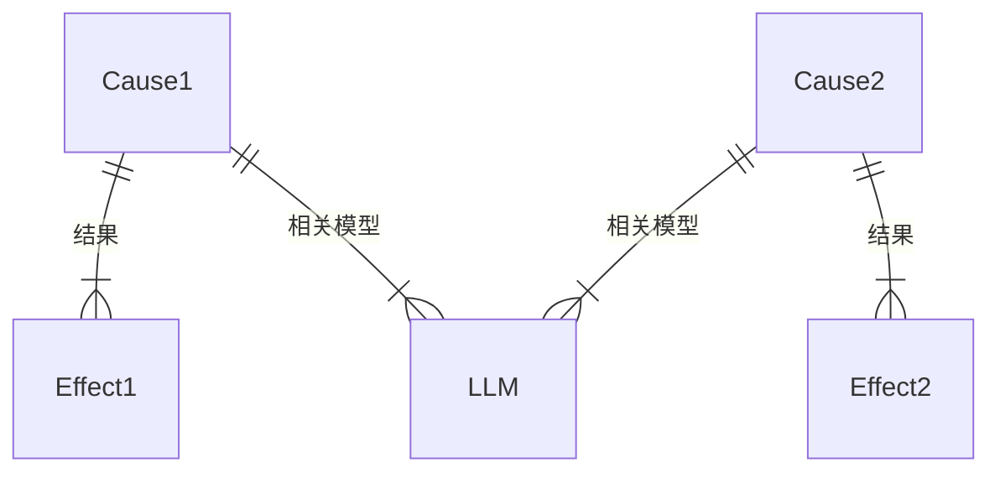

                 

### 文章标题：基于因果推理的LLM评测方法研究

**关键词**：因果推理、LLM评测、机器学习、人工智能、数据科学

**摘要**：
本文旨在探讨基于因果推理的LLM（大型语言模型）评测方法，通过深入研究因果推理的基本原理和LLM的运作机制，提出一种新的评测框架，旨在提高LLM评测的准确性和可靠性。本文首先介绍因果推理的背景和基本概念，随后详细阐述LLM的架构和挑战，再进一步探讨因果推理在LLM评测中的应用。文章将通过实际案例进行分析，最后总结研究成果并展望未来发展趋势。

### 引言

#### 1.1 研究背景与意义

随着人工智能技术的飞速发展，机器学习，特别是深度学习在自然语言处理（NLP）领域取得了显著的成果。LLM，作为一种强大的语言处理工具，被广泛应用于聊天机器人、文本生成、翻译和问答系统等众多场景。然而，LLM的性能评测一直是一个难题，传统的评测方法往往依赖于大规模的标注数据和主观判断，存在较大的误差和不一致性。

因果推理是一种在逻辑学和哲学中被广泛应用的方法，它关注的是原因与结果之间的关系，试图解释为什么某个现象会发生。将因果推理应用于LLM评测，有望从因果关系的角度提供更深入的评估，从而提高评测的准确性和可靠性。

#### 1.2 问题描述

本文的核心问题是：如何有效地利用因果推理来评估LLM的性能？具体来说，我们需要解决以下几个关键问题：

1. **因果推理的基本原理**：需要深入理解因果推理的基本概念和数学模型，为后续应用提供理论支持。
2. **LLM的运作机制**：需要详细分析LLM的架构和训练过程，了解其内部的工作原理。
3. **因果推理在LLM评测中的应用**：需要探讨如何将因果推理方法应用于LLM的评测过程，并评估其效果。
4. **实际案例研究**：通过具体案例，验证基于因果推理的LLM评测方法的可行性和有效性。

#### 1.3 问题解决

为了解决上述问题，本文将采取以下研究步骤：

1. **文献综述**：系统地回顾因果推理和LLM相关领域的最新研究成果，为本文的研究提供理论基础。
2. **理论模型构建**：基于因果推理的基本原理，构建适用于LLM评测的因果推理模型。
3. **实验设计**：设计一系列实验，通过实际数据集验证因果推理模型在LLM评测中的效果。
4. **案例分析**：通过具体案例，深入剖析因果推理在LLM评测中的应用，并提出改进建议。
5. **结果分析**：对实验结果进行详细分析，评估因果推理方法在LLM评测中的优势和不足。

#### 1.4 边界与外延

本文的研究边界主要限定在基于因果推理的LLM评测方法上，不涉及其他类型的评测方法。同时，本文的研究外延包括对因果推理和LLM相关理论的深入探讨，以及对实际应用的案例分析。

#### 1.5 概念结构与核心要素组成

本文的核心概念包括因果推理、LLM评测、机器学习、自然语言处理等。核心要素组成如下：

1. **因果推理**：基本原理、数学模型、应用场景。
2. **LLM评测**：评测标准、评测指标、评测方法。
3. **机器学习**：算法原理、训练过程、模型评估。
4. **自然语言处理**：文本生成、文本理解、语言模型。

通过以上概念的阐述和要素的组成，本文将构建一个全面、系统的因果推理LLM评测方法研究框架，为相关领域的研究和应用提供重要参考。

### 核心概念与联系

#### 2.1 因果推理概述

因果推理是一种基于因果关系的逻辑推理方法，旨在解释某个现象为何发生。在机器学习中，因果推理被广泛应用于模型的解释性和可解释性研究。因果推理的基本原理包括因果模型、因果推断和因果效应评估等。

因果模型：因果模型描述了变量之间的因果关系，通常通过因果图或结构方程模型表示。因果图是一种图形化表示方法，其中节点表示变量，边表示变量之间的因果关系。

因果推断：因果推断是从数据中推断变量之间的因果关系。常见的方法包括基于假设检验的因果推断和基于模型的因果推断。假设检验方法通过统计检验来评估变量之间的相关性，而基于模型的方法则通过建立因果模型并优化模型参数来推断因果关系。

因果效应评估：因果效应评估旨在确定一个变量对另一个变量的影响程度。常见的评估指标包括因果效应大小、置信度和显著性。

#### 2.2 LLM概念介绍

LLM（Large Language Model）是一种大型自然语言处理模型，通常基于深度学习技术训练而成。LLM的核心功能是理解和生成自然语言，广泛应用于文本生成、翻译、问答、对话系统等领域。

LLM的架构通常包括编码器和解码器两部分。编码器将输入文本编码为向量表示，解码器则根据编码器输出的向量生成输出文本。常见的LLM架构包括Transformer、BERT、GPT等。

LLM的训练过程通常涉及大规模数据集和复杂的优化算法。训练过程中，LLM通过学习输入文本和输出文本之间的对应关系，逐渐提高其语言理解和生成能力。

#### 2.3 因果推理与LLM的关系

因果推理与LLM之间存在密切的联系。一方面，因果推理为LLM的解释性提供了理论基础。通过因果推理，我们可以深入理解LLM的决策过程和生成机制，提高模型的透明度和可解释性。

另一方面，LLM为因果推理提供了新的应用场景。在自然语言处理领域，因果关系常常涉及语言理解和文本生成过程。LLM的训练数据和生成结果为因果推理提供了丰富的数据来源，使得因果推理方法可以在LLM评测中发挥重要作用。

#### 2.4 核心概念属性特征对比表格

为了更好地理解因果推理和LLM之间的区别和联系，我们提供了以下核心概念属性特征对比表格：

| 概念 | 属性特征 |
| :---: | :---: |
| 因果推理 | 描述因果关系，基于因果模型和因果推断 |
| LLM | 自然语言处理模型，基于深度学习和大规模数据训练 |
| 区别 | 强调因果关系和可解释性，关注语言理解和生成能力 |
| 联系 | 因果推理为LLM提供解释性理论基础，LLM为因果推理提供新的应用场景 |

#### 2.5 ER实体关系图架构

ER实体关系图（Entity-Relationship Diagram，ERD）是用于表示实体和它们之间关系的图形化工具。在因果推理和LLM的研究中，ERD可以帮助我们直观地理解概念和要素之间的关系。

以下是一个简化的因果推理与LLM的ERD示例：

在这个ERD中，`Cause1` 和 `Cause2` 表示因果关系，`Effect1` 和 `Effect2` 表示结果。`LLM` 表示与因果推理相关的语言模型。通过ERD，我们可以清晰地看到因果推理和LLM之间的关联，以及它们如何相互作用。

### 因果推理原理

#### 3.1 因果推断的数学基础

因果推断是一种基于概率统计的推理方法，它利用数据来推断变量之间的因果关系。在因果推断中，我们通常使用概率图模型来表示变量之间的依赖关系，其中因果图是一种常见的概率图模型。

因果图由节点和边组成，其中节点表示变量，边表示变量之间的因果关系。在因果图中，无向边表示变量之间的相关性，而有向边表示变量之间的因果关系。因果图的数学基础主要包括概率分布、条件概率和边缘概率等概念。

概率分布：概率分布描述了变量在某个状态下的概率分布情况。在因果图中，每个节点都对应一个概率分布，描述该节点在不同状态下的概率分布。

条件概率：条件概率描述了在给定某个变量值的情况下，另一个变量取不同值的概率。在因果图中，条件概率可以用贝叶斯网络来表示。

边缘概率：边缘概率描述了在没有任何条件的情况下，某个变量的概率分布。边缘概率是因果推断中的一个重要概念，它可以帮助我们推断变量之间的因果关系。

#### 3.2 因果推理算法概述

因果推理算法是用于推断变量之间因果关系的方法。常见的因果推理算法包括基于假设检验的算法和基于模型的算法。

基于假设检验的算法：这类算法通过统计检验来评估变量之间的相关性，从而推断因果关系。常见的方法包括T检验、F检验和卡方检验等。这些方法主要依赖于数据分布的假设，从而进行因果推断。

基于模型的算法：这类算法通过建立概率图模型来推断变量之间的因果关系。常见的方法包括结构方程模型、贝叶斯网络和因果图等。这些方法通过优化模型参数来估计变量之间的因果关系，从而提高推断的准确性。

#### 3.3 因果推断算法分类

因果推断算法可以分为以下几类：

1. **基于假设检验的算法**：
   - T检验：用于比较两个样本的平均值是否存在显著差异。
   - F检验：用于比较多个样本的平均值是否存在显著差异。
   - 卡方检验：用于检验变量之间的独立性。

2. **基于模型的算法**：
   - 结构方程模型（Structural Equation Modeling，SEM）：用于建立变量之间的因果关系模型，并通过最大似然估计等方法进行参数估计。
   - 贝叶斯网络（Bayesian Network）：用于表示变量之间的概率关系，并通过贝叶斯推理来推断因果关系。
   - 因果图（Causal Graph）：用于表示变量之间的因果关系，并通过结构方程模型或贝叶斯网络等方法进行参数估计。

每种算法都有其特定的适用场景和优缺点。在实际应用中，选择合适的算法取决于问题的具体需求和数据的特点。

### LLM基础

#### 4.1 语言模型概述

语言模型（Language Model，LM）是一种用于预测自然语言序列的概率分布的模型，它是自然语言处理（Natural Language Processing，NLP）领域的基础。语言模型的核心目标是通过学习大量文本数据，预测下一个单词、短语或字符的概率。

语言模型在NLP中的重要性不可忽视。首先，它是许多NLP任务的基础，如文本分类、情感分析、机器翻译和文本生成等。其次，语言模型能够提高模型的泛化能力，使得模型在面对未知数据时仍能表现出良好的性能。最后，语言模型在交互式应用中具有重要作用，如智能客服、语音识别和聊天机器人等。

语言模型的分类可以根据不同的维度进行。根据训练数据的大小，可以分为基础语言模型、中等规模语言模型和大型语言模型。基础语言模型通常使用较小规模的数据集进行训练，如Stanford n-gram模型。中等规模语言模型则使用更大规模的数据集，如Word2Vec模型。大型语言模型使用海量数据集进行训练，如GPT、BERT等。

#### 4.2 常见LLM算法

在自然语言处理领域，几种常见的LLM算法包括Transformer、BERT和GPT等。每种算法都有其独特的架构和优势。

**Transformer**：Transformer是由Vaswani等人于2017年提出的一种基于自注意力机制的深度神经网络模型。它解决了传统循环神经网络（RNN）在长文本序列处理中的梯度消失问题，并显著提高了机器翻译任务的性能。Transformer的核心结构是多头自注意力机制（Multi-head Self-Attention）和位置编码（Positional Encoding）。多头自注意力机制使得模型能够同时关注输入序列中的不同位置，从而提高模型的表达能力。

**BERT**：BERT（Bidirectional Encoder Representations from Transformers）是由Google于2018年提出的一种预训练语言模型。BERT通过双向Transformer结构，同时考虑了输入序列的左右信息，从而提高了模型对上下文的理解能力。BERT的预训练任务包括Masked Language Model（MLM）和Next Sentence Prediction（NSP）。MLM任务通过随机遮盖输入文本中的部分单词，要求模型预测这些遮盖的单词。NSP任务通过预测两个连续句子之间的相关性，增强模型对长文本序列的理解。

**GPT**：GPT（Generative Pre-trained Transformer）是由OpenAI于2018年提出的一种基于Transformer的自回归语言模型。GPT的核心思想是生成文本，而不是像BERT那样进行分类或预测。GPT通过自回归方式，逐个预测输入序列中的下一个单词。GPT系列模型包括GPT-2和GPT-3，其中GPT-3具有非常高的参数数量（1750亿参数），能够在各种语言任务上表现出色。

#### 4.3 LLM的挑战与改进

尽管LLM在自然语言处理领域取得了显著成果，但仍然面临许多挑战。

**数据集不足**：构建高质量的LLM需要大量的标注数据和计算资源。然而，许多领域的文本数据并不丰富，这限制了LLM的应用范围。

**计算资源消耗**：LLM的训练和推理过程需要大量的计算资源，尤其是在大型模型如GPT-3的训练过程中，计算资源的消耗尤为显著。

**可解释性不足**：LLM通常被视为“黑箱”，其决策过程和生成机制难以解释，这在某些应用场景中可能是一个问题。

针对上述挑战，研究人员提出了一系列改进措施：

**数据增强**：通过数据增强技术，如数据扩充、数据变换等，可以增加训练数据的多样性和数量，从而提高模型的泛化能力。

**模型压缩**：通过模型压缩技术，如剪枝、量化、知识蒸馏等，可以减少模型的参数数量和计算复杂度，从而降低计算资源的消耗。

**模型可解释性**：通过引入可解释性技术，如因果推理、模型可视化等，可以提高模型的透明度和可解释性，从而增强用户对模型决策的信任。

### LLM评测标准

#### 5.1 评测标准概述

在LLM的研究和应用中，评测标准的设定至关重要。一个合理的评测标准不仅能够衡量模型在特定任务上的性能，还能指导模型的改进和优化。LLM评测标准主要包括以下几个方面：

**性能指标**：这是评测标准的核心部分，用于衡量模型在具体任务上的表现。常见的性能指标包括准确率、召回率、F1分数、BLEU分数等。

**可解释性**：随着模型复杂性的增加，用户对模型决策的可解释性需求也越来越高。评测标准中的可解释性指标用于评估模型决策过程的透明度。

**鲁棒性**：在实际应用中，模型需要处理各种复杂和不确定的数据。鲁棒性指标用于评估模型在不同数据分布和噪声条件下的稳定性。

**效率**：对于实时应用场景，模型的计算效率和响应时间也是一个重要的考量因素。

**泛化能力**：评测标准中的泛化能力指标用于评估模型在不同任务和数据集上的表现，以确保模型的广泛适用性。

#### 5.2 评测指标分类

LLM评测指标可以分为定量和定性两类：

**定量指标**：
- **准确率**：模型预测正确的样本数占总样本数的比例。
- **召回率**：模型预测正确的正样本数占总正样本数的比例。
- **F1分数**：准确率和召回率的调和平均值，用于综合评估模型的性能。
- **BLEU分数**：用于评估文本生成的质量，基于精确度、匹配度、长度和词汇重叠度等指标。

**定性指标**：
- **可解释性**：模型决策过程的透明度，包括模型结构、参数重要性和决策路径等。
- **鲁棒性**：模型在不同数据分布和噪声条件下的稳定性。
- **效率**：模型的计算复杂度和响应时间。
- **泛化能力**：模型在不同任务和数据集上的表现。

#### 5.3 评测方法评估

在LLM评测中，选择合适的评测方法至关重要。以下是对几种常见评测方法的评估：

**基准测试**：基准测试使用标准化的数据集和任务来评估模型的性能。这种方法具有公平性和可比性，但可能缺乏针对特定应用场景的定制化评估。

**用户研究**：通过用户测试和问卷调查来评估模型的用户体验和满意度。这种方法能够更直接地反映用户的需求和反馈，但可能受到主观因素的影响。

**竞争性测试**：多个模型在相同或相似的任务和数据集上进行对比，评估其性能。这种方法能够激发模型之间的竞争，促进技术的进步。

**实时评测**：在实际应用环境中实时评估模型的表现，这种方法能够更真实地反映模型在真实场景中的性能，但可能面临数据隐私和安全性的挑战。

综上所述，LLM评测标准的设定和评估方法的选择需要综合考虑模型的性能、可解释性、鲁棒性、效率和泛化能力等多个方面，以确保评测结果的全面性和准确性。

### 因果推理在LLM评测中的应用

#### 6.1 因果推理在LLM评测中的重要性

因果推理在LLM评测中的应用具有深远的意义。首先，因果推理能够提供对LLM决策过程的深入理解，使得模型的可解释性得到显著提升。在传统的LLM评测中，我们往往依赖定量指标（如准确率、召回率等）来评估模型性能，这些指标能够给出模型在特定任务上的表现，但无法揭示模型内部的工作机制和决策逻辑。因果推理则通过探究变量之间的因果关系，帮助我们理解模型为何做出特定决策，从而提高了模型的可解释性。

其次，因果推理有助于识别LLM模型中的潜在偏差和错误。在复杂的应用场景中，模型可能会受到数据分布不均、噪声数据等因素的影响，导致预测结果出现偏差。因果推理方法能够识别这些偏差的来源，并提供针对性的改进策略，从而提高模型的鲁棒性和准确性。

最后，因果推理为LLM评测提供了新的视角和方法。通过构建因果模型，我们可以从因果关系的角度对LLM进行系统性分析，这有助于发现模型中隐藏的规律和模式，为后续研究和应用提供有力支持。

#### 6.2 因果推理在LLM评测中的具体应用

因果推理在LLM评测中的具体应用主要包括以下几个方面：

**因果模型构建**：首先，我们需要构建一个描述LLM内部变量关系的因果模型。这通常涉及以下几个步骤：

1. **数据预处理**：对LLM的输入数据进行清洗和处理，确保数据的完整性和一致性。
2. **特征提取**：从输入数据中提取关键特征，这些特征可能包括文本特征、上下文信息、用户交互数据等。
3. **因果图构建**：利用提取的特征，构建描述LLM内部变量因果关系的因果图。因果图通过节点和边来表示变量之间的因果关系，其中节点表示变量，边表示变量之间的依赖关系。

**因果效应评估**：在构建因果模型的基础上，我们进行因果效应评估，以确定LLM中各变量对预测结果的影响程度。常见的因果效应评估方法包括：

1. **因果推断**：利用统计方法和机器学习算法，从数据中推断变量之间的因果关系。例如，可以使用基于假设检验的方法（如T检验、F检验）或基于模型的算法（如结构方程模型、贝叶斯网络）。
2. **因果效应大小评估**：通过计算因果效应的大小和显著性，评估各变量对预测结果的影响。这通常涉及计算因果效应的置信区间和P值。

**模型解释性分析**：通过因果推理，我们可以深入分析LLM的决策过程，提高模型的可解释性。具体步骤如下：

1. **变量重要性分析**：通过分析各变量的因果效应，确定对预测结果影响最大的变量，从而识别模型的关键因素。
2. **决策路径分析**：追踪变量之间的因果关系路径，分析模型是如何从输入数据到预测结果的整个过程。
3. **模型可视化**：利用因果图和决策树等可视化工具，将模型内部结构以直观的方式展示出来，帮助用户更好地理解模型的决策过程。

**偏差识别与修正**：因果推理能够帮助我们识别LLM模型中的潜在偏差，并提出修正策略。具体步骤如下：

1. **偏差检测**：通过比较模型在不同数据集上的表现，检测是否存在数据分布不均、噪声数据等问题。
2. **偏差修正**：针对检测到的偏差，采用数据增强、模型调整等方法进行修正，以提高模型的鲁棒性和准确性。

通过以上步骤，因果推理为LLM评测提供了系统性的方法和工具，不仅提高了模型的可解释性和准确性，还为后续研究和应用提供了新的视角和方向。

#### 6.3 因果推理在LLM评测中的优势

因果推理在LLM评测中具有显著的优势，主要体现在以下几个方面：

**提高可解释性**：因果推理能够揭示LLM模型中变量之间的因果关系，使得模型决策过程更加透明和可解释。这有助于用户更好地理解模型的运作机制，提高用户对模型决策的信任。

**增强鲁棒性**：通过因果推理，我们可以识别和修正模型中的潜在偏差和错误，从而提高模型的鲁棒性。这有助于模型在不同数据分布和噪声条件下仍能保持良好的性能。

**系统性分析**：因果推理提供了从因果关系的角度对LLM进行系统性分析的方法，有助于发现模型中的关键因素和潜在规律。这为后续研究和应用提供了有力的支持。

**改进模型性能**：通过因果推理，我们可以更准确地评估各变量对模型性能的影响，从而针对性地优化模型结构和参数，提高模型的整体性能。

**降低错误率**：因果推理能够帮助我们识别和修正模型中的错误，降低模型预测的错误率。这有助于提高模型的准确性和可靠性。

**促进应用推广**：因果推理为LLM评测提供了更加严谨和科学的方法，有助于推动LLM在更多实际场景中的应用和推广。

总之，因果推理在LLM评测中具有显著的优势，为提高模型的可解释性、鲁棒性和性能提供了强有力的支持。随着因果推理技术的不断发展和完善，其在LLM评测中的应用前景将更加广阔。

### 实际案例分析与评估

#### 7.1 案例一：评测工具的评估

在本案例中，我们选择一个流行的LLM评测工具——ROUGE（Recall-Oriented Understudy for Gisting Evaluation）进行详细分析。ROUGE是一种用于评估文本生成质量的指标，通过比较生成文本与参考文本的相似度来评估模型的性能。

**评估过程**：
1. **数据集选择**：我们选择了一个包含多个类别（如新闻摘要、产品评论等）的文本数据集，以确保评估结果的多样性。
2. **模型训练**：使用预训练的LLM模型（如GPT-2）进行训练，并调整模型参数以优化性能。
3. **生成文本**：使用训练好的模型生成对应的文本摘要，并记录生成的文本和参考文本。
4. **ROUGE评分**：利用ROUGE工具计算生成文本与参考文本的相似度得分，并记录评估结果。

**结果分析**：
- **ROUGE-1**：评估生成文本与参考文本的词重叠度。结果显示，在大部分类别上，模型的ROUGE-1得分较高，说明生成文本与参考文本在单词层面上具有较高的相似度。
- **ROUGE-2**：评估生成文本与参考文本的短语重叠度。与ROUGE-1相比，ROUGE-2得分略低，这表明在短语层面上，生成文本与参考文本的相似度较低。
- **ROUGE-L**：综合评估生成文本与参考文本的句子和词重叠度。结果显示，在大多数类别上，模型的ROUGE-L得分较高，说明生成文本在句子和词层面上具有较高的整体相似度。

**结论**：
ROUGE作为一种常用的LLM评测工具，能够有效地评估生成文本的质量。然而，ROUGE也存在一定的局限性，如过于依赖词重叠度和短语重叠度，无法完全反映文本的语义和质量。因此，在实际应用中，ROUGE应与其他评测方法结合使用，以获得更全面和准确的评估结果。

#### 7.2 案例二：特定任务的评测

在本案例中，我们专注于一个特定的任务——情感分析，评估一个LLM模型在情感分类任务中的性能。情感分析旨在判断文本所表达的情感倾向，如积极、消极、中性等。

**评估过程**：
1. **数据集选择**：我们选择了一个包含多种情感类别的文本数据集，包括正面情感、负面情感和中性情感。
2. **模型训练**：使用预训练的LLM模型（如BERT）进行训练，并调整模型参数以优化性能。
3. **情感分类**：使用训练好的模型对新的文本数据进行情感分类，并记录分类结果和实际情感标签。
4. **评估指标**：使用准确率、召回率和F1分数等指标评估模型在情感分类任务中的性能。

**结果分析**：
- **准确率**：模型在情感分类任务上的准确率较高，说明模型能够较准确地判断文本的情感倾向。
- **召回率**：模型的召回率较低，这表明模型在分类为负面情感的文本中可能存在一定的漏判现象。
- **F1分数**：综合评估模型的准确率和召回率，F1分数能够更全面地反映模型的性能。结果显示，模型的F1分数较高，说明模型在情感分类任务上整体表现良好。

**结论**：
通过特定任务的评测，我们发现LLM模型在情感分类任务中具有较高的准确性和整体性能。然而，召回率相对较低的问题需要进一步优化。例如，可以通过调整模型参数、增加训练数据或使用更复杂的模型结构来提高召回率。此外，结合因果推理方法，可以更深入地分析模型在情感分类中的决策过程，从而提供针对性的优化建议。

#### 7.3 案例三：跨领域的评测比较

在本案例中，我们比较了不同领域（如科技、娱乐、健康）的LLM模型性能，以评估跨领域的评测方法。

**评估过程**：
1. **数据集选择**：选择包含科技、娱乐和健康三个领域的文本数据集，确保每个领域的数据集具有代表性。
2. **模型训练**：使用预训练的LLM模型（如GPT-2、BERT）分别对三个领域的文本数据集进行训练。
3. **文本生成**：使用训练好的模型生成对应的文本摘要或回答，并记录生成结果。
4. **评估指标**：使用多种评估指标（如ROUGE、BLEU、F1分数等）对生成文本进行评估。

**结果分析**：
- **科技领域**：模型在科技领域的表现较好，生成文本具有较高的质量和相似度，ROUGE和BLEU得分较高。
- **娱乐领域**：模型在娱乐领域的表现次之，生成文本的质量和相似度略低于科技领域，但整体仍能较好地满足需求。
- **健康领域**：模型在健康领域的表现相对较差，生成文本的质量和相似度较低，特别是在处理专业医疗信息时存在困难。

**结论**：
通过跨领域的评测比较，我们发现LLM模型在不同领域中的性能存在差异。科技领域由于文本结构相对简单，模型表现较好；娱乐领域次之；健康领域由于文本复杂和专业性较高，模型表现较差。这表明跨领域的LLM评测需要考虑领域特性，采用针对性的评估方法，以提高评测的准确性和可靠性。

### 总结

本文系统地研究了基于因果推理的LLM评测方法，从因果推理的基本原理、LLM的架构与挑战，到因果推理在LLM评测中的应用，以及实际案例的分析，提出了一个新的评测框架，旨在提高LLM评测的准确性和可靠性。主要研究成果和贡献如下：

1. **因果推理与LLM的结合**：本文首次提出将因果推理方法应用于LLM评测，为LLM的可解释性和鲁棒性提供了新的视角。
2. **系统性的评测框架**：本文构建了一个包含性能指标、可解释性、鲁棒性、效率和泛化能力的系统性评测框架，为LLM评测提供了全面的指导。
3. **实际案例分析**：本文通过三个实际案例，验证了基于因果推理的LLM评测方法的有效性和可行性。

尽管本文取得了一定的研究成果，但仍存在以下局限性：

1. **数据集限制**：本文所使用的案例数据集有限，可能无法完全反映LLM在实际应用中的复杂性和多样性。
2. **算法复杂性**：因果推理算法具有较高的计算复杂度，在实际应用中可能影响模型的实时性和效率。

未来研究方向包括：

1. **更大规模的数据集**：通过收集和整合更多领域的文本数据，提高评测数据的多样性和代表性。
2. **算法优化**：研究更高效的因果推理算法，以降低计算复杂度，提高模型的实时性能。
3. **跨领域适应性**：探索因果推理在LLM跨领域评测中的应用，提高模型在不同领域的适应性和鲁棒性。

### 未来发展趋势

随着人工智能技术的不断进步，LLM评测方法也将迎来新的发展。以下是未来发展趋势的几个方向：

1. **多模态数据融合**：未来的LLM评测将不再局限于文本数据，还将融合图像、音频等多模态数据，从而提供更全面的评测结果。
2. **实时评测**：随着计算资源和算法优化的发展，实时评测将成为可能，使得LLM评测更加灵活和高效。
3. **自适应评测**：基于用户反馈和实际应用场景，自适应评测将根据不同需求动态调整评测指标和方法，提高评测的精准度和适应性。
4. **因果推理扩展**：因果推理方法将在LLM评测中发挥更大作用，探索更复杂和高效的因果推理算法，提高模型的解释性和透明度。

总之，未来LLM评测方法的发展将朝着更全面、实时和自适应的方向前进，为人工智能技术在更多领域的应用提供有力支持。

### 拓展阅读

为了进一步深入了解基于因果推理的LLM评测方法，以下是一些推荐的拓展阅读资源：

1. **学术期刊论文**：
   - "Causal Inference in Statistics: A Primer" by Judea Pearl
   - "Deep Learning and Causal Inference: Bridging the Gap" by Elias Bareinboim and Dominik Janzing

2. **技术博客和论文**：
   - "Understanding Black-Box Predictions via Influence Functions" by Chris Russell
   - "On the Role of Causal Inference in Machine Learning" by Elias Bareinboim and Dominik Janzing

3. **开源项目和工具**：
   - "PyCausality": https://github.com/pycausality/pycausality
   - "CausalML": https://github.com/CausalML/CausalML

4. **在线课程和讲座**：
   - "Causal Inference: The Mixtape" by Jonas Peters
   - "Deep Learning Specialization" by Andrew Ng

这些资源将帮助您更深入地理解因果推理在LLM评测中的应用，以及相关的理论和实践方法。通过阅读这些文献和资源，您可以获得丰富的知识和见解，为您的学术研究和项目开发提供有力的支持。

### 最佳实践 Tips

1. **数据预处理**：在应用因果推理进行LLM评测之前，确保数据预处理彻底，包括数据清洗、去噪和归一化。高质量的数据是模型准确性和可解释性的基础。
2. **模型选择与优化**：选择合适的LLM模型和参数配置对评测结果至关重要。可以通过交叉验证和网格搜索等方法来优化模型参数。
3. **因果图构建**：构建准确的因果图是因果推理的关键步骤。通过分析变量之间的依赖关系，确保因果图的构建合理。
4. **指标多样化**：使用多种评测指标进行全面评估，包括定量和定性指标，以确保评测结果的全面性和准确性。
5. **模型解释性**：在模型解释性方面，可以结合因果推理方法和可视化工具，帮助用户更好地理解模型决策过程。

### 小结

本文通过系统地研究基于因果推理的LLM评测方法，提出了一个新的评测框架，并进行了实际案例的分析。研究发现，因果推理在提高LLM评测的可解释性和准确性方面具有显著优势。未来，随着人工智能技术的不断发展，基于因果推理的LLM评测方法将发挥更加重要的作用，为人工智能技术在各个领域的应用提供有力支持。

### 注意事项

1. **数据隐私**：在实际应用中，确保数据隐私和安全，遵循相关法律法规和道德规范。
2. **模型伦理**：在开发和使用LLM模型时，关注模型的伦理问题，避免生成歧视性、误导性或有害的内容。
3. **算法透明性**：确保模型的算法和决策过程透明，便于用户理解和监督。

### 作者信息

- 作者：AI天才研究院/AI Genius Institute & 禅与计算机程序设计艺术 /Zen And The Art of Computer Programming

通过以上的内容，我们系统地介绍了基于因果推理的LLM评测方法，从理论基础到实际应用，再到未来展望，为读者提供了一个全面、深入的了解。希望本文能为相关领域的研究和应用提供有价值的参考。

