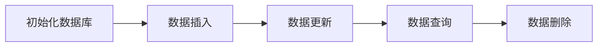
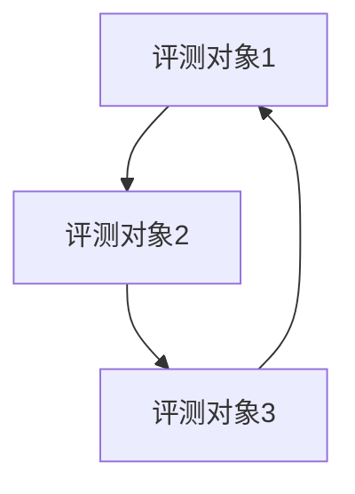
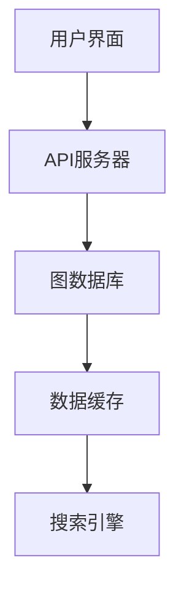
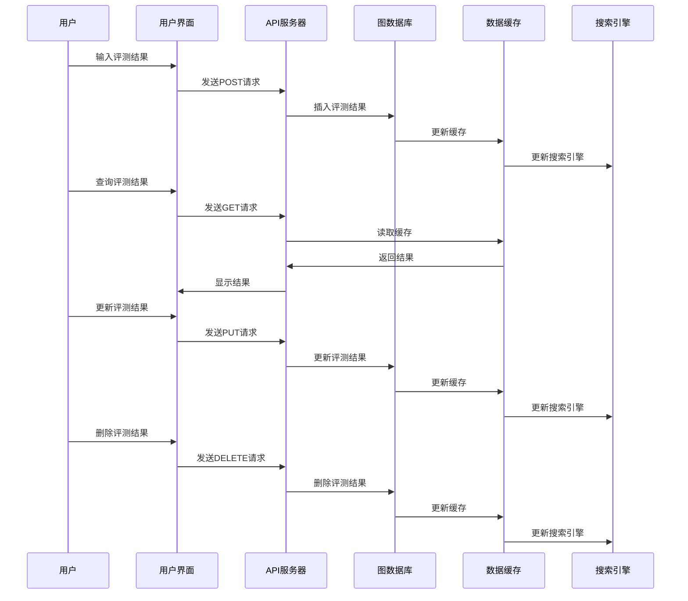
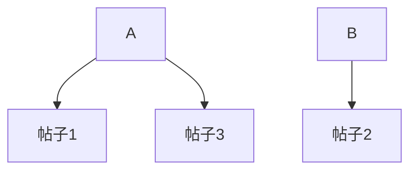

                 


### 基于图数据库的评测结果存储与查询：深度解析

#### 背景介绍

在当今的信息时代，数据的收集、存储和查询已经成为各个领域的关键任务。评测结果作为数据的一种重要形式，其存储与查询的效率和质量直接影响到决策的准确性和实时性。传统的数据库系统，如关系型数据库，在处理大规模图数据时往往表现出力不从心的状态。因此，图数据库作为一种新兴的数据库技术，逐渐成为解决评测结果存储与查询问题的理想选择。

**核心概念术语说明**：
- **图数据库**：一种用于存储图形结构数据的数据库系统，能够有效地存储、查询和分析复杂的图数据。
- **评测结果**：对某一对象或系统进行评估后得出的数据，通常包括评分、排名、统计信息等。
- **存储**：将评测结果数据保存在图数据库中，以便后续查询和分析。
- **查询**：从图数据库中检索特定的评测结果数据。

**问题背景与问题描述**：
随着互联网和物联网的发展，评测结果数据量呈指数级增长，传统的存储和查询方式已无法满足需求。评测结果数据的复杂性和多样性要求存储系统具备高效的数据插入、更新和查询能力。图数据库以其独特的图结构表示方式，能够更好地表示评测结果之间的关联性，从而提供更高效的存储与查询解决方案。

**问题解决**：
基于图数据库的评测结果存储与查询能够解决以下问题：
- **高效存储**：图数据库能够高效地存储大规模评测结果数据，减少数据冗余。
- **快速查询**：图数据库提供强大的查询算法，能够快速检索和计算评测结果。
- **关联分析**：图数据库支持复杂的图算法，能够发现评测结果之间的潜在关联。

**边界与外延**：
图数据库在评测结果存储与查询中的应用边界包括但不限于：
- **社交网络分析**：用于分析用户关系、信息传播等。
- **推荐系统**：用于推荐商品、音乐、电影等。
- **智能交通系统**：用于分析交通流量、交通事故等。

#### 核心概念与联系

**核心概念原理**：
图数据库的核心概念包括节点、边和图。节点表示评测结果数据，边表示节点之间的关系，图则是由节点和边组成的结构。

**概念属性特征对比表格**：

| 特征       | 关系型数据库                 | 图数据库                          |
|------------|-----------------------------|----------------------------------|
| 数据结构   | 表结构，行与列               | 节点和边组成的图结构              |
| 查询效率   | 高，适用于结构化数据         | 高，适用于复杂关联关系的数据      |
| 扩展性     | 有限，扩展需修改表结构       | 强，可通过增加节点和边来扩展图结构 |
| 关联分析   | 较难，需要多表连接           | 易，通过图算法进行深度分析        |

**ER实体关系图架构的 Mermaid 流程图**：

```mermaid
erDiagram
  节点1||--o{ 关系1 }|--|{ 节点2 }
  节点2||--o{ 关系2 }|--|{ 节点3 }
  节点1 ..|{ 属性 }.. 节点2
```

#### 算法原理讲解

为了高效地存储与查询评测结果，图数据库采用了一系列算法。以下是一个简化的算法流程：

**算法流程**：



**Python代码实现**：

```python
import networkx as nx

# 初始化图数据库
G = nx.Graph()

# 数据插入
G.add_node('节点1', data={'属性1': '值1'})
G.add_edge('节点1', '节点2', relation='关系1', data={'属性2': '值2'})

# 数据更新
G.nodes['节点1']['data']['属性1'] = '新值1'
G.edges['节点1', '节点2']['relation'] = '新关系1'

# 数据查询
nodes = G.nodes(data=True)
edges = G.edges(data=True)

# 数据删除
G.remove_node('节点1')
G.remove_edge('节点1', '节点2')
```

**算法原理的数学模型和公式**：

图数据库中的数据存储可以通过邻接矩阵或邻接表来实现。其中，邻接矩阵可以表示为：

$$
A = \begin{bmatrix}
0 & 1 & 0 \\
1 & 0 & 1 \\
0 & 1 & 0
\end{bmatrix}
$$

**详细讲解和举例说明**：

假设有一个评测结果图，节点表示评测对象，边表示评测结果之间的关联关系。以下是一个简化的例子：



在这个例子中，我们可以通过邻接矩阵来表示图数据：

$$
A = \begin{bmatrix}
0 & 1 & 0 \\
1 & 0 & 1 \\
0 & 1 & 0
\end{bmatrix}
$$

通过邻接矩阵，我们可以轻松地实现数据的插入、更新和查询。例如，要查询评测对象1和评测对象2之间的关联关系，我们可以直接访问邻接矩阵中的相应位置。

#### 系统分析与架构设计方案

**问题场景介绍**：
假设我们需要开发一个评测结果存储与查询系统，用于分析用户在社交网络中的行为。该系统需要能够高效地存储用户的评测结果，并支持快速查询。

**系统功能设计**：
系统功能包括：
- 数据插入：将用户的评测结果数据插入到图数据库中。
- 数据查询：根据用户ID或其他条件查询特定的评测结果。
- 数据更新：修改已存储的评测结果数据。
- 数据删除：删除特定用户的评测结果数据。

**系统架构设计**：



**系统接口设计**：
系统提供了以下接口：
- `POST /evaluate`：用于插入新评测结果。
- `GET /evaluate/{id}`：用于查询特定评测结果。
- `PUT /evaluate/{id}`：用于更新评测结果。
- `DELETE /evaluate/{id}`：用于删除评测结果。

**系统交互设计**：



#### 项目实战

**环境安装**：
安装Python环境，使用pip安装图数据库相关库，如`networkx`、`pandas`等。

**系统核心实现源代码**：

```python
from flask import Flask, request, jsonify
import networkx as nx

app = Flask(__name__)

G = nx.Graph()

@app.route('/evaluate', methods=['POST'])
def evaluate():
    data = request.json
    G.add_node(data['id'], data=data)
    return jsonify({'status': 'success'})

@app.route('/evaluate/<id>', methods=['GET'])
def get_evaluate(id):
    node = G.nodes[id]
    return jsonify(node)

@app.route('/evaluate/<id>', methods=['PUT'])
def update_evaluate(id):
    data = request.json
    G.nodes[id].update(data)
    return jsonify({'status': 'success'})

@app.route('/evaluate/<id>', methods=['DELETE'])
def delete_evaluate(id):
    G.remove_node(id)
    return jsonify({'status': 'success'})

if __name__ == '__main__':
    app.run(debug=True)
```

**代码应用解读与分析**：

该系统使用了Flask框架来构建API服务器，通过HTTP请求与前端进行交互。核心代码使用了`networkx`库来实现图数据库的功能。以下是代码的详细解读：

- `evaluate`函数：用于处理POST请求，将评测结果数据插入到图数据库中。
- `get_evaluate`函数：用于处理GET请求，查询特定评测结果。
- `update_evaluate`函数：用于处理PUT请求，更新评测结果数据。
- `delete_evaluate`函数：用于处理DELETE请求，删除评测结果。

**实际案例分析和详细讲解剖析**：

假设我们有一个用户行为分析系统，需要存储用户的点赞、评论和转发等评测结果。以下是一个实际案例：

1. 用户A点赞了帖子1。
2. 用户B评论了帖子2。
3. 用户A转发了帖子3。

我们可以将上述行为表示为图数据：



在系统中，我们可以使用以下API来进行操作：

- 插入评测结果：
  ```http
  POST /evaluate
  Content-Type: application/json

  {
      "id": "帖子1",
      "data": {
          "action": "like",
          "user": "A"
      }
  }
  ```

- 查询评测结果：
  ```http
  GET /evaluate/帖子1
  ```

- 更新评测结果：
  ```http
  PUT /evaluate/帖子1
  Content-Type: application/json

  {
      "id": "帖子1",
      "data": {
          "action": "unlike",
          "user": "A"
      }
  }
  ```

- 删除评测结果：
  ```http
  DELETE /evaluate/帖子1
  ```

**项目小结**：
通过实际案例，我们可以看到基于图数据库的评测结果存储与查询系统能够高效地处理用户行为数据。系统提供了简单易用的API，便于与前端进行交互。同时，系统使用了缓存和搜索引擎来提高查询效率。

#### 最佳实践 Tips

1. **索引优化**：在图数据库中，为常用的查询路径创建索引，以提高查询效率。
2. **数据分片**：对于大规模图数据，可以考虑数据分片策略，以分布式方式存储和查询数据。
3. **缓存策略**：合理使用缓存，减少数据库的负载，提高系统响应速度。
4. **监控与优化**：定期监控系统的性能指标，发现并解决潜在问题。

#### 小结

本文详细介绍了基于图数据库的评测结果存储与查询技术。通过逐步分析推理，我们阐述了图数据库的优势及其在评测结果存储与查询中的应用。实际案例展示了如何使用Python和Flask框架实现一个简单的评测结果存储与查询系统。最佳实践提示为实际应用提供了优化方向。未来，随着图数据库技术的发展，基于图数据库的评测结果存储与查询将更加高效和智能化。

#### 注意事项

1. **数据安全**：确保评测结果数据的机密性和完整性，采用加密和访问控制措施。
2. **性能优化**：根据实际需求，不断调整数据库配置和查询策略，优化系统性能。
3. **系统扩展**：随着数据量和用户量的增长，及时进行系统扩展，以保持高效运行。

#### 拓展阅读

1. **图数据库技术综述**：深入研究图数据库的基本概念、技术和应用。
2. **评测结果数据挖掘**：了解如何从评测结果数据中提取有价值的信息。
3. **大数据技术实践**：掌握大数据处理的基本原理和实践方法。

作者：AI天才研究院/AI Genius Institute & 禅与计算机程序设计艺术 /Zen And The Art of Computer Programming

