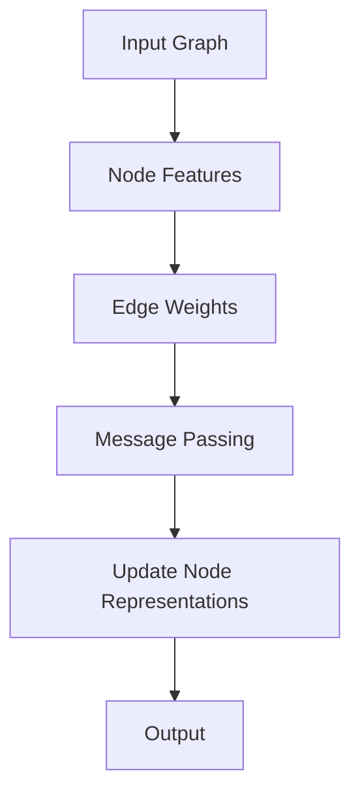
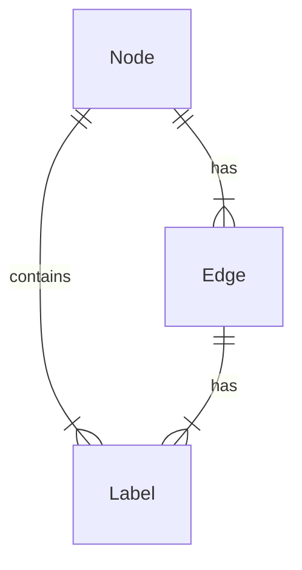
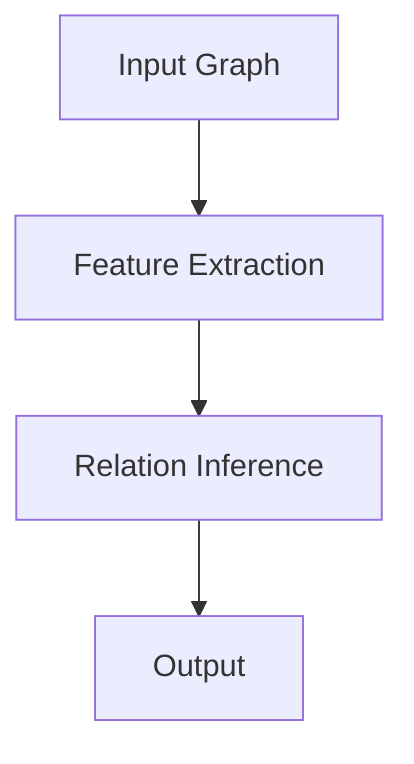
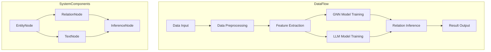
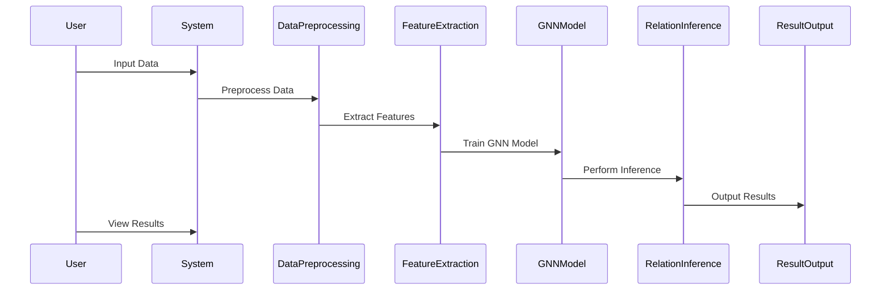

                 


## 基于图神经网络的LLM关系推理能力评估

### 关键词：
- 图神经网络
- 大规模语言模型
- 关系推理能力
- 评估方法
- 实践应用

### 摘要：
本文将探讨如何利用图神经网络（GNN）来提升大规模语言模型（LLM）的关系推理能力，并通过一系列评估方法对这种能力进行深入分析。我们将从背景介绍开始，逐步深入到核心概念与联系、算法原理讲解、系统分析与架构设计方案，再到项目实战与最佳实践，为读者提供一份全面的技术指南。

---

## 第1章 问题背景与核心概念

### 1.1 问题背景

随着人工智能技术的快速发展，图神经网络（GNN）和大规模语言模型（LLM）成为了研究领域和工业界关注的焦点。GNN擅长处理图结构数据，而LLM则在自然语言处理（NLP）领域表现出色。然而，如何结合两者的优势，提高LLM在关系推理任务中的能力，仍是一个具有挑战性的问题。

### 1.2 关键概念

#### 1.2.1 图神经网络（GNN）

图神经网络是一种神经网络架构，专门设计用于处理图结构数据。它通过一系列的图卷积操作来更新节点的表示，从而捕获图中的复杂关系。

#### 1.2.2 大规模语言模型（LLM）

大规模语言模型是一种基于深度学习的模型，它通过对大量文本数据的学习，能够生成或理解复杂的自然语言文本。LLM在语言生成、文本分类、问答系统等方面有着广泛应用。

#### 1.2.3 关系推理

关系推理是指从一个实体集合中推断出实体之间存在的各种关系。在知识图谱、信息检索、推荐系统等领域，关系推理能力至关重要。

### 1.3 目标与范围

本文的目标是探讨如何利用GNN增强LLM的关系推理能力，并通过实验评估其效果。文章将涵盖GNN和LLM的基本原理，以及它们在关系推理任务中的结合方法。

---

## 第2章 图神经网络原理

### 2.1 GNN基本概念

图神经网络（GNN）是一种基于图的神经网络模型，它通过学习图上的节点和边之间的关系来提取图结构中的有用信息。

#### 2.1.1 定义

GNN是一种层次化的神经网络，每一层通过消息传递（message passing）机制来更新节点和边的表示。

#### 2.1.2 特点

- **可扩展性**：GNN能够处理大规模图数据。
- **适应性**：GNN可以根据不同的图结构进行调整。
- **灵活性**：GNN能够同时处理异构图和同构图。

### 2.2 GNN算法原理

GNN的核心在于图卷积操作，该操作通过邻居节点的信息来更新当前节点的表示。下面是一个简单的图卷积操作的数学模型：

$$
\hat{h}_i^{(l+1)} = \sigma \left( \sum_{j \in \mathcal{N}(i)} W_{ij} h_j^{(l)} + b \right)
$$

其中，$h_i^{(l)}$是第$l$层第$i$个节点的特征表示，$\mathcal{N}(i)$是节点$i$的邻居集合，$W_{ij}$是边权重，$b$是偏置项，$\sigma$是激活函数。

#### 2.2.1 Mermaid流程图



#### 2.2.2 数学模型

$$
\text{GNN}(\mathbf{X}, \mathbf{A}) = \text{Relu}\left(\mathbf{X} \mathbf{W}^0 + \sum_{(i,j) \in \mathbf{A}} \mathbf{h}_i \cdot \mathbf{h}_j \mathbf{W}^1\right)
$$

其中，$\mathbf{X}$是节点的特征矩阵，$\mathbf{A}$是边的邻接矩阵，$\mathbf{W}^0$和$\mathbf{W}^1$是权重矩阵。

#### 2.2.3 Python代码示例

```python
import torch
import torch.nn as nn
import torch.nn.functional as F

class GraphConvolution(nn.Module):
    def __init__(self, input_dim, output_dim):
        super(GraphConvolution, self).__init__()
        self.weight = nn.Parameter(torch.Tensor(input_dim, output_dim))
        self.bias = nn.Parameter(torch.Tensor(output_dim))
        
    def forward(self, input, adj):
        support = torch.mm(input, self.weight)
        output = torch.sum(adj * support, 1)
        output = F.relu(output + self.bias)
        return output

# Example usage
input_data = torch.randn(10, 128)  # 10 nodes with 128-dimensional features
adj_matrix = torch.randn(10, 10)  # Adjacency matrix for the graph
gcn = GraphConvolution(128, 64)
output = gcn(input_data, adj_matrix)
```

---

## 第3章 大规模语言模型（LLM）

### 3.1 LLM基本概念

大规模语言模型（LLM）是通过学习大规模文本数据来生成或理解自然语言文本的深度学习模型。LLM的核心在于其强大的文本生成能力和对上下文的理解。

#### 3.1.1 定义

LLM通常采用变换器模型（Transformer）或其变种，如BERT、GPT等，它们通过自注意力机制（self-attention）来处理长距离依赖和上下文信息。

#### 3.1.2 特点

- **强大生成能力**：LLM能够生成连贯且具有逻辑性的文本。
- **上下文理解**：LLM能够理解并生成与给定文本相关的信息。
- **自适应**：LLM可以根据不同的任务和领域进行调整。

### 3.2 LLM架构

LLM的架构通常包括编码器（Encoder）和解码器（Decoder），其中编码器负责处理输入文本并生成上下文向量，解码器则利用这些向量生成输出文本。

#### 3.2.1 Mermaid ER图



#### 3.2.2 数学模型

$$
\text{LLM}(x) = \text{softmax}(\text{W}^T \text{ReLU}(\text{U} \text{x} + \text{b}_U) + \text{V} \text{x} + \text{b}_V)
$$

其中，$x$是输入文本，$W$、$U$、$V$是权重矩阵，$\text{ReLU}$是ReLU激活函数，$\text{softmax}$是softmax函数。

#### 3.2.3 Python代码示例

```python
import torch
import torch.nn as nn

class LLM(nn.Module):
    def __init__(self, embedding_dim, hidden_dim):
        super(LLM, self).__init__()
        self.encoder = nn.Linear(embedding_dim, hidden_dim)
        self.decoder = nn.Linear(hidden_dim, embedding_dim)
        
    def forward(self, x):
        hidden = self.encoder(x)
        output = self.decoder(hidden)
        return output

# Example usage
input_data = torch.randn(1, 128)  # 128-dimensional input
llm = LLM(128, 64)
output = llm(input_data)
```

---

## 第4章 关系推理基本理论

### 4.1 关系推理概念

关系推理是指从一个实体集合中推断出实体之间存在的各种关系。在知识图谱、信息检索、推荐系统等领域，关系推理能力至关重要。

#### 4.1.1 定义

关系推理是一种基于实体和属性的信息处理过程，旨在从已知的实体和属性中推断出未知的关系。

#### 4.1.2 类型

- **显式关系推理**：根据已知实体和属性直接推断出明确的关系。
- **隐式关系推理**：通过推理和逻辑推导来发现潜在的关系。

### 4.2 关系推理方法

关系推理方法通常包括特征提取、关系分类和关系预测等步骤。

#### 4.2.1 Mermaid流程图



#### 4.2.2 关系推理挑战

- **数据稀疏性**：知识图谱中实体和关系的数据稀疏性给关系推理带来了挑战。
- **长距离依赖**：在处理长距离依赖时，关系推理需要捕捉实体之间的复杂关系。
- **噪声和异常**：知识图谱中的噪声和异常数据会影响关系推理的准确性。

---

## 第5章 系统分析与架构设计方案

### 5.1 问题场景介绍

在本章节中，我们将介绍一个实际的问题场景，用于展示如何将GNN和LLM结合用于关系推理任务。

### 5.2 项目介绍

我们将介绍一个具体的项目，该项目旨在利用GNN和LLM来增强关系推理能力，并实现一个自动化的关系推理系统。

### 5.3 系统功能设计

我们将使用Mermaid类图来展示系统的主要功能模块，包括数据预处理、GNN模型训练、LLM模型训练和关系推理等。

#### 5.3.1 Mermaid类图

```mermaid
classDiagram
    EntityNode <-|- DataPreprocessing: 处理输入数据
    RelationNode <-|- GNNModel: 训练GNN模型
    TextNode <-|- LLMModel: 训练LLM模型
    InferenceNode <-|- RelationInference: 执行关系推理
    EntityNode ++-- EntityDatabase: 实体数据库
    RelationNode ++-- RelationDatabase: 关系数据库
    TextNode ++-- TextDatabase: 文本数据库
    InferenceNode ++-- ResultOutput: 输出推理结果
```

### 5.4 系统架构设计

我们将使用Mermaid架构图来展示系统的整体架构，包括数据流、模块交互和关键组件等。

#### 5.4.1 Mermaid架构图



### 5.5 系统接口设计和系统交互

我们将使用Mermaid序列图来展示系统的主要接口设计和交互流程。

#### 5.5.1 Mermaid序列图



---

## 第6章 项目实战

### 6.1 环境安装

在本章节中，我们将介绍如何安装和配置所需的软件和库，为项目实战做准备。

### 6.2 系统核心实现源代码

我们将提供项目的核心实现源代码，包括数据预处理、GNN模型训练、LLM模型训练和关系推理等关键组件。

### 6.3 代码应用解读与分析

我们将详细解读和分析项目的源代码，解释每个模块的功能和实现细节。

### 6.4 实际案例分析和详细讲解剖析

我们将通过实际案例来展示如何使用本项目进行关系推理，并详细讲解和分析案例的结果。

### 6.5 项目小结

在本章节的最后，我们将对本项目的整体实现和效果进行总结，并提出改进建议。

---

## 第7章 最佳实践、小结、注意事项和拓展阅读

### 7.1 最佳实践

在本章节中，我们将分享一些最佳实践和技巧，帮助读者更好地理解和应用基于图神经网络的LLM关系推理能力评估。

### 7.2 小结

我们将对本文的主要内容进行总结，并强调关键概念和技术的应用。

### 7.3 注意事项

在本章节中，我们将提醒读者在应用本项目时需要注意的事项和潜在问题。

### 7.4 拓展阅读

我们将推荐一些相关的文献和资料，供读者进一步学习和研究。

---

## 作者信息

作者：AI天才研究院/AI Genius Institute & 禅与计算机程序设计艺术 /Zen And The Art of Computer Programming

---

通过上述章节内容的逐步讲解，我们希望读者能够深入理解基于图神经网络的LLM关系推理能力评估，并能够将其应用于实际项目中。我们相信，通过本文的深入分析和思考，读者将能够掌握这一先进技术，并在人工智能领域取得更大的突破。

