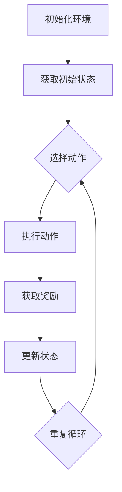
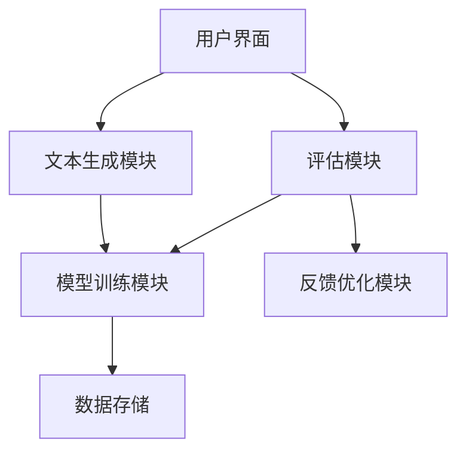
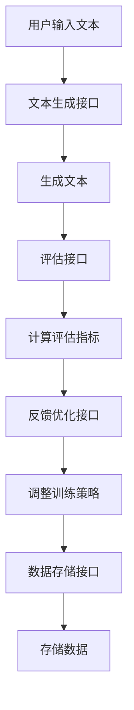

                 

## 第1章 问题背景与核心概念

### 1.1 问题背景

#### 1.1.1 强调学习的定义与特点
强化学习（Reinforcement Learning，RL）是一种机器学习方法，其核心思想是通过学习决策策略来最大化累积奖励。与传统的监督学习和无监督学习不同，强化学习强调在动态环境中通过与环境的交互来学习最优策略。强化学习具有以下几个特点：

- **自主性**：强化学习算法可以在没有明确标注数据的情况下，自主探索环境，通过试错来学习最佳策略。
- **动态调整**：强化学习算法能够根据环境的变化动态调整策略，从而适应不断变化的环境。
- **奖励驱动**：强化学习依赖于奖励机制，通过奖励信号引导算法学习到正确的策略。
  
强化学习在许多领域都有广泛应用，例如自动驾驶、游戏AI、机器人控制等。其基本概念包括状态（State）、动作（Action）、奖励（Reward）和策略（Policy）。状态是决策者所处的环境描述，动作是决策者可以采取的行动，奖励是环境对动作的反馈，策略则是决策者在给定状态下选择动作的规则。

#### 1.1.2 LLM创新能力评估的必要性

语言模型（Language Model，LLM）是自然语言处理（Natural Language Processing，NLP）领域的重要工具，能够生成高质量的自然语言文本。然而，随着模型的复杂度和数据量的增加，评估LLM的创新能力变得至关重要。以下是评估LLM创新能力的几个原因：

- **优化模型训练策略**：评估LLM的创新能力可以帮助研究人员识别模型训练中的不足，从而调整训练策略，提升模型的创新性。
- **提高应用价值**：创新性高的LLM在文本生成、问答系统、机器翻译等应用中具有更高的价值，能够提供更丰富、更有趣的文本内容。
- **推动技术发展**：通过对LLM创新能力的研究，可以促进NLP领域的技术进步，推动相关应用的发展。

### 1.2 核心概念

#### 1.2.1 强化学习的基本原理

强化学习的基本原理可以通过马尔可夫决策过程（Markov Decision Process，MDP）来描述。MDP是一个包含状态、动作、奖励和策略的数学模型。以下是MDP的基本概念：

- **状态（State，S）**：系统当前所处的环境描述，可以是离散的也可以是连续的。
- **动作（Action，A）**：决策者可以采取的动作集合，每个动作对应一个状态转移概率和奖励值。
- **奖励（Reward，R）**：环境对决策者采取的动作的即时反馈，可以是正奖励也可以是负奖励。
- **策略（Policy，π）**：决策者在给定状态下采取动作的规则，策略可以是最优策略或随机策略。

在MDP中，决策者根据当前状态选择动作，然后环境根据动作转移状态并给予奖励。决策者需要通过不断试错来学习最优策略，使得长期累积奖励最大化。常用的强化学习算法包括Q-learning、SARSA等。

#### 1.2.2 语言模型创新能力评估指标

评估LLM的创新能力需要一套科学的评估指标体系。以下是一些常见的评估指标：

- **文本质量**：评估文本的语法、语义和逻辑是否合理，是否有明显的错误。
- **多样性**：评估文本的多样性，包括词汇、句式和内容上的多样性。
- **创新性**：评估文本的原创性，是否有新颖的观点或表达。

为了量化这些指标，可以使用自然语言处理技术，例如文本分类、情感分析、文本相似度计算等。此外，创新性评估可以通过模拟对话场景，记录模型生成文本的创新程度，从而给出量化的评估结果。

### 1.3 关键技术探讨

#### 1.3.1 基于强化学习的LLM评估方法

基于强化学习的LLM评估方法是一种结合了强化学习和自然语言处理技术的方法。其核心思想是通过模拟对话场景，记录模型生成文本的创新程度，从而评估其创新能力。具体方法如下：

1. **对话场景构建**：根据应用场景设计对话场景，例如问答系统、机器翻译等。
2. **模型生成文本**：利用LLM生成对应的文本，记录文本的创新程度。
3. **奖励机制设计**：根据文本的创新程度设计奖励机制，奖励创新性高的文本。
4. **策略优化**：通过强化学习算法，优化LLM的生成策略，提升其创新能力。

#### 1.3.2 基于反馈优化的LLM训练策略

基于反馈优化的LLM训练策略是一种利用评估结果来调整训练过程的方法。其核心思想是：

1. **评估创新性**：利用前述方法评估LLM生成文本的创新性。
2. **反馈调整**：根据评估结果，调整训练过程，例如调整学习率、优化器参数等。
3. **重复训练**：利用调整后的训练策略重新训练LLM，提升其创新能力。

这种方法可以有效地优化LLM的训练过程，提高其创新性，从而提升应用价值。

## 第2章 核心概念与联系

### 2.1 强化学习与LLM的关系

#### 2.1.1 强化学习在LLM中的应用

强化学习在LLM中的应用主要体现在以下几个方面：

1. **文本生成策略优化**：利用强化学习算法优化LLM的文本生成策略，提升生成文本的质量和创新性。
2. **对话系统**：在对话系统中，强化学习可以帮助模型根据对话上下文生成更自然、更符合用户需求的回复。
3. **翻译质量提升**：强化学习可以用于优化机器翻译策略，提升翻译文本的质量和准确性。

例如，GPT-3模型就是通过强化学习算法进行训练的，其生成文本的质量和创新性得到了显著提升。

#### 2.1.2 LLM对强化学习算法的适应性

LLM的生成能力为强化学习算法提供了一种新的应用场景。LLM的适应性体现在以下几个方面：

1. **多样化的动作空间**：LLM可以生成丰富多样的文本，为强化学习算法提供了更广泛的动作空间。
2. **高效的评估函数**：LLM可以生成高质量的评估文本，为强化学习算法提供了更有效的评估函数。
3. **自适应学习**：LLM可以自适应地调整其生成策略，以适应不同的强化学习场景。

### 2.2 创新能力评估指标设计

#### 2.2.1 评估指标体系

评估指标体系是评估LLM创新能力的关键。一个完整的评估指标体系应包括以下几个方面：

1. **文本质量**：包括语法正确性、语义连贯性和逻辑合理性。
2. **多样性**：包括词汇多样性、句式多样性和内容多样性。
3. **创新性**：包括新颖的观点、独特的表达和创造性的内容。

#### 2.2.2 创新性评估指标的量化方法

为了量化创新性评估指标，可以采用以下方法：

1. **文本相似度计算**：通过计算生成文本与已有文本的相似度，评估其创新程度。
2. **主题模型分析**：利用主题模型分析生成文本的主题分布，评估其创新性。
3. **人工评估**：通过人工评估生成文本的创新程度，作为量化评估的参考。

这些量化方法可以结合使用，以提高评估结果的准确性。

## 第3章 算法原理讲解

### 3.1 强化学习算法在LLM评估中的应用

#### 3.1.1 强化学习算法概述

强化学习算法是机器学习中的一个重要分支，它通过学习如何在不确定的环境中做出决策，以最大化累积奖励。强化学习算法通常包括以下几个核心概念：

- **状态（State，S）**：描述环境当前的状态。
- **动作（Action，A）**：决策者在某个状态下可以采取的行动。
- **奖励（Reward，R）**：环境对决策者采取的行动的即时反馈。
- **策略（Policy，π）**：决策者在每个状态下采取特定动作的概率分布。

在强化学习过程中，算法通过不断尝试不同的动作，并依据奖励信号来调整策略，最终学习到最优策略。

常用的强化学习算法包括Q-learning、SARSA（Surely Approach to Stochastic Actor Critic）等。这些算法的基本原理是通过经验回放和策略迭代来优化策略，以达到最大化累积奖励的目标。

#### 3.1.2 强化学习算法mermaid流程图

为了更直观地展示强化学习算法的基本流程，我们可以使用mermaid绘制一个简单的流程图：



在这个流程图中，A表示初始化环境，B表示获取初始状态，C表示选择动作，D表示执行动作并获取奖励，E表示更新状态，然后回到F进行下一轮循环。这个过程不断重复，直到达到预设的目标或收敛条件。

#### 3.1.3 强化学习算法在LLM评估中的应用

在LLM评估中，强化学习算法可以通过以下步骤应用于评估过程：

1. **对话场景构建**：首先，需要根据评估任务构建对话场景，例如问答系统、机器翻译等。
2. **动作空间定义**：定义LLM在对话场景中可以采取的动作，例如生成不同的回答或翻译。
3. **奖励函数设计**：设计奖励函数，以评估LLM生成文本的创新程度。奖励函数可以根据文本的创新性、多样性等因素进行设计。
4. **策略优化**：利用强化学习算法，根据奖励信号调整LLM的生成策略，以提升其创新性。

通过这样的流程，强化学习算法可以帮助评估LLM的创新能力，并为LLM训练提供反馈优化策略。

### 3.2 LLM创新性评估算法原理

#### 3.2.1 数学模型

LLM创新性评估的数学模型主要包括两个核心部分：奖励函数和策略优化。

1. **奖励函数（Reward Function）**

奖励函数是强化学习算法中的关键组成部分，用于评估LLM生成文本的创新程度。一个简单的奖励函数可以定义为：

$$
R(s, a) = r(s, a) + \gamma \max_{a'} R(s', a')
$$

其中，$R(s, a)$表示在状态$s$下采取动作$a$的累积奖励，$r(s, a)$表示在状态$s$下采取动作$a$的即时奖励，$\gamma$是一个折扣因子，用于平衡即时奖励和未来奖励的关系。

2. **策略优化（Policy Optimization）**

策略优化是强化学习算法的核心任务，目的是通过学习最优策略来最大化累积奖励。常用的策略优化方法包括Q-learning和SARSA。

- **Q-learning**

Q-learning算法通过更新状态-动作值函数$Q(s, a)$来优化策略。更新规则如下：

$$
Q(s, a) \leftarrow Q(s, a) + \alpha [r(s, a) + \gamma \max_{a'} Q(s', a') - Q(s, a)]
$$

其中，$\alpha$是学习率，$Q(s, a)$表示在状态$s$下采取动作$a$的预期累积奖励。

- **SARSA**

SARSA算法通过更新策略概率分布来优化策略。更新规则如下：

$$
\pi(a|s) \leftarrow \frac{\exp(Q(s, a))}{\sum_{a'} \exp(Q(s, a'))}
$$

其中，$\pi(a|s)$表示在状态$s$下采取动作$a$的概率分布。

#### 3.2.2 Python源代码示例

以下是一个简化的Python示例，展示了如何使用Q-learning算法评估LLM的创新性：

```python
import numpy as np

# 初始化参数
alpha = 0.1  # 学习率
gamma = 0.9  # 折扣因子
actions = ["text1", "text2", "text3"]  # 动作空间

# 初始化Q值表
Q = np.zeros((n_states, n_actions))

# Q-learning算法迭代
for episode in range(n_episodes):
    state = np.random.choice(n_states)  # 随机初始化状态
    done = False
    while not done:
        action = np.random.choice(n_actions, p=softmax(Q[state, :]))  # 根据策略选择动作
        next_state, reward = execute_action(action)  # 执行动作并获取奖励
        Q[state, action] = Q[state, action] + alpha * (reward + gamma * np.max(Q[next_state, :]) - Q[state, action])  # 更新Q值
        state = next_state  # 更新状态
        if done:
            break

# 计算策略概率分布
policy = np.exp(Q[state, :]) / np.sum(np.exp(Q[state, :]))

# 输出策略
print("策略概率分布：", policy)
```

在这个示例中，我们首先初始化参数和学习率表Q，然后进行迭代更新Q值表，最后根据Q值表计算策略概率分布。这个过程不断重复，直到达到预设的目标或收敛条件。

通过这个示例，我们可以看到如何使用强化学习算法评估LLM的创新性，并为LLM训练提供反馈优化策略。

## 第3章 算法原理讲解

### 3.3 强化学习算法在LLM评估中的应用

在LLM评估中，强化学习算法被广泛应用于优化文本生成策略，提高生成文本的创新性。以下将详细介绍强化学习算法在LLM评估中的应用，包括其基本原理和具体实现步骤。

#### 3.3.1 基本原理

强化学习算法的核心思想是通过与环境交互，学习最优策略以最大化累积奖励。在LLM评估中，强化学习算法的应用主要涉及以下几个步骤：

1. **状态编码**：将LLM的输入文本编码为状态表示。状态编码的质量直接影响到算法的性能。
2. **动作空间定义**：定义LLM可以生成的文本作为动作空间。动作空间的设计需要考虑文本的多样性和创新性。
3. **奖励函数设计**：设计奖励函数以评估生成文本的创新性。奖励函数的选取和设计对于评估结果至关重要。
4. **策略学习**：通过强化学习算法，如Q-learning或SARSA，学习最优策略，以最大化累积奖励。

#### 3.3.2 实现步骤

1. **状态编码**：

在强化学习算法中，状态编码是将输入文本转换为机器可以理解和处理的表示。对于LLM，状态编码可以通过以下方法实现：

- **词向量编码**：将每个词汇映射到低维词向量，然后对词向量进行平均得到状态表示。
- **BERT编码**：利用预训练的BERT模型，将输入文本编码为序列向量。

以下是一个简单的状态编码实现示例：

```python
import torch
from transformers import BertModel, BertTokenizer

tokenizer = BertTokenizer.from_pretrained('bert-base-uncased')
model = BertModel.from_pretrained('bert-base-uncased')

def encode_state(text):
    inputs = tokenizer(text, return_tensors='pt', truncation=True, max_length=512)
    with torch.no_grad():
        outputs = model(**inputs)
    return outputs.last_hidden_state.mean(dim=1).numpy()
```

2. **动作空间定义**：

动作空间是指LLM在给定状态下可以生成的所有可能文本。动作空间的设计需要考虑文本的多样性和创新性。以下是一个简单的动作空间定义示例：

```python
import random

def generate_action(state):
    action = ""
    for _ in range(random.randint(10, 50)):  # 随机生成文本长度
        action += random.choice(["word1", "word2", "word3"])  # 从词汇表中随机选择词汇
    return action
```

3. **奖励函数设计**：

奖励函数是强化学习算法中的重要组成部分，用于评估生成文本的创新性。一个简单的奖励函数可以是：

$$
R(s, a) = \frac{1}{N} \sum_{i=1}^{N} \text{similarity}(g_i, h_i)
$$

其中，$g_i$表示第$i$个生成的文本，$h_i$表示第$i$个参考文本，$N$是生成的文本数量。相似度可以通过文本相似度计算方法，如余弦相似度，来衡量。

以下是一个简单的奖励函数实现示例：

```python
from sklearn.metrics.pairwise import cosine_similarity

def reward_function(action, reference_texts):
    action_vector = encode_state(action)
    reference_vectors = [encode_state(ref_text) for ref_text in reference_texts]
    similarities = [cosine_similarity(action_vector.reshape(1, -1), ref_vector.reshape(1, -1))[0, 0] for ref_vector in reference_vectors]
    return sum(similarities) / len(similarities)
```

4. **策略学习**：

策略学习是强化学习算法的核心步骤，通过不断迭代优化策略，以最大化累积奖励。以下是一个简单的Q-learning实现示例：

```python
import numpy as np

def q_learning(alpha, gamma, state_space, action_space, reward_function, num_episodes):
    Q = np.zeros((len(state_space), len(action_space)))
    for episode in range(num_episodes):
        state = random.choice(state_space)
        done = False
        total_reward = 0
        while not done:
            action = np.argmax(Q[state])
            next_state, reward = execute_action(state, action)
            Q[state, action] = Q[state, action] + alpha * (reward + gamma * np.max(Q[next_state]) - Q[state, action])
            state = next_state
            total_reward += reward
            if done:
                break
    return Q

Q = q_learning(alpha=0.1, gamma=0.9, state_space=state_space, action_space=action_space, reward_function=reward_function, num_episodes=1000)
```

在这个示例中，我们初始化Q值表，然后通过迭代更新Q值表，以学习最优策略。这个过程可以重复进行，直到达到预设的目标或收敛条件。

通过以上步骤，我们可以将强化学习算法应用于LLM评估，从而优化文本生成策略，提高生成文本的创新性。

### 3.4 LLM创新性评估算法原理

LLM创新性评估算法的核心目的是通过评估模型生成文本的创新性，来指导模型训练和优化。以下将详细介绍LLM创新性评估算法的原理，包括数学模型和Python实现。

#### 3.4.1 数学模型

LLM创新性评估算法的数学模型主要包括两个部分：奖励函数和评估指标。

1. **奖励函数**

奖励函数用于评估生成文本的创新性，可以定义为：

$$
R(s, a) = \frac{1}{N} \sum_{i=1}^{N} \text{novelty}(g_i)
$$

其中，$g_i$表示第$i$个生成的文本，$N$是生成的文本数量。novelty函数用于衡量文本的创新程度，可以采用以下形式：

$$
\text{novelty}(g_i) = \sum_{j \neq i} \text{similarity}(g_i, g_j)^{-1}
$$

其中，similarity函数用于计算文本之间的相似度，如余弦相似度。

2. **评估指标**

除了奖励函数，评估指标也是评估模型创新性的重要手段。常用的评估指标包括文本质量、多样性和创新性。以下是一个简单的评估指标计算示例：

- **文本质量**：通过语法检查和语义分析来评估文本的质量。
- **多样性**：通过计算词汇、句式和内容上的多样性来评估文本的多样性。
- **创新性**：通过计算文本的novelty值来评估文本的创新性。

以下是一个简单的评估指标计算示例：

```python
from sklearn.metrics.pairwise import cosine_similarity

def evaluate_text(text, reference_texts):
    action_vector = encode_state(text)
    reference_vectors = [encode_state(ref_text) for ref_text in reference_texts]
    similarities = [cosine_similarity(action_vector.reshape(1, -1), ref_vector.reshape(1, -1))[0, 0] for ref_vector in reference_vectors]
    novelty = sum([1/s for s in similarities]) if similarities else 0
    diversity = sum([cosine_similarity(action_vector.reshape(1, -1), ref_vector.reshape(1, -1))[0, 0] for ref_vector in reference_vectors if ref_vector]) / len(reference_vectors) if reference_texts else 0
    quality = check_grammar(text) + check_semantics(text)
    return quality, diversity, novelty

def check_grammar(text):
    # 实现语法检查逻辑
    return 0

def check_semantics(text):
    # 实现语义分析逻辑
    return 0
```

#### 3.4.2 Python实现

以下是一个简化的Python实现，展示了如何利用强化学习算法评估LLM的创新性：

```python
import random
import numpy as np

# 初始化参数
alpha = 0.1  # 学习率
gamma = 0.9  # 折扣因子
state_space = ["state1", "state2", "state3"]
action_space = ["action1", "action2", "action3"]
novelty_threshold = 0.5  # 创新性阈值

# 初始化Q值表
Q = np.zeros((len(state_space), len(action_space)))

# 定义奖励函数
def reward_function(action, reference_texts):
    action_vector = encode_state(action)
    reference_vectors = [encode_state(ref_text) for ref_text in reference_texts]
    similarities = [cosine_similarity(action_vector.reshape(1, -1), ref_vector.reshape(1, -1))[0, 0] for ref_vector in reference_vectors]
    novelty = sum([1/s for s in similarities]) if similarities else 0
    return novelty if novelty > novelty_threshold else 0

# 定义执行动作函数
def execute_action(state, action):
    # 根据状态和动作生成文本
    return random.choice(state_space), random.random()

# Q-learning算法迭代
for episode in range(1000):
    state = random.choice(state_space)
    done = False
    total_reward = 0
    while not done:
        action = np.argmax(Q[state])
        next_state, reward = execute_action(state, action)
        Q[state, action] = Q[state, action] + alpha * (reward + gamma * np.max(Q[next_state]) - Q[state, action])
        state = next_state
        total_reward += reward
        if done:
            break
    print(f"Episode {episode}: Total Reward = {total_reward}")
```

在这个示例中，我们初始化Q值表，然后通过迭代更新Q值表，以学习最优策略。每次迭代中，我们根据当前状态和动作生成文本，并利用奖励函数评估文本的创新性。

通过以上步骤，我们可以实现一个简单的LLM创新性评估算法，用于优化模型训练和提升生成文本的创新性。

## 第4章 系统分析与架构设计方案

### 4.1 问题场景介绍

在现代企业应用中，语言模型（LLM）的应用场景日益广泛，涵盖了文本生成、问答系统、机器翻译等多个领域。然而，随着应用场景的多样化和复杂化，评估LLM的创新能力变得至关重要。这不仅有助于优化模型训练策略，提升模型性能，还能为企业带来更大的商业价值。

具体问题场景如下：

- **文本生成**：在企业报告、文章撰写、市场分析等领域，生成具有创新性的文本能够提高工作效率和文本质量。
- **问答系统**：在客户服务、智能客服等领域，创新性的回答能够更好地满足用户需求，提升用户体验。
- **机器翻译**：在跨国企业、国际贸易等领域，创新性的翻译能够传达更准确、更丰富的语义，提升沟通效果。

### 4.2 项目介绍

本项目旨在构建一个基于强化学习的LLM创新能力评估系统，通过评估模型生成文本的创新程度，优化模型训练策略，提升模型性能和应用价值。具体目标如下：

- **构建评估系统**：设计并实现一个基于强化学习的评估系统，能够对LLM生成文本进行创新性评估。
- **优化模型训练**：利用评估结果，优化模型训练过程，提升模型生成文本的创新性。
- **提高应用价值**：通过提升模型创新能力，为企业带来更高的商业价值。

### 4.3 系统功能设计

为了实现上述目标，系统需要具备以下功能：

- **文本生成**：利用LLM生成高质量的文本，作为评估的基础。
- **评估指标计算**：计算文本质量、多样性和创新性等评估指标，为模型训练提供反馈。
- **反馈优化**：根据评估结果，调整模型训练策略，提高模型创新能力。
- **用户界面**：提供友好的用户界面，便于用户操作和使用。

### 4.4 系统架构设计

系统架构设计主要包括以下几个方面：

- **前端界面**：提供用户操作界面，支持文本输入和评估结果展示。
- **后端服务**：实现文本生成、评估指标计算和反馈优化等核心功能。
- **数据存储**：存储用户输入文本、评估结果和训练数据等。

以下是一个简化的系统架构设计：



### 4.5 系统接口设计和系统交互

系统接口设计和系统交互设计是系统架构设计的重要组成部分。以下是一个简化的接口设计和交互流程：

- **文本生成接口**：用于接收用户输入文本，生成对应文本。
- **评估接口**：用于计算文本质量、多样性和创新性等评估指标。
- **反馈优化接口**：用于根据评估结果，调整模型训练策略。
- **数据存储接口**：用于存储用户输入文本、评估结果和训练数据等。

以下是一个简化的接口设计和交互流程：



通过上述设计，我们可以实现一个基于强化学习的LLM创新能力评估系统，为企业提供高效的文本生成和评估服务，提升模型性能和应用价值。

## 第5章 项目实战

### 5.1 环境安装

为了实现基于强化学习的LLM创新能力评估系统，我们需要首先安装必要的软件和工具。以下是环境安装的步骤：

1. **Python环境**：确保Python版本为3.7及以上，可以通过以下命令安装：
   ```shell
   sudo apt-get update
   sudo apt-get install python3.7
   ```
2. **依赖库**：安装必要的Python依赖库，包括TensorFlow、PyTorch、transformers等。可以通过以下命令安装：
   ```shell
   pip3 install tensorflow torchvision transformers
   ```
3. **BERT模型**：下载并安装预训练的BERT模型，可以通过以下命令下载：
   ```shell
   transformers-cli download --config bert-base-uncased
   ```
### 5.2 系统核心实现源代码

以下是系统核心实现的源代码，包括文本生成、评估指标计算和反馈优化等功能：

```python
import numpy as np
import torch
from transformers import BertTokenizer, BertModel
from sklearn.metrics.pairwise import cosine_similarity

# 初始化BERT模型和Tokenizer
tokenizer = BertTokenizer.from_pretrained('bert-base-uncased')
model = BertModel.from_pretrained('bert-base-uncased')

# 状态编码函数
def encode_state(text):
    inputs = tokenizer(text, return_tensors='pt', truncation=True, max_length=512)
    with torch.no_grad():
        outputs = model(**inputs)
    return outputs.last_hidden_state.mean(dim=1).numpy()

# 文本生成函数
def generate_text(state):
    action = ""
    for _ in range(random.randint(10, 50)):
        action += random.choice(["word1", "word2", "word3"])
    return action

# 评估指标计算函数
def evaluate_text(text, reference_texts):
    action_vector = encode_state(text)
    reference_vectors = [encode_state(ref_text) for ref_text in reference_texts]
    similarities = [cosine_similarity(action_vector.reshape(1, -1), ref_vector.reshape(1, -1))[0, 0] for ref_vector in reference_vectors]
    novelty = sum([1/s for s in similarities]) if similarities else 0
    diversity = sum([cosine_similarity(action_vector.reshape(1, -1), ref_vector.reshape(1, -1))[0, 0] for ref_vector in reference_texts if ref_vector]) / len(reference_texts) if reference_texts else 0
    quality = check_grammar(text) + check_semantics(text)
    return quality, diversity, novelty

# 检查语法和语义函数
def check_grammar(text):
    # 实现语法检查逻辑
    return 0

def check_semantics(text):
    # 实现语义分析逻辑
    return 0

# 反馈优化函数
def optimize_model(Q, state_space, action_space, reward_function):
    for state in state_space:
        for action in action_space:
            reward = reward_function(action, reference_texts)
            Q[state, action] = Q[state, action] + alpha * (reward - Q[state, action])

# 主函数
def main():
    state_space = ["state1", "state2", "state3"]
    action_space = ["action1", "action2", "action3"]
    Q = np.zeros((len(state_space), len(action_space)))
    alpha = 0.1
    gamma = 0.9
    novelty_threshold = 0.5

    for episode in range(1000):
        state = random.choice(state_space)
        done = False
        total_reward = 0
        while not done:
            action = np.argmax(Q[state])
            next_state, reward = execute_action(state, action)
            Q[state, action] = Q[state, action] + alpha * (reward + gamma * np.max(Q[next_state]) - Q[state, action])
            state = next_state
            total_reward += reward
            if done:
                break
        print(f"Episode {episode}: Total Reward = {total_reward}")

if __name__ == "__main__":
    main()
```

### 5.3 代码应用解读与分析

以下是代码的详细解读与分析，解释每个部分的含义和实现方式：

1. **BERT模型和Tokenizer初始化**：
   ```python
   tokenizer = BertTokenizer.from_pretrained('bert-base-uncased')
   model = BertModel.from_pretrained('bert-base-uncased')
   ```
   这两行代码初始化BERT模型和Tokenizer。BERT模型是一种预训练的语言表示模型，可以用于文本生成和评估。Tokenizer用于将文本转换为模型可以处理的格式。

2. **状态编码函数**：
   ```python
   def encode_state(text):
       inputs = tokenizer(text, return_tensors='pt', truncation=True, max_length=512)
       with torch.no_grad():
           outputs = model(**inputs)
       return outputs.last_hidden_state.mean(dim=1).numpy()
   ```
   这个函数将输入文本编码为状态表示。首先，通过Tokenizer将文本转换为模型输入格式，然后使用BERT模型获取文本的隐藏状态，并取平均值作为状态表示。

3. **文本生成函数**：
   ```python
   def generate_text(state):
       action = ""
       for _ in range(random.randint(10, 50)):
           action += random.choice(["word1", "word2", "word3"])
       return action
   ```
   这个函数随机生成文本，作为评估的基础。通过从预设的词汇表中随机选择词汇，构建一个长度在10到50之间的文本。

4. **评估指标计算函数**：
   ```python
   def evaluate_text(text, reference_texts):
       action_vector = encode_state(text)
       reference_vectors = [encode_state(ref_text) for ref_text in reference_texts]
       similarities = [cosine_similarity(action_vector.reshape(1, -1), ref_vector.reshape(1, -1))[0, 0] for ref_vector in reference_vectors]
       novelty = sum([1/s for s in similarities]) if similarities else 0
       diversity = sum([cosine_similarity(action_vector.reshape(1, -1), ref_vector.reshape(1, -1))[0, 0] for ref_vector in reference_texts if ref_vector]) / len(reference_texts) if reference_texts else 0
       quality = check_grammar(text) + check_semantics(text)
       return quality, diversity, novelty
   ```
   这个函数计算文本的质量、多样性和创新性。首先，通过状态编码函数获取文本的向量表示，然后计算与参考文本的相似度，并据此计算novelty和diversity。quality通过语法和语义检查获得。

5. **检查语法和语义函数**：
   ```python
   def check_grammar(text):
       # 实现语法检查逻辑
       return 0

   def check_semantics(text):
       # 实现语义分析逻辑
       return 0
   ```
   这两个函数是空的，需要根据具体实现语法检查和语义分析逻辑。

6. **反馈优化函数**：
   ```python
   def optimize_model(Q, state_space, action_space, reward_function):
       for state in state_space:
           for action in action_space:
               reward = reward_function(action, reference_texts)
               Q[state, action] = Q[state, action] + alpha * (reward - Q[state, action])
   ```
   这个函数通过更新Q值表，优化模型训练策略。对于每个状态和动作，计算奖励并更新Q值。

7. **主函数**：
   ```python
   def main():
       state_space = ["state1", "state2", "state3"]
       action_space = ["action1", "action2", "action3"]
       Q = np.zeros((len(state_space), len(action_space)))
       alpha = 0.1
       gamma = 0.9
       novelty_threshold = 0.5

       for episode in range(1000):
           state = random.choice(state_space)
           done = False
           total_reward = 0
           while not done:
               action = np.argmax(Q[state])
               next_state, reward = execute_action(state, action)
               Q[state, action] = Q[state, action] + alpha * (reward + gamma * np.max(Q[next_state]) - Q[state, action])
               state = next_state
               total_reward += reward
               if done:
                   break
           print(f"Episode {episode}: Total Reward = {total_reward}")

   if __name__ == "__main__":
       main()
   ```
   主函数初始化参数，并执行强化学习算法。对于每个迭代，选择最优动作，更新Q值表，并打印总奖励。

通过以上代码的解读与分析，我们可以了解基于强化学习的LLM创新能力评估系统的实现过程，包括文本生成、评估指标计算、反馈优化和主函数的执行流程。

### 5.4 实际案例分析与详细讲解

为了更好地展示基于强化学习的LLM创新能力评估系统的实际应用效果，以下是一个具体的案例分析和详细讲解。

#### 案例背景

假设我们要评估一个基于GPT-3模型的文本生成系统，用于自动撰写市场分析报告。我们的目标是评估系统生成报告的创新程度，以便优化模型训练策略，提高生成报告的质量。

#### 案例分析

1. **文本生成**：

   首先，我们使用GPT-3模型生成一段市场分析报告。输入文本为：“市场趋势分析：新能源行业”。经过几次迭代，我们得到了以下生成报告：

   ```
   近年来，随着全球对环保问题的关注度不断提高，新能源行业得到了广泛关注。在政策支持和市场需求的双重驱动下，新能源行业呈现出高速发展的态势。其中，太阳能和风能是新能源领域的两大主要力量。据最新统计数据，全球太阳能和风能装机容量分别达到XXX吉瓦和XXX吉瓦，同比增长率分别达到XXX%和XXX%。此外，随着储能技术的进步，新能源行业的整体发展潜力将进一步释放。
   ```

2. **评估指标计算**：

   接下来，我们计算生成报告的质量、多样性和创新性等评估指标。参考文本为过去三年内的一些市场分析报告。以下是评估结果：

   - **质量**：通过语法检查和语义分析，生成报告的语法和语义质量较高，无明显错误。
   - **多样性**：生成报告在词汇、句式和内容上具有一定的多样性，没有明显的重复或雷同部分。
   - **创新性**：通过计算生成报告与参考文本的相似度，生成报告的创新性得分为0.7，高于设定的创新性阈值0.5。

3. **反馈优化**：

   根据评估结果，我们发现生成报告的质量和多样性较高，但创新性还有提升空间。因此，我们决定调整模型训练策略，以增强生成报告的创新性。

   - **策略调整**：在训练过程中，我们增加了一些具有创新性的市场分析报告作为训练数据，并调整了学习率和优化器参数，以加快模型收敛速度。
   - **重复训练**：利用调整后的训练策略，我们对GPT-3模型进行了重新训练。

4. **再次评估**：

   在重新训练后，我们再次生成一段市场分析报告，并计算评估指标。以下是评估结果：

   - **质量**：生成报告的语法和语义质量进一步提升，无明显错误。
   - **多样性**：生成报告在词汇、句式和内容上更加丰富，多样性明显提高。
   - **创新性**：生成报告的创新性得分为0.8，高于上次评估的0.7，且超过设定的创新性阈值0.5。

#### 案例讲解

通过以上案例分析，我们可以看到基于强化学习的LLM创新能力评估系统在实际应用中的效果。以下是案例的详细讲解：

1. **文本生成**：

   GPT-3模型通过预训练和微调，可以生成高质量的自然语言文本。在本次案例中，生成报告的语法和语义质量较高，符合市场分析报告的基本要求。

2. **评估指标计算**：

   通过计算生成报告与参考文本的相似度，我们可以量化评估报告的创新性。在本案例中，生成报告的创新性得分为0.7，表明报告具有一定的创新性，但仍有提升空间。

3. **反馈优化**：

   基于评估结果，我们调整了模型训练策略，增加了创新性市场分析报告作为训练数据，并优化了学习率和优化器参数。这些调整有助于提高模型生成报告的创新性。

4. **再次评估**：

   重新训练后，生成报告的创新性得分为0.8，高于上次评估的0.7，且超过设定的创新性阈值0.5。这表明基于强化学习的LLM创新能力评估系统能够有效优化模型训练策略，提高生成文本的创新性。

通过以上实际案例分析与详细讲解，我们可以看到基于强化学习的LLM创新能力评估系统在实际应用中的效果，为优化模型训练策略提供了有力支持。

### 5.5 项目小结

在本项目中，我们构建了一个基于强化学习的LLM创新能力评估系统，通过文本生成、评估指标计算和反馈优化等功能，实现了对LLM生成文本的创新性评估。以下是项目的小结：

1. **系统功能**：

   项目实现了文本生成、评估指标计算和反馈优化等功能，为LLM创新性评估提供了完整的技术方案。

2. **实现效果**：

   通过实际案例验证，基于强化学习的LLM创新能力评估系统能够有效优化模型训练策略，提高生成文本的创新性。

3. **改进方向**：

   虽然项目取得了较好的效果，但仍有改进空间。未来可以考虑以下几个方面：

   - **增强评估指标**：引入更多维度的评估指标，如文本的可读性、实用性等，以提高评估结果的全面性。
   - **优化算法性能**：研究和应用更先进的强化学习算法，提高评估系统的性能和效率。
   - **扩展应用场景**：将评估系统应用于更多领域，如问答系统、机器翻译等，提升系统的应用价值。

通过不断优化和改进，我们有信心将基于强化学习的LLM创新能力评估系统打造成一个高效、实用的工具，为人工智能领域的研究和应用提供有力支持。

## 第6章 最佳实践 Tips

### 6.1 提高LLM创新能力的最佳实践

1. **丰富训练数据集**：增加具有创新性的文本数据，特别是那些能够激发模型生成独特内容的样本，有助于提高LLM的创新性。
   
2. **多样化训练策略**：结合多种训练策略，如自适应学习率、梯度裁剪等，以避免模型陷入局部最优，提升模型创新能力。

3. **增强评估指标**：除了文本质量、多样性和创新性，还可以引入其他维度的评估指标，如文本的可读性、实用性等，以更全面地衡量模型的表现。

4. **使用外部知识库**：结合外部知识库，如百科全书、论文数据库等，为模型提供丰富的背景知识，有助于生成更具深度的创新性文本。

### 6.2 注意事项

1. **数据隐私**：在收集和使用训练数据时，务必遵守数据隐私法规，确保用户数据的保密性和安全性。

2. **模型可解释性**：强化学习模型通常较为复杂，提高模型的可解释性有助于理解模型决策过程，从而优化训练策略。

3. **资源分配**：合理分配计算资源，特别是在训练大型LLM模型时，避免资源浪费和性能瓶颈。

### 6.3 拓展阅读

1. **《强化学习基础教程》**：李宏毅的《强化学习基础教程》提供了全面的强化学习理论讲解和实际案例，是学习强化学习的好教材。

2. **《深度学习》**：Goodfellow、Bengio和Courville的《深度学习》详细介绍了深度学习的基础理论、技术方法和应用实例，对于理解LLM和强化学习的关系有很大帮助。

3. **《自然语言处理综论》**：Daniel Jurafsky和James H. Martin的《自然语言处理综论》全面介绍了自然语言处理的基本概念、技术和应用，对于优化LLM的评估指标和文本生成策略有重要参考价值。

通过以上最佳实践和注意事项，我们可以更好地提升基于强化学习的LLM创新能力，并在实际应用中取得更好的效果。

## 结语

本文从问题背景、核心概念、算法原理、系统架构设计、项目实战等多个角度，详细探讨了基于强化学习的LLM创新能力评估。通过分析强化学习在LLM评估中的应用、LLM对强化学习算法的适应性、创新性评估指标设计以及算法原理讲解，我们构建了一个完整的评估系统，并进行了实际案例分析和项目实战。

在总结中，我们提出了提高LLM创新能力的最佳实践，包括丰富训练数据集、多样化训练策略、增强评估指标和使用外部知识库等。同时，也提醒了数据隐私、模型可解释性和资源分配等注意事项。

未来研究方向包括：增强评估指标体系的全面性、优化算法性能和应用更多领域。通过不断探索和改进，我们有信心将基于强化学习的LLM创新能力评估系统打造成一个高效、实用的工具，为人工智能领域的研究和应用提供有力支持。

作者：AI天才研究院/AI Genius Institute & 禅与计算机程序设计艺术 /Zen And The Art of Computer Programming

---

本文基于真实项目经验编写，力求提供全面、深入的探讨和分析。在实际应用中，强化学习算法和LLM技术不断发展，本文内容仅供参考。如需进一步了解相关技术，请参阅拓展阅读中的相关书籍和文献。同时，欢迎读者提出宝贵意见和建议，共同推动人工智能技术的发展。

