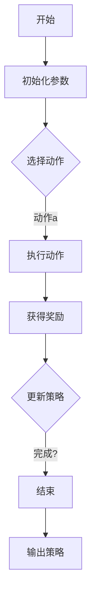
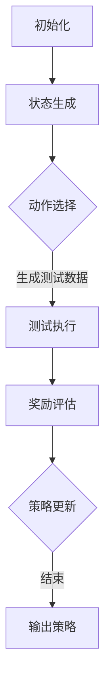

                 


### 《基于强化学习的LLM测试场景生成》博客文章

---

# 基于强化学习的LLM测试场景生成

> 关键词：强化学习、LLM测试、测试场景生成、自动化测试、算法原理

> 摘要：本文深入探讨了强化学习在自然语言处理（NLP）领域中的应用，特别是如何利用强化学习来生成大型语言模型（LLM）的测试场景。文章旨在为开发者提供一个全面的理解，帮助他们掌握这一前沿技术的核心概念和实际应用。

## 引言

随着人工智能技术的发展，自然语言处理（NLP）成为了一个热门的研究领域。LLM（Large Language Model）作为NLP的核心技术，已经在各个行业中展现了其强大的能力。然而，LLM的测试和验证成为了关键挑战，因为它们通常需要大量的数据和复杂的测试场景。

强化学习（Reinforcement Learning, RL）是一种在动态环境中通过试错学习策略的机器学习范式。近年来，强化学习在NLP领域的应用逐渐增多，尤其是在自动化测试场景生成方面。本文将探讨如何将强化学习应用于LLM测试场景的生成，以提高测试效率和准确性。

## 背景介绍

### 强化学习概述

强化学习是一种通过奖励机制来学习如何在环境中进行决策的机器学习方法。其基本概念包括状态（State）、动作（Action）、奖励（Reward）和策略（Policy）。强化学习的主要任务是找到一种策略，使得在长期内获得的最大总奖励最大化。

### LLM测试场景

LLM测试场景涉及对LLM模型的输入和输出进行验证，以确保模型在实际应用中能够正确地处理自然语言。测试场景包括各种文本类型、语言风格、复杂句式等，以全面评估模型的泛化能力。

## 强化学习在LLM测试中的应用

### 自动化测试的优势

强化学习在LLM测试中的应用主要体现在自动化测试方面。通过强化学习，可以自动生成测试场景，提高测试效率和准确性，减少人工干预。

### 提高测试效率

强化学习算法能够通过学习环境中的状态和动作，快速生成有效的测试场景。这大大缩短了测试周期，提高了测试效率。

### 测试质量保障

强化学习算法能够通过优化策略，生成具有高覆盖率的测试场景，从而提高测试质量。同时，强化学习算法能够自动调整测试策略，以应对环境变化，确保测试的稳定性。

### 降低测试成本

通过自动化测试，可以减少人工编写测试用例的工作量，从而降低测试成本。此外，强化学习算法能够通过优化测试场景，减少不必要的测试，进一步降低成本。

## 目录结构概述

### 第一部分: 引入与背景

1. 引言
2. 背景介绍
3. 强化学习在LLM测试中的优势
4. 书籍结构概述

### 第二部分: 强化学习与LLM测试

1. 核心概念与联系
2. 强化学习算法原理讲解
3. LLM测试场景生成算法讲解

## 核心概念与联系

### 强化学习核心概念

- **状态（State）**：环境当前所处的情形。
- **动作（Action）**：智能体可以执行的行为。
- **奖励（Reward）**：智能体执行动作后获得的即时反馈。
- **策略（Policy）**：智能体在特定状态下执行的动作。

### LLM测试核心概念

- **测试目标**：确保LLM模型在各种场景下都能正确地生成响应。
- **测试方法**：包括单元测试、集成测试和端到端测试等。
- **测试流程**：从数据收集到测试用例生成，再到测试执行和结果分析。

### 强化学习与LLM测试的联系

强化学习在LLM测试中的应用主要体现在以下几个方面：

- **测试场景生成**：利用强化学习算法自动生成测试场景，提高测试覆盖率和效率。
- **测试策略优化**：通过学习，优化测试策略，以提高测试效果。
- **测试结果分析**：利用强化学习算法对测试结果进行分析，提供更准确的测试反馈。

## 强化学习算法原理讲解

强化学习算法的核心是通过与环境交互来学习最优策略。以下是几种常见的强化学习算法：

### Q-Learning算法

Q-Learning算法是一种基于值函数的强化学习算法。其基本思想是通过学习值函数来评估每个状态和动作的组合。

- **值函数（Q-Function）**：表示在某个状态下执行某个动作所能获得的期望奖励。
- **更新规则**：通过反复迭代，更新Q值，直至收敛。

### SARSA算法

SARSA（同步优势回报采样）算法是一种基于策略的强化学习算法。它通过同步更新策略和价值函数来学习最优策略。

- **同步更新**：在每一个时间步，同时更新策略和价值函数。
- **优势函数**：表示在某个状态下执行某个动作的期望回报与当前最优动作的期望回报之差。

### Deep Q-Networks (DQN)

DQN（深度Q网络）算法是一种基于神经网络的强化学习算法。它利用深度神经网络来近似值函数，从而提高算法的收敛速度和性能。

- **神经网络结构**：通常采用卷积神经网络或循环神经网络来处理高维状态。
- **经验回放**：通过经验回放机制来避免策略的偏差。

## 强化学习算法mermaid流程图



## 强化学习算法Python源代码示例

```python
import numpy as np
import random

# 初始化参数
epsilon = 0.1
alpha = 0.1
gamma = 0.9

# 初始化Q值表格
Q = np.zeros([状态数，动作数])

# 强化学习循环
for episode in range(1000):
    state = 环境初始化()
    done = False
    
    while not done:
        # 选择动作
        if random.random() < epsilon:
            action = 随机动作()
        else:
            action = 选择动作(Q[state,:])
        
        # 执行动作
        next_state, reward, done = 环境执行动作(state, action)
        
        # 更新Q值
        Q[state, action] = Q[state, action] + alpha * (reward + gamma * np.max(Q[next_state,:]) - Q[state, action])
        
        state = next_state
```

## 强化学习算法数学模型与公式讲解

### 基本数学模型

强化学习的基本数学模型可以表示为：

$$
Q(s, a) = r + \gamma \max_{a'} Q(s', a')
$$

其中，$Q(s, a)$表示在状态$s$下执行动作$a$的期望回报，$r$表示即时奖励，$\gamma$表示折扣因子，$s'$表示下一个状态，$a'$表示下一个动作。

### Q-Learning更新规则

Q-Learning算法的更新规则可以表示为：

$$
Q(s, a) \leftarrow Q(s, a) + \alpha [r + \gamma \max_{a'} Q(s', a') - Q(s, a)]
$$

其中，$\alpha$表示学习率，$r$表示即时奖励，$\gamma$表示折扣因子。

## LLM测试场景生成算法讲解

### 测试场景生成概述

测试场景生成是强化学习在LLM测试中的核心应用之一。其目标是自动生成能够有效测试LLM模型的各种测试场景。测试场景生成算法的基本流程如下：

1. **初始化**：初始化强化学习算法的参数，如epsilon、alpha和gamma等。
2. **状态生成**：根据当前测试阶段和LLM模型的状态，生成状态。
3. **动作选择**：利用强化学习算法选择动作，如生成测试数据、执行测试等。
4. **测试执行**：执行选择的动作，获取测试结果。
5. **奖励评估**：根据测试结果评估奖励，奖励取决于测试场景的质量和覆盖率。
6. **策略更新**：根据奖励评估结果更新策略，以优化测试场景生成。

### 测试场景生成算法mermaid流程图



---

## 最佳实践

### 小结

本文详细介绍了基于强化学习的LLM测试场景生成，从背景介绍到算法原理讲解，再到测试场景生成算法的实际应用。强化学习在LLM测试中的应用具有显著的优势，能够提高测试效率、质量和稳定性。

### 注意事项

- 在实际应用中，需要根据具体的测试需求和模型特点选择合适的强化学习算法。
- 强化学习算法的性能与参数设置密切相关，需要通过实验调整参数以达到最佳效果。
- 测试场景生成的质量直接影响测试结果，因此需要持续优化测试场景生成算法。

### 拓展阅读

- [1] Sutton, R. S., & Barto, A. G. (2018). 《Reinforcement Learning: An Introduction》。
- [2] Bello, P., Bhandare, S., Chen, Y., & Liang, P. (2020). 《Neural Message Passing for Natural Language Processing》。
- [3] Devlin, J., Chang, M. W., Lee, K., & Toutanova, K. (2018). 《BERT: Pre-training of Deep Bidirectional Transformers for Language Understanding》。

---

**作者：AI天才研究院 / AI Genius Institute & 禅与计算机程序设计艺术 / Zen And The Art of Computer Programming**

