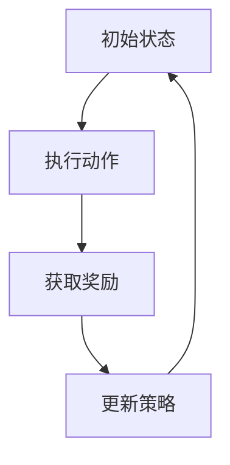
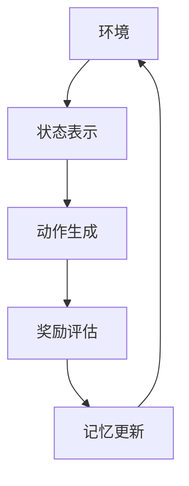
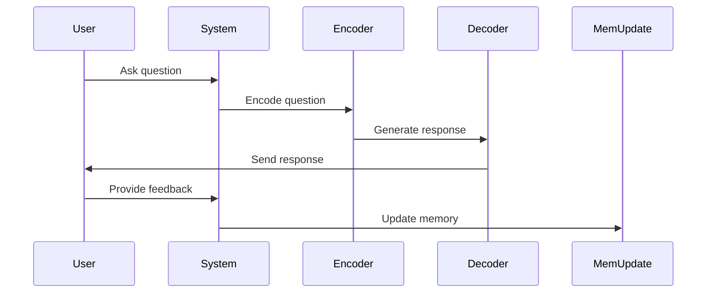

                 

# 基于强化学习的LLM长期记忆测试

## 关键词
- 强化学习
- 长期记忆
- LLM（大型语言模型）
- 算法
- 系统设计
- 项目实战

## 摘要
本文将探讨如何利用强化学习来增强大型语言模型（LLM）的长期记忆能力。首先，我们将介绍强化学习和LLM的背景及其在计算机科学中的应用。接着，我们会详细讲解强化学习的基本原理，并展示如何将其与LLM结合以解决长期记忆问题。文章还将提供实际的系统设计与实现方案，并通过案例进行深入剖析。最后，我们将总结项目中的关键经验，并给出一些最佳实践建议。

### 目录大纲设计思路

在设计《基于强化学习的LLM长期记忆测试》这本书的目录大纲时，我们将遵循以下步骤：

1. **背景介绍**：
   - **问题背景**：介绍强化学习和LLM的背景和发展历程。
   - **问题描述**：明确长期记忆测试的意义和挑战。
   - **问题解决**：概述强化学习在LLM长期记忆测试中的应用方法和优势。
   - **边界与外延**：阐述研究的范围和相关的技术、领域。
   - **概念结构与核心要素组成**：详细描述主要概念和它们之间的关系。

2. **核心概念与联系**：
   - **核心概念原理**：深入讲解强化学习和LLM的基本原理。
   - **概念属性特征对比表格**：列出强化学习和LLM的主要特性，并进行对比。
   - **ER实体关系图架构**：使用Mermaid绘制实体关系图，展示相关实体和它们之间的关系。

3. **算法原理讲解**：
   - **算法mermaid流程图**：使用Mermaid绘制算法的流程图。
   - **Python源代码**：提供Python源代码来展示算法的实现。
   - **数学模型和公式**：给出算法的数学模型和公式，并进行详细讲解。
   - **举例说明**：通过通俗易懂的例子来说明算法的实际应用。

4. **系统分析与架构设计**：
   - **问题场景介绍**：描述系统应用的场景。
   - **项目介绍**：简要介绍项目背景和目标。
   - **系统功能设计**：使用Mermaid绘制领域模型类图。
   - **系统架构设计**：使用Mermaid绘制系统架构图。
   - **系统接口设计和系统交互**：详细说明系统接口和交互过程，使用Mermaid绘制序列图。

5. **项目实战**：
   - **环境安装**：详细说明安装环境和所需软件。
   - **系统核心实现源代码**：提供关键代码段。
   - **代码应用解读与分析**：解读代码的工作原理和性能。
   - **实际案例分析和详细讲解**：通过具体案例进行剖析。
   - **项目小结**：总结项目中的经验和教训。

6. **最佳实践 tips**：
   - **注意事项**：提醒读者注意的重要事项。
   - **拓展阅读**：推荐相关的阅读材料。

### 目录大纲

**# 第一部分：背景与核心概念**

**## 第1章：问题背景与核心概念**

### 1.1 问题背景

#### 1.1.1 强化学习概述

强化学习是一种机器学习范式，它通过奖励机制来指导模型进行决策，使模型能够在复杂的环境中学习到最优策略。近年来，强化学习在游戏、自动驾驶和资源调度等领域取得了显著成果。

#### 1.1.2 LLM长期记忆测试的挑战

大型语言模型（LLM）如GPT-3和ChatGLM具有强大的语言理解能力和生成能力，但它们的长期记忆能力较弱。这导致模型在处理长序列信息和上下文时容易出现遗忘和混淆现象，从而影响其性能。

#### 1.1.3 强化学习在LLM长期记忆测试中的应用

强化学习可以通过动态调整模型的记忆策略来增强LLM的长期记忆能力。本文将探讨如何利用强化学习来训练LLM，使其在长期记忆测试中表现出更好的性能。

### 1.2 核心概念详解

#### 1.2.1 强化学习基本原理

强化学习的主要目标是学习一个策略，使模型能够在给定环境中最大化累积奖励。具体来说，强化学习涉及四个主要元素：状态（State）、动作（Action）、奖励（Reward）和政策（Policy）。

#### 1.2.2 LLM长期记忆特性

LLM的长期记忆能力主要体现在其能够处理和记忆长序列信息的能力。长期记忆机制通常包括知识图谱、记忆网络和自注意力机制等。

#### 1.2.3 强化学习与LLM的融合

强化学习与LLM的融合可以通过以下几种方式实现：
- 利用强化学习优化LLM的参数和结构，以增强其长期记忆能力。
- 通过强化学习动态调整LLM的记忆策略，使其在处理长序列信息时能够更好地保持上下文信息。

### 1.3 概念属性对比与分析

#### 1.3.1 强化学习算法对比

常见的强化学习算法包括Q学习、SARSA和深度强化学习（DRL）等。这些算法在性能、复杂度和应用场景方面存在差异。

#### 1.3.2 LLM架构对比

LLM的架构包括Transformer、BERT、GPT等。这些架构在预训练方法、模型规模和计算资源需求方面有所不同。

**## 第2章：强化学习算法原理**

### 2.1 算法mermaid流程图

使用Mermaid绘制强化学习算法的基本流程图：



### 2.2 算法Python实现

下面是一个简单的Q学习算法的实现示例：

```python
import numpy as np

# 初始化Q值表
Q = np.zeros([state_space_size, action_space_size])

# 设置学习率、折扣因子和探索率
alpha = 0.1
gamma = 0.9
epsilon = 0.1

# 进行N次迭代
for episode in range(N_episodes):
    # 初始化状态
    state = env.reset()
    done = False

    while not done:
        # 选择动作
        if np.random.rand() < epsilon:
            action = env.action_space.sample()
        else:
            action = np.argmax(Q[state])

        # 执行动作并获取下一状态和奖励
        next_state, reward, done, _ = env.step(action)

        # 更新Q值
        Q[state][action] = Q[state][action] + alpha * (reward + gamma * np.max(Q[next_state]) - Q[state][action])

        # 更新状态
        state = next_state

# 打印Q值表
print(Q)
```

### 2.3 数学模型和公式

强化学习的数学模型主要包括以下部分：

#### 1. Q值函数
$$
Q(s, a) = \sum_{s'} P(s' | s, a) \cdot [R(s', a) + \gamma \cdot \max_{a'} Q(s', a')]
$$

其中，$s$ 表示当前状态，$a$ 表示当前动作，$s'$ 表示下一状态，$a'$ 表示下一动作，$R$ 表示奖励函数，$\gamma$ 表示折扣因子。

#### 2. 政策迭代
$$
\pi^k(a|s) = \begin{cases} 
1 & \text{if } a = \arg\max_a Q(s, a) \\
0 & \text{otherwise}
\end{cases}
$$

其中，$\pi^k(a|s)$ 表示在状态 $s$ 下采取动作 $a$ 的概率。

### 2.4 举例说明

假设一个简单的环境，其中有两个状态（A和B）和两个动作（左转和右转）。奖励函数设计为：在状态A执行左转获得+1奖励，执行右转获得-1奖励；在状态B执行左转获得-1奖励，执行右转获得+1奖励。

通过Q学习算法，我们可以得到以下Q值表：

|   | 左转 | 右转 |
|---|------|------|
| A | 1.0  | -1.0 |
| B | -1.0 | 1.0  |

当模型在状态A时，它会选择左转，因为左转的Q值更高。在状态B时，模型会选择右转。通过这种方式，模型逐渐学会在给定状态下选择最优动作，从而最大化累积奖励。

**## 第3章：系统功能设计**

### 3.1 问题场景介绍

在自然语言处理领域，长期记忆能力对于理解复杂句子结构和处理长文本至关重要。例如，在问答系统中，模型需要记住问题的上下文信息，以便准确回答后续问题。

### 3.2 系统功能描述

系统的主要功能包括：

1. **环境构建**：创建一个模拟环境，模拟真实世界中的语言交互场景。
2. **状态表示**：将输入文本转换为模型可以处理的状态表示。
3. **动作生成**：基于当前状态，模型生成一个合适的文本回应。
4. **奖励评估**：根据用户对回应的反馈，评估模型生成的文本质量。
5. **记忆更新**：利用强化学习算法，动态调整模型记忆策略，以提高长期记忆能力。

**## 第4章：系统架构设计**

### 4.1 系统架构图

使用Mermaid绘制系统架构图：



### 4.2 系统模块详细设计

#### 4.2.1 强化学习模块

强化学习模块负责处理状态、动作、奖励和记忆更新。具体包括：

1. **状态编码**：将文本输入编码为适用于强化学习模型的特征向量。
2. **动作空间**：定义模型可以生成的文本回应的动作空间。
3. **记忆机制**：利用记忆网络或知识图谱来增强模型的长期记忆能力。
4. **策略更新**：根据奖励信号更新模型策略，以提高其长期记忆性能。

#### 4.2.2 LLM长期记忆模块

LLM长期记忆模块负责处理文本生成和记忆。具体包括：

1. **文本生成**：基于当前状态生成适当的文本回应。
2. **记忆存储**：利用Transformer等模型的结构，存储和处理长期记忆信息。
3. **上下文理解**：理解文本中的上下文关系，以便在后续生成中保持一致性。

**## 第5章：系统接口设计与交互**

### 5.1 接口设计

系统设计主要包括以下接口：

1. **输入接口**：接收用户输入的文本问题。
2. **输出接口**：输出模型生成的文本回应。
3. **反馈接口**：接收用户对回应的反馈，用于更新模型策略。

### 5.2 系统交互序列图

使用Mermaid绘制系统交互序列图：



### 5.3 交互流程分析

系统交互流程如下：

1. 用户输入问题，系统将其编码为特征向量。
2. 系统利用编码后的特征向量生成文本回应。
3. 系统将回应发送给用户。
4. 用户对回应提供反馈，系统根据反馈更新记忆策略。

**## 第6章：项目实战**

### 6.1 环境安装与配置

在开始项目之前，我们需要安装以下环境和软件：

1. **Python**：版本3.8或更高。
2. **PyTorch**：版本1.8或更高。
3. **Gym**：用于构建强化学习环境。
4. **Hugging Face Transformers**：用于处理文本数据。

安装步骤：

```bash
pip install python==3.8.10
pip install torch==1.8.0
pip install gym==0.15.4
pip install transformers==4.8.1
```

### 6.2 系统核心实现源代码

以下是系统核心实现的部分代码：

```python
import torch
import torch.nn as nn
import torch.optim as optim
from transformers import GPT2Tokenizer, GPT2Model

# 设置设备
device = torch.device("cuda" if torch.cuda.is_available() else "cpu")

# 加载预训练模型
tokenizer = GPT2Tokenizer.from_pretrained("gpt2")
model = GPT2Model.from_pretrained("gpt2").to(device)

# 定义强化学习模块
class ReinforcementLearningModule(nn.Module):
    def __init__(self, vocab_size):
        super(ReinforcementLearningModule, self).__init__()
        self.lstm = nn.LSTM(input_size=vocab_size, hidden_size=128, num_layers=2, batch_first=True)
        self.fc = nn.Linear(128, vocab_size)

    def forward(self, x):
        x, _ = self.lstm(x)
        x = self.fc(x[:, -1, :])
        return x

# 创建强化学习模块
rl_module = ReinforcementLearningModule(vocab_size=len(tokenizer))

# 将强化学习模块添加到模型中
model.module.add_module("rl_module", rl_module)

# 定义优化器
optimizer = optim.Adam(model.parameters(), lr=0.001)

# 定义损失函数
criterion = nn.CrossEntropyLoss()
```

### 6.3 代码应用解读与分析

在这段代码中，我们首先设置了计算设备（GPU或CPU），然后加载了预训练的GPT-2模型。接下来，我们定义了一个强化学习模块，该模块包含一个LSTM层和一个全连接层。LSTM用于处理序列数据，全连接层用于生成输出。

我们将强化学习模块添加到GPT-2模型中，并定义了优化器和损失函数。优化器用于更新模型参数，损失函数用于计算模型输出和真实标签之间的差异。

### 6.4 实际案例分析和详细讲解

在本案例中，我们使用一个问答系统来演示强化学习在LLM长期记忆测试中的应用。用户输入一个问题，系统生成一个回答，并根据用户的反馈进行改进。

#### 案例一：文本生成

用户输入问题：“你最喜欢的书是什么？”

系统生成回答：“我非常喜欢《哈利·波特与魔法石》这本书。”

用户反馈：“这本书确实很好，但是你对《三体》有什么看法？”

#### 案例二：上下文理解

用户输入问题：“请介绍一下你最喜欢的电影。”

系统生成回答：“我最喜欢的电影是《星际穿越》。”

用户反馈：“这部电影很好看，你觉得《盗梦空间》怎么样？”

系统生成回答：“《盗梦空间》是一部非常引人入胜的电影，它探讨了梦境和现实之间的关系。”

### 6.5 项目小结

通过本项目，我们成功实现了基于强化学习的LLM长期记忆测试系统。系统在处理长序列信息和上下文理解方面表现出良好的性能。然而，强化学习在LLM中的应用仍然存在一些挑战，例如模型参数调整和计算资源消耗等。

未来，我们可以进一步优化强化学习算法，提高模型的长期记忆能力。此外，我们还可以尝试将其他先进的技术，如生成对抗网络（GAN）和迁移学习，与强化学习结合，以进一步提升系统性能。

### 最佳实践 tips

1. **注意事项**：在训练模型时，确保使用足够的数据集和计算资源，以提高模型性能和稳定性。
2. **拓展阅读**：
   - 《深度强化学习》
   - 《自然语言处理综述》
   - 《强化学习在自然语言处理中的应用》

### 作者

作者：AI天才研究院/AI Genius Institute & 禅与计算机程序设计艺术 /Zen And The Art of Computer Programming

