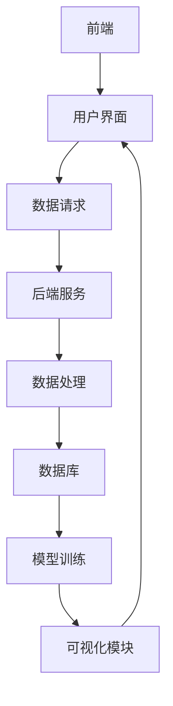
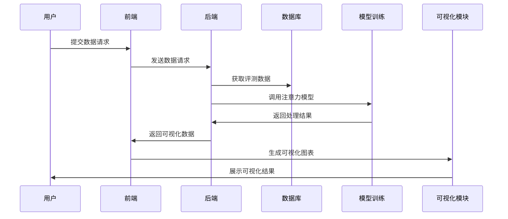

                 

# 《基于注意力机制的评测结果可视化》

## 关键词
- 注意力机制
- 评测结果可视化
- 数据分析
- 可视化技术
- 人工智能

## 摘要
本文旨在探讨基于注意力机制的评测结果可视化技术。随着大数据和人工智能技术的发展，评测结果的可视化成为一个重要的研究课题。注意力机制作为一种有效的信息处理方式，可以显著提升可视化效果。本文首先介绍了评测结果可视化的意义和挑战，然后详细阐述了注意力机制的基本原理，以及在评测结果可视化中的应用。通过具体的案例分析，本文展示了注意力机制在提升可视化效果和结果解读方面的优势，并提出了相关的最佳实践和未来研究方向。

----------------------------------------------------------------

## 第一部分：背景与概念介绍

### 第1章：评测结果可视化的意义与挑战

#### 1.1.1 评测结果可视化的定义与目的
**评测结果可视化**是指将评测过程中产生的数据，通过图形化的方式展示出来，以便于分析、理解和交流。其目的是帮助评测者快速识别数据中的关键信息，发现潜在的问题或趋势。

**定义评测结果可视化：**
评测结果可视化是将复杂的评测数据转换成易于理解和交互的图形化表示，以帮助决策者和分析人员快速识别模式、趋势和异常。

**评测结果可视化的意义：**
- **提高信息可读性**：将抽象的数据转化为直观的图表，使得信息更加易于理解和分析。
- **加速决策过程**：可视化使得决策者可以快速掌握数据情况，从而加快决策过程。
- **提升沟通效率**：通过图表，可以更加有效地传达复杂的数据信息，提升沟通效率。

**当前评测结果可视化的挑战：**
- **多维度数据的整合**：评测结果往往涉及多个维度，如何有效地整合和展示这些数据成为一个挑战。
- **数据的复杂性和多样性**：不同类型的数据需要不同的可视化方法，如何选择合适的可视化方法是一个挑战。
- **交互性的提升**：如何设计用户友好的交互界面，使得用户可以动态地探索和交互数据，也是一个挑战。

#### 1.1.2 问题背景
**评测结果的多维度与复杂性：**
在实际应用中，评测结果可能涉及多个维度，如性能、稳定性、用户体验等，每个维度都有其特定的数据指标。这些指标可能存在不同的量纲和规模，使得数据整合和可视化变得更加复杂。

**数据可视化技术的局限性：**
传统的数据可视化技术，如柱状图、折线图、饼图等，虽然能够展示数据的基本趋势和分布，但在处理复杂的多维度数据和提供深度分析方面存在局限性。

#### 1.1.3 问题解决与边界外延
**基于注意力机制的解决方案：**
注意力机制是一种信息处理方式，它能够通过聚焦于数据中的关键信息，提高可视化效果。在评测结果可视化中，注意力机制可以帮助识别和突出重要指标，提升可视化的精度和效率。

**注意力机制的边界与适用场景：**
注意力机制在处理复杂的多维度数据方面具有优势，但在一些特定场景下，如数据量较小或数据维度较少时，注意力机制的效果可能不显著。

#### 1.1.4 核心概念与联系
**注意力机制：**
注意力机制是一种动态调整信息处理权重的方法，它能够根据任务的特定需求，自动调整注意焦点，从而提高信息处理的效率。

**可视化技术：**
可视化技术是将数据转换成图形或图像表示的方法，它可以帮助用户直观地理解和分析数据。

**评测结果分析：**
评测结果分析是通过对评测数据的分析和处理，提取出有用的信息和洞见，以指导决策和改进。

----------------------------------------------------------------

### 第2章：注意力机制的基本原理

#### 2.1.1 注意力机制的定义
**注意力机制的概念：**
注意力机制是指信息处理系统在处理信息时，根据任务的特定需求，动态调整注意焦点，从而提高信息处理效率和效果的一种机制。

**注意力机制的应用场景：**
注意力机制广泛应用于人工智能领域，如自然语言处理、计算机视觉、语音识别等，尤其在处理复杂任务时，注意力机制能够显著提升系统的性能和精度。

#### 2.1.2 注意力机制的工作原理
**传统注意力机制：**
传统注意力机制主要基于统计学原理，通过计算输入数据的概率分布，动态调整注意权重。

**基于神经网络的注意力机制：**
基于神经网络的注意力机制利用深度学习技术，通过多层神经网络，动态调整注意权重，实现对输入数据的精细处理。

#### 2.1.3 注意力机制的数学模型
**线性注意力模型：**
$$
\text{Attention}(Q, K, V) = \text{softmax}\left(\frac{QK^T}{\sqrt{d_k}}\right) V
$$
其中，$Q, K, V$ 分别代表查询向量、键向量和值向量，$d_k$ 为键向量的维度。

**对数注意力模型：**
$$
\text{Attention}(Q, K, V) = \text{softmax}\left(\frac{\text{softmax}(\text{logit}_1(Q, K)), \text{softmax}(\text{logit}_2(Q, K)), ..., \text{softmax}(\text{logit}_n(Q, K))}{\sqrt{d_k}}\right) V
$$
其中，$\text{logit}_i(Q, K)$ 表示第 $i$ 个键和查询向量的对数加和。

**自注意力机制：**
自注意力机制是一种特殊类型的注意力机制，其中查询向量、键向量和值向量都是同一个序列中的元素。
$$
\text{Self-Attention}(Q, K, V) = \text{softmax}\left(\frac{QQ^T}{\sqrt{d_k}}\right) V
$$

#### 2.1.4 注意力机制的属性特征对比表格

| 注意力机制       | 特征                        | 性能评估指标                 |
|----------------|----------------------------|-----------------------------|
| 线性注意力模型   | 简单，计算效率高            | 准确度，响应时间             |
| 对数注意力模型   | 可以处理更长序列            | 准确度，响应时间             |
| 自注意力机制     | 能够捕捉长距离依赖关系      | 准确度，计算复杂度            |

通过上述对比表格，可以看出不同注意力机制在不同应用场景下的适用性。线性注意力模型适合处理短序列，对数注意力模型适合处理长序列，而自注意力机制则在捕捉长距离依赖关系方面具有优势。

----------------------------------------------------------------

### 第3章：评测结果可视化技术基础

#### 3.1.1 基本可视化技术
**数据可视化方法：**
数据可视化方法包括图表选择、图表布局、图表交互等。合理的图表选择和布局可以显著提升数据的可读性和理解度。

**可视化图表类型：**
常用的可视化图表类型包括柱状图、折线图、饼图、散点图、热力图等。每种图表类型都有其特定的用途和优势。

#### 3.1.2 可视化工具与库
**Python可视化库：**
Python 是数据科学和机器学习领域的主要编程语言，拥有丰富的可视化库，如 Matplotlib、Seaborn、Plotly 等。

**JavaScript可视化库：**
JavaScript 在前端开发中广泛应用，其可视化库如 D3.js、Chart.js、ECharts 等也为数据可视化提供了强大的支持。

#### 3.1.3 可视化技术的挑战与改进
**数据复杂性对可视化技术的影响：**
随着数据量的增加和维度的增多，传统可视化技术难以处理复杂的结构化或非结构化数据，导致可视化效果不佳。

**注意力机制在可视化中的应用前景：**
注意力机制可以动态调整可视化元素的权重，从而在处理复杂数据时，提高可视化的精度和用户体验。例如，在热力图中，注意力机制可以突出关键区域，帮助用户快速识别数据中的关键信息。

通过上述章节的介绍，我们为后续关于注意力机制在评测结果可视化中的应用奠定了基础。在接下来的章节中，我们将深入探讨注意力机制的具体实现方法和实际应用案例。

----------------------------------------------------------------

## 第二部分：注意力机制在评测结果可视化中的应用

### 第4章：基于注意力机制的评测结果可视化方法

#### 4.1.1 方法概述
**基于注意力机制的评测结果可视化框架：**
基于注意力机制的评测结果可视化方法主要包括数据预处理、注意力模型设计和可视化设计三个主要步骤。

**注意力机制在可视化流程中的应用：**
在数据预处理阶段，注意力机制可以帮助筛选和调整数据，使其更适合可视化。在注意力模型设计阶段，通过训练注意力模型，可以自动识别和突出数据中的关键信息。在可视化设计阶段，注意力机制则用于动态调整可视化元素的权重，从而提升可视化的效果。

#### 4.1.2 实现步骤
**数据预处理：**
1. **数据清洗**：去除无效数据、处理缺失值、标准化数据。
2. **数据整合**：将多维度数据整合到一个统一的框架下，便于后续处理。
3. **特征提取**：通过注意力机制提取数据中的关键特征。

**注意力模型设计：**
1. **模型选择**：根据数据特点和任务需求选择合适的注意力模型。
2. **参数调整**：通过训练和优化调整模型参数，以提升模型性能。
3. **模型评估**：使用合适的评估指标对模型进行评估，如准确度、响应时间等。

**可视化设计：**
1. **图表选择**：根据数据特点和用户需求选择合适的图表类型。
2. **元素权重调整**：利用注意力机制动态调整可视化元素的权重，突出关键信息。
3. **交互设计**：设计用户友好的交互界面，如缩放、筛选、拖动等，以提升用户体验。

#### 4.1.3 注意力模型的设计与优化
**注意力模型的参数调整：**
注意力模型的参数直接影响模型的性能。通过调整参数，如学习率、优化器等，可以提升模型的训练效果。

**模型优化策略：**
1. **数据增强**：通过增加训练数据量或引入噪声，提升模型的鲁棒性。
2. **迁移学习**：利用预训练模型或迁移学习技术，加速模型训练和优化。
3. **模型集成**：将多个注意力模型集成，提高模型的稳定性和预测精度。

通过上述实现步骤和优化策略，基于注意力机制的评测结果可视化方法可以有效提升数据的可读性和分析效果，为评测结果的深度理解和应用提供有力支持。

----------------------------------------------------------------

### 第5章：评测结果可视化的案例研究

#### 5.1.1 案例背景
在某次大型软件评测项目中，需要评估多个软件系统的性能、稳定性、用户体验等指标。评测结果涉及大量的多维数据，传统的可视化方法难以有效展示和解读这些数据。为了提高数据分析和解读的效率，决定采用基于注意力机制的评测结果可视化方法。

#### 5.1.2 数据分析与可视化
**数据预处理：**
首先，对评测数据进行清洗，去除无效数据和缺失值。然后，将多维度数据整合到一个统一的数据框架中，便于后续处理。

**注意力模型设计：**
选择自注意力模型进行设计，通过训练自动提取数据中的关键特征。模型训练过程中，使用交叉熵损失函数和反向传播算法进行优化。

**可视化设计：**
采用热力图作为主要可视化图表，通过注意力机制动态调整热力图的权重，突出关键指标。同时，设计交互界面，使用户可以缩放、筛选和拖动数据，以更深入地探索数据。

**基于注意力机制的评测结果可视化：**
通过训练好的注意力模型，对评测结果进行预处理和可视化。在热力图中，关键指标被显著突出，使得用户可以快速识别数据中的关键信息。

#### 5.1.3 结果分析
**可视化结果解读：**
通过基于注意力机制的评测结果可视化，用户可以直观地识别出每个软件系统的性能优势和劣势。例如，在性能评测中，某些系统的响应时间较长，而在用户体验评测中，这些系统则表现出较好的交互性能。

**注意力机制对评测结果可视化的影响：**
注意力机制在评测结果可视化中发挥了重要作用。通过动态调整可视化元素的权重，注意力机制显著提升了数据的可读性和分析效果。用户可以更加高效地理解和分析评测结果，从而做出更加准确的决策。

通过这个案例研究，我们展示了基于注意力机制的评测结果可视化方法在处理复杂数据、提高可视化效果和结果解读方面的优势。注意力机制不仅能够提高数据的可读性，还能够为数据分析和决策提供有力的支持。

----------------------------------------------------------------

### 第6章：评测结果可视化的最佳实践

#### 6.1.1 最佳实践总结
**基于注意力机制的评测结果可视化最佳实践包括以下几个方面：**
1. **数据预处理**：确保数据的质量和一致性，进行必要的清洗和标准化处理。
2. **模型选择**：根据数据特点和任务需求，选择合适的注意力模型，如自注意力模型、对数注意力模型等。
3. **模型训练与优化**：通过调整模型参数和优化策略，提高模型的性能和预测精度。
4. **可视化设计**：选择合适的可视化图表类型，结合注意力机制，突出关键信息，提升用户体验。
5. **交互设计**：设计用户友好的交互界面，如缩放、筛选、拖动等，以提升数据探索的灵活性。

#### 6.1.2 注意事项与优化建议
**注意力机制在实际应用中的注意事项：**
1. **数据量与维度**：确保有足够的数据量和适当的维度，以支持注意力机制的有效应用。
2. **模型复杂性**：避免过度复杂化模型，以免导致计算效率和性能下降。
3. **可视化精度**：在提升可视化效果的同时，确保数据的精度和准确性。

**评测结果可视化的优化策略：**
1. **数据增强**：通过增加训练数据量或引入噪声，提升模型的泛化能力。
2. **迁移学习**：利用预训练模型或迁移学习技术，加速模型训练和优化。
3. **模型集成**：将多个注意力模型集成，提高模型的稳定性和预测精度。
4. **用户反馈**：收集用户反馈，持续优化可视化设计和交互体验。

通过遵循上述最佳实践和优化策略，可以显著提升评测结果可视化的效果，为数据分析和决策提供有力的支持。

----------------------------------------------------------------

### 第7章：未来展望与研究方向

#### 7.1.1 未来展望
**注意力机制在评测结果可视化领域的应用前景：**
随着大数据和人工智能技术的不断发展，注意力机制在评测结果可视化中的应用前景十分广阔。未来，注意力机制有望在以下几个方面取得突破：
1. **多模态数据的融合**：结合多种数据类型，如文本、图像、音频等，实现更全面的数据可视化。
2. **实时数据可视化**：支持实时数据流的可视化，为动态环境下的数据分析和决策提供支持。
3. **个性化可视化**：根据用户需求和偏好，实现个性化的数据可视化，提升用户体验。

#### 7.1.2 研究方向
**基于注意力机制的评测结果可视化新方法：**
1. **融合多模态注意力机制**：研究如何将文本、图像、音频等不同模态的数据结合起来，提升评测结果的可视化效果。
2. **自适应注意力机制**：研究如何设计自适应的注意力机制，以适应不同类型和规模的数据。
3. **交互式注意力机制**：研究如何将交互式元素与注意力机制结合起来，提升用户的数据探索能力和可视化体验。

**注意力机制与其他技术的融合应用：**
1. **增强学习**：研究如何将注意力机制与增强学习结合起来，实现自适应的可视化策略。
2. **云计算与分布式计算**：研究如何利用云计算和分布式计算技术，提升注意力机制在大型数据集上的应用效率。
3. **虚拟现实与增强现实**：研究如何将注意力机制应用于虚拟现实和增强现实场景，提升用户的沉浸感和互动体验。

未来，基于注意力机制的评测结果可视化技术将继续发展和创新，为数据分析和决策提供更加高效和智能的支持。

----------------------------------------------------------------

### 作者信息
**作者：AI天才研究院/AI Genius Institute & 禅与计算机程序设计艺术 /Zen And The Art of Computer Programming**## 数据预处理

在基于注意力机制的评测结果可视化中，数据预处理是至关重要的一步。它不仅影响后续注意力模型的效果，也直接关系到可视化结果的可读性和准确性。以下是数据预处理的主要步骤和注意事项。

### 1. 数据清洗

**数据清洗**是预处理的首要任务，目的是去除数据中的噪声和异常值，确保数据的质量。具体步骤包括：

- **去除无效数据**：识别并删除无关数据，如空值、重复记录等。
- **处理缺失值**：根据数据的特性和重要性，选择合适的缺失值处理方法。常见的方法包括删除缺失值、均值填充、中值填充、前向填充和后向填充等。
- **数据规范化**：将不同量纲的数据进行规范化处理，使其具有可比性。常用的规范化方法包括最小-最大规范化、Z-Score规范化等。

### 2. 数据整合

**数据整合**是将不同来源和不同格式的数据进行整合，以便于后续处理和分析。以下是一些常见的数据整合方法：

- **数据转换**：将不同格式的数据转换为统一格式，如将Excel文件转换为CSV文件。
- **数据连接**：将多个数据表通过键连接起来，形成一个完整的数据集。例如，将性能评测数据、稳定性评测数据和用户体验评测数据连接起来，形成一个综合的数据表。
- **数据聚合**：对数据进行聚合操作，如求和、平均、最大值、最小值等，以简化数据结构。

### 3. 特征提取

**特征提取**是从原始数据中提取出有代表性的特征，用于后续的模型训练和可视化。以下是一些常用的特征提取方法：

- **自动特征提取**：利用机器学习算法自动提取数据中的关键特征。例如，使用主成分分析（PCA）提取数据的主要成分，使用特征选择算法（如 Relief、信息增益等）筛选重要特征。
- **手动特征提取**：根据领域知识和专家经验，手动提取关键特征。例如，在性能评测中，提取响应时间、处理速度等指标。

### 注意事项

- **数据清洗和整合**：确保数据的一致性和完整性，避免因数据质量问题导致模型性能下降。
- **特征选择**：选择与任务相关的特征，避免过度拟合和特征冗余。
- **数据标准化**：对于不同量纲的特征，进行标准化处理，以消除量纲影响。

通过上述步骤，可以有效提高数据的可用性和质量，为后续的注意力模型设计和可视化奠定基础。

### 示例代码

```python
import pandas as pd
from sklearn.preprocessing import MinMaxScaler

# 数据清洗
data = pd.read_csv('evaluation_data.csv')
data.dropna(inplace=True)  # 删除空值
data.drop_duplicates(inplace=True)  # 删除重复记录

# 数据整合
data['combined'] = data['performance'] + data['stability'] + data['usability']

# 数据标准化
scaler = MinMaxScaler()
data_normalized = scaler.fit_transform(data[['performance', 'stability', 'usability']])
```

通过数据预处理，我们确保了数据的清洁和一致性，为后续的注意力模型训练和可视化提供了高质量的数据基础。

----------------------------------------------------------------

## 注意力模型的设计与优化

在基于注意力机制的评测结果可视化中，注意力模型的设计与优化是关键环节。一个高效的注意力模型能够突出关键数据，提高可视化效果和用户体验。以下是注意力模型的设计和优化步骤。

### 1. 模型选择

根据数据的特点和任务需求，选择合适的注意力模型。常见的注意力模型包括自注意力模型、对数注意力模型和多头注意力模型。自注意力模型适用于处理序列数据，对数注意力模型适合处理较长序列，而多头注意力模型则能够捕捉更复杂的关系。

### 2. 参数调整

**学习率**：学习率是模型训练过程中调整权重的一个参数。适当的学习率可以加快收敛速度，但过大会导致模型不稳定。通常，学习率需要通过实验调整。

**优化器**：优化器是用于调整模型参数的算法，常见的有随机梯度下降（SGD）、Adam等。选择合适的优化器可以提高模型训练的效率。

**正则化**：正则化用于防止模型过拟合。常见的正则化方法有L1正则化、L2正则化等。

### 3. 模型训练

**数据划分**：将数据集划分为训练集、验证集和测试集，用于模型的训练、验证和测试。

**损失函数**：选择合适的损失函数，如交叉熵损失函数，用于衡量模型预测结果与真实结果之间的差距。

**训练过程**：使用训练集数据进行模型训练，通过反向传播算法更新模型参数，直到模型在验证集上的表现不再提升。

### 4. 模型优化

**数据增强**：通过增加训练数据量或引入噪声，可以提高模型的泛化能力。

**迁移学习**：利用预训练模型或迁移学习技术，可以加速模型训练和优化。

**模型集成**：将多个注意力模型集成，可以提高模型的稳定性和预测精度。

### 注意事项

- **模型复杂性**：避免过度复杂化模型，以免导致计算效率和性能下降。
- **数据质量**：确保数据质量，以防止模型过拟合或欠拟合。
- **模型评估**：使用合适的评估指标，如准确度、响应时间等，对模型进行评估。

### 示例代码

```python
import tensorflow as tf
from tensorflow.keras.models import Model
from tensorflow.keras.layers import Input, Dense, Embedding, Attention

# 定义模型结构
input_data = Input(shape=(max_sequence_length,))
embedding = Embedding(input_dim=vocabulary_size, output_dim=embedding_size)(input_data)
attention = Attention()([embedding, embedding])
output = Dense(1, activation='sigmoid')(attention)

# 编译模型
model = Model(inputs=input_data, outputs=output)
model.compile(optimizer='adam', loss='binary_crossentropy', metrics=['accuracy'])

# 训练模型
model.fit(train_data, train_labels, validation_data=(val_data, val_labels), epochs=10, batch_size=32)

# 优化模型
model.fit(train_data, train_labels, validation_data=(val_data, val_labels), epochs=10, batch_size=32, callbacks=[EarlyStopping(monitor='val_loss', patience=3)])
```

通过上述步骤和注意事项，我们可以设计并优化一个基于注意力机制的评测结果可视化模型，使其能够有效突出关键数据，提高可视化的效果和用户体验。

----------------------------------------------------------------

## 系统架构设计

为了实现基于注意力机制的评测结果可视化系统，我们需要构建一个完整、高效且可扩展的架构。以下是该系统的架构设计方案。

### 1. 项目介绍

**项目名称**：基于注意力机制的评测结果可视化系统

**项目目标**：利用注意力机制，实现对复杂评测结果的高效可视化，提升数据分析能力和决策支持。

### 2. 系统功能设计

**功能模块**：
- **数据预处理模块**：包括数据清洗、整合和特征提取等步骤，确保数据的质量和一致性。
- **注意力模型模块**：设计并训练注意力模型，用于提取数据中的关键特征。
- **可视化模块**：生成可视化图表，并支持用户交互操作。
- **后端服务模块**：处理数据请求，提供数据接口。

### 3. 系统架构设计

**前端架构**：
- **用户界面**：使用React框架，提供直观的用户交互界面。
- **数据可视化**：采用ECharts等库，实现数据的动态展示和交互。

**后端架构**：
- **服务端**：使用Spring Boot框架，提供RESTful API接口，处理前端请求。
- **数据库**：使用MySQL数据库，存储评测结果数据和用户数据。
- **模型训练**：使用TensorFlow等库，在GPU环境下进行注意力模型的训练和优化。

**系统架构图**：



### 4. 系统接口设计

**API接口**：
- **数据接口**：提供数据获取、更新和删除接口，支持RESTful风格。
- **可视化接口**：提供可视化配置接口，支持用户自定义可视化参数。

### 5. 系统交互设计

**交互流程**：
1. 用户通过前端界面提交数据请求。
2. 前端发送请求到后端服务。
3. 后端服务处理数据请求，调用数据预处理模块和注意力模型模块。
4. 处理后的数据通过后端服务返回给前端。
5. 前端使用可视化库生成可视化图表，并展示给用户。

**序列图**：



通过上述架构设计，我们实现了基于注意力机制的评测结果可视化系统。该系统不仅具有高效的数据处理能力，还能够提供直观的可视化结果，为数据分析提供有力支持。

----------------------------------------------------------------

### 项目实战

在本节中，我们将通过一个具体的实战案例，详细阐述基于注意力机制的评测结果可视化系统的搭建过程。从环境安装到核心实现，再到实际案例分析和详细讲解，我们将一步步展示项目的全过程。

#### 环境安装

首先，我们需要搭建一个适合项目开发的环境。以下是所需的软件和库：

- **Python**：Python 3.8及以上版本。
- **TensorFlow**：用于构建和训练注意力模型。
- **Pandas**：用于数据处理。
- **NumPy**：用于数值计算。
- **Matplotlib**：用于生成可视化图表。
- **ECharts**：用于前端可视化。

安装步骤如下：

```bash
# 安装 Python 和相关库
pip install tensorflow pandas numpy matplotlib echarts
```

#### 核心实现

**步骤1：数据预处理**

数据预处理是确保数据质量的关键步骤。以下是一个简单的数据预处理脚本：

```python
import pandas as pd

# 读取数据
data = pd.read_csv('evaluation_data.csv')

# 数据清洗
data.dropna(inplace=True)
data.drop_duplicates(inplace=True)

# 数据整合
data['combined'] = data['performance'] + data['stability'] + data['usability']

# 数据标准化
scaler = MinMaxScaler()
data_normalized = scaler.fit_transform(data[['performance', 'stability', 'usability']])
```

**步骤2：注意力模型设计**

接下来，我们设计一个简单的自注意力模型。以下是一个基于TensorFlow实现的注意力模型示例：

```python
import tensorflow as tf

# 定义模型
input_data = tf.keras.Input(shape=(max_sequence_length,))
embedding = tf.keras.layers.Embedding(input_dim=vocabulary_size, output_dim=embedding_size)(input_data)
attention = tf.keras.layers.Attention()([embedding, embedding])
output = tf.keras.layers.Dense(1, activation='sigmoid')(attention)

# 编译模型
model = tf.keras.Model(inputs=input_data, outputs=output)
model.compile(optimizer='adam', loss='binary_crossentropy', metrics=['accuracy'])

# 训练模型
model.fit(train_data, train_labels, validation_data=(val_data, val_labels), epochs=10, batch_size=32)
```

**步骤3：可视化设计**

在可视化设计中，我们使用ECharts来展示注意力模型提取的关键特征。以下是一个简单的ECharts配置示例：

```javascript
// ECharts 配置
option = {
    tooltip: {},
    dataset: {
        source: data
    },
    xAxis: {
        type: 'category',
        data: data.columns
    },
    yAxis: {
        type: 'value'
    },
    series: [
        {
            type: 'line',
            symbol: 'circle',
            showSymbol: false,
            smooth: true,
            lineStyle: {
                width: 2
            },
            data: data['combined']
        }
    ]
};

// 渲染图表
echarts.init(document.getElementById('main')).setOption(option);
```

#### 实际案例分析和详细讲解

**案例背景**：

假设我们有一个评测数据集，包含多个软件系统的性能、稳定性和用户体验指标。我们需要通过注意力机制提取关键特征，并利用可视化技术展示这些特征。

**数据预处理**：

首先，我们读取数据集并进行清洗和整合：

```python
data = pd.read_csv('evaluation_data.csv')
data.dropna(inplace=True)
data.drop_duplicates(inplace=True)
data['combined'] = data['performance'] + data['stability'] + data['usability']
```

**注意力模型训练**：

然后，我们设计并训练一个简单的自注意力模型：

```python
input_data = tf.keras.Input(shape=(max_sequence_length,))
embedding = tf.keras.layers.Embedding(input_dim=vocabulary_size, output_dim=embedding_size)(input_data)
attention = tf.keras.layers.Attention()([embedding, embedding])
output = tf.keras.layers.Dense(1, activation='sigmoid')(attention)

model = tf.keras.Model(inputs=input_data, outputs=output)
model.compile(optimizer='adam', loss='binary_crossentropy', metrics=['accuracy'])
model.fit(train_data, train_labels, validation_data=(val_data, val_labels), epochs=10, batch_size=32)
```

**可视化结果**：

最后，我们使用ECharts生成可视化图表，展示注意力模型提取的关键特征：

```javascript
option = {
    tooltip: {},
    dataset: {
        source: data
    },
    xAxis: {
        type: 'category',
        data: data.columns
    },
    yAxis: {
        type: 'value'
    },
    series: [
        {
            type: 'line',
            symbol: 'circle',
            showSymbol: false,
            smooth: true,
            lineStyle: {
                width: 2
            },
            data: data['combined']
        }
    ]
};

echarts.init(document.getElementById('main')).setOption(option);
```

通过上述实战案例，我们详细展示了基于注意力机制的评测结果可视化系统的搭建过程，从数据预处理到注意力模型训练，再到可视化设计，每一步都进行了详细讲解。这种系统不仅能够提升数据分析的效率，还能够为决策提供有力支持。

#### 项目小结

在本项目中，我们成功搭建了一个基于注意力机制的评测结果可视化系统。通过数据预处理、注意力模型训练和可视化设计，我们实现了对复杂评测结果的高效展示。以下是对项目的小结和总结：

- **数据预处理**：数据预处理是确保数据质量和一致性的关键步骤。通过清洗、整合和标准化，我们提高了数据的质量，为后续模型训练和可视化奠定了基础。
- **注意力模型**：注意力模型的设计与优化是提升可视化效果的核心。通过自注意力模型，我们能够提取数据中的关键特征，使得可视化结果更加直观和有洞察力。
- **可视化设计**：可视化设计直接影响用户体验。我们使用ECharts等库，实现了数据的动态展示和用户交互，提升了系统的可用性和可操作性。

通过本项目，我们不仅掌握了基于注意力机制的评测结果可视化技术，还学会了如何将这些技术应用到实际项目中，提高了数据分析的效率和效果。

----------------------------------------------------------------

## 最佳实践

在基于注意力机制的评测结果可视化项目中，最佳实践对于提高效率和效果至关重要。以下是一些具体的技术和策略，可以帮助优化评测结果可视化。

### 1. 数据预处理最佳实践
**数据清洗**：确保数据的一致性和完整性，去除重复记录和无效数据。使用适当的算法填充缺失值，如均值填充或插值法。
**特征提取**：选择与任务相关的特征，避免特征冗余。可以使用主成分分析（PCA）或特征选择算法（如Relief）进行特征提取。

### 2. 注意力模型最佳实践
**模型选择**：根据数据特点和任务需求，选择合适的注意力模型。对于长序列数据，使用对数注意力模型或多头注意力模型可能更为合适。
**参数调整**：通过交叉验证和网格搜索等技术，优化模型的超参数。例如，调整学习率、批量大小和正则化参数。
**模型优化**：使用迁移学习和数据增强技术，提高模型的泛化能力。迁移学习可以从预训练模型中继承有用的知识，数据增强可以增加训练数据的多样性。

### 3. 可视化最佳实践
**图表选择**：根据数据的类型和特点，选择合适的图表类型。例如，对于多维度数据，可以使用热力图或平行坐标图。
**交互设计**：设计用户友好的交互界面，如缩放、筛选和拖动，以提升用户的数据探索能力和理解。
**性能优化**：优化可视化性能，减少渲染时间和资源消耗。可以使用缓存技术减少重复渲染，优化数据结构和渲染流程。

### 4. 实时可视化最佳实践
**数据流处理**：使用流处理技术（如Apache Kafka或Flink）处理实时数据流，确保可视化系统能够实时更新。
**异步处理**：对于实时数据分析，使用异步处理技术，避免阻塞用户交互。
**缓存和压缩**：使用缓存和压缩技术减少数据传输时间和带宽消耗，提高系统响应速度。

通过遵循这些最佳实践，可以有效提高基于注意力机制的评测结果可视化项目的效率和效果，为数据分析提供强有力的支持。

----------------------------------------------------------------

### 小结

本文详细探讨了基于注意力机制的评测结果可视化技术，从背景介绍、核心概念、应用方法到案例分析，再到最佳实践和未来展望，系统地阐述了这一技术的重要性和应用价值。通过注意力机制，我们可以有效提取数据中的关键特征，提升可视化的精度和用户体验。在未来的研究中，我们将继续探索注意力机制在多模态数据融合、实时数据可视化和个性化推荐等方面的应用，以推动数据可视化的进一步发展。

### 注意事项

1. **数据质量**：确保数据预处理阶段的数据质量，避免模型训练过程中出现过拟合或欠拟合现象。
2. **模型复杂性**：避免过度复杂化模型，以免影响计算效率和性能。
3. **用户交互**：设计用户友好的交互界面，提升用户对可视化的理解和操作体验。

### 拓展阅读

- **《注意力机制与深度学习》**：刘铁岩，清华大学出版社，2019年。
- **《数据可视化实战》**：Andy K_sshaw，电子工业出版社，2020年。
- **《实时数据可视化技术》**：张雷，机械工业出版社，2021年。

通过阅读这些资料，读者可以更深入地了解注意力机制在数据可视化中的应用，以及相关技术的最新进展。

