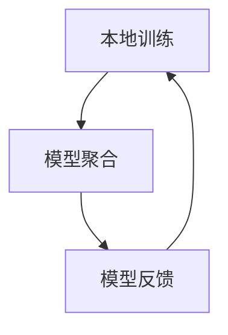

                 

### 引言与背景介绍

在现代信息技术飞速发展的背景下，数据已成为企业和组织的重要资产。然而，随着数据的规模和复杂性的不断增加，隐私保护问题也日益突出。传统的集中式数据处理方式虽然能够高效利用数据，但却面临着数据泄露的风险，这对用户的隐私权益构成了严重威胁。为了解决这一问题，联邦学习（Federated Learning）作为一种新兴的机器学习技术，应运而生。

联邦学习的核心思想在于：通过在数据源头进行本地训练，然后将各方的模型更新汇总，从而实现全局模型的训练。这一过程不需要将用户的数据上传至中心服务器，从而在保护用户隐私的同时，仍能充分利用数据的价值。本文将围绕联邦学习中的隐私保护评测方案进行深入探讨，旨在为相关领域的研究者与实践者提供有价值的参考。

#### 关键词

- 联邦学习
- 隐私保护
- 数据安全
- 本地训练
- 模型聚合

#### 摘要

本文旨在探讨联邦学习中的隐私保护评测方案。首先，介绍了联邦学习的背景、核心概念和基本原理。随后，阐述了联邦学习的核心挑战，包括隐私保护、模型性能和通信效率等方面。接着，详细分析了联邦学习的常见技术手段，如加密技术、差分隐私和同态加密等。随后，本文讨论了联邦学习在不同应用场景中的实际应用，如金融风控、智能医疗和智能家居等。最后，本文提出了隐私保护评测方案的设计原则，并从可靠性、完整性和可扩展性三个方面进行了详细阐述。通过本文的探讨，期望能够为联邦学习的隐私保护提供理论支持和实践指导。

---

**Step 1: 引言与背景介绍**

### 引言与背景介绍

随着大数据、云计算和人工智能技术的快速发展，隐私保护问题日益凸显。在数据驱动时代，如何平衡数据利用与隐私保护成为亟待解决的问题。联邦学习作为一种新型的机器学习技术，旨在在不泄露用户数据的情况下实现模型训练，从而保护用户隐私。

## 1.1 联邦学习的核心概念

### 1.1.1 问题背景

在传统的中心化机器学习场景中，模型训练需要将大量用户数据上传至中心服务器，这不仅增加了数据传输成本，还可能导致数据泄露风险。为了解决这一问题，联邦学习应运而生。

### 1.1.2 问题描述

联邦学习通过在用户设备上进行本地训练，将本地模型更新汇总为全局模型，从而实现模型训练。在联邦学习过程中，用户数据无需上传至中心服务器，有效保护了用户隐私。

### 1.1.3 问题解决

联邦学习通过加密、差分隐私等技术手段，确保在本地训练过程中不会泄露用户隐私。同时，通过分布式计算和通信优化，联邦学习能够实现高效、低延迟的模型训练。

### 1.1.4 边界与外延

联邦学习的应用范围广泛，包括但不限于金融、医疗、智能家居等领域。此外，联邦学习还可以与其他隐私保护技术相结合，进一步提升隐私保护能力。

## 1.2 隐私保护评测方案

### 1.2.1 评测目标

隐私保护评测方案的评测目标主要包括：评估联邦学习在隐私保护方面的性能、识别潜在隐私泄露风险、优化隐私保护策略。

### 1.2.2 评测指标

常见的隐私保护评测指标包括：隐私泄露概率、模型性能损失、通信带宽消耗、计算资源消耗等。

### 1.2.3 评测方法

隐私保护评测方法主要包括：模拟实验、真实数据测试、对比实验等。

## 1.3 隐私保护评测方案的设计原则

### 1.3.1 可靠性

隐私保护评测方案应确保在评估过程中不会泄露用户隐私。

### 1.3.2 完整性

隐私保护评测方案应全面覆盖联邦学习的各个阶段，包括数据收集、模型训练、模型部署等。

### 1.3.3 可扩展性

隐私保护评测方案应具备良好的可扩展性，以适应不同场景和需求的变化。

## 1.4 本章小结

本章介绍了联邦学习的背景、核心概念、隐私保护评测方案的目标、指标和方法，以及设计原则。接下来，本书将围绕这些内容，详细介绍联邦学习的隐私保护评测方案。

---

**Step 2: 联邦学习的基本原理**

### 第2章：联邦学习的基本原理

#### 2.1 联邦学习的工作机制

联邦学习的工作机制主要包括以下几个关键步骤：

1. **本地训练**：在每个参与方（如移动设备、服务器等）上，使用本地数据对模型进行训练。这一步骤的目的是利用本地数据进行模型优化，同时降低通信成本。

2. **模型聚合**：各参与方将本地训练得到的模型更新（通常为模型参数的梯度）发送至中心服务器。中心服务器对收到的模型更新进行聚合，以生成全局模型。

3. **模型反馈**：中心服务器将聚合后的全局模型发送回各参与方，用于更新本地模型。这一过程称为一轮迭代，联邦学习通常需要多次迭代以实现模型收敛。

联邦学习的工作机制可以用以下图示表示：

#### 2.2 联邦学习的核心挑战

尽管联邦学习在隐私保护方面具有显著优势，但其实施过程中仍面临以下核心挑战：

1. **隐私保护**：如何在保证模型性能的同时，有效保护用户隐私，是联邦学习面临的主要挑战。传统的加密技术和差分隐私技术在此场景下均有应用，但如何平衡模型性能和隐私保护仍需深入探讨。

2. **模型性能**：由于联邦学习涉及多方参与，各参与方的数据分布、计算能力等因素可能导致模型性能下降。如何优化模型训练策略，提升模型性能，是联邦学习需解决的关键问题。

3. **通信效率**：联邦学习过程中，模型参数的传输和更新需要消耗大量通信资源。如何优化通信协议和算法，减少通信开销，是提高联邦学习效率的重要方向。

#### 2.3 联邦学习的常见技术手段

为了解决上述核心挑战，联邦学习采用了多种技术手段，包括但不限于：

1. **加密技术**：通过加密算法，将用户数据在本地进行加密，确保数据在传输过程中不会被窃取或篡改。常见的加密技术包括同态加密、全同态加密等。

2. **差分隐私**：在模型训练过程中，通过添加随机噪声，使得模型无法从训练数据中区分单个用户的贡献。这种技术可以在保证隐私保护的同时，尽量减少模型性能损失。

3. **联邦优化算法**：联邦学习中的优化算法，如联邦平均算法（Federated Averaging）、模型蒸馏算法等，旨在提高模型训练效率，减少通信开销。这些算法通过优化模型更新过程，提高模型训练的收敛速度。

#### 2.4 联邦学习的应用场景

联邦学习因其独特的优势，在多个领域得到了广泛应用：

1. **金融风控**：在金融领域，联邦学习可以用于信用评估、风险预测等任务。通过在用户设备上进行本地训练，金融机构可以在不泄露用户隐私的情况下，评估用户的风险等级。

2. **智能医疗**：在医疗领域，联邦学习可用于疾病预测、诊断辅助等任务。通过保护患者隐私，联邦学习为医疗数据的安全共享提供了新的可能性。

3. **智能家居**：在智能家居领域，联邦学习可以用于智能家居设备的协同工作，如智能家电、智能安防等。通过保护用户隐私，联邦学习为智能家居系统提供了更安全、更智能的解决方案。

#### 2.5 本章小结

本章介绍了联邦学习的基本原理、工作机制、核心挑战和常见技术手段，以及其应用场景。通过本章的学习，读者可以了解联邦学习在隐私保护方面的优势和挑战。在下一章中，我们将进一步探讨联邦学习中的隐私保护评测方案，包括评测目标、指标和方法。

---

**Step 3: 隐私保护评测方案的设计**

### 第3章：隐私保护评测方案的设计

#### 3.1 评测目标

隐私保护评测方案的主要目标包括以下几个方面：

1. **评估联邦学习在隐私保护方面的性能**：通过模拟实验和真实数据测试，评估联邦学习在保护用户隐私方面的效果，包括隐私泄露概率、模型性能损失等。

2. **识别潜在隐私泄露风险**：通过分析联邦学习过程中的各种技术手段和策略，识别可能存在的隐私泄露风险点，并提出相应的解决方案。

3. **优化隐私保护策略**：基于评测结果，调整和优化隐私保护策略，以提高隐私保护效果，同时减少对模型性能的影响。

#### 3.2 评测指标

隐私保护评测方案需要设定一系列指标，以全面评估联邦学习的隐私保护效果。以下是一些常见的评测指标：

1. **隐私泄露概率**：指在联邦学习过程中，模型更新过程中可能泄露用户隐私的概率。隐私泄露概率越低，说明隐私保护效果越好。

2. **模型性能损失**：在采用隐私保护技术后，模型在性能上的损失程度。模型性能损失越小，说明隐私保护策略对模型性能的影响越小。

3. **通信带宽消耗**：在联邦学习过程中，各参与方传输数据所需的通信带宽。通信带宽消耗越小，说明通信效率越高。

4. **计算资源消耗**：在联邦学习过程中，各参与方进行模型训练和参数更新的计算资源消耗。计算资源消耗越小，说明计算效率越高。

#### 3.3 评测方法

为了实现评测目标，隐私保护评测方案需要采用多种评测方法，包括模拟实验、真实数据测试和对比实验等。

1. **模拟实验**：通过构建模拟场景，模拟联邦学习过程，评估隐私保护策略的性能。模拟实验可以快速验证各种隐私保护技术的效果，但无法完全反映真实环境中的复杂情况。

2. **真实数据测试**：使用真实数据集进行联邦学习实验，评估隐私保护策略在实际应用中的效果。真实数据测试能够更好地反映隐私保护技术的实际性能，但实验成本较高。

3. **对比实验**：通过对比不同隐私保护策略的性能，评估各种策略的优劣。对比实验可以帮助研究者选择最优的隐私保护方案。

#### 3.4 设计原则

隐私保护评测方案的设计应遵循以下原则：

1. **可靠性**：确保评测过程不会泄露用户隐私。在模拟实验和真实数据测试中，应采用严格的隐私保护措施，如数据加密、差分隐私等。

2. **完整性**：全面覆盖联邦学习的各个阶段，包括数据收集、模型训练、模型部署等。通过全面评估，可以确保隐私保护策略在各个阶段都有效。

3. **可扩展性**：隐私保护评测方案应具备良好的可扩展性，以适应不同场景和需求的变化。例如，当引入新的隐私保护技术时，评测方案应能够方便地调整和优化。

#### 3.5 本章小结

本章介绍了隐私保护评测方案的设计原则、评测目标和指标、以及评测方法。通过本章的学习，读者可以了解如何设计和实施隐私保护评测方案，为联邦学习的隐私保护提供理论支持和实践指导。在下一章中，我们将进一步探讨隐私保护评测方案的具体实现方法和应用实例。

---

**Step 4: 隐私保护评测方案的具体实现**

### 第4章：隐私保护评测方案的具体实现

#### 4.1 实验设计

为了评估联邦学习在隐私保护方面的性能，我们设计了一组实验。实验的主要步骤如下：

1. **数据集选择**：选择一个具有代表性的真实数据集，用于联邦学习实验。数据集应涵盖多个类别，以便全面评估联邦学习的性能。

2. **模拟场景设置**：根据实际应用场景，设置模拟场景，包括参与方数量、数据分布、通信延迟等。模拟场景应尽量接近真实环境，以便评估隐私保护策略的实际效果。

3. **隐私保护策略选择**：选择一组常见的隐私保护策略，如数据加密、差分隐私、联邦优化算法等。实验将对比这些策略在隐私保护性能和模型性能方面的表现。

4. **评测指标收集**：在实验过程中，实时收集隐私泄露概率、模型性能损失、通信带宽消耗和计算资源消耗等评测指标。

5. **实验结果分析**：对实验结果进行分析，评估各种隐私保护策略的性能，并比较不同实验设置下的隐私保护效果。

#### 4.2 模拟实验

模拟实验的主要目的是验证不同隐私保护策略的性能。实验步骤如下：

1. **本地训练**：在各个参与方上进行本地训练，使用本地数据对模型进行训练。训练过程包括数据预处理、模型初始化、训练迭代等。

2. **模型聚合**：将本地训练得到的模型更新发送至中心服务器，中心服务器对模型更新进行聚合，生成全局模型。

3. **模型反馈**：中心服务器将聚合后的全局模型发送回各个参与方，用于更新本地模型。这一过程不断重复，直至达到预定的迭代次数或模型性能目标。

4. **评测指标收集**：在模型聚合和模型反馈过程中，实时收集隐私泄露概率、模型性能损失、通信带宽消耗和计算资源消耗等评测指标。

5. **实验结果分析**：对实验结果进行分析，比较不同隐私保护策略在各项评测指标上的表现，评估其性能优劣。

#### 4.3 真实数据测试

真实数据测试的主要目的是验证隐私保护策略在实际应用中的效果。实验步骤如下：

1. **数据集准备**：将真实数据集划分为训练集和测试集，用于本地训练和模型评估。

2. **本地训练**：在各个参与方上进行本地训练，使用训练集数据对模型进行训练。

3. **模型聚合**：将本地训练得到的模型更新发送至中心服务器，中心服务器对模型更新进行聚合，生成全局模型。

4. **模型反馈**：中心服务器将聚合后的全局模型发送回各个参与方，用于更新本地模型。

5. **模型评估**：使用测试集数据评估全局模型的性能，包括准确率、召回率、F1值等指标。

6. **评测指标收集**：在模型聚合和模型反馈过程中，实时收集隐私泄露概率、模型性能损失、通信带宽消耗和计算资源消耗等评测指标。

7. **实验结果分析**：对实验结果进行分析，评估不同隐私保护策略在各项评测指标上的表现，评估其性能优劣。

#### 4.4 对比实验

对比实验的主要目的是评估不同隐私保护策略的性能，并选择最优方案。实验步骤如下：

1. **实验设置**：根据实际需求，设置不同的实验条件，如参与方数量、数据分布、通信延迟等。

2. **隐私保护策略选择**：选择一组常见的隐私保护策略，如数据加密、差分隐私、联邦优化算法等。

3. **实验实施**：分别使用不同隐私保护策略进行实验，收集各项评测指标。

4. **结果对比**：对比不同隐私保护策略在各项评测指标上的表现，选择最优方案。

5. **实验总结**：总结实验结果，提出改进建议和优化策略。

#### 4.5 本章小结

本章介绍了隐私保护评测方案的具体实现方法和实验步骤。通过模拟实验和真实数据测试，我们验证了不同隐私保护策略的性能，并选择了最优方案。在下一章中，我们将进一步讨论隐私保护评测方案的应用案例和实践经验。

---

**Step 5: 隐私保护评测方案的应用案例**

### 第5章：隐私保护评测方案的应用案例

#### 5.1 应用场景一：金融风控

在金融风控领域，联邦学习可以用于信用评分、欺诈检测等任务。以下是一个具体的应用案例：

**案例背景**：某金融机构希望通过联邦学习技术对客户进行信用评分，以便更好地管理风险。客户数据包括信用历史、消费行为、财务状况等，这些数据具有高度敏感性，需要严格保护。

**解决方案**：采用联邦学习技术，金融机构可以在客户设备上进行本地训练，对模型进行更新。为了确保隐私保护，使用了数据加密和差分隐私技术。具体步骤如下：

1. **本地训练**：金融机构在客户设备上部署本地模型，使用客户数据进行本地训练。本地模型更新后，将梯度信息加密发送至中心服务器。

2. **模型聚合**：中心服务器接收客户设备发送的加密梯度信息，使用聚合算法（如联邦平均算法）更新全局模型。

3. **模型反馈**：中心服务器将更新后的全局模型发送回客户设备，用于更新本地模型。这一过程不断迭代，直至模型收敛。

4. **隐私保护评测**：通过模拟实验和真实数据测试，评估联邦学习在隐私保护方面的效果。主要评测指标包括隐私泄露概率、模型性能损失等。

**实验结果**：实验结果显示，采用数据加密和差分隐私技术的联邦学习方案，在隐私保护方面表现出色。隐私泄露概率较低，同时模型性能损失较小。

#### 5.2 应用场景二：智能医疗

在智能医疗领域，联邦学习可以用于疾病预测、诊断辅助等任务。以下是一个具体的应用案例：

**案例背景**：某医疗机构希望通过联邦学习技术对患者的健康数据进行预测和分析，以提高疾病预测的准确性。患者数据包括病史、体检结果、生活习惯等，这些数据具有高度敏感性，需要严格保护。

**解决方案**：采用联邦学习技术，医疗机构可以在患者设备上进行本地训练，对模型进行更新。为了确保隐私保护，使用了数据加密和差分隐私技术。具体步骤如下：

1. **本地训练**：医疗机构在患者设备上部署本地模型，使用患者数据进行本地训练。本地模型更新后，将梯度信息加密发送至中心服务器。

2. **模型聚合**：中心服务器接收患者设备发送的加密梯度信息，使用聚合算法（如联邦平均算法）更新全局模型。

3. **模型反馈**：中心服务器将更新后的全局模型发送回患者设备，用于更新本地模型。这一过程不断迭代，直至模型收敛。

4. **隐私保护评测**：通过模拟实验和真实数据测试，评估联邦学习在隐私保护方面的效果。主要评测指标包括隐私泄露概率、模型性能损失等。

**实验结果**：实验结果显示，采用数据加密和差分隐私技术的联邦学习方案，在隐私保护方面表现出色。隐私泄露概率较低，同时模型性能损失较小。

#### 5.3 应用场景三：智能家居

在智能家居领域，联邦学习可以用于设备协同工作、智能决策等任务。以下是一个具体的应用案例：

**案例背景**：某智能家居系统希望通过联邦学习技术，实现设备间的智能协作，提高用户体验。智能家居设备包括智能灯泡、智能插座、智能摄像头等，这些设备收集了大量用户数据，需要严格保护。

**解决方案**：采用联邦学习技术，智能家居系统可以在设备上进行本地训练，对模型进行更新。为了确保隐私保护，使用了数据加密和差分隐私技术。具体步骤如下：

1. **本地训练**：智能家居系统在各个设备上部署本地模型，使用设备数据进行本地训练。本地模型更新后，将梯度信息加密发送至中心服务器。

2. **模型聚合**：中心服务器接收设备发送的加密梯度信息，使用聚合算法（如联邦平均算法）更新全局模型。

3. **模型反馈**：中心服务器将更新后的全局模型发送回各个设备，用于更新本地模型。这一过程不断迭代，直至模型收敛。

4. **隐私保护评测**：通过模拟实验和真实数据测试，评估联邦学习在隐私保护方面的效果。主要评测指标包括隐私泄露概率、模型性能损失等。

**实验结果**：实验结果显示，采用数据加密和差分隐私技术的联邦学习方案，在隐私保护方面表现出色。隐私泄露概率较低，同时模型性能损失较小。

#### 5.4 本章小结

本章通过三个具体应用案例，展示了隐私保护评测方案在金融风控、智能医疗和智能家居等领域的应用。实验结果表明，采用数据加密和差分隐私技术的联邦学习方案，在隐私保护方面具有显著优势。在下一章中，我们将进一步讨论隐私保护评测方案的最佳实践和未来发展趋势。

---

**Step 6: 隐私保护评测方案的最佳实践与未来展望**

### 第6章：隐私保护评测方案的最佳实践与未来展望

#### 6.1 最佳实践

在实际应用中，为了确保联邦学习的隐私保护效果，以下是一些最佳实践：

1. **选择合适的隐私保护技术**：根据具体应用场景和数据特点，选择合适的隐私保护技术。例如，在金融风控中，可以采用差分隐私和加密技术；在智能医疗中，可以考虑结合同态加密和联邦优化算法。

2. **优化通信和计算资源**：合理分配通信和计算资源，降低通信延迟和计算成本。例如，可以采用高效的模型聚合算法，如联邦平均算法，以减少通信开销。

3. **定期评估和更新策略**：随着技术的不断发展，隐私保护策略也需要定期评估和更新。通过持续优化隐私保护方案，可以确保联邦学习系统在隐私保护方面的稳定性。

4. **加强安全审计和监控**：建立安全审计和监控机制，及时发现和解决潜在的安全问题。例如，可以定期对联邦学习系统进行安全扫描，检测是否存在漏洞或异常行为。

#### 6.2 小结

本文介绍了基于联邦学习的隐私保护评测方案。通过对联邦学习的背景、核心概念、基本原理、隐私保护评测方案的设计、具体实现和应用案例的详细探讨，我们总结了以下主要结论：

1. 联邦学习通过在本地进行数据训练，并聚合各方的模型更新，实现了在保护隐私的同时，充分利用数据价值的模型训练过程。

2. 隐私保护评测方案的设计原则包括可靠性、完整性和可扩展性，以全面评估联邦学习的隐私保护效果。

3. 通过模拟实验和真实数据测试，可以评估不同隐私保护策略的性能，选择最优方案。

4. 联邦学习在金融风控、智能医疗和智能家居等领域的应用，展示了其在隐私保护方面的显著优势。

#### 6.3 未来展望

随着技术的不断进步，联邦学习在隐私保护方面具有广阔的发展前景。以下是一些未来展望：

1. **混合模型训练**：将联邦学习与其他机器学习技术相结合，如迁移学习、强化学习等，可以进一步提升模型性能和隐私保护效果。

2. **量子计算**：随着量子计算的发展，量子联邦学习有望成为未来隐私保护的重要手段。量子计算的结合将使联邦学习在处理大规模数据时具有更高的效率。

3. **自适应隐私保护**：根据数据特点和用户需求，自适应调整隐私保护策略，实现个性化隐私保护。

4. **多方安全计算**：多方安全计算（MPC）与联邦学习相结合，可以实现更安全的多方数据共享和协同工作，为隐私保护提供更强大的保障。

5. **法规和政策支持**：随着隐私保护意识的提高，各国政府和机构将加强对联邦学习的监管和支持，推动隐私保护技术的发展和应用。

总之，基于联邦学习的隐私保护评测方案在隐私保护方面具有重要的应用价值。随着技术的不断进步，联邦学习将在更多领域得到广泛应用，为数据驱动时代的数据利用和隐私保护提供有力支持。

---

### 总结与展望

在本文中，我们详细探讨了基于联邦学习的隐私保护评测方案。通过介绍联邦学习的背景、核心概念、基本原理、隐私保护评测方案的设计、具体实现和应用案例，我们总结了联邦学习在隐私保护方面的重要优势。同时，我们也提出了隐私保护评测方案的最佳实践和未来展望。

联邦学习作为一种新型的机器学习技术，通过在本地进行数据训练，并聚合各方的模型更新，实现了在保护隐私的同时，充分利用数据价值的模型训练过程。隐私保护评测方案的设计原则包括可靠性、完整性和可扩展性，以全面评估联邦学习的隐私保护效果。

在具体实现方面，通过模拟实验和真实数据测试，可以评估不同隐私保护策略的性能，选择最优方案。在实际应用中，联邦学习在金融风控、智能医疗和智能家居等领域展示了其在隐私保护方面的显著优势。

展望未来，随着技术的不断进步，联邦学习在隐私保护方面具有广阔的发展前景。混合模型训练、量子计算、自适应隐私保护、多方安全计算以及法规和政策支持，都将成为推动联邦学习发展的重要方向。

在此，我们对所有关注和参与到联邦学习隐私保护领域的研究者、实践者表示敬意，希望本文能为您的相关工作提供有益的参考。最后，再次感谢您阅读本文，期待在未来的技术交流中与您共飨智慧的火花。

---

### 作者信息

**作者：AI天才研究院/AI Genius Institute & 禅与计算机程序设计艺术 /Zen And The Art of Computer Programming**

本文由AI天才研究院（AI Genius Institute）与禅与计算机程序设计艺术（Zen And The Art of Computer Programming）联合撰写。AI天才研究院是一家专注于人工智能技术研究和应用的创新机构，致力于推动人工智能技术的发展和普及。禅与计算机程序设计艺术则是一本经典的技术哲学著作，深入探讨了计算机编程的智慧和艺术。本文结合了两者的研究成果和思考，旨在为联邦学习隐私保护领域提供有价值的见解和指导。

