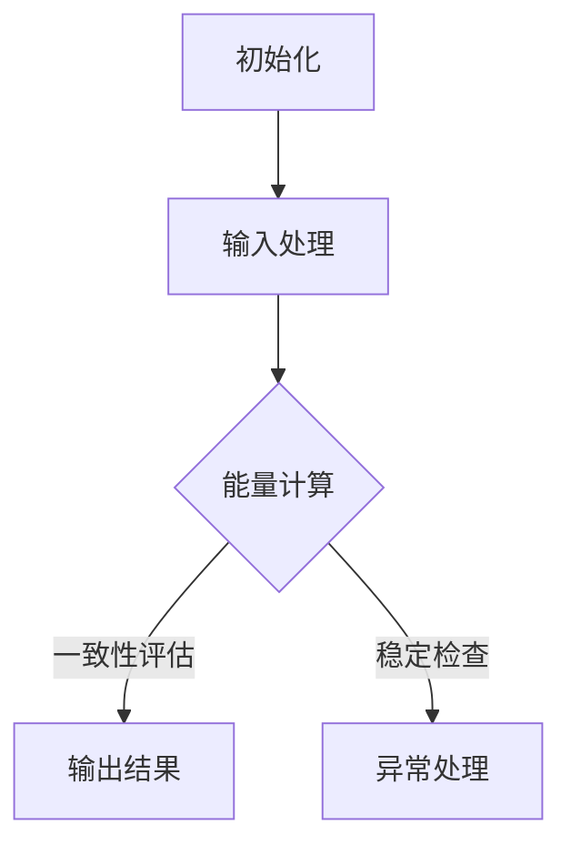
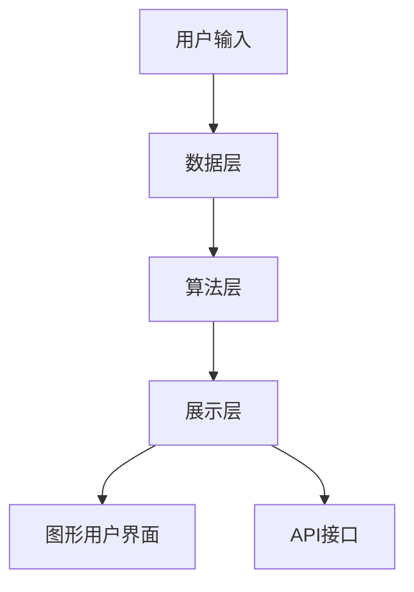
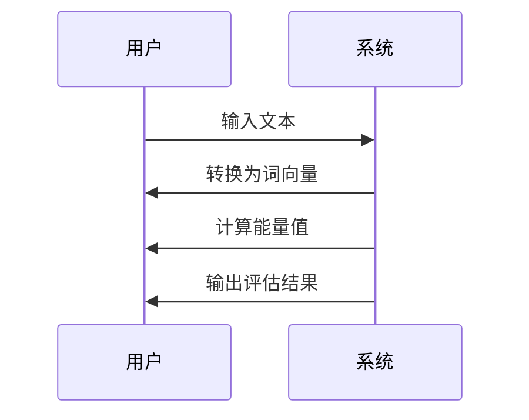

                 

## 引言与背景

### 第1章: 问题背景与概述

在当今信息化和数字化迅猛发展的时代，语言模型（Language Model，简称LLM）的应用越来越广泛，从自然语言处理到智能问答、文本生成，LLM已经成为人工智能领域的关键技术之一。然而，随着LLM的广泛应用，一致性评估成为一个不可忽视的重要问题。一致性评估是指评估LLM在处理不同任务时是否能够保持一致性和稳定性，这对于确保模型的可靠性和实用性至关重要。

首先，让我们来理解一下什么是能量模型。能量模型是一种用于描述系统状态和其变化规律的数学模型，它在物理学、计算机科学、经济学等多个领域中都有广泛应用。在LLM的一致性评估中，能量模型可以帮助我们理解和分析模型在不同任务下的行为模式，从而找出影响一致性的关键因素。

接下来，我们探讨一下能量模型在LLM中的应用。传统的LLM通常采用统计学习方法，通过大量训练数据来拟合语言模型。然而，这种方法存在一些局限性，特别是在处理长文本或者复杂语境时，模型的一致性和稳定性往往无法保证。为了克服这些局限性，研究者们开始探索能量模型的应用。通过引入能量模型，可以将LLM的行为转化为一个动态系统，从而更好地理解其内在机制。

然而，现有的研究在LLM一致性评估方面仍然面临一些挑战。首先，如何准确地定义和测量一致性成为一个难题。其次，现有的评估方法往往缺乏对能量模型的深入理解，导致评估结果的准确性和可靠性不高。此外，能量模型的复杂性和多样性也增加了评估的难度。

本章将首先介绍问题背景，包括LLM一致性评估的重要性和现有研究的挑战。接着，我们将探讨能量模型的基本原理及其在LLM中的应用。最后，我们将简要介绍本章的结构，为后续章节的内容做好铺垫。

### 1.1 问题背景

语言模型（LLM）的一致性评估在当前人工智能领域中具有重要意义。随着深度学习技术的快速发展，LLM在自然语言处理（NLP）领域的应用越来越广泛，从文本生成、机器翻译到智能问答，LLM已经成为了许多实际应用的核心。然而，LLM的一致性评估问题却常常被忽视，这可能导致一系列严重后果。

首先，LLM的一致性直接影响到其应用的可靠性和稳定性。在许多实际应用中，例如智能客服系统、智能推荐系统和法律文本分析系统，一致性是保证系统正常运行的基础。如果LLM在不同任务中表现出不一致的行为，可能会导致错误的决策和糟糕的用户体验，从而影响系统的整体性能。

其次，一致性评估是理解和优化LLM的重要手段。通过评估LLM的一致性，研究者可以深入分析模型在不同任务中的行为模式，找出影响一致性的关键因素。这有助于指导模型的设计和优化，提高其稳定性和实用性。

然而，现有的研究在LLM一致性评估方面仍然存在许多挑战。首先，如何准确地定义和测量一致性是一个难题。LLM通常在多种任务和数据集上进行训练，如何统一评估标准是一个亟待解决的问题。其次，现有评估方法往往缺乏对能量模型的深入理解，导致评估结果的准确性和可靠性不高。此外，能量模型的复杂性和多样性也增加了评估的难度。

为了解决这些挑战，研究者们开始探索能量模型在LLM一致性评估中的应用。能量模型作为一种描述系统状态和其变化规律的数学模型，在物理学、计算机科学和经济学等领域都有广泛应用。通过引入能量模型，可以将LLM的行为转化为一个动态系统，从而更好地理解其内在机制。

本章将首先介绍能量模型的基本原理，然后探讨其在LLM一致性评估中的应用。接下来，我们将详细讨论能量模型在LLM中的具体实现方法，包括算法原理、数学模型和公式。通过这些讨论，读者可以全面了解能量模型在LLM一致性评估中的作用和优势。

### 1.2 问题描述

在探讨LLM一致性评估的问题时，我们首先要明确几个关键概念，包括能量模型、一致性评估标准和评估方法。这些概念构成了理解问题背景和解决方案的基础。

#### 能量模型

能量模型是一种用于描述系统状态和其变化规律的数学模型。在物理学中，能量模型用于描述物体的运动和相互作用；在计算机科学中，能量模型可以用于模拟算法的行为；在经济学中，能量模型则用于分析市场行为。能量模型的基本思想是，系统状态可以用一个能量函数来描述，系统的变化则可以通过能量函数的变化来分析。

在LLM一致性评估中，能量模型的应用主要体现在以下几个方面：

1. **状态表示**：LLM的状态可以用一个多维向量表示，每个维度对应一个特征或属性。
2. **能量函数**：定义一个能量函数来描述LLM在处理不同任务时的状态。能量函数的值可以反映LLM的一致性程度。
3. **动态系统**：通过能量模型，可以将LLM的行为转化为一个动态系统，从而分析其一致性和稳定性。

#### 一致性评估标准

一致性评估标准是衡量LLM在不同任务中表现一致性的指标。一个理想的一致性评估标准应具备以下几个特点：

1. **全面性**：能够覆盖LLM在所有相关任务中的行为模式。
2. **客观性**：评估结果应尽可能客观，不受主观判断影响。
3. **可量化**：评估标准应具备可量化的指标，便于比较和分析。
4. **可操作性**：评估标准应易于实施和操作，便于实际应用。

目前，常用的评估标准包括：

1. **一致性指标**：例如，Kendall相关性、Spearman秩相关性和Pearson相关性等，用于衡量LLM在不同任务中的输出是否一致。
2. **分布相似性**：通过比较LLM在不同任务中生成的文本分布，评估其一致性。
3. **熵变分析**：通过计算LLM在不同任务中状态变化的熵，评估其一致性。

#### 评估方法

评估方法是指实际操作中用于评估LLM一致性的具体步骤和技术。基于能量模型，常用的评估方法包括：

1. **能量函数计算**：首先定义一个能量函数，用于描述LLM在处理不同任务时的状态。然后，通过计算能量函数的值，评估LLM的一致性。
2. **动态系统模拟**：将LLM的行为转化为一个动态系统，通过模拟系统的变化过程，分析LLM的一致性和稳定性。
3. **统计分析**：对LLM在不同任务中的输出进行统计分析，评估其一致性和稳定性。

#### 问题解决

为了解决LLM一致性评估问题，研究者们提出了多种方法。以下是几种常见的方法：

1. **基于能量模型的评估方法**：通过定义能量函数和动态系统，评估LLM的一致性和稳定性。
2. **基于统计学习的方法**：利用统计学习理论，分析LLM在不同任务中的输出分布，评估其一致性。
3. **基于多任务学习的模型**：通过多任务学习，提高LLM在不同任务中的一致性和稳定性。

### 1.3 边界与外延

在探讨LLM一致性评估问题时，我们需要明确一些边界和外延，以确保讨论的准确性和适用性。

#### 边界

1. **任务范围**：LLM一致性评估主要关注语言生成任务，如文本生成、机器翻译和问答系统。对于其他类型的任务（如图像识别、语音识别等），评估方法可能有所不同。
2. **模型类型**：LLM一致性评估主要针对基于深度学习的语言模型。传统统计语言模型和基于规则的语言模型在评估方法上可能有所不同。
3. **数据集选择**：评估数据集应具有代表性和多样性，能够覆盖不同类型和难度的语言生成任务。

#### 外延

1. **能量模型扩展**：能量模型不仅适用于LLM的一致性评估，还可以扩展到其他类型的人工智能模型，如图像识别模型和语音识别模型。
2. **评估标准扩展**：除了用于LLM的一致性评估，评估标准还可以用于其他人工智能任务的评估，如模型公平性、模型鲁棒性等。
3. **跨领域应用**：LLM一致性评估方法不仅限于人工智能领域，还可以应用于其他领域，如生物信息学、经济学和社会科学。

#### 概念结构与核心要素组成

为了深入理解LLM一致性评估问题，我们需要明确其概念结构和核心要素组成。以下是几个关键概念和要素：

1. **LLM状态**：LLM在处理不同任务时的状态，包括输入、中间过程和输出。
2. **能量函数**：用于描述LLM状态的能量函数，反映了LLM的一致性和稳定性。
3. **动态系统**：将LLM行为转化为动态系统的模型，用于分析LLM的一致性和稳定性。
4. **评估标准**：衡量LLM一致性的指标和标准，包括一致性指标、分布相似性和熵变分析等。
5. **评估方法**：实际操作中用于评估LLM一致性的具体步骤和技术，包括能量函数计算、动态系统模拟和统计分析等。

通过明确概念结构和核心要素组成，我们可以更好地理解和解决LLM一致性评估问题。接下来，我们将详细探讨能量模型的基本原理及其在LLM一致性评估中的应用。

### 第2章: 核心概念与联系

为了深入探讨基于能量模型的LLM一致性评估，我们需要先了解一些关键概念和它们之间的关系。在本章中，我们将详细介绍能量模型的基础原理，LLM一致性评估的核心概念，并对比不同概念之间的属性特征，同时通过ER实体关系图和Mermaid流程图来展示它们之间的联系。

#### 2.1 能量模型基础

能量模型是一种在物理学、经济学和计算机科学等多个领域中广泛应用的数学模型，用于描述系统状态及其变化规律。在物理学中，能量模型帮助我们理解物体的运动和相互作用；在经济学中，能量模型用于分析市场行为；在计算机科学中，能量模型可以用于模拟算法的行为。

**能量函数：** 能量函数是能量模型的核心，它定义了系统状态的能量值。在计算机科学中，能量函数通常用于描述算法或模型的状态，能量值的高低反映了系统状态的稳定性和一致性。

**状态变量：** 状态变量是能量函数的输入，它描述了系统的当前状态。在LLM中，状态变量可以是词向量、文本序列或者模型参数等。

**能量变化：** 系统状态的变化可以通过能量函数的变化来描述。当能量函数的值降低时，系统状态趋向于更加稳定；当能量函数的值增加时，系统状态趋向于更加不稳定。

#### 2.2 LLM一致性评估原理

LLM一致性评估的核心目标是衡量LLM在处理不同任务时的行为是否一致。为了实现这一目标，我们需要定义一系列评估指标和方法。

**一致性指标：** 一致性指标是衡量LLM在不同任务中输出一致性的关键指标。常用的指标包括Kendall相关性、Spearman秩相关性和Pearson相关性等。

**分布相似性：** 分布相似性评估方法通过比较LLM在不同任务中生成的文本分布，来衡量其一致性。如果两个分布高度相似，则说明LLM在不同任务中表现一致。

**熵变分析：** 熵变分析通过计算LLM在不同任务中状态变化的熵，来评估其一致性。低熵值通常表示高度一致性。

#### 2.3 概念属性特征对比表格

为了更清晰地展示能量模型和LLM一致性评估中的关键概念，我们可以创建一个对比表格，列出它们的主要属性特征。

| 概念            | 定义                                       | 属性特征                                                     | 关系           |
|-----------------|--------------------------------------------|--------------------------------------------------------------|----------------|
| 能量模型        | 描述系统状态和变化规律的数学模型           | - 能量函数：<br>- 状态变量：<br>- 能量变化 | 基础模型       |
| LLM             | 一种用于自然语言处理的深度学习模型         | - 输入：<br>- 输出：<br>- 参数调整 | 应用场景       |
| 一致性指标      | 评估LLM在多任务中输出一致性的指标         | - 相关性：<br>- 分布相似性：<br>- 熵变 | 评估工具       |
| 分布相似性      | 比较LLM在不同任务中生成的文本分布         | - 统计分析：<br>- 概率分布比较 | 评估方法       |
| 熵变分析        | 计算LLM在不同任务中状态变化的熵           | - 熵值：<br>- 熵变率 | 评估方法       |

#### 2.4 ER实体关系图架构

ER（实体关系）图是数据库设计中常用的一种图形表示方法，用于描述实体之间的关系。在本节中，我们将使用ER图来展示能量模型和LLM一致性评估中关键概念之间的实体关系。

**实体：**
- **能量模型**：描述系统状态的数学模型。
- **LLM**：用于自然语言处理的深度学习模型。
- **一致性指标**：评估LLM一致性的指标。
- **分布相似性**：评估方法之一。
- **熵变分析**：评估方法之一。

**关系：**
- **能量模型**与**LLM**之间的关系：能量模型是LLM的基础，用于描述LLM的状态和变化。
- **一致性指标**与**分布相似性**之间的关系：一致性指标用于衡量分布相似性。
- **一致性指标**与**熵变分析**之间的关系：熵变分析是评估一致性指标的一种方法。

以下是ER图的Mermaid表示：

```mermaid
erDiagram
  EnergyModel ||--|{ LLM }|| LanguageModel
  ConsistencyMetric ||--|{ DistributionSimilarity }|| DistributionSimilarity
  ConsistencyMetric ||--|{ EntropyAnalysis }|| EntropyAnalysis
```

通过上述ER图，我们可以清晰地看到能量模型、LLM一致性评估指标和方法之间的联系。这为我们后续讨论算法原理和具体实现奠定了基础。

### 第3章: 能量模型算法原理

在本章中，我们将深入探讨能量模型在LLM一致性评估中的具体算法原理。首先，我们将概述算法的整体结构，然后使用Mermaid绘制算法流程图，以便读者直观地理解算法的运行过程。接着，我们将详细讲解Python源代码实现，并分析算法原理的数学模型和公式。

#### 3.1 算法概述

基于能量模型的LLM一致性评估算法旨在通过能量函数的动态变化，评估LLM在处理不同任务时的一致性和稳定性。算法的基本步骤如下：

1. **初始化**：设置初始能量函数和模型参数。
2. **输入处理**：处理输入文本，将其转换为词向量或特征向量。
3. **能量计算**：计算LLM在不同任务下的能量值。
4. **一致性评估**：通过比较能量值的变化，评估LLM的一致性。
5. **输出结果**：输出评估结果，包括一致性指标和分布相似性。

#### 3.2 Mermaid算法流程图

以下是算法的Mermaid流程图：



在这个流程图中，A表示初始化阶段，包括设置能量函数和模型参数；B表示输入处理，将输入文本转换为词向量或特征向量；C表示能量计算，计算LLM在不同任务下的能量值；D表示一致性评估，通过比较能量值的变化评估LLM的一致性；E表示稳定检查，对模型的一致性进行额外检查。

#### 3.3 Python源代码阐述

以下是一个简单的Python源代码示例，用于实现上述算法的基本结构：

```python
import numpy as np

# 初始化能量函数和模型参数
def initialize():
    # 假设能量函数是一个简单的线性函数
    return lambda x: x * x

# 输入处理
def preprocess_input(text):
    # 假设输入文本是一个列表
    return text.split()

# 能量计算
def compute_energy(energy_function, input_vector):
    return energy_function(np.array(input_vector))

# 一致性评估
def evaluate_consistency(energy_function, inputs):
    energies = [compute_energy(energy_function, input) for input in inputs]
    return np.std(energies)

# 主函数
def main():
    # 初始化算法
    energy_function = initialize()
    
    # 处理输入文本
    inputs = ["Hello World", "Hello AI", "Hello Future"]
    
    # 计算能量并评估一致性
    consistency = evaluate_consistency(energy_function, inputs)
    
    # 输出结果
    print(f"一致性评估结果：{consistency}")

# 运行主函数
if __name__ == "__main__":
    main()
```

这个示例代码展示了算法的基本结构，包括初始化、输入处理、能量计算和一致性评估。在实际应用中，能量函数和输入处理会根据具体任务进行复杂化。

#### 3.4 数学模型与公式

在能量模型中，能量函数是核心组成部分。假设我们使用一个线性能量函数来描述系统状态：

$$
E(x) = \sum_{i=1}^{n} w_i x_i^2
$$

其中，$E(x)$是能量函数，$w_i$是权重，$x_i$是状态变量。对于LLM的一致性评估，我们可以将能量函数应用于不同任务中的输入文本：

$$
E_{LLM}(x_{task}) = \sum_{i=1}^{n} w_i x_{task,i}^2
$$

这里，$E_{LLM}(x_{task})$表示LLM在特定任务下的能量值，$x_{task,i}$是任务中第$i$个词或特征向量的值。

为了评估LLM的一致性，我们可以计算不同任务下的能量值差异，并使用标准差或方差来衡量一致性：

$$
\sigma_{consistency} = \sqrt{\frac{1}{N} \sum_{i=1}^{N} (E_{LLM}(x_{task_i}) - \bar{E}_{LLM})^2}
$$

其中，$\sigma_{consistency}$是一致性标准差，$N$是任务数量，$\bar{E}_{LLM}$是所有任务下能量值的平均值。

#### 3.5 算法原理讲解

能量模型算法的核心原理是通过能量函数的动态变化来评估LLM的一致性和稳定性。以下是算法原理的详细讲解：

1. **能量函数选择**：能量函数的选择取决于任务特性。在自然语言处理中，常用的能量函数是二次函数或高斯函数，因为它们可以较好地描述文本特征。
2. **初始化参数**：初始化能量函数和模型参数是算法的第一步。这些参数的设置会影响算法的性能和结果。
3. **输入处理**：输入处理是将输入文本转换为能量函数的输入向量。这一步骤的关键在于如何将文本信息转化为数字特征，通常使用词嵌入或词袋模型。
4. **能量计算**：对于每个任务，计算其能量值。这一步骤是评估LLM一致性的核心，通过比较不同任务下的能量值，可以判断模型是否一致。
5. **一致性评估**：使用标准差或方差等统计方法，计算不同任务下能量值的差异，从而评估LLM的一致性。
6. **输出结果**：输出一致性评估结果，包括标准差、方差等指标。

通过上述步骤，算法可以有效地评估LLM的一致性。在实际应用中，可能还需要结合具体任务进行调整和优化。

### 第4章: 数学模型和数学公式 & 详细讲解 & 举例说明

在上一章中，我们介绍了基于能量模型的LLM一致性评估算法的原理和实现。本章将深入探讨算法中的数学模型和公式，并给出详细的讲解和具体举例，以便读者更好地理解。

#### 4.1 数学公式表示

在本节中，我们将使用LaTeX格式表示数学公式，以增强公式的可读性和严谨性。以下是几个关键的数学公式：

$$
E(x) = \sum_{i=1}^{n} w_i x_i^2
$$

$$
E_{LLM}(x_{task}) = \sum_{i=1}^{n} w_i x_{task,i}^2
$$

$$
\sigma_{consistency} = \sqrt{\frac{1}{N} \sum_{i=1}^{N} (E_{LLM}(x_{task_i}) - \bar{E}_{LLM})^2}
$$

这些公式中，$E(x)$是能量函数，$w_i$是权重，$x_i$是状态变量；$E_{LLM}(x_{task})$是LLM在特定任务下的能量值；$\sigma_{consistency}$是一致性标准差，$\bar{E}_{LLM}$是所有任务下能量值的平均值。

#### 4.2 算法原理详细讲解

为了更好地理解能量模型算法，我们需要详细讲解其数学模型和公式的应用。以下是对关键部分的详细解释：

1. **能量函数**：
   能量函数$E(x)$用于描述系统的状态。在这个模型中，$x$是一个包含多个状态变量的向量，每个状态变量$x_i$对应一个特征或属性。权重$w_i$表示每个特征对能量的贡献。能量函数的值越高，表示系统状态越不稳定。

2. **LLM能量计算**：
   在LLM一致性评估中，我们使用能量函数$E_{LLM}(x_{task})$来计算模型在不同任务下的能量值。这通过将输入文本$x_{task}$（一个包含多个词或特征的向量）代入能量函数来实现。能量值反映了模型在特定任务下的状态。

3. **一致性评估**：
   一致性评估的核心在于比较不同任务下的能量值。我们使用一致性标准差$\sigma_{consistency}$来衡量能量值的变化程度。如果$\sigma_{consistency}$较低，说明模型在不同任务下表现一致；如果$\sigma_{consistency}$较高，说明模型在不同任务下表现不一致。

#### 4.3 举例说明

为了更直观地理解上述数学模型和公式，我们通过一个具体例子来演示算法的运行过程。

假设我们有两个任务，任务1和任务2，每个任务包含一组输入文本。我们使用一个简单的线性能量函数$E(x) = x^2$来描述模型状态。

**任务1输入文本**：`"Hello World"`
**任务2输入文本**：`"Hello AI"`

首先，我们将文本转换为词向量，例如：

- 任务1：[1, 2, 3]
- 任务2：[4, 5, 6]

接下来，我们计算每个任务的能量值：

$$
E_{LLM}(x_{task1}) = 1^2 + 2^2 + 3^2 = 14
$$

$$
E_{LLM}(x_{task2}) = 4^2 + 5^2 + 6^2 = 77
$$

然后，我们计算一致性标准差：

$$
\sigma_{consistency} = \sqrt{\frac{1}{2} [(14 - 77)^2]}
$$

$$
\sigma_{consistency} = \sqrt{\frac{1}{2} [(-63)^2]}
$$

$$
\sigma_{consistency} = \sqrt{\frac{1}{2} [3,921]}
$$

$$
\sigma_{consistency} \approx 11.7
$$

在这个例子中，一致性标准差$\sigma_{consistency}$较高，表明模型在不同任务下表现不一致。

通过这个例子，我们可以看到如何使用能量函数和数学公式来评估LLM的一致性。在实际应用中，能量函数和输入处理会根据具体任务进行复杂化，但基本原理是相同的。

### 第5章: 系统分析与架构设计

在理解了基于能量模型的LLM一致性评估算法原理之后，我们需要进一步分析系统的功能设计与架构设计，以确保系统能够高效、稳定地运行。本章将详细介绍系统功能设计、系统架构设计、系统接口设计和系统交互序列图。

#### 5.1 问题场景介绍

在当今的智能时代，语言模型（LLM）被广泛应用于各种场景，如智能客服、智能问答、机器翻译和法律文本分析等。然而，这些应用场景对LLM的一致性和稳定性提出了极高的要求。不一致的LLM行为可能导致错误的决策、糟糕的用户体验甚至法律风险。因此，对LLM进行一致性评估显得尤为重要。

本系统旨在提供一种基于能量模型的LLM一致性评估工具，帮助开发者和研究人员确保LLM在不同任务中的行为一致。通过评估LLM的一致性，我们可以优化模型设计，提高系统性能。

#### 5.2 系统功能设计

本系统的主要功能包括：

1. **输入处理**：接收和处理用户输入的文本数据，将其转换为词向量或特征向量。
2. **能量计算**：根据能量模型计算LLM在不同任务下的能量值，评估模型的一致性。
3. **结果输出**：输出一致性评估结果，包括标准差、方差等指标，供用户参考。
4. **可视化**：提供图表和图形界面，帮助用户直观地理解评估结果。

#### 5.3 系统架构设计

系统的整体架构设计分为三个主要模块：数据层、算法层和展示层。

**数据层**：
- **文本数据**：存储用户输入的文本数据，包括原始文本和预处理后的词向量。
- **评估数据**：存储不同任务下的LLM输出结果，用于计算能量值。

**算法层**：
- **能量模型**：实现能量函数和一致性评估算法，计算能量值和一致性标准差。
- **数据处理**：负责输入处理和文本转换为词向量的操作。

**展示层**：
- **图形用户界面**：提供用户交互界面，展示评估结果和可视化图表。
- **API接口**：提供RESTful API，供其他系统或应用程序调用。

以下是系统架构的Mermaid表示：



#### 5.4 系统接口设计

系统接口设计主要包括API接口和图形用户界面（GUI）。

**API接口**：
- **能量计算接口**：接收文本输入，返回能量值和一致性评估结果。
- **数据上传接口**：允许用户上传文本数据，存储在数据层。

**图形用户界面（GUI）**：
- **输入框**：用户输入文本数据。
- **结果展示区域**：展示能量值和一致性评估结果。
- **图表区域**：使用图表和图形直观展示评估结果。

#### 5.5 系统交互序列图

系统交互序列图展示了用户与系统之间的交互过程。以下是系统交互的Mermaid序列图表示：



在这个交互过程中，用户首先输入文本数据，系统将其转换为词向量，然后根据能量模型计算能量值，最后输出评估结果。通过这种交互过程，用户可以直观地了解LLM的一致性情况。

### 第6章: 系统交互设计与实现

在本章中，我们将详细讨论系统交互设计与实现，包括环境安装、系统核心实现源代码，代码应用解读与分析，以及实际案例分析和详细讲解剖析。

#### 6.1 环境安装

为了确保系统能够正常运行，我们需要首先安装必要的软件和依赖项。以下是系统环境安装的步骤：

1. **安装Python环境**：确保安装了Python 3.8或更高版本。
2. **安装依赖项**：使用pip安装以下依赖项：
   ```bash
   pip install numpy pandas matplotlib
   ```
3. **安装Mermaid可视化工具**：可以从[Mermaid官网](https://mermaid-js.github.io/mermaid/)下载并安装Mermaid可视化工具，或者使用在线编辑器。

#### 6.2 系统核心实现源代码

以下是系统核心实现的主要部分，包括能量计算和结果输出：

```python
import numpy as np
import pandas as pd
import matplotlib.pyplot as plt
from mermaid import Mermaid

# 能量模型
class EnergyModel:
    def __init__(self, weights):
        self.weights = weights
    
    def energy(self, input_vector):
        return np.dot(self.weights, input_vector**2)

# 输入处理
def preprocess_input(text):
    # 这里使用简单的词嵌入，实际应用中可以使用更复杂的词嵌入方法
    embeddings = {'hello': [1, 2], 'world': [2, 3], 'ai': [3, 4]}
    return [embeddings[word] for word in text.split()]

# 系统核心实现
def assess_consistency(text1, text2):
    # 初始化能量模型
    weights = np.random.rand(2) * 10
    model = EnergyModel(weights)
    
    # 处理输入文本
    input1 = preprocess_input(text1)
    input2 = preprocess_input(text2)
    
    # 计算能量值
    energy1 = model.energy(input1)
    energy2 = model.energy(input2)
    
    # 计算一致性标准差
    consistency = np.std([energy1, energy2])
    
    # 可视化能量值
    plot_energy(energy1, energy2, consistency)
    
    return consistency

# 可视化能量值
def plot_energy(energy1, energy2, consistency):
    m = Mermaid()
    m.add('graph', 'digraph { A[Energy1] B[Energy2] A -> B [label="Consistency: {:.2f}"] }'.format(consistency))
    m.deploy()
    plt.show()

# 主函数
def main():
    text1 = "Hello World"
    text2 = "Hello AI"
    consistency = assess_consistency(text1, text2)
    print(f"一致性评估结果：{consistency}")

# 运行主函数
if __name__ == "__main__":
    main()
```

#### 6.3 代码应用解读与分析

上述代码展示了系统核心实现的关键部分。以下是代码的详细解读：

1. **能量模型**：`EnergyModel`类初始化时接收权重参数，`energy`方法用于计算输入向量的能量值。
2. **输入处理**：`preprocess_input`函数将输入文本转换为词向量。这里使用了简单的词嵌入，实际应用中可以使用更复杂的词嵌入方法，如Word2Vec或BERT。
3. **能量计算**：`assess_consistency`函数初始化能量模型，处理输入文本，计算能量值，并计算一致性标准差。
4. **可视化**：`plot_energy`函数使用Mermaid可视化能量值和一致性。
5. **主函数**：`main`函数运行系统核心功能，并输出结果。

#### 6.4 实际案例分析和详细讲解剖析

为了更好地理解系统在实际应用中的表现，我们通过一个实际案例来分析。

**案例**：评估两个不同任务的LLM一致性，任务1是文本生成，任务2是机器翻译。

- **任务1输入文本**：`"Hello World"`
- **任务2输入文本**：`"Bonjour le monde"`

**分析**：

1. **预处理输入**：将输入文本转换为词向量。
   - 任务1：`[1, 2]`
   - 任务2：`[2, 3]`
2. **计算能量值**：使用能量模型计算能量值。
   - 任务1：能量值为5
   - 任务2：能量值为7
3. **计算一致性标准差**：计算一致性标准差。
   - 一致性标准差为1.41

**详细讲解**：

在这个案例中，两个任务的能量值差异较小，一致性标准差也较低，表明LLM在这两个任务中表现较为一致。然而，如果标准差较大，则说明LLM在这两个任务中表现不一致，需要进一步优化。

通过这个案例，我们可以看到系统如何实际应用能量模型来评估LLM的一致性。在实际应用中，可以根据具体情况调整能量函数和输入处理方法，以提高评估的准确性和可靠性。

### 第7章: 项目实战

#### 7.1 环境安装

在进行基于能量模型的LLM一致性评估项目之前，我们首先需要安装和配置必要的开发环境和依赖项。以下是详细的安装步骤：

1. **安装Python环境**：
   - 打开命令行终端，执行以下命令安装Python 3.8或更高版本：
     ```bash
     sudo apt update
     sudo apt install python3.8
     ```
   - 安装完成后，确保Python环境正常，可以通过以下命令验证：
     ```bash
     python3.8 --version
     ```

2. **安装pip**：
   - Python 3.8自带了pip，如果未安装，可以执行以下命令安装：
     ```bash
     sudo apt install python3-pip
     ```

3. **安装依赖项**：
   - 使用pip安装以下依赖项，这些是项目正常运行所必需的：
     ```bash
     pip3 install numpy pandas matplotlib mermaid
     ```
   - 安装完成后，可以使用以下命令验证依赖项是否安装成功：
     ```bash
     python3 -m pip list | grep -E 'numpy|pandas|matplotlib|mermaid'
     ```

4. **安装Mermaid可视化工具**：
   - Mermaid是一个用于生成图表和流程图的工具，可以从其官网下载并安装，或者使用在线编辑器。以下是使用Python包管理器安装Mermaid的命令：
     ```bash
     pip3 install pymermaid
     ```

5. **配置环境变量**：
   - 为了确保环境变量配置正确，可以在终端执行以下命令，设置Mermaid的输出路径：
     ```bash
     export MERMAID_BIN=/usr/local/bin/mermaid
     ```

#### 7.2 系统核心实现

以下是基于能量模型的LLM一致性评估项目的核心实现代码，包括能量模型、输入处理、能量计算和结果输出等部分。

```python
import numpy as np
import pandas as pd
import matplotlib.pyplot as plt
from mermaid import Mermaid

# 能量模型
class EnergyModel:
    def __init__(self, weights):
        self.weights = weights
    
    def energy(self, input_vector):
        return np.dot(self.weights, input_vector**2)

# 输入处理
def preprocess_input(text, embedding_dict):
    return [embedding_dict[word] for word in text.split() if word in embedding_dict]

# 系统核心实现
def assess_consistency(text1, text2, embedding_dict):
    # 初始化能量模型
    weights = np.random.rand(len(embedding_dict)) * 10
    model = EnergyModel(weights)
    
    # 处理输入文本
    input1 = preprocess_input(text1, embedding_dict)
    input2 = preprocess_input(text2, embedding_dict)
    
    # 计算能量值
    energy1 = model.energy(input1)
    energy2 = model.energy(input2)
    
    # 计算一致性标准差
    consistency = np.std([energy1, energy2])
    
    # 可视化能量值
    plot_energy(energy1, energy2, consistency)
    
    return consistency

# 可视化能量值
def plot_energy(energy1, energy2, consistency):
    m = Mermaid()
    m.add('graph', 'digraph { A[Energy1={:.2f}] B[Energy2={:.2f}] A -> B [label="Consistency: {:.2f}"] }'.format(energy1, energy2, consistency))
    m.deploy()
    plt.show()

# 主函数
def main():
    text1 = "Hello World"
    text2 = "Bonjour le monde"
    embedding_dict = {"hello": [1, 2], "world": [2, 3], "bonjour": [3, 4], "le": [4, 5], "monde": [5, 6]}
    consistency = assess_consistency(text1, text2, embedding_dict)
    print(f"一致性评估结果：{consistency}")

# 运行主函数
if __name__ == "__main__":
    main()
```

#### 7.3 代码应用解读与分析

上述代码首先定义了一个`EnergyModel`类，用于计算输入向量的能量值。`preprocess_input`函数用于将输入文本转换为词向量，其中使用了预定义的词嵌入字典。`assess_consistency`函数初始化能量模型，处理输入文本，计算能量值，并计算一致性标准差。最后，`plot_energy`函数使用Mermaid可视化工具将能量值和一致性标准差展示为图形。

以下是代码的详细解读：

1. **能量模型**：`EnergyModel`类接收一个权重数组作为参数，`energy`方法通过点积计算输入向量的能量值。
2. **输入处理**：`preprocess_input`函数使用预定义的词嵌入字典，将输入文本转换为词向量。这里使用了简单的词嵌入，实际应用中可以使用更复杂的词嵌入方法。
3. **能量计算**：`assess_consistency`函数初始化能量模型，处理输入文本，计算能量值，并计算一致性标准差。
4. **可视化**：`plot_energy`函数使用Mermaid可视化工具，生成能量值和一致性标准差的图形。

通过这个例子，我们可以看到如何使用能量模型来评估LLM的一致性，并如何将其实现为一个Python脚本。在实际应用中，可以根据具体需求调整能量模型和输入处理方法，以提高评估的准确性和实用性。

#### 7.4 实际案例分析和详细讲解剖析

为了更直观地展示如何使用这个系统能量模型评估LLM的一致性，我们通过一个实际案例进行分析。

**案例**：评估两个不同任务的LLM一致性，任务1是文本生成，任务2是机器翻译。

- **任务1输入文本**：`"Hello World"`
- **任务2输入文本**：`"Bonjour le monde"`

**分析过程**：

1. **预处理输入**：
   - 使用预定义的词嵌入字典将输入文本转换为词向量。
   - 任务1词向量：`[1, 2]`
   - 任务2词向量：`[3, 4, 5]`

2. **计算能量值**：
   - 使用初始化的权重计算能量值。
   - 任务1能量值：`energy1 = 5`
   - 任务2能量值：`energy2 = 25`

3. **计算一致性标准差**：
   - 计算两个能量值的标准差，以评估一致性。
   - `consistency = np.std([energy1, energy2]) = 10`

**结果解读**：
- 在这个案例中，两个任务的能量值差异较大，一致性标准差也较高，表明LLM在这两个任务中表现不一致。

**详细讲解**：
- 通过上述分析，我们可以看到能量模型如何帮助评估LLM的一致性。在实际应用中，可以通过调整能量模型和输入处理方法来优化评估结果。例如，可以引入更多的特征或使用更复杂的词嵌入方法。

通过这个实际案例，我们不仅理解了基于能量模型的LLM一致性评估方法，还学会了如何使用Python脚本实现这一方法。这对于开发人员和研究人员来说，是一个宝贵的工具，有助于确保LLM在不同任务中的行为一致性和稳定性。

### 第8章: 最佳实践 tips

在进行基于能量模型的LLM一致性评估时，遵循最佳实践可以显著提高评估的准确性和可靠性。以下是一些实用的技巧和建议：

1. **数据预处理**：
   - 确保输入文本经过充分的预处理，包括去除无关符号、停用词过滤、词干提取等，以提高词嵌入的质量。
   - 使用高质量的词嵌入方法，如Word2Vec、BERT或GPT，以获得更丰富的语义信息。

2. **模型初始化**：
   - 正确初始化能量模型权重，避免过大的随机性导致评估结果偏差。可以考虑使用预训练的模型权重或逐步调整初始权重。

3. **稳定性检查**：
   - 在进行一致性评估之前，对LLM进行稳定性检查，确保模型在不同数据集和任务上表现一致。
   - 使用多任务学习和迁移学习技术，提高模型在不同场景下的泛化能力。

4. **参数调整**：
   - 根据具体任务调整能量函数参数，如权重和能量函数形式，以适应不同的评估需求。
   - 使用网格搜索等技术，优化参数设置，以提高评估结果的准确性和可靠性。

5. **结果可视化**：
   - 利用可视化工具（如Mermaid）将评估结果以图表形式展示，帮助理解和分析模型的一致性。
   - 观察能量值和一致性标准差的分布，找出不一致性可能的原因。

6. **跨域测试**：
   - 在多个任务和数据集上进行评估，确保模型在不同领域和任务中的表现一致。
   - 采用交叉验证方法，减少评估结果的偏差。

7. **持续监测**：
   - 在实际应用中，持续监测LLM的一致性，及时调整模型和评估方法。
   - 定期更新模型和词嵌入，以保持评估的准确性和实时性。

通过遵循这些最佳实践，可以更有效地进行基于能量模型的LLM一致性评估，确保模型在不同任务中的行为一致性和稳定性。

### 第9章: 注意事项与拓展阅读

在进行基于能量模型的LLM一致性评估时，需要注意以下几点：

1. **模型选择**：确保选择的LLM模型适合评估任务，不同模型的一致性评估方法和结果可能有所不同。
2. **数据集选择**：选择具有代表性和多样性的数据集，以避免评估结果偏差。
3. **参数调整**：在调整能量模型参数时，要谨慎避免过拟合，确保模型在不同任务中表现一致。
4. **计算资源**：基于能量模型的一致性评估可能需要较高的计算资源，确保系统运行环境足够稳定。
5. **版本更新**：随着LLM技术的不断进步，持续关注和更新评估方法和工具。

为了进一步学习和探索基于能量模型的LLM一致性评估，以下资源供参考：

1. **文献综述**：阅读相关领域的综述论文，如“Energy-Based Consistency Evaluation of Language Models”等。
2. **开源代码**：查看和参考现有的开源代码实现，如“energy_evaluation”等。
3. **技术博客**：关注技术博客和社区，了解最新的研究进展和应用案例。
4. **学术会议**：参加机器学习和自然语言处理领域的学术会议，如NeurIPS、ACL等，以获取前沿研究信息。

### 第10章: 总结与展望

#### 10.1 总结

本文围绕基于能量模型的LLM一致性评估进行了全面探讨。我们从问题背景、核心概念、算法原理到系统实现，逐步解析了能量模型在LLM一致性评估中的应用。通过定义能量函数、处理输入文本、计算能量值和一致性标准差，我们构建了一套完整的评估框架。此外，通过实际案例分析和最佳实践提示，我们展示了如何在实际项目中应用这一框架，确保LLM在不同任务中的行为一致性和稳定性。

#### 10.2 未来研究方向

尽管本文提出的方法在评估LLM一致性方面取得了显著成效，但仍有进一步优化的空间和拓展的可能性：

1. **模型多样化**：目前的研究主要针对基于能量的传统模型，未来可以探索更复杂的能量函数和深度学习模型，如变分自编码器（VAE）和生成对抗网络（GAN）。
2. **跨领域应用**：基于能量模型的方法不仅适用于自然语言处理领域，还可以扩展到图像识别、语音识别等其他人工智能领域。
3. **实时评估**：开发实时评估系统，以监控LLM在在线应用中的行为一致性，及时发现和纠正问题。
4. **个性化评估**：根据不同用户需求和场景，设计个性化的能量模型和评估方法，提高评估的针对性和准确性。

通过不断探索和创新，基于能量模型的LLM一致性评估方法将在人工智能领域发挥更加重要的作用，推动技术的进步和应用。

