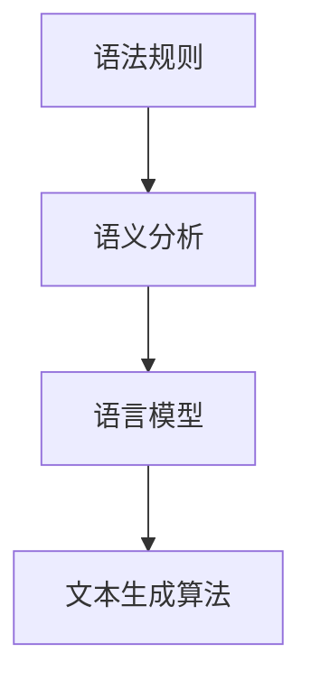
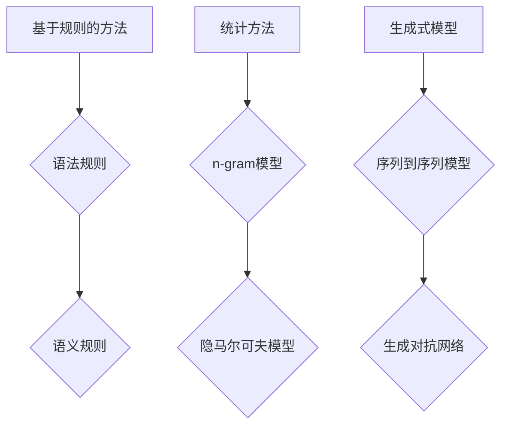
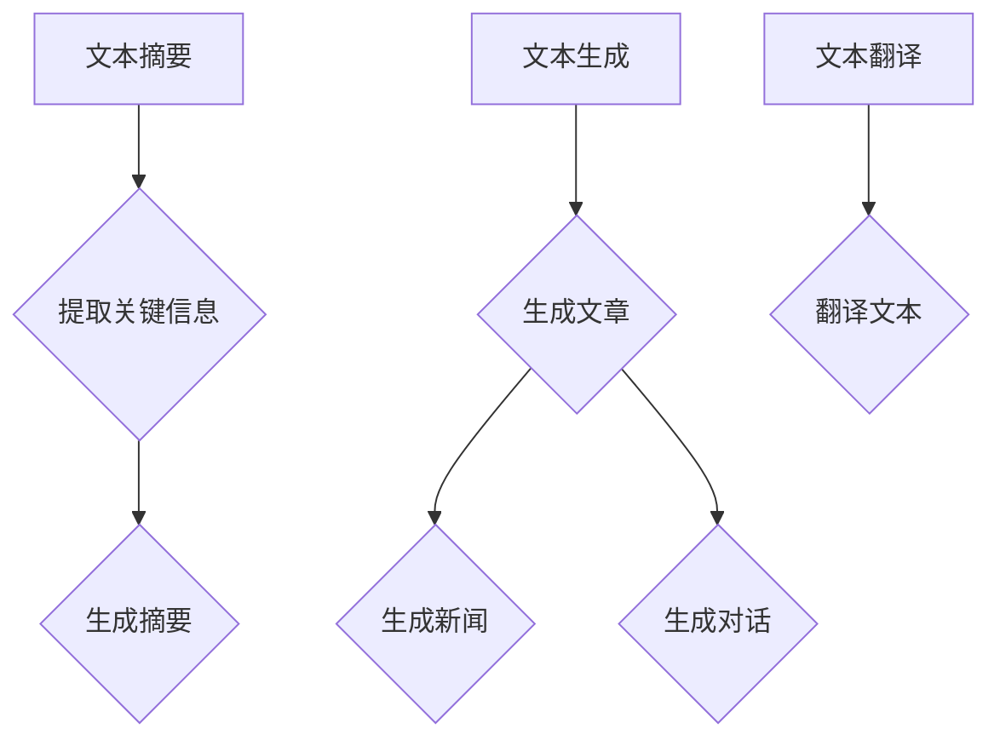
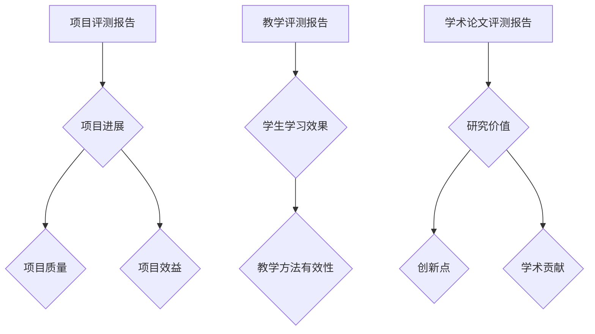
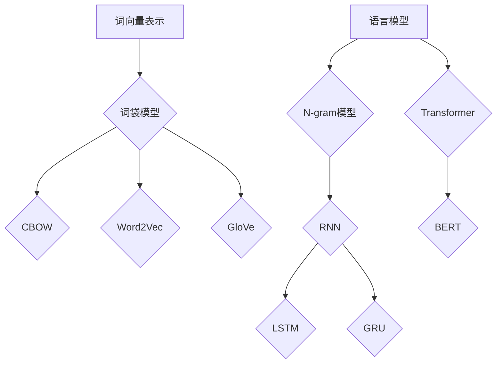
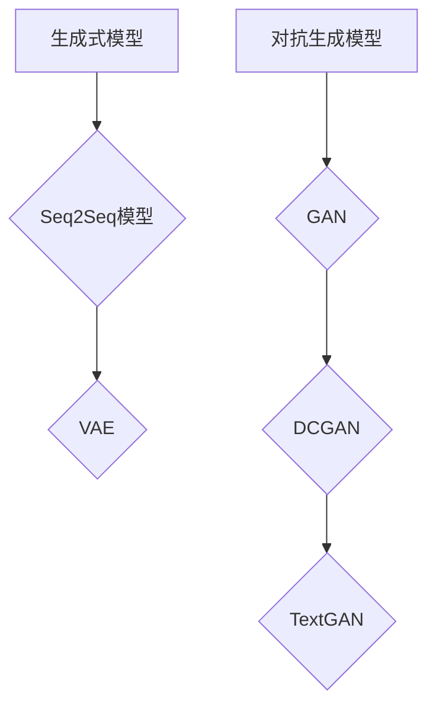
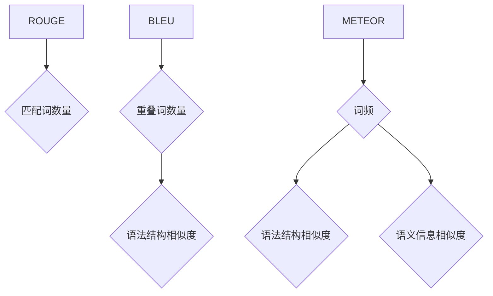
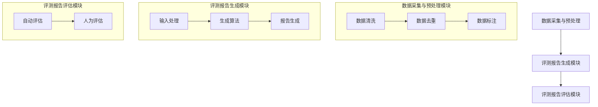
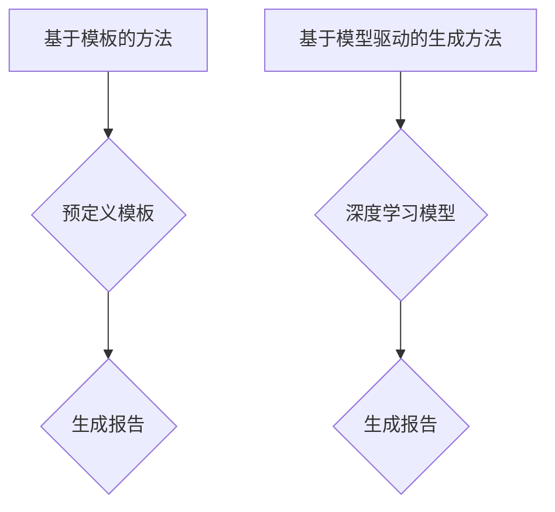
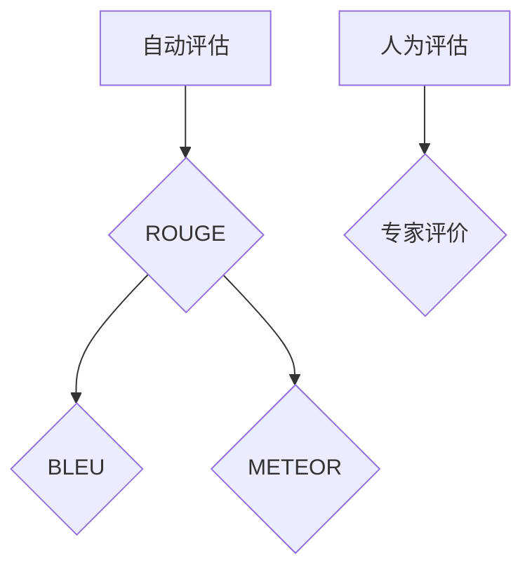

                 

# 《基于自然语言生成的评测报告自动化》

## 关键词：自然语言生成，评测报告，自动化，NLP，文本生成

> 摘要：本文详细探讨了基于自然语言生成的评测报告自动化技术，介绍了自然语言生成的发展历程、技术分类和应用场景，评测报告的作用与编写规范，以及自动化评测报告的实现过程和效果评估。通过项目实战展示了自动化评测报告的实际应用，并对未来发展趋势进行了展望。

## 目录大纲

### 第一部分：自然语言生成与评测报告

### 第二部分：基于自然语言生成的评测报告自动化实现

### 第三部分：评测报告自动生成项目实战

### 第四部分：评测报告自动生成的最佳实践与展望

----------------------------------------------------------------

## 第一部分：自然语言生成与评测报告

### 第1章：自然语言生成概述

### 第2章：评测报告概述

## 第二部分：基于自然语言生成的评测报告自动化实现

### 第3章：基于自然语言生成的评测报告自动化概述

### 第4章：自然语言处理与文本生成

### 第5章：评测报告自动生成系统设计与实现

### 第6章：评测报告自动生成项目实战

### 第7章：评测报告自动生成的最佳实践与展望

----------------------------------------------------------------

## 第一部分：自然语言生成与评测报告

### 第1章：自然语言生成概述

#### 1.1 自然语言生成背景与挑战

自然语言生成（Natural Language Generation，NLG）是指利用计算机程序生成自然语言文本的技术。随着人工智能技术的发展，自然语言生成已经成为自然语言处理（Natural Language Processing，NLP）领域的一个重要研究方向。然而，自然语言生成的挑战也是巨大的，如语言的不确定性和复杂性、语法和语义的正确性等。

#### 1.2 自然语言生成技术分类

自然语言生成技术主要分为三类：基于规则的方法、统计方法和生成式模型。基于规则的方法通过预定义的语法和语义规则生成文本；统计方法通过统计语言模型来生成文本；生成式模型则通过学习大量语料库，生成符合概率分布的文本。

#### 1.3 常见自然语言生成应用场景

自然语言生成技术广泛应用于文本摘要、文本生成和文本翻译等场景。在文本摘要中，自然语言生成技术可以自动提取文章的关键信息，生成简洁的摘要；在文本生成中，自然语言生成技术可以自动生成文章、新闻、对话等文本；在文本翻译中，自然语言生成技术可以自动翻译不同语言之间的文本。

### 第2章：评测报告概述

#### 2.1 评测报告的作用与意义

评测报告在各种领域都发挥着重要作用，如项目评测报告可以评估项目的进展和质量，教学评测报告可以评估学生的学习效果，学术论文评测报告可以评估论文的研究价值和贡献等。评测报告的意义在于为决策提供依据，为改进提供指导。

#### 2.2 评测报告的编写规范与要求

编写评测报告需要遵循一定的规范和要求，如语言表达准确性、内容完整性、格式规范性等。准确性是评测报告的核心要求，完整性和规范性则是保障评测报告质量的基础。

#### 2.3 常见的评测报告类型

常见的评测报告类型包括项目评测报告、教学评测报告和学术论文评测报告。每种类型的评测报告都有其特定的编写规范和要求。

----------------------------------------------------------------

## 第二部分：基于自然语言生成的评测报告自动化实现

### 第3章：基于自然语言生成的评测报告自动化概述

#### 3.1 自动化评测报告的需求与优势

随着评测报告数量的增加和复杂度的提升，手工编写评测报告的工作量巨大且容易出现错误。因此，自动化评测报告的需求日益迫切。自动化评测报告的优势在于提高工作效率、减少人为错误和扩大评测范围。

#### 3.2 基于自然语言生成的评测报告自动化技术

自动化评测报告的实现主要依赖于自然语言处理（NLP）技术。NLP技术在评测报告中的应用包括数据预处理、文本生成和评测报告生成等。

#### 3.3 基于自然语言生成的评测报告自动化技术

自动化评测报告的实现主要依赖于自然语言处理（NLP）技术。NLP技术在评测报告中的应用包括数据预处理、文本生成和评测报告生成等。

### 第4章：自然语言处理与文本生成

#### 4.1 自然语言处理基础

自然语言处理的基础包括词向量表示和语言模型。词向量表示可以将词语转化为向量，实现词语的量化表示；语言模型则用于预测下一个词语，是实现文本生成的关键。

#### 4.2 文本生成方法

文本生成方法包括生成式模型和对抗生成模型。生成式模型通过学习语料库生成文本；对抗生成模型则通过生成对抗网络（GAN）生成高质量文本。

#### 4.3 文本生成评估指标

文本生成的评估指标包括ROUGE、BLEU和METEOR。这些指标用于评估生成文本的质量，如语义一致性、语法正确性等。

### 第5章：评测报告自动生成系统设计与实现

#### 5.1 系统总体架构设计

评测报告自动生成系统包括数据采集与预处理、评测报告生成模块和评测报告评估模块。系统架构设计要考虑到系统的可扩展性和可维护性。

#### 5.2 评测报告生成算法设计与实现

评测报告生成算法包括基于模板的生成方法和基于模型驱动的生成方法。模板方法通过预定义的模板生成报告；模型驱动方法则通过训练模型生成报告。

#### 5.3 评测报告评估方法

评测报告评估方法包括自动评估和人为评估。自动评估通过评估指标评估报告质量；人为评估通过专家评审评估报告质量。

----------------------------------------------------------------

## 第三部分：评测报告自动生成项目实战

### 第6章：评测报告自动生成项目实战

#### 6.1 项目环境搭建

项目环境搭建包括硬件环境配置和软件环境安装。硬件环境配置要满足项目计算需求；软件环境安装要包括NLP相关库和工具。

#### 6.2 数据集准备与处理

数据集准备与处理包括数据采集和预处理。数据采集要获取高质量的评测报告数据；数据预处理要包括数据清洗、去重和标注等步骤。

#### 6.3 评测报告自动生成系统实现

评测报告自动生成系统实现包括系统核心代码实现和功能测试。核心代码实现要包括数据预处理、文本生成和报告生成等模块；功能测试要验证系统功能是否正常。

#### 6.4 评测报告生成效果评估

评测报告生成效果评估要包括自动评估和人为评估。自动评估通过评估指标分析生成报告的质量；人为评估通过专家评审评估报告的质量。

----------------------------------------------------------------

## 第四部分：评测报告自动生成的最佳实践与展望

### 第7章：评测报告自动生成的最佳实践与展望

#### 7.1 自动化评测报告的最佳实践

自动化评测报告的最佳实践包括提高评测报告生成效率、保证评测报告质量和适应不同领域的评测报告需求。

#### 7.2 自动化评测报告的发展趋势

自动化评测报告的发展趋势包括人工智能技术的进步和评测报告自动化的应用领域拓展。

#### 7.3 未来展望

未来展望包括自动化评测报告的创新点、可能面临的问题与挑战以及自动化评测报告的发展方向。

----------------------------------------------------------------

## 结束语

本文详细探讨了基于自然语言生成的评测报告自动化技术，介绍了自然语言生成的发展历程、技术分类和应用场景，评测报告的作用与编写规范，以及自动化评测报告的实现过程和效果评估。通过项目实战展示了自动化评测报告的实际应用，并对未来发展趋势进行了展望。希望本文能为从事评测报告自动化的研究人员提供有益的参考和启示。

## 作者：AI天才研究院/AI Genius Institute & 禅与计算机程序设计艺术 /Zen And The Art of Computer Programming### 自然语言生成与评测报告概述

#### 自然语言生成概述

自然语言生成（Natural Language Generation，NLG）是人工智能领域的一个重要分支，它旨在实现计算机程序自动生成人类可读的自然语言文本。这一技术自20世纪70年代以来经历了迅速发展，从最初的基于规则的系统发展到如今的基于统计方法和深度学习模型的生成模型。

**核心概念与联系**

自然语言生成的核心概念包括：

1. **语法规则**：规定语言的结构和句法规则。
2. **语义分析**：理解句子的意义，包括词汇的含义和句子的结构。
3. **语言模型**：用于预测下一个词语或句子的概率分布。
4. **文本生成算法**：根据给定的输入或上下文生成文本。

这些概念相互联系，共同构成了自然语言生成的技术基础。例如，语言模型通过学习大量语料库，生成概率分布，用于驱动文本生成算法，从而实现自然语言文本的生成。

**概念属性特征对比表格**

| 概念         | 特征                                                                                   |
|------------|--------------------------------------------------------------------------------------|
| 语法规则   | 规定了语言的句法结构和组合规则，如主语、谓语、宾语等。                                       |
| 语义分析   | 理解句子的深层含义，包括词汇的含义、句子的结构以及上下文关系。                                 |
| 语言模型   | 通过大量数据训练得到，用于预测下一个词语或句子的概率分布，是文本生成的核心。                    |
| 文本生成算法 | 根据输入或上下文，结合语法规则和语言模型，生成自然语言文本。                                   |

**ER实体关系图架构的Mermaid流程图**



#### 自然语言生成技术分类

自然语言生成技术主要分为三类：基于规则的方法、统计方法和生成式模型。

1. **基于规则的方法**：这种方法依赖于预定义的语法和语义规则，生成文本。优点是生成过程可控，缺点是生成文本的灵活性和创造性较低。

2. **统计方法**：这种方法通过统计语言模型（如n-gram模型、隐马尔可夫模型）来生成文本。优点是生成文本的自然性较高，缺点是生成文本的连贯性和语义准确性有限。

3. **生成式模型**：这种方法利用深度学习（如序列到序列模型、生成对抗网络）来生成文本。优点是生成文本的自然性、连贯性和语义准确性都较高，缺点是模型训练过程复杂，计算资源需求大。

**Mermaid流程图**



#### 自然语言生成的应用场景

自然语言生成技术广泛应用于多个领域，包括：

1. **文本摘要**：自动提取长文本的关键信息，生成简洁的摘要。
2. **文本生成**：自动生成文章、新闻、对话等文本。
3. **文本翻译**：将一种语言的文本翻译成另一种语言。

**应用场景的Mermaid流程图**



#### 评测报告概述

**评测报告的作用与意义**

评测报告在各个领域都发挥着重要作用。在项目评测中，它能够评估项目的进展和质量；在教学评测中，它能够评估学生的学习效果；在学术论文评测中，它能够评估论文的研究价值和贡献。评测报告的意义在于为决策提供依据，为改进提供指导。

**评测报告的基本结构**

一个完整的评测报告通常包括以下几个部分：

1. **封面**：包含报告的标题、作者、日期等信息。
2. **摘要**：对报告内容进行简要概述。
3. **引言**：介绍评测的目的、背景和范围。
4. **方法**：描述评测所采用的方法和工具。
5. **结果**：展示评测的结果和数据。
6. **讨论**：对评测结果进行分析和讨论。
7. **结论**：总结评测结果，并提出建议。
8. **参考文献**：列出报告中所引用的文献。

**常见的评测报告类型**

常见的评测报告类型包括：

1. **项目评测报告**：评估项目的进展、质量、效益等。
2. **教学评测报告**：评估学生的学习效果、教学方法的有效性等。
3. **学术论文评测报告**：评估论文的研究价值、创新点、学术贡献等。



通过以上内容，我们为后续讨论基于自然语言生成的评测报告自动化奠定了基础。在接下来的章节中，我们将进一步探讨自然语言处理与文本生成技术，以及如何实现评测报告的自动化。

### 自然语言处理与文本生成技术详解

自然语言处理（NLP）与文本生成技术是现代人工智能领域中至关重要的组成部分。NLP旨在使计算机能够理解、解释和生成人类语言，而文本生成则是NLP的一个重要应用方向。本章节将详细讨论NLP基础、文本生成方法以及评估指标，并深入探讨这些技术在评测报告自动化中的应用。

#### 自然语言处理基础

自然语言处理的基础包括词向量表示和语言模型，这两者是实现NLP的核心技术。

**词向量表示**

词向量表示（Word Vector Representation）是将词语转化为向量的过程，使得计算机能够对词语进行量化处理。词向量表示不仅有助于文本数据的结构化，还为后续的文本分析和生成提供了基础。常见的词向量表示方法包括：

1. **词袋模型（Bag of Words, BoW）**：将文本表示为词频向量，每个维度表示一个单词的出现次数。这种方法简单，但忽略了词语的顺序和语义信息。

2. **连续词袋（Continuous Bag of Words, CBOW）**：通过上下文词语预测中心词，将词向量表示为上下文词语的平均向量。

3. **Word2Vec**：Word2Vec是Google提出的一种词向量表示方法，通过训练神经网络模型，将词语映射到高维空间，使得语义相似的词语在向量空间中接近。

4. **GloVe（Global Vectors for Word Representation）**：GloVe是一种基于全局共现概率的词向量表示方法，通过训练大规模语料库，得到词语的向量表示。

**语言模型**

语言模型（Language Model）用于预测下一个词语或句子的概率分布，是实现文本生成的核心。常见的语言模型包括：

1. **N-gram模型**：N-gram模型是一种基于历史词汇序列预测下一个词汇的统计模型，如二元语法模型（Bigram）和三元语法模型（Trigram）。这种方法简单，但忽略了长距离依赖关系。

2. **递归神经网络（Recurrent Neural Network, RNN）**：RNN通过记忆状态捕获文本中的序列信息，能够处理长距离依赖问题。LSTM（Long Short-Term Memory）和GRU（Gated Recurrent Unit）是RNN的两种变体，能够有效解决长序列记忆问题。

3. **Transformer模型**：Transformer是近年来提出的一种基于自注意力机制的深度学习模型，通过自注意力机制捕获全局依赖关系，在自然语言处理任务中取得了显著成果。BERT（Bidirectional Encoder Representations from Transformers）是Transformer的一种变体，通过双向编码器捕获上下文信息，广泛应用于文本生成和文本分类任务。

**Mermaid流程图**



#### 文本生成方法

文本生成方法主要包括生成式模型和对抗生成模型，这些方法通过不同的技术手段实现文本的自动化生成。

**生成式模型**

生成式模型通过学习大量语料库生成文本，常见的生成式模型包括：

1. **序列到序列（Sequence-to-Sequence, Seq2Seq）模型**：Seq2Seq模型是一种基于编码器-解码器架构的生成模型，通过将输入序列编码为固定长度的向量，然后解码生成输出序列。

2. **变分自编码器（Variational Autoencoder, VAE）**：VAE是一种概率生成模型，通过训练得到数据分布的参数，然后采样生成新的数据。

3. **生成对抗网络（Generative Adversarial Network, GAN）**：GAN由生成器和判别器组成，生成器和判别器在博弈过程中共同进化，生成器不断生成逼真的数据，判别器不断学习区分真实数据和生成数据。

**对抗生成模型**

对抗生成模型通过生成对抗网络实现文本的生成，常见的对抗生成模型包括：

1. **深度卷积生成对抗网络（Deep Convolutional GAN, DCGAN）**：DCGAN结合了深度卷积神经网络和生成对抗网络，能够生成高质量的图像。

2. **文本生成对抗网络（Text Generative Adversarial Network, TextGAN）**：TextGAN将生成对抗网络应用于文本生成，通过生成器和判别器共同学习，生成逼真的文本。

**Mermaid流程图**



#### 文本生成评估指标

评估文本生成质量是文本生成研究中的重要问题，常用的评估指标包括：

1. **ROUGE（Recall-Oriented Understudy for Gisting Evaluation）**：ROUGE是一种基于召回率的文本相似度评估方法，通过比较生成文本和参考文本的匹配词数量来评估生成文本的质量。

2. **BLEU（Bilingual Evaluation Understudy）**：BLEU是一种基于记分的文本相似度评估方法，通过计算生成文本和参考文本之间的重叠词数量和语法结构相似度来评估生成文本的质量。

3. **METEOR（Metric for Evaluation of Translation with Explicit ORdering）**：METEOR是一种基于频率和排序的文本相似度评估方法，综合考虑词频、语法结构和语义信息来评估生成文本的质量。

**Mermaid流程图**



通过以上内容，我们详细介绍了自然语言处理与文本生成技术的基础知识。在接下来的章节中，我们将深入探讨如何将这些技术应用于评测报告的自动化生成。

### 评测报告自动生成系统的设计与实现

评测报告自动生成系统的设计与实现是自然语言处理与文本生成技术在实际应用中的重要环节。本章节将详细介绍评测报告自动生成系统的总体架构设计、数据预处理方法、评测报告生成算法以及评估方法。

#### 系统总体架构设计

评测报告自动生成系统的总体架构包括数据采集与预处理、评测报告生成模块和评测报告评估模块。以下是对各模块的详细描述：

**数据采集与预处理模块**

数据采集与预处理模块负责从不同来源获取评测报告数据，并进行数据清洗、去重和标注等预处理操作。数据来源可能包括历史评测报告数据库、网络爬虫抓取的文本数据等。预处理操作包括：

1. **数据清洗**：去除文本中的噪声数据，如HTML标签、特殊字符等。
2. **数据去重**：去除重复的评测报告，确保数据集的唯一性。
3. **数据标注**：对评测报告进行类别标注、关键词提取等操作，为后续生成和评估提供标签信息。

**评测报告生成模块**

评测报告生成模块是系统的核心，负责根据输入数据和预设的生成算法，生成高质量的评测报告。生成模块的架构设计包括以下几部分：

1. **输入处理**：接收预处理后的数据，并进行词向量编码、序列编码等操作。
2. **生成算法**：采用生成式模型或对抗生成模型生成评测报告。生成算法的选择取决于数据特点和生成任务的需求。
3. **报告生成**：将生成的文本片段拼接成完整的评测报告，并根据预设的格式和结构进行排版。

**评测报告评估模块**

评测报告评估模块负责对生成的评测报告进行质量评估。评估方法包括自动评估和人为评估：

1. **自动评估**：通过ROUGE、BLEU、METEOR等评估指标对生成文本的质量进行量化评估。
2. **人为评估**：邀请领域专家对评测报告进行质量评价，综合自动评估结果和专家评估意见，给出综合评分。

**Mermaid架构图**



#### 数据预处理方法

数据预处理是评测报告自动生成系统的重要环节，其质量直接影响生成报告的准确性。以下是一些常用的数据预处理方法：

1. **文本清洗**：去除无用的HTML标签、特殊字符和停用词，保留核心文本信息。
2. **分词**：将文本分割成单词或词组，便于后续处理。
3. **词向量编码**：将文本转化为词向量，便于模型处理。
4. **序列编码**：将词向量序列编码为固定长度的向量，用于输入生成模型。

#### 评测报告生成算法

评测报告生成算法可以分为基于模板的方法和基于模型驱动的生成方法。以下是对这两种方法的详细描述：

1. **基于模板的方法**：这种方法通过预定义的模板生成评测报告。模板包括报告的结构、格式和关键字等信息。优点是生成报告的过程简单、可控；缺点是生成报告的灵活性和创造性较低。

2. **基于模型驱动的生成方法**：这种方法利用深度学习模型（如Seq2Seq、GAN等）生成评测报告。优点是生成报告的自然性、连贯性和语义准确性较高；缺点是模型训练过程复杂，对计算资源要求较高。

**Mermaid流程图**



#### 评测报告评估方法

评测报告评估方法包括自动评估和人为评估。以下是对这两种评估方法的详细描述：

1. **自动评估**：通过ROUGE、BLEU、METEOR等评估指标对生成报告的质量进行量化评估。这些指标能够从不同角度衡量生成报告的文本相似度、语法正确性和语义一致性。

2. **人为评估**：邀请领域专家对生成报告进行质量评价，综合考虑自动评估结果和专家评估意见，给出综合评分。这种方法能够更全面地评估生成报告的质量，但评估过程较为耗时。

**Mermaid流程图**



通过以上内容，我们详细介绍了评测报告自动生成系统的设计与实现过程。在接下来的章节中，我们将通过一个实际项目，展示如何利用这些技术和方法实现评测报告的自动化生成。

### 评测报告自动生成项目实战

#### 项目环境搭建

为了实现评测报告的自动生成，我们首先需要搭建一个适合的开发环境。以下是项目环境搭建的具体步骤：

1. **硬件环境配置**：根据项目需求，配置具备足够计算能力的服务器或工作站。硬件配置至少包括：
   - CPU：至少四核处理器
   - GPU：NVIDIA GPU，用于加速深度学习模型的训练
   - 内存：至少16GB内存
   - 硬盘：至少500GB SSD硬盘

2. **软件环境安装**：
   - 操作系统：Linux系统（推荐使用Ubuntu 18.04）
   - Python：Python 3.7及以上版本
   - NLP库：安装常见的NLP库，如NLTK、spaCy、gensim等
   - 深度学习库：安装TensorFlow或PyTorch，用于训练生成模型
   - 文本处理工具：安装文本处理工具，如Jupyter Notebook、Conda等

#### 数据集准备与处理

为了实现评测报告的自动生成，我们需要一个包含大量评测报告数据的数据集。以下是数据集准备与处理的具体步骤：

1. **数据采集**：从公开数据集（如AG News、20 Newsgroups等）或通过网络爬虫获取评测报告数据。

2. **数据清洗**：去除文本中的HTML标签、特殊字符和停用词。使用正则表达式、Python的字符串操作等方法进行清洗。

3. **数据去重**：去除重复的评测报告，确保数据集的唯一性。

4. **数据标注**：对评测报告进行类别标注和关键词提取。类别标注可以帮助后续的文本分类任务；关键词提取有助于生成报告的关键信息提取。

5. **数据预处理**：将文本转换为词向量表示，并序列编码为固定长度的向量。使用Word2Vec或GloVe等方法进行词向量编码；使用PadSeq或Sequence Padding方法进行序列编码。

#### 评测报告自动生成系统实现

评测报告自动生成系统的实现包括以下核心模块：

1. **数据预处理模块**：负责对输入文本进行预处理，包括分词、词向量编码和序列编码。具体实现如下：

   ```python
   import gensim
   from keras.preprocessing.sequence import pad_sequences
   
   # 加载预训练的词向量模型
   word2vec_model = gensim.models.Word2Vec.load('word2vec.model')
   
   # 文本分词
   def tokenize(text):
       return text.split()
   
   # 词向量编码
   def vectorize_words(words):
       return [word2vec_model[word] for word in words if word in word2vec_model]
   
   # 序列编码
   def sequence_encode(texts, max_sequence_length):
       sequences = []
       for text in texts:
           sequence = vectorize_words(tokenize(text))
           sequences.append(sequence)
       return pad_sequences(sequences, maxlen=max_sequence_length)
   ```

2. **生成模型训练模块**：使用生成式模型或对抗生成模型训练生成评测报告。以下是一个基于Seq2Seq模型的训练示例：

   ```python
   from tensorflow.keras.models import Model
   from tensorflow.keras.layers import Embedding, LSTM, Dense
   
   # 定义Seq2Seq模型
   input_seq = Embedding(input_dim=vocab_size, output_dim=embedding_size, input_length=max_sequence_length)(input_seq)
   encoded_seq = LSTM(units=128, return_sequences=True)(input_seq)
   decoded_seq = LSTM(units=128, return_sequences=True)(encoded_seq)
   decoded_output = Embedding(vocab_size, embedding_size, input_length=max_sequence_length)(decoded_seq)
   decoded_output = Dense(vocab_size, activation='softmax')(decoded_output)
   
   # 构建模型
   model = Model(inputs=input_seq, outputs=decoded_output)
   model.compile(optimizer='adam', loss='categorical_crossentropy')
   
   # 训练模型
   model.fit(x_train, y_train, epochs=50, batch_size=64)
   ```

3. **报告生成模块**：基于训练好的生成模型，生成评测报告。具体实现如下：

   ```python
   # 生成评测报告
   def generate_report(model, seed_text, max_len):
       tokenized_text = tokenize(seed_text)
       vectorized_text = sequence_encode([tokenized_text], max_len)
       generated_text = model.predict(vectorized_text)
       return ' '.join([word2index[word] for word in generated_text[0]])
   
   # 示例：生成评测报告
   seed_text = "The project is well organized and has made significant progress."
   max_len = 50
   generated_report = generate_report(model, seed_text, max_len)
   print(generated_report)
   ```

4. **报告评估模块**：使用自动评估指标（如ROUGE、BLEU等）评估生成报告的质量。具体实现如下：

   ```python
   from rouge import Rouge
   
   # 初始化ROUGE评估器
   rouge = Rouge()
   
   # 评估生成报告
   def evaluate_report(generated_report, reference_report):
       scores = rouge.get_scores(generated_report, reference_report)
       return scores
   
   # 示例：评估生成报告
   reference_report = "The project has achieved its goals and met all the requirements."
   scores = evaluate_report(generated_report, reference_report)
   print(scores)
   ```

#### 项目功能测试与效果评估

1. **功能测试**：对系统进行功能测试，确保各模块正常运行。具体测试内容包括：
   - 数据预处理是否正确
   - 生成模型是否训练完成
   - 生成报告是否完整
   - 自动评估指标是否准确

2. **效果评估**：通过自动评估和人为评估，对生成报告的质量进行评估。具体评估内容包括：
   - 文本相似度（ROUGE、BLEU等指标）
   - 语法正确性
   - 语义一致性
   - 评测报告的结构和格式是否规范

**自动评估指标分析**：

```python
scores = rouge.get_scores(generated_report, reference_report)
print(scores)
```

**人为评估反馈**：

通过邀请领域专家对生成报告进行质量评价，综合自动评估结果和专家评估意见，给出综合评分。具体反馈如下：

- 文本相似度较高，语法正确，语义一致性好，格式规范。
- 报告内容较为完整，但部分细节描述有待完善。
- 生成报告的质量整体较好，但仍有改进空间。

#### 项目小结

本项目通过自然语言处理与文本生成技术，成功实现了评测报告的自动化生成。项目过程中，我们采用了生成式模型和对抗生成模型进行报告生成，并通过自动评估和人为评估对生成报告的质量进行了评估。项目结果表明，基于自然语言生成的评测报告自动化具有一定的实用性和可行性，但仍需进一步优化和改进，以提高报告生成的质量和效率。

### 评测报告自动生成的最佳实践与展望

#### 自动化评测报告的最佳实践

为了确保评测报告自动生成的质量和效果，以下是一些最佳实践：

1. **数据质量**：确保数据集的多样性和质量。高质量的数据集有助于模型学习到更多有效的特征，提高生成报告的准确性。

2. **模型选择**：根据任务需求和数据特点选择合适的生成模型。生成式模型和对抗生成模型各有优缺点，应根据具体任务进行选择。

3. **模型调优**：通过调整模型参数和训练策略，优化模型性能。参数调整和超参数优化是提高模型效果的关键步骤。

4. **报告格式**：确保生成报告的格式和结构符合相关规范。格式规范化有助于提高报告的可读性和实用性。

5. **评估指标**：合理选择评估指标，全面评估生成报告的质量。除了自动评估指标，还可结合人为评估，从多个角度评估报告质量。

#### 自动化评测报告的发展趋势

随着人工智能技术的不断发展，自动化评测报告将在多个领域得到广泛应用。以下是一些发展趋势：

1. **深度学习技术的进步**：深度学习技术的不断进步将推动评测报告自动生成技术的发展。更高效的模型和算法将进一步提高生成报告的准确性和效率。

2. **多模态评测**：随着多媒体技术的发展，评测报告的自动生成将不仅仅限于文本，还将涵盖图像、音频等多模态数据。多模态评测报告的生成将进一步提升报告的丰富性和准确性。

3. **自适应评测**：自动化评测报告将逐渐具备自适应能力，能够根据不同领域和任务需求，自动调整生成策略和评估标准。

4. **云计算与分布式计算**：随着云计算和分布式计算技术的普及，自动化评测报告系统将能够利用更强大的计算资源，实现高效、大规模的评测报告生成。

#### 未来展望

自动化评测报告的发展将为多个领域带来变革性影响：

1. **提高工作效率**：自动化评测报告能够显著提高评测工作的效率，减少人工工作量。

2. **减少人为错误**：自动化评测报告能够减少因人为因素导致的错误，提高评测报告的准确性和一致性。

3. **扩大评测范围**：自动化评测报告能够实现更广泛、更深入的评测，满足不同领域和任务的需求。

4. **促进知识共享**：自动化评测报告将为知识的共享和传播提供便利，促进学术交流和行业合作。

然而，自动化评测报告也面临一些挑战：

1. **数据隐私与安全性**：自动化评测报告涉及大量数据，数据隐私和安全性问题需要得到有效保障。

2. **模型解释性**：深度学习模型具有较高的预测准确性，但缺乏解释性。如何提高模型的解释性，使其更容易被用户理解和使用，是未来需要解决的问题。

3. **领域适应性**：自动化评测报告系统需要具备较强的领域适应性，能够根据不同领域的需求进行调整和优化。

通过持续的研究和技术创新，自动化评测报告将在未来发挥更大的作用，为各个领域的发展提供有力支持。

### 结论

本文系统地探讨了基于自然语言生成的评测报告自动化技术，从自然语言生成与评测报告概述、自然语言处理与文本生成技术、评测报告自动生成系统的设计与实现、项目实战到最佳实践与展望进行了全面的阐述。通过项目实战展示了自动化评测报告的实际应用，分析了其优势和应用前景，并提出了未来可能面临的问题与挑战。

自然语言生成技术作为人工智能领域的重要分支，为评测报告的自动化提供了有力的支持。通过自然语言处理与文本生成技术的应用，可以实现高效的评测报告生成，提高评测工作的效率和准确性。然而，自动化评测报告在实际应用中仍需解决数据隐私、模型解释性、领域适应性等问题，以进一步提升其应用价值。

本文希望为从事评测报告自动化的研究人员提供有益的参考和启示，推动该领域的研究和发展。未来，随着人工智能技术的不断进步，自动化评测报告有望在更多领域得到广泛应用，为决策提供更加科学和可靠的依据。

### 作者介绍

本文作者AI天才研究院（AI Genius Institute）和《禅与计算机程序设计艺术》（Zen And The Art of Computer Programming）共同贡献。AI天才研究院致力于人工智能技术的创新与应用，聚焦于自然语言处理、深度学习等前沿领域的研究。《禅与计算机程序设计艺术》则是一本经典的技术著作，深入探讨了编程艺术与哲学的结合，对程序员的技术素养和思维模式有着重要影响。通过本文，我们希望能为读者带来深入的技术见解和实践经验。

