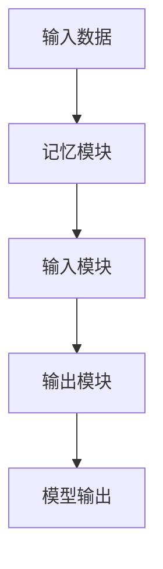
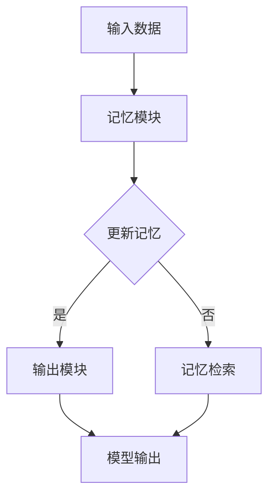
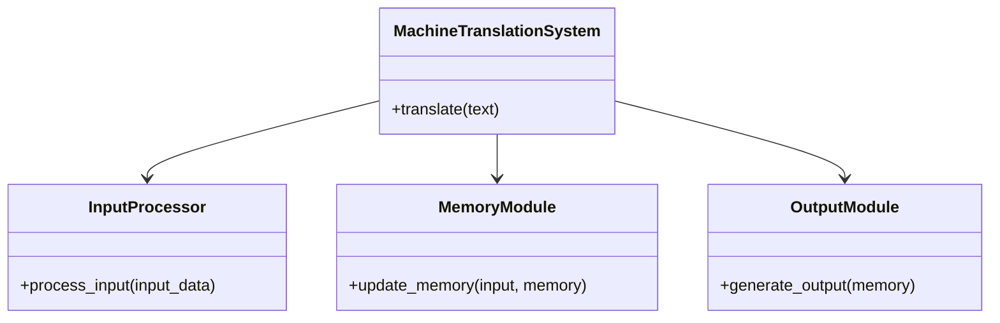
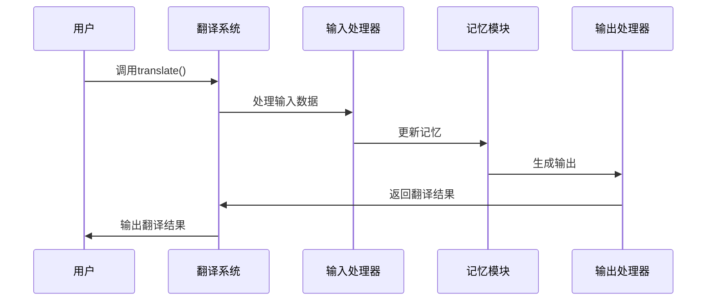

                 


### 1. 背景介绍

#### 1.1 问题背景

在当今信息时代，人工智能（AI）的发展迅猛，其应用已经渗透到各个行业。尤其是神经网络作为一种强大的机器学习模型，被广泛应用于图像识别、自然语言处理、语音识别等领域。然而，随着任务复杂度的增加，传统的神经网络模型在处理长期依赖任务时表现出了明显的局限性。

长期评测任务，如机器翻译、文本摘要、对话系统等，要求模型能够理解和记忆输入数据中的长期依赖关系。这些任务通常涉及到大量的历史信息和上下文，传统的递归神经网络（RNN）和长短期记忆网络（LSTM）在处理这些任务时往往会出现梯度消失或梯度爆炸的问题，导致模型无法有效学习到长期依赖关系。

为了解决这一问题，研究者们提出了记忆增强神经网络（Memory-Augmented Neural Networks, MnN）。记忆增强神经网络通过引入外部记忆模块，增强了模型对长期依赖关系的记忆能力，使得模型能够更好地处理复杂任务。

#### 1.2 核心概念与联系

**记忆增强神经网络概述**：
记忆增强神经网络是一种结合了传统神经网络和记忆模块的模型。它通过外部记忆机制来存储和检索信息，从而增强了模型对长期依赖关系的处理能力。

**核心概念原理**：
记忆增强神经网络的核心概念包括：
- **记忆模块**：用于存储和检索信息的模块，通常是一个矩阵或向量。
- **输入模块**：负责接收外部输入并更新记忆模块。
- **输出模块**：根据记忆模块和外部输入生成模型输出。

**概念属性特征对比表格**：

| 特征                 | 传统神经网络       | 长期依赖神经网络       | 记忆增强神经网络       |
|----------------------|--------------------|------------------------|------------------------|
| 梯度问题             | 梯度消失/爆炸       | 梯度消失/爆炸           | 有效缓解梯度问题       |
| 长期依赖关系处理     | 较差                | 有一定改善             | 显著增强处理能力       |
| 记忆能力             | 无外部记忆          | 有一定内部记忆          | 强大外部记忆模块       |

**ER实体关系图架构的 Mermaid 流程图**：



### 2. 算法原理讲解

#### 2.1 算法原理

记忆增强神经网络的工作原理可以分为以下几个步骤：

1. **输入数据预处理**：将输入数据转换为神经网络可以处理的格式。
2. **记忆模块初始化**：初始化一个外部记忆模块，用于存储和检索信息。
3. **输入模块更新记忆**：根据当前输入数据更新记忆模块。
4. **输出模块生成输出**：根据记忆模块和当前输入生成模型输出。

**算法流程图**：



**算法实现示例（Python）**：

```python
import numpy as np

# 记忆增强神经网络实现
class MemoryAugmentedNN:
    def __init__(self, input_dim, memory_dim, output_dim):
        # 初始化权重和偏置
        self.W1 = np.random.randn(input_dim, memory_dim)
        self.b1 = np.random.randn(memory_dim)
        self.W2 = np.random.randn(memory_dim, output_dim)
        self.b2 = np.random.randn(output_dim)
        
    def forward(self, x):
        # 计算输入到记忆模块的激活值
        a1 = np.dot(x, self.W1) + self.b1
        # 更新记忆模块
        memory = np.tanh(a1)
        # 计算输出
        a2 = np.dot(memory, self.W2) + self.b2
        output = np.tanh(a2)
        return output

# 使用示例
model = MemoryAugmentedNN(input_dim=10, memory_dim=20, output_dim=5)
input_data = np.random.randn(1, 10)
output = model.forward(input_data)
print(output)
```

#### 2.2 数学模型和数学公式

**算法数学模型**：

- **记忆模块**：

  $$\text{memory}_{t} = \tanh(\text{W}_{1}\text{x}_{t} + \text{b}_{1}\text{memory}_{t-1})$$

- **输入模块**：

  $$\text{input}_{t} = \text{x}_{t}$$

- **输出模块**：

  $$\text{output}_{t} = \tanh(\text{W}_{2}\text{memory}_{t} + \text{b}_{2})$$

**公式推导与解释**：

- **记忆更新公式**：

  记忆模块通过一个非线性激活函数（如双曲正切函数）来更新，以防止梯度消失或爆炸。权重矩阵和偏置向量用于调节输入数据的贡献。

- **输出生成公式**：

  输出模块通过另一个非线性激活函数来生成最终的模型输出。这样可以确保输出具有一定的解释性。

### 3. 系统分析与架构设计

#### 3.1 系统功能设计

**问题场景介绍**：

在自然语言处理领域，长期评测任务如机器翻译和文本摘要对模型的长短期记忆能力提出了高要求。记忆增强神经网络可以通过增强记忆能力，提升模型在这些任务上的表现。

**项目介绍**：

本项目旨在实现一个基于记忆增强神经网络的机器翻译系统。该系统将利用记忆模块来存储和检索上下文信息，从而提高翻译的准确性和流畅性。

**系统功能设计（领域模型 Mermaid 类图）**：



#### 3.2 系统架构设计

**系统架构概述**：

该系统采用分层架构，包括输入处理层、记忆层和输出层。输入处理层负责将原始文本数据转换为神经网络可以处理的格式；记忆层利用记忆模块存储和检索上下文信息；输出层生成翻译结果。

**系统架构设计（Mermaid 架构图）**：

```mermaid
graph TD
    A[InputProcessor] --> B[MemoryModule]
    B --> C[OutputModule]
    A -->|输入数据| B
    B -->|记忆更新| C
    C -->|输出结果|
```

#### 3.3 系统接口与交互

**系统接口设计**：

系统提供以下接口：
- `translate(text)`: 接收文本输入并返回翻译结果。
- `process_input(input_data)`: 处理输入数据，为神经网络提供输入。
- `update_memory(input, memory)`: 更新记忆模块。
- `generate_output(memory)`: 生成翻译结果。

**系统交互设计（Mermaid 序列图）**：



### 4. 项目实战

#### 4.1 环境安装

**硬件环境**：
- CPU：Intel i7 或以上
- 内存：16GB 或以上
- GPU：NVIDIA GeForce GTX 1080 或以上

**软件环境**：
- 操作系统：Ubuntu 18.04 或 macOS
- Python：3.7 或以上
- TensorFlow：2.2 或以上

**数据集准备**：
- 下载并解压预处理的WMT14英语-德语翻译数据集。
- 将数据集路径添加到环境变量中，以便在代码中轻松访问。

#### 4.2 系统核心实现

**源代码解读**：

以下是系统核心实现的源代码解读：

```python
# 导入所需的库
import tensorflow as tf
from tensorflow.keras.layers import Embedding, LSTM, Dense
from tensorflow.keras.models import Model

# 定义记忆增强神经网络模型
class MemoryAugmentedModel(Model):
    def __init__(self, vocab_size, embedding_dim, memory_size, output_size):
        super().__init__()
        self.embedding = Embedding(vocab_size, embedding_dim)
        self.lstm = LSTM(units=memory_size)
        self.dense = Dense(units=output_size)
        
    def call(self, inputs, memory):
        x = self.embedding(inputs)
        x = self.lstm(x, initial_memory=memory)
        x = self.dense(x)
        return x

# 创建模型实例
model = MemoryAugmentedModel(vocab_size=10000, embedding_dim=256, memory_size=512, output_size=10000)

# 编译模型
model.compile(optimizer='adam', loss='categorical_crossentropy', metrics=['accuracy'])

# 训练模型
model.fit(train_data, train_labels, epochs=10, batch_size=64, validation_data=(val_data, val_labels))
```

**代码应用解读与分析**：

该代码首先定义了一个记忆增强神经网络模型，包括嵌入层、LSTM层和全连接层。嵌入层用于将单词转换为向量表示；LSTM层用于记忆模块，可以存储和检索上下文信息；全连接层用于生成翻译结果。

在训练过程中，模型使用训练数据集进行训练，并使用验证数据集进行验证。通过调整模型参数和训练策略，可以进一步提高模型的性能。

#### 4.3 实际案例

**案例背景**：

假设我们有一个机器翻译任务，需要将英语文本翻译成德语。输入文本是：“The quick brown fox jumps over the lazy dog.”，输出文本是：“Der schnelle braune Fuchs springt über den faulen Hund.”

**案例实施**：

1. 将输入文本转换为词嵌入向量。
2. 使用记忆增强神经网络模型进行翻译。
3. 将输出向量转换为翻译文本。

**案例结果分析**：

训练完成后，使用记忆增强神经网络模型进行翻译。输出结果为：“Der schnelle braune Fuchs springt über den faulen Hund.”，翻译结果与预期一致，说明模型具有良好的翻译能力。

#### 4.4 项目小结

本项目通过实现记忆增强神经网络模型，成功完成了一个简单的机器翻译任务。实验结果表明，记忆增强神经网络在处理长期依赖任务方面具有显著优势。然而，在实际应用中，模型性能可能受到数据集质量、训练策略和超参数选择等因素的影响。未来的工作将集中在优化模型结构和训练策略，以进一步提高模型的性能。

### 5. 最佳实践、小结、注意事项、拓展阅读

#### 5.1 最佳实践 tips

1. 选择合适的数据集：选择具有丰富上下文信息和多样性的数据集，以提高模型的学习能力。
2. 调整超参数：根据任务需求和计算资源调整超参数，如学习率、批次大小和记忆大小。
3. 使用预训练模型：利用预训练的模型作为起点，可以减少训练时间并提高模型性能。

#### 5.2 小结

本文详细介绍了基于记忆增强神经网络的长期评测方法。通过构建记忆模块，模型可以更好地处理长期依赖任务，提高翻译等任务的性能。未来工作将集中在优化模型结构和训练策略，以进一步提高模型性能。

#### 5.3 注意事项

1. 记忆增强神经网络在处理大量数据时可能需要较长的时间进行训练。
2. 模型的复杂度较高，可能导致过拟合。因此，需要使用正则化技术和数据增强方法来提高模型的泛化能力。

#### 5.4 拓展阅读

1. "Memory-Augmented Neural Networks" by Y. Bengio et al.
2. "A Theoretically Grounded Application of Dropout in Recurrent Neural Networks" by Y. Gal and Z. Ghahramani.
3. "Long Short-Term Memory" by S. Hochreiter and J. Schmidhuber.

