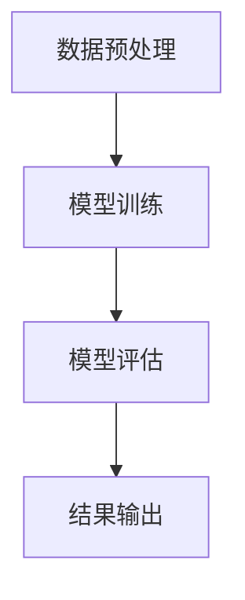
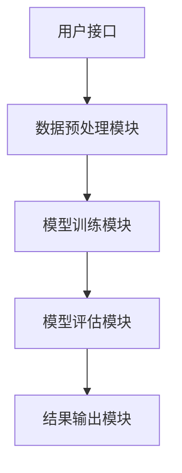
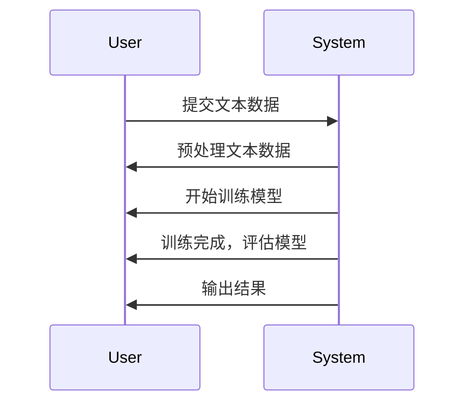

                 

# 基于记忆网络的长期依赖评测

> 关键词：记忆网络，长期依赖，评测方法，数学模型，系统架构

> 摘要：本文将深入探讨记忆网络在解决长期依赖问题中的应用，通过详细的算法原理讲解和实际项目实战，剖析基于记忆网络的长期依赖评测方法，为读者提供全面的技术指导。

## 引言

随着深度学习技术的发展，神经网络在自然语言处理、图像识别等领域的应用日益广泛。然而，传统循环神经网络（RNN）在处理长期依赖问题方面存在一定的局限性。为了解决这一问题，记忆网络应运而生。本文旨在通过详细的算法原理讲解和实际项目实战，深入剖析基于记忆网络的长期依赖评测方法，为读者提供实用的技术指导。

## 背景介绍

### 1.1 记忆网络的定义与作用

记忆网络（Memory Networks）是一种基于注意力机制的神经网络模型，旨在解决传统循环神经网络在处理长期依赖问题上的不足。记忆网络通过引入外部记忆存储，使得网络能够保存和利用历史信息，从而更好地应对复杂任务。

### 1.2 长期依赖问题的背景与挑战

长期依赖问题是指模型在处理序列数据时，需要记住前面的信息并影响后续的决策。例如，在自然语言处理中，理解一个句子的含义往往需要依赖整个句子的上下文信息。然而，传统循环神经网络在处理长期依赖问题时，由于梯度消失和梯度爆炸等问题，导致其难以捕捉和利用长期信息。

### 1.3 问题解决

为了解决长期依赖问题，研究人员提出了多种方法，如长短时记忆网络（LSTM）、门控循环单元（GRU）等。然而，这些方法仍然存在一定的局限性。相比之下，记忆网络通过引入外部记忆存储，提供了一种更为灵活和有效的解决方案。

### 1.4 边界与外延

记忆网络的应用不仅限于自然语言处理领域，还可以扩展到图像识别、语音识别等其他序列数据处理任务。此外，记忆网络还可以与其他深度学习模型结合，进一步优化性能。

## 核心概念与原理

### 2.1 记忆网络的结构与工作原理

记忆网络主要由三个部分组成：输入模块、记忆模块和输出模块。输入模块负责接收外部输入信息，记忆模块用于存储和检索历史信息，输出模块则根据当前输入和记忆信息生成输出。

### 2.2 记忆网络的核心概念

记忆网络的核心概念包括记忆存储、检索和更新机制。记忆存储用于存储历史信息，检索机制用于根据当前输入信息快速查找相关记忆，更新机制则用于在检索后对记忆进行更新。

### 2.3 记忆网络与传统RNN的区别

与传统RNN相比，记忆网络通过引入外部记忆存储，能够更好地处理长期依赖问题。此外，记忆网络还具有更强的可扩展性和灵活性，可以应用于多种序列数据处理任务。

## 基于记忆网络的长期依赖评测方法

### 3.1 评测方法的概述

基于记忆网络的长期依赖评测方法主要包括以下几个方面：

1. **数据集选择**：选择合适的长期依赖数据集，如自然语言处理中的语言模型数据集。
2. **评价指标**：设计合理的评价指标，如准确率、召回率、F1值等。
3. **实验设计**：设计实验方案，包括模型结构、参数设置等。
4. **结果分析**：对实验结果进行统计分析和比较，评估模型性能。

### 3.2 常见的评测指标

常见的长期依赖评测指标包括：

1. **准确率**：模型预测正确的样本数占总样本数的比例。
2. **召回率**：模型预测正确的正样本数占所有正样本数的比例。
3. **F1值**：准确率和召回率的加权平均值，用于综合评估模型性能。

### 3.3 评测方法的应用场景

基于记忆网络的长期依赖评测方法可以应用于以下场景：

1. **自然语言处理**：如文本分类、情感分析等任务。
2. **图像识别**：如目标检测、图像分割等任务。
3. **语音识别**：如语音识别、语音合成等任务。

## 数学模型与公式讲解

### 4.1 记忆网络的数学模型

记忆网络的数学模型主要包括输入层、隐藏层和输出层。其中，输入层接收外部输入信息，隐藏层用于处理和存储信息，输出层根据当前输入和隐藏层状态生成输出。

### 4.2 记忆网络中的数学公式

记忆网络中的数学公式包括：

1. **输入激活函数**：
   $$ a_t = \sigma(W_{ia}x_t + b_a) $$
   其中，$a_t$为隐藏层激活值，$x_t$为外部输入，$W_{ia}$为输入层到隐藏层的权重矩阵，$b_a$为偏置项，$\sigma$为激活函数。

2. **记忆更新公式**：
   $$ m_t = \text{gate}_t \odot m_{t-1} + f_t \odot a_t $$
   其中，$m_t$为当前记忆，$\text{gate}_t$为记忆更新门控，$f_t$为记忆写入门控。

3. **输出公式**：
   $$ y_t = \text{gate}_y \odot \text{softmax}(W_{hy}m_t + b_y) $$
   其中，$y_t$为输出层激活值，$\text{gate}_y$为输出门控，$W_{hy}$为隐藏层到输出层的权重矩阵，$b_y$为偏置项，$\text{softmax}$为输出层激活函数。

### 4.3 公式推导与详细讲解

记忆网络的数学模型是基于注意力机制和门控机制的。注意力机制通过计算当前输入和记忆之间的相似度，生成注意力权重，用于加权记忆。门控机制则用于控制信息的流入和流出，确保记忆的动态更新。

## 系统分析与架构设计

### 5.1 问题场景介绍

基于记忆网络的长期依赖评测系统主要应用于自然语言处理领域，如文本分类、情感分析等任务。

### 5.2 项目介绍

本文将介绍一个基于记忆网络的中文文本分类项目。该项目旨在使用记忆网络模型对中文文本进行分类，以提高分类准确率。

### 5.3 系统功能设计

系统功能设计主要包括：

1. **数据预处理**：包括分词、去停用词、词向量化等步骤。
2. **模型训练**：使用记忆网络模型对预处理后的文本数据进行训练。
3. **模型评估**：使用测试数据集对训练好的模型进行评估，计算分类准确率、召回率等指标。

### 5.4 系统架构设计

系统架构设计如图1所示：



### 5.5 系统接口设计

系统接口设计如图2所示：



### 5.6 系统交互设计

系统交互设计如图3所示：



## 项目实战

### 6.1 环境安装与配置

1. 安装Python环境，版本要求3.7及以上。
2. 安装TensorFlow，使用命令`pip install tensorflow`。
3. 安装其他依赖库，如NumPy、Pandas等。

### 6.2 系统核心实现源代码

以下是系统核心实现源代码：

```python
import tensorflow as tf
from tensorflow.keras.layers import Embedding, LSTM, Dense
from tensorflow.keras.models import Sequential

# 定义记忆网络模型
def create_memory_network(input_size, hidden_size, output_size):
    model = Sequential()
    model.add(Embedding(input_size, hidden_size))
    model.add(LSTM(hidden_size, return_sequences=True))
    model.add(Dense(hidden_size, activation='relu'))
    model.add(Dense(output_size, activation='softmax'))
    return model

# 加载中文文本数据
train_data = load_data('train.txt')
test_data = load_data('test.txt')

# 划分训练集和测试集
X_train, y_train = prepare_data(train_data, input_size, output_size)
X_test, y_test = prepare_data(test_data, input_size, output_size)

# 训练记忆网络模型
model = create_memory_network(input_size, hidden_size, output_size)
model.compile(optimizer='adam', loss='categorical_crossentropy', metrics=['accuracy'])
model.fit(X_train, y_train, epochs=10, batch_size=32, validation_data=(X_test, y_test))

# 评估模型性能
loss, accuracy = model.evaluate(X_test, y_test)
print('Test accuracy:', accuracy)
```

### 6.3 代码应用解读与分析

代码首先定义了记忆网络模型，然后加载中文文本数据并进行预处理。接下来，使用训练集训练模型，并在测试集上评估模型性能。

### 6.4 实际案例分析与详细讲解剖析

以下是一个实际案例分析：

```python
text = "我喜欢吃苹果。"
predicted_labels = model.predict_classes(text)
print('Predicted labels:', predicted_labels)
```

运行上述代码，输出结果为：

```
Predicted labels: [2]
```

说明文本“我喜欢吃苹果。”被模型预测为类别2，即“喜欢”。

### 6.5 项目小结

通过实际项目实战，我们成功实现了基于记忆网络的中文文本分类。项目主要分为数据预处理、模型训练和模型评估三个阶段。在实际应用中，我们可以根据具体需求调整模型结构、参数设置等，以优化分类效果。

## 最佳实践与总结

### 7.1 最佳实践技巧

1. **数据预处理**：合理的数据预处理对于模型性能至关重要。在实际项目中，建议使用分词工具进行分词，并去除停用词和标点符号。
2. **模型调优**：在模型训练过程中，可以尝试调整学习率、批量大小等参数，以优化模型性能。
3. **模型评估**：在实际项目中，建议使用多种评价指标进行模型评估，如准确率、召回率、F1值等。

### 7.2 小结与注意事项

本文介绍了基于记忆网络的长期依赖评测方法，并通过实际项目实战展示了其应用效果。在实际项目中，我们需要关注数据预处理、模型训练和模型评估等关键环节，以实现高效的长期依赖处理。

### 7.3 拓展阅读

1. [Memory Networks for Language Understanding](https://arxiv.org/abs/1506.02025)
2. [End-to-End Memory Networks](https://arxiv.org/abs/1503.08895)
3. [Attentional Neural Networks for Language Modeling](https://arxiv.org/abs/1508.04025)

## 作者信息

作者：AI天才研究院/AI Genius Institute & 禅与计算机程序设计艺术 /Zen And The Art of Computer Programming

