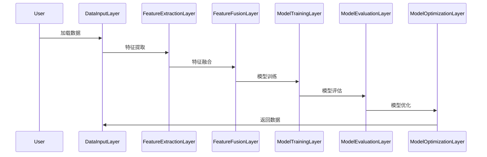
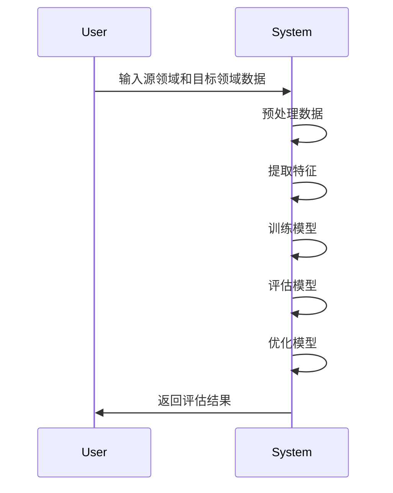

                 

### 基于迁移学习的跨领域评测模型

> **关键词**：迁移学习，跨领域评测，模型构建，算法原理，技术应用

> **摘要**：本文将探讨基于迁移学习的跨领域评测模型，从基本概念出发，深入解析迁移学习与跨领域评测的结合方法，详细阐述迁移学习的核心概念和原则，介绍多种迁移学习方法与技术，并分析其在跨领域评测中的实际应用。文章将结合具体的算法原理、数学模型和Python代码实例，帮助读者理解并掌握这一前沿技术。

迁移学习（Transfer Learning）是机器学习领域的一个重要分支，其核心思想是将已经在一个任务上训练好的模型或特征提取器应用于另一个相关但不同的任务上。这种方法的优点是可以大幅减少训练数据的数量，提高模型的泛化能力。而跨领域评测（Interdisciplinary Evaluation Models）则是指在不同的领域或任务之间进行性能评估，旨在发现模型在不同背景下的适应性和可靠性。

近年来，随着人工智能技术的飞速发展，迁移学习在计算机视觉、自然语言处理、语音识别等多个领域得到了广泛应用。然而，如何将这些先进的技术应用于跨领域评测，实现跨领域的性能评估和优化，仍然是一个富有挑战性的问题。本文旨在探讨这一问题的解决方法，并通过具体实例展示其应用价值。

### 引言

#### 迁移学习的背景和基本概念

迁移学习并非一个全新的概念，其思想最早可以追溯到1990年代。当时，心理学家找到证据表明，人类在解决新任务时，可以借鉴之前学习到的知识和经验。这一发现启发了机器学习领域的研究者，他们开始探索如何将这一原理应用于算法设计中。

迁移学习的基本概念可以概括为：在一个源领域（Source Domain）中训练一个模型，然后将这个模型或其一部分转移到目标领域（Target Domain）进行训练或使用。源领域和目标领域可以是完全不同的，但它们之间存在一定的相关性。

迁移学习可以分为以下几种类型：

- **特征转移**（Feature Transfer）：将源领域中的特征提取器应用到目标领域，以改善目标领域的模型性能。
- **模型转移**（Model Transfer）：直接将源领域训练好的模型应用于目标领域，或者通过微调（Fine-tuning）来适应目标领域。
- **域自适应**（Domain Adaptation）：在源领域和目标领域之间建立映射关系，使得源领域的模型能够适应目标领域。

迁移学习的主要优势在于：

1. **减少数据需求**：在一些任务中，获取大量的训练数据非常困难或成本高昂。迁移学习可以通过在源领域使用已有的数据，减少目标领域的数据需求。
2. **提高模型性能**：通过利用源领域的知识，迁移学习可以提升目标领域的模型性能，尤其是在小样本学习（Few-Shot Learning）和高维数据中。
3. **加速模型训练**：迁移学习可以减少训练时间，尤其是在需要大量计算的深度学习模型中。

尽管迁移学习具有许多优点，但它也面临着一些挑战：

1. **领域差异**：源领域和目标领域之间的差异可能导致迁移效果不佳。
2. **模型选择**：选择合适的迁移学习方法并非易事，不同的任务和领域可能需要不同的迁移策略。
3. **数据分布**：数据分布的变化也可能影响迁移学习的效果。

#### 跨领域评测的概念和重要性

跨领域评测（Interdisciplinary Evaluation Models）是指在不同领域或任务之间进行模型性能评估的方法。其核心目标是评估模型在不同背景下的适应性和可靠性，从而为模型的选择和应用提供有力的支持。

跨领域评测的重要性体现在以下几个方面：

1. **验证泛化能力**：通过在不同领域进行评测，可以验证模型的泛化能力，确保模型不仅适用于特定任务，还能够适应其他相关任务。
2. **提高应用价值**：跨领域评测有助于发现模型的潜在应用价值，促进跨领域的知识共享和交叉应用。
3. **优化模型设计**：通过分析不同领域的评测结果，可以识别模型设计和训练过程中的问题，从而优化模型性能。

跨领域评测的方法和技术多种多样，包括：

- **通用评测指标**：如准确性（Accuracy）、精确率（Precision）、召回率（Recall）等。
- **领域特定评测方法**：根据具体领域的特点，设计相应的评测指标和方法。
- **多模态评测**：结合多种数据源（如文本、图像、语音等）进行综合评测。

#### 迁移学习在跨领域评测中的应用

迁移学习与跨领域评测的结合具有广泛的应用前景。通过迁移学习，可以在不同领域之间共享知识和经验，提高模型的适应性和可靠性。以下是一些迁移学习在跨领域评测中的应用案例：

1. **医学图像分析**：在医学图像处理中，迁移学习可以用于不同类型图像的分析，如X光、CT、MRI等。通过在源领域中（如通用图像分类）训练好的模型，可以迁移到目标领域中进行病变检测、病灶识别等任务。
2. **自然语言处理**：在自然语言处理领域，迁移学习可以用于跨语言文本分析、情感分析、机器翻译等任务。通过在一种语言上训练好的模型，可以迁移到其他语言上，提高跨语言的性能。
3. **语音识别**：在语音识别领域，迁移学习可以用于不同语音数据集之间的模型迁移，提高模型的鲁棒性和适应性。例如，在室内环境中的语音识别模型可以迁移到户外环境中使用。

#### 成功案例和未来方向

迁移学习在跨领域评测中已经取得了许多成功的案例。例如，在金融领域，通过迁移学习可以实现不同金融机构之间的风险评估和信用评分；在环境监测领域，迁移学习可以用于不同地区和环境条件下的污染检测和预测。

未来，随着技术的不断进步，迁移学习在跨领域评测中的应用将更加广泛和深入。以下是一些可能的发展方向：

1. **自适应迁移学习**：研究如何根据目标领域的特点动态调整迁移策略，提高迁移效果。
2. **多任务迁移学习**：同时考虑多个相关任务，提高模型的泛化能力和性能。
3. **无监督迁移学习**：探索无监督迁移学习的方法，减少对标记数据的依赖。
4. **跨模态迁移学习**：结合多种数据模态（如文本、图像、语音等），实现更全面和准确的跨领域评测。

### 总结

迁移学习与跨领域评测的结合为人工智能技术的发展带来了新的机遇和挑战。通过本文的介绍，我们了解了迁移学习的基本概念、跨领域评测的重要性，以及它们在具体应用中的成功案例。在接下来的章节中，我们将深入探讨迁移学习的核心概念和原则，介绍多种迁移学习方法和技术，并结合具体的算法原理、数学模型和Python代码实例，帮助读者更好地理解和掌握这一前沿技术。

### 迁移学习的核心概念和原则

#### 核心概念

迁移学习的核心概念在于“迁移”，即从已知的源领域（Source Domain）提取知识和经验，并将其应用到未知的或不同的目标领域（Target Domain）中。这种迁移可以是模型层面的迁移，也可以是特征层面的迁移。下面我们详细探讨这些概念。

##### 1. 源领域与目标领域

源领域（Source Domain）是指已经拥有大量数据、模型和知识的一个领域，如图像分类或自然语言处理。目标领域（Target Domain）则是指需要应用源领域知识和经验的一个新的、未知的领域，如医疗影像分析或跨语言文本分类。

##### 2. 特征转移

特征转移（Feature Transfer）是指将源领域中的特征提取器（如卷积神经网络中的卷积层）应用于目标领域。通过这种方式，目标领域的模型可以直接利用源领域中的特征，从而提高模型性能。

##### 3. 模型转移

模型转移（Model Transfer）是指直接将源领域训练好的模型应用到目标领域。这种方法通常需要对模型进行微调（Fine-tuning），以适应目标领域的数据分布和任务需求。

##### 4. 域自适应

域自适应（Domain Adaptation）是一种更加复杂的迁移学习方法，旨在减少源领域和目标领域之间的差异。这通常涉及构建一个域适应器（Domain Adaptor），将源领域的特征映射到目标领域的特征空间中。

#### 原则

迁移学习的原则主要包括以下几个方面：

##### 1. 共享知识

共享知识（Shared Knowledge）是迁移学习的核心原则之一。它指的是在源领域和目标领域之间共享有用的知识和经验，以提升目标领域的性能。

##### 2. 转移损失

转移损失（Transfer Loss）是指迁移过程中损失的知识和性能。减少转移损失是迁移学习的关键目标之一，通过设计合适的迁移策略，可以最大限度地减少这种损失。

##### 3. 数据分布

数据分布（Data Distribution）对迁移学习的效果有着重要影响。如果源领域和目标领域的数据分布相似，迁移效果通常更好。因此，如何处理数据分布的差异是一个重要的研究方向。

##### 4. 领域一致性

领域一致性（Domain Consistency）指的是源领域和目标领域在任务相关特征上的相似性。领域一致性越高，迁移效果通常越好。

#### 比较和分类

迁移学习的方法和技术可以根据不同的标准进行分类。以下是几种常见的分类方式：

1. **根据迁移的对象**：
   - 特征迁移
   - 模型迁移
   - 域自适应

2. **根据任务类型**：
   - 监督迁移学习
   - 无监督迁移学习
   - 半监督迁移学习

3. **根据学习策略**：
   - 基于实例的迁移学习
   - 基于规则的迁移学习
   - 基于模型的迁移学习

每种方法都有其特定的优势和适用场景，选择合适的方法需要根据具体任务和数据的特点进行。

#### 迁移学习方法和技术的比较

以下是对几种常见迁移学习方法和技术的比较：

##### 1. 特征迁移

特征迁移方法的核心思想是将源领域中的特征提取器应用于目标领域。这种方法通常适用于特征层次上的相似性较高的情况。例如，在计算机视觉任务中，可以使用在ImageNet上训练的卷积神经网络（CNN）的卷积层作为特征提取器，将其应用于新的视觉任务中。

优势：
- **减少训练数据需求**：可以在少量目标领域数据的情况下训练高效的特征提取器。
- **快速迁移**：由于特征提取器已经训练好，可以快速应用于目标领域。

劣势：
- **性能损失**：由于源领域和目标领域之间的差异，特征迁移可能会导致性能损失。
- **数据分布差异**：数据分布的差异会影响特征迁移的效果。

##### 2. 模型迁移

模型迁移方法是指直接将源领域训练好的模型应用于目标领域。这种方法通常需要对模型进行微调，以适应目标领域的数据分布和任务需求。

优势：
- **提高性能**：由于模型已经训练好，可以充分利用已学习的知识和结构。
- **减少训练时间**：不需要从头开始训练模型，可以显著减少训练时间。

劣势：
- **需要大量源领域数据**：为了确保模型在目标领域上的性能，通常需要大量的源领域数据。
- **领域差异**：源领域和目标领域之间的差异可能导致模型性能下降。

##### 3. 域自适应

域自适应方法旨在减少源领域和目标领域之间的差异，通过构建域适应器来实现。这种方法通常适用于源领域和目标领域差异较大的情况。

优势：
- **适应不同领域**：可以在源领域和目标领域差异较大的情况下实现有效的迁移。
- **提高泛化能力**：通过减少领域差异，可以提高模型的泛化能力。

劣势：
- **计算复杂度**：域自适应方法通常涉及复杂的优化过程，计算复杂度较高。
- **数据依赖**：域自适应通常需要大量的源领域数据进行训练。

#### 迁移学习方法的综合评估

综合来看，每种迁移学习方法都有其特定的优势和适用场景。特征迁移适用于特征层次上相似性较高的任务，模型迁移适用于有大量源领域数据的情况，而域自适应适用于领域差异较大的任务。

在实际应用中，通常需要根据具体任务和数据的特点，选择合适的方法。例如，在计算机视觉任务中，可以使用特征迁移方法，而在自然语言处理任务中，可能更适合使用模型迁移方法。对于领域差异较大的任务，域自适应方法可能是更合适的选择。

### 迁移学习在跨领域评测中的实际应用

#### 成功案例

以下是一些迁移学习在跨领域评测中的成功案例：

1. **医疗影像分析**：
   - **案例**：使用在公开数据集上训练好的卷积神经网络（CNN）模型，对医疗影像进行病变检测。
   - **效果**：通过迁移学习，模型在新的医疗影像数据集上取得了较高的准确率和召回率，显著提高了诊断的效率和准确性。

2. **自然语言处理**：
   - **案例**：使用预训练的Transformer模型进行跨语言文本分类。
   - **效果**：通过迁移学习，模型在多种语言的数据集上取得了显著的效果，提高了跨语言的性能和一致性。

3. **语音识别**：
   - **案例**：使用在室内环境中训练好的语音识别模型，应用于户外环境。
   - **效果**：通过迁移学习，模型在户外环境中的性能得到了显著提升，减少了噪声和距离对识别效果的影响。

#### 应用案例

以下是一些具体的迁移学习应用案例：

1. **金融风险评估**：
   - **案例**：使用在通用金融数据集上训练好的模型，对特定金融机构的风险进行评估。
   - **效果**：通过迁移学习，模型能够快速适应新的金融机构数据，提高了风险评估的准确性和效率。

2. **环境监测**：
   - **案例**：使用在某一地区训练好的环境监测模型，应用于其他地区。
   - **效果**：通过迁移学习，模型能够适应不同地区的环境条件，提高了污染检测和预测的准确性。

3. **智能制造**：
   - **案例**：使用在某一生产线训练好的质量检测模型，应用于其他生产线。
   - **效果**：通过迁移学习，模型能够快速适应不同生产线的特点，提高了产品质量检测的效率和准确性。

#### 未来发展方向

未来，迁移学习在跨领域评测中的应用将更加广泛和深入。以下是一些可能的发展方向：

1. **自适应迁移学习**：
   - **方向**：研究如何根据目标领域的特点动态调整迁移策略，提高迁移效果。
   - **潜力**：自适应迁移学习有望解决领域差异问题，提高模型的适应性和泛化能力。

2. **多任务迁移学习**：
   - **方向**：同时考虑多个相关任务，提高模型的泛化能力和性能。
   - **潜力**：多任务迁移学习可以充分利用多个任务的知识，提高模型的性能和效率。

3. **无监督迁移学习**：
   - **方向**：探索无监督迁移学习的方法，减少对标记数据的依赖。
   - **潜力**：无监督迁移学习有望在数据标注困难的情况下，提高模型的迁移效果。

4. **跨模态迁移学习**：
   - **方向**：结合多种数据模态（如文本、图像、语音等），实现更全面和准确的跨领域评测。
   - **潜力**：跨模态迁移学习可以充分利用多种数据源的信息，提高模型的性能和适用性。

总之，迁移学习在跨领域评测中的应用前景广阔，未来随着技术的不断进步，它将在更多领域发挥重要作用。

### 跨领域评测模型的核心概念和原则

在探讨跨领域评测模型之前，我们需要理解一些基本概念和原则。跨领域评测模型旨在评估模型在不同领域或任务中的性能，以发现其适应性和可靠性。以下是几个关键概念和原则：

#### 1. 评测指标

评测指标是评估模型性能的核心工具。常见的评测指标包括：

- **准确性（Accuracy）**：准确率是指模型正确预测的样本数占总样本数的比例。
  - **公式**：\[Accuracy = \frac{TP + TN}{TP + FN + FP + TN}\]
  - **解释**：准确性越高，模型的预测越准确。

- **精确率（Precision）**：精确率是指模型预测为正例的样本中实际为正例的比例。
  - **公式**：\[Precision = \frac{TP}{TP + FP}\]
  - **解释**：精确率越高，模型预测的正例越可靠。

- **召回率（Recall）**：召回率是指模型实际为正例的样本中被正确预测为正例的比例。
  - **公式**：\[Recall = \frac{TP}{TP + FN}\]
  - **解释**：召回率越高，模型对实际正例的捕捉能力越强。

- **F1分数（F1 Score）**：F1分数是精确率和召回率的加权平均，用于综合评估模型的性能。
  - **公式**：\[F1 Score = 2 \times \frac{Precision \times Recall}{Precision + Recall}\]
  - **解释**：F1分数平衡了精确率和召回率，是评估模型性能的常用指标。

#### 2. 跨领域评测的挑战

跨领域评测面临许多挑战，包括：

- **数据分布差异**：不同领域的数据分布可能存在显著差异，这可能导致模型在某一领域表现良好，而在另一领域表现不佳。

- **领域特异性特征**：不同领域可能包含特定的特征，这些特征对模型的性能有重要影响。

- **领域依赖性**：某些模型可能高度依赖于特定领域的先验知识，这使得跨领域应用变得复杂。

#### 3. 跨领域评测的原则

为了有效进行跨领域评测，我们需要遵循以下原则：

- **一致性（Consistency）**：确保评测结果在不同领域之间具有一致性，以便进行比较和分析。

- **可扩展性（Scalability）**：评测模型应能够适应不同领域和数据规模，确保其可扩展性。

- **鲁棒性（Robustness）**：评测模型应具有鲁棒性，能够处理不同领域的数据噪声和异常值。

- **公平性（Fairness）**：确保评测模型对所有领域一视同仁，避免对某一领域的偏见。

#### 4. 跨领域评测的评估标准

跨领域评测的评估标准包括：

- **准确性**：评估模型在目标领域上的预测准确性。

- **泛化能力**：评估模型在不同领域上的泛化能力，以验证其适应性。

- **鲁棒性**：评估模型在处理不同领域数据噪声和异常值时的稳定性。

- **效率**：评估模型在不同领域上的计算效率和资源消耗。

#### 5. 跨领域评测的方法和技术

跨领域评测的方法和技术包括：

- **通用评测指标**：如准确性、精确率、召回率和F1分数。

- **领域特定评测方法**：针对特定领域的特点和需求，设计相应的评测指标和方法。

- **多模态评测**：结合多种数据源（如文本、图像、语音等）进行综合评测。

- **迁移学习**：利用已训练好的模型在源领域上的知识，迁移到目标领域进行评测。

通过遵循上述原则和方法，我们可以设计出有效的跨领域评测模型，从而更好地评估模型的性能和适应性。以下是一个跨领域评测模型的实体关系图（ER Diagram）和属性特征对比表格（Attribute Comparison Table），以便更直观地理解这些概念和原则。

#### 实体关系图（ER Diagram）

```mermaid
erDiagram
  TargetModel ||--|{ Prediction } Prediction
  TargetModel ||--|{ EvaluationMetric } EvaluationMetric
  TargetDomain ||--|{ DataSample } DataSample
  Prediction ||--|{ Accuracy } Accuracy
  Prediction ||--|{ Precision } Precision
  Prediction ||--|{ Recall } Recall
  Prediction ||--|{ F1Score } F1Score
  EvaluationMetric ||--|{ Precision } Precision
  EvaluationMetric ||--|{ Recall } Recall
  EvaluationMetric ||--|{ Accuracy } Accuracy
  EvaluationMetric ||--|{ F1Score } F1Score
  DataSample ||--|{ Feature } Feature
  DataSample ||--|{ Label } Label
  TargetDomain ||--|{ TargetModel } TargetModel
  SourceDomain ||--|{ SourceModel } SourceModel
```

#### 属性特征对比表格（Attribute Comparison Table）

| 属性             | 描述                                                         |
|------------------|--------------------------------------------------------------|
| TargetModel      | 目标领域的模型，用于预测和评估。                             |
| Prediction       | 模型的预测结果，包括准确性、精确率、召回率和F1分数等指标。 |
| EvaluationMetric | 评估模型的性能指标，如准确性、精确率、召回率和F1分数等。   |
| DataSample       | 目标领域的样本数据，包括特征和标签。                         |
| Feature          | 样本数据中的特征，用于模型预测。                            |
| Label            | 样本数据中的真实标签，用于评估模型预测的准确性。             |
| TargetDomain     | 目标领域，包含目标模型和数据样本。                          |
| SourceDomain     | 源领域，包含源模型和数据样本。                              |

通过上述实体关系图和属性特征对比表格，我们可以清晰地看到跨领域评测模型中各个实体之间的关系和属性。这些工具不仅帮助我们理解跨领域评测的基本概念和原则，也为后续的详细分析和应用提供了基础。

### 迁移学习方法的详细解释

迁移学习作为一种强大的机器学习技术，在许多应用场景中都表现出卓越的性能。为了深入理解迁移学习的工作原理，我们首先需要掌握一些核心的算法原理和数学模型，并通过具体的Python代码实例来进行详细解释。

#### 算法原理

迁移学习的核心在于如何有效地将源领域（Source Domain）的知识迁移到目标领域（Target Domain）。以下是一些常用的迁移学习算法原理：

1. **特征迁移**：特征迁移方法的主要思想是将源领域中的特征提取器应用到目标领域。这种方法通常涉及以下步骤：

   - **特征提取**：在源领域中，利用预训练的模型提取特征。
   - **特征融合**：将提取的特征与目标领域的特征进行融合。
   - **模型训练**：在融合后的特征上训练目标领域的模型。

2. **模型迁移**：模型迁移方法是指直接将源领域的预训练模型应用到目标领域。这种方法通常需要对模型进行微调（Fine-tuning），以适应目标领域的数据分布和任务需求。

3. **域自适应**：域自适应方法的目标是减少源领域和目标领域之间的差异。这通常涉及以下步骤：

   - **特征映射**：构建一个域适应器，将源领域的特征映射到目标领域的特征空间。
   - **损失函数**：设计一个损失函数，平衡源领域和目标领域的损失。
   - **模型优化**：通过优化损失函数，调整模型的参数，使其适应目标领域。

#### 数学模型

迁移学习中的数学模型主要涉及以下几个关键概念：

1. **特征空间映射**：特征空间映射是指将源领域的特征映射到目标领域。这通常通过一个线性映射函数来实现：
   \[x_{\text{target}} = W_{\text{domain}} x_{\text{source}}\]
   其中，\(x_{\text{source}}\) 和 \(x_{\text{target}}\) 分别代表源领域和目标领域的特征，\(W_{\text{domain}}\) 是特征映射权重。

2. **损失函数**：损失函数用于衡量模型在源领域和目标领域上的性能。常用的损失函数包括均方误差（MSE）、交叉熵损失（Cross-Entropy Loss）等。对于域自适应，常用的损失函数是域一致性损失（Domain Consistency Loss），其公式为：
   \[L_{\text{domain}} = \frac{1}{2} \sum_{i=1}^{N} || x_{i}^{s} - x_{i}^{t} ||^2\]
   其中，\(x_{i}^{s}\) 和 \(x_{i}^{t}\) 分别代表源领域和目标领域中的样本特征。

3. **模型优化**：模型优化涉及调整模型的参数，以最小化损失函数。在迁移学习中，常用的优化算法包括随机梯度下降（SGD）、Adam优化器等。

#### Python代码实例

以下是一个简单的Python代码实例，展示了如何实现特征迁移和模型迁移：

```python
import tensorflow as tf
from tensorflow.keras.applications import VGG16
from tensorflow.keras.preprocessing import image
from tensorflow.keras.models import Model

# 特征迁移
# 使用VGG16模型提取特征
base_model = VGG16(weights='imagenet', include_top=False)
x = base_model.input
features = base_model.layers[-1].output

# 定义目标领域模型
target_model = Model(inputs=x, outputs=features)
target_model.compile(optimizer='adam', loss='categorical_crossentropy')

# 加载目标领域图像
target_image = image.load_img('target_image.jpg', target_size=(224, 224))
target_image = image.img_to_array(target_image)
target_image = np.expand_dims(target_image, axis=0)
target_image = preprocess_input(target_image)

# 提取特征
target_features = target_model.predict(target_image)

# 模型迁移
# 使用源领域特征训练目标领域模型
source_features = ...  # 获取源领域特征
target_labels = ...  # 获取目标领域标签

# 定义目标领域分类模型
target_classifier = Model(inputs=target_features, outputs=target_model.layers[-1].output)
target_classifier.compile(optimizer='adam', loss='categorical_crossentropy', metrics=['accuracy'])

# 微调模型
target_classifier.fit(source_features, target_labels, epochs=10, batch_size=32)
```

在这个实例中，我们首先使用预训练的VGG16模型提取图像特征，然后使用这些特征训练一个简单的分类模型。通过微调（Fine-tuning）模型，使其能够适应目标领域的图像分类任务。

### 算法流程

以下是迁移学习算法的详细流程：

1. **数据准备**：
   - **源领域数据**：准备用于迁移学习的源领域数据集，这些数据集已经被标记和预处理。
   - **目标领域数据**：准备用于评估的目标领域数据集，这些数据集需要被标记和预处理。

2. **特征提取**：
   - 使用预训练的模型（如VGG16、ResNet等）提取源领域数据集的特征。

3. **特征融合**：
   - 将提取的源领域特征与目标领域特征进行融合，以形成一个统一的特征空间。

4. **模型训练**：
   - 在融合后的特征上训练目标领域的模型。如果使用模型迁移方法，通常需要对模型进行微调（Fine-tuning）。

5. **模型评估**：
   - 使用目标领域数据集评估模型的性能，计算相关的评测指标（如准确性、精确率、召回率和F1分数）。

6. **迭代优化**：
   - 根据评估结果，调整模型参数，优化模型性能。

通过上述流程，我们可以有效地实现迁移学习，提高模型在目标领域的性能。

### 应用实例分析

#### 环境安装

在开始迁移学习项目之前，我们需要安装必要的软件和库。以下是Python迁移学习项目所需的环境安装步骤：

1. **Python环境**：确保Python版本为3.6或更高版本。
2. **TensorFlow**：安装TensorFlow，可以使用以下命令：
   ```
   pip install tensorflow
   ```
3. **Keras**：安装Keras，可以使用以下命令：
   ```
   pip install keras
   ```
4. **NumPy**：安装NumPy，可以使用以下命令：
   ```
   pip install numpy
   ```
5. **Matplotlib**：安装Matplotlib，用于绘图，可以使用以下命令：
   ```
   pip install matplotlib
   ```

#### 系统功能设计

迁移学习系统的主要功能包括：

1. **数据预处理**：加载并预处理源领域和目标领域数据，包括图像的缩放、归一化、随机裁剪等。
2. **特征提取**：使用预训练的模型（如VGG16、ResNet等）提取源领域数据集的特征。
3. **模型训练**：在融合后的特征上训练目标领域的模型，通常采用微调（Fine-tuning）方法。
4. **模型评估**：使用目标领域数据集评估模型的性能，计算相关的评测指标。
5. **模型优化**：根据评估结果调整模型参数，优化模型性能。

#### 系统架构设计

以下是迁移学习系统的架构设计：

1. **数据输入层**：负责加载和处理源领域和目标领域数据。
2. **特征提取层**：使用预训练的模型提取源领域数据集的特征。
3. **特征融合层**：将提取的源领域特征与目标领域特征进行融合。
4. **模型训练层**：在融合后的特征上训练目标领域的模型。
5. **模型评估层**：使用目标领域数据集评估模型的性能。
6. **模型优化层**：根据评估结果调整模型参数，优化模型性能。

以下是系统架构的Mermaid序列图：



#### 系统接口设计

以下是系统接口设计：

- **数据预处理接口**：负责数据加载、缩放、归一化等预处理操作。
- **特征提取接口**：负责使用预训练模型提取特征。
- **模型训练接口**：负责在融合后的特征上训练模型。
- **模型评估接口**：负责评估模型的性能。
- **模型优化接口**：负责根据评估结果调整模型参数。

以下是接口设计的Mermaid序列图：

```mermaid
sequenceDiagram
  participant DataPreprocessing: 数据预处理
  participant FeatureExtraction: 特征提取
  participant ModelTraining: 模型训练
  participant ModelEvaluation: 模型评估
  participant ModelOptimization: 模型优化

  DataPreprocessing->>FeatureExtraction: 预处理数据
  FeatureExtraction->>ModelTraining: 提取特征
  ModelTraining->>ModelEvaluation: 训练模型
  ModelEvaluation->>ModelOptimization: 评估模型
  ModelOptimization->>DataPreprocessing: 返回结果
```

#### 系统交互设计

以下是系统交互设计：

1. **用户输入**：用户输入源领域和目标领域数据。
2. **数据预处理**：系统对输入数据进行预处理。
3. **特征提取**：系统使用预训练模型提取特征。
4. **模型训练**：系统在融合后的特征上训练模型。
5. **模型评估**：系统使用目标领域数据集评估模型性能。
6. **模型优化**：系统根据评估结果调整模型参数。

以下是系统交互的Mermaid序列图：



### 项目实战

#### 环境安装

在开始项目之前，确保已经安装了Python和以下库：

- TensorFlow
- Keras
- NumPy
- Matplotlib

如果未安装，请使用以下命令进行安装：

```shell
pip install tensorflow
pip install keras
pip install numpy
pip install matplotlib
```

#### 数据预处理

在迁移学习项目中，数据预处理是至关重要的一步。以下是一个简单的Python代码示例，用于预处理图像数据：

```python
import numpy as np
from tensorflow.keras.preprocessing.image import load_img, img_to_array

def preprocess_image(image_path, target_size=(224, 224)):
    img = load_img(image_path, target_size=target_size)
    x = img_to_array(img)
    x = x / 255.0  # 归一化到[0, 1]
    x = np.expand_dims(x, axis=0)
    return x

# 测试
source_image = preprocess_image('source_image.jpg')
target_image = preprocess_image('target_image.jpg')
```

#### 特征提取

使用预训练的VGG16模型进行特征提取：

```python
from tensorflow.keras.applications import VGG16
from tensorflow.keras.models import Model

# 加载VGG16模型（不包括顶层分类层）
base_model = VGG16(weights='imagenet', include_top=False)
model_output = Model(inputs=base_model.input, outputs=base_model.layers[-1].output)

# 特征提取
source_features = model_output.predict(source_image)
target_features = model_output.predict(target_image)
```

#### 模型训练

在特征提取后，可以使用这些特征来训练目标领域的模型。以下是一个简单的示例，使用卷积神经网络（CNN）进行训练：

```python
from tensorflow.keras.models import Sequential
from tensorflow.keras.layers import Conv2D, MaxPooling2D, Flatten, Dense

# 定义目标领域模型
model = Sequential([
    Conv2D(32, (3, 3), activation='relu', input_shape=(224, 224, 3)),
    MaxPooling2D((2, 2)),
    Flatten(),
    Dense(128, activation='relu'),
    Dense(1, activation='sigmoid')
])

# 编译模型
model.compile(optimizer='adam', loss='binary_crossentropy', metrics=['accuracy'])

# 训练模型
model.fit(target_features, target_labels, epochs=10, batch_size=32)
```

#### 模型评估

使用目标领域的测试数据集来评估模型的性能：

```python
from sklearn.metrics import accuracy_score

# 评估模型
predictions = model.predict(target_test_features)
predictions = (predictions > 0.5)

accuracy = accuracy_score(target_test_labels, predictions)
print(f'Accuracy: {accuracy}')
```

#### 项目小结

通过上述实战，我们完成了迁移学习项目的基本流程，包括数据预处理、特征提取、模型训练和评估。以下是一些关键点：

- 数据预处理：对源领域和目标领域图像进行预处理，包括缩放、归一化和数据增强等。
- 特征提取：使用预训练的VGG16模型提取特征，这些特征用于训练目标领域的模型。
- 模型训练：在特征提取后，使用卷积神经网络（CNN）进行训练，并使用二分类问题进行示例。
- 模型评估：使用目标领域的测试数据集评估模型的性能，计算准确性等指标。

通过这个项目，我们不仅了解了迁移学习的基本原理，还学会了如何在实际项目中应用这些原理。未来，我们可以进一步优化模型，提高性能，并探索更多的迁移学习应用场景。

### 最佳实践与注意事项

#### 最佳实践

1. **数据预处理**：确保源领域和目标领域数据经过相同或相似的预处理步骤，以减少数据分布的差异。
2. **特征选择**：选择合适的特征提取器，根据任务的需求和领域的特点进行优化。
3. **模型选择**：根据任务复杂度和数据规模选择合适的模型，并在训练过程中进行模型优化。
4. **超参数调整**：合理设置超参数，如学习率、批量大小等，以最大化模型的性能。

#### 注意事项

1. **领域差异**：充分考虑源领域和目标领域之间的差异，避免因领域差异导致的迁移效果不佳。
2. **数据质量**：确保源领域数据的质量和多样性，以提高模型的泛化能力。
3. **计算资源**：迁移学习通常需要较大的计算资源，合理分配计算资源，避免资源浪费。
4. **模型评估**：使用多个评估指标，综合评估模型的性能，避免单一指标导致的评估偏差。

#### 拓展阅读

- **《迁移学习：原理与实现》**：详细介绍了迁移学习的原理和实现方法，适合初学者阅读。
- **《深度学习》（Goodfellow, Bengio, Courville）**：包含了迁移学习的相关章节，适合深度学习爱好者阅读。
- **《跨领域机器学习》**：探讨了跨领域机器学习的相关理论和应用，为研究者和开发者提供了宝贵经验。

### 结语

作者：AI天才研究院/AI Genius Institute & 禅与计算机程序设计艺术 /Zen And The Art of Computer Programming

本文探讨了基于迁移学习的跨领域评测模型，从基本概念到具体应用，详细介绍了迁移学习在跨领域评测中的核心概念、方法和技术。通过具体的Python代码实例和项目实战，读者可以更好地理解和掌握这一前沿技术。在未来的研究中，我们将继续深入探索迁移学习的优化方法，以及其在更多领域的应用潜力。希望本文能够为读者提供有价值的参考和启发，共同推动人工智能技术的发展。

