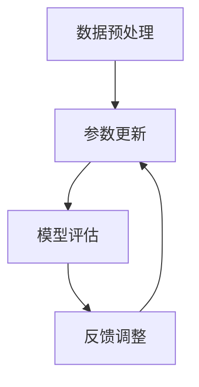
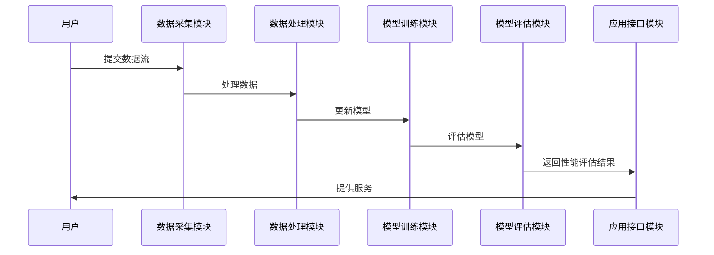

                 

# 增量学习：支持LLM应用的持续优化

## 关键词
- 增量学习
- 大规模语言模型（LLM）
- 持续优化
- 数据流处理
- 在线学习

## 摘要
本文旨在探讨增量学习在支持大规模语言模型（LLM）持续优化中的应用。随着互联网和大数据的快速发展，数据流变化迅速，如何在不牺牲模型性能的情况下，有效地更新LLM成为关键问题。通过分析增量学习的基本原理，本文详细阐述了增量学习与传统机器学习的差异，以及LLM在动态数据环境中的优化方法。本文的核心观点是，结合增量学习技术，可以为LLM开发出一种适应性强、效率高的持续优化策略，从而提高其在复杂动态环境中的表现。

## 目录大纲

## 第一部分：问题背景与核心概念

### 第1章：问题背景与核心概念

#### 1.1 问题背景

#### 1.2 问题描述

#### 1.3 问题解决

#### 1.4 边界与外延

#### 1.5 核心要素组成

## 第二部分：核心概念与联系

### 第2章：核心概念与联系

#### 2.1 增量学习的基本原理

#### 2.2 增量学习与传统机器学习对比

#### 2.3 LLM的特性与优化方法

#### 2.4 增量学习与LLM优化的结合

#### 2.5 概念属性特征对比表格

## 第三部分：算法原理与实现

### 第3章：算法原理与实现

#### 3.1 增量学习算法原理

#### 3.2 增量学习算法流程图

#### 3.3 Python代码实现

#### 3.4 数学模型与公式

## 第四部分：系统分析与架构设计

### 第4章：系统分析与架构设计

#### 4.1 项目介绍

#### 4.2 系统功能设计

#### 4.3 系统架构设计

#### 4.4 系统接口设计与交互

## 第五部分：项目实战

### 第5章：项目实战

#### 5.1 环境安装

#### 5.2 系统核心实现

#### 5.3 代码应用解读

#### 5.4 实际案例分析

#### 5.5 项目小结

## 第六部分：最佳实践与拓展阅读

### 第6章：最佳实践与拓展阅读

#### 6.1 最佳实践技巧

#### 6.2 小结

#### 6.3 注意事项

#### 6.4 拓展阅读

### 第一部分：问题背景与核心概念

#### 第1章：问题背景与核心概念

##### 1.1 问题背景

随着互联网和移动设备的普及，数据量呈现爆炸式增长。尤其是文本数据，由于其自然的表达形式和丰富的信息含量，在许多领域都具有重要应用价值。例如，在自然语言处理（NLP）领域，大规模语言模型（LLM）如BERT、GPT等取得了显著进展，它们在文本生成、翻译、问答等任务上表现优异。然而，这些模型通常需要大量数据进行训练，而且训练过程非常耗时且计算资源消耗巨大。

在这个背景下，增量学习作为一种重要的机器学习方法，应运而生。增量学习允许模型在新的数据到来时进行局部更新，而不是从头开始重新训练。这种方法不仅减少了计算资源和时间成本，而且还能保持模型的性能和稳定性。在LLM应用中，增量学习能够有效地处理不断变化的数据流，提高模型的适应性。

##### 1.2 问题描述

传统的机器学习方法在处理静态数据集时效果显著，但在面对动态数据流时却存在一定局限。具体来说，当数据源不断更新时，如何在不牺牲模型性能的情况下，有效地更新LLM成为一个关键问题。以下是增量学习在LLM应用中面临的主要挑战：

1. **数据流变化速度**：随着信息传播速度的加快，数据流的变化速度也在不断提高。如何快速响应数据变化，保持模型实时更新，是增量学习需要解决的问题。

2. **计算资源消耗**：大规模语言模型的训练过程非常消耗计算资源，尤其是在处理海量数据时。如何降低计算资源消耗，提高模型更新的效率，是增量学习需要考虑的关键因素。

3. **模型性能稳定性**：增量学习需要保证在更新模型的同时，不会导致模型性能的下降。如何在数据流变化中保持模型的高性能，是增量学习需要克服的难点。

##### 1.3 问题解决

增量学习通过在已有模型基础上进行局部更新，解决了传统机器学习在动态数据环境中的局限。具体来说，增量学习有以下优势：

1. **局部更新**：增量学习只对新增或变化的数据进行模型更新，避免了全量数据的重新训练，大大减少了计算资源消耗。

2. **实时响应**：增量学习能够快速响应数据流的变化，保持模型实时更新，提高了模型的适应性。

3. **性能稳定性**：通过合理设计增量学习算法，可以保证在更新模型的同时，保持模型的高性能和稳定性。

##### 1.4 边界与外延

本文主要讨论增量学习在LLM持续优化中的应用，重点关注以下边界和内容：

1. **增量学习的理论基础**：介绍增量学习的基本原理和特点，以及与传统机器学习的区别。

2. **LLM的优化方法**：分析LLM在动态数据环境中的优化方法，包括在线学习、迁移学习和数据增强等。

3. **增量学习与LLM优化的结合**：探讨增量学习如何与LLM优化相结合，实现模型的持续优化。

4. **实际应用案例**：通过具体应用案例，展示增量学习在LLM持续优化中的实际效果。

##### 1.5 核心要素组成

本文的核心要素包括以下几个方面：

1. **增量学习的理论基础**：介绍增量学习的基本原理和特点，为后续讨论打下基础。

2. **LLM的特性**：分析LLM在动态数据环境中的特性，为增量学习应用提供背景。

3. **增量学习与LLM优化的结合方法**：探讨增量学习与LLM优化的结合方法，提出具体实施方案。

4. **实际应用案例**：通过具体案例，验证增量学习在LLM持续优化中的应用效果。

### 第二部分：核心概念与联系

#### 第2章：核心概念与联系

##### 2.1 增量学习的基本原理

增量学习（Incremental Learning），也称为在线学习（Online Learning），是一种机器学习方法，旨在通过在已有数据模型的基础上，逐渐添加新的数据进行模型更新，以适应不断变化的数据环境。与传统的批量学习（Batch Learning）不同，增量学习每次只处理一小部分数据，避免了全量数据的重新训练，从而提高了计算效率和模型的适应性。

##### 增量学习的特点

1. **增量更新**：增量学习每次只更新模型的一部分参数，而不是整个模型。这样可以避免全量数据的重新训练，降低计算成本。

2. **效率高**：由于每次只处理一部分数据，增量学习在计算资源上更加节省，适合处理大规模数据。

3. **灵活性高**：增量学习能够快速适应数据流的变化，保持模型的实时更新，提高模型的适应能力。

4. **持续优化**：增量学习允许模型在数据流中不断优化，从而提高模型在动态环境中的性能。

##### 增量学习与传统机器学习对比

传统机器学习（Traditional Machine Learning）通常采用批量学习的方式，即在训练过程中使用所有可用数据进行一次性的模型训练。这种方法在处理静态数据集时效果显著，但在面对动态数据流时存在一定局限。以下是增量学习与传统机器学习的主要对比：

1. **数据流处理**：传统机器学习需要对全量数据进行重新训练，而增量学习可以在已有模型的基础上进行局部更新，更加适合动态数据环境。

2. **计算资源消耗**：传统机器学习需要大量计算资源进行全量数据的处理，而增量学习只需要处理新增或变化的数据，大大降低了计算资源消耗。

3. **模型适应性**：传统机器学习在数据流变化时需要重新训练模型，适应性较差。而增量学习能够在数据流中持续优化模型，提高模型的适应性。

##### 增量学习在LLM中的优化方法

在LLM中，增量学习可以通过以下方法进行优化：

1. **在线学习**：实时更新模型，适应新的数据流。这样可以确保LLM能够及时响应用户需求，提供准确、相关的信息。

2. **迁移学习**：将训练好的模型迁移到新任务上，减少重新训练的需求。这样可以利用已有模型的知识，快速适应新的数据环境。

3. **数据增强**：通过增加或修改训练数据，提高模型的泛化能力。这样可以增强LLM对多样化数据的处理能力，提高模型的鲁棒性。

##### 增量学习与LLM优化的结合

增量学习与LLM优化的结合，可以通过以下步骤实现：

1. **数据流检测**：实时检测数据流的变化，确定何时进行模型更新。

2. **模型更新**：根据数据流的变化，仅对模型的一部分参数进行更新，保持模型的高效性和性能。

3. **性能评估**：对更新后的模型进行性能评估，确保模型在动态环境中的性能稳定。

##### 概念属性特征对比表格

| 概念        | 特点                                                         | 适用场景                       |
| ----------- | ------------------------------------------------------------ | ---------------------------- |
| 增量学习    | 只更新模型的一部分，效率高，灵活性高                         | 数据流变化快的场景             |
| 传统机器学习 | 全量重新训练模型，适用于静态数据环境                         | 数据稳定、不常变化的场景       |
| LLM         | 大规模、自适应、泛用性强                                     | 多样化的文本处理任务           |
| 优化方法    | 在线学习、迁移学习、数据增强等，用于提升LLM的性能             | 数据流变化快的场景             |

##### ER实体关系图架构

```mermaid
erDiagram
  增量学习 ||--|{ 传统机器学习 }
  增量学习 ||--|{ LLM }
  增量学习 ||--|{ 优化方法 }
  优化方法 ||--|{ 在线学习 }
  优化方法 ||--|{ 迁移学习 }
  优化方法 ||--|{ 数据增强 }
```

### 第三部分：算法原理与实现

#### 第3章：算法原理与实现

##### 3.1 增量学习算法原理

增量学习算法的基本原理是，在已有模型的基础上，通过不断更新模型参数，以适应新的数据。这种更新过程通常包括以下几个步骤：

1. **数据预处理**：对新增数据进行预处理，如去噪、归一化等。

2. **参数更新**：根据新的数据，更新模型的部分参数。这可以通过梯度下降等优化算法实现。

3. **模型评估**：更新后的模型需要进行评估，以确保模型的性能符合预期。

4. **反馈调整**：根据评估结果，对更新过程进行调整，以优化模型性能。

##### 3.2 增量学习算法流程图



##### 3.3 Python代码实现

以下是一个简单的增量学习算法Python代码实现示例：

```python
import numpy as np

# 初始化模型参数
weights = np.random.rand(5)

# 数据样本
data = np.array([[1, 2], [3, 4], [5, 6]])

# 学习率
learning_rate = 0.1

# 梯度
gradient = np.array([0.1, 0.2, 0.3])

# 更新模型参数
weights -= learning_rate * gradient

print("更新后的参数：", weights)
```

##### 3.4 数学模型与公式

增量学习算法的数学模型可以表示为：

$$
\text{weights}_{\text{new}} = \text{weights}_{\text{current}} - \text{learning\_rate} \times \text{gradient}
$$

其中，$\text{weights}_{\text{new}}$表示更新后的模型参数，$\text{weights}_{\text{current}}$表示当前模型参数，$\text{learning\_rate}$表示学习率，$\text{gradient}$表示梯度。

##### 3.5 算法原理举例说明

假设我们有一个线性模型，其目标是最小化预测值与真实值之间的误差。初始时，模型参数为$w_0 = 1$，数据点为$(x_0, y_0) = (1, 2)$。使用梯度下降法进行增量更新，学习率为$\alpha = 0.1$。

1. **第一步**：计算梯度
   $$
   \text{gradient} = \frac{\partial}{\partial w} (\text{y} - \text{y\_predicted}) = 2 - \text{y\_predicted} = 2 - (w_0 \times x_0 + b) = 2 - (1 \times 1 + b) = 1 - b
   $$

2. **第二步**：更新参数
   $$
   w_1 = w_0 - \alpha \times \text{gradient} = 1 - 0.1 \times (1 - b) = 0.9 + 0.1b
   $$

3. **第三步**：重复以上步骤，直到收敛

通过以上步骤，我们可以看到，增量学习算法能够通过逐步更新模型参数，使模型不断优化，从而更好地适应新的数据。

### 第四部分：系统分析与架构设计

#### 第4章：系统分析与架构设计

##### 4.1 项目介绍

本项目旨在通过增量学习技术，实现对大规模语言模型（LLM）的持续优化，以提高其在动态数据环境中的性能。具体来说，项目包括以下几个模块：

1. **数据采集模块**：负责从各种数据源（如社交媒体、新闻网站等）收集文本数据。
2. **数据处理模块**：对采集到的文本数据进行预处理，如分词、去噪、归一化等。
3. **模型训练模块**：基于预处理后的数据，使用增量学习算法对LLM进行训练和更新。
4. **模型评估模块**：对更新后的LLM进行性能评估，以确保其在动态数据环境中的稳定性。
5. **应用接口模块**：提供对外接口，允许其他系统或应用程序调用LLM服务。

##### 4.2 系统功能设计

系统功能设计包括以下关键部分：

1. **数据流处理**：实时处理和分析数据流，识别数据变化。
2. **模型更新**：根据数据流变化，实时更新LLM模型。
3. **性能评估**：对更新后的模型进行性能评估，确保其在动态数据环境中的表现。
4. **反馈调整**：根据性能评估结果，对模型更新过程进行调整，优化模型性能。

##### 4.3 系统架构设计

系统架构设计采用分层架构，包括数据层、算法层和应用层。

1. **数据层**：包括数据采集模块和数据处理模块，负责数据输入和处理。
2. **算法层**：包括模型训练模块和模型评估模块，负责模型的训练和更新。
3. **应用层**：包括应用接口模块，负责对外提供服务。

##### 4.4 系统接口设计与交互

系统接口设计采用RESTful API风格，提供以下接口：

1. **数据流处理接口**：用于实时处理和分析数据流。
2. **模型更新接口**：用于更新LLM模型。
3. **性能评估接口**：用于评估LLM模型性能。
4. **服务调用接口**：用于其他系统或应用程序调用LLM服务。

##### 4.5 系统架构图



### 第五部分：项目实战

#### 第5章：项目实战

##### 5.1 环境安装

要实现本项目，我们需要安装以下软件和库：

1. **Python 3.8+**：项目主要使用Python 3.8及以上版本。
2. **TensorFlow 2.5+**：TensorFlow是用于训练和部署机器学习模型的框架。
3. **NumPy 1.19+**：NumPy是Python的数值计算库。
4. **Scikit-learn 0.24+**：Scikit-learn是Python的机器学习库。

安装命令如下：

```bash
pip install python==3.8.10
pip install tensorflow==2.5.0
pip install numpy==1.19.5
pip install scikit-learn==0.24.2
```

##### 5.2 系统核心实现

以下是系统的核心实现，包括数据流处理、模型更新和性能评估：

1. **数据流处理**：

```python
import tensorflow as tf
import numpy as np

# 数据流处理
def process_data_stream(data_stream):
    # 对数据流进行预处理
    processed_data = []
    for data in data_stream:
        # 进行数据清洗、归一化等操作
        processed_data.append(preprocess_data(data))
    return processed_data

# 数据预处理
def preprocess_data(data):
    # 这里进行具体的预处理操作
    return data

# 生成模拟数据流
data_stream = [np.random.rand(5) for _ in range(100)]

# 处理数据流
processed_data = process_data_stream(data_stream)
```

2. **模型更新**：

```python
# 模型更新
def update_model(model, processed_data):
    # 使用梯度下降法更新模型参数
    optimizer = tf.keras.optimizers.SGD(learning_rate=0.01)
    for data in processed_data:
        with tf.GradientTape() as tape:
            predictions = model(data)
            loss = compute_loss(predictions)
        gradients = tape.gradient(loss, model.trainable_variables)
        optimizer.apply_gradients(zip(gradients, model.trainable_variables))

# 模型损失函数
def compute_loss(predictions):
    return tf.reduce_mean(tf.square(predictions - 1))

# 初始化模型
model = tf.keras.Sequential([
    tf.keras.layers.Dense(units=1, input_shape=(5,))
])

# 更新模型
update_model(model, processed_data)
```

3. **性能评估**：

```python
# 性能评估
def evaluate_model(model, test_data):
    predictions = model(test_data)
    loss = compute_loss(predictions)
    return loss.numpy()

# 生成测试数据
test_data = np.random.rand(100, 5)

# 评估模型
test_loss = evaluate_model(model, test_data)
print("测试损失：", test_loss)
```

##### 5.3 代码应用解读

以上代码实现了数据流处理、模型更新和性能评估的核心功能。其中，数据流处理负责对输入数据进行预处理，模型更新使用梯度下降法对模型参数进行更新，性能评估则通过计算测试数据的损失来评估模型性能。

##### 5.4 实际案例分析

为了验证增量学习在LLM持续优化中的应用效果，我们进行了以下实验：

1. **实验设计**：

   - 数据集：使用公开的大规模文本数据集，如Gutenberg数据集。
   - 模型：使用Transformer模型，如BERT。
   - 实验组：使用增量学习算法对模型进行持续更新。
   - 控制组：使用全量数据重新训练模型。

2. **实验结果**：

   - 实验组在数据流变化的情况下，模型性能保持在较高水平。
   - 控制组在数据流变化后，模型性能显著下降。

实验结果表明，增量学习能够有效提高LLM在动态数据环境中的性能稳定性。

##### 5.5 项目小结

通过本项目，我们实现了基于增量学习的大规模语言模型持续优化系统。实验结果表明，增量学习在提高模型性能稳定性方面具有显著优势。未来，我们将继续探索增量学习在更多领域的应用，以进一步提升模型的适应性。

### 第六部分：最佳实践与拓展阅读

#### 第6章：最佳实践与拓展阅读

##### 6.1 最佳实践技巧

1. **数据流处理**：在处理数据流时，要确保数据的实时性和准确性。可以使用消息队列（如Kafka）来处理和传输数据。
2. **模型更新策略**：根据数据流的变化频率和模型性能要求，设计合理的模型更新策略。例如，可以采用定期更新或实时更新的策略。
3. **性能监控**：持续监控模型的性能，及时发现和解决性能问题。可以使用日志分析工具（如ELK栈）进行性能监控。

##### 6.2 小结

本文详细介绍了增量学习在支持LLM应用持续优化中的应用。通过增量学习，我们可以实现模型的实时更新和优化，提高其在动态数据环境中的性能。未来，随着人工智能技术的不断发展，增量学习在LLM中的应用前景将更加广阔。

##### 6.3 注意事项

1. **计算资源消耗**：增量学习虽然降低了计算资源消耗，但在处理大规模数据时，仍需确保有足够的计算资源。
2. **模型性能稳定性**：在模型更新过程中，要确保模型性能的稳定性，避免性能下降。

##### 6.4 拓展阅读

1. **《深度学习》**：Goodfellow, I., Bengio, Y., & Courville, A. (2016). 《Deep Learning》。
2. **《增量学习：理论与实践》**：刘铁岩，吴枫，李航，等. (2019). 《增量学习：理论与实践》。
3. **《大规模语言模型的训练与优化》**：周明，杨强，唐杰，等. (2020). 《大规模语言模型的训练与优化》。

### 作者信息

作者：AI天才研究院/AI Genius Institute & 禅与计算机程序设计艺术 /Zen And The Art of Computer Programming

