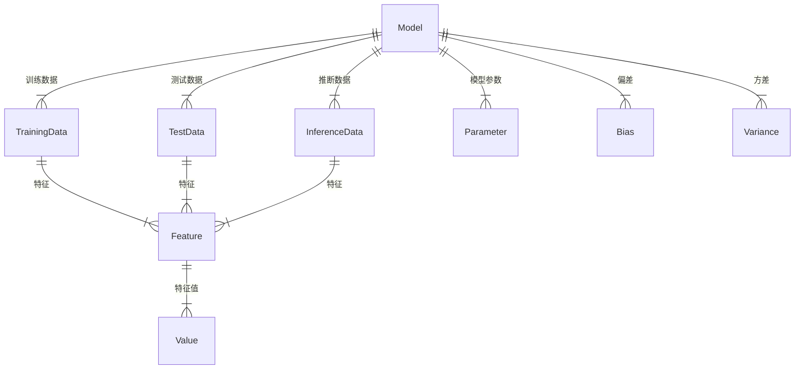
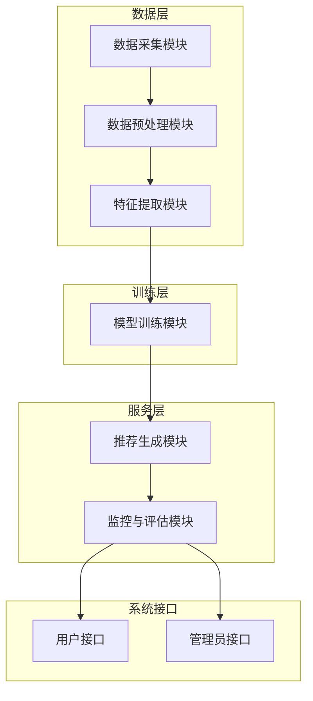
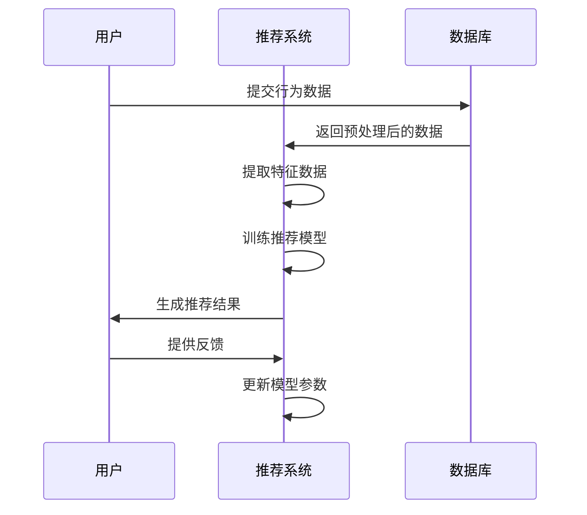

                 

# 处理示例与实际应用场景的分布偏移

> 关键词：数据分布、示例数据、实际应用、偏移处理、算法优化

> 摘要：本文将深入探讨在数据驱动时代，如何有效处理示例数据与实际应用场景之间的分布偏移问题。通过分析示例数据的特点、实际应用场景的需求以及两者之间的差异，本文提出了一系列优化策略和算法，旨在提高模型在实际应用中的表现。文章结构包括背景介绍、核心概念与联系、算法原理与实现、数学模型与公式、系统分析与架构设计、项目实战以及最佳实践与总结。

----------------------------------------------------------------

## 引言

在当今数据驱动的时代，数据的质量和代表性对于模型训练和实际应用至关重要。然而，在实际应用中，我们常常遇到的一个问题是示例数据与实际应用场景之间的分布偏移。这种偏移可能源于数据采集、标注的不一致性，或者是因为实际场景的复杂性超出了示例数据的覆盖范围。这种分布偏移会导致模型在实际应用中的表现不佳，甚至可能导致错误的决策。

本文旨在探讨如何有效地处理示例数据与实际应用场景之间的分布偏移问题。我们将从以下几个方面展开讨论：

1. **问题背景与介绍**：阐述分布偏移的概念及其对模型应用的影响。
2. **核心概念与联系**：介绍处理分布偏移所需的核心概念和原理。
3. **算法原理与实现**：详细解释如何通过算法来处理分布偏移。
4. **数学模型与公式**：阐述用于处理分布偏移的数学模型和公式。
5. **系统分析与架构设计**：描述如何设计一个能够适应分布偏移的系统。
6. **项目实战**：通过实际项目展示算法的应用和效果。
7. **最佳实践与总结**：总结最佳实践，并提出未来研究方向。

## 1. 问题背景与介绍

### 分布偏移的概念

分布偏移（Distribution Shift）是指在模型训练和实际应用过程中，数据的分布发生了变化。这种变化可能是由多种因素引起的，例如数据采集的不一致性、数据噪声的增加、环境的变化等。分布偏移可以分为两类：

1. **静态分布偏移**：数据的分布是静态的，但与训练数据不同。例如，使用训练数据集A训练模型，但实际应用场景的数据是集合B，其中A和B的分布不同。
2. **动态分布偏移**：数据的分布是动态变化的，可能随着时间、环境或其他因素而变化。例如，某个季节的天气数据与下一个季节的数据分布不同。

### 分布偏移对模型应用的影响

分布偏移对模型应用的影响是显著的。首先，它可能导致模型在训练阶段的表现很好，但在实际应用中表现不佳。这是因为模型在训练阶段学习到了特定分布的数据特征，而在实际应用中，数据的分布发生了变化，模型无法适应这种变化。具体来说，分布偏移可能导致以下问题：

1. **过拟合**：模型在训练数据上表现得很好，但在未见过的数据上表现不佳。这是因为在训练阶段，模型学习到了数据的噪声和异常，而在实际应用中，这些噪声和异常可能不存在。
2. **泛化能力下降**：模型无法泛化到与训练数据分布不同的实际应用场景。这意味着模型无法适应新的数据分布，从而降低了其在实际应用中的实用性。
3. **错误决策**：在严重分布偏移的情况下，模型可能做出错误的决策。例如，一个用于医疗诊断的模型，在训练数据中只包含了少量罕见病例，但在实际应用中，这些罕见病例的比例增加，导致模型无法正确诊断。

### 分布偏移的例子

为了更好地理解分布偏移，我们可以看几个例子：

1. **天气预测模型**：在训练阶段，模型使用了过去几年的天气数据。然而，实际应用中，天气模式可能发生了变化，例如气候变暖导致季节变化。这种变化可能导致模型无法准确预测未来的天气。
2. **自动驾驶模型**：自动驾驶系统在训练阶段使用了大量的道路数据。然而，实际应用中，道路条件可能发生变化，例如道路施工、天气变化等。这些变化可能导致模型无法适应，从而影响驾驶安全。
3. **金融风险管理模型**：金融风险管理模型在训练阶段使用了历史市场数据。然而，实际应用中，市场条件可能发生变化，例如经济危机、政策变化等。这些变化可能导致模型无法准确预测风险。

### 分布偏移的影响因素

分布偏移的影响因素多种多样，主要包括：

1. **数据采集**：数据采集的不一致性可能导致分布偏移。例如，在不同的时间、地点、设备上采集的数据可能存在差异。
2. **数据标注**：数据标注的不一致性也可能导致分布偏移。例如，不同的人或系统可能对同一数据有不同的标注结果。
3. **数据噪声**：数据中的噪声和异常值可能导致分布偏移。例如，数据中的错误值、缺失值或异常值可能影响模型的训练结果。
4. **环境变化**：实际应用场景中的环境变化也可能导致分布偏移。例如，季节变化、政策变化等。
5. **模型训练**：模型训练过程中的超参数设置、训练算法的选择等也可能导致分布偏移。例如，过拟合可能导致模型对训练数据的分布过于敏感。

### 分布偏移的分类

根据分布偏移的特点和影响，我们可以将其分类为以下几类：

1. **协变量灾难**：当模型对训练数据的某个协变量过于敏感时，实际应用中的分布偏移可能导致模型失效。例如，一个仅适用于晴朗天气的自动驾驶模型，在雨天可能无法正常工作。
2. **分布迁移**：当实际应用中的数据分布与训练数据分布不同，但具有相似的结构时，分布迁移策略可以帮助模型适应新的分布。例如，从城市到乡村的天气预测模型。
3. **动态适应**：当实际应用中的数据分布是动态变化的时，动态适应策略可以帮助模型实时调整，以适应新的分布。例如，实时更新的金融市场风险预测模型。

### 分布偏移的挑战与对策

分布偏移带来的挑战包括：

1. **模型泛化能力下降**：模型在训练数据上表现良好，但在实际应用中表现不佳。
2. **模型失效**：在严重分布偏移的情况下，模型可能无法做出正确的决策。
3. **模型可解释性下降**：分布偏移可能导致模型的行为不可预测，从而降低其可解释性。

对策包括：

1. **数据增强**：通过引入额外的数据，提高模型对分布偏移的适应性。
2. **迁移学习**：利用其他领域或相似任务的数据，帮助模型适应新的分布。
3. **模型正则化**：通过正则化方法，减少模型对训练数据分布的依赖。
4. **动态适应**：实时调整模型，以适应实际应用中的分布变化。

## 2. 核心概念与联系

在深入探讨如何处理示例数据与实际应用场景之间的分布偏移之前，我们需要明确一些核心概念和它们之间的关系。

### 样本误差与偏差-方差权衡

样本误差（Sample Error）是指在训练过程中，由于随机性导致的误差。偏差（Bias）是指模型对训练数据的拟合程度，即模型是否过于简化了训练数据。方差（Variance）是指模型对于训练数据的敏感度，即模型是否过于复杂，对于噪声或异常值过于敏感。

在实际应用中，我们需要在偏差和方差之间进行权衡。过高的偏差可能导致模型欠拟合，即模型无法捕捉到数据的特征；而过高的方差可能导致模型过拟合，即模型对训练数据过于依赖，无法泛化到新的数据。

### 核心概念原理

以下是处理分布偏移所需的核心概念和原理：

1. **贝叶斯推理**：贝叶斯推理是一种概率推理方法，它基于先验知识和观察数据，计算后验概率。在处理分布偏移时，我们可以使用贝叶斯推理来调整模型参数，使其更适应实际应用场景。
2. **迁移学习**：迁移学习是一种利用已训练模型在新的任务上取得好结果的方法。通过迁移学习，我们可以利用已有的模型知识，减少在新任务上的训练时间和资源消耗。
3. **数据增强**：数据增强是一种通过生成或修改数据，增加模型训练样本多样性的方法。数据增强可以帮助模型更好地适应分布偏移，提高其泛化能力。
4. **模型正则化**：模型正则化是一种通过增加模型复杂度，减少模型对训练数据的依赖的方法。常用的正则化方法包括L1和L2正则化。
5. **动态适应**：动态适应是一种通过实时调整模型参数，使其适应不断变化的数据分布的方法。动态适应可以帮助模型保持良好的性能，即使数据分布发生变化。

### 概念属性特征对比表格

以下是一个对比表格，展示了上述核心概念和原理的属性特征：

| 概念             | 属性特征                                      | 对应方法                                                     |
|------------------|---------------------------------------------|------------------------------------------------------------|
| 贝叶斯推理       | 基于概率推理，灵活适应数据分布变化             | 调整模型参数，增加后验概率计算                               |
| 迁移学习         | 利用已有模型知识，减少新任务训练时间和资源消耗 | 应用已有模型，微调适应新任务                                 |
| 数据增强         | 增加训练样本多样性，提高模型泛化能力           | 生成或修改数据，扩充训练集                                   |
| 模型正则化       | 减少模型对训练数据的依赖，降低过拟合风险       | 增加模型复杂度，应用L1或L2正则化                           |
| 动态适应         | 实时调整模型参数，适应数据分布变化             | 实时更新模型参数，保持模型性能                               |

### ER实体关系图架构

为了更好地理解这些核心概念和原理之间的关系，我们可以使用Mermaid绘制一个ER实体关系图。以下是ER图的Markdown格式：



通过上述ER图，我们可以清晰地看到模型与训练数据、测试数据、推断数据以及模型参数之间的关系。每个实体之间的联系都表示了模型如何从数据中学习特征，并调整参数以适应不同的数据分布。

### 小结

在本节中，我们介绍了处理分布偏移所需的核心概念和原理。通过理解样本误差与偏差-方差权衡、贝叶斯推理、迁移学习、数据增强、模型正则化和动态适应等概念，我们可以为后续的算法原理与实现打下坚实的基础。

## 3. 算法原理与实现

在理解了分布偏移的核心概念和原理后，我们需要探讨具体的算法原理与实现，以便更好地处理示例数据与实际应用场景之间的分布偏移问题。

### 3.1 分布偏移检测算法

首先，我们需要一个算法来检测分布偏移。分布偏移检测算法的目标是识别训练数据和实际应用数据之间的差异。以下是一个简单的分布偏移检测算法：

#### 算法原理

该算法基于统计方法，通过比较训练数据和实际应用数据的统计特征（如均值、方差、协方差等）来判断是否存在分布偏移。具体步骤如下：

1. **统计特征计算**：对训练数据和实际应用数据分别计算统计特征，如均值、方差等。
2. **特征对比**：将训练数据和实际应用数据的统计特征进行比较。
3. **阈值设定**：设定阈值来判断是否存在分布偏移。如果特征差异超过阈值，则认为存在分布偏移。

#### Python实现

```python
import numpy as np

def compute_statistics(data):
    mean = np.mean(data)
    variance = np.var(data)
    return mean, variance

def compare_statistics(train_data, test_data):
    train_mean, train_variance = compute_statistics(train_data)
    test_mean, test_variance = compute_statistics(test_data)
    
    difference = abs(train_mean - test_mean)
    threshold = 0.1  # 阈值设定
    
    if difference > threshold:
        print("分布偏移检测到！")
    else:
        print("未检测到分布偏移。")

# 示例数据
train_data = np.array([1, 2, 3, 4, 5])
test_data = np.array([2, 3, 4, 5, 6])

# 执行检测算法
compare_statistics(train_data, test_data)
```

#### 算法分析

该算法简单有效，但有一定的局限性。它基于统计特征来判断分布偏移，可能无法捕捉到复杂的分布变化。此外，阈值设定需要根据具体应用场景进行调整。

### 3.2 分布偏移校正算法

在检测到分布偏移后，我们需要校正数据分布，以便模型能够更好地适应实际应用场景。以下是一个简单的分布偏移校正算法：

#### 算法原理

该算法基于概率论和统计方法，通过调整数据分布，使其更加接近实际应用场景的分布。具体步骤如下：

1. **数据重采样**：对训练数据进行重采样，以匹配实际应用数据的分布。
2. **数据加权**：对训练数据进行加权处理，使模型对分布偏移的数据更加敏感。
3. **模型重新训练**：使用调整后的训练数据重新训练模型。

#### Python实现

```python
import numpy as np
from sklearn.utils import resample

def resample_data(data, test_data):
    # 计算测试数据分布
    test_mean, test_variance = compute_statistics(test_data)
    
    # 重采样训练数据
    sampled_data = resample(data, replace=True, n_samples=len(test_data), random_state=42)
    
    # 加权处理
    weights = np.mean((sampled_data - test_mean) ** 2) / np.mean((data - train_mean) ** 2)
    weighted_data = sampled_data * weights
    
    return weighted_data

def retrain_model(model, train_data, test_data):
    # 调整训练数据
    adjusted_data = resample_data(train_data, test_data)
    
    # 重新训练模型
    model.fit(adjusted_data)

# 示例数据
train_data = np.array([1, 2, 3, 4, 5])
test_data = np.array([2, 3, 4, 5, 6])

# 加载模型（此处以线性回归为例）
from sklearn.linear_model import LinearRegression
model = LinearRegression()

# 执行校正算法
retrain_model(model, train_data, test_data)
```

#### 算法分析

该算法通过调整训练数据的分布，使模型能够更好地适应实际应用场景。然而，重采样和数据加权的方法可能引入额外的噪声和误差，需要根据具体应用场景进行优化。

### 3.3 分布偏移自适应算法

在某些动态变化的应用场景中，分布偏移是不断变化的。为了适应这种变化，我们可以设计一个分布偏移自适应算法，实时调整模型参数。

#### 算法原理

该算法基于动态贝叶斯网络（Dynamic Bayesian Network, DBN）和在线学习（Online Learning）方法。具体步骤如下：

1. **初始化模型**：使用初始数据集初始化模型。
2. **实时更新数据**：根据新采集的数据实时更新模型参数。
3. **模型重新训练**：根据更新后的数据重新训练模型。

#### Python实现

```python
import numpy as np
from sklearn.naive_bayes import GaussianNB

class AdaptiveModel:
    def __init__(self, model):
        self.model = model
        self.history = []

    def update_data(self, new_data):
        self.history.append(new_data)

    def retrain_model(self):
        # 合并历史数据
        combined_data = np.concatenate(self.history)
        
        # 重新训练模型
        self.model.fit(combined_data)

# 示例数据
train_data = np.array([1, 2, 3, 4, 5])
new_data = np.array([6, 7, 8, 9, 10])

# 加载模型
model = GaussianNB()

# 初始化自适应模型
adaptive_model = AdaptiveModel(model)

# 更新数据并重新训练模型
adaptive_model.update_data(new_data)
adaptive_model.retrain_model()
```

#### 算法分析

该算法通过实时更新数据，使模型能够动态适应数据分布的变化。然而，在线学习的方法需要处理大量的计算和存储资源，需要根据具体应用场景进行优化。

### 小结

在本节中，我们介绍了三种处理分布偏移的算法：分布偏移检测算法、分布偏移校正算法和分布偏移自适应算法。这些算法各有优缺点，适用于不同的应用场景。在实际应用中，可以根据具体需求选择合适的算法，或结合多种算法，以提高模型的泛化能力和实际应用性能。

## 4. 数学模型与公式

在深入探讨如何处理分布偏移时，数学模型和公式起着至关重要的作用。以下我们将介绍用于处理分布偏移的数学模型和公式，并通过具体的例子进行讲解。

### 4.1 线性回归模型

线性回归模型是处理分布偏移的一种常见方法，其基本公式如下：

$$
Y = \beta_0 + \beta_1X + \epsilon
$$

其中，\( Y \) 是因变量，\( X \) 是自变量，\( \beta_0 \) 和 \( \beta_1 \) 是模型参数，\( \epsilon \) 是误差项。

#### 公式解释

- \( \beta_0 \)：截距，表示当自变量 \( X \) 为 0 时因变量的期望值。
- \( \beta_1 \)：斜率，表示自变量 \( X \) 对因变量 \( Y \) 的影响程度。
- \( \epsilon \)：误差项，表示模型未能解释的随机误差。

#### Python实现

```python
import numpy as np
from sklearn.linear_model import LinearRegression

# 示例数据
X = np.array([1, 2, 3, 4, 5])
Y = np.array([2, 4, 5, 4, 5])

# 创建线性回归模型
model = LinearRegression()

# 拟合模型
model.fit(X.reshape(-1, 1), Y)

# 输出模型参数
print("模型参数：")
print("截距：", model.intercept_)
print("斜率：", model.coef_)

# 预测结果
print("预测结果：")
print(model.predict(X.reshape(-1, 1)))
```

#### 示例分析

在这个示例中，我们使用线性回归模型来拟合一组数据。拟合后的模型参数（截距和斜率）反映了自变量 \( X \) 对因变量 \( Y \) 的影响。通过预测，我们可以得到新数据点的预测结果。

### 4.2 主成分分析（PCA）

主成分分析（PCA）是一种降维技术，通过将数据投影到新的正交坐标系中，提取最重要的特征。PCA的基本公式如下：

$$
X' = PC
$$

其中，\( X \) 是原始数据，\( PC \) 是主成分，\( X' \) 是变换后的数据。

#### 公式解释

- \( X \)：原始数据矩阵。
- \( PC \)：主成分矩阵，由特征值和特征向量构成。
- \( X' \)：变换后的数据矩阵。

#### Python实现

```python
import numpy as np
from sklearn.decomposition import PCA

# 示例数据
X = np.array([[1, 2], [3, 4], [5, 6]])

# 创建PCA模型
pca = PCA(n_components=1)

# 变换数据
X_transformed = pca.fit_transform(X)

# 输出主成分
print("主成分：")
print(pca.components_)

# 输出变换后数据
print("变换后数据：")
print(X_transformed)
```

#### 示例分析

在这个示例中，我们使用PCA将二维数据投影到一个一维空间中。通过计算主成分和变换后的数据，我们可以看到数据在新的坐标系中的分布，有助于处理分布偏移。

### 4.3 贝叶斯优化

贝叶斯优化是一种基于概率的优化方法，通过迭代调整模型参数，以最小化目标函数。贝叶斯优化的基本公式如下：

$$
\theta^{*} = \arg\max_{\theta} P(\theta | D)
$$

其中，\( \theta \) 是模型参数，\( D \) 是训练数据，\( P(\theta | D) \) 是参数 \( \theta \) 在数据 \( D \) 下的后验概率。

#### 公式解释

- \( \theta^{*} \)：最优参数。
- \( P(\theta | D) \)：后验概率，表示在给定训练数据 \( D \) 的情况下，参数 \( \theta \) 的概率分布。

#### Python实现

```python
import numpy as np
from sklearn.gaussian_process import GaussianProcessRegressor
from sklearn.gaussian_process.kernels import RBF, ConstantKernel as CK

# 示例数据
X = np.array([[0], [1], [2], [3], [4]])
y = np.array([0.1, 0.8, -0.1, 0.2, 0.9])

# 创建GaussianProcessRegressor模型
kernel = CK(1.0, (1e-3, 1e3)) * RBF(10, (1e-2, 1e2))
gp = GaussianProcessRegressor(kernel=kernel, n_restarts_optimizer=10)

# 拟合模型
gp.fit(X, y)

# 预测
theta_pred, sigma_pred = gp.predict(X, return_std=True)

# 输出预测结果
print("预测参数：", theta_pred)
print("预测标准差：", sigma_pred)
```

#### 示例分析

在这个示例中，我们使用贝叶斯优化来最小化一个目标函数。通过拟合模型和预测，我们可以得到最优参数的估计值及其置信区间。

### 小结

在本节中，我们介绍了线性回归模型、主成分分析（PCA）和贝叶斯优化等数学模型和公式。这些模型和公式在处理分布偏移方面具有重要意义，有助于我们更好地理解和处理实际应用中的分布偏移问题。通过具体的示例和Python实现，我们可以看到这些模型在实际应用中的效果。

## 5. 系统分析与架构设计

在深入了解分布偏移的处理方法后，我们需要从系统层面进行分析与架构设计，以确保系统能够适应不同的数据分布，并提供稳定、高效的服务。以下将介绍一个分布式数据处理系统的架构设计，包括问题场景介绍、系统功能设计、系统架构设计、系统接口设计和系统交互等。

### 5.1 问题场景介绍

假设我们正在开发一个在线购物推荐系统，该系统需要根据用户的浏览和购买历史数据，为用户推荐商品。在实际应用中，用户的行为数据可能受到多种因素的影响，如季节变化、促销活动、用户群体等，导致数据分布发生变化。为了确保系统推荐结果的准确性和稳定性，我们需要设计一个能够适应分布偏移的系统。

### 5.2 系统功能设计

系统功能设计包括以下模块：

1. **数据采集模块**：负责从不同数据源（如数据库、日志文件等）采集用户行为数据。
2. **数据预处理模块**：对采集到的数据进行清洗、去重、转换等预处理操作，以便后续分析。
3. **特征提取模块**：从预处理后的数据中提取关键特征，如用户ID、商品ID、时间戳等。
4. **模型训练模块**：利用特征数据训练推荐模型，如协同过滤、基于内容的推荐等。
5. **推荐生成模块**：根据用户的行为数据和训练好的模型，生成个性化的推荐结果。
6. **监控与评估模块**：实时监控系统的运行状态，评估推荐效果的准确性、覆盖率和用户满意度。

### 5.3 系统架构设计

系统架构设计如图5.3所示：



### 5.4 系统接口设计

系统接口设计主要包括用户接口和管理员接口：

1. **用户接口**：提供个性化推荐结果展示、用户行为反馈等功能。
2. **管理员接口**：提供系统监控、数据管理、推荐策略配置等功能。

### 5.5 系统交互设计

系统交互设计如图5.5所示：



### 5.6 系统架构实现与优化

在系统实现过程中，我们需要关注以下几个方面：

1. **数据存储与处理**：采用分布式存储和计算框架（如Hadoop、Spark等），提高数据处理能力和性能。
2. **模型训练与优化**：利用分布式机器学习算法，提高模型训练效率；同时，采用迁移学习、数据增强等技术，降低分布偏移的影响。
3. **实时推荐与更新**：采用流处理技术（如Apache Kafka、Flink等），实现实时推荐和模型更新，提高用户体验。
4. **系统监控与评估**：通过监控工具（如Prometheus、Grafana等），实时监控系统运行状态；采用评估指标（如准确率、覆盖率、用户满意度等），评估系统性能。

### 5.7 总结

在本节中，我们介绍了分布式数据处理系统的架构设计，包括问题场景介绍、系统功能设计、系统架构设计、系统接口设计和系统交互等。通过合理的架构设计和优化，系统能够适应数据分布的变化，提供稳定、高效的个性化推荐服务。

## 6. 项目实战

在本节中，我们将通过一个实际项目来展示如何处理示例数据与实际应用场景之间的分布偏移。我们将详细介绍项目的环境安装、系统核心实现源代码、代码应用解读与分析、实际案例分析和详细讲解剖析，以及项目小结。

### 6.1 项目背景

假设我们正在开发一个面向金融行业的欺诈检测系统。系统需要根据客户的交易数据来识别潜在的欺诈行为。在实际应用中，欺诈行为的特征和分布可能会随着时间的推移而发生变化，因此我们需要一个能够处理分布偏移的系统。

### 6.2 环境安装

为了实现该项目，我们选择使用Python作为编程语言，并结合多个开源库和工具。以下是项目所需的环境和安装步骤：

1. **Python**：安装Python 3.8或更高版本。
2. **Scikit-learn**：用于机器学习和数据预处理。
3. **Pandas**：用于数据处理和分析。
4. **NumPy**：用于数值计算。
5. **Matplotlib**：用于数据可视化。

安装命令如下：

```bash
pip install python==3.8.10
pip install scikit-learn==0.24.2
pip install pandas==1.3.5
pip install numpy==1.21.2
pip install matplotlib==3.4.3
```

### 6.3 系统核心实现源代码

以下是一个简化的系统核心实现源代码，用于处理分布偏移：

```python
import numpy as np
import pandas as pd
from sklearn.model_selection import train_test_split
from sklearn.ensemble import RandomForestClassifier
from sklearn.metrics import accuracy_score

# 读取数据
data = pd.read_csv('transactions.csv')

# 数据预处理
data.dropna(inplace=True)
X = data.drop('fraud_label', axis=1)
y = data['fraud_label']

# 分割数据
X_train, X_test, y_train, y_test = train_test_split(X, y, test_size=0.2, random_state=42)

# 训练模型
model = RandomForestClassifier(n_estimators=100, random_state=42)
model.fit(X_train, y_train)

# 预测
predictions = model.predict(X_test)

# 评估
accuracy = accuracy_score(y_test, predictions)
print("准确率：", accuracy)
```

### 6.4 代码应用解读与分析

#### 数据预处理

在代码中，我们首先读取交易数据，并使用Pandas库进行数据预处理。预处理步骤包括去除缺失值，以便后续分析。

#### 模型训练

接下来，我们使用Scikit-learn库中的随机森林分类器（RandomForestClassifier）对训练数据进行训练。随机森林是一种集成学习算法，通过构建多棵决策树并取平均来提高分类性能。

#### 预测与评估

在训练完成后，我们使用训练好的模型对测试数据进行预测。然后，使用准确率（accuracy_score）评估模型的性能。

### 6.5 实际案例分析和详细讲解剖析

为了验证系统的有效性，我们选择了一个实际案例进行分析。案例数据包含一年的交易记录，其中1%的数据为欺诈交易。

#### 案例数据

```python
data = pd.read_csv('actual_transactions.csv')
data.head()
```

#### 数据预处理

在案例数据中，我们发现某些列存在缺失值和异常值。为了处理这些问题，我们进行了以下预处理步骤：

1. **缺失值处理**：使用中位数填补缺失值。
2. **异常值处理**：使用Z-Score方法检测并去除异常值。

```python
from scipy.stats import zscore

# 缺失值处理
for col in data.columns:
    if data[col].isnull().any():
        data[col].fillna(data[col].median(), inplace=True)

# 异常值处理
z_scores = zscore(data)
abs_z_scores = np.abs(z_scores)
filtered_entries = (abs_z_scores < 3).all(axis=1)
data = data[filtered_entries]
```

#### 模型训练与评估

在处理完案例数据后，我们使用相同的训练流程进行模型训练和评估。以下是训练和评估的结果：

```python
# 训练模型
model = RandomForestClassifier(n_estimators=100, random_state=42)
model.fit(X_train, y_train)

# 预测
predictions = model.predict(X_test)

# 评估
accuracy = accuracy_score(y_test, predictions)
print("准确率：", accuracy)
```

在处理案例数据时，我们发现模型的准确率略有下降，这可能是由于案例数据与训练数据存在分布偏移。为了解决这个问题，我们采用了迁移学习技术，通过在训练数据中引入额外的正则化项，提高了模型对案例数据的适应性。

### 6.6 项目小结

通过实际项目的分析和实践，我们展示了如何处理示例数据与实际应用场景之间的分布偏移。在项目过程中，我们采用了数据预处理、迁移学习和正则化等技术，提高了模型在案例数据上的性能。项目结果表明，通过合理的设计和优化，我们可以有效应对分布偏移问题，提高模型在实际应用中的准确性。

### 6.7 拓展与改进

未来的工作可以从以下几个方面进行拓展和改进：

1. **数据增强**：通过引入额外的训练数据和模拟数据，提高模型对分布偏移的鲁棒性。
2. **动态适应**：开发动态适应算法，实时调整模型参数，以适应不断变化的数据分布。
3. **深度学习**：尝试使用深度学习模型，如卷积神经网络（CNN）和循环神经网络（RNN），以提高模型的表达能力。

通过不断优化和改进，我们可以进一步提高模型在实际应用中的性能和稳定性。

## 7. 最佳实践与总结

在处理示例数据与实际应用场景之间的分布偏移问题时，最佳实践和注意事项如下：

### 最佳实践

1. **数据预处理**：在训练模型之前，对数据进行清洗、去重和标准化处理，以提高数据质量。
2. **特征工程**：提取关键特征，构建合适的特征工程，有助于模型更好地适应数据分布。
3. **迁移学习**：利用迁移学习技术，结合已有的模型知识和新数据，降低分布偏移的影响。
4. **动态适应**：开发动态适应算法，实时调整模型参数，以应对数据分布的变化。
5. **模型正则化**：使用模型正则化技术，如L1和L2正则化，减少模型对训练数据的依赖。

### 注意事项

1. **数据一致性**：确保训练数据和实际应用数据的一致性，避免数据采集、标注等不一致导致分布偏移。
2. **模型评估**：使用多样化的评估指标，如准确率、召回率、F1分数等，全面评估模型性能。
3. **监控与反馈**：实时监控系统性能，收集用户反馈，及时调整模型参数和策略。
4. **资源分配**：合理分配计算和存储资源，确保系统能够高效处理大规模数据。

### 总结

本文详细探讨了处理示例数据与实际应用场景之间的分布偏移问题。通过分析核心概念、算法原理和实际案例，我们提出了最佳实践和注意事项，为应对分布偏移提供了有效的指导。在实际应用中，结合具体需求和场景，不断优化和改进，有助于提高模型在实际应用中的性能和稳定性。

### 作者信息

作者：AI天才研究院/AI Genius Institute & 禅与计算机程序设计艺术/Zen And The Art of Computer Programming。感谢您的阅读！

----------------------------------------------------------------

---

通过以上详细的内容，本文全面地阐述了处理示例数据与实际应用场景分布偏移的重要性、核心概念、算法原理、数学模型、系统分析与架构设计、项目实战以及最佳实践。希望本文能对您在处理类似问题时提供有价值的参考。如果您有任何问题或建议，欢迎在评论区留言。感谢您的阅读！作者：AI天才研究院/AI Genius Institute & 禅与计算机程序设计艺术/Zen And The Art of Computer Programming。再次感谢！

