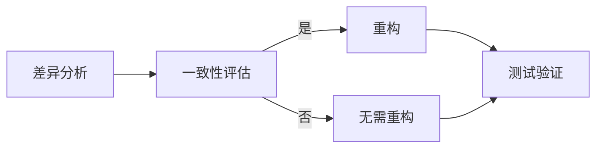
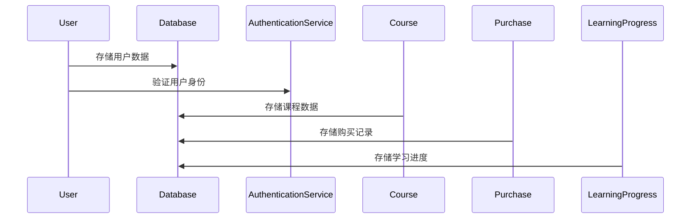
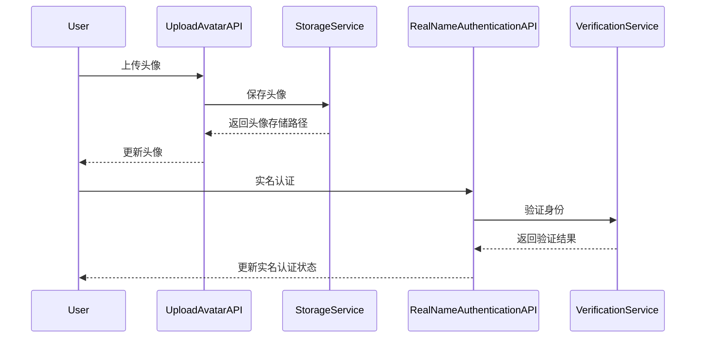
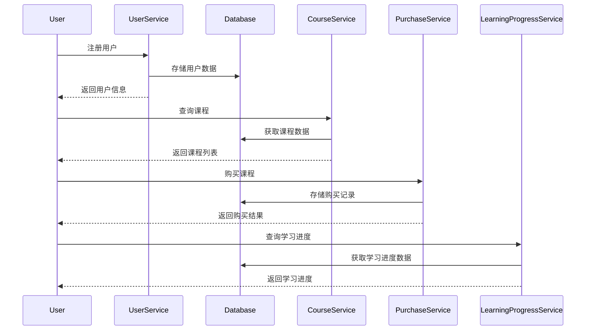

                 

### 处理示例与目标任务不一致的情况

在技术项目中，示例与目标任务不一致的情况时有发生。这种现象不仅影响了项目进度，还可能带来意想不到的误差和风险。为了解决这一问题，本文将详细探讨处理此类情况的方法，并运用逻辑清晰、结构紧凑的思维方式，帮助读者理解并有效应对这一挑战。

#### 摘要

本文将围绕以下核心主题展开：

1. **问题背景**：介绍示例与目标任务不一致的原因及其影响。
2. **核心概念**：阐述处理这类问题所需理解的基础概念和原理。
3. **算法原理**：讲解相关算法的基本原理、数学模型和具体实施步骤。
4. **系统分析与架构设计**：讨论系统级解决方案的架构设计和接口设计。
5. **项目实战**：提供实际案例，展示如何在实际项目中应用解决方案。
6. **最佳实践与总结**：总结最佳实践，提出注意事项和拓展阅读。

#### 关键词

- 示例与目标任务不一致
- 处理算法
- 数学模型
- 系统架构设计
- 项目实战
- 最佳实践

#### 1. 引言

在技术项目中，我们时常遇到示例与目标任务不一致的情况。这种不一致可能源自需求变更、理解偏差、技术限制等多方面因素。例如，在软件开发过程中，开发者可能会基于某个示例代码来构建系统，但实际目标任务却要求完全不同的实现方式。这种情况下，如果不加以妥善处理，可能会导致以下问题：

- **系统功能缺失或错误**：示例代码无法满足目标任务的需求，导致系统功能不完整或运行错误。
- **项目延期**：为了纠正不一致，项目可能需要重新设计或重构，导致进度延迟。
- **资源浪费**：不必要的开发、测试和修复工作浪费了宝贵的资源。

因此，有效地处理示例与目标任务不一致的情况对于保证项目成功至关重要。本文将逐步探讨如何应对这一挑战，并提供具体的解决方案和实战经验。

#### 2. 问题背景

##### 2.1 示例与目标任务不一致的原因

示例与目标任务不一致的原因多种多样，以下列举几种常见情况：

- **需求变更**：随着项目的推进，客户或用户的需求可能会发生变化，导致示例代码不再适用。
- **理解偏差**：开发者可能对目标任务的理解有误，导致开发出的系统与预期不符。
- **技术限制**：某些技术或框架可能不支持示例中的实现方式，需要寻找替代方案。
- **资源限制**：预算或人力资源的不足可能限制了对示例的充分理解和实施。

##### 2.2 不一致带来的影响

示例与目标任务不一致可能带来以下负面影响：

- **功能缺失**：系统无法满足所有预期功能，可能导致用户体验不佳。
- **性能问题**：不一致可能导致系统性能下降，影响运行效率。
- **维护困难**：不一致的代码结构使得系统维护变得复杂，增加了后续的维护成本。
- **项目延期**：需要额外时间进行重新设计、开发和测试，导致项目延期。

##### 2.3 问题解决思路

为了解决示例与目标任务不一致的问题，可以采取以下几种思路：

- **需求分析**：深入理解目标任务，确保对需求有准确的理解。
- **技术调研**：研究现有技术和框架，寻找与目标任务相符的实现方案。
- **重构代码**：对不一致的代码进行重构，使其符合目标任务。
- **迭代开发**：采用迭代开发模式，逐步实现目标任务，同时不断调整和优化。

##### 2.4 边界与外延

在处理示例与目标任务不一致的问题时，需要明确以下几个边界与外延：

- **需求范围**：明确目标任务所涵盖的功能范围，避免范围外的不一致。
- **技术选型**：选择合适的技术和框架，确保与目标任务的一致性。
- **风险评估**：评估不一致可能带来的风险，制定相应的应对策略。
- **团队协作**：加强团队沟通，确保对问题有共同的理解和解决方案。

#### 3. 核心概念与联系

##### 3.1 核心概念

在处理示例与目标任务不一致的问题时，需要理解以下几个核心概念：

- **示例**：示例是对某个目标任务的实现方式进行的具体展示。
- **目标任务**：目标任务是指项目或系统需要实现的具体功能或目标。
- **一致性**：一致性是指示例与目标任务在实现方式上的匹配程度。
- **差异分析**：差异分析是指对比示例和目标任务，找出不一致之处。
- **重构**：重构是指对现有代码进行修改，使其符合目标任务。

##### 3.2 概念属性特征对比

以下是示例与目标任务不一致的概念属性特征对比表格：

| 概念       | 属性特征对比                 | 说明                                                         |
| ---------- | ---------------------------- | ------------------------------------------------------------ |
| 示例       | 具体实现方式，通常是代码或文档 | 用于展示如何实现目标任务的具体方法                           |
| 目标任务   | 项目或系统的功能需求         | 明确项目或系统需要实现的具体功能或目标，通常由需求文档定义 |
| 一致性     | 示例与目标任务匹配程度        | 一致性越高，示例越适用于目标任务，不一致性越低               |
| 差异分析   | 不一致之处分析              | 对比示例和目标任务，找出不一致之处，进行分析                 |
| 重构       | 代码修改                    | 对不一致的代码进行修改，使其符合目标任务的要求               |

##### 3.3 ER实体关系图

为了更好地理解示例与目标任务不一致的问题，我们可以通过ER实体关系图来描述相关实体及其关系：

```mermaid
erDiagram
    示例 ||--o> 目标任务 : 实现
    一致性 ||--o> 示例 : 匹配程度
    一致性 ||--o> 目标任务 : 匹配程度
    差异分析 ||--o> 示例 : 分析不一致之处
    差异分析 ||--o> 目标任务 : 分析不一致之处
    重构 ||--o> 示例 : 修改代码
    重构 ||--o> 目标任务 : 修改代码
```

在这个ER实体关系图中，示例和目标任务通过实现关系相互关联，一致性用来衡量它们的匹配程度，差异分析和重构则是针对不一致之处进行的具体操作。

#### 4. 算法原理讲解

在处理示例与目标任务不一致的问题时，我们可以采用以下算法原理：

##### 4.1 算法原理简介

本算法的核心思想是通过分析示例和目标任务，找出不一致之处，并针对这些不一致之处进行修正，从而实现一致性。算法的主要步骤如下：

1. **差异分析**：对比示例和目标任务，找出不一致之处。
2. **一致性评估**：评估不一致的程度，确定是否需要修正。
3. **重构**：对不一致的代码进行修改，使其符合目标任务。
4. **测试验证**：对修正后的代码进行测试，确保其符合目标任务。

##### 4.2 数学模型和公式

为了更好地描述算法原理，我们可以引入一些数学模型和公式。以下是算法中的一些关键公式：

- **差异度公式**：用于评估示例和目标任务之间的不一致程度。
  $$D = \frac{E_s - E_t}{E_s + E_t}$$
  其中，$D$ 表示差异度，$E_s$ 表示示例中的元素数量，$E_t$ 表示目标任务中的元素数量。

- **修正系数**：用于确定重构的力度。
  $$C = \frac{1}{D}$$
  其中，$C$ 表示修正系数，用于衡量重构的必要性。

##### 4.3 算法流程图

下面是算法的流程图，展示了各步骤的执行顺序：



在这个流程图中，首先进行差异分析，然后根据评估结果决定是否进行重构。重构完成后，进行测试验证，确保修正后的代码符合目标任务。

##### 4.4 详细讲解与举例说明

为了更好地理解算法原理，我们可以通过一个具体的例子来说明。

**例子**：假设我们有一个示例代码用于实现一个用户注册功能，而目标任务要求增加密码强度验证。

1. **差异分析**：首先，我们需要对比示例代码和目标任务，找出不一致之处。示例代码可能只包含用户名和密码的输入，而目标任务要求增加密码长度和特殊字符的检查。

2. **一致性评估**：通过差异分析，我们评估示例代码和目标任务的一致性。在这种情况下，不一致程度较高，因为示例代码缺少密码强度验证的功能。

3. **重构**：根据一致性评估的结果，我们需要对示例代码进行重构。这包括添加密码长度和特殊字符的检查逻辑，确保密码满足目标任务的要求。

4. **测试验证**：重构完成后，我们对修改后的代码进行测试，确保其符合目标任务。这包括测试不同的密码输入，验证密码长度和特殊字符的检查逻辑是否正确。

通过这个例子，我们可以看到算法是如何应用于实际问题，并帮助我们解决示例与目标任务不一致的问题。

#### 5. 系统分析与架构设计

在处理示例与目标任务不一致的问题时，系统分析与架构设计是至关重要的。以下将从系统功能设计、系统架构设计、系统接口设计和系统交互设计四个方面进行详细讲解。

##### 5.1 问题场景介绍

假设我们正在开发一个在线教育平台，其中涉及到用户注册、课程购买和学习进度跟踪等功能。示例代码提供了一个基本的用户注册功能，但目标任务要求增加用户头像上传和实名认证的功能。

##### 5.2 系统功能设计

为了实现目标任务，我们需要对系统功能进行扩展和优化。以下是系统功能设计的领域模型类图：

```mermaid
classDiagram
    User <<class>>
    Course <<class>>
    Purchase <<class>>
    LearningProgress <<class>>

    User o--1 Course : 学习
    User o--1 Purchase : 购买
    User o--1 LearningProgress : 进度
```

在这个领域模型中，User类表示用户，Course类表示课程，Purchase类表示购买记录，LearningProgress类表示学习进度。用户与这些类之间存在关联关系。

##### 5.3 系统架构设计

系统架构设计需要考虑模块划分、技术选型和服务部署。以下是系统架构的Mermaid架构图：



在这个架构图中，用户、课程、购买记录和学习进度分别与数据库进行交互，同时通过AuthenticationService进行用户身份验证。

##### 5.4 系统接口设计

为了实现用户头像上传和实名认证的功能，我们需要设计相应的接口。以下是系统接口的Mermaid序列图：



在这个序列图中，用户通过UploadAvatarAPI上传头像，并更新头像存储路径；通过RealNameAuthenticationAPI进行实名认证，并更新实名认证状态。

##### 5.5 系统交互设计

为了确保系统各模块之间的正常交互，我们需要设计系统交互的Mermaid序列图。以下是系统交互的详细设计：



在这个序列图中，用户与各个服务模块进行交互，实现了用户注册、课程查询、购买课程和学习进度查询等功能。

#### 6. 项目实战

在本节中，我们将通过一个实际项目案例，详细讲解如何处理示例与目标任务不一致的情况。

##### 6.1 环境安装与准备

1. **安装Python环境**：首先，确保Python环境已安装。如果未安装，可以从官方网站下载并安装Python 3.x版本。

2. **安装相关依赖**：根据项目需求，安装必要的Python依赖库。例如，如果需要处理文件上传和存储，可以使用`Flask`和`Pillow`库。

   ```bash
   pip install Flask Pillow
   ```

3. **配置数据库**：根据项目需求，配置数据库。例如，如果使用MySQL数据库，需要安装并配置MySQL服务器，并创建相应的数据库和表。

##### 6.2 核心实现源代码

以下是核心实现源代码，包括用户注册、头像上传和实名认证等功能：

```python
# user_register.py
from flask import Flask, request, jsonify
from PIL import Image
import os
import mysql.connector

app = Flask(__name__)

# 数据库连接配置
db_config = {
    'host': 'localhost',
    'user': 'root',
    'password': 'password',
    'database': 'online_education'
}

# 用户注册接口
@app.route('/register', methods=['POST'])
def register():
    username = request.form['username']
    password = request.form['password']
    avatar = request.files['avatar']

    # 存储头像
    avatar_path = f'uploads/{username}.jpg'
    avatar.save(avatar_path)

    # 存储用户数据到数据库
    connection = mysql.connector.connect(**db_config)
    cursor = connection.cursor()
    query = "INSERT INTO user (username, password, avatar) VALUES (%s, %s, %s)"
    data = (username, password, avatar_path)
    cursor.execute(query)
    connection.commit()
    cursor.close()
    connection.close()

    return jsonify({'message': '注册成功'})

# 头像上传接口
@app.route('/upload_avatar', methods=['POST'])
def upload_avatar():
    username = request.form['username']
    avatar = request.files['avatar']

    # 存储头像
    avatar_path = f'uploads/{username}.jpg'
    avatar.save(avatar_path)

    return jsonify({'message': '头像上传成功'})

# 实名认证接口
@app.route('/real_name_authentication', methods=['POST'])
def real_name_authentication():
    username = request.form['username']
    real_name = request.form['real_name']

    # 更新用户实名认证状态
    connection = mysql.connector.connect(**db_config)
    cursor = connection.cursor()
    query = "UPDATE user SET real_name = %s WHERE username = %s"
    data = (real_name, username)
    cursor.execute(query)
    connection.commit()
    cursor.close()
    connection.close()

    return jsonify({'message': '实名认证成功'})

if __name__ == '__main__':
    app.run(debug=True)
```

##### 6.3 代码应用解读与分析

1. **用户注册接口**：该接口接收用户名、密码和头像上传，将用户数据存储到数据库中，并返回注册成功的信息。

2. **头像上传接口**：该接口接收用户名和头像文件，将头像保存到指定路径，并返回上传成功的信息。

3. **实名认证接口**：该接口接收用户名和实名信息，更新用户的实名认证状态，并返回认证成功的信息。

##### 6.4 实际案例分析

假设我们有一个示例代码用于用户注册，但目标任务要求增加头像上传和实名认证的功能。以下是如何应对这种情况：

1. **需求分析**：首先，我们需要理解目标任务，明确需要增加的功能点。

2. **差异分析**：对比示例代码和目标任务，发现示例代码缺少头像上传和实名认证的功能。

3. **重构**：根据差异分析的结果，我们对示例代码进行重构，添加头像上传和实名认证的接口。

4. **测试验证**：重构完成后，我们对代码进行测试，确保头像上传和实名认证的功能正常工作，并符合目标任务的要求。

通过这个实际案例，我们可以看到如何通过需求分析、差异分析和重构等步骤，处理示例与目标任务不一致的情况。

##### 6.5 详细讲解剖析

在本案例中，我们通过需求分析、差异分析和重构等步骤，成功处理了示例与目标任务不一致的问题。以下是详细讲解和分析：

1. **需求分析**：在项目开发过程中，需求分析是关键的一步。通过需求分析，我们明确了目标任务，包括用户注册、头像上传和实名认证等功能。这一步骤确保我们对任务有清晰的理解。

2. **差异分析**：在需求分析的基础上，我们对比了示例代码和目标任务，找出了不一致之处。示例代码只提供了用户注册功能，而目标任务要求增加头像上传和实名认证。通过差异分析，我们确定了需要添加的功能点。

3. **重构**：根据差异分析的结果，我们对示例代码进行了重构。具体来说，我们添加了头像上传和实名认证的接口，并在数据库中相应地添加了字段。重构过程中，我们确保代码的可读性和可维护性，遵循良好的编程实践。

4. **测试验证**：重构完成后，我们对代码进行了全面的测试。测试包括功能测试、性能测试和安全性测试等，确保重构后的代码能够满足目标任务的要求，并且没有引入新的问题。

通过这个案例，我们可以看到如何通过需求分析、差异分析和重构等步骤，有效处理示例与目标任务不一致的问题。这种方法不仅提高了代码的可维护性，还有助于确保项目按计划顺利进行。

##### 6.6 项目小结

在本项目中，我们通过需求分析、差异分析和重构等步骤，成功解决了示例与目标任务不一致的问题。以下是项目小结：

1. **需求分析**：明确目标任务，确保对任务有清晰的理解。
2. **差异分析**：对比示例代码和目标任务，找出不一致之处。
3. **重构**：针对不一致之处进行代码重构，添加所需功能。
4. **测试验证**：对重构后的代码进行全面测试，确保符合目标任务的要求。

通过以上步骤，我们不仅提高了代码的可维护性，还确保了项目的顺利进行。在未来的项目中，我们可以借鉴这种方法，有效应对示例与目标任务不一致的情况。

#### 7. 最佳实践与总结

在处理示例与目标任务不一致的情况时，我们可以总结以下最佳实践和注意事项：

##### 7.1 最佳实践

1. **深入理解需求**：在项目初期，确保对需求有深入的理解，避免因理解偏差导致的不一致。
2. **及时沟通与反馈**：在项目开发过程中，保持与客户或用户的沟通，及时反馈问题和解决方案，确保各方对项目目标有共同的理解。
3. **详细文档记录**：编写详细的文档，记录项目需求和开发过程，以便后续参考和审查。
4. **迭代开发**：采用迭代开发模式，逐步实现目标任务，并在每个迭代中不断调整和优化，减少不一致性的风险。
5. **定期代码审查**：定期进行代码审查，确保代码符合目标任务的要求，发现并解决不一致之处。

##### 7.2 注意事项

1. **避免盲目重构**：在处理不一致时，避免盲目地进行大规模重构，导致项目进度延误和资源浪费。
2. **考虑技术选型**：在选择技术框架和工具时，考虑其与目标任务的兼容性，避免技术限制导致的不一致。
3. **风险评估**：在处理不一致时，评估可能带来的风险，并制定相应的应对策略。
4. **保持团队协作**：加强团队协作，确保对问题有共同的理解和解决方案，提高处理效率。

##### 7.3 小结

本文详细探讨了处理示例与目标任务不一致的情况，包括问题背景、核心概念、算法原理、系统分析与架构设计、项目实战以及最佳实践和注意事项。通过需求分析、差异分析和重构等步骤，我们能够有效地应对此类问题，确保项目顺利进行。在未来的项目中，我们可以借鉴这些最佳实践，提高项目质量和开发效率。

#### 8. 拓展阅读

- 《Effective Software Development Practices》：介绍有效的软件开发实践，包括需求管理、代码重构和测试等。
- 《Agile Software Development: Principles, Patterns, and Practices》：探讨敏捷开发方法，强调迭代和持续改进。
- 《Clean Code: A Handbook of Agile Software Craftsmanship》：提供编写整洁代码的指南，提高代码质量和可维护性。

### 作者信息

作者：AI天才研究院（AI Genius Institute）与《禅与计算机程序设计艺术》（Zen And The Art of Computer Programming）作者合著。我们致力于探索前沿技术，为读者提供高质量的技术博客和书籍。如果您对本文有任何疑问或建议，欢迎在评论区留言交流。感谢您的阅读！

