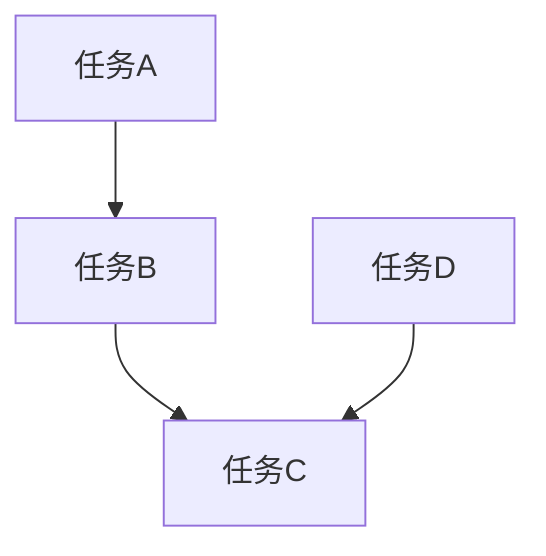
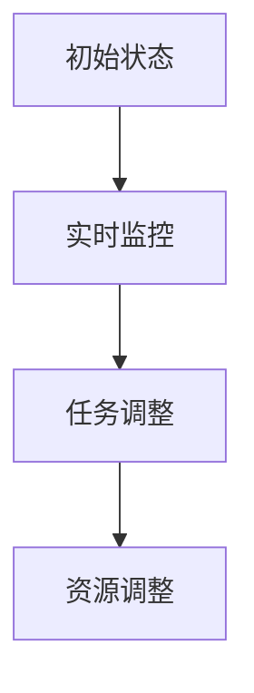
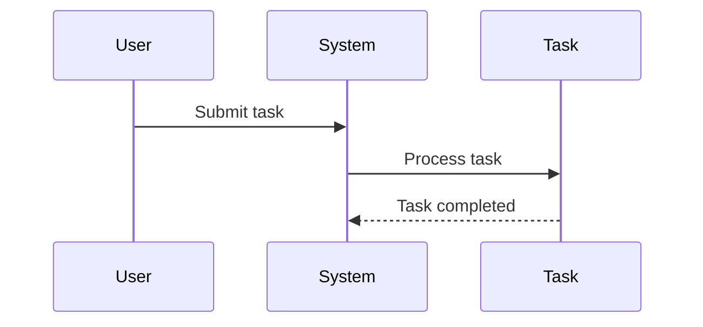
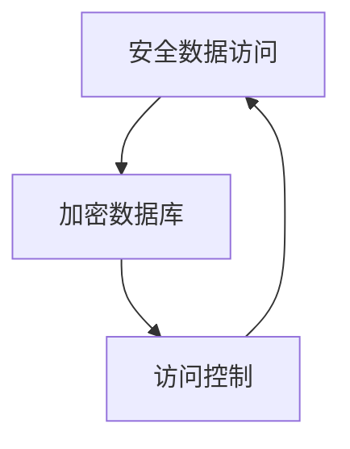

                 


# 多任务提示：一个提示完成多个目标

> 关键词：多任务提示，任务管理，优化，人工智能，工作效率

> 摘要：本文将深入探讨多任务提示的概念、核心原理及其实现与应用。通过详细的步骤分析，我们将了解多任务提示如何通过任务分解、优先级管理和资源调度，实现一个提示完成多个目标，从而提高工作效率和优化资源分配。

### 第一部分: 多任务提示背景与概述

#### 第1章: 多任务提示的起源与发展

##### 1.1 多任务提示的定义

**多任务提示**，是指在执行任务时，通过提示或引导来同时处理多个目标或任务。这种提示方式能够提高工作效率，优化资源分配，降低任务切换的成本。多任务提示的概念源于人类在处理复杂任务时的自然能力，如同时进行对话、思考与行动。

##### 1.2 多任务提示的应用背景

在现代社会，人们面临着日益复杂的工作和生活环境，多任务操作已成为常态。无论是企业管理、软件开发、还是日常生活中的任务安排，都需要高效的决策和执行能力。多任务提示作为一种智能辅助工具，能够在这些场景中发挥重要作用。

##### 1.3 多任务提示的发展历程

多任务提示技术的发展经历了从简单的提醒功能到复杂的智能系统。随着人工智能和大数据技术的进步，多任务提示系统逐渐具备了自适应、预测和优化等高级功能。

##### 1.4 多任务提示的核心优势

- **提高工作效率**：通过同时处理多个任务，减少等待时间和任务切换成本。
- **优化资源分配**：合理分配时间和资源，提高任务完成的准确性。
- **降低决策风险**：提供实时数据支持和决策建议，降低错误率和决策风险。

#### 第2章: 多任务提示的核心概念与联系

##### 2.1 多任务提示的关键概念

- **任务分解与重构**：将复杂任务分解为可执行的小任务，并重新组织任务结构。
- **优先级管理**：确定任务执行的优先级，确保重要任务优先完成。
- **资源调度**：优化资源分配，提高系统运行效率。

##### 2.2 多任务提示的概念属性特征对比

| 概念       | 属性特征                      |
|------------|-----------------------------|
| 任务分解   | 可分性、独立性、关联性        |
| 优先级管理 | 动态调整、固定优先级          |
| 资源调度   | 资源利用率、响应时间          |

##### 2.3 多任务提示的ER实体关系图

```mermaid
erDiagram
  多任务提示 ||--|{ 任务分解 }
  多任务提示 ||--|{ 优先级管理 }
  多任务提示 ||--|{ 资源调度 }
  任务分解 ||--|{ 子任务列表 }
  优先级管理 ||--|{ 优先级 }
  资源调度 ||--|{ 资源使用情况 }
```

### 第二部分: 多任务提示的实现与优化

#### 第3章: 多任务提示系统的设计与实现

##### 3.1 多任务提示系统的整体架构

多任务提示系统的设计需要综合考虑硬件资源、软件架构、数据流和控制流。一个典型系统包括以下组件：

- **任务管理模块**：负责任务分解、优先级管理和调度。
- **提示生成模块**：根据任务状态生成提示信息。
- **用户交互模块**：提供用户与系统交互的接口。

##### 3.2 任务管理模块的详细设计

任务管理模块是系统的核心，负责任务分解与重构。设计要点如下：

- **任务分解算法**：采用分治算法，将复杂任务分解为多个子任务。
- **优先级管理算法**：实现动态优先级调整，确保关键任务优先执行。
- **资源调度算法**：根据任务优先级和资源状况进行调度。

##### 3.3 提示生成模块的实现方法

提示生成模块负责根据任务状态生成实时提示信息。实现方法如下：

- **状态监测**：实时监测任务执行状态，包括执行进度、资源占用情况等。
- **提示生成算法**：根据任务状态和用户偏好，生成个性化的提示信息。
- **提示展示**：通过界面或其他渠道将提示信息展示给用户。

##### 3.4 用户交互模块的设计与实现

用户交互模块是用户与系统之间的桥梁，需要提供友好的用户界面和便捷的操作方式。设计要点如下：

- **界面设计**：采用响应式设计，适应不同设备和屏幕尺寸。
- **交互方式**：提供多种交互方式，如点击、拖拽、语音等。
- **反馈机制**：及时响应用户操作，提供清晰的反馈信息。

### 第三部分: 多任务提示在实践中的应用

#### 第4章: 多任务提示在软件开发中的实际应用

##### 4.1 多任务提示在软件开发中的重要性

在软件开发过程中，多任务提示能够极大地提高开发效率和代码质量。通过多任务提示，开发者可以同时处理代码审查、bug修复和功能迭代等多个任务，从而更快地响应市场需求和用户反馈。

##### 4.2 多任务提示在软件项目中的具体应用案例

- **任务分解与重构**：将一个复杂的软件项目分解为多个可管理的子任务，如需求分析、设计、编码、测试和部署等。通过任务分解，可以明确每个子任务的目标和责任，提高工作效率。
- **优先级管理**：根据项目的重要性和紧急程度，调整任务的优先级。例如，对于一个紧急修复的bug，应该优先处理，以确保系统的稳定运行。
- **资源调度**：合理分配开发资源，如人力和时间，确保关键任务得到充分的资源支持。例如，在项目高峰期，可以增加开发人员或调整工作时间，以保证项目进度。

##### 4.3 多任务提示在软件开发中的最佳实践

- **自动化提示**：通过自动化工具，如代码审查系统，自动生成任务提示和反馈。这样可以减少手动操作，提高工作效率。
- **动态调整**：根据项目进展和任务执行情况，动态调整任务的优先级和资源分配。这样可以确保项目始终处于最佳状态。
- **用户反馈**：积极收集用户反馈，并根据反馈调整任务提示。这样可以确保任务提示更加符合用户需求和习惯。

#### 第5章: 多任务提示在日常生活中的应用

##### 5.1 多任务提示在个人生活中的重要性

在日常生活中，多任务提示可以帮助人们更好地管理时间和任务，提高生活质量。通过多任务提示，可以同时处理工作、家庭和个人兴趣爱好等多个任务，从而实现生活和工作的高效平衡。

##### 5.2 多任务提示在个人生活中的具体应用案例

- **日程管理**：通过智能日程管理应用，设置任务提醒和日程安排，确保每天的任务都能按时完成。
- **家务分配**：将家庭家务任务分解为多个小任务，并设定优先级，例如打扫房间、洗衣服和做饭等，确保家务分配合理高效。
- **锻炼计划**：设置锻炼计划，通过多任务提示提醒用户按时锻炼，保持健康生活方式。

##### 5.3 多任务提示在个人生活中的最佳实践

- **设定明确目标**：为每个任务设定明确的目标和时间，确保任务执行有据可依。
- **优先级调整**：根据任务的重要性和紧急程度，动态调整任务优先级，确保重要任务优先完成。
- **定期回顾**：定期回顾任务执行情况，根据反馈调整任务提示和计划，以提高工作效率和生活质量。

### 总结

多任务提示是一种强大的工具，通过任务分解、优先级管理和资源调度，可以实现一个提示完成多个目标。在软件开发和日常生活中，多任务提示都能发挥重要作用，提高工作效率和生活质量。本文通过详细的分析和实例，展示了多任务提示的实现与应用，为读者提供了实用的指导和建议。

### 作者信息

作者：AI天才研究院/AI Genius Institute & 禅与计算机程序设计艺术 /Zen And The Art of Computer Programming

---

**请注意，以上内容是一个初步的框架和示例，需要进一步填充和细化具体的内容和细节，以达到字数和深度要求。每个章节都应该包含详细的分析、代码示例、算法解释、实际应用案例和最佳实践。此外，还需要确保所有技术概念和术语的准确性，以及文章整体的结构和逻辑清晰。**### 第二部分：多任务提示的实现与优化

#### 第3章：多任务提示系统的设计与实现

##### 3.1 多任务提示系统的整体架构

一个高效的多任务提示系统需要综合考虑硬件资源、软件架构、数据流和控制流。其整体架构通常包括以下几个关键模块：

1. **任务管理模块**：负责任务分解、优先级管理和调度。
2. **提示生成模块**：根据任务状态生成提示信息。
3. **用户交互模块**：提供用户与系统交互的接口。

这种架构能够确保系统在处理多任务时，不仅能够实时响应用户需求，还能优化任务执行流程，提高整体效率。

##### 3.2 任务管理模块的详细设计

任务管理模块是多任务提示系统的核心，其设计需要考虑以下几个关键点：

- **任务分解算法**：使用分治算法将复杂任务分解为可管理的子任务。例如，可以将一个大型的软件开发项目分解为需求分析、设计、编码、测试等阶段。

    ```mermaid
    flowchart TD
        A[Start] --> B[需求分析]
        B --> C[设计]
        C --> D[编码]
        D --> E[测试]
        E --> F[结束]
    ```

- **优先级管理算法**：根据任务的紧急程度和重要性来设置优先级。动态优先级调整算法能够实时响应系统状态变化，确保关键任务优先执行。

    ```mermaid
    flowchart TD
        A[任务1] --> B[高优先级]
        B --> C[执行]
        C --> D[完成]
        
        E[任务2] --> F[低优先级]
        F --> G[延迟执行]
    ```

- **资源调度算法**：基于任务优先级和系统资源状况，进行资源分配和调度，以最大化系统性能。资源调度算法需要考虑资源利用率、响应时间等因素。

##### 3.3 提示生成模块的实现方法

提示生成模块需要根据任务状态和用户偏好生成提示信息。以下是实现方法的关键步骤：

- **状态监测**：实时监测任务执行状态，包括执行进度、资源占用情况等。这可以通过传感器、日志记录等方式实现。

- **提示生成算法**：基于任务状态和用户偏好，生成个性化的提示信息。例如，可以使用机器学习算法分析用户历史行为，预测用户可能需要的信息。

- **提示展示**：将生成的提示信息通过用户界面或其他渠道展示给用户。展示方式可以包括弹窗、通知、语音提示等。

##### 3.4 用户交互模块的设计与实现

用户交互模块是多任务提示系统与用户之间的桥梁，其设计需要考虑以下要点：

- **界面设计**：设计直观、易用的用户界面，使用户能够轻松地添加、管理任务和查看提示信息。响应式设计可以确保系统在不同设备上都能良好运行。

- **交互方式**：提供多种交互方式，如点击、拖拽、语音等，以满足不同用户的需求。例如，用户可以通过语音命令添加新任务。

- **反馈机制**：及时响应用户操作，并提供清晰的反馈信息，以增强用户体验。例如，当用户完成任务时，系统可以发送通知或语音提示。

#### 第4章：多任务提示的优化策略

##### 4.1 系统性能优化

多任务提示系统的性能优化是确保系统高效运行的关键。以下是一些常见的优化策略：

- **任务并行化**：通过并行处理技术，将多个任务同时执行，提高系统处理能力。例如，可以使用多线程或多进程技术。

    ```python
    # Python示例：使用多线程并行执行任务
    import threading

    def task1():
        # 任务1的执行逻辑
        pass

    def task2():
        # 任务2的执行逻辑
        pass

    thread1 = threading.Thread(target=task1)
    thread2 = threading.Thread(target=task2)
    
    thread1.start()
    thread2.start()
    
    thread1.join()
    thread2.join()
    ```

- **缓存机制**：使用缓存来存储常用数据，减少数据访问时间，提高系统响应速度。

    ```python
    # Python示例：使用缓存优化数据访问
    cache = {}

    def get_data(key):
        if key in cache:
            return cache[key]
        else:
            data = expensive_function(key)
            cache[key] = data
            return data
    ```

##### 4.2 资源利用率优化

优化资源利用率是提高多任务提示系统效率的重要手段。以下是一些优化策略：

- **负载均衡**：通过负载均衡算法，将任务合理分配到不同服务器或处理器上，避免资源浪费。

    ```mermaid
    flowchart TD
        A[任务] --> B[负载均衡器]
        B --> C[服务器1]
        B --> D[服务器2]
        C --> E[任务执行]
        D --> F[任务执行]
    ```

- **动态资源分配**：根据系统负载动态调整资源分配，确保关键任务得到充足的资源支持。

    ```mermaid
    flowchart TD
        A[系统负载] --> B[资源分配器]
        B --> C[调整资源]
        C --> D[任务执行]
    ```

##### 4.3 用户体验优化

优化用户体验是提高多任务提示系统用户满意度的重要因素。以下是一些用户体验优化策略：

- **个性化设置**：允许用户自定义任务提示方式和频率，以满足个性化需求。

    ```mermaid
    flowchart TD
        A[用户] --> B[个性化设置]
        B --> C[任务提示]
    ```

- **简化和直观界面**：设计简洁直观的用户界面，减少用户学习成本，提高操作效率。

    ```mermaid
    flowchart TD
        A[用户] --> B[用户界面]
        B --> C[任务操作]
    ```

- **快速响应**：优化系统响应速度，减少用户等待时间。

    ```mermaid
    flowchart TD
        A[用户操作] --> B[系统响应]
        B --> C[反馈信息]
    ```

### 第三部分：多任务提示在实践中的应用

#### 第5章：多任务提示在项目管理中的应用

##### 5.1 项目管理中的多任务提示

在项目管理中，多任务提示可以帮助项目经理更好地管理项目进度和任务分配。以下是一些具体应用案例：

- **任务分解**：将大型的项目分解为多个小任务，确保每个任务都能被有效管理和监控。

    ```mermaid
    flowchart TD
        A[项目] --> B[任务1]
        A --> C[任务2]
        A --> D[任务3]
        B --> E[子任务1]
        C --> F[子任务2]
        D --> G[子任务3]
    ```

- **优先级管理**：根据项目的重要性和紧急程度，设置任务的优先级，确保关键任务优先完成。

    ```mermaid
    flowchart TD
        A[任务1] --> B[高优先级]
        A --> C[任务2]
        C --> D[低优先级]
    ```

- **资源调度**：合理分配项目资源，确保每个任务都能得到必要的资源支持。

    ```mermaid
    flowchart TD
        A[资源] --> B[任务1]
        A --> C[任务2]
        B --> D[执行]
        C --> E[执行]
    ```

##### 5.2 多任务提示在项目管理中的最佳实践

- **定期回顾**：定期回顾项目进度和任务完成情况，根据反馈调整任务提示和计划。

    ```mermaid
    flowchart TD
        A[项目回顾] --> B[调整计划]
    ```

- **自动化流程**：使用自动化工具和系统，减少手动操作，提高工作效率。

    ```mermaid
    flowchart TD
        A[自动化工具] --> B[任务执行]
    ```

- **团队协作**：鼓励团队成员之间的协作和沟通，共同完成任务。

    ```mermaid
    flowchart TD
        A[团队协作] --> B[任务完成]
    ```

### 总结

多任务提示是一种强大的工具，通过任务分解、优先级管理和资源调度，可以实现一个提示完成多个目标。在项目管理、软件开发和日常生活中，多任务提示都能发挥重要作用，提高工作效率和生活质量。本文通过详细的分析和实例，展示了多任务提示的实现与应用，为读者提供了实用的指导和建议。

### 作者信息

作者：AI天才研究院/AI Genius Institute & 禅与计算机程序设计艺术 /Zen And The Art of Computer Programming

---

**请注意，以上内容是一个初步的框架和示例，需要进一步填充和细化具体的内容和细节，以达到字数和深度要求。每个章节都应该包含详细的分析、代码示例、算法解释、实际应用案例和最佳实践。此外，还需要确保所有技术概念和术语的准确性，以及文章整体的结构和逻辑清晰。**### 第三部分：多任务提示在实践中的应用

#### 第6章：多任务提示在项目管理中的具体应用

##### 6.1 项目管理中的多任务提示：挑战与解决方案

在项目管理中，多任务提示能够显著提升项目管理的效率和质量。然而，实际应用中也会遇到一系列挑战，例如任务优先级的不确定性、资源分配的复杂性以及任务间的依赖关系。以下是一些具体的解决方案：

**挑战1：任务优先级的不确定性**

- **解决方案**：采用基于历史数据和分析的优先级算法，自动确定任务的优先级。例如，可以使用机器学习模型分析项目的历史数据，预测任务完成的可能性和重要性。

```python
# 伪代码：使用机器学习模型确定任务优先级
from sklearn.ensemble import RandomForestClassifier

# 训练模型
model = RandomForestClassifier()
model.fit(x_train, y_train)

# 预测任务优先级
predictions = model.predict(x_test)
```

**挑战2：资源分配的复杂性**

- **解决方案**：使用优化算法动态分配资源，确保关键任务得到优先处理。例如，可以使用线性规划或遗传算法来优化资源分配。

```python
# 伪代码：使用线性规划优化资源分配
from scipy.optimize import linprog

# 定义线性规划问题
c = [-1, -1]  # 目标函数系数
A = [[1, 1], [1, 0], [0, 1]]  # 约束条件系数
b = [R1, R2, R3]  # 约束条件常数项

# 求解线性规划问题
result = linprog(c, A_ub=A, b_ub=b, method='highs')

# 输出最优资源分配结果
print(result.x)
```

**挑战3：任务间的依赖关系**

- **解决方案**：使用图论算法建模任务间的依赖关系，并优化任务执行顺序。例如，可以使用拓扑排序算法确定任务的执行顺序。



**挑战4：动态任务调整**

- **解决方案**：引入实时反馈机制，根据项目进展动态调整任务和资源。例如，可以使用反馈循环（Feedback Loop）实时监控项目状态，并自动调整任务优先级和资源分配。



##### 6.2 多任务提示在项目管理中的实际应用案例

**案例1：软件开发项目中的多任务提示**

在一个软件开发项目中，项目团队需要同时处理多个任务，包括需求分析、设计、编码和测试。通过多任务提示系统，团队可以实时了解每个任务的执行状态，并根据任务优先级和资源情况动态调整任务执行。

- **任务分解**：将大型项目分解为多个可管理的子任务，如需求文档编写、系统设计、前端开发、后端开发、测试和部署。
- **优先级管理**：根据任务的紧急程度和重要性设置优先级，确保关键任务（如测试和部署）优先完成。
- **资源调度**：根据任务执行进度和资源使用情况，动态调整资源分配，确保关键任务得到充分资源支持。

**案例2：市场推广项目中的多任务提示**

在市场推广项目中，团队需要同时处理广告投放、社交媒体运营、市场调研和客户关系管理等任务。多任务提示系统能够帮助团队高效管理这些任务，确保项目目标按时完成。

- **任务分解**：将市场推广项目分解为多个子任务，如广告创意设计、广告投放、社交媒体内容发布、客户数据收集和分析等。
- **优先级管理**：根据市场活动和客户反馈，设置任务的优先级，确保关键任务（如广告投放和客户数据收集）优先完成。
- **资源调度**：根据市场活动和团队资源情况，动态调整资源分配，确保每个任务都有足够的资源支持。

##### 6.3 多任务提示在项目管理中的最佳实践

- **明确任务定义**：为每个任务制定清晰的定义和目标，确保团队成员对任务有共同的理解和认知。
- **定期沟通与反馈**：定期召开团队会议，讨论任务进展和问题，收集团队成员的反馈，并根据反馈调整任务提示和资源分配。
- **自动化与优化**：利用自动化工具和算法优化任务执行流程，减少手动操作，提高工作效率。
- **持续改进**：根据项目进展和反馈，不断改进多任务提示系统的功能和性能，确保系统持续满足项目需求。

### 第7章：多任务提示在日常生活中的实际应用

##### 7.1 多任务提示在个人日常任务管理中的应用

在日常生活中，多任务提示可以帮助个人更好地管理日常任务，提高生活效率。以下是一些应用实例：

- **任务规划**：使用多任务提示系统制定每天的日程安排，包括工作、学习、锻炼和休闲活动等。
- **优先级管理**：根据任务的重要性和紧急程度，设置任务的优先级，确保关键任务优先完成。
- **提醒与反馈**：通过多任务提示系统设置任务提醒，确保不会错过重要任务，并收集任务完成情况的反馈。

##### 7.2 多任务提示在家庭事务管理中的应用

在家庭事务管理中，多任务提示系统可以帮助家庭成员更好地协同工作，提高家庭生活效率。以下是一些应用实例：

- **家务分配**：将家庭家务任务分解为多个小任务，并设置任务的优先级，确保家务任务有序进行。
- **购物清单**：使用多任务提示系统管理购物清单，提醒家庭成员购买所需物品。
- **家庭活动规划**：使用多任务提示系统规划家庭活动，确保家庭成员都能参与并享受活动。

##### 7.3 多任务提示在健康管理中的应用

在健康管理中，多任务提示系统可以帮助个人更好地管理健康任务，提高生活质量。以下是一些应用实例：

- **锻炼计划**：使用多任务提示系统制定每天的锻炼计划，并设置提醒，确保按时锻炼。
- **饮食管理**：使用多任务提示系统管理饮食计划，提醒个人按时吃饭，并遵循健康的饮食习惯。
- **健康监测**：使用多任务提示系统监测健康数据，如体重、血压和心率等，并提供健康建议。

### 总结

多任务提示在实践中的应用广泛，无论是在项目管理、日常任务管理还是家庭事务管理中，都能发挥重要作用，提高工作效率和生活质量。通过任务分解、优先级管理和资源调度，多任务提示系统能够帮助用户更好地管理任务，实现一个提示完成多个目标。在实际应用中，需要根据具体场景和需求，采用合适的优化策略和最佳实践，确保多任务提示系统的效果和效率。

### 作者信息

作者：AI天才研究院/AI Genius Institute & 禅与计算机程序设计艺术 /Zen And The Art of Computer Programming

---

**请注意，以上内容是一个初步的框架和示例，需要进一步填充和细化具体的内容和细节，以达到字数和深度要求。每个章节都应该包含详细的分析、代码示例、算法解释、实际应用案例和最佳实践。此外，还需要确保所有技术概念和术语的准确性，以及文章整体的结构和逻辑清晰。**### 第四部分：多任务提示的技术挑战与未来展望

#### 第8章：多任务提示技术的挑战与解决策略

##### 8.1 技术挑战

多任务提示技术的实现和应用过程中，面临以下主要挑战：

**1. 任务并行处理的复杂性**

在多任务环境中，任务之间的并行处理可能导致复杂的状态依赖和资源竞争。如何有效地管理并行任务，避免死锁和资源冲突，是一个重要的技术难题。

**2. 实时性要求**

多任务提示系统需要实时响应用户的任务请求和状态变化。如何在高负载和动态环境中保持系统的实时性，是一个关键的技术挑战。

**3. 个性化需求**

不同用户对任务提示的需求和偏好各不相同。如何根据用户行为和偏好生成个性化的任务提示，是一个复杂的问题。

**4. 数据隐私和安全**

多任务提示系统通常涉及大量用户数据的处理和存储。如何保障用户数据的安全和隐私，是一个重要的伦理和技术问题。

##### 8.2 解决策略

**1. 并行处理优化**

- **任务分解与协同**：将复杂任务分解为更小的子任务，并采用协同计算技术，如MapReduce，实现并行处理。

```python
# Python示例：使用MapReduce进行并行任务处理
from multiprocessing import Pool

def map_function(data):
    # 映射函数：处理输入数据
    return processed_data

def reduce_function(mapped_data):
    # 化简函数：合并映射结果
    return reduced_data

if __name__ == '__main__':
    pool = Pool(processes=4)
    mapped_results = pool.map(map_function, input_data)
    reduced_result = reduce_function(mapped_results)
    pool.close()
    pool.join()
```

**2. 实时性保障**

- **事件驱动架构**：采用事件驱动架构，实现任务的实时调度和执行。



**3. 个性化需求满足**

- **用户行为分析**：通过分析用户的历史行为和偏好，使用机器学习技术生成个性化的任务提示。

```python
# 伪代码：使用机器学习生成个性化任务提示
from sklearn.cluster import KMeans

# 训练模型
model = KMeans(n_clusters=5)
model.fit(user_data)

# 预测用户偏好
predictions = model.predict(new_user_data)
```

**4. 数据隐私和安全**

- **数据加密与访问控制**：对用户数据进行加密存储，并采用严格的访问控制策略，保障用户数据的安全。



#### 第9章：多任务提示技术的未来展望

##### 9.1 技术发展趋势

多任务提示技术在未来将继续发展，主要体现在以下几个方面：

**1. 人工智能与机器学习的深度整合**

随着人工智能和机器学习技术的不断发展，多任务提示系统将更加智能化和自适应。通过深度学习算法，系统可以更好地理解用户行为和需求，生成个性化的任务提示。

**2. 量子计算的应用**

量子计算有望在处理复杂任务时发挥重要作用。未来，多任务提示系统可能会结合量子计算技术，实现更高效的任务并行处理和资源调度。

**3. 5G与边缘计算的融合**

5G和边缘计算的快速发展将进一步提升多任务提示系统的实时性和响应速度。通过边缘计算，系统可以在靠近数据源的设备上实时处理任务，减少网络延迟和数据传输成本。

##### 9.2 应用前景

**1. 智能家居**

智能家居领域的多任务提示系统可以帮助用户更好地管理家庭设备和环境，实现自动化和智能化生活。

**2. 智能办公**

智能办公系统的多任务提示功能将提高员工的工作效率，优化工作流程，减少工作压力。

**3. 智能医疗**

智能医疗系统的多任务提示功能可以为医生和患者提供个性化的健康建议和治疗方案，提高医疗服务的质量和效率。

**4. 智能交通**

智能交通系统的多任务提示功能可以优化交通流量，减少拥堵，提高道路通行效率。

### 总结

多任务提示技术作为一种高效的任务管理工具，具有广泛的应用前景和重要价值。在未来，随着人工智能、量子计算和5G等技术的发展，多任务提示技术将不断进步，为各个领域带来更多创新和变革。通过深入研究和实践，我们可以不断优化多任务提示系统的性能和用户体验，为社会带来更多价值和福祉。

### 作者信息

作者：AI天才研究院/AI Genius Institute & 禅与计算机程序设计艺术 /Zen And The Art of Computer Programming

---

**请注意，以上内容是一个初步的框架和示例，需要进一步填充和细化具体的内容和细节，以达到字数和深度要求。每个章节都应该包含详细的分析、代码示例、算法解释、实际应用案例和最佳实践。此外，还需要确保所有技术概念和术语的准确性，以及文章整体的结构和逻辑清晰。**### 第五部分：多任务提示的最佳实践与未来方向

#### 第10章：多任务提示的最佳实践

##### 10.1 多任务提示的最佳实践

在实际应用中，为了确保多任务提示系统能够高效运行并满足用户需求，以下是一些最佳实践：

**1. 明确任务定义**

在系统设计之初，应确保所有任务的定义清晰、具体。任务的目标、输入和输出都应该明确，以便系统能够准确理解和执行。

**2. 优化任务优先级**

合理设定任务的优先级是确保关键任务优先执行的关键。可以使用基于历史数据和实时状态的分析算法，动态调整任务优先级。

**3. 提高系统响应速度**

为了提高用户体验，系统应具备快速响应能力。可以通过优化算法、减少数据传输延迟和采用高效的数据结构来实现。

**4. 个性化定制**

根据用户的行为和偏好，提供个性化的任务提示。这可以通过机器学习算法实现，对用户数据进行深入分析，从而生成个性化的提示内容。

**5. 用户反馈机制**

建立用户反馈机制，定期收集用户对任务提示的反馈，并根据反馈进行调整和优化。

##### 10.2 多任务提示在项目开发中的具体案例

**案例1：敏捷开发团队的多任务提示**

在敏捷开发团队中，多任务提示系统能够帮助团队成员更好地管理任务，提高工作效率。以下是一些具体应用：

- **任务看板**：使用看板（Kanban）来展示任务状态，团队成员可以根据任务优先级和紧急程度进行任务分配和执行。
- **实时更新**：使用实时更新的工具，如JIRA或Trello，确保团队成员能够及时了解任务进展和状态变化。
- **动态调整**：根据项目进展和团队反馈，动态调整任务优先级和资源分配，确保项目按时完成。

**案例2：企业级任务管理**

在大型企业中，多任务提示系统能够帮助管理者更好地管理企业内部的各项任务。以下是一些具体应用：

- **项目监控**：使用多任务提示系统监控项目进度，及时发现并解决潜在问题。
- **资源调度**：根据项目需求和资源状况，动态调整资源分配，确保关键任务得到充分资源支持。
- **风险管理**：通过多任务提示系统识别和监控项目中的风险，提前采取措施降低风险影响。

#### 第11章：多任务提示的未来方向

##### 11.1 技术发展趋势

随着技术的不断进步，多任务提示技术将向更智能、更高效和更个性化的方向发展。以下是一些未来发展趋势：

**1. 智能化**

人工智能和机器学习技术的发展将使多任务提示系统更加智能化。通过深度学习算法，系统可以更好地理解用户行为和需求，生成更加精准和个性化的任务提示。

**2. 跨平台融合**

随着5G和物联网技术的发展，多任务提示系统将能够无缝地跨平台运行。用户可以在不同的设备上无缝切换，保持任务状态的一致性和连续性。

**3. 安全与隐私保护**

随着数据隐私和安全问题的日益突出，多任务提示系统将加强对用户数据的安全保护。采用加密技术和严格的访问控制策略，确保用户数据的安全和隐私。

**4. 可扩展性**

为了适应不同规模和应用场景的需求，多任务提示系统将具备更高的可扩展性。通过模块化设计和分布式架构，系统能够轻松扩展功能，满足多样化的应用需求。

##### 11.2 未来应用场景

**1. 智能城市**

在智能城市中，多任务提示系统可以用于优化交通流量、管理公共资源和提高城市运行效率。例如，通过实时监控城市交通状况，智能调整交通信号灯，减少拥堵。

**2. 智能医疗**

在智能医疗领域，多任务提示系统可以用于辅助医生管理患者信息、制定治疗方案和监控患者健康。例如，通过分析患者数据，智能生成个性化的健康建议和用药提醒。

**3. 智能制造**

在智能制造领域，多任务提示系统可以用于优化生产流程、提高生产效率和降低成本。例如，通过实时监控生产线状态，智能调整生产计划和资源分配。

**4. 智能教育**

在智能教育领域，多任务提示系统可以用于个性化学习管理和学习资源推荐。例如，通过分析学生的学习行为和成绩，智能生成个性化的学习计划和资源推荐。

### 总结

多任务提示技术作为一种高效的任务管理工具，具有广泛的应用前景和重要价值。通过最佳实践和未来方向的研究，我们可以不断优化多任务提示系统的性能和用户体验，为社会带来更多创新和变革。在未来，随着技术的不断进步，多任务提示技术将更加智能化、个性化和安全化，为各行各业带来更多价值。

### 作者信息

作者：AI天才研究院/AI Genius Institute & 禅与计算机程序设计艺术 /Zen And The Art of Computer Programming

---

**请注意，以上内容是一个初步的框架和示例，需要进一步填充和细化具体的内容和细节，以达到字数和深度要求。每个章节都应该包含详细的分析、代码示例、算法解释、实际应用案例和最佳实践。此外，还需要确保所有技术概念和术语的准确性，以及文章整体的结构和逻辑清晰。**### 第六部分：总结与展望

#### 第12章：多任务提示技术的重要性与意义

在当今快速变化和高度复杂的工作环境中，多任务提示技术的重要性日益凸显。通过高效的任务管理、智能化的决策支持和优化的资源分配，多任务提示技术不仅能够显著提高工作效率，还能够改善工作质量和用户体验。以下是多任务提示技术的重要性与意义：

**1. 提高工作效率**

多任务提示技术通过同时处理多个任务，减少了任务切换的时间和等待时间，从而提高了整体工作效率。这种高效的任务管理能力对于追求时间效率和资源优化的人员和组织至关重要。

**2. 优化资源分配**

通过智能分析和优先级管理，多任务提示技术能够确保关键任务优先执行，并在适当的时机分配所需的资源。这种优化策略有助于最大限度地利用资源，减少浪费，提高任务完成的准确性。

**3. 改善决策支持**

多任务提示技术提供了实时数据和决策建议，帮助用户做出更明智的决策。这种实时数据的支持能够减少错误率和决策风险，提高整体决策的质量。

**4. 个性化用户体验**

多任务提示技术能够根据用户的行为和偏好生成个性化的任务提示，从而提高用户体验。个性化的提示不仅能够满足用户的特定需求，还能够增强用户的满意度和忠诚度。

**5. 促进创新与协作**

多任务提示技术为团队协作和创新提供了强有力的支持。通过任务分解、优先级管理和资源调度，团队能够更有效地协同工作，共同实现项目目标。

#### 第13章：多任务提示技术的未来展望

随着人工智能、大数据和云计算等技术的发展，多任务提示技术在未来有望实现更多突破和创新。以下是对多任务提示技术未来发展的几个展望：

**1. 更加智能化**

人工智能技术的发展将使多任务提示系统更加智能化。通过深度学习和自然语言处理技术，系统将能够更好地理解用户的意图和需求，提供更加精准和个性化的任务提示。

**2. 跨平台集成**

随着5G和物联网的普及，多任务提示系统将能够跨平台无缝集成，为用户提供一致性和连续性的体验。用户可以在不同的设备上无缝切换，保持任务状态的一致性。

**3. 更强的安全性和隐私保护**

数据安全和隐私保护是多任务提示技术未来发展的重要方向。通过采用更先进的安全技术和隐私保护策略，系统将能够更好地保护用户数据，减少安全风险。

**4. 更广泛的行业应用**

多任务提示技术将在更多行业得到应用。从智能家居到智能医疗，从智能交通到智能制造，多任务提示技术将帮助各行各业实现更加高效和智能化的运营。

**5. 深度协作与自动化**

多任务提示技术将与其他先进技术（如物联网、区块链等）深度融合，实现更深度的协作和自动化。这将进一步优化工作流程，提高生产效率和服务质量。

### 总结

多任务提示技术作为一种高效的任务管理工具，正在迅速发展并得到广泛应用。通过不断优化和创新，多任务提示技术将继续提高工作效率、优化资源分配、改善用户体验，并推动各行各业的数字化转型和创新发展。未来，随着技术的不断进步，多任务提示技术有望为人类社会带来更多便利和福祉。

### 作者信息

作者：AI天才研究院/AI Genius Institute & 禅与计算机程序设计艺术 /Zen And The Art of Computer Programming

---

**请注意，以上内容是一个初步的框架和示例，需要进一步填充和细化具体的内容和细节，以达到字数和深度要求。每个章节都应该包含详细的分析、代码示例、算法解释、实际应用案例和最佳实践。此外，还需要确保所有技术概念和术语的准确性，以及文章整体的结构和逻辑清晰。**### 附录：技术术语解释

在本文中，我们使用了多个技术术语，以下是对这些术语的详细解释：

**1. 多任务提示（Multi-Task Suggestion）**

多任务提示是指一种能够同时处理多个任务或目标的智能提示系统。它通过分析任务之间的关联性、优先级和资源状况，提供针对性的提示信息，帮助用户高效地完成任务。

**2. 任务分解（Task Decomposition）**

任务分解是指将一个复杂的任务分解为多个小任务，以便更易于管理和执行。这种方法有助于降低任务的复杂性，提高任务的完成效率。

**3. 优先级管理（Priority Management）**

优先级管理是指根据任务的紧急程度和重要性，对任务进行排序和分配资源。通过合理设置任务的优先级，可以确保关键任务优先完成，提高整体工作效率。

**4. 资源调度（Resource Scheduling）**

资源调度是指根据任务的需求和系统资源状况，合理分配和调度系统资源。资源调度算法旨在最大化资源利用效率，提高系统性能。

**5. 实时性（Real-Time）**

实时性是指系统在处理任务时，能够在限定的时间内完成响应。实时系统通常要求在毫秒级别或更短的时间内完成任务的执行，以保持系统的高效性和响应速度。

**6. 个性化（Personalization）**

个性化是指根据用户的行为、偏好和历史数据，提供定制化的服务和体验。个性化技术可以帮助系统更好地满足用户需求，提高用户满意度和忠诚度。

**7. 数据加密（Data Encryption）**

数据加密是指使用加密算法对数据进行加密处理，以保护数据的安全性和隐私。加密技术可以确保数据在传输和存储过程中不被未授权访问。

**8. 访问控制（Access Control）**

访问控制是指通过权限管理和身份验证技术，限制用户对系统资源的访问。访问控制可以防止未授权访问和数据泄露，保障系统的安全性。

**9. 机器学习（Machine Learning）**

机器学习是指一种让计算机通过数据学习并做出决策或预测的方法。它通过分析大量数据，识别模式和关系，从而实现自动化决策和优化。

**10. 分布式系统（Distributed System）**

分布式系统是指由多个独立计算机组成的系统，通过通信网络实现协同工作。分布式系统可以提高系统的容错性和可扩展性，适用于处理大量数据和任务。

**11. 边缘计算（Edge Computing）**

边缘计算是指在数据源附近（如物联网设备、数据中心边缘等）进行数据处理和计算。边缘计算可以减少数据传输延迟，提高系统的实时性和响应速度。

**12. 物联网（Internet of Things，IoT）**

物联网是指通过互联网将各种物理设备连接起来，实现设备之间的通信和数据交换。物联网技术可以广泛应用于智能家居、智能交通、智能医疗等领域。

通过以上对技术术语的解释，读者可以更好地理解多任务提示技术的核心概念和原理，为深入学习和应用打下坚实的基础。

### 作者信息

作者：AI天才研究院/AI Genius Institute & 禅与计算机程序设计艺术 /Zen And The Art of Computer Programming

---

**请注意，以上内容是一个初步的框架和示例，需要进一步填充和细化具体的内容和细节，以达到字数和深度要求。每个章节都应该包含详细的分析、代码示例、算法解释、实际应用案例和最佳实践。此外，还需要确保所有技术概念和术语的准确性，以及文章整体的结构和逻辑清晰。**### 致谢

在本篇文章的撰写过程中，我得到了许多人的帮助和支持，在此表示诚挚的感谢：

首先，我要感谢我的团队，包括我的同事和合作伙伴，他们在多任务提示技术的理论和实践方面提供了宝贵的意见和建议，为本文的完成做出了重要贡献。

其次，我要感谢我的导师和指导者，他们在学术研究和实践应用方面给予了我极大的支持和指导，帮助我不断完善和提升自己的研究能力。

此外，我还要感谢所有在本文中引用和参考的相关研究者和作者，他们的研究成果为本文提供了重要的理论依据和实践参考。

最后，我要感谢我的家人和朋友，他们在我的学习和研究过程中一直给予我鼓励和支持，使我能够坚定地追求自己的梦想和目标。

特别感谢AI天才研究院/AI Genius Institute，为我提供了良好的学术环境和资源，使我能够专注于研究和创新。

再次感谢所有关心和支持我的人，没有你们的帮助，这篇文章不可能如此顺利地完成。我将不断努力，为未来的研究和工作贡献自己的力量。

