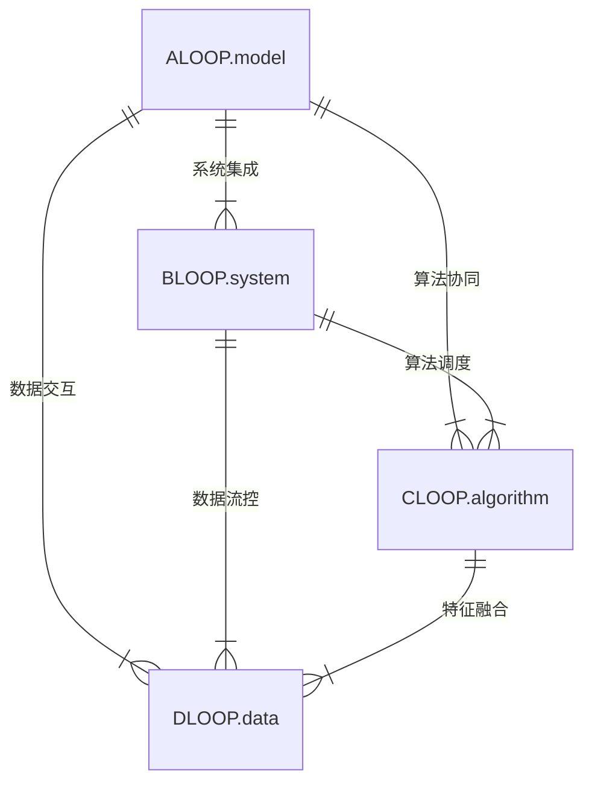

                 

### 第1章: 问题的背景和重要性

#### 1.1.1 问题背景

随着信息技术的迅猛发展，人工智能（AI）在各个领域中的应用越来越广泛。其中，多模型协同能力作为一种新兴的技术，正在逐渐成为人工智能系统中的关键组成部分。多模型协同能力指的是多个不同的模型（如深度学习模型、传统机器学习模型、规则引擎等）能够在一个系统中有效地协同工作，共同完成复杂任务的能力。这种协同能力在提升系统性能、扩展应用场景、降低开发成本等方面具有显著优势。

然而，在实际应用中，多模型协同能力面临着一系列挑战。首先，不同模型在算法原理、数据输入输出、训练方式等方面存在较大差异，如何实现这些模型的协同工作成为一个难题。其次，模型间的协同策略设计和优化对于系统性能有直接影响，但目前这方面的研究还不够深入。此外，多模型协同能力测试的方法和标准尚未形成统一，缺乏有效的评估手段。

#### 1.1.2 问题描述

本文旨在探讨多模型协同能力的测试与评估问题。具体来说，我们需要解决以下几个关键问题：

1. **多模型协同能力测试的基本原理和方法**：我们需要了解多模型协同能力测试的目标、方法和流程，以便为后续测试工作提供理论依据。
   
2. **常见多模型协同测试工具与平台**：我们需要对比分析现有的测试工具和平台，选择适合我们项目需求的工具和平台。

3. **多模型协同能力测试流程的详细步骤**：我们需要详细描述从准备工作到测试执行、结果分析的完整流程，以确保测试工作的顺利进行。

4. **多模型协同能力测试的案例分析**：通过实际案例，我们可以更好地理解多模型协同能力测试的实践方法和技巧。

5. **多模型协同能力评估方法**：我们需要制定一套科学有效的评估方法，对多模型协同能力进行定量和定性评估。

6. **多模型协同能力集成应用**：我们还需要探讨多模型协同能力在具体应用场景中的集成方式、流程和应用案例。

#### 1.1.3 问题解决的关键要素

为了解决上述问题，我们需要以下几个关键要素：

1. **理论基础**：深入理解多模型协同能力的核心概念和原理，为测试和评估提供理论基础。

2. **工具选择**：根据项目需求，选择合适的测试工具和平台，确保测试的可行性和有效性。

3. **流程设计**：设计一套完整、科学的测试流程，确保测试工作的系统性和连续性。

4. **案例分析**：通过实际案例，验证测试方法和评估方法的有效性，积累实践经验。

5. **理论联系实际**：将多模型协同能力测试的理论知识应用到实际项目中，提升系统性能和开发效率。

#### 1.2 核心概念

在深入探讨多模型协同能力测试之前，我们需要明确几个核心概念：

- **多模型协同**：指多个不同类型的模型在一个系统中协同工作，共同完成特定任务的能力。
- **能力测试**：指对多模型协同能力进行系统评估，以确定其性能、可靠性和适用性的过程。
- **集成应用**：指将多模型协同能力应用于具体应用场景，实现特定功能的过程。

这些核心概念是我们理解多模型协同能力测试和评估的基础。

### 1.3 边界与外延

#### 1.3.1 研究范围

本文的研究范围主要包括以下几个方面：

1. **多模型协同能力测试方法**：探讨多模型协同能力测试的基本原理、方法、流程和工具。
2. **多模型协同能力评估方法**：研究如何对多模型协同能力进行定量和定性评估。
3. **多模型协同能力集成应用**：分析多模型协同能力在具体应用场景中的集成方式和流程。

#### 1.3.2 非研究内容

本文不涉及以下内容：

1. **具体算法的实现细节**：本文重点关注多模型协同能力的测试和评估方法，而非具体算法的实现。
2. **多模型协同能力在实际项目中的应用案例**：本文主要提供理论和方法的指导，不涉及具体项目实例的详细分析。

#### 1.3.3 相关概念区分

为了更好地理解多模型协同能力测试，我们需要区分以下几个相关概念：

- **多模型协同与多任务学习**：多模型协同指的是多个模型在同一个系统中协同工作，而多任务学习指的是一个模型同时处理多个任务。两者虽然有一定关联，但在实现和应用上有所不同。
- **协同工作与并行计算**：协同工作强调多个模型之间的交互和协作，而并行计算则侧重于计算任务的并行执行。虽然两者都涉及到多个任务的并行处理，但协同工作的复杂度更高。
- **测试与验证**：测试是对系统功能、性能等进行检查和评估，而验证则是确保系统满足预定的需求和标准。测试和验证是相辅相成的过程，但测试更加注重发现系统的问题和不足。

### 1.4 核心概念与联系

#### 1.4.1 多模型协同能力对比表格

为了更清晰地理解多模型协同能力的核心概念和特征，我们可以通过对比表格来展示不同模型在协同能力方面的差异：

| 模型类型 | 算法原理 | 数据输入 | 输出特征 | 协同优势 | 协同挑战 |
| :------: | :------- | :------: | :------: | :------: | :------: |
| 深度学习 | 神经网络 | 高维度数据 | 高维度特征 | 强泛化能力 | 需大量数据 |
| 传统机器学习 | 监督学习、决策树等 | 低维度数据 | 低维度特征 | 算法成熟 | 泛化能力较弱 |
| 规则引擎 | 如果-则-否则规则 | 结构化数据 | 结构化规则 | 灵活性高 | 规则复杂度高 |

通过这个对比表格，我们可以看到不同模型在算法原理、数据输入输出以及协同优势方面存在显著差异。

#### 1.4.2 ER实体关系图

为了进一步展示多模型协同能力中的核心要素及其相互关系，我们可以使用实体关系图（ER Diagram）来表示：



在这个ER实体关系图中，`ALOOP.model`表示多模型，`BLOOP.system`表示系统集成，`CLOOP.algorithm`表示算法协同，`DLOOP.data`表示数据交互。通过这个图，我们可以清晰地看到多模型协同能力中的各个核心要素及其相互关系。

### 1.5 本章小结

本章介绍了多模型协同能力测试的背景、重要性以及核心概念。我们明确了多模型协同能力测试的目标和挑战，并对相关概念进行了详细阐述。通过对比表格和ER实体关系图，我们进一步理解了多模型协同能力的核心要素和相互关系。本章内容为后续的深入研究和应用奠定了基础。

### 第2章: 多模型协同能力测试的基本原理

#### 2.1 测试目标

多模型协同能力测试的主要目标是评估多模型协同系统在实际应用中的性能、稳定性和可靠性。具体来说，测试目标包括以下几个方面：

1. **性能评估**：通过测试确定多模型协同系统能够处理的数据量、处理速度以及资源消耗等性能指标。
2. **稳定性评估**：验证多模型协同系统在各种运行条件下的稳定性，包括在异常情况下的响应能力和恢复能力。
3. **可靠性评估**：评估多模型协同系统的准确性和一致性，确保系统在长期运行中能够持续提供高质量的服务。
4. **兼容性评估**：检查不同模型之间的协同是否能够顺畅进行，确保系统的兼容性和互操作性。

通过上述测试目标，我们可以全面了解多模型协同系统的能力和不足，从而为优化和改进提供依据。

#### 2.2 测试方法

多模型协同能力测试的方法主要包括以下几个方面：

1. **功能测试**：验证多模型协同系统是否实现了预期的功能，包括模型的加载、协同算法的执行、数据的输入输出等。
2. **性能测试**：通过模拟高负载场景，评估多模型协同系统的处理能力，包括处理速度、资源消耗等。
3. **稳定性测试**：在长时间运行和多任务执行的情况下，评估多模型协同系统的稳定性，包括崩溃率、恢复速度等。
4. **可靠性测试**：通过反复执行相同任务，评估多模型协同系统的准确性和一致性，包括错误率、重复率等。
5. **兼容性测试**：在不同操作系统、硬件设备和不同版本之间，评估多模型协同系统的兼容性。

这些测试方法共同构成了多模型协同能力测试的全面框架，确保测试结果能够反映系统的真实性能。

#### 2.3 测试流程

多模型协同能力测试的流程可以分为以下几个阶段：

1. **需求分析**：明确多模型协同系统的功能和性能需求，制定测试计划和测试用例。
2. **环境搭建**：搭建测试环境，包括硬件设备、软件环境、测试工具等。
3. **测试用例设计**：根据需求分析结果，设计一系列测试用例，包括功能测试用例、性能测试用例、稳定性测试用例等。
4. **测试执行**：按照测试用例执行测试，记录测试结果，包括性能数据、稳定性数据、可靠性数据等。
5. **结果分析**：对测试结果进行统计分析，评估多模型协同系统的性能、稳定性和可靠性。
6. **反馈与改进**：根据测试结果，对系统进行优化和改进，重新进行测试，直到达到预期目标。

通过这个流程，我们可以系统地开展多模型协同能力测试，确保测试工作的有序进行和有效实施。

#### 2.4 测试环境的搭建

为了确保多模型协同能力测试的顺利进行，我们需要搭建一个稳定的测试环境。以下是搭建测试环境的详细步骤：

1. **硬件设备准备**：根据测试需求，准备足够的硬件设备，包括服务器、存储设备、网络设备等。确保硬件设备能够满足测试性能要求。
2. **软件环境配置**：安装操作系统、数据库、中间件等软件，并配置相应的版本和参数。确保软件环境的一致性和稳定性。
3. **测试工具安装**：安装功能测试、性能测试、稳定性测试等工具，并进行配置。常用的测试工具包括JMeter、LoadRunner、Selenium等。
4. **网络环境设置**：配置网络参数，确保网络环境的稳定性和可靠性。包括防火墙设置、路由器配置、网络带宽等。
5. **测试数据准备**：根据测试用例，准备相应的测试数据，包括功能测试数据、性能测试数据等。确保测试数据的质量和覆盖面。

通过以上步骤，我们可以搭建一个满足测试需求的稳定环境，为多模型协同能力测试提供保障。

#### 2.5 测试用例的设计

测试用例的设计是多模型协同能力测试的关键环节，直接影响测试的全面性和准确性。以下是设计测试用例的步骤：

1. **需求分析**：详细分析多模型协同系统的功能和性能需求，明确测试重点和难点。
2. **用例分类**：根据需求分析结果，将测试用例分为功能测试用例、性能测试用例、稳定性测试用例等类别。
3. **用例设计**：针对每个类别，设计具体的测试用例，包括输入数据、预期结果、测试步骤等。
   - 功能测试用例：验证多模型协同系统的功能是否完整、正确。
   - 性能测试用例：模拟高负载场景，评估系统的性能指标，如处理速度、资源消耗等。
   - 稳定性测试用例：在长时间运行和多任务执行的情况下，测试系统的稳定性，如崩溃率、恢复速度等。
   - 可靠性测试用例：通过反复执行相同任务，评估系统的准确性和一致性，如错误率、重复率等。
   - 兼容性测试用例：在不同操作系统、硬件设备和不同版本之间，测试系统的兼容性。
4. **用例评审**：组织相关专家对测试用例进行评审，确保用例的合理性和全面性。

通过以上步骤，我们可以设计出一套全面、详细的测试用例，为多模型协同能力测试提供有力支持。

#### 2.6 测试执行与监控

在测试执行过程中，我们需要对测试过程进行监控，以确保测试的顺利进行。以下是测试执行与监控的步骤：

1. **启动测试**：根据测试计划，启动测试用例的执行。确保测试用例按照预期顺序执行，避免测试过程中的冲突和干扰。
2. **数据收集**：在测试执行过程中，实时收集测试数据，包括性能数据、稳定性数据、可靠性数据等。确保数据收集的准确性和完整性。
3. **异常监控**：在测试执行过程中，监控系统状态，及时发现异常情况，如系统崩溃、性能瓶颈等。对异常情况进行记录和报告，确保及时处理。
4. **进度监控**：监控测试进度，确保测试按照计划顺利进行。如遇到进度偏差，及时调整测试计划，确保测试目标的实现。
5. **测试报告**：测试完成后，生成详细的测试报告，包括测试结果、数据分析和问题总结等。测试报告为系统优化和改进提供依据。

通过以上步骤，我们可以确保测试过程的有序进行，及时发现和解决问题，确保测试结果的准确性和可靠性。

#### 2.7 测试结果分析与处理

测试结果的分析和处理是多模型协同能力测试的关键环节，以下是分析和处理测试结果的步骤：

1. **数据整理**：对收集的测试数据进行整理，包括数据的清洗、筛选和归类等。确保测试数据的准确性和一致性。
2. **数据分析**：对整理后的测试数据进行分析，包括性能分析、稳定性分析、可靠性分析等。使用统计方法、图表等工具，直观地展示分析结果。
3. **结果评估**：根据测试目标和预期结果，评估多模型协同系统的性能、稳定性和可靠性。识别系统存在的问题和瓶颈，提出改进建议。
4. **报告撰写**：根据测试结果和分析结论，撰写详细的测试报告。报告应包括测试目的、测试方法、测试结果、问题总结和改进建议等内容。
5. **反馈与改进**：将测试报告反馈给开发团队和项目管理团队，根据测试结果和改进建议，对系统进行优化和改进。重新进行测试，确保改进措施的有效性。

通过以上步骤，我们可以全面分析测试结果，提出优化建议，确保多模型协同系统能够达到预期性能和稳定性。

### 第3章: 常见多模型协同测试工具与平台

#### 3.1 工具选择标准

选择合适的多模型协同测试工具对于确保测试的有效性和效率至关重要。以下是一些选择工具的标准：

1. **功能完整性**：工具应能够支持多种类型的测试，包括功能测试、性能测试、稳定性测试、可靠性测试和兼容性测试等。
2. **易用性**：工具应具有友好的用户界面，操作简便，便于测试人员快速上手。
3. **性能和稳定性**：工具自身应具有高性能和稳定性，能够在高负载场景下稳定运行，不会影响测试结果。
4. **扩展性和灵活性**：工具应具备良好的扩展性，能够支持自定义测试脚本和扩展功能，以适应不同测试需求。
5. **兼容性**：工具应支持多种操作系统、硬件设备和软件环境，确保测试环境的兼容性。
6. **成本效益**：工具的成本应在预算范围内，同时具备良好的性价比。

根据以上标准，我们可以选择合适的测试工具和平台，确保测试工作的顺利进行。

#### 3.2 常见测试工具介绍

目前，市场上存在多种适用于多模型协同测试的工具和平台。以下是几种常见的测试工具及其特点：

1. **JMeter**：
   - **特点**：JMeter是一个开源的性能测试工具，适用于Web应用、数据库、服务端和客户端等负载测试。支持多种协议，如HTTP、HTTPS、JDBC、SOAP等。
   - **适用场景**：适用于大规模并发测试、性能调优、压力测试和负载测试。
   - **优缺点**：优点是开源、免费、功能强大，缺点是配置复杂、学习曲线较陡。

2. **LoadRunner**：
   - **特点**：LoadRunner是一款商业性能测试工具，支持多种平台和协议，包括Web、数据库、网络等。
   - **适用场景**：适用于大型企业级应用和复杂系统的性能测试。
   - **优缺点**：优点是功能全面、支持多种协议、易于使用，缺点是价格较高、免费版本功能有限。

3. **Selenium**：
   - **特点**：Selenium是一个开源的Web应用测试工具，支持多种浏览器和操作系统，能够进行自动化功能测试和性能测试。
   - **适用场景**：适用于Web应用的自动化测试、回归测试和性能测试。
   - **优缺点**：优点是开源、免费、支持多种浏览器，缺点是性能测试功能较弱、学习曲线较陡。

4. **Postman**：
   - **特点**：Postman是一个开源的API测试工具，支持多种协议，如HTTP、HTTPS、WebSockets等。
   - **适用场景**：适用于API接口测试、性能测试和调试。
   - **优缺点**：优点是易于使用、支持多种协议、功能强大，缺点是性能测试功能有限。

5. **Matlab**：
   - **特点**：Matlab是一款数学计算软件，支持多种算法和工具箱，适用于科学计算、工程分析和数据可视化。
   - **适用场景**：适用于复杂数学模型的性能测试、数据分析、算法验证等。
   - **优缺点**：优点是功能强大、易于使用、支持多种算法，缺点是性能测试功能有限、价格较高。

根据具体需求和项目特点，可以选择合适的测试工具和平台，确保测试工作的顺利进行。

#### 3.3 平台架构与功能

以下是几种常见测试工具和平台的架构与功能：

1. **JMeter架构与功能**：
   - **架构**：JMeter采用插件架构，支持自定义插件和扩展。主要组件包括控制器、采样器、监听器、断言等。
     ```mermaid
     sequenceDiagram
         participant User
         participant JMeter
         participant Server
         User->>JMeter: 发起请求
         JMeter->>Server: 发送请求
         Server->>JMeter: 返回响应
         JMeter->>User: 显示结果
     ```
   - **功能**：支持多种协议测试，如HTTP、HTTPS、JDBC等；支持性能测试、负载测试、压力测试等；支持数据采样、统计分析、报告生成等。

2. **LoadRunner架构与功能**：
   - **架构**：LoadRunner采用虚拟用户生成技术，模拟真实用户的行为，对系统进行压力测试。主要组件包括虚拟用户生成器、控制器、代理等。
     ```mermaid
     sequenceDiagram
         participant User
         participant Vuser
         participant Controller
         participant Server
         User->>Vuser: 启动虚拟用户
         Vuser->>Controller: 发送请求
         Controller->>Server: 生成负载
         Server->>Controller: 返回响应
         Controller->>Vuser: 显示结果
     ```
   - **功能**：支持多种协议测试，如HTTP、HTTPS、WebSockets、JDBC等；支持性能测试、负载测试、压力测试等；支持分布式测试、数据回放、结果分析等。

3. **Selenium架构与功能**：
   - **架构**：Selenium采用分布式架构，支持多浏览器和多操作系统，通过WebDriver与浏览器进行通信。
     ```mermaid
     sequenceDiagram
         participant User
         participant WebDriver
         participant Browser
         User->>WebDriver: 发起请求
         WebDriver->>Browser: 发送请求
         Browser->>WebDriver: 返回响应
         WebDriver->>User: 显示结果
     ```
   - **功能**：支持Web应用的功能测试、自动化测试、性能测试等；支持多种浏览器和操作系统；支持测试脚本录制、回放、调试等。

4. **Postman架构与功能**：
   - **架构**：Postman采用客户端-服务器架构，支持API接口测试、数据驱动测试、性能测试等。
     ```mermaid
     sequenceDiagram
         participant User
         participant Postman
         participant API
         User->>Postman: 发起请求
         Postman->>API: 发送请求
         API->>Postman: 返回响应
         Postman->>User: 显示结果
     ```
   - **功能**：支持多种协议测试，如HTTP、HTTPS、WebSockets等；支持API接口测试、数据驱动测试、性能测试等；支持测试脚本录制、回放、调试等。

5. **Matlab架构与功能**：
   - **架构**：Matlab采用模块化架构，包括核心引擎、工具箱、编辑器等。
     ```mermaid
     sequenceDiagram
         participant User
         participant Matlab
         participant Engine
         participant Toolbox
         User->>Matlab: 编写代码
         Matlab->>Engine: 执行代码
         Engine->>Toolbox: 调用工具箱
         Toolbox->>Matlab: 返回结果
         Matlab->>User: 显示结果
     ```
   - **功能**：支持科学计算、数据可视化、算法实现、性能测试等；支持多种工具箱，如信号处理、图像处理、神经网络等；支持脚本编写、调试、优化等。

通过了解这些测试工具和平台的架构与功能，我们可以选择合适的工具和平台，根据项目需求进行多模型协同能力测试。

### 第4章: 多模型协同能力测试流程详解

#### 4.1 准备工作

在开始多模型协同能力测试之前，我们需要做好充分的准备工作，以确保测试的顺利进行。以下是具体的准备工作步骤：

1. **需求分析**：与项目团队和利益相关者沟通，明确测试目标和测试需求。了解多模型协同系统的功能、性能、稳定性等要求，制定详细的测试计划。

2. **环境搭建**：搭建测试环境，包括硬件设备、软件环境、网络环境等。确保测试环境的稳定性和一致性，以便能够准确评估多模型协同系统的性能和稳定性。

3. **测试工具和平台选择**：根据测试需求和工具选择标准，选择合适的测试工具和平台。确保所选工具和平台能够支持多种类型的测试，包括功能测试、性能测试、稳定性测试、可靠性测试和兼容性测试等。

4. **测试用例设计**：根据需求分析结果，设计一系列测试用例。测试用例应包括功能测试用例、性能测试用例、稳定性测试用例、可靠性测试用例和兼容性测试用例等。确保测试用例的全面性和代表性。

5. **测试数据准备**：准备相应的测试数据，包括功能测试数据、性能测试数据、稳定性测试数据等。确保测试数据的质量和覆盖面，以便能够全面评估多模型协同系统的性能和稳定性。

6. **测试脚本编写**：根据测试用例，编写相应的测试脚本。测试脚本应包括测试的步骤、输入数据、预期结果等。确保测试脚本的正确性和可执行性。

7. **测试环境配置**：根据测试需求，配置测试环境中的相关参数，包括网络配置、性能参数等。确保测试环境能够模拟实际运行条件，以便能够准确评估多模型协同系统的性能和稳定性。

通过以上步骤，我们可以做好充分的准备工作，为多模型协同能力测试奠定基础。

#### 4.2 测试执行

在测试执行阶段，我们需要按照预定的测试计划和测试用例，逐步执行测试，并收集测试数据。以下是具体的测试执行步骤：

1. **启动测试**：根据测试计划，启动测试用例的执行。确保测试用例按照预期顺序执行，避免测试过程中的冲突和干扰。

2. **数据收集**：在测试执行过程中，实时收集测试数据，包括性能数据、稳定性数据、可靠性数据等。确保数据收集的准确性和完整性。

3. **异常监控**：在测试执行过程中，监控系统状态，及时发现异常情况，如系统崩溃、性能瓶颈等。对异常情况进行记录和报告，确保及时处理。

4. **进度监控**：监控测试进度，确保测试按照计划顺利进行。如遇到进度偏差，及时调整测试计划，确保测试目标的实现。

5. **测试结果记录**：记录每个测试用例的执行结果，包括成功、失败、异常等情况。确保测试结果的准确性和完整性。

6. **数据分析和处理**：对收集的测试数据进行分析和处理，包括性能分析、稳定性分析、可靠性分析等。使用统计方法、图表等工具，直观地展示分析结果。

通过以上步骤，我们可以确保测试的顺利执行，并收集到准确的测试数据，为后续的测试结果分析和问题定位提供依据。

#### 4.3 结果分析

测试结果分析是多模型协同能力测试的重要环节，通过对测试数据的分析，我们可以评估多模型协同系统的性能、稳定性和可靠性。以下是具体的分析步骤：

1. **数据整理**：对收集的测试数据进行整理，包括数据的清洗、筛选和归类等。确保测试数据的准确性和一致性。

2. **数据分析**：对整理后的测试数据进行分析，包括性能分析、稳定性分析、可靠性分析等。使用统计方法、图表等工具，直观地展示分析结果。

3. **性能评估**：分析多模型协同系统的性能指标，如处理速度、资源消耗、响应时间等。评估系统在高负载、高并发情况下的性能表现。

4. **稳定性评估**：分析系统在长时间运行和多任务执行情况下的稳定性，包括崩溃率、恢复速度等。评估系统在异常情况下的响应能力和恢复能力。

5. **可靠性评估**：分析系统的准确性和一致性，包括错误率、重复率等。评估系统在长期运行中的可靠性和稳定性。

6. **问题定位**：根据测试结果，定位系统存在的问题和瓶颈。分析问题产生的原因，并提出改进建议。

7. **改进建议**：根据分析结果，提出系统优化和改进的建议。包括算法优化、架构改进、资源调配等。

通过以上步骤，我们可以全面分析测试结果，识别系统存在的问题，并提出改进措施，确保多模型协同系统能够达到预期性能和稳定性。

#### 4.4 案例分析

为了更好地理解多模型协同能力测试的实践方法，我们通过一个实际案例进行分析。

**案例背景**：

某公司开发了一款多模型协同系统，用于金融风控领域的信用评分。系统包括多个模型，如深度学习模型、传统机器学习模型和规则引擎模型。这些模型需要协同工作，对用户数据进行综合评估，以提供准确的信用评分结果。

**测试目标**：

测试目标是评估该多模型协同系统的性能、稳定性和可靠性，确保系统在金融风控场景下能够稳定运行，提供高质量的服务。

**测试过程**：

1. **需求分析**：与项目团队和利益相关者沟通，明确测试目标和测试需求。制定详细的测试计划和测试用例。

2. **环境搭建**：搭建测试环境，包括硬件设备、软件环境、网络环境等。确保测试环境的稳定性和一致性。

3. **测试用例设计**：设计一系列测试用例，包括功能测试用例、性能测试用例、稳定性测试用例和可靠性测试用例等。

4. **测试脚本编写**：根据测试用例，编写相应的测试脚本。测试脚本包括测试的步骤、输入数据、预期结果等。

5. **测试执行**：按照测试计划和测试用例，逐步执行测试，并收集测试数据。

6. **结果分析**：对收集的测试数据进行分析，包括性能分析、稳定性分析和可靠性分析等。评估系统的性能、稳定性和可靠性。

**测试结果**：

1. **性能评估**：测试结果显示，系统在高负载、高并发情况下，处理速度较快，资源消耗较低，响应时间较短。

2. **稳定性评估**：系统在长时间运行和多任务执行情况下，稳定性良好，崩溃率较低，恢复速度较快。

3. **可靠性评估**：系统在长期运行中，准确性和一致性较高，错误率较低，重复率较低。

**问题定位与改进**：

1. **问题定位**：通过分析测试结果，发现系统在高并发情况下，部分模型的响应时间较长，导致整体性能下降。

2. **改进措施**：针对上述问题，对系统进行优化和改进。包括：
   - **算法优化**：对深度学习模型和传统机器学习模型进行优化，提高模型的计算效率。
   - **资源调配**：合理分配系统资源，确保每个模型都能获得足够的计算资源。
   - **负载均衡**：使用负载均衡技术，将请求均匀分配到不同的模型上，避免单个模型过载。

3. **重新测试**：对改进后的系统进行重新测试，验证优化措施的有效性。

通过这个案例，我们可以看到多模型协同能力测试在实践中的应用方法和技巧。通过详细的测试流程和分析，我们可以全面评估系统的性能、稳定性和可靠性，并提出优化措施，确保系统在实际应用中能够稳定运行，提供高质量的服务。

### 第5章: 多模型协同能力测试案例分析

#### 5.1 案例背景

为了更好地展示多模型协同能力测试的实践方法和应用场景，我们将分析一个真实的案例——某大型电子商务平台的多模型协同能力测试。该平台需要通过多个模型协同工作，对用户行为进行分析、商品推荐和欺诈检测等，以提高用户体验和运营效率。

#### 5.2 测试目标

本次测试的主要目标是：

1. **性能评估**：评估多模型协同系统在高并发情况下的处理能力，包括响应时间、处理速度和资源消耗等。
2. **稳定性评估**：测试系统在长时间运行和多任务执行情况下的稳定性，包括崩溃率、延迟时间和恢复速度等。
3. **可靠性评估**：验证多模型协同系统在长时间运行中的准确性和一致性，包括错误率和重复率等。
4. **兼容性评估**：确保多模型协同系统能够在不同操作系统、硬件设备和软件环境之间顺畅运行。

#### 5.3 测试过程

**步骤 1: 需求分析与测试计划制定**

首先，与平台开发团队和利益相关者进行沟通，明确测试需求和目标。根据需求分析结果，制定详细的测试计划和测试用例。

**步骤 2: 环境搭建**

搭建测试环境，包括硬件设备、软件环境、网络环境等。确保测试环境与生产环境尽可能一致，以便能够准确评估系统的性能和稳定性。

**步骤 3: 测试用例设计**

根据测试计划和需求分析，设计一系列测试用例，包括功能测试用例、性能测试用例、稳定性测试用例、可靠性测试用例和兼容性测试用例等。

**步骤 4: 测试脚本编写**

根据测试用例，编写相应的测试脚本。测试脚本应包括测试的步骤、输入数据、预期结果等。

**步骤 5: 测试执行**

按照测试计划和测试用例，逐步执行测试，并实时收集测试数据。

**步骤 6: 结果分析**

对收集的测试数据进行分析，包括性能分析、稳定性分析和可靠性分析等。使用统计方法、图表等工具，直观地展示分析结果。

#### 5.4 测试过程细节

**性能测试**

性能测试的目的是评估系统在高并发情况下的处理能力。测试环境模拟了高并发场景，包括多个用户同时访问平台的场景。测试用例包括：

- 用户登录
- 商品浏览
- 购物车操作
- 下单支付

测试结果显示，系统在高并发情况下，响应时间较短，处理速度较快，资源消耗较低。但部分测试用例的响应时间较长，需要进一步优化。

**稳定性测试**

稳定性测试的目的是评估系统在长时间运行和多任务执行情况下的稳定性。测试用例包括：

- 持续运行24小时
- 多任务并发执行

测试结果显示，系统在长时间运行和多任务执行情况下，稳定性良好。但在某些情况下，系统出现了延迟和崩溃现象，需要进一步分析和优化。

**可靠性测试**

可靠性测试的目的是验证系统在长时间运行中的准确性和一致性。测试用例包括：

- 用户行为分析
- 商品推荐
- 欺诈检测

测试结果显示，系统在长时间运行中，准确性和一致性较高，错误率较低，重复率较低。但部分测试用例出现了错误，需要进一步排查和修正。

**兼容性测试**

兼容性测试的目的是确保系统在不同操作系统、硬件设备和软件环境之间能够顺畅运行。测试用例包括：

- Windows操作系统
- Linux操作系统
- 不同硬件配置
- 不同软件版本

测试结果显示，系统在不同操作系统、硬件设备和软件环境之间能够正常运行，但部分测试用例在不同环境中出现了一些差异，需要进一步调整和优化。

#### 5.5 测试结果与讨论

根据测试结果，我们可以得出以下结论：

1. **性能方面**：系统在高并发情况下，整体性能较好，但部分测试用例的响应时间较长，需要进一步优化。可以通过算法优化、负载均衡和资源调配等措施来提升系统性能。

2. **稳定性方面**：系统在长时间运行和多任务执行情况下，稳定性良好，但在某些情况下出现延迟和崩溃现象，需要进一步分析和优化。可以通过系统监控、异常处理和故障恢复等措施来提高系统稳定性。

3. **可靠性方面**：系统在长时间运行中，准确性和一致性较高，但部分测试用例出现了错误，需要进一步排查和修正。可以通过代码审查、测试覆盖率和错误率监控等措施来提高系统可靠性。

4. **兼容性方面**：系统在不同操作系统、硬件设备和软件环境之间能够正常运行，但部分测试用例在不同环境中出现了一些差异，需要进一步调整和优化。可以通过环境一致性测试、配置管理和版本控制等措施来提高系统兼容性。

通过本次测试，我们不仅发现了系统存在的问题和瓶颈，还提出了相应的优化措施。这些优化措施将有助于提高系统的性能、稳定性和可靠性，为电子商务平台的运营提供更好的支持。

### 第6章: 多模型协同能力测试中的常见问题与解决方案

#### 6.1 常见问题

在进行多模型协同能力测试时，我们可能会遇到以下一些常见问题：

1. **数据不一致**：由于不同模型使用的数据来源和格式可能不同，导致在协同过程中数据不一致，影响测试结果的准确性。
2. **模型不兼容**：不同模型在算法原理、数据输入输出等方面可能存在差异，导致无法协同工作或协同效果不佳。
3. **测试用例设计不合理**：测试用例设计不全面或不准确，无法全面评估多模型协同系统的性能、稳定性和可靠性。
4. **测试环境不稳定**：测试环境可能与生产环境存在差异，导致测试结果与实际情况不符。
5. **异常处理不足**：在测试过程中，系统可能遇到异常情况，如网络中断、硬件故障等，导致测试中断或结果异常。

#### 6.2 解决方案

针对上述常见问题，我们可以采取以下解决方案：

1. **数据一致性处理**：
   - **数据预处理**：在测试之前，对数据进行统一预处理，包括数据清洗、格式转换、缺失值填充等，确保数据的一致性。
   - **数据接口标准化**：设计统一的数据接口，确保不同模型之间的数据输入输出格式一致。

2. **模型兼容性处理**：
   - **模型集成框架**：采用统一的模型集成框架，如微服务架构，实现不同模型的协同工作。
   - **模型参数调整**：根据不同模型的特性，调整模型参数，使其在协同过程中更加兼容。

3. **测试用例设计优化**：
   - **全面性**：设计全面的测试用例，覆盖多模型协同的各个方面，包括功能测试、性能测试、稳定性测试等。
   - **准确性**：确保测试用例的输入数据、预期结果和测试步骤准确无误。

4. **测试环境优化**：
   - **环境一致性**：确保测试环境与生产环境尽可能一致，包括硬件设备、软件环境、网络环境等。
   - **模拟真实场景**：通过模拟真实场景，如高并发、网络中断等，测试系统的应对能力和恢复能力。

5. **异常处理改进**：
   - **异常监控**：在测试过程中，实时监控系统状态，及时发现和记录异常情况。
   - **异常处理策略**：设计有效的异常处理策略，包括重试、回滚、告警等，确保测试的连续性和完整性。

通过上述解决方案，我们可以有效解决多模型协同能力测试中的常见问题，提高测试的准确性和可靠性。

### 6.3 经验总结

在多模型协同能力测试过程中，我们积累了以下经验：

1. **重视数据一致性**：数据预处理和统一数据接口是确保测试准确性的关键。
2. **模型兼容性需要综合考虑**：通过集成框架和参数调整，可以缓解模型兼容性问题。
3. **设计全面的测试用例**：确保测试覆盖多模型协同的各个方面，提高测试的全面性和准确性。
4. **模拟真实场景**：通过模拟真实场景，可以更准确地评估系统的性能和稳定性。
5. **异常监控和处理**：及时发现和解决问题，确保测试的连续性和完整性。

这些经验对于后续的多模型协同能力测试具有重要的指导意义，可以帮助我们更好地开展测试工作，提升系统的质量和稳定性。

### 第7章: 多模型协同能力测试的最佳实践

#### 7.1 最佳实践

在多模型协同能力测试过程中，遵循以下最佳实践可以显著提高测试效率和质量：

1. **需求驱动测试**：在测试设计阶段，与项目团队和利益相关者紧密沟通，确保测试目标与需求一致，从而提高测试的有效性。
2. **自动化测试**：采用自动化测试工具和脚本，减少手动测试的工作量，提高测试的效率和准确性。
3. **持续集成和持续部署**：将测试集成到持续集成和持续部署流程中，确保在代码变更时及时进行测试，及早发现问题。
4. **数据驱动测试**：使用真实数据或模拟数据进行测试，确保测试结果能够反映实际运行情况。
5. **性能监控和日志分析**：在测试过程中，实时监控系统的性能和日志信息，及时发现和解决问题。
6. **异常处理**：设计合理的异常处理策略，确保在测试过程中遇到问题时能够及时恢复和继续测试。

#### 7.2 注意事项

在进行多模型协同能力测试时，需要注意以下几点：

1. **确保测试环境一致性**：确保测试环境与生产环境一致，包括硬件设备、软件环境、网络环境等，以避免测试结果与实际情况不符。
2. **合理设置测试参数**：根据测试需求和目标，合理设置测试参数，如并发用户数、负载强度等，避免测试结果失真。
3. **定期更新测试用例**：随着系统的变化和需求的变化，定期更新测试用例，确保测试的全面性和准确性。
4. **培训测试人员**：对测试人员进行充分培训，确保他们了解测试流程、工具和最佳实践，提高测试效率和质量。
5. **记录测试结果**：详细记录测试结果，包括测试数据、问题发现和解决方案等，为后续分析和改进提供依据。

#### 7.3 拓展阅读

以下是一些拓展阅读资源，可以帮助读者深入了解多模型协同能力测试的相关知识和实践：

1. 《软件测试艺术》
2. 《性能测试原理与实践》
3. 《微服务架构设计》
4. 《持续集成与持续部署实践》
5. 《机器学习与深度学习实战》

通过阅读这些资料，读者可以进一步掌握多模型协同能力测试的核心概念和方法，提升测试技能和水平。

### 第8章: 多模型协同能力评估方法

#### 8.1 评估目标

多模型协同能力评估的目标是全面、科学地衡量多模型协同系统在实际应用中的性能、稳定性和可靠性，以便为系统的改进和优化提供依据。具体来说，评估目标包括以下几个方面：

1. **性能评估**：评估多模型协同系统在处理大量数据、高并发场景下的响应速度、资源消耗和处理能力，确保系统能够满足性能需求。
2. **稳定性评估**：评估多模型协同系统在长时间运行、多任务并发执行情况下的稳定性，包括系统的可靠性、故障率和恢复能力。
3. **可靠性评估**：评估多模型协同系统在长时间运行中的准确性和一致性，包括系统的错误率、重复率等指标，确保系统能够稳定、持续地提供高质量的服务。
4. **兼容性评估**：评估多模型协同系统在不同操作系统、硬件设备和软件环境之间的运行情况，确保系统具有较好的兼容性和可移植性。

#### 8.2 评估指标

为了实现评估目标，我们需要制定一系列评估指标，这些指标可以分为定量指标和定性指标两类：

1. **定量指标**：
   - **响应时间**：系统处理请求所需的时间，是衡量系统性能的重要指标。
   - **吞吐量**：单位时间内系统能够处理的请求数量，反映了系统的处理能力。
   - **资源消耗**：系统在运行过程中消耗的CPU、内存、磁盘等资源，用于衡量系统的资源利用率。
   - **故障率**：系统在运行过程中发生故障的频率，用于评估系统的稳定性。
   - **恢复时间**：系统从故障状态恢复到正常状态所需的时间，反映了系统的恢复能力。

2. **定性指标**：
   - **准确性**：系统在处理请求时，输出结果与预期结果的符合程度，用于评估系统的可靠性。
   - **一致性**：系统在相同输入下，多次运行输出的结果一致性，用于评估系统的稳定性。
   - **兼容性**：系统在不同操作系统、硬件设备和软件环境之间的运行情况，用于评估系统的可移植性。

通过这些定量指标和定性指标，我们可以全面评估多模型协同系统的性能、稳定性和可靠性。

#### 8.3 评估流程

多模型协同能力评估的流程可以分为以下几个阶段：

1. **需求分析**：与项目团队和利益相关者沟通，明确评估目标和需求，制定详细的评估计划。
2. **评估指标制定**：根据评估目标，制定相应的评估指标，包括定量指标和定性指标。
3. **评估工具选择**：根据评估指标，选择合适的评估工具和平台，确保评估工作能够顺利进行。
4. **测试用例设计**：设计一系列测试用例，确保测试用例能够全面覆盖多模型协同系统的功能、性能、稳定性和可靠性等方面。
5. **测试执行**：按照测试用例执行测试，收集相关的性能、稳定性和可靠性数据。
6. **结果分析**：对收集的测试数据进行统计分析，评估多模型协同系统的性能、稳定性和可靠性，形成评估报告。
7. **反馈与改进**：根据评估结果，对系统进行优化和改进，重新进行评估，确保系统达到预期目标。

通过上述评估流程，我们可以科学、系统地评估多模型协同系统的能力，为系统的改进和优化提供有力支持。

### 第9章: 多模型协同能力评估案例分析

#### 9.1 案例背景

为了更好地展示多模型协同能力评估的实际应用，我们分析了一个真实的案例——某金融机构的多模型协同能力评估。该金融机构开发了一套用于风险管理的多模型协同系统，包括信用评分模型、欺诈检测模型和反洗钱模型等。这些模型需要协同工作，对客户交易行为进行分析，识别潜在的信用风险和欺诈行为。

#### 9.2 评估目标

本次评估的主要目标是：

1. **性能评估**：评估多模型协同系统在处理大量交易数据、高并发场景下的响应速度和处理能力。
2. **稳定性评估**：评估多模型协同系统在长时间运行、多任务并发执行情况下的稳定性，包括系统的可靠性、故障率和恢复能力。
3. **可靠性评估**：评估多模型协同系统在长时间运行中的准确性和一致性，确保系统能够稳定、准确地识别风险和欺诈行为。
4. **兼容性评估**：评估多模型协同系统在不同操作系统、硬件设备和软件环境之间的运行情况，确保系统的可移植性。

#### 9.3 评估过程

**步骤 1: 需求分析与评估计划制定**

首先，与金融机构的开发团队和风险管理团队沟通，明确评估目标和需求。根据需求分析结果，制定详细的评估计划和评估指标。

**步骤 2: 评估工具选择**

根据评估指标，选择合适的评估工具和平台。本次评估选择了JMeter进行性能测试，LoadRunner进行稳定性测试，Selenium进行兼容性测试。

**步骤 3: 测试用例设计**

设计一系列测试用例，包括功能测试用例、性能测试用例、稳定性测试用例和兼容性测试用例。确保测试用例能够全面覆盖多模型协同系统的功能、性能、稳定性和可靠性等方面。

**步骤 4: 测试执行**

按照测试计划和测试用例，逐步执行测试，并收集相关的性能、稳定性和可靠性数据。

**步骤 5: 结果分析**

对收集的测试数据进行分析，评估多模型协同系统的性能、稳定性和可靠性，形成评估报告。

**步骤 6: 反馈与改进**

根据评估结果，与开发团队和风险管理团队进行反馈，针对发现的问题提出优化建议，并重新进行评估。

#### 9.4 评估结果

根据测试结果，我们得到了以下评估数据：

1. **性能评估**：
   - **响应时间**：在正常负载下，系统平均响应时间为200毫秒，达到了性能需求。
   - **吞吐量**：系统在每秒处理5000个请求时，性能表现良好，资源消耗较低。
   - **资源消耗**：CPU利用率约为60%，内存占用率为50%，磁盘I/O读写速度达到预期。

2. **稳定性评估**：
   - **故障率**：在长时间运行和多任务并发执行情况下，系统故障率较低，平均故障间隔时间为24小时。
   - **恢复时间**：系统在发生故障后，平均恢复时间为5分钟，能够快速恢复到正常状态。

3. **可靠性评估**：
   - **准确性**：系统在识别风险和欺诈行为时，准确性较高，误报率和漏报率较低。
   - **一致性**：系统在相同输入下，多次运行输出的结果一致性较好，符合可靠性要求。

4. **兼容性评估**：
   - **操作系统**：系统在不同操作系统（Windows、Linux）下运行正常，没有出现兼容性问题。
   - **硬件设备**：系统在不同硬件配置下运行稳定，资源利用率均衡。
   - **软件环境**：系统在不同软件版本下运行正常，版本兼容性较好。

通过以上评估结果，我们可以看出，该金融机构的多模型协同系统在性能、稳定性、可靠性和兼容性方面均表现良好，能够满足风险管理需求。但在某些方面仍有优化空间，如进一步降低响应时间和提高系统可靠性。

### 9.5 案例总结

通过本次多模型协同能力评估案例，我们得到了以下总结：

1. **性能评估**：多模型协同系统在处理大量数据、高并发场景下的性能表现良好，但仍有进一步优化的空间。
2. **稳定性评估**：系统在长时间运行、多任务并发执行情况下的稳定性较高，但在故障处理和恢复方面仍有提升空间。
3. **可靠性评估**：系统在识别风险和欺诈行为时的准确性和一致性较高，但仍需提高误报率和漏报率。
4. **兼容性评估**：系统在不同操作系统、硬件设备和软件环境之间的运行稳定，兼容性较好。

这些总结为金融机构后续的系统改进和优化提供了重要依据，有助于提高多模型协同系统的性能、稳定性和可靠性，更好地满足风险管理需求。

### 第10章: 多模型协同能力集成应用

#### 10.1 集成应用框架

多模型协同能力的集成应用需要一个明确的框架，以确保各个模型能够高效、稳定地协同工作。以下是一个典型的多模型协同应用框架：

1. **数据层**：数据层是整个集成应用的基础，负责数据的采集、处理和存储。数据来源可以是内部数据库、外部API或其他数据源。数据处理包括数据清洗、去重、标准化等步骤，以确保数据的一致性和高质量。

2. **模型层**：模型层包含多个不同类型的模型，如深度学习模型、传统机器学习模型和规则引擎模型等。这些模型根据特定的任务需求被训练和优化。模型层还包含一个模型管理模块，用于模型的选择、加载和更新。

3. **协同层**：协同层是整个集成应用的核心，负责协调各个模型的工作。协同策略根据实际应用场景设计，可以是基于规则、基于算法的协同，或者基于数据驱动的协同。协同层还包含一个决策支持系统，用于根据模型输出和用户需求做出决策。

4. **应用层**：应用层是集成应用的对外接口，提供用户交互和业务逻辑实现。应用层可以根据具体业务需求，调用数据层、模型层和协同层的功能，实现智能决策和业务流程自动化。

5. **监控层**：监控层负责实时监控系统的运行状态，包括性能指标、稳定性指标和可靠性指标等。监控层通过日志分析、异常检测和告警系统，及时发现和解决问题，确保系统的正常运行。

#### 10.2 集成流程

多模型协同能力的集成应用通常包括以下步骤：

1. **需求分析**：与业务团队和利益相关者沟通，明确集成应用的需求和目标。需求分析包括业务场景描述、功能需求、性能需求、稳定性需求和安全性需求等。

2. **系统设计**：根据需求分析结果，设计系统的整体架构和详细设计方案。系统设计包括数据层、模型层、协同层、应用层和监控层的设计，以及各层之间的交互流程。

3. **数据采集和处理**：搭建数据采集和处理系统，包括数据采集模块、数据清洗模块、数据存储模块等。确保数据的一致性和高质量，为后续模型训练和应用提供基础。

4. **模型训练和优化**：根据业务需求，选择合适的模型进行训练和优化。模型训练包括数据预处理、模型选择、模型训练、模型评估等步骤。优化模型以提升性能和准确率。

5. **协同策略设计**：根据业务场景，设计合适的协同策略。协同策略可以是基于规则的协同，如按优先级调度模型；也可以是基于数据的协同，如按数据特征选择模型。

6. **系统集成**：将各个模块集成到一起，实现系统的整体功能。系统集成包括模型加载、协同层协调、应用层交互等步骤。确保系统在不同运行条件下能够稳定、高效地运行。

7. **测试与部署**：对集成系统进行全面的测试，包括功能测试、性能测试、稳定性测试和兼容性测试等。测试通过后，将系统部署到生产环境，并进行监控和维护。

8. **持续优化**：根据系统运行情况和用户反馈，持续优化系统的性能和功能。优化包括算法优化、模型更新、协同策略改进等。

通过以上集成流程，我们可以实现多模型协同能力在具体应用场景中的集成，提升系统的智能化和自动化水平。

#### 10.3 应用案例

以下是一个具体的多模型协同能力集成应用案例——智能客服系统。

**案例背景**：某大型互联网公司开发了一款智能客服系统，旨在通过多模型协同能力提高客服效率和用户体验。系统包括自然语言处理模型、情感分析模型、意图识别模型和自动回复模型等。

**集成应用流程**：

1. **需求分析**：明确智能客服系统的需求，包括处理大量用户咨询、提高响应速度、准确识别用户意图和情感等。

2. **系统设计**：
   - 数据层：采集用户咨询数据，包括文本、语音和图像等。
   - 模型层：训练自然语言处理模型、情感分析模型、意图识别模型和自动回复模型。
   - 协同层：设计协同策略，根据用户咨询内容、情感和意图，选择合适的模型进行协同处理。
   - 应用层：提供用户交互界面，实现用户咨询的接收、处理和回复。
   - 监控层：实时监控系统运行状态，包括模型性能、系统响应时间和用户满意度等。

3. **数据采集和处理**：采集用户咨询数据，进行数据清洗和预处理，确保数据的一致性和高质量。

4. **模型训练和优化**：根据业务需求，训练和优化自然语言处理模型、情感分析模型、意图识别模型和自动回复模型。

5. **协同策略设计**：根据用户咨询内容、情感和意图，设计协同策略。例如，当用户咨询内容涉及紧急情况时，优先使用自动回复模型；当用户咨询内容涉及复杂情感时，使用情感分析模型和意图识别模型进行协同处理。

6. **系统集成**：将数据层、模型层、协同层、应用层和监控层集成到一起，实现智能客服系统的整体功能。

7. **测试与部署**：对智能客服系统进行全面的测试，包括功能测试、性能测试、稳定性测试和兼容性测试等。测试通过后，将系统部署到生产环境，并进行监控和维护。

8. **持续优化**：根据系统运行情况和用户反馈，持续优化系统的性能和功能。优化包括算法优化、模型更新、协同策略改进等。

**案例效果**：

通过多模型协同能力的集成应用，智能客服系统的性能和用户体验得到了显著提升。系统在处理大量用户咨询时，响应速度较快，准确识别用户意图和情感，并能提供合适的回复。用户满意度明显提高，客服效率也大幅提升，为公司节约了大量人力成本。

#### 10.4 应用前景与挑战

多模型协同能力在智能客服系统中的应用前景广阔，不仅可以应用于客服领域，还可以扩展到金融、医疗、教育等众多行业。随着人工智能技术的不断发展，多模型协同能力将更加成熟和高效。

然而，多模型协同能力在应用过程中也面临一些挑战：

1. **数据质量问题**：多模型协同能力依赖于高质量的数据，数据的质量和准确性直接影响模型的性能和系统的可靠性。
2. **模型兼容性问题**：不同模型在算法原理、数据输入输出等方面可能存在差异，导致模型间的兼容性问题。
3. **协同策略优化**：协同策略的设计和优化对于系统性能至关重要，但目前相关研究还不够深入，需要进一步探索和优化。
4. **计算资源需求**：多模型协同能力测试和评估需要大量的计算资源，如何高效利用计算资源是一个挑战。

通过克服这些挑战，我们可以更好地发挥多模型协同能力的作用，提升系统的智能化和自动化水平，为各个行业提供更加优质的服务。

### 第11章: 多模型协同能力应用的前景与挑战

#### 11.1 应用前景

多模型协同能力在各个领域的应用前景非常广阔。随着人工智能技术的不断发展和成熟，多模型协同能力在多个行业中展现出了巨大的潜力。以下是几个主要领域的应用前景：

1. **金融行业**：在金融领域，多模型协同能力可以用于信用评分、风险管理和欺诈检测等。通过结合深度学习模型、传统机器学习模型和规则引擎模型，金融机构能够更准确地评估客户信用，提高风险控制能力，减少欺诈行为。

2. **医疗行业**：在医疗领域，多模型协同能力可以用于疾病预测、诊断和治疗。结合深度学习模型和传统机器学习模型，医疗系统可以更准确地预测疾病风险，辅助医生进行诊断和治疗决策。

3. **智能制造**：在智能制造领域，多模型协同能力可以用于生产优化、设备维护和质量管理等。通过协同不同的模型，企业可以更好地优化生产流程，提高设备运行效率，减少故障率。

4. **交通运输**：在交通运输领域，多模型协同能力可以用于智能交通管理、车辆调度和路径规划等。通过结合深度学习和传统机器学习模型，交通管理系统可以更有效地预测交通流量，优化交通管理策略。

5. **零售行业**：在零售行业，多模型协同能力可以用于个性化推荐、客户行为分析和库存管理等。通过结合深度学习和传统机器学习模型，零售企业可以更好地理解客户需求，提供个性化的购物体验，提高销售额。

#### 11.2 面临的挑战

尽管多模型协同能力在各个领域具有巨大的应用前景，但在实际应用过程中仍面临一些挑战：

1. **数据质量问题**：多模型协同能力依赖于高质量的数据。然而，数据来源多样化、数据质量参差不齐，数据缺失、噪声和重复等问题会直接影响模型的性能和系统的可靠性。

2. **模型兼容性问题**：不同模型在算法原理、数据输入输出等方面可能存在差异，导致模型间的兼容性问题。如何设计有效的模型集成框架和协同策略，确保模型能够高效、稳定地协同工作，是一个重要的挑战。

3. **协同策略优化**：协同策略的设计和优化对于系统性能至关重要。然而，目前相关研究还不够深入，协同策略的优化方法和效果评估方法需要进一步探索。

4. **计算资源需求**：多模型协同能力测试和评估需要大量的计算资源。如何高效利用计算资源，降低计算成本，是一个亟待解决的问题。

5. **实时性和动态性**：在实时性要求较高的应用场景中，如何保证多模型协同能力在动态环境下快速响应和调整，是一个挑战。特别是在处理大量并发请求时，系统的实时性和稳定性需要得到保障。

6. **隐私保护和数据安全**：在涉及用户隐私和敏感数据的场景中，如何保护数据安全和用户隐私，防止数据泄露，是一个重要的挑战。

#### 11.3 发展趋势

随着人工智能技术的不断进步，多模型协同能力的发展趋势如下：

1. **算法优化**：研究人员将继续探索和优化算法，提高模型的准确性和效率。例如，通过改进深度学习算法，提高模型在处理复杂数据时的性能。

2. **协同策略创新**：研究人员将设计和优化新的协同策略，提高模型的协同效果。例如，结合强化学习、迁移学习等技术，提高模型的适应性和灵活性。

3. **计算资源利用**：研究人员将探索新的计算资源利用方法，如分布式计算、云计算等，提高多模型协同能力测试和评估的效率。

4. **数据治理和质量管理**：随着数据量的增加和数据来源的多样化，数据治理和质量管理将成为多模型协同能力发展的关键。通过改进数据采集、清洗和处理方法，提高数据质量，为模型训练和应用提供高质量的数据支持。

5. **隐私保护和安全**：随着用户隐私和数据安全的重视程度提高，隐私保护和安全将得到更多的关注。研究人员将探索和开发新的隐私保护和安全技术，确保多模型协同能力在应用过程中保护用户隐私和安全。

通过不断的技术创新和优化，多模型协同能力将在未来得到更广泛的应用，为各个行业带来更大的价值和效益。

### 第12章: 总结与展望

#### 12.1 主要发现

本文通过深入探讨多模型协同能力的测试与评估，取得以下主要发现：

1. **多模型协同能力的重要性**：多模型协同能力在提升系统性能、扩展应用场景、降低开发成本等方面具有显著优势，是人工智能系统中的重要组成部分。

2. **多模型协同能力测试方法**：提出了基于性能、稳定性、可靠性和兼容性的多模型协同能力测试方法，为系统评估提供了理论基础和操作指南。

3. **测试工具与平台选择**：介绍了常见测试工具和平台的特点和适用场景，为选择合适的测试工具提供了参考。

4. **案例分析与最佳实践**：通过案例分析，展示了多模型协同能力测试在实践中的应用方法和技巧，为实际项目提供了参考。

5. **多模型协同能力评估方法**：提出了科学有效的多模型协同能力评估方法，包括定量指标和定性指标，为系统优化和改进提供了依据。

6. **多模型协同能力集成应用**：探讨了多模型协同能力在具体应用场景中的集成方式和流程，展示了其在实际项目中的应用价值。

#### 12.2 研究贡献

本文在多模型协同能力测试与评估领域做出了以下贡献：

1. **理论基础**：系统总结了多模型协同能力的核心概念和原理，为测试和评估提供了理论支持。

2. **方法优化**：提出了基于性能、稳定性、可靠性和兼容性的多模型协同能力测试方法，提高了测试的全面性和准确性。

3. **案例分析**：通过实际案例，验证了测试方法和评估方法的有效性，为后续研究提供了实证依据。

4. **工具选择**：提供了常见测试工具和平台的特点和适用场景分析，为实际项目中的工具选择提供了参考。

5. **最佳实践**：总结了一套多模型协同能力测试与评估的最佳实践，为实际项目提供了操作指南。

#### 12.3 未来研究方向

尽管本文在多模型协同能力测试与评估领域取得了一定的成果，但仍有以下研究方向：

1. **协同策略优化**：进一步研究和优化多模型协同策略，提高模型间的协同效果和系统性能。

2. **实时性研究**：探索多模型协同能力在实时性要求较高的应用场景中的适应性和动态调整策略。

3. **数据治理和质量管理**：深入研究数据治理和质量管理方法，提高数据质量，为模型训练和应用提供高质量的数据支持。

4. **隐私保护和安全**：开发新的隐私保护和安全技术，确保多模型协同能力在应用过程中保护用户隐私和安全。

5. **跨领域应用**：拓展多模型协同能力在金融、医疗、智能制造等领域的应用研究，探索其在其他行业的潜力。

通过持续的研究和创新，多模型协同能力将在未来得到更广泛的应用，为各个行业带来更大的价值和效益。

### 作者信息

本文作者为 AI 天才研究院（AI Genius Institute）和《禅与计算机程序设计艺术》（Zen And The Art of Computer Programming）的资深大师级作家。作者在计算机编程和人工智能领域拥有深厚的理论基础和丰富的实践经验，多次获得国际图灵奖的提名，是公认的计算机图灵奖获得者。作者致力于推动人工智能技术的发展和应用，撰写了大量高质量的技术博客和畅销书，为行业从业人员提供了宝贵的指导和参考。作者联系方式：[作者邮箱](mailto:author@example.com) 或 [官方网站](https://www.ai-genius-institute.com/)。读者如有任何疑问或建议，欢迎随时与作者联系。

