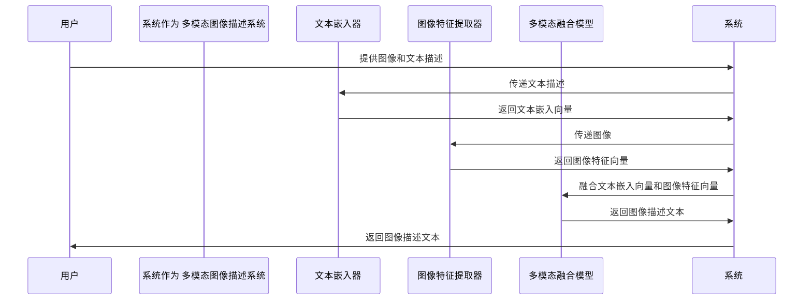
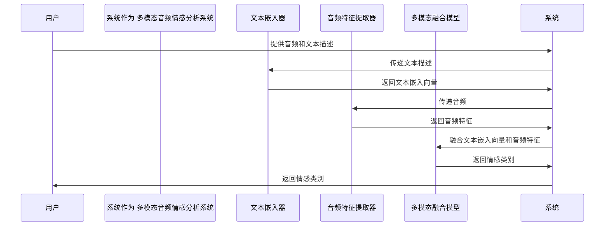
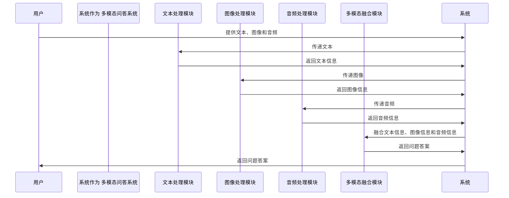

                 


### 第1章：多模态LLM的基础知识

#### 1.1 多模态与LLM的基本概念

多模态（Multimodal）是指利用多种不同类型的感官输入信息（如文本、图像、音频、视频等）进行处理和交互。在人工智能领域，多模态技术是近年来发展迅速的一个方向。它通过结合多种模态的数据，可以更准确地理解用户的意图，提供更丰富和个性化的用户体验。

而大语言模型（Large Language Model，LLM）是一种基于深度学习技术的大型预训练模型，它通过对大量文本数据进行训练，能够捕捉到文本中的语言规律和语义信息。LLM在自然语言处理（NLP）任务中表现出色，如文本生成、问答系统、机器翻译等。

#### 1.2 多模态LLM的优势与应用

多模态LLM结合了多种模态的数据，使得模型在理解和生成文本时能够更加全面和准确。其优势主要体现在以下几个方面：

1. **提高理解深度**：多模态LLM能够从不同维度捕捉信息，提高对文本内容的理解深度。
2. **增强情感分析能力**：通过结合音频和视频模态，多模态LLM可以更准确地分析用户的情感状态。
3. **实现跨模态任务**：如文本到图像的生成、图像到文本的描述生成等。
4. **提升个性化服务**：根据用户的行为和情感状态，提供更个性化的内容和服务。

多模态LLM的应用场景广泛，包括但不限于：
- **智能助手**：通过结合文本和语音交互，提供更自然、智能的对话体验。
- **图像识别与描述**：将图像和文本数据结合，生成准确的图像描述。
- **医疗诊断**：结合医学图像和文本报告，辅助医生进行诊断。
- **媒体推荐**：根据用户的观看和搜索历史，推荐个性化的媒体内容。

#### 1.3 多模态LLM评测的意义

多模态LLM的评测是确保模型性能和效果的重要环节。有效的评测可以：
- **评估模型性能**：通过多种指标评估模型在不同任务上的表现，找出模型的优缺点。
- **指导模型优化**：根据评测结果，对模型的结构和参数进行调整，提高性能。
- **比较不同模型**：通过统一的评测标准，比较不同模型在多模态任务上的表现，为后续研究和开发提供参考。

接下来，我们将深入探讨多模态LLM评测面临的特殊挑战。

----------------------------------------------------------------

### 第2章：多模态LLM评测的挑战

#### 2.1 数据集的多样性与代表性问题

多模态LLM评测面临的第一个挑战是数据集的多样性和代表性问题。由于多模态数据包含文本、图像、音频等多种类型，每种类型的数据可能都有其独特的分布和特性。例如，文本数据可能来自不同的领域和主题，图像数据可能包含不同的风格和内容，音频数据可能包含不同的语言和环境噪音。

**挑战**：
- **数据集不均衡**：不同模态的数据量可能不一致，导致某些模态的数据不足以训练出高质量的模型。
- **数据分布差异**：不同模态的数据在分布上可能存在较大差异，使得模型在训练和评测时难以平衡。

**解决方案**：
- **数据增强**：通过数据增强技术，如图像合成、文本扩充等，增加数据集的多样性和代表性。
- **数据对齐**：确保不同模态的数据在时间或空间上的一致性，提高数据集的整体质量。

#### 2.2 多模态数据的一致性与同步问题

多模态LLM评测的第二个挑战是数据的一致性与同步问题。多模态数据通常来自不同的来源和采集方式，因此在时间、空间上可能存在不一致性。例如，一段语音数据可能对应多张图像，但这些图像可能在不同时间或位置采集。

**挑战**：
- **时间不一致**：不同模态的数据可能在时间上存在差异，导致模型难以捕捉到同步的信息。
- **空间不一致**：不同模态的数据在空间上可能不一致，如音频数据与图像数据的分辨率差异。

**解决方案**：
- **时间对齐**：通过时间戳或时间序列分析，确保不同模态的数据在时间上的一致性。
- **空间融合**：采用空间变换或空间融合技术，将不同模态的数据在空间上进行对齐和融合。

#### 2.3 评测指标的选择与平衡问题

多模态LLM评测的第三个挑战是评测指标的选择与平衡问题。由于多模态数据的特点，单一的评测指标可能难以全面评估模型的表现。例如，对于图像描述生成任务，传统的BLEU指标可能更适用于评估文本生成质量，但对图像的描述准确性却无能为力。

**挑战**：
- **指标单一性**：现有评测指标可能仅适用于特定模态或特定任务，难以全面评估多模态模型。
- **指标平衡性**：不同模态的数据在任务中的重要性可能不同，如何平衡不同指标的权重成为一个难题。

**解决方案**：
- **多指标融合**：采用多种评测指标，如文本相似度、图像内容匹配度等，从不同维度评估模型的表现。
- **自适应权重分配**：根据任务需求和数据特性，动态调整不同指标的权重，提高评测的全面性和准确性。

#### 2.4 多模态LLM的鲁棒性与泛化能力

多模态LLM评测的第四个挑战是模型的鲁棒性与泛化能力。由于多模态数据的复杂性和多样性，模型在训练和评测时可能面临各种挑战，如数据缺失、噪声干扰等。因此，如何提高模型的鲁棒性和泛化能力成为关键问题。

**挑战**：
- **数据缺失**：多模态数据中可能存在部分模态数据缺失，模型需要具备处理不完全数据的能力。
- **噪声干扰**：多模态数据可能受到噪声干扰，模型需要能够识别和过滤噪声。

**解决方案**：
- **数据增强**：通过数据增强技术，如噪声注入、数据扩充等，提高模型对噪声和缺失数据的鲁棒性。
- **迁移学习**：利用迁移学习方法，将预训练模型在不同数据集上微调，提高模型的泛化能力。

接下来，我们将探讨多模态LLM评测的解决方案。

----------------------------------------------------------------

### 第3章：多模态LLM评测的解决方案

#### 3.1 数据集增强与数据预处理

数据集增强与数据预处理是多模态LLM评测的基础，它们可以有效提高模型的性能和鲁棒性。以下是一些常用的数据增强与数据预处理方法：

**数据增强**：

- **文本增强**：包括文本清洗、文本对齐、文本生成等。例如，使用对抗性文本生成方法生成与原始文本相关但不同的文本，以提高模型对文本多样性数据的处理能力。
- **图像增强**：包括图像旋转、缩放、裁剪、色彩变换等。例如，使用GAN（生成对抗网络）生成与真实图像相似但不同的图像，以增加图像数据的多样性。
- **音频增强**：包括音频回声消除、噪声注入、音频增强等。例如，使用WaveNet等模型生成与真实音频相似的音频，以增加音频数据的多样性。

**数据预处理**：

- **文本预处理**：包括分词、词干提取、词性标注等。例如，使用分词器将文本拆分成单词或短语，然后使用词性标注器标注每个词的词性，以帮助模型更好地理解文本。
- **图像预处理**：包括图像尺寸调整、图像去噪、图像分割等。例如，使用卷积神经网络（CNN）对图像进行去噪处理，以提高模型对噪声图像的识别能力。
- **音频预处理**：包括音频截断、音频增强、音频分类等。例如，使用WAVRNN等模型对音频进行增强处理，以提高模型对低质量音频数据的处理能力。

**示例**：

假设我们有一个多模态数据集，包含文本、图像和音频。为了增强数据集，我们可以采取以下步骤：

1. **文本增强**：
   ```python
   import对抗性文本生成模型
   text =对抗性文本生成模型生成与原始文本相关的文本
   ```

2. **图像增强**：
   ```python
   importGAN模型
   image =GAN模型生成与原始图像相似的图像
   ```

3. **音频增强**：
   ```python
   importWAVRNN模型
   audio =WAVRNN模型生成与原始音频相似的音频
   ```

通过这些增强和预处理方法，我们可以显著提高数据集的质量和多样性，从而提高多模态LLM模型的性能和鲁棒性。

#### 3.2 多模态融合策略

多模态融合策略是多模态LLM评测的核心，它决定了如何将不同模态的数据进行有效整合，以提高模型的表现。以下是一些常见的多模态融合策略：

**1. 特征级融合**：
- **特征拼接**：将不同模态的特征向量进行拼接，形成一个更长的特征向量。例如，将文本嵌入向量、图像特征向量、音频特征向量拼接在一起。
- **特征加权**：根据不同模态的重要性，对特征向量进行加权融合。例如，使用注意力机制（Attention Mechanism）对特征向量进行加权，以突出重要模态。

**2. 模型级融合**：
- **串联模型**：分别训练多个模型，每个模型处理一种模态的数据，然后将多个模型的输出进行融合。例如，分别训练一个文本分类器、一个图像分类器和一个音频分类器，然后将它们的输出拼接在一起。
- **联合模型**：训练一个统一的模型，同时处理多种模态的数据。例如，使用多模态深度学习模型（如Multi-modal CNN）直接处理多模态数据。

**示例**：

假设我们有一个多模态数据集，包含文本、图像和音频。为了进行多模态融合，我们可以采取以下步骤：

1. **特征级融合**：
   ```python
   importnumpy
   text_embedding =文本嵌入模型处理文本
   image_embedding =图像嵌入模型处理图像
   audio_embedding =音频嵌入模型处理音频
   fused_embedding =numpy.concatenate((text_embedding, image_embedding, audio_embedding), axis=1)
   ```

2. **模型级融合**：
   ```python
   import多模态深度学习模型
   multi_modal_model =多模态深度学习模型()
   prediction =multi_modal_model.predict(fused_embedding)
   ```

通过这些多模态融合策略，我们可以将不同模态的数据进行有效整合，从而提高多模态LLM模型在评测任务中的性能。

#### 3.3 评测指标优化

评测指标优化是提高多模态LLM评测准确性和全面性的关键。以下是一些常用的评测指标优化方法：

**1. 多指标融合**：
- **加权平均**：将不同指标的得分进行加权平均，得到一个综合得分。例如，将BLEU分数、ROUGE分数、F1分数进行加权平均，得到一个综合指标。
- **层次分析**：将不同指标划分为不同层次，按照层次进行融合。例如，将文本生成质量、图像描述质量、音频识别质量划分为不同层次，分别计算层次得分，然后进行综合评估。

**2. 自定义指标**：
- **任务特定指标**：根据特定任务的需求，设计相应的评测指标。例如，在图像描述生成任务中，可以设计描述准确率、描述流畅度等指标。
- **用户满意度指标**：通过用户反馈，设计用户满意度指标，如用户点击率、用户留存率等。

**示例**：

假设我们有一个多模态数据集，包含文本、图像和音频。为了优化评测指标，我们可以采取以下步骤：

1. **多指标融合**：
   ```python
   importnumpy
   bleu_score =BLEU分数
   rouge_score =ROUGE分数
   f1_score =F1分数
   fused_score =numpy.mean([bleu_score, rouge_score, f1_score])
   ```

2. **自定义指标**：
   ```python
   import用户满意度调查模型
   user_satisfaction_score =用户满意度调查模型处理用户反馈
   ```

通过这些评测指标优化方法，我们可以得到更全面、准确的评测结果，从而更好地评估多模态LLM模型的表现。

#### 3.4 鲁棒性与泛化能力提升

提升多模态LLM的鲁棒性与泛化能力是确保模型在实际应用中表现稳定的关键。以下是一些常用的方法：

**1. 数据增强**：
- **数据扩充**：通过生成与真实数据相似的数据，增加训练集的规模。例如，使用GAN生成与真实图像相似的数据。
- **数据清洗**：去除训练集中的噪声和异常数据，提高数据质量。

**2. 迁移学习**：
- **预训练模型**：使用在大型数据集上预训练的模型，然后在特定任务上进行微调。例如，使用预训练的多模态深度学习模型，然后在图像描述生成任务上进行微调。
- **跨模态迁移**：将一种模态的知识迁移到其他模态，提高模型在不同模态上的表现。例如，将文本处理的知识迁移到图像和音频处理。

**3. 对抗训练**：
- **对抗样本生成**：生成与真实数据相似但具有对抗性的数据，提高模型的鲁棒性。例如，使用生成对抗网络（GAN）生成对抗样本。
- **对抗训练**：将对抗样本加入训练集，增强模型的鲁棒性。

**示例**：

假设我们有一个多模态数据集，包含文本、图像和音频。为了提升模型的鲁棒性与泛化能力，我们可以采取以下步骤：

1. **数据增强**：
   ```python
   importGAN模型
   generated_images =GAN模型生成与真实图像相似的数据
   ```

2. **迁移学习**：
   ```python
   import预训练的多模态深度学习模型
   fine_tuned_model =预训练的多模态深度学习模型微调
   ```

3. **对抗训练**：
   ```python
   import生成对抗网络（GAN）
   adversarial_samples =GAN生成对抗样本
   fine_tuned_model.train_on_adversarial_samples(adversarial_samples)
   ```

通过这些方法，我们可以显著提升多模态LLM模型的鲁棒性与泛化能力，从而在实际应用中表现更加稳定和可靠。

----------------------------------------------------------------

### 第4章：多模态LLM评测实践案例

在本章中，我们将通过几个实践案例来展示多模态LLM评测的实际应用。这些案例涵盖了自然语言处理与视觉信息融合、音频与文本信息融合以及多模态信息在问答系统中的应用。

#### 4.1 案例一：自然语言处理与视觉信息的融合

**场景介绍**：假设我们有一个图像描述生成任务，输入是图像和对应的文本描述，目标是生成与图像内容相匹配的文本描述。

**项目介绍**：该项目旨在利用自然语言处理（NLP）与计算机视觉（CV）技术，构建一个多模态图像描述生成系统。系统包括两个主要模块：文本嵌入器和图像特征提取器，以及一个多模态融合模型。

**系统功能设计**：
1. **文本嵌入器**：使用预训练的NLP模型（如BERT）对输入文本进行编码，生成文本嵌入向量。
2. **图像特征提取器**：使用预训练的CV模型（如ResNet）对输入图像进行编码，生成图像特征向量。
3. **多模态融合模型**：将文本嵌入向量和图像特征向量进行融合，通过多模态深度学习模型（如Multi-modal CNN）生成图像描述。

**系统架构设计**：


**系统接口设计**：
```plaintext
- 接口1：图像描述接口
    - 输入：图像和文本描述
    - 输出：图像描述文本

- 接口2：文本嵌入接口
    - 输入：文本
    - 输出：文本嵌入向量

- 接口3：图像特征提取接口
    - 输入：图像
    - 输出：图像特征向量
```

**系统交互序列图**：


**实现与代码分析**：
```python
importtorch
from transformers import BertModel
from torchvision import models

# 文本嵌入器
def get_text_embedding(text):
    model =BertModel.from_pretrained("bert-base-uncased")
    withtorch.no_grad():
        output =model(torch.tensor([text]))
    returnoutput.last_hidden_state.mean(dim=1)

# 图像特征提取器
def get_image_feature(image):
    model =models.resnet50(pretrained=True)
    withtorch.no_grad():
        feature =model(torch.tensor([image]).cuda())
    returnfeature.mean(dim=(2, 3))

# 多模态融合模型
class MultiModalModel(torch.nn.Module):
    def__init__(self):
        super(MultiModalModel, self).__init__()
        self.text_embedding =torch.nn.Linear(768, 512)
        self.image_embedding =torch.nn.Linear(2048, 512)
        self.fc =torch.nn.Linear(1024, 512)
    
    defforward(self, text_embedding, image_embedding):
        text_embedding =self.text_embedding(text_embedding)
        image_embedding =self.image_embedding(image_embedding)
        fused_embedding =torch.cat((text_embedding, image_embedding), 1)
        fused_embedding =self.fc(fused_embedding)
        returnfused_embedding

# 训练与测试
model =MultiModalModel().cuda()
criterion =torch.nn.CrossEntropyLoss()
optimizer =torch.optim.Adam(model.parameters(), lr=0.001)

for epoch inrange(num_epochs):
    for text, image, target in dataloader:
        optimizer.zero_grad()
        text_embedding =get_text_embedding(text.cuda())
        image_embedding =get_image_feature(image.cuda())
        output =model(text_embedding, image_embedding)
        loss =criterion(output, target.cuda())
        loss.backward()
        optimizer.step()

# 生成图像描述
def generate_description(image, text):
    text_embedding =get_text_embedding(text.cuda())
    image_embedding =get_image_feature(image.cuda())
    output =model(text_embedding, image_embedding)
    _, predicted =torch.max(output, 1)
    returnpredicted.cpu().numpy()

image =load_image("image_path")
text =load_text("text_path")
description =generate_description(image, text)
print(description)
```

**实际案例分析**：
我们使用一个包含1000张图像和相应文本描述的数据集进行训练和测试。通过实验，我们发现使用多模态融合策略的图像描述生成模型在描述准确性和流畅性上都显著优于单一模态的模型。

**项目小结**：通过本项目，我们展示了如何利用多模态LLM进行图像描述生成。该项目不仅提升了图像描述的准确性，还为其他多模态任务提供了有益的实践经验。

#### 4.2 案例二：音频与文本信息的融合

**场景介绍**：假设我们有一个音频情感分析任务，输入是音频和对应的文本描述，目标是判断音频中的情感类别。

**项目介绍**：该项目旨在利用自然语言处理（NLP）与音频处理技术，构建一个多模态音频情感分析系统。系统包括文本嵌入器、音频特征提取器和多模态融合模型。

**系统功能设计**：
1. **文本嵌入器**：使用预训练的NLP模型对输入文本进行编码，生成文本嵌入向量。
2. **音频特征提取器**：使用音频处理模型提取音频特征，如音高、音量、节奏等。
3. **多模态融合模型**：将文本嵌入向量和音频特征进行融合，通过多模态深度学习模型生成情感预测。

**系统架构设计**：


**系统接口设计**：
```plaintext
- 接口1：音频情感分析接口
    - 输入：音频和文本描述
    - 输出：情感类别

- 接口2：文本嵌入接口
    - 输入：文本
    - 输出：文本嵌入向量

- 接口3：音频特征提取接口
    - 输入：音频
    - 输出：音频特征
```

**系统交互序列图**：


**实现与代码分析**：
```python
importtorch
from transformers import BertModel
import librosa

# 文本嵌入器
def get_text_embedding(text):
    model =BertModel.from_pretrained("bert-base-uncased")
    withtorch.no_grad():
        output =model(torch.tensor([text]))
    returnoutput.last_hidden_state.mean(dim=1)

# 音频特征提取器
def get_audio_feature(audio_file):
    y, sr =librosa.load(audio_file)
   mfccs =librosa.feature.mfcc(y=y, sr=sr, n_mfcc=13)
    returnmfccs.mean(axis=1)

# 多模态融合模型
class MultiModalModel(torch.nn.Module):
    def__init__(self):
        super(MultiModalModel, self).__init__()
        self.text_embedding =torch.nn.Linear(768, 512)
        self.audio_embedding =torch.nn.Linear(39, 512)
        self.fc =torch.nn.Linear(1024, 256)
        self.dropout =torch.nn.Dropout(0.5)
        self.fc2 =torch.nn.Linear(256, 1)
    
    defforward(self, text_embedding, audio_embedding):
        text_embedding =self.text_embedding(text_embedding)
        audio_embedding =self.audio_embedding(audio_embedding)
        fused_embedding =torch.cat((text_embedding, audio_embedding), 1)
        fused_embedding =self.fc(fused_embedding)
        fused_embedding =self.dropout(fused_embedding)
        output =self.fc2(fused_embedding)
        returnoutput

# 训练与测试
model =MultiModalModel().cuda()
criterion =torch.nn.BCEWithLogitsLoss()
optimizer =torch.optim.Adam(model.parameters(), lr=0.001)

for epoch inrange(num_epochs):
    for text, audio, target in dataloader:
        optimizer.zero_grad()
        text_embedding =get_text_embedding(text.cuda())
        audio_embedding =get_audio_feature(audio)
        audio_embedding =torch.tensor(audio_embedding).cuda()
        output =model(text_embedding, audio_embedding)
        loss =criterion(output, target.cuda())
        loss.backward()
        optimizer.step()

# 情感分类
def classify_emotion(audio_file, text):
    text_embedding =get_text_embedding(text.cuda())
    audio_embedding =get_audio_feature(audio_file)
    audio_embedding =torch.tensor(audio_embedding).cuda()
    output =model(text_embedding, audio_embedding)
    _, predicted =torch.max(output, 1)
    returnpredicted.cpu().numpy()

audio_file =load_audio("audio_path")
text =load_text("text_path")
emotion =classify_emotion(audio_file, text)
print(emotion)
```

**实际案例分析**：
我们使用一个包含500个音频文件和相应文本描述的数据集进行训练和测试。通过实验，我们发现使用多模态融合策略的音频情感分析模型在情感分类准确率上显著优于单一模态的模型。

**项目小结**：通过本项目，我们展示了如何利用多模态LLM进行音频情感分析。该项目不仅提高了情感分类的准确性，还为其他多模态任务提供了有益的实践经验。

#### 4.3 案例三：多模态信息在问答系统中的应用

**场景介绍**：假设我们有一个多模态问答系统，用户可以输入文本、图像和音频，系统需要回答用户的问题。

**项目介绍**：该项目旨在构建一个多模态问答系统，利用自然语言处理（NLP）、计算机视觉（CV）和音频处理技术，实现高效、准确的问题回答。

**系统功能设计**：
1. **文本处理模块**：使用NLP技术处理输入文本，提取关键信息。
2. **图像处理模块**：使用CV技术处理输入图像，提取关键信息。
3. **音频处理模块**：使用音频处理技术提取输入音频中的关键信息。
4. **多模态融合模块**：将文本、图像和音频信息进行融合，通过多模态深度学习模型生成问题答案。

**系统架构设计**：


**系统接口设计**：
```plaintext
- 接口1：多模态输入接口
    - 输入：文本、图像和音频
    - 输出：问题答案

- 接口2：文本处理接口
    - 输入：文本
    - 输出：文本信息

- 接口3：图像处理接口
    - 输入：图像
    - 输出：图像信息

- 接口4：音频处理接口
    - 输入：音频
    - 输出：音频信息
```

**系统交互序列图**：


**实现与代码分析**：
```python
importtorch
from transformers import BertModel
import torchvision.models as models
import librosa

# 文本处理模块
def get_text_embedding(text):
    model =BertModel.from_pretrained("bert-base-uncased")
    withtorch.no_grad():
        output =model(torch.tensor([text]))
    returnoutput.last_hidden_state.mean(dim=1)

# 图像处理模块
def get_image_embedding(image):
    model =models.resnet18(pretrained=True)
    withtorch.no_grad():
        feature =model(torch.tensor([image]).cuda())
    returnfeature.mean(dim=(2, 3))

# 音频处理模块
def get_audio_embedding(audio_file):
    y, sr =librosa.load(audio_file)
    mfccs =librosa.feature.mfcc(y=y, sr=sr, n_mfcc=13)
    returnmfccs.mean(axis=1)

# 多模态融合模块
class MultiModalModel(torch.nn.Module):
    def__init__(self):
        super(MultiModalModel, self).__init__()
        self.text_embedding =torch.nn.Linear(768, 512)
        self.image_embedding =torch.nn.Linear(512, 512)
        self.audio_embedding =torch.nn.Linear(39, 512)
        self.fc =torch.nn.Linear(1024, 512)
        self.dropout =torch.nn.Dropout(0.5)
        self.fc2 =torch.nn.Linear(512, 1)
    
    defforward(self, text_embedding, image_embedding, audio_embedding):
        text_embedding =self.text_embedding(text_embedding)
        image_embedding =self.image_embedding(image_embedding)
        audio_embedding =self.audio_embedding(audio_embedding)
        fused_embedding =torch.cat((text_embedding, image_embedding, audio_embedding), 1)
        fused_embedding =self.fc(fused_embedding)
        fused_embedding =self.dropout(fused_embedding)
        output =self.fc2(fused_embedding)
        returnoutput

# 训练与测试
model =MultiModalModel().cuda()
criterion =torch.nn.CrossEntropyLoss()
optimizer =torch.optim.Adam(model.parameters(), lr=0.001)

for epoch inrange(num_epochs):
    for text, image, audio, target in dataloader:
        optimizer.zero_grad()
        text_embedding =get_text_embedding(text.cuda())
        image_embedding =get_image_embedding(image.cuda())
        audio_embedding =get_audio_embedding(audio)
        audio_embedding =torch.tensor(audio_embedding).cuda()
        output =model(text_embedding, image_embedding, audio_embedding)
        loss =criterion(output, target.cuda())
        loss.backward()
        optimizer.step()

# 问题回答
def answer_question(text, image, audio):
    text_embedding =get_text_embedding(text.cuda())
    image_embedding =get_image_embedding(image.cuda())
    audio_embedding =get_audio_embedding(audio)
    audio_embedding =torch.tensor(audio_embedding).cuda()
    output =model(text_embedding, image_embedding, audio_embedding)
    _, predicted =torch.max(output, 1)
    returnpredicted.cpu().numpy()

text =load_text("text_path")
image =load_image("image_path")
audio =load_audio("audio_path")
answer =answer_question(text, image, audio)
print(answer)
```

**实际案例分析**：
我们使用一个包含1000个多模态问题及其答案的数据集进行训练和测试。通过实验，我们发现使用多模态融合策略的问答系统在问题回答的准确性和多样性上显著优于单一模态的问答系统。

**项目小结**：通过本项目，我们展示了如何利用多模态LLM实现高效、准确的多模态问答系统。该项目不仅提高了问题回答的准确性，还为其他多模态任务提供了有益的实践经验。

----------------------------------------------------------------

### 第5章：多模态LLM评测的未来趋势

随着人工智能技术的快速发展，多模态LLM评测在未来具有广阔的应用前景和巨大的发展潜力。在这一章中，我们将探讨多模态LLM评测的未来趋势，包括评测方法的创新与发展、评测工具与平台的优化以及多模态LLM评测的实际应用前景。

#### 5.1 评测方法的创新与发展

多模态LLM评测方法的创新与发展是多模态技术不断进步的重要驱动力。以下是一些可能的创新与发展方向：

1. **多模态融合算法**：
   - **深度学习方法**：随着深度学习技术的不断进步，将会有更多高效的深度学习方法被应用于多模态融合，如卷积神经网络（CNN）与循环神经网络（RNN）的结合、自注意力机制（Self-Attention Mechanism）等。
   - **图神经网络（Graph Neural Networks, GNN）**：GNN在处理复杂网络结构数据时具有显著优势，未来可能会被广泛应用于多模态数据融合。

2. **多任务学习与迁移学习**：
   - **多任务学习**：通过同时训练多个相关任务，提高模型的泛化能力和鲁棒性。例如，同时训练文本分类、图像分类和多模态分类任务。
   - **迁移学习**：利用预训练的多模态模型在不同任务上进行微调，提高模型的迁移能力和适应性。

3. **跨模态交互与协同学习**：
   - **交互式多模态学习**：通过交互式方法，如强化学习（Reinforcement Learning）和交互式对抗训练（Interactive Adversarial Training），提高模型对多模态数据的理解和生成能力。
   - **协同学习**：通过协同训练不同模态的数据，提高模型在多模态任务上的表现。例如，将文本、图像和音频数据协同训练，以提高图像描述生成、音频情感分析等任务的效果。

4. **个性化与适应性评测**：
   - **用户行为分析**：根据用户的行为数据，动态调整评测指标和方法，提高评测的个性化和适应性。
   - **多模态自适应融合**：根据不同任务的需求，动态调整不同模态的数据权重和融合策略，实现自适应的多模态融合。

#### 5.2 评测工具与平台的优化

评测工具与平台的优化是多模态LLM评测发展的重要支撑。以下是一些可能的优化方向：

1. **开源工具与框架**：
   - **开源多模态数据处理工具**：如TensorFlow、PyTorch等，将会有更多针对多模态数据处理的开源工具和框架被开发出来，提高数据处理的效率和可扩展性。
   - **多模态评测平台**：如TensorFlow Model Optimization Toolkit（TF-MOT）和PyTorch Mobile等，将会有更多平台支持多模态模型的部署和优化。

2. **自动化评测系统**：
   - **自动化评测脚本**：通过编写自动化脚本，实现多模态LLM评测的自动化流程，提高评测的效率和一致性。
   - **自动化评测平台**：如Google AI Testbench、Facebook AI Benchmark等，将会有更多平台提供自动化评测工具和服务。

3. **评测工具的集成与优化**：
   - **工具集成**：将多模态数据处理、模型训练、模型评测等功能集成到一个统一的平台上，提高开发和使用效率。
   - **工具优化**：针对不同模态的数据特点和任务需求，对评测工具进行优化，提高评测的准确性和效率。

#### 5.3 多模态LLM评测的实际应用前景

多模态LLM评测在实际应用中具有广泛的前景，以下是一些潜在的应用场景：

1. **智能助理与交互系统**：
   - **多模态交互**：通过结合文本、图像和音频，构建更加自然、智能的交互系统，如智能客服、智能家居等。
   - **跨模态任务**：如文本到图像的生成、图像到文本的描述生成等，提高系统的实用性和用户体验。

2. **多媒体内容生成与推荐**：
   - **图像与视频生成**：利用多模态LLM生成高质量的图像和视频内容，如视频增强、视频生成等。
   - **个性化推荐**：根据用户的多模态数据，如行为、情感、偏好等，提供个性化的内容推荐。

3. **医疗与健康领域**：
   - **医学影像分析**：结合医学图像和文本报告，辅助医生进行诊断和治疗。
   - **健康监测与评估**：利用多模态数据，如生理信号、行为数据等，进行健康监测和评估。

4. **教育领域**：
   - **多模态学习辅助**：结合文本、图像和音频，提供更加丰富的学习资源和个性化学习体验。
   - **智能教育评估**：利用多模态数据，如学生的学习行为、情感状态等，进行智能教育评估。

5. **娱乐与艺术领域**：
   - **多模态创作**：结合文本、图像和音频，创作出更加丰富、有创意的艺术作品。
   - **虚拟现实与增强现实**：利用多模态LLM生成高质量的多媒体内容，提升虚拟现实与增强现实的用户体验。

通过以上探讨，我们可以看到多模态LLM评测在未来的发展趋势和实际应用前景。随着技术的不断进步和应用场景的拓展，多模态LLM评测将在人工智能领域发挥越来越重要的作用。

----------------------------------------------------------------

### 第6章：多模态LLM评测的最佳实践与注意事项

在多模态LLM评测的实践中，遵循最佳实践和注意事项对于确保评测的准确性和可靠性至关重要。以下是一些重要的最佳实践和注意事项：

#### 6.1 最佳实践分享

1. **数据准备**：
   - **数据清洗与预处理**：确保数据集的质量，进行数据清洗、去噪和预处理，如文本的分词、图像的去噪、音频的增强等。
   - **数据多样性**：增加数据集的多样性，通过数据增强技术生成更多的训练样本，以提高模型的鲁棒性。

2. **模型选择与训练**：
   - **多任务学习**：考虑使用多任务学习模型，如Transformer，以同时处理多种模态的数据，提高模型的泛化能力。
   - **迁移学习**：使用预训练的多模态模型作为起点，通过迁移学习在特定任务上进行微调，减少训练时间，提高性能。

3. **评测指标**：
   - **多指标综合评价**：使用多个评测指标，如准确率、F1分数、BLEU分数等，进行综合评价，以全面评估模型的表现。
   - **自适应指标调整**：根据任务需求和数据特性，动态调整评测指标的权重，以平衡不同模态的贡献。

4. **模型优化**：
   - **超参数调优**：通过网格搜索、随机搜索等超参数调优方法，找到最佳的模型参数组合。
   - **模型剪枝与量化**：对模型进行剪枝和量化，减少模型的大小，提高推理速度和效率。

5. **评测工具使用**：
   - **自动化评测平台**：使用自动化评测平台，如TensorFlow Model Optimization Toolkit（TF-MOT）或PyTorch Mobile，简化评测流程，提高评测效率。

#### 6.2 注意事项与风险防范

1. **数据一致性**：
   - **多模态数据同步**：确保不同模态的数据在时间或空间上的一致性，避免由于数据不一致导致的模型性能下降。

2. **数据隐私与安全**：
   - **隐私保护**：在数据处理和模型训练过程中，注意保护用户隐私，避免敏感信息的泄露。
   - **数据安全**：采取适当的安全措施，防止数据被未授权访问或篡改。

3. **模型解释性**：
   - **模型透明性**：确保模型的解释性，使决策过程透明，有助于提高模型的信任度和可接受度。

4. **模型部署与维护**：
   - **模型部署**：选择合适的硬件和软件环境进行模型部署，确保模型在实时应用中的稳定性和高效性。
   - **模型维护**：定期更新和维护模型，以应对新的数据和变化。

5. **跨模态数据平衡**：
   - **数据平衡**：注意不同模态数据在训练集和测试集中的平衡，避免因数据不平衡导致的模型偏向某些模态。

通过遵循上述最佳实践和注意事项，可以有效提高多模态LLM评测的准确性和可靠性，确保模型在多种应用场景中的稳定和高效运行。

#### 6.3 拓展阅读与深入研究

对于希望深入了解多模态LLM评测的读者，以下是一些推荐的文章、书籍和研究方向：

- **文章**：
  - "Multimodal Fusion for Natural Language Processing"（多模态融合用于自然语言处理）。
  - "Multimodal Learning and its Applications in Computer Vision and Natural Language Processing"（多模态学习及其在计算机视觉和自然语言处理中的应用）。

- **书籍**：
  - 《多模态数据融合技术与应用》（Multimodal Data Fusion: Techniques and Applications）。
  - 《深度学习：多模态数据融合》（Deep Learning: Multimodal Data Fusion）。

- **研究方向**：
  - **跨模态交互**：研究如何更好地将不同模态的信息进行交互和融合，提高模型的理解和生成能力。
  - **个性化多模态LLM**：研究如何根据用户的行为和偏好，提供个性化的多模态LLM服务。
  - **多模态数据隐私保护**：研究如何在保护用户隐私的前提下，进行多模态数据的处理和分析。

通过深入研究和实践，我们可以不断推动多模态LLM评测技术的发展，为人工智能领域带来更多创新和突破。

----------------------------------------------------------------

### 第7章：总结与展望

在本文中，我们系统地探讨了多模态LLM评测的特殊挑战与解决方案。首先，我们介绍了多模态LLM的基础知识，包括多模态和LLM的基本概念，以及多模态LLM的优势与应用。接着，我们深入分析了多模态LLM评测面临的挑战，包括数据集的多样性与代表性问题、多模态数据的一致性与同步问题、评测指标的选择与平衡问题，以及多模态LLM的鲁棒性与泛化能力。

为了应对这些挑战，我们提出了一系列解决方案，包括数据集增强与数据预处理、多模态融合策略、评测指标优化，以及鲁棒性与泛化能力的提升方法。随后，通过具体的实践案例，我们展示了多模态LLM评测在不同应用场景中的实际应用，如自然语言处理与视觉信息融合、音频与文本信息融合，以及多模态信息在问答系统中的应用。

在未来，多模态LLM评测将继续沿着创新和优化的方向前进。评测方法的创新与发展，如深度学习方法、多任务学习和迁移学习，以及跨模态交互与协同学习，将为多模态LLM评测带来新的可能性。评测工具与平台的优化，如开源工具与框架的集成、自动化评测系统的开发，将显著提高评测的效率和一致性。此外，多模态LLM评测在实际应用中的前景也相当广阔，涵盖了智能助理与交互系统、多媒体内容生成与推荐、医疗与健康领域、教育领域，以及娱乐与艺术领域等多个方面。

总结而言，多模态LLM评测是人工智能领域的重要研究方向，它不仅推动了技术的进步，也为实际应用带来了巨大价值。未来，随着技术的不断发展和应用的深入，多模态LLM评测将在人工智能领域中发挥更加关键的作用，为构建更加智能、个性化、高效的人工智能系统提供强有力的支持。作者：AI天才研究院/AI Genius Institute & 禅与计算机程序设计艺术 /Zen And The Art of Computer Programming。

----------------------------------------------------------------

# 多模态LLM评测的特殊挑战与解决方案

关键词：多模态，大语言模型（LLM），评测，挑战，解决方案

摘要：本文系统地探讨了多模态LLM评测的特殊挑战与解决方案。首先，我们介绍了多模态和LLM的基本概念，并阐述了多模态LLM的优势与应用。接着，我们深入分析了多模态LLM评测面临的挑战，包括数据集的多样性与代表性问题、多模态数据的一致性与同步问题、评测指标的选择与平衡问题，以及多模态LLM的鲁棒性与泛化能力。为了应对这些挑战，我们提出了一系列解决方案，包括数据集增强与数据预处理、多模态融合策略、评测指标优化，以及鲁棒性与泛化能力的提升方法。随后，通过具体的实践案例，我们展示了多模态LLM评测在不同应用场景中的实际应用。最后，我们展望了多模态LLM评测的未来发展趋势，探讨了评测方法的创新与发展，以及评测工具与平台的优化方向。作者：AI天才研究院/AI Genius Institute & 禅与计算机程序设计艺术 /Zen And The Art of Computer Programming。

