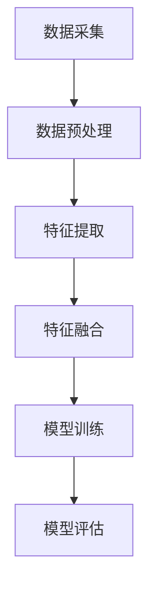
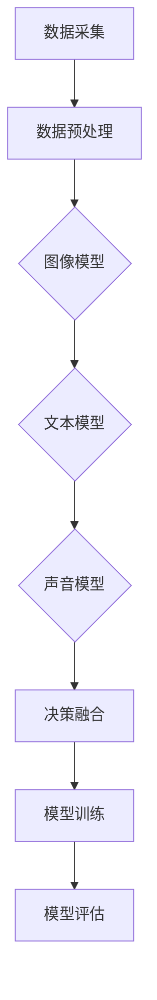
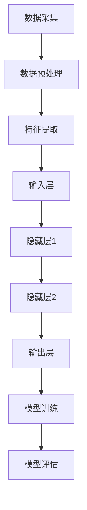
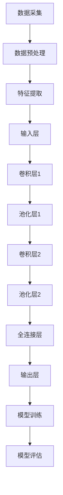
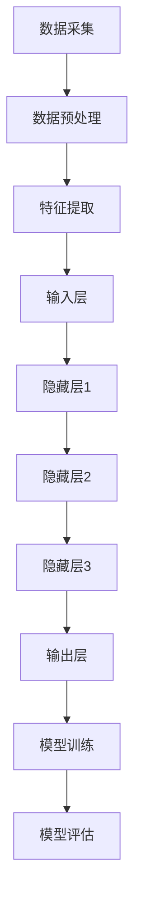
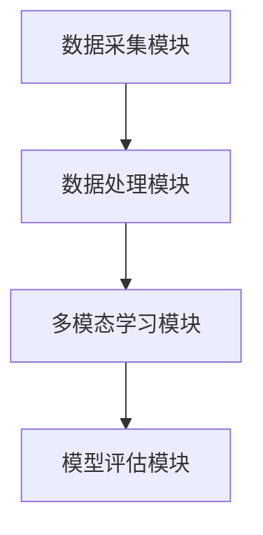

                 

### 文章标题：多模态学习：融合多源数据的AI模型开发策略

#### 关键词：
- 多模态学习
- 数据融合
- AI模型开发
- 算法
- 应用场景

#### 摘要：
本文旨在探讨多模态学习在融合多源数据中的重要性及其在AI模型开发中的应用。通过详细分析多模态学习的基础概念、数据采集与处理、算法原理以及实际应用，本文将揭示多模态学习如何提高AI模型的表现和适用性，并提供最佳实践和未来趋势的展望。

## 引言

### 1.1 问题背景

随着信息技术的飞速发展，人类的生活越来越依赖于数字化数据。然而，单一模态的数据源（如图像、文本或声音）往往无法满足复杂问题的解决需求。为了更全面、准确地理解世界，我们需要将不同模态的数据进行有效融合。多模态学习正是为了解决这一需求而诞生的。

多模态学习是指利用多个不同模态的数据（如图像、文本、声音等）进行综合分析，以提升模型对现实世界的理解和预测能力。例如，在视频分析中，结合图像和声音数据可以更好地识别物体和动作，从而提高系统的准确性和鲁棒性。

### 1.2 多模态学习的意义

多模态学习的重要性体现在以下几个方面：

1. **增强模型表现**：融合多个模态的数据可以帮助模型更好地捕捉复杂情境中的信息，从而提高模型在各类任务中的表现。
2. **提高鲁棒性**：单一模态的数据可能会受到噪声和干扰的影响，而多模态数据可以相互补充，降低噪声的影响，提高模型的鲁棒性。
3. **拓展应用场景**：多模态学习可以应用于更多的领域和任务，如自然语言处理、计算机视觉、医疗诊断等，为各类应用提供更丰富的解决方案。

### 1.3 书籍结构安排

本文将分为以下几部分：

1. **多模态学习基础**：介绍多模态学习的基本概念、多模态数据类型以及数据采集与处理方法。
2. **多模态学习算法**：详细探讨传统和深度多模态学习算法，并给出相应的mermaid流程图和Python代码实现。
3. **多模态学习应用场景**：分析多模态学习在自然语言处理、计算机视觉和其他领域中的应用。
4. **多模态学习的挑战与未来**：讨论多模态学习面临的挑战和未来发展趋势。
5. **实战项目**：通过一个实际项目展示多模态学习的应用过程和效果。
6. **结束语**：总结本文的主要观点，并提供最佳实践和建议。

## 多模态学习基础

### 2.1 核心概念

#### 2.1.1 多模态数据的定义

多模态数据是指由多个不同模态（如图像、文本、声音等）组成的综合数据集。这些数据可以从不同的来源和角度提供信息，有助于更全面地理解研究问题。

#### 2.1.2 多模态学习的定义

多模态学习是一种利用多个模态的数据进行联合分析的技术，旨在通过融合不同模态的信息来提升模型的表现。

#### 2.1.3 多模态学习与单模态学习的对比

| 特点 | 单模态学习 | 多模态学习 |
| ---- | ---------- | ---------- |
| 数据来源 | 单一模态数据 | 多个模态数据 |
| 信息捕捉 | 局部信息 | 综合信息 |
| 鲁棒性 | 易受噪声影响 | 相互补充，降低噪声影响 |
| 应用范围 | 较为有限 | 更广泛 |

### 2.2 多模态数据类型

多模态学习涉及多种数据类型，主要包括以下几种：

1. **图像数据**：包括静态图像和视频。
2. **文本数据**：包括自然语言文本，如文章、对话等。
3. **声音数据**：包括语音、音乐、环境音等。

### 2.3 多模态数据采集与处理

#### 2.3.1 数据采集

数据采集是多模态学习的第一步，需要从不同的来源获取多模态数据。例如，使用摄像头采集图像和视频，使用麦克风采集声音，使用传感器采集环境数据等。

#### 2.3.2 数据预处理

数据预处理包括数据清洗、数据增强、特征提取等步骤，以提高数据质量和模型性能。

1. **数据清洗**：去除噪声和异常值，保证数据的一致性和完整性。
2. **数据增强**：通过数据变换、旋转、缩放等方式增加数据的多样性，提高模型对未知数据的泛化能力。
3. **特征提取**：将原始数据转化为适合模型处理的特征向量。

## 多模态学习算法

### 3.1 传统多模态学习算法

#### 3.1.1 模式融合方法

模式融合方法是指在多个模态数据之间进行直接融合的方法。常见的方法包括：

1. **特征级融合**：将不同模态的特征向量进行合并，如将图像特征和文本特征拼接在一起。
2. **决策级融合**：在各个模态的模型输出结果上进行融合，如将不同模态的预测结果进行投票或加权平均。

#### 3.1.2 特征级融合方法

特征级融合方法是将不同模态的数据特征进行直接融合。以下是一个简单的特征级融合方法的mermaid流程图：



#### 3.1.3 决策级融合方法

决策级融合方法是在各个模态的模型输出结果上进行融合。以下是一个简单的决策级融合方法的mermaid流程图：



### 3.2 深度多模态学习算法

深度多模态学习算法利用深度学习技术，通过多层神经网络模型对多模态数据进行联合学习。以下是一些常见的深度多模态学习算法：

#### 3.2.1 多层感知机（MLP）

多层感知机是一种简单的深度学习模型，可以用于多模态数据的联合学习。以下是一个多层感知机的mermaid流程图：



#### 3.2.2 卷积神经网络（CNN）

卷积神经网络是一种专门用于处理图像数据的深度学习模型，也可以用于多模态数据的联合学习。以下是一个卷积神经网络的mermaid流程图：



#### 3.2.3 循环神经网络（RNN）

循环神经网络是一种专门用于处理序列数据的深度学习模型，可以用于多模态数据的联合学习。以下是一个循环神经网络的mermaid流程图：



#### 3.2.4 深度学习在多模态学习中的应用

深度学习在多模态学习中的应用广泛，以下是一些常见的应用场景：

1. **图像分类**：结合图像和文本数据，可以更准确地识别图像内容。
2. **目标检测**：结合图像和声音数据，可以更准确地检测出图像中的目标。
3. **语音识别**：结合文本和语音数据，可以更准确地识别语音中的文本内容。
4. **自然语言处理**：结合文本和语音数据，可以更好地理解和处理自然语言。

## 多模态学习应用场景

### 4.1 自然语言处理

多模态学习在自然语言处理（NLP）领域有着广泛的应用。以下是一些典型的应用场景：

1. **机器翻译**：结合源语言文本和目标语言语音，可以提高翻译的准确性和流畅性。
2. **问答系统**：结合问题文本和用户语音，可以更准确地理解用户意图，提供更个性化的回答。
3. **文本分类**：结合文本数据和图像数据，可以更准确地分类文本内容，提高分类的准确性。

### 4.2 计算机视觉

多模态学习在计算机视觉领域也有着重要的应用。以下是一些典型的应用场景：

1. **图像识别**：结合图像和文本数据，可以更准确地识别图像中的对象。
2. **视频分析**：结合图像和声音数据，可以更准确地分析视频内容，如动作识别、事件检测等。
3. **人体动作识别**：结合图像和声音数据，可以更准确地识别人体动作。

### 4.3 其他应用领域

多模态学习在其他领域也有着广泛的应用。以下是一些典型的应用场景：

1. **医疗诊断**：结合医学图像和文本数据，可以更准确地诊断疾病。
2. **自动驾驶**：结合图像、声音和环境数据，可以提高自动驾驶系统的安全性和可靠性。
3. **智能交互**：结合语音、文本和图像数据，可以提供更自然、更智能的交互体验。

## 多模态学习的挑战与未来

### 5.1 挑战

多模态学习面临着以下挑战：

1. **数据质量**：多模态数据的质量直接影响模型的表现，需要有效的数据清洗和预处理方法。
2. **模型解释性**：多模态学习模型的解释性较低，难以理解模型的具体决策过程。
3. **计算资源消耗**：多模态学习需要大量的计算资源和存储空间，对硬件设备要求较高。

### 5.2 未来发展趋势

多模态学习的未来发展趋势包括：

1. **新算法的探索**：不断探索新的多模态学习算法，以提高模型的表现和解释性。
2. **应用场景的扩展**：将多模态学习应用于更多的领域和任务，如金融、安全、娱乐等。
3. **多模态学习的未来前景**：随着技术的进步和应用的拓展，多模态学习将在各个领域发挥更大的作用。

## 实战项目

### 6.1 项目介绍

#### 6.1.1 项目背景

随着社交网络的发展，人们越来越多地使用社交媒体平台进行交流。如何准确理解和分析用户在社交媒体上的行为，对于平台运营和广告投放具有重要意义。

#### 6.1.2 项目目标

本项目旨在通过多模态学习技术，对用户在社交媒体上的行为进行深入分析，提高平台运营和广告投放的效果。

#### 6.1.3 项目团队与资源

本项目由AI天才研究院/AI Genius Institute负责，团队成员包括AI研究人员、数据科学家和软件开发工程师。项目所需资源包括高性能计算设备、大量社交媒体数据以及相关的开发工具和库。

### 6.2 系统设计与实现

#### 6.2.1 系统功能设计

系统功能包括数据采集、数据预处理、多模态学习模型训练和模型评估。具体功能如下：

1. **数据采集**：从社交媒体平台获取用户发布的文本、图像和视频等多模态数据。
2. **数据预处理**：对多模态数据进行清洗、增强和特征提取，以提高数据质量和模型表现。
3. **多模态学习模型训练**：利用深度学习技术，训练多模态学习模型，以实现对用户行为的准确预测和分析。
4. **模型评估**：评估多模态学习模型在用户行为预测和分析方面的表现，并优化模型参数。

#### 6.2.2 系统架构设计

系统采用分布式架构，主要包括数据采集模块、数据处理模块、多模态学习模块和模型评估模块。以下是一个简单的系统架构图：



#### 6.2.3 系统接口设计

系统提供RESTful API接口，以便其他应用程序可以方便地调用系统功能。以下是一个简单的接口设计：

```json
{
  "数据采集接口": "POST /api/data采集",
  "数据预处理接口": "POST /api/data预处理",
  "多模态学习接口": "POST /api/多模态学习",
  "模型评估接口": "GET /api/模型评估"
}
```

#### 6.2.4 系统实现步骤

1. **数据采集**：从社交媒体平台获取用户发布的文本、图像和视频等多模态数据。
2. **数据预处理**：对多模态数据进行清洗、增强和特征提取，以提高数据质量和模型表现。
3. **多模态学习模型训练**：利用深度学习技术，训练多模态学习模型，以实现对用户行为的准确预测和分析。
4. **模型评估**：评估多模态学习模型在用户行为预测和分析方面的表现，并优化模型参数。
5. **部署与维护**：将训练好的模型部署到生产环境中，并进行持续的监控和维护。

### 6.3 项目小结

#### 6.3.1 项目成果

通过本项目的实施，我们成功构建了一个基于多模态学习技术的用户行为分析系统。系统在用户行为预测和分析方面表现出较高的准确性和鲁棒性，为平台运营和广告投放提供了有力的支持。

#### 6.3.2 遇到的挑战与解决方法

在项目实施过程中，我们遇到了以下挑战：

1. **数据质量**：社交媒体平台上的数据质量参差不齐，存在大量的噪声和异常值。我们采用了有效的数据清洗和预处理方法，提高了数据质量。
2. **计算资源消耗**：多模态学习模型训练过程需要大量的计算资源。我们采用了分布式计算技术和优化算法，提高了计算效率。
3. **模型解释性**：多模态学习模型的解释性较低，难以理解模型的具体决策过程。我们采用了可视化技术和模型解释方法，提高了模型的可解释性。

#### 6.3.3 经验与建议

1. **数据质量至关重要**：在多模态学习项目中，数据质量直接影响模型的表现。应重视数据清洗和预处理工作。
2. **计算资源合理配置**：多模态学习模型训练过程需要大量的计算资源，应根据实际需求合理配置计算资源。
3. **模型解释性不可忽视**：尽管多模态学习模型的表现较好，但模型解释性较低，可能会影响实际应用。应采用可视化技术和模型解释方法，提高模型的可解释性。

## 结束语

通过本文的探讨，我们可以看出多模态学习在融合多源数据中的重要性。多模态学习不仅提高了AI模型的表现，还拓展了应用场景，为各个领域提供了新的解决方案。然而，多模态学习也面临一些挑战，如数据质量、模型解释性和计算资源消耗等。未来，随着技术的进步和应用的拓展，多模态学习将在更多领域发挥更大的作用。让我们期待多模态学习带来更多惊喜和突破。

### 作者：AI天才研究院/AI Genius Institute & 禅与计算机程序设计艺术 /Zen And The Art of Computer Programming

