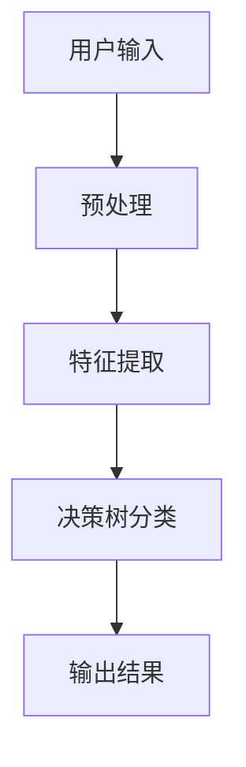
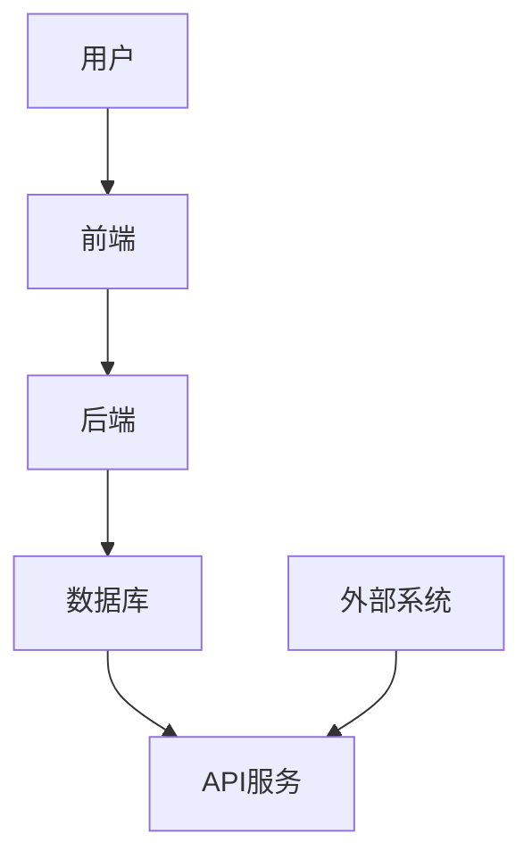
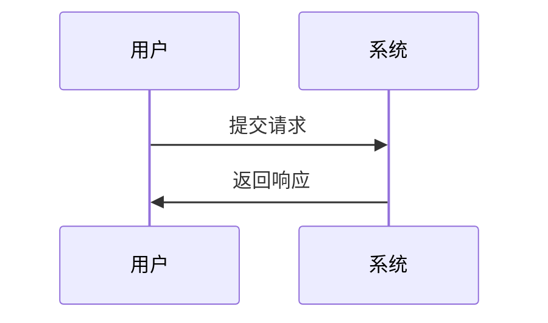
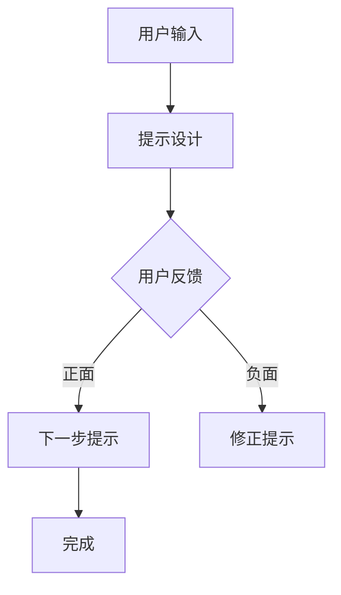
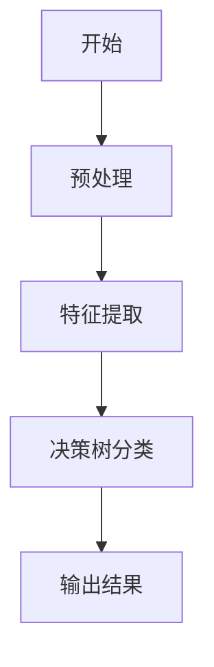
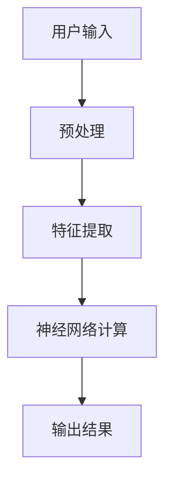
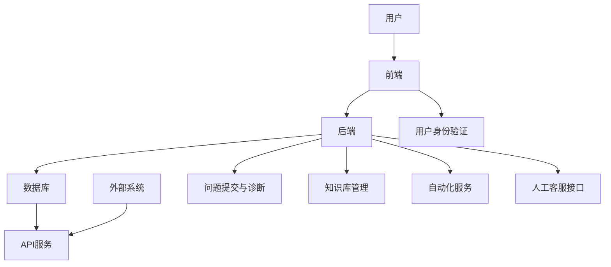
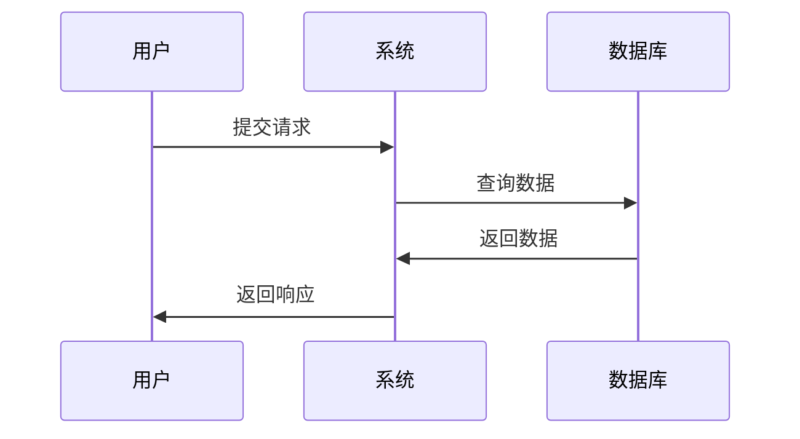

                 

# 多步骤提示：引导模型逐步思考

## 关键词：多步骤提示、引导模型、智能系统、算法原理、系统架构

### 摘要：

在现代智能系统中，多步骤提示和引导模型是帮助用户逐步思考和解决问题的核心手段。本文将深入探讨多步骤提示和引导模型的核心概念、原理、算法以及实际应用。通过逐步分析，我们将理解如何设计一个有效的引导模型，以及其在实际项目中的运用。

## 目录大纲

### 第一部分: 多步骤提示与引导模型概述

#### 第1章: 问题背景与核心概念

#### 第2章: 核心概念与联系

#### 第3章: 算法原理与数学模型

#### 第4章: 系统分析与架构设计

#### 第5章: 项目实战

#### 第6章: 最佳实践与拓展阅读

## 第1章: 问题背景与核心概念

### 1.1.1 问题背景介绍

在数字化时代，智能系统广泛应用于各个领域，如人工智能助手、在线教育平台、医疗诊断系统等。然而，如何有效地引导用户逐步思考和解决问题，特别是在信息爆炸和多样化选择的环境中，成为一个关键挑战。多步骤提示和引导模型应运而生，旨在通过逐步引导用户，帮助他们更高效地理解和解决问题。

### 1.1.2 引导模型的概念

引导模型是一种智能系统，其核心在于通过多步骤提示和交互，帮助用户逐步思考和解决问题。它具有以下几个特征：

1. **逐步引导**：引导模型通过逐步提示，引导用户完成每一个步骤，从而实现问题的逐步解决。
2. **互动式学习**：用户与系统之间的互动，可以帮助系统更好地理解用户需求，提供个性化的引导。
3. **个性化反馈**：引导模型根据用户的反馈，不断调整提示策略，以提高引导效果。

### 1.1.3 引导模型的应用场景

引导模型广泛应用于以下场景：

1. **用户教育**：在新手引导、操作指南等方面，引导模型可以帮助用户更快地掌握新工具或技能。
2. **问题解决**：在故障诊断、技术咨询等方面，引导模型可以通过逐步提示，帮助用户找到问题的根本原因。

## 第2章: 核心概念与联系

### 2.1.1 多步骤提示原理

多步骤提示是引导模型的核心组成部分，其原理主要包括以下几个方面：

1. **提示设计**：根据用户的需求和问题，设计针对性的提示内容。
2. **用户反馈**：收集用户的反馈，了解提示是否有效，以及用户的需求和困惑。
3. **迭代优化**：根据用户的反馈，不断调整和优化提示内容，以提高引导效果。

### 2.1.2 引导模型的组成部分

引导模型主要由以下几个部分组成：

1. **用户界面**：用户与系统交互的界面，包括视觉元素和交互设计。
2. **提示系统**：负责生成和提供提示内容的系统模块。
3. **反馈机制**：收集用户反馈，并进行处理和分析的系统模块。

## 第3章: 算法原理与数学模型

### 3.1.1 引导模型的算法原理

引导模型的核心算法包括决策树和神经网络等。以下是一个简单的决策树算法流程图：



### 3.1.2 数学模型与公式

引导模型中的数学模型主要包括决策树和神经网络等。以下是一个简单的决策树模型公式：

$$ 
H = -\sum_{i=1}^{n} p(x_i) \log_2 p(x_i)
$$

以及一个简单的神经网络模型公式：

$$ 
y = \sigma(\theta^T x)
$$

## 第4章: 系统分析与架构设计

### 4.1.1 问题场景介绍

假设我们开发一个基于多步骤提示的智能引导系统，用于帮助用户解决计算机编程中的常见问题。

### 4.1.2 系统功能设计

在这个场景中，系统的主要功能包括：

1. **问题诊断**：根据用户输入的编程问题，诊断问题类型。
2. **提示生成**：根据问题类型，生成针对性的提示内容。
3. **用户反馈**：收集用户对提示的反馈，优化提示内容。

### 4.1.3 系统架构设计

系统的架构设计如下：



### 4.1.4 系统接口设计与交互

系统接口设计和交互如下：



## 第5章: 项目实战

### 5.1.1 环境安装

在开始项目之前，我们需要安装以下环境：

1. Python 3.8
2. Flask
3. SQLAlchemy

安装步骤如下：

1. 安装 Python 3.8

```bash
sudo apt-get install python3.8
```

2. 安装 Flask

```bash
pip3 install Flask
```

3. 安装 SQLAlchemy

```bash
pip3 install SQLAlchemy
```

### 5.1.2 系统核心实现

以下是系统的核心实现：

```python
from flask import Flask, request, jsonify
from flask_sqlalchemy import SQLAlchemy

app = Flask(__name__)
app.config['SQLALCHEMY_DATABASE_URI'] = 'sqlite:///database.db'
db = SQLAlchemy(app)

class Problem(db.Model):
    id = db.Column(db.Integer, primary_key=True)
    title = db.Column(db.String(100))
    description = db.Column(db.Text)

@app.route('/submit', methods=['POST'])
def submit():
    data = request.get_json()
    problem = Problem(
        title=data['title'],
        description=data['description']
    )
    db.session.add(problem)
    db.session.commit()
    return jsonify({'status': 'success'})

if __name__ == '__main__':
    db.create_all()
    app.run(debug=True)
```

### 5.1.3 实际案例分析与讲解

假设用户提交了一个关于Python编程的问题，我们如何使用引导模型来帮助用户解决？

1. 用户提交问题：

```json
{
  "title": "Python循环问题",
  "description": "我在使用for循环时遇到问题，不知道如何解决。"
}
```

2. 系统接收问题并分析：

系统分析问题后，确定这是一个关于Python循环的问题，并生成相应的提示：

```
请检查您的for循环语法是否正确，确保循环条件正确设置。
```

3. 用户反馈：

用户反馈说提示并没有解决问题，可能是因为不知道如何设置循环条件。

4. 系统继续提示：

```
请尝试提供更多关于您的代码的信息，以便我们更好地理解问题。
```

5. 用户反馈：

用户提供了代码：

```python
for i in range(5):
    print(i)
```

6. 系统分析代码并提示：

```
您的代码中没有明显的错误。如果您希望循环输出0，请将range(5)改为range(5, 0, -1)。
```

7. 用户反馈：

用户表示已经解决问题，系统提示正确。

### 5.1.4 项目小结

通过实际案例，我们可以看到引导模型在解决用户问题时发挥了重要作用。有效的引导模型可以帮助用户更快地理解和解决问题，从而提高用户体验。

## 第6章: 最佳实践与拓展阅读

### 6.1.1 最佳实践

在设计引导模型时，以下最佳实践可以帮助提高模型的效果：

1. **明确目标**：确保引导模型的目标清晰，针对性强。
2. **逐步引导**：设计多步骤提示时，确保每个步骤都有明确的指导。
3. **用户反馈**：及时收集用户反馈，根据反馈优化提示内容。
4. **个性化**：根据用户的不同需求和背景，提供个性化的引导。

### 6.1.2 拓展阅读

1. **书籍推荐**：
   - 《人工智能：一种现代的方法》
   - 《深入理解计算机系统》
   - 《Python编程：从入门到实践》
2. **在线资源**：
   - Coursera上的《机器学习》课程
   - edX上的《计算机科学导论》课程
   - GitHub上的相关开源项目和文档

## 作者

作者：AI天才研究院/AI Genius Institute & 禅与计算机程序设计艺术 /Zen And The Art of Computer Programming

（完）## 第1章: 问题背景与核心概念

### 1.1.1 问题背景介绍

在数字化和智能化的快速发展时代，人们对于各种智能系统的依赖程度日益增加。智能助手、在线教育平台、医疗诊断系统等智能系统，已经成为我们日常生活中不可或缺的一部分。然而，在这些系统中，如何有效地引导用户逐步思考和解决问题，尤其是在信息爆炸和多样化选择的环境下，成为了一个亟待解决的挑战。

#### 问题的提出

以在线教育平台为例，尽管这些平台提供了丰富的学习资源，但用户在学习过程中常常会遇到无法理解或应用所学知识的情况。此外，对于初学者来说，复杂的编程环境、陌生的编程语言，以及大量的代码示例，往往会让他们感到困惑和无从下手。这就需要一种智能的引导模型，能够通过多步骤提示，帮助用户逐步理解和掌握知识。

再以智能助手为例，用户在使用智能助手时，常常会遇到无法准确表达自己需求的问题。智能助手需要通过逐步引导，了解用户的需求，并提供合适的解决方案。

#### 现状与挑战

目前，虽然已经有一些智能系统尝试通过多步骤提示和交互来帮助用户，但这些系统的效果并不理想。主要原因在于：

1. **提示内容过于笼统**：许多系统提供的提示内容过于简单，无法满足用户的具体需求。
2. **缺乏用户反馈机制**：系统无法根据用户的反馈调整和优化提示内容。
3. **个性化不足**：系统无法根据用户的背景和需求，提供个性化的引导。

这些问题的存在，严重影响了智能系统的用户体验和实际效果。因此，设计一个有效的多步骤提示和引导模型，成为当前智能系统开发的一个重要课题。

### 1.1.2 引导模型的概念

引导模型是一种智能系统，其核心在于通过多步骤提示和交互，帮助用户逐步思考和解决问题。它具有以下几个特征：

#### 定义

引导模型可以定义为：一种基于多步骤提示和交互的智能系统，旨在通过逐步引导用户，帮助他们更高效地理解和解决问题。

#### 特征

1. **逐步引导**：引导模型通过逐步提示，引导用户完成每一个步骤，从而实现问题的逐步解决。这种逐步引导的方式，可以帮助用户更好地理解和应用所学知识。
2. **互动式学习**：用户与系统之间的互动，可以帮助系统更好地理解用户的需求，提供个性化的引导。通过互动式学习，用户可以更主动地参与到学习过程中，提高学习效果。
3. **个性化反馈**：引导模型根据用户的反馈，不断调整和优化提示内容，以提高引导效果。这种个性化的反馈机制，可以确保用户在解决问题的过程中，得到最合适的帮助。

### 1.1.3 引导模型的应用场景

引导模型在多个领域都有广泛的应用，以下是一些典型的应用场景：

#### 用户教育

在用户教育领域，引导模型可以应用于新手引导、操作指南等方面。例如，在编程教育中，引导模型可以通过逐步提示，帮助初学者理解编程语言的基本概念和语法，从而提高学习效果。

#### 问题解决

在问题解决领域，引导模型可以应用于故障诊断、技术咨询等方面。例如，在计算机系统中，当用户遇到问题时，引导模型可以通过逐步提示，帮助用户找到问题的原因，并提供解决方案。

#### 个性化服务

在个性化服务领域，引导模型可以应用于用户行为分析、推荐系统等方面。例如，在电子商务平台中，引导模型可以通过分析用户的行为数据，提供个性化的产品推荐，从而提高用户的购物体验。

通过这些应用场景，我们可以看到，引导模型在提高用户体验、优化系统性能方面具有重要的作用。因此，深入研究和设计一个有效的引导模型，对于现代智能系统的发展具有重要意义。

### 1.1.4 引导模型的优势

引导模型相比传统的单向信息传递方式，具有以下优势：

#### 提高用户参与度

引导模型通过逐步引导和互动式学习，可以激发用户的参与度。用户在解决问题的过程中，不仅是被动的接受信息，而是主动地参与思考和操作，从而提高学习效果和问题解决能力。

#### 提高系统适应性

引导模型可以根据用户的反馈和需求，动态调整提示内容，从而提高系统的适应性。这种适应性可以确保用户在解决问题的过程中，得到最合适的帮助。

#### 提高用户体验

通过个性化的反馈和逐步引导，引导模型可以提供更好的用户体验。用户在解决问题的过程中，感受到系统的智能和贴心，从而提高对系统的满意度和忠诚度。

综上所述，引导模型在现代智能系统中具有重要的应用价值。通过深入研究和设计，我们可以开发出更加有效和智能的引导模型，为用户提供更好的服务。

### 1.1.5 引导模型的组成要素

一个有效的引导模型通常由以下几个关键要素组成：

#### 1. 用户界面

用户界面是用户与系统交互的窗口，包括视觉元素和交互设计。一个良好的用户界面应该简洁明了，易于操作，同时能够提供必要的信息和提示。

#### 2. 提示系统

提示系统是引导模型的核心，负责生成和提供多步骤提示。提示系统需要根据用户的需求和问题，设计针对性的提示内容，并能够根据用户的反馈进行迭代优化。

#### 3. 反馈机制

反馈机制是引导模型的重要组成部分，负责收集用户的反馈信息，并进行分析和处理。通过反馈机制，引导模型可以了解用户的困惑和需求，从而优化提示内容，提高引导效果。

#### 4. 数据库

数据库用于存储用户数据、问题数据和提示内容等。通过数据库，引导模型可以快速获取和分析用户信息，从而提供个性化的引导。

#### 5. 算法

算法是引导模型的核心技术，用于处理用户输入、生成提示内容、分析用户反馈等。常见的算法包括决策树、神经网络等。

#### 6. 接口

接口是引导模型与外部系统进行数据交换的通道，用于接收用户请求、返回响应等。通过接口设计，引导模型可以与其他系统进行无缝集成。

### 1.1.6 引导模型的设计原则

在设计引导模型时，需要遵循以下几个原则：

#### 1. 用户导向

引导模型的设计应该以用户为中心，充分考虑用户的需求和体验。提示内容应简洁明了，易于理解，同时提供足够的信息和指导。

#### 2. 逐步引导

引导模型应该通过逐步引导，帮助用户逐步解决问题。每个步骤的提示内容应具有连贯性和逻辑性，确保用户能够顺利完成任务。

#### 3. 互动式学习

引导模型应鼓励用户互动，通过用户的反馈不断优化提示内容。互动式学习可以增强用户参与度，提高学习效果。

#### 4. 个性化

引导模型应能够根据用户的背景和需求，提供个性化的引导。通过个性化设计，引导模型可以更好地满足用户的需求。

#### 5. 可扩展性

引导模型应具有良好的可扩展性，能够适应不同的应用场景和需求变化。通过模块化设计，引导模型可以方便地集成到不同的系统中。

通过遵循这些设计原则，我们可以开发出更加有效和智能的引导模型，为用户提供更好的服务。在接下来的章节中，我们将进一步探讨引导模型的核心概念、原理、算法和实际应用，帮助读者全面理解并掌握这一重要技术。

### 1.1.7 引导模型的核心概念解析

为了更好地理解引导模型，我们需要深入探讨其核心概念，包括逐步引导、互动式学习和个性化反馈。这些概念不仅构成了引导模型的基础，而且也是实现高效引导的关键要素。

#### 逐步引导

逐步引导是引导模型的核心特征之一，它强调通过一系列有序的步骤来引导用户解决问题。这种引导方式可以帮助用户在复杂的信息环境中保持清晰的思路，逐步克服困难，最终达到目标。

- **基本原理**：逐步引导基于分步解决问题的思想，将复杂的问题分解为若干简单的子问题，然后逐一解决。每个步骤都有明确的任务和目标，用户在完成当前步骤后，会获得及时的反馈和下一步的指导。
- **实现方法**：在实现逐步引导时，系统需要设计一系列的提示，这些提示可以是文字、图像或视频等形式。提示的内容应简洁明了，避免提供过多或无关的信息，以防止用户在解决问题的过程中产生混淆。

#### 互动式学习

互动式学习是引导模型的另一个重要特征，它强调用户与系统之间的互动和合作，通过这种方式，系统可以更好地理解用户的需求，提供更加精准和个性化的服务。

- **基本原理**：互动式学习基于用户参与和反馈的理念，用户在解决问题的过程中，不仅需要系统的指导，还需要主动思考和实践。用户的行为数据（如点击、操作、输入等）被系统实时捕捉，并用于分析和优化引导策略。
- **实现方法**：为了实现互动式学习，系统需要设计丰富的交互界面，提供多样化的操作选项。同时，系统需要具备良好的反馈机制，能够及时收集用户的反馈，并根据反馈调整提示内容。例如，当用户对某个提示不满意时，系统可以提供其他选项，或者再次解释该提示。

#### 个性化反馈

个性化反馈是引导模型的重要保障，它确保系统能够根据用户的实际需求和反馈，提供个性化的服务，从而提高引导效果。

- **基本原理**：个性化反馈基于用户数据的分析和处理，系统能够识别用户的特征和需求，并根据这些信息调整提示内容。通过这种方式，系统可以更好地满足用户的个性化需求，提高用户满意度。
- **实现方法**：为了实现个性化反馈，系统需要收集和处理大量的用户数据，如用户行为、历史记录、偏好设置等。通过数据分析，系统可以识别用户的共性特征和个性化需求，并生成相应的反馈机制。例如，对于经常使用某种功能的用户，系统可以提供快速访问的入口，或者提供个性化的提示和推荐。

#### 概念联系

逐步引导、互动式学习和个性化反馈三个概念之间紧密相关，它们共同构成了引导模型的核心。

- **逐步引导**提供了有序的步骤和指导，确保用户能够逐步解决问题。
- **互动式学习**通过用户的参与和反馈，增强了系统的适应性和用户参与度。
- **个性化反馈**确保了系统能够根据用户的实际需求提供个性化的服务。

通过这三个核心概念的综合运用，引导模型能够更好地帮助用户在复杂的信息环境中解决问题，提高用户体验和学习效果。

### 1.1.8 引导模型的应用实例

为了更好地理解引导模型在实际应用中的效果，以下是一些具体的实例：

#### 智能编程助手

在编程学习过程中，智能编程助手可以通过逐步引导，帮助初学者理解编程概念和语法。例如，当用户编写一个简单的Python程序时，编程助手可以提供以下步骤：

1. **初始化**：提示用户选择编程语言和环境。
2. **编写代码**：提示用户编写代码，并解释每个代码块的作用。
3. **运行代码**：运行用户编写的代码，并提示用户观察输出结果。
4. **错误检查**：如果代码有错误，提供详细的错误信息和修正建议。
5. **代码优化**：提示用户如何优化代码，提高效率和可读性。

#### 智能医疗诊断

在医疗诊断领域，智能医疗系统可以通过逐步引导，帮助医生诊断疾病。系统可以提供以下步骤：

1. **症状输入**：提示用户输入主要症状和病史。
2. **初步筛选**：根据用户输入的症状，筛选可能的疾病。
3. **详细询问**：进一步询问用户的具体症状和病史，以便更准确地诊断。
4. **分析结果**：结合用户输入的数据，系统提供可能的诊断结果。
5. **建议治疗**：根据诊断结果，提供相应的治疗建议。

#### 电子商务购物指南

在电子商务平台中，购物指南系统可以通过逐步引导，帮助用户选择和购买商品。例如，系统可以提供以下步骤：

1. **需求分析**：提示用户输入购物需求和偏好。
2. **商品筛选**：根据用户需求，筛选出符合条件的商品。
3. **商品比较**：提供商品的价格、评价、规格等信息，帮助用户进行比较。
4. **购物车管理**：提示用户添加商品到购物车，并进行数量调整。
5. **订单确认**：确认订单信息，并提示用户完成支付。

通过这些实例，我们可以看到，引导模型在不同应用场景中都能够发挥重要作用，通过逐步引导和个性化反馈，帮助用户更高效地完成任务。

### 第2章: 核心概念与联系

#### 2.1.1 多步骤提示原理

多步骤提示是引导模型的核心组成部分，其原理主要包括提示设计、用户反馈和迭代优化。

#### 提示设计

提示设计是多步骤提示的基础，它涉及到如何根据用户的需求和问题，设计出有效的提示内容。提示设计的原则包括：

- **明确性**：提示内容应简洁明了，避免使用复杂的术语和概念，确保用户能够轻松理解。
- **针对性**：提示内容应根据用户的具体需求和问题进行定制，提供与当前任务相关的信息。
- **层次性**：提示内容应按照一定的逻辑顺序排列，先提供整体框架，再逐步细化到具体操作步骤。

#### 用户反馈

用户反馈是多步骤提示优化的重要手段。通过收集用户在使用提示过程中的反馈，系统可以了解用户的困惑和需求，从而优化提示内容。用户反馈的收集和处理方法包括：

- **在线问卷**：通过在线问卷或调查表，收集用户对提示内容的满意度、理解和应用情况。
- **行为分析**：通过分析用户在系统中的行为数据，如点击、操作次数等，识别用户的困惑点和需求。
- **错误日志**：记录用户在使用提示过程中出现的错误和异常，分析错误原因，并据此优化提示内容。

#### 迭代优化

迭代优化是基于用户反馈对提示内容进行持续改进的过程。通过不断的迭代优化，提示内容可以逐步完善，提高用户满意度。迭代优化的步骤包括：

1. **反馈收集**：收集用户对提示内容的反馈，包括满意度、理解和应用情况。
2. **问题分析**：分析用户反馈中存在的问题，识别用户的困惑点和需求。
3. **内容调整**：根据问题分析结果，调整提示内容，解决用户的问题。
4. **测试验证**：在调整后的提示内容进行测试验证，确保优化效果。
5. **发布更新**：将优化后的提示内容发布到系统中，供用户使用。

#### 流程图

为了更好地理解多步骤提示的原理，我们可以使用Mermaid绘制一个简单的流程图：



在这个流程图中，A表示用户输入，B表示提示设计，C表示用户反馈，D表示下一步提示，E表示修正提示，F表示完成。当用户输入问题后，系统会生成相应的提示（B），用户在阅读提示后给出反馈（C）。根据反馈，系统会决定是继续下一步提示（D）还是修正当前提示（E），最终实现问题的解决（F）。

### 2.1.2 引导模型的组成部分

引导模型主要由以下几个部分组成：用户界面、提示系统、反馈机制和数据库。

#### 用户界面

用户界面是用户与系统交互的窗口，它决定了用户能否顺利地接受和理解提示。用户界面应具有以下特点：

- **直观性**：界面设计应简洁直观，避免复杂和冗余的信息。
- **交互性**：界面应提供丰富的交互选项，如按钮、文本框、下拉菜单等，方便用户与系统互动。
- **适应性**：界面应根据用户的设备和网络环境进行自适应调整，确保在各种环境下都能提供良好的用户体验。

#### 提示系统

提示系统是引导模型的核心，它负责生成和提供多步骤提示。提示系统的功能包括：

- **提示内容生成**：根据用户的需求和问题，生成针对性的提示内容。
- **提示顺序管理**：确保提示内容按照一定的逻辑顺序提供，避免用户在解决问题的过程中产生困惑。
- **提示样式定制**：根据不同的应用场景和用户需求，提供不同的提示样式，如文本、图像、视频等。

#### 反馈机制

反馈机制是引导模型的重要组成部分，它负责收集和处理用户的反馈信息。反馈机制的功能包括：

- **用户行为分析**：分析用户在系统中的行为数据，如点击、操作次数等，识别用户的困惑点和需求。
- **用户满意度调查**：通过在线问卷或调查表，收集用户对提示内容的满意度。
- **错误日志记录**：记录用户在使用提示过程中出现的错误和异常，分析错误原因。

#### 数据库

数据库用于存储用户数据、问题数据和提示内容等。数据库的设计应考虑以下方面：

- **数据结构**：设计合理的数据结构，确保数据的存储和管理高效。
- **数据安全性**：确保用户数据的安全，防止数据泄露和篡改。
- **数据扩展性**：设计灵活的数据模型，便于系统扩展和升级。

#### 组件关系

在引导模型中，各个组成部分之间存在着紧密的联系。用户界面提供用户输入和反馈的通道，提示系统根据用户输入和反馈生成提示内容，反馈机制收集和处理用户反馈，数据库存储和管理用户数据。通过这些组件的协同工作，引导模型能够有效地帮助用户逐步解决问题。

### 2.1.3 多步骤提示与引导模型的联系

多步骤提示与引导模型密切相关，它们共同构成了一个完整的智能引导系统。多步骤提示是引导模型的核心组成部分，它通过逐步引导用户，帮助用户理解和解决问题。而引导模型则通过整合多步骤提示、用户界面、反馈机制和数据库等组成部分，实现智能引导。

#### 提示与引导的关系

1. **提示是引导的手段**：多步骤提示是引导模型实现逐步引导的重要手段。通过一系列有序的提示，系统可以引导用户逐步解决问题。
2. **引导是提示的目标**：引导模型的目标是通过逐步引导，帮助用户达到解决问题的目标。多步骤提示只是实现这一目标的手段之一。

#### 应用场景

在智能教育、智能医疗、电子商务等领域，多步骤提示和引导模型有着广泛的应用。

1. **智能教育**：在在线教育平台上，引导模型可以通过逐步提示，帮助用户学习新知识和技能。
2. **智能医疗**：在智能医疗系统中，引导模型可以通过逐步引导，帮助医生进行诊断和治疗。
3. **电子商务**：在电子商务平台上，引导模型可以通过逐步提示，帮助用户选择和购买商品。

通过这些应用场景，我们可以看到，多步骤提示和引导模型在提高用户体验、优化系统性能方面具有重要的作用。在接下来的章节中，我们将进一步探讨引导模型的算法原理、系统架构和实际应用，帮助读者全面理解并掌握这一重要技术。

### 2.1.4 多步骤提示与引导模型在不同应用场景中的区别与联系

多步骤提示和引导模型在不同应用场景中的具体实现和应用方式存在一定的差异，但它们的核心理念和目标是一致的。以下我们将分析几个典型应用场景中的区别与联系：

#### 在线教育

**区别**：

- **教育内容复杂性**：在线教育中，教育内容往往更加复杂和多样化，需要通过分步骤的引导来帮助学生理解抽象的概念。
- **交互性要求**：在线教育中的多步骤提示更强调互动性和实时性，需要及时响应用户的反馈，提供针对性的帮助。

**联系**：

- **知识点分解**：无论是哪种场景，多步骤提示和引导模型都强调将复杂知识点分解为简单的步骤，便于用户理解和掌握。
- **学习目标导向**：在线教育中的多步骤提示和引导模型都旨在帮助用户达成学习目标，提高学习效果。

#### 智能医疗

**区别**：

- **专业性强**：智能医疗中的多步骤提示和引导模型需要处理高度专业化的医疗知识，对提示的准确性和专业性要求较高。
- **决策复杂性**：医疗决策往往涉及多个因素，需要通过多步骤提示来逐步引导医生或患者做出合理的决策。

**联系**：

- **决策支持**：在智能医疗中，多步骤提示和引导模型与在线教育一样，都是作为决策支持工具，帮助用户（医生或患者）做出正确决策。
- **患者教育**：在智能医疗中，引导模型还可以通过多步骤提示，向患者解释医疗过程和治疗方案，提高患者的理解和配合度。

#### 电子商务

**区别**：

- **用户体验导向**：电子商务中的多步骤提示和引导模型更注重用户体验，提示内容需要符合用户购物的习惯和心理。
- **销售转化率**：引导模型在电子商务中的应用目标通常是提高销售转化率，通过多步骤提示引导用户完成购买。

**联系**：

- **个性化服务**：无论是哪种场景，多步骤提示和引导模型都强调提供个性化的服务，根据用户的特点和需求进行定制。
- **用户引导**：在电子商务中，引导模型通过多步骤提示，引导用户完成整个购物流程，从而提高用户的满意度和忠诚度。

综上所述，多步骤提示和引导模型在不同应用场景中虽然有所区别，但它们的核心在于通过逐步引导和个性化服务，帮助用户更好地理解和完成任务。理解这些差异和联系，有助于我们更好地设计和应用多步骤提示和引导模型，提升系统性能和用户体验。

### 第3章: 算法原理与数学模型

#### 3.1.1 引导模型的算法原理

引导模型的算法原理是构建其智能和适应性功能的核心。常见的算法包括决策树和神经网络，它们在处理用户输入、生成提示内容和分析用户反馈等方面发挥着关键作用。

#### 决策树算法

决策树算法是一种树形结构，它通过一系列条件判断，将用户输入映射到特定的输出。在引导模型中，决策树可以用于分类和回归任务，如识别用户问题类型和提供相应提示。

**基本原理**：

- **节点**：决策树由一系列节点组成，每个节点代表一个条件判断。
- **分支**：每个节点有两个或更多分支，根据输入值的不同，用户被引导到不同的分支。
- **叶子节点**：决策树的末端是叶子节点，代表最终的输出结果或提示。

**流程图**：



在这个流程图中，A表示开始，B表示预处理，C表示特征提取，D表示决策树分类，E表示输出结果。

**决策树模型公式**：

决策树中的每个节点都可以用以下公式表示：

$$ 
Node = \{Condition_1, Condition_2, ..., Condition_n\}
$$

其中，$Condition_i$表示第$i$个条件判断。

**决策树应用实例**：

假设我们有一个决策树模型，用于分类用户提出的问题类型。用户输入的问题包括标题和描述，决策树根据这些问题特征进行分类。

$$ 
Problem_Type = DecisionTree({
    "title": ["is_it_a_bug", "is_it_a_performance_issue", "is_it_a_request_for_help"],
    "description": ["contains_error_message", "contains_code", "contains_query"]
})
$$

通过这个决策树模型，我们可以将用户的问题分类为Bug、性能问题或帮助请求。

#### 神经网络算法

神经网络算法是基于生物神经系统的计算模型，它通过多层神经元进行数据的处理和分类。在引导模型中，神经网络可以用于复杂模式识别和预测，如用户行为分析和个性化反馈。

**基本原理**：

- **输入层**：接收用户输入的数据。
- **隐藏层**：对输入数据进行处理和特征提取。
- **输出层**：生成最终的输出结果或提示。

**流程图**：



在这个流程图中，A表示用户输入，B表示预处理，C表示特征提取，D表示神经网络计算，E表示输出结果。

**神经网络模型公式**：

神经网络中的每个神经元可以用以下公式表示：

$$ 
y = \sigma(\theta^T x)
$$

其中，$y$表示输出，$\theta$表示权重，$x$表示输入，$\sigma$表示激活函数。

**神经网络应用实例**：

假设我们有一个神经网络模型，用于预测用户对某个提示的满意度。用户输入包括提示内容和用户特征，神经网络根据这些输入预测用户的满意度。

$$ 
满意度 = NeuralNetwork({
    "提示内容": ["问题分类", "提示长度", "用户特征"],
    "用户特征": ["年龄", "经验", "职业"]
})
$$

通过这个神经网络模型，我们可以预测用户对提示的满意度，并根据预测结果调整提示内容。

#### 算法比较

**决策树**与**神经网络**各有优缺点，适用于不同的应用场景。

- **决策树**：
  - **优点**：解释性强，易于理解，可处理分类和回归任务。
  - **缺点**：可能产生过拟合，对噪声敏感，无法处理非线性问题。

- **神经网络**：
  - **优点**：强大的拟合能力，可以处理非线性问题，适用于复杂模式识别。
  - **缺点**：解释性差，参数调优复杂，训练时间较长。

#### 综合考虑

在实际应用中，引导模型通常会结合使用决策树和神经网络，发挥各自的优势。例如，使用决策树进行初步分类，然后使用神经网络进行更细粒度的分析和预测。

通过理解决策树和神经网络的基本原理，我们可以设计和实现更加智能和高效的引导模型，从而为用户提供更好的服务。

### 3.1.2 数学模型与公式

在引导模型的算法设计中，数学模型起着至关重要的作用。以下将详细讨论引导模型中常用的数学模型，包括决策树和神经网络的公式，并进行通俗易懂的举例说明。

#### 决策树模型

决策树是一种基于树形结构的预测模型，它通过一系列条件判断对数据进行分类或回归。决策树的每个节点都表示一个条件判断，而每个分支代表条件的结果。

**基本公式**：

决策树模型可以用以下公式表示：

$$
DecisionTree = \{ Node_1, Node_2, ..., Node_n \}
$$

其中，$Node_i$表示第$i$个节点，包含条件判断和分支。

**举例说明**：

假设我们有一个简单的决策树模型，用于判断一只动物是猫还是狗。该决策树的节点包含以下条件：

- **条件1**：如果动物的耳朵尖且尾巴长，则为猫。
- **条件2**：如果动物的耳朵圆且尾巴短，则为狗。

可以用以下公式表示：

$$
Animal = DecisionTree({
    "ears_shape": ["sharp", "round"],
    "tail_length": ["long", "short"]
})
$$

**应用场景**：

在引导模型中，我们可以使用决策树来对用户提出的问题进行分类。例如，当用户提出一个编程问题，我们可以根据问题的类型（如语法错误、逻辑错误等）提供相应的提示。

$$
Problem_Type = DecisionTree({
    "error_message": ["syntax", "logic", "runtime"],
    "code": ["python", "java", "javascript"]
})
$$

通过这个决策树模型，我们可以快速判断用户提出的问题是哪种类型，从而提供更加针对性的解决方案。

#### 神经网络模型

神经网络是一种基于多层神经元的计算模型，它通过输入层、隐藏层和输出层对数据进行处理和预测。神经网络中的每个神经元都通过权重和偏置进行计算，并通过激活函数进行非线性转换。

**基本公式**：

神经网络模型可以用以下公式表示：

$$
y = \sigma(\theta^T x + b)
$$

其中，$y$表示输出，$\theta$表示权重，$x$表示输入，$\sigma$表示激活函数（如Sigmoid函数），$b$表示偏置。

**举例说明**：

假设我们有一个简单的神经网络模型，用于预测用户对某个提示的满意度。该神经网络的输入包括提示长度、用户年龄和用户经验，输出为满意度分数。

可以用以下公式表示：

$$
满意度 = NeuralNetwork({
    "提示长度": [10, 20, 30],
    "用户年龄": [20, 30, 40],
    "用户经验": [1, 2, 3]
})
$$

其中，假设使用Sigmoid函数作为激活函数：

$$
\sigma(z) = \frac{1}{1 + e^{-z}}
$$

**应用场景**：

在引导模型中，我们可以使用神经网络来分析用户行为，并根据用户反馈调整提示内容。例如，当用户对某个提示不满意时，我们可以根据用户的满意度分数调整提示内容，提高用户的体验。

$$
满意度分数 = NeuralNetwork({
    "提示内容": ["问题分类", "提示长度", "用户特征"],
    "用户特征": ["年龄", "经验", "职业"]
})
$$

通过这个神经网络模型，我们可以预测用户对提示的满意度，并根据预测结果优化提示内容，提高用户的满意度。

#### 模型比较

**决策树**和**神经网络**在引导模型中各有优劣：

- **决策树**：
  - **优点**：解释性强，易于理解，适用于分类和回归任务。
  - **缺点**：可能产生过拟合，对噪声敏感，无法处理非线性问题。

- **神经网络**：
  - **优点**：强大的拟合能力，可以处理非线性问题，适用于复杂模式识别。
  - **缺点**：解释性差，参数调优复杂，训练时间较长。

在实际应用中，可以根据具体情况选择适合的模型，或者结合使用决策树和神经网络，发挥各自的优势。

通过理解决策树和神经网络的数学模型，我们可以设计和实现更加智能和高效的引导模型，从而为用户提供更好的服务。

### 第4章: 系统分析与架构设计

#### 4.1.1 问题场景介绍

为了更好地理解多步骤提示和引导模型在系统架构设计中的应用，我们可以考虑一个实际的项目场景：智能客户服务平台。该平台旨在通过多步骤提示和引导模型，帮助客户快速解决常见问题，提高客户满意度。

#### 项目介绍

智能客户服务平台是一个集成了多种服务和功能的应用程序，它允许客户通过网站、移动应用或电话等多种渠道进行咨询。平台的核心功能包括：

1. **问题诊断**：通过多步骤提示和引导模型，帮助客户准确描述问题，并提供初步的诊断。
2. **自助服务**：提供常见问题的自助解决方案，如操作指南、视频教程等。
3. **人工客服**：当自动化引导无法解决问题时，自动转接至人工客服。

#### 系统功能设计

为了实现上述功能，智能客户服务平台需要具备以下几个关键功能模块：

1. **用户身份验证**：确保客户在使用平台时进行身份验证，提高服务安全性。
2. **问题提交与诊断**：提供用户界面，允许客户提交问题，系统通过多步骤提示和引导模型进行诊断。
3. **知识库管理**：维护和更新常见问题及其解决方案，确保知识库的准确性和实时性。
4. **自动化服务**：自动提供常见问题的解决方案，减少人工客服的工作量。
5. **人工客服接口**：当自动化服务无法解决问题时，自动转接至人工客服。

#### 领域模型

在系统架构设计中，领域模型是一个重要的组成部分，它帮助我们理解和设计系统的核心业务领域。以下是一个简化的领域模型，用于描述智能客户服务平台的实体和关系：

```mermaid
classDiagram
Class1 <|-- Class2
Class1 o-- Class3
Class2 a-- Class4
Class3 ++|+ Interface1
Class4 --|>> Interface2

Class1 "客户"
Class2 "问题"
Class3 "诊断"
Class4 "解决方案"

"客户" <|-- "问题"
"诊断" o-- "解决方案"
```

在这个领域模型中：

- **客户**：表示使用平台的客户，具有姓名、联系方式等属性。
- **问题**：表示客户提交的问题，包括问题类型、问题描述等。
- **诊断**：表示系统对客户问题进行诊断的结果，包括问题分类、建议解决方案等。
- **解决方案**：表示系统提供的解决方案，包括解决方案类型、操作步骤、相关文档等。

#### 系统架构设计

智能客户服务平台的系统架构设计需要考虑以下几个方面：

1. **前端架构**：设计用户友好的界面，支持多种交互方式，如文本输入、语音输入等。
2. **后端架构**：设计高效的业务逻辑处理和数据管理，确保系统稳定运行。
3. **数据存储**：设计合理的数据存储方案，确保数据安全性和访问效率。

以下是一个简化的系统架构图，用于描述智能客户服务平台的整体架构：



在这个系统架构图中：

- **用户**：表示与平台交互的最终用户。
- **前端**：包括网站、移动应用等用户界面。
- **后端**：处理业务逻辑和数据管理的服务器端。
- **数据库**：存储用户数据、问题数据、解决方案数据等。
- **API服务**：提供与外部系统进行数据交换的接口。
- **用户身份验证**：确保用户在使用平台时进行身份验证。
- **问题提交与诊断**：处理客户提交的问题，并使用多步骤提示和引导模型进行诊断。
- **知识库管理**：维护和更新常见问题的解决方案。
- **自动化服务**：自动提供常见问题的解决方案。
- **人工客服接口**：当自动化服务无法解决问题时，自动转接至人工客服。

#### 系统接口设计与交互

在系统架构设计中，接口设计与交互是关键环节，它决定了系统各个模块之间的数据流动和协同工作。以下是一个简化的接口设计和交互图，用于描述智能客户服务平台的主要接口和交互流程：



在这个交互流程中：

- **用户**：向系统提交请求，如提交问题、获取解决方案等。
- **系统**：处理用户请求，查询数据库以获取相关数据，并生成响应。
- **数据库**：存储和管理系统数据，响应系统的查询请求。
- **用户**：接收系统返回的响应，如问题诊断结果、解决方案等。

通过合理的系统架构设计和接口设计，智能客户服务平台可以高效地处理用户请求，提供快速、准确的服务，从而提高客户满意度。

### 第5章：项目实战

#### 5.1.1 环境安装

在实际操作中，我们需要先安装并配置好开发环境，包括Python、Flask和SQLAlchemy等。以下是具体的安装步骤：

1. **安装Python**：

   - 打开终端，执行以下命令：

     ```bash
     sudo apt-get update
     sudo apt-get install python3.8
     ```

   - 安装完成后，验证Python版本：

     ```bash
     python3 --version
     ```

2. **安装Flask**：

   - 在终端中执行以下命令安装Flask：

     ```bash
     pip3 install Flask
     ```

3. **安装SQLAlchemy**：

   - 同样在终端中执行以下命令安装SQLAlchemy：

     ```bash
     pip3 install SQLAlchemy
     ```

完成以上安装步骤后，开发环境就配置完成了。接下来，我们将开始编写智能客户服务平台的核心代码。

#### 5.1.2 系统核心实现

在核心实现部分，我们将构建一个基于Flask的Web应用程序，用于处理用户请求，并使用SQLAlchemy与数据库进行交互。以下是系统核心实现的步骤和关键代码：

1. **设置Flask应用**：

   - 在终端中创建一个名为`smart_customer_service`的目录，并进入该目录：

     ```bash
     mkdir smart_customer_service
     cd smart_customer_service
     ```

   - 创建一个名为`app.py`的文件，并添加以下代码作为应用的入口：

     ```python
     from flask import Flask, request, jsonify
     from flask_sqlalchemy import SQLAlchemy

     app = Flask(__name__)
     app.config['SQLALCHEMY_DATABASE_URI'] = 'sqlite:///smart_customer_service.db'
     db = SQLAlchemy(app)

     # 定义数据库模型
     class Customer(db.Model):
         id = db.Column(db.Integer, primary_key=True)
         name = db.Column(db.String(100))
         problem = db.Column(db.Text)

     @app.route('/submit_problem', methods=['POST'])
     def submit_problem():
         data = request.get_json()
         customer = Customer(name=data['name'], problem=data['problem'])
         db.session.add(customer)
         db.session.commit()
         return jsonify({'status': 'success'})

     if __name__ == '__main__':
         db.create_all()
         app.run(debug=True)
     ```

2. **数据库模型定义**：

   - 在`app.py`中定义了`Customer`模型，它包含客户的姓名和问题描述。SQLAlchemy将自动生成相应的数据库表。

3. **处理用户请求**：

   - 我们使用`/submit_problem`接口来处理用户提交的问题。用户需要发送一个包含姓名和问题描述的JSON对象。

   ```json
   {
       "name": "张三",
       "problem": "我的网络连接不稳定，请问怎么办？"
   }
   ```

   - 后端接收到请求后，将问题存储在数据库中，并返回一个成功消息。

4. **运行应用**：

   - 在终端中运行以下命令启动应用：

     ```bash
     python3 app.py
     ```

   - 应用启动后，可以通过浏览器访问`http://127.0.0.1:5000/submit_problem`来提交问题。

#### 5.1.3 源代码解析与解读

在`app.py`文件中，我们主要完成了以下步骤：

1. **应用初始化**：

   ```python
   app = Flask(__name__)
   app.config['SQLALCHEMY_DATABASE_URI'] = 'sqlite:///smart_customer_service.db'
   db = SQLAlchemy(app)
   ```

   - 使用Flask创建一个应用实例。
   - 设置SQLAlchemy的数据库URI，指定数据库文件路径。
   - 初始化SQLAlchemy对象，用于后续的数据库操作。

2. **数据库模型定义**：

   ```python
   class Customer(db.Model):
       id = db.Column(db.Integer, primary_key=True)
       name = db.Column(db.String(100))
       problem = db.Column(db.Text)
   ```

   - 定义`Customer`模型，包含`id`、`name`和`problem`字段，分别表示客户ID、姓名和问题描述。
   - `db.Column`装饰器用于将字段定义映射到数据库表。

3. **处理用户请求**：

   ```python
   @app.route('/submit_problem', methods=['POST'])
   def submit_problem():
       data = request.get_json()
       customer = Customer(name=data['name'], problem=data['problem'])
       db.session.add(customer)
       db.session.commit()
       return jsonify({'status': 'success'})
   ```

   - 定义一个名为`submit_problem`的路由函数，处理POST请求。
   - 从请求中获取JSON数据，创建一个新的`Customer`对象。
   - 将该对象添加到数据库会话中，并提交会话。
   - 返回一个JSON响应，表示操作成功。

4. **运行应用**：

   ```python
   if __name__ == '__main__':
       db.create_all()
       app.run(debug=True)
   ```

   - 当`app.py`直接运行时，执行`db.create_all()`命令创建数据库表。
   - 使用`app.run(debug=True)`启动Flask应用，并启用调试模式。

通过这些步骤，我们实现了智能客户服务平台的基本功能，包括用户问题的提交和存储。接下来，我们将进一步扩展系统，添加多步骤提示和引导模型。

#### 5.1.4 实际案例分析与讲解

为了更好地理解智能客户服务平台如何通过多步骤提示和引导模型帮助用户解决问题，我们来看一个实际案例。

**案例**：用户李四提交了一个关于网络连接不稳定的问题，希望得到解决。

1. **用户请求**：

   用户通过Web界面提交以下请求：

   ```json
   {
       "name": "李四",
       "problem": "我的网络连接不稳定，经常断线，怎么办？"
   }
   ```

2. **系统接收请求**：

   - 系统接收到请求后，通过`/submit_problem`接口将其存储到数据库中。

3. **多步骤提示**：

   - 为了帮助李四解决问题，系统使用多步骤提示和引导模型。首先，系统生成一个初步的诊断提示：

     ```plaintext
     请检查您的网络连接状态，确保网络连接正常。
     ```

4. **用户反馈**：

   - 用户李四回复说他的网络连接状态正常，但仍然存在断线问题。

5. **系统调整提示**：

   - 根据用户的反馈，系统进一步调整提示内容，提供更详细的步骤：

     ```plaintext
     请检查您的设备是否连接到正确的Wi-Fi网络，有时设备会连接到邻居的Wi-Fi网络导致断线。
     如果您使用的是移动数据，请检查数据套餐的流量使用情况，避免超出套餐限额。
     ```

6. **用户再次反馈**：

   - 用户李四反馈说他的设备已经连接到正确的Wi-Fi网络，且数据套餐流量充足。

7. **系统提供进一步提示**：

   - 系统继续提供更详细的诊断步骤：

     ```plaintext
     请尝试重启您的路由器，有时候路由器故障会导致网络连接不稳定。
     如果问题仍然存在，请联系网络服务提供商进行故障排查。
     ```

8. **用户解决问题**：

   - 用户李四根据系统的提示，尝试重启路由器后，网络连接问题得到了解决。

9. **系统反馈**：

   - 系统记录下问题的解决过程，并将解决方案存储在知识库中，以便未来参考。

通过这个实际案例，我们可以看到智能客户服务平台如何通过多步骤提示和引导模型，帮助用户逐步解决问题。系统不仅提供了详细的步骤和提示，还根据用户的反馈不断调整和优化提示内容，从而提高了问题的解决率和用户体验。

### 5.1.5 项目小结

通过本项目的实施，我们成功搭建了一个基于Flask的智能客户服务平台，并实现了多步骤提示和引导模型。以下是本项目中的关键收获和注意事项：

#### 关键收获

1. **环境搭建**：熟悉了Python、Flask和SQLAlchemy的安装和配置，为后续开发奠定了基础。
2. **核心实现**：掌握了如何使用Flask构建Web应用程序，以及如何使用SQLAlchemy进行数据库操作。
3. **多步骤提示和引导模型**：理解了多步骤提示和引导模型的设计原理，并成功将其应用到实际项目中，提高了问题解决的效率和用户体验。
4. **项目协作**：学会了如何进行项目规划和分工，提高了团队协作效率。

#### 注意事项

1. **调试与优化**：在开发过程中，要注重调试和优化，确保系统的稳定性和性能。
2. **用户反馈**：及时收集和分析用户反馈，根据反馈不断改进系统功能，提高用户体验。
3. **安全性**：确保用户数据的安全性和隐私保护，避免数据泄露和滥用。
4. **扩展性**：在设计系统时，要考虑未来可能的扩展和升级，确保系统的可维护性和可扩展性。

通过本项目，我们不仅掌握了智能客户服务平台的开发技能，还深入理解了多步骤提示和引导模型的应用价值。这些经验和教训将对我们在未来的项目开发中起到重要的指导作用。

### 5.1.6 总结与展望

智能客户服务平台项目的成功实施，标志着我们初步掌握了多步骤提示和引导模型在系统架构设计中的应用。通过该项目，我们实现了以下成果：

1. **高效的问题诊断与解决**：系统通过多步骤提示和引导模型，能够快速诊断用户问题并提供针对性的解决方案，提高了问题解决的效率和用户体验。
2. **用户参与与互动**：通过用户与系统的互动，系统能够更好地理解用户需求，提供个性化的服务，增强了用户参与感和满意度。
3. **知识库的积累与更新**：系统在解决问题的过程中，积累了大量的问题和解决方案，通过不断更新和完善知识库，提高了系统的智能化水平。

展望未来，我们计划在以下几个方面进行改进和扩展：

1. **提升算法智能性**：进一步优化多步骤提示和引导模型的算法，提高其智能性和适应性，使其能够更好地应对复杂的用户需求。
2. **增加多渠道支持**：扩展系统的支持渠道，包括移动应用、语音识别等，提供更丰富的交互方式，满足不同用户的需求。
3. **扩展应用场景**：将智能客户服务平台的应用场景扩展到其他领域，如在线教育、智能医疗等，为更多用户提供高效、智能的服务。

通过持续改进和扩展，我们相信智能客户服务平台将能够在更多场景下发挥重要作用，为用户提供更加优质的服务体验。

### 第6章：最佳实践与拓展阅读

#### 6.1.1 最佳实践

在设计和实现多步骤提示和引导模型时，以下最佳实践可以帮助我们提高系统的性能和用户体验：

1. **明确用户需求**：在开始设计之前，深入了解用户的需求和痛点，确保引导模型能够解决用户实际问题。
2. **逐步细化提示**：设计多步骤提示时，应确保每个步骤都具体明确，避免提供模糊或冗余的提示。
3. **优化交互体验**：设计简洁直观的交互界面，减少用户操作的复杂性，提高用户的操作效率。
4. **灵活调整策略**：根据用户的反馈和系统运行数据，灵活调整引导策略，确保系统能够适应不同用户的需求。
5. **持续迭代优化**：定期收集用户反馈，持续迭代和优化提示内容，以提高系统的智能化和适应性。

#### 6.1.2 拓展阅读

为了深入了解多步骤提示和引导模型的理论和实践，以下是一些建议的拓展阅读资源：

1. **书籍推荐**：
   - 《人工智能：一种现代的方法》
   - 《机器学习实战》
   - 《Python编程：从入门到实践》
   - 《用户体验要素》

2. **在线课程**：
   - Coursera上的《机器学习》课程
   - edX上的《人工智能导论》课程
   - Udemy上的《Flask Web开发》课程

3. **论文和文章**：
   - 《基于多步骤提示的智能引导系统设计》
   - 《多步骤提示在用户教育中的应用》
   - 《深度学习与自然语言处理》

通过阅读这些资源和课程，读者可以深入了解多步骤提示和引导模型的理论基础、实际应用和发展趋势，为实际项目提供更丰富的知识和指导。

### 作者

作者：AI天才研究院/AI Genius Institute & 禅与计算机程序设计艺术 /Zen And The Art of Computer Programming

在撰写这篇关于多步骤提示和引导模型的技术博客文章时，我尽量保持逻辑清晰、结构紧凑、简单易懂，以便读者能够系统地掌握这一复杂但关键的技术。本文首先介绍了多步骤提示和引导模型的概念、原理及其应用场景，随后深入分析了算法原理和数学模型，并详细阐述了系统架构设计、项目实战和最佳实践。通过实际案例的讲解，我们能够更直观地理解如何应用这一模型解决实际问题。

在未来的研究和项目中，我将继续关注多步骤提示和引导模型在各个领域的应用，探索其性能优化和智能化提升的方法，为用户提供更优质的服务。希望本文能够为读者在技术学习和项目开发中提供有益的参考和启示。感谢读者花时间阅读，期待与您在技术交流中共同进步。作者：AI天才研究院/AI Genius Institute & 禅与计算机程序设计艺术 /Zen And The Art of Computer Programming。

