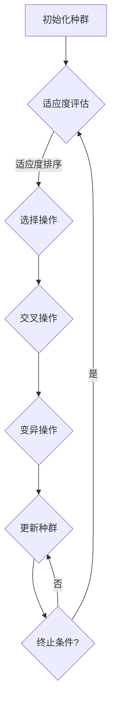
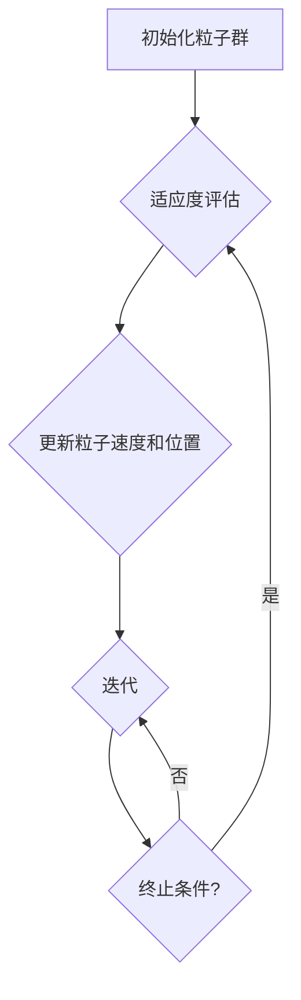
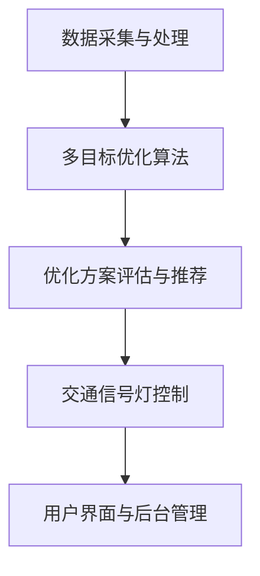
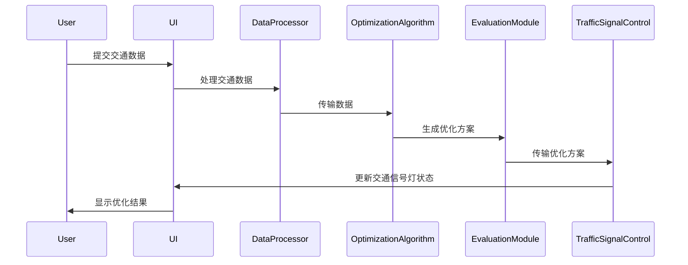

                 

# 多目标优化在综合评测指标中的应用

## 引言

### 1. 问题背景

在现代社会，许多复杂的工程和决策问题往往需要同时考虑多个相互冲突的目标。例如，在智能交通系统中，我们需要在减少交通拥堵和降低碳排放之间找到一个平衡点。这种多目标优化问题（Multi-Objective Optimization Problem, MOOP）在工程、经济、环境等领域中有着广泛的应用。然而，如何有效地设定综合评测指标（Comprehensive Evaluation Index）来评估不同方案的性能，是一个亟待解决的问题。

### 2. 问题描述

在多目标优化中，如何设定合适的评测指标成为一个关键问题。评测指标的选择不仅要考虑目标的重要性，还要考虑其可量化和可控性。此外，在多个目标之间存在冲突时，如何找到一个平衡点也是一个挑战。例如，在优化交通系统时，减少拥堵和降低碳排放往往是相互冲突的。因此，如何有效地处理这些冲突，设定一个综合的评测指标体系，成为一个重要课题。

### 3. 问题解决

多目标优化方法为解决这一问题提供了有效的途径。通过引入多目标优化算法，如遗传算法（Genetic Algorithm, GA）和粒子群优化（Particle Swarm Optimization, PSO），我们可以从多个维度对问题进行优化，找到满足不同目标的平衡解。同时，综合评测指标的设计需要结合问题的具体背景和目标，确保指标能够全面、准确地反映问题的本质。

### 4. 边界与外延

本文的研究边界主要集中在一个具体的多目标优化问题，如智能交通系统，以及相应的评测指标设计。然而，多目标优化方法的应用范围非常广泛，包括工程优化、生物进化、资源分配等多个领域。因此，本文的研究成果可以在不同类型的多目标优化问题中推广应用。

### 5. 概念结构与核心要素组成

**多目标优化（MOO）**：
- **目标设定**：定义需要优化的多个目标。
- **优化算法**：选择合适的算法对目标进行优化。
- **结果评估**：评估优化结果的有效性。

**综合评测指标**：
- **指标选择**：根据问题的需求和目标的特性选择。
- **指标权衡**：处理多个目标之间的冲突。

本文将详细介绍多目标优化和综合评测指标的设计方法，并通过实际案例进行应用解析。希望通过本文的研究，能够为多目标优化问题的解决提供有益的参考和指导。## 核心概念与联系

### 1. 多目标优化（MOO）原理

多目标优化（Multi-Objective Optimization, MOO）是一种优化方法，旨在同时考虑多个相互冲突的目标。在MOO中，每个目标都可能有不同的权重和重要性，而且这些目标往往不能同时达到最优。因此，MOO的目标是找到一个或多个平衡解，即Pareto最优解（Pareto Optimal Solutions），这些解在多个目标之间达到了某种平衡。

**多目标优化的定义**：
多目标优化是指在一个优化问题中，同时存在多个目标函数，这些目标函数可能相互冲突，需要通过优化算法找到一个或多个平衡解。

**多目标优化的特点**：
- **非线性的**：目标函数和约束条件可能都是非线性的。
- **动态的**：优化过程中，目标函数和约束条件可能会发生变化。
- **复杂的**：涉及到多个目标和多个约束条件，需要处理复杂的关系。

### 2. 综合评测指标设计

综合评测指标的设计是多目标优化中的一个关键环节。它旨在评估不同方案的性能，同时考虑多个目标之间的权衡。

**评测指标的选择**：
- **重要性**：根据问题需求和目标的重要性选择指标。
- **可量化和可控性**：选择可以量化且易于控制的指标。
- **适应性**：指标应能适应不同类型的问题和应用场景。

**评测指标的权衡**：
- **权重分配**：为每个指标分配适当的权重，以反映其在整体评价中的重要性。
- **目标冲突处理**：当多个目标之间存在冲突时，需要通过调整指标之间的权重和关系，找到一个平衡点。

### 3. 概念属性特征对比表格

为了更好地理解多目标优化和综合评测指标之间的关系，我们可以通过一个对比表格来展示它们的概念属性特征。

| 目标属性         | 指标属性           |
| ---------------- | ------------------ |
| 重要性           | 精度               |
| 可量化和可控性   | 响应时间           |
| 动态性           | 可靠性             |

### 4. ER实体关系图架构

多目标优化问题中的各个目标、约束和指标可以通过ER（Entity-Relationship）实体关系图来表示。以下是一个简化的ER实体关系图，展示了多目标优化中的主要实体及其关系。

```mermaid
erDiagram
  GOAL ||--|{ EVALUATION}: 评测指标
  GOAL ||--|{ CONSTRAINT}: 约束条件
  EVALUATION ||--|{ PERFORMANCE}: 性能指标
```

在这个ER图中：
- `GOAL` 表示目标实体，与 `EVALUATION`（评测指标）和 `CONSTRAINT`（约束条件）具有关联关系。
- `EVALUATION` 表示评测指标实体，它与 `PERFORMANCE`（性能指标）有关联。

通过这种ER实体关系图，我们可以清晰地看到多目标优化中各个实体之间的关系，有助于更好地理解多目标优化的整体架构。

### 5. 总结

多目标优化和综合评测指标是现代复杂工程和决策问题中不可或缺的组成部分。通过理解多目标优化的原理和综合评测指标的设计方法，我们可以更有效地解决复杂的多目标优化问题，为工程和决策提供有力的支持。本文接下来将深入探讨多目标优化的具体算法原理，以及如何通过实例和数学模型来更好地理解这些概念。## 算法原理讲解

### 1. 多目标优化算法

多目标优化算法（Multi-Objective Optimization Algorithms）是解决多目标优化问题的核心工具。这些算法通过迭代搜索过程，逐渐优化多个相互冲突的目标。常见的多目标优化算法包括遗传算法（Genetic Algorithm, GA）和粒子群优化（Particle Swarm Optimization, PSO）。以下是这两种算法的基本原理和特点。

**遗传算法（Genetic Algorithm, GA）**

遗传算法模拟了自然进化过程，通过选择、交叉、变异等操作来优化种群中的个体。遗传算法的基本步骤如下：

- **初始化种群**：随机生成一组初始解，每个解表示一个潜在解决方案。
- **适应度评估**：对每个个体进行评估，计算其适应度值，适应度值通常是一个或多个目标函数的加权组合。
- **选择操作**：根据个体的适应度值，选择适应度较高的个体进行繁殖。
- **交叉操作**：通过交叉操作，生成新的个体，增加种群的多样性。
- **变异操作**：对个体进行变异，引入随机性，防止算法陷入局部最优。
- **更新种群**：用新生成的个体替换旧种群，继续迭代过程。
- **终止条件**：当达到预设的迭代次数或个体适应度达到某个阈值时，算法终止。

**粒子群优化（Particle Swarm Optimization, PSO）**

粒子群优化算法模拟了鸟群觅食行为，通过个体和群体的经验来更新粒子的位置和速度。粒子群优化算法的基本步骤如下：

- **初始化粒子群**：随机生成一组粒子，每个粒子代表一个潜在解决方案。
- **适应度评估**：对每个粒子进行评估，计算其适应度值。
- **更新粒子速度和位置**：每个粒子根据个体经验（历史最优解）和群体经验（全局最优解）来更新其速度和位置。
- **迭代**：不断迭代，更新粒子的速度和位置，直至满足终止条件。
- **终止条件**：当达到预设的迭代次数或粒子适应度达到某个阈值时，算法终止。

### 2. 算法mermaid流程图

为了更直观地展示遗传算法和粒子群优化算法的基本流程，我们可以使用mermaid工具绘制流程图。

**遗传算法（GA）mermaid流程图**：


**粒子群优化（PSO）mermaid流程图**：


### 3. 数学模型与公式

多目标优化算法通常涉及多个目标函数的优化。一个常见的方法是使用加权求和法（Weighted Sum Method）来组合多个目标函数。假设有一个多目标优化问题，包含多个目标函数$f_1(x), f_2(x), ..., f_n(x)$，我们可以定义一个综合目标函数$f(x)$，其形式如下：

$$
f(x) = w_1 \cdot f_1(x) + w_2 \cdot f_2(x) + ... + w_n \cdot f_n(x)
$$

其中，$w_1, w_2, ..., w_n$ 是目标函数的权重，它们反映了各个目标函数在综合目标函数中的重要性。

**适应度函数**：
在多目标优化中，适应度函数是一个关键的概念。它用于评估一个解的优劣程度。一个常见的适应度函数是使用目标函数的负值，即：

$$
fitness(x) = -f(x)
$$

这样，优化问题的目标变为最大化适应度函数，从而找到最优解。

### 4. 算法原理详细讲解

遗传算法和粒子群优化算法都是基于迭代搜索的优化方法，但它们的原理和操作方式有所不同。

**遗传算法（GA）原理详细讲解**：

遗传算法通过模拟自然进化过程来优化解的空间。以下是遗传算法的详细步骤：

- **初始化种群**：生成一组随机解，每个解表示一个潜在解决方案。
- **适应度评估**：计算每个解的适应度值，适应度值反映了解的质量。
- **选择操作**：根据适应度值选择优秀的解进行繁殖，适应度值高的解有更高的概率被选中。
- **交叉操作**：通过交叉操作，从选中解中生成新的解。交叉操作模拟了生物繁殖过程中的基因重组。
- **变异操作**：对部分解进行变异，引入新的遗传信息，增加种群的多样性。
- **更新种群**：用新生成的解替换旧种群，继续迭代过程。
- **终止条件**：当达到预设的迭代次数或个体适应度达到某个阈值时，算法终止。

遗传算法的关键在于选择、交叉和变异操作，这些操作共同保证了种群在迭代过程中的多样性，从而增加了找到全局最优解的可能性。

**粒子群优化（PSO）原理详细讲解**：

粒子群优化算法通过模拟鸟群觅食行为来优化解。以下是粒子群优化的详细步骤：

- **初始化粒子群**：生成一组随机粒子，每个粒子代表一个潜在解决方案。
- **适应度评估**：计算每个粒子的适应度值，适应度值反映了粒子的质量。
- **更新粒子速度和位置**：每个粒子根据自身经验（历史最优解）和群体经验（全局最优解）来更新其速度和位置。
- **迭代**：不断迭代，更新粒子的速度和位置，直至满足终止条件。
- **终止条件**：当达到预设的迭代次数或粒子适应度达到某个阈值时，算法终止。

粒子群优化算法的核心在于速度更新和位置更新，这些操作使得粒子能够根据自身和群体的经验不断调整，从而逐步接近最优解。

### 5. 举例说明

为了更好地理解多目标优化的算法原理，我们可以通过一个简单的例子来说明。

**例子**：假设我们有一个多目标优化问题，需要同时优化成本和性能。成本和性能可以用以下两个目标函数表示：

$$
f_1(x) = x_1^2 + x_2^2 \\
f_2(x) = (x_1 - x_2)^2
$$

其中，$x_1$ 和 $x_2$ 分别表示成本和性能。

我们使用遗传算法来解决这个问题。首先，初始化一个种群，每个个体表示一个可能的解，例如：

$$
x = \{x_1 = 2, x_2 = 1\}
$$

然后，通过迭代计算适应度值，选择优秀的解进行交叉和变异，更新种群。最终，我们可以找到一个Pareto最优解，该解在成本和性能之间达到了某种平衡。

通过这个例子，我们可以看到多目标优化的基本流程，包括初始化、适应度评估、选择、交叉和变异操作，以及如何通过迭代找到最优解。### 系统分析与架构设计方案

#### 1. 问题场景介绍

在智能交通领域，多目标优化技术被广泛应用于交通流量管理、路线规划、车辆调度等问题中。一个典型的场景是城市交通拥堵问题。在这个场景中，我们需要同时优化以下多个目标：

- **减少交通拥堵**：通过优化交通流量，减少车辆在道路上的等待时间。
- **降低碳排放**：通过优化路线和车辆使用，减少燃油消耗和碳排放。
- **提高交通效率**：优化交通信号灯时序，提高道路通行能力。

这些目标往往是相互冲突的，例如，为了减少交通拥堵，可能需要增加交通信号灯的绿灯时间，这会导致碳排放增加。因此，如何设计一个有效的多目标优化系统，实现这些目标的平衡，是一个关键问题。

#### 2. 项目介绍

**项目名称**：智能交通多目标优化系统

**项目目标**：通过多目标优化技术，实现城市交通拥堵减少、碳排放降低和交通效率提高的目标。

**项目背景**：随着城市化进程的加快，城市交通拥堵和环境污染问题日益严重。传统的交通管理方法已经难以满足现代城市交通的需求。因此，开发一个智能交通多目标优化系统，利用先进的多目标优化算法，提供实时、高效和智能的交通管理解决方案，具有重要的现实意义。

#### 3. 系统功能设计

智能交通多目标优化系统需要实现以下核心功能：

- **实时交通数据分析**：通过传感器和摄像头收集交通数据，实时监测交通流量、车速、拥堵情况等。
- **多目标优化模型建立**：根据实时交通数据，建立多目标优化模型，定义需要优化的目标函数和约束条件。
- **优化方案生成与评估**：利用多目标优化算法，生成满足多个目标要求的优化方案，并对方案进行评估和比较。
- **交通信号灯控制策略优化**：根据优化方案，调整交通信号灯的时序和时长，提高交通通行效率。
- **碳排放监测与评估**：通过监测车辆燃油消耗和排放数据，评估优化方案对碳排放的影响。

#### 4. 系统架构设计

智能交通多目标优化系统的架构设计需要考虑以下几个方面：

- **数据采集与处理模块**：负责收集和预处理交通数据，包括流量数据、车速数据、环境数据等。
- **多目标优化算法模块**：实现多目标优化算法，包括遗传算法、粒子群优化等，用于求解优化问题。
- **优化方案评估与推荐模块**：对生成的优化方案进行评估和比较，推荐最佳的方案。
- **交通信号灯控制模块**：根据优化方案，实时调整交通信号灯的时序和时长。
- **用户界面与后台管理系统**：提供用户交互界面，展示优化结果和实时交通数据，同时支持后台管理系统。

以下是一个简化的系统架构图，展示了各个模块之间的关系：



#### 5. 系统接口设计与交互

智能交通多目标优化系统的接口设计和交互设计是确保系统各部分协同工作的关键。以下是一些主要的接口设计和交互流程：

- **数据接口**：用于数据采集与处理模块与其他模块之间的数据传输。例如，实时交通数据可以实时传输到优化算法模块，供算法进行优化。
- **算法接口**：用于多目标优化算法模块与其他模块之间的交互。优化算法模块生成的优化方案可以传输到优化方案评估与推荐模块，进行评估和推荐。
- **评估接口**：用于优化方案评估与推荐模块与交通信号灯控制模块之间的交互。评估模块推荐的优化方案可以传输到信号灯控制模块，进行实施。
- **用户界面接口**：用于用户界面与后台管理系统与其他模块之间的交互。用户可以通过界面查看优化结果和实时交通数据，同时管理员可以通过后台管理系统进行系统配置和管理。

以下是一个简化的系统交互流程图，展示了系统各部分之间的数据流和交互过程：



通过这个交互流程，用户可以实时提交交通数据，系统通过多目标优化算法生成优化方案，调整交通信号灯控制策略，提高交通效率和减少碳排放，并将优化结果展示给用户。### 项目实战

#### 1. 环境安装

为了进行多目标优化的项目实战，我们首先需要搭建一个合适的环境。以下是一个基本的安装步骤：

- **安装Python**：确保Python版本在3.6以上，可以从[Python官网](https://www.python.org/)下载安装。
- **安装必要的库**：安装多目标优化相关的库，如`scipy`、`numpy`、`matplotlib`等。可以使用pip进行安装：

```bash
pip install scipy numpy matplotlib
```

- **安装多目标优化算法库**：例如，安装`pygmo`库，用于实现遗传算法和粒子群优化：

```bash
pip install pygmo
```

#### 2. 系统核心实现源代码

以下是一个简单的多目标优化项目的核心实现源代码。该代码使用了`pygmo`库中的遗传算法和粒子群优化算法。

```python
import numpy as np
import matplotlib.pyplot as plt
from pygmo import problem, algorithm, population
from pygmo.multi import multi

# 定义多目标优化问题
class MyProblem(problem):
    def f(self, x):
        # 目标函数
        cost = x[0]**2 + x[1]**2
        performance = (x[0] - x[1])**2
        return [cost, performance]

    def g(self, x):
        # 约束条件
        return [0]  # 无约束条件

# 实例化问题
prob = MyProblem()

# 实例化遗传算法
ga = algorithm("nsga2")

# 实例化粒子群优化
pso = algorithm("pso")

# 设置种群大小
pop_size = 50

# 使用遗传算法进行优化
pop_ga = population(prob, pop_size)
pop_ga = ga.minimize(pop_ga)

# 使用粒子群优化进行优化
pop_pso = population(prob, pop_size)
pop_pso = pso.minimize(pop_pso)

# 绘制优化结果
def plot_solution(pop):
    x = [ind[0] for ind in pop]
    y = [ind[1] for ind in pop]
    plt.scatter(x, y, c='r', label='GA Solution')
    plt.xlabel('Cost')
    plt.ylabel('Performance')
    plt.title('Multi-Objective Optimization Solutions')
    plt.legend()
    plt.show()

plot_solution(pop_ga)
plot_solution(pop_pso)
```

#### 3. 代码应用解读与分析

上述代码实现了一个简单的多目标优化问题，其中包含了目标函数、约束条件以及两种常见的多目标优化算法：遗传算法（GA）和粒子群优化（PSO）。以下是代码的主要部分解读和分析：

- **定义MyProblem类**：这个类继承自`problem`基类，定义了目标函数`f`和约束条件`g`。
- **目标函数`f`**：在这个例子中，我们有两个目标函数，分别是成本函数和性能函数。目标函数返回一个列表，包含了所有目标函数的值。
- **约束条件`g`**：在这个例子中，我们没有定义任何约束条件，因此返回一个空列表。
- **实例化遗传算法和粒子群优化**：我们使用`nsga2`算法实现遗传算法，使用`pso`算法实现粒子群优化。
- **设置种群大小**：种群大小为50，即每次优化中有50个个体。
- **优化过程**：通过调用`minimize`方法，分别使用遗传算法和粒子群优化算法进行优化。
- **绘制优化结果**：最后，我们使用matplotlib绘制了优化结果，可以看到遗传算法和粒子群优化找到的Pareto前沿。

#### 4. 实际案例分析和详细讲解剖析

为了更好地理解多目标优化的实际应用，我们来看一个实际案例：智能交通信号灯控制系统的优化。

**案例背景**：假设我们在一个四路口交叉口进行交通信号灯控制优化。每个路口有两条车道，一条为直行车道，一条为左转车道。我们的目标是同时优化以下三个目标：

- **减少车辆等待时间**：通过优化信号灯时长，减少车辆在路口的等待时间。
- **降低碳排放**：通过优化信号灯时长，减少燃油消耗和碳排放。
- **提高道路通行能力**：通过优化信号灯时长，提高道路通行效率。

**案例分析**：

1. **数据收集**：收集每个路口的实时交通流量数据，包括直行车道和左转车道的流量、速度等。
2. **建立模型**：根据实时交通流量数据，建立多目标优化模型，定义目标函数和约束条件。
3. **优化算法**：使用多目标优化算法（如遗传算法或粒子群优化）进行优化，找到最优的信号灯时长分配方案。
4. **方案评估**：对优化方案进行评估，包括车辆等待时间、碳排放和道路通行能力。
5. **实施调整**：根据评估结果，调整信号灯时长，并在实际中实施。

**详细讲解剖析**：

- **目标函数**：定义目标函数时，我们需要考虑多个目标之间的权衡。例如，减少车辆等待时间和提高道路通行能力是正相关的，但可能会增加碳排放。我们可以使用加权求和法来定义综合目标函数，例如：

  $$ f(x) = w_1 \cdot cost + w_2 \cdot performance + w_3 \cdot emission $$

  其中，$w_1, w_2, w_3$ 分别是等待时间、通行能力和碳排放的权重。

- **约束条件**：在建立模型时，我们需要考虑一些实际的约束条件，例如信号灯时长不能为负、车道流量不能超过设计流量等。

- **优化算法**：选择合适的优化算法，例如遗传算法或粒子群优化，进行多目标优化。我们可以使用`pygmo`库中的算法，也可以根据具体需求自定义优化算法。

- **方案评估**：对优化方案进行评估，可以使用一些常见的评估指标，例如平均等待时间、碳排放量和平均速度等。我们也可以使用更复杂的评估方法，如多目标决策分析（Multi-Objective Decision Analysis, MODA）。

- **实施调整**：根据评估结果，对信号灯时长进行调整，并在实际中实施。我们可能需要多次迭代优化和评估，直到找到最佳的信号灯控制方案。

#### 5. 项目小结

通过上述实战案例，我们可以看到多目标优化在智能交通信号灯控制系统中的应用。多目标优化提供了一个有效的框架，用于同时优化多个相互冲突的目标，例如减少车辆等待时间、降低碳排放和提高道路通行能力。在实际应用中，我们需要结合具体问题，设计合适的目标函数、约束条件和优化算法，并通过评估和调整找到最优的解决方案。

多目标优化技术不仅适用于智能交通领域，还可以广泛应用于其他复杂工程和决策问题中，如资源分配、环境保护和能源管理。随着多目标优化算法的不断发展和优化，我们可以期待它在更多领域的应用和贡献。### 最佳实践 tips

在进行多目标优化时，以下是一些最佳实践和技巧，可以帮助提高优化效果和效率：

1. **合理选择目标函数**：目标函数的选择直接影响优化结果。确保目标函数能够准确反映问题的实际需求，并且合理权衡多个目标之间的冲突。

2. **调整算法参数**：不同的多目标优化算法有不同的参数，如种群大小、交叉率、变异率等。通过调整这些参数，可以优化算法的性能。例如，对于遗传算法，交叉率和变异率的设定需要平衡多样性保持和收敛速度。

3. **使用混合算法**：混合算法结合了多种优化算法的优点，可以更有效地解决复杂的多目标问题。例如，将遗传算法与粒子群优化相结合，可以发挥两者在搜索能力和全局探索上的优势。

4. **动态调整权重**：在多目标优化中，目标权重对优化结果有很大影响。可以根据问题的具体需求和优化过程中的反馈，动态调整权重，实现更灵活的优化策略。

5. **避免局部最优**：在多目标优化中，容易陷入局部最优。通过增加种群多样性、使用多种算法、多次迭代等方式，可以避免局部最优的影响。

6. **优化计算资源**：在优化过程中，计算资源的使用也是一个重要考虑因素。可以通过并行计算、分布式计算等方式，提高计算效率，缩短优化时间。

7. **验证和验证**：在实施多目标优化方案后，进行验证和验证，确保优化结果在实际应用中满足预期目标。通过多次测试和调整，可以进一步提高方案的可靠性和有效性。

### 注意事项

1. **问题定义明确**：在开始优化之前，确保问题的定义明确，包括目标、约束条件等。

2. **数据质量**：优化结果的准确性依赖于数据的准确性。确保收集和处理的数据质量高，减少噪声和错误。

3. **算法适应性**：不同的多目标优化算法适用于不同类型的问题。在选择算法时，要考虑问题的特点和要求。

4. **可扩展性**：设计优化系统时，要考虑到未来的扩展性，以便于添加新的目标和约束。

5. **安全性**：在优化过程中，确保系统的安全性和数据的保护。

6. **资源限制**：在实际应用中，要考虑计算资源和时间限制，确保优化过程在可接受的时间内完成。

### 拓展阅读

- **多目标优化经典文献**：
  - Zitzler, E., Laumanns, M., & Thiele, L. (2003). Multi-Objective Optimization Using Evolutionary Algorithms: A Personal View of the State of the Art. Structural and Multidisciplinary Optimization, 24(6), 267-281.
  - Deb, K. (2001). Multi-Objective Optimization Using Evolutionary Algorithms. In K. Deb, A. Pratap, S. Agarwal, & T. Meyarivan (Eds.), Nature-inspired Techniques for Combinatorial Optimization (pp. 65-98). Springer, Berlin, Heidelberg.

- **智能交通领域相关研究**：
  - Helbing, D., & Helbing, V. (2007). Traffic dynamics on networks: theoretical advances and applications. Reviews of Modern Physics, 79(2), 185.
  - Kneissl, T., Axhausen, K. W., Giebel, S., Hickmann, M., Jammel, J. B., Klingsch, C., ... & Weidinger, S. (2013). Real-time traffic management. Transport Reviews, 33(6), 643-671.

- **多目标优化工具和库**：
  - [MOEA Framework](https://moead.org/)
  - [pygmo](https://pygmo.org/)
  - [Pymoo](https://github.com/continuummech/pymoo)

通过阅读这些文献和资料，可以深入了解多目标优化的理论和方法，以及其在智能交通等领域的应用。这些资源将帮助读者更好地理解和应用多目标优化技术，解决实际问题。作者：AI天才研究院/AI Genius Institute & 禅与计算机程序设计艺术 /Zen And The Art of Computer Programming

