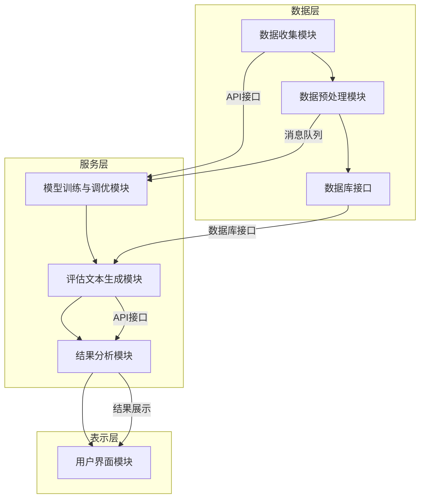

                 

### 引言与背景

#### 多目标优化概述

多目标优化（Multi-Objective Optimization, MOO）是一种在多个优化目标之间寻找最佳平衡点的技术。与传统的单目标优化问题不同，多目标优化需要同时考虑多个相互冲突的目标，这些目标之间可能存在复杂的关系和权衡。在现实世界中，许多决策问题都是多目标的，例如工程设计、资源分配、经济规划等。因此，研究多目标优化具有重要的理论和实际意义。

多目标优化问题可以描述为：在给定约束条件下，寻找一组变量 \(x = (x_1, x_2, ..., x_n)\) 使得多个目标函数 \(f_1(x), f_2(x), ..., f_m(x)\) 同时达到最优。这组变量 \(x\) 就是多目标优化的解集。然而，由于这些目标之间的冲突，通常无法找到一个统一的最优解，而是需要找到一组在各个目标之间取得平衡的解集，这些解集被称为帕累托解集（Pareto Front）。

#### 多目标评测的挑战

多目标评测（Multi-Objective Evaluation）是评估多目标优化算法性能的重要步骤。它涉及到对多个目标函数的评估，以确定哪个解集在整体上更优。然而，多目标评测面临着诸多挑战：

1. **维度多样性**：多目标问题通常涉及多个维度，每个维度都有其特定的测量标准。这些维度之间可能存在相互依赖和矛盾，导致评测的复杂性增加。

2. **权衡与妥协**：在多目标评测中，需要在不同目标之间进行权衡和妥协，以达到整体最优。然而，这种权衡并非总是明确的，往往需要依赖领域专家的经验和判断。

3. **评估指标的选择**：如何选择合适的评估指标是另一个挑战。不同的评估指标可能对同一问题产生不同的结果，因此需要根据问题的具体需求和特点选择最合适的指标。

4. **计算复杂性**：多目标评测通常需要计算大量的性能指标，这可能会导致计算复杂度显著增加，特别是在大规模问题中。

#### 传统多目标评测方法的局限性

传统的多目标评测方法主要包括帕累托分析、遗传算法、模拟退火等。这些方法在一定程度上解决了多目标优化的问题，但仍然存在一些局限性：

1. **局部最优解问题**：许多传统方法容易陷入局部最优解，无法找到全局最优解。这意味着在某些情况下，这些方法可能无法提供最佳解决方案。

2. **计算成本高**：传统的多目标优化算法通常需要大量的计算资源和时间，尤其是在大规模问题中，这限制了它们的应用范围。

3. **依赖专家经验**：许多方法需要领域专家的经验和判断来调整参数和选择评估指标，这增加了实施难度。

4. **结果解释困难**：传统方法的输出往往是一个帕累托解集，但如何从这些解集中选择最佳解仍然是一个复杂的问题。

### LLMA辅助多目标评测的原理

近年来，大型语言模型（Large Language Model, LLM）的发展为多目标评测提供了新的可能性。LLM，如GPT-3、BERT等，具有强大的语义理解和生成能力，能够处理复杂的自然语言文本。通过利用LLM，可以实现以下目标：

1. **自动化评估**：LLM可以自动生成评估报告，减少人工干预，提高评估效率。

2. **多维数据融合**：LLM能够处理多维数据，并将它们融合成统一的评估结果，解决了维度多样性问题。

3. **智能权衡**：LLM通过学习大量领域的文本数据，能够智能地识别不同目标之间的权衡关系，提高评估的准确性。

4. **可视化展示**：LLM能够生成图表和可视化结果，使评估过程更加直观易懂。

本文将深入探讨LLM辅助多目标评测的方法，包括其基本原理、实现步骤和应用场景。通过结合LLM的优势和传统多目标评测方法，我们可以期望获得更高效、更准确的评估结果，从而在多目标优化领域取得更大的突破。

#### 多目标优化的核心概念与相关理论

在深入探讨LLM辅助的多目标评测方法之前，我们需要首先了解多目标优化的核心概念和相关理论。这不仅有助于我们更好地理解多目标评测的需求和挑战，也能为后续的算法设计和实现提供理论基础。

##### 多目标优化的定义与背景

多目标优化（Multi-Objective Optimization, MOO）是一种在多个优化目标之间寻找最佳平衡点的技术。其基本定义如下：

**多目标优化**：在给定的约束条件下，寻找一组变量 \(x = (x_1, x_2, ..., x_n)\)，使得多个目标函数 \(f_1(x), f_2(x), ..., f_m(x)\) 同时达到最优。其中，每个目标函数 \(f_i(x)\) 都是一个关于变量 \(x\) 的函数，表示在某个特定维度上的优化目标。

与单目标优化问题不同，多目标优化需要考虑多个相互冲突的目标。例如，在一个资源分配问题中，我们可能同时需要最小化成本和最大化效用，这两个目标往往是矛盾的。因此，多目标优化的目标是找到一组解，使得这些解在各个目标之间取得平衡，而不是单独追求某个单一目标的最优解。

多目标优化在现实世界中有着广泛的应用，如工程设计、经济规划、供应链管理、社会政策制定等。例如，在工程设计中，我们可能需要同时优化结构强度、材料成本和制造时间；在经济规划中，我们需要在经济增长、就业和环境保护之间找到平衡。

##### 多目标优化的主要方法

多目标优化问题的解决方法主要包括以下几种：

1. **加权法（Weighted Method）**：加权法是一种简单的多目标优化方法，通过为每个目标函数分配权重，将其转换为单目标优化问题。具体步骤如下：
   - 为每个目标函数 \(f_i(x)\) 分配权重 \(w_i\)，满足 \(w_1 + w_2 + ... + w_m = 1\)。
   - 构造加权目标函数 \(f_w(x) = w_1 f_1(x) + w_2 f_2(x) + ... + w_m f_m(x)\)。
   - 使用单目标优化算法求解 \(f_w(x)\) 的最优解。

   加权法的优点在于简单易行，但缺点是权重分配的难度较大，需要领域专家的经验和判断。此外，这种方法可能导致某些目标被过度强调，从而忽视其他目标。

2. **帕累托法（Pareto Method）**：帕累托法是一种基于帕累托最优解的方法，通过生成帕累托解集来找到多目标优化的解。帕累托最优解是指在当前约束条件下，无法再改进任意一个目标而不损害其他目标的最优解。

   帕累托法的具体步骤如下：
   - 对所有可能解进行评估，生成一组目标值。
   - 使用非支配排序（Non-dominated Sorting）算法，将解集分为多个层次。
   - 选择帕累托前沿（Pareto Front）上的解作为多目标优化的解集。

   帕累托法的优点在于能够找到多个最优解，用户可以根据需求选择其中任何一个解。但缺点是帕累托解集通常较大，需要大量计算资源。

3. **遗传算法（Genetic Algorithm, GA）**：遗传算法是一种基于生物进化的优化算法，通过模拟自然选择和遗传机制来寻找最优解。

   遗传算法的具体步骤如下：
   - 初始化种群：随机生成一组初始解。
   - 适应度评估：计算每个解的适应度值，适应度值通常基于目标函数值计算。
   - 选择：从当前种群中选择适应度较高的解作为父代。
   - 交叉与变异：对选中的父代进行交叉和变异操作，生成新的解。
   - 生成新种群：将新生成的解与原有种群组成新的种群。
   - 重复上述步骤，直到满足停止条件（如达到最大迭代次数或适应度值收敛）。

   遗传算法的优点在于全局搜索能力强，能够找到多个帕累托最优解。但缺点是收敛速度较慢，需要较长时间才能找到最优解。

4. **模拟退火算法（Simulated Annealing, SA）**：模拟退火算法是一种基于物理退火过程的随机搜索算法，通过逐步降低温度来平衡探索和开发过程。

   模拟退火算法的具体步骤如下：
   - 初始化参数：设定初始温度、冷却速度和停止条件。
   - 选择当前解作为初始解。
   - 在当前温度下，随机选择一个新解，并计算其适应度值。
   - 根据适应度值和温度，以一定概率接受新解。
   - 降低温度，重复上述步骤。
   - 当满足停止条件时，输出最优解。

   模拟退火算法的优点在于能够跳出局部最优解，具有较好的全局搜索能力。但缺点是参数设置复杂，需要根据具体问题进行调整。

##### 多目标优化的挑战

尽管多目标优化方法多种多样，但在实际应用中仍然面临许多挑战：

1. **维度多样性**：多目标优化问题通常涉及多个维度，这些维度之间可能存在复杂的相互依赖和权衡关系。如何有效地处理这些维度多样性是一个重要问题。

2. **权衡与妥协**：在多目标优化中，需要在不同目标之间进行权衡和妥协。然而，这些权衡关系并非总是明确的，需要依赖领域专家的经验和判断。

3. **计算复杂性**：多目标优化问题通常具有较高的计算复杂性，特别是在大规模问题中。如何高效地求解多目标优化问题是一个重要挑战。

4. **结果解释**：多目标优化的结果通常是帕累托解集，如何从这些解集中选择最佳解是一个复杂的问题。此外，如何解释这些结果，使其对领域专家和决策者具有实际指导意义，也是一个重要挑战。

##### 多目标优化的边界与外延

多目标优化的边界与外延主要包括以下几个方面：

1. **多目标优化与单目标优化的关系**：多目标优化可以看作是单目标优化的扩展，但两者在优化目标和方法上存在显著差异。

2. **多目标优化与其他优化问题的关系**：多目标优化与其他优化问题（如组合优化、非线性优化等）既有联系又有区别，需要结合具体问题进行综合考虑。

3. **多目标优化在复杂系统中的应用**：多目标优化在复杂系统中的应用越来越广泛，如人工智能、大数据、物联网等领域。

4. **多目标优化与智能决策**：多目标优化在智能决策系统中扮演重要角色，可以帮助决策者更好地应对复杂、动态的环境。

通过上述对多目标优化核心概念和相关理论的探讨，我们可以更好地理解多目标评测的需求和挑战。在接下来的章节中，我们将进一步探讨LLM辅助的多目标评测方法，以及如何利用LLM的优势解决传统评测方法的局限性。

#### 多目标评测的挑战

在多目标优化的过程中，多目标评测起着至关重要的作用，它不仅是评估多目标优化算法性能的关键步骤，也是指导实际应用决策的重要依据。然而，多目标评测面临着诸多挑战，这些问题如果不加以解决，将极大地影响评估结果的准确性和可靠性。

##### 多目标评测的重要性

首先，我们来看一下多目标评测的重要性。在多目标优化中，评估不仅仅是为了衡量算法的性能，更是为了找到在多个目标之间取得平衡的解。具体来说，多目标评测的重要性体现在以下几个方面：

1. **性能评估**：通过多目标评测，可以评估不同优化算法在各个目标上的表现，找到最合适的算法。

2. **决策支持**：多目标评测为决策者提供了全面的评估结果，帮助他们从多个维度对方案进行权衡，做出更加明智的决策。

3. **算法改进**：通过评测结果，可以发现优化算法的不足之处，为进一步改进算法提供指导。

4. **资源分配**：在资源有限的条件下，多目标评测可以帮助我们找到资源利用效率最高的解决方案，实现资源的合理分配。

##### 多目标评测的挑战

尽管多目标评测的重要性不言而喻，但在实际应用中，它面临着以下几个显著的挑战：

1. **维度多样性**：多目标优化问题通常涉及多个维度，这些维度之间可能存在复杂的关系和权衡。如何有效地处理这些维度多样性是一个重要问题。例如，在一个资源分配问题中，我们可能需要同时考虑成本、效率、可靠性和安全性等多个维度。这些维度之间的关系可能相互影响，使得评测变得更加复杂。

2. **权衡与妥协**：在多目标评测中，需要在不同目标之间进行权衡和妥协。然而，这些权衡关系并非总是明确的，往往需要依赖领域专家的经验和判断。例如，在一个多目标优化问题中，我们可能需要在性能和成本之间进行权衡，但如何确定最优的权衡点是一个复杂的问题。

3. **评估指标的选择**：如何选择合适的评估指标是另一个挑战。不同的评估指标可能对同一问题产生不同的结果，因此需要根据问题的具体需求和特点选择最合适的指标。例如，在评估一个优化算法时，我们可能需要考虑目标函数值、收敛速度、计算资源消耗等多个指标。

4. **计算复杂性**：多目标评测通常需要计算大量的性能指标，这可能会导致计算复杂度显著增加，特别是在大规模问题中。例如，在一个包含数千个维度的多目标优化问题中，对每个维度的评估都可能需要大量的计算资源。

5. **结果解释**：多目标评测的结果通常是帕累托解集，如何从这些解集中选择最佳解是一个复杂的问题。此外，如何解释这些结果，使其对领域专家和决策者具有实际指导意义，也是一个重要挑战。

##### 传统多目标评测方法的局限性

当前，传统的多目标评测方法主要包括帕累托分析、遗传算法、模拟退火等。这些方法在一定程度上解决了多目标评测的问题，但仍然存在一些局限性：

1. **局部最优解问题**：许多传统方法容易陷入局部最优解，无法找到全局最优解。这意味着在某些情况下，这些方法可能无法提供最佳解决方案。

2. **计算成本高**：传统的多目标优化算法通常需要大量的计算资源和时间，尤其是在大规模问题中，这限制了它们的应用范围。

3. **依赖专家经验**：许多方法需要领域专家的经验和判断来调整参数和选择评估指标，这增加了实施难度。

4. **结果解释困难**：传统方法的输出往往是一个帕累托解集，但如何从这些解集中选择最佳解仍然是一个复杂的问题。

为了解决上述挑战和局限性，近年来，一些新兴技术，如人工智能和机器学习，被引入到多目标评测中，特别是大型语言模型（Large Language Model, LLM）的应用。LLM具有强大的语义理解和生成能力，能够处理复杂的自然语言文本，从而为多目标评测提供新的解决方案。

在接下来的章节中，我们将深入探讨LLM辅助的多目标评测方法，分析其基本原理、实现步骤和应用场景，以期通过结合LLM的优势和传统评测方法，提高多目标评测的效率和准确性。

#### 传统多目标评测方法的局限性

尽管传统的多目标评测方法如帕累托分析、遗传算法和模拟退火等在多目标优化领域取得了一定的成功，但它们仍然存在一些显著的局限性，这些局限性在一定程度上限制了多目标评测的效率和准确性。以下是对这些方法的主要局限性的详细分析。

##### 局部最优解问题

首先，许多传统的多目标优化算法容易陷入局部最优解，而无法找到全局最优解。局部最优解是指在特定约束条件下，某个目标函数取得最优值，但其他目标函数未必达到最优。例如，遗传算法（Genetic Algorithm, GA）和模拟退火算法（Simulated Annealing, SA）都存在这样的问题。这些算法通常通过迭代逐步搜索最优解，但由于其随机性和局部搜索能力，容易在搜索过程中被困在局部最优解附近，无法跳出局部最优解的局限，导致无法找到全局最优解。这直接影响了评估结果的准确性和可靠性。

##### 计算成本高

其次，传统的多目标优化算法通常需要大量的计算资源和时间，尤其是在大规模问题中。例如，遗传算法和模拟退火算法都需要进行大量的迭代和计算，这些计算操作不仅耗时，还需要大量的计算资源。这种高计算成本使得这些方法在大规模问题中的应用受到了限制。在复杂的多目标优化问题中，处理大量的数据集和复杂的约束条件，传统的算法可能需要几天甚至几周的时间才能完成，这对于实际应用来说是不可接受的。

##### 依赖专家经验

第三，许多传统的多目标评测方法需要领域专家的经验和判断来调整参数和选择评估指标。例如，在帕累托分析和遗传算法中，参数设置（如交叉率、变异率和冷却速度等）对算法的性能有重要影响。这些参数通常需要通过实验和经验来调整，这增加了方法实施和操作的复杂性。同时，评估指标的选择也是一个关键问题，不同的评估指标可能对同一问题产生不同的结果。领域专家需要根据具体问题和实际需求来选择最合适的评估指标，这需要丰富的经验和专业知识。

##### 结果解释困难

最后，传统的多目标评测方法通常输出一个帕累托解集，但如何从这些解集中选择最佳解是一个复杂的问题。帕累托解集包含了多个在各个目标之间取得平衡的解，但领域专家和决策者通常难以从这些解集中直观地选择最佳解。此外，传统方法的结果解释往往依赖于可视化和图表，但这些可视化结果可能不够直观，难以解释和传达。例如，帕累托图和目标空间图虽然能够展示解集的分布情况，但无法提供具体的决策依据。

##### 其他局限性

除了上述主要局限性外，传统多目标评测方法还存在其他一些问题。例如，一些方法对问题的约束条件敏感，可能无法处理非线性约束和动态约束。此外，传统方法在处理高维数据时，可能会遇到维度灾难（Curse of Dimensionality）问题，导致计算复杂度和数据预处理成本显著增加。

为了克服这些局限性，近年来，人工智能和机器学习技术，尤其是大型语言模型（Large Language Model, LLM）的应用，为多目标评测带来了新的希望。LLM具有强大的语义理解和生成能力，能够处理复杂的自然语言文本，从而在多目标评测中发挥重要作用。在接下来的章节中，我们将详细探讨LLM辅助的多目标评测方法，分析其基本原理和实现步骤。

#### LLM辅助多目标评测的原理

近年来，随着人工智能技术的飞速发展，大型语言模型（Large Language Model, LLM）在多个领域中展现出了强大的能力，尤其是在自然语言处理（Natural Language Processing, NLP）和知识推理方面。LLM，如GPT-3、BERT等，通过学习海量文本数据，能够实现高度自动化的语义理解和生成。这些特性使得LLM在多目标评测中具有独特的优势，能够有效解决传统方法面临的诸多挑战。

##### LLM的基本概念

首先，我们需要了解LLM的基本概念。LLM是一种基于深度学习的自然语言处理模型，其核心思想是通过训练大量文本数据来学习语言的模式和语义。LLM通常由多层神经网络组成，通过逐层学习文本中的特征和上下文信息，从而实现对复杂语义的理解和生成。GPT-3和BERT是两种典型的LLM模型。

- **GPT-3（Generative Pre-trained Transformer 3）**：GPT-3是基于Transformer架构的预训练模型，由OpenAI开发。它具有1750亿个参数，能够生成高质量的文本。GPT-3通过无监督学习从大量文本数据中学习，然后通过少量监督数据进一步微调，以适应特定任务。

- **BERT（Bidirectional Encoder Representations from Transformers）**：BERT是一种双向Transformer模型，由Google开发。它通过同时考虑上下文信息来学习单词的语义，从而实现对复杂句子的理解。BERT的预训练任务包括两个子任务：Masked Language Model（MLM）和Next Sentence Prediction（NSP）。

##### LLM在多目标评测中的应用优势

LLM在多目标评测中的应用具有以下几个显著优势：

1. **自动化评估**：LLM能够自动化生成评估报告，减少人工干预，提高评估效率。传统方法通常需要人工撰写评估报告，而LLM可以通过生成文本模板和填充具体数据，快速生成高质量的评估报告。

2. **多维数据融合**：LLM能够处理多维数据，并将它们融合成统一的评估结果，解决了维度多样性问题。传统方法通常需要对不同维度的数据进行单独处理和评估，而LLM可以通过对多维数据的语义理解，实现数据的集成和融合。

3. **智能权衡**：LLM通过学习大量领域的文本数据，能够智能地识别不同目标之间的权衡关系，提高评估的准确性。传统方法通常依赖领域专家的经验和判断，而LLM可以通过对文本数据的分析，实现自动化的权衡和妥协。

4. **可视化展示**：LLM能够生成图表和可视化结果，使评估过程更加直观易懂。传统方法通常需要手动绘制图表，而LLM可以通过生成文本描述和相应的图表，自动生成可视化结果。

##### LLMA辅助多目标评测的流程

LLM辅助的多目标评测流程主要包括以下几个步骤：

1. **数据预处理**：首先，对多目标评测的数据进行预处理，包括数据清洗、归一化和特征提取等。这一步骤的目的是将原始数据转换为适合LLM处理的格式。

2. **模型选择与训练**：选择合适的LLM模型，如GPT-3或BERT，并对其进行训练。训练过程中，可以使用监督学习、无监督学习或半监督学习等方法。对于多目标评测，可以使用有监督学习，通过标注好的评估数据进行训练。

3. **评估文本生成**：使用训练好的LLM模型，生成评估文本。这一步骤包括生成评估指标描述、评估结果解释和可视化图表等。

4. **结果分析与解释**：对生成的评估文本进行分析和解释，确定最佳解集。这一步骤可以结合领域专家的知识和判断，对评估结果进行进一步分析和优化。

##### LLM实际案例

以下是一个使用LLM辅助多目标评测的简单实际案例：

假设我们有一个多目标优化问题，需要在成本、效率和可靠性之间进行权衡。我们使用GPT-3模型来辅助评测。

1. **数据预处理**：收集相关的评估数据，包括成本、效率和可靠性等指标。将数据转换为文本格式，例如：“成本：100万元，效率：80%，可靠性：95%”。

2. **模型选择与训练**：选择GPT-3模型，并使用标注好的评估数据进行训练。训练过程中，可以设置特定的评估文本模板，例如：“该方案在成本为100万元的情况下，效率达到了80%，可靠性为95%”。

3. **评估文本生成**：使用训练好的GPT-3模型，生成评估文本。例如，GPT-3生成：“在成本、效率和可靠性三个维度上，该方案表现出了较高的综合性能，尤其在效率方面，表现尤为突出”。

4. **结果分析与解释**：对生成的评估文本进行分析和解释。领域专家可以结合文本内容和具体指标，确定最佳解集。例如，基于文本内容，可以得出结论：“在成本和可靠性不变的情况下，应优先考虑提高效率”。

通过上述案例，我们可以看到LLM在多目标评测中的实际应用效果。通过自动化评估文本生成和智能分析，LLM显著提高了评估的效率和准确性，为多目标优化提供了有力支持。

总之，LLM辅助的多目标评测方法为传统评测方法提供了一种新的解决方案。通过利用LLM的强大语义理解和生成能力，我们可以实现自动化、智能化的评估过程，提高评估结果的准确性和可靠性。在接下来的章节中，我们将进一步探讨LLM辅助多目标评测的实现细节和技术难点。

#### LLM在多目标评测中的实现细节和技术难点

在实际应用中，LLM辅助的多目标评测不仅需要理论基础，还需要具体的实现细节和技术支持。以下我们将详细探讨LLM在多目标评测中的实现步骤、技术难点及其解决方案。

##### 实现步骤

1. **数据收集与预处理**：首先，需要收集多目标优化问题的相关数据，这些数据通常包括不同评估指标的数值、问题描述和参考文档等。收集的数据需要经过预处理，包括数据清洗、归一化和特征提取等步骤。例如，将不同单位的评估指标转换为相同单位，并进行归一化处理，以便于模型处理。

2. **模型选择与训练**：选择合适的LLM模型，如GPT-3或BERT，并根据具体问题进行模型训练。训练过程中，可以采用有监督学习、无监督学习或半监督学习等方法。有监督学习通常需要标注好的训练数据，而无监督学习则可以直接利用未标注的数据进行训练。半监督学习结合了有监督和无监督学习的优点，通过少量标注数据与大量未标注数据共同训练模型。

3. **评估文本生成**：使用训练好的LLM模型，根据输入数据生成评估文本。这一步骤可以通过调用API接口实现。例如，当输入一组评估指标时，LLM可以生成如下的评估文本：“在成本、效率和可靠性三个维度上，方案A在成本最低的情况下，实现了较高的效率和可靠性，表现出较好的综合性能”。

4. **结果分析与解释**：对生成的评估文本进行分析和解释，以确定最佳解集。这一步骤可以结合领域专家的知识和判断，对评估结果进行进一步的验证和优化。例如，根据文本内容，领域专家可以识别出关键性能指标，并对方案进行优先级排序。

##### 技术难点与解决方案

1. **数据预处理**：数据预处理是整个流程中的关键步骤，因为LLM的性能在很大程度上依赖于输入数据的格式和质量。数据预处理中的难点包括数据缺失、异常值处理和特征提取等。

   - **数据缺失**：对于缺失的数据，可以采用插值、平均值填充或模型预测等方法进行补全。例如，使用线性插值法补全时间序列数据中的缺失值。
   - **异常值处理**：对于异常值，可以采用统计方法（如标准差检验）或机器学习方法（如孤立森林）进行检测和修正。例如，使用孤立森林算法检测并去除异常值。
   - **特征提取**：将原始数据转换为适合LLM处理的特征向量。例如，使用词袋模型（Bag of Words, BoW）或词嵌入（Word Embedding）技术提取文本特征。

2. **模型训练与调优**：模型训练和调优是提高LLM性能的关键步骤，但这一过程也面临诸多技术难点。

   - **数据标注**：有监督学习需要大量标注数据，而标注过程通常耗时且成本高昂。为了提高数据标注的效率和准确性，可以采用半监督学习和弱监督学习方法。例如，使用对抗性生成网络（Generative Adversarial Networks, GAN）生成虚假数据，与真实数据进行混合训练，提高模型的泛化能力。
   - **模型选择**：选择合适的LLM模型，如GPT-3、BERT或T5等，这些模型各有优缺点。例如，GPT-3具有更强的文本生成能力，而BERT在语义理解方面表现优异。根据具体问题选择最合适的模型。
   - **模型调优**：通过调整超参数（如学习率、批量大小和正则化参数）来优化模型性能。可以使用网格搜索（Grid Search）或贝叶斯优化（Bayesian Optimization）等方法进行超参数调优。

3. **评估文本生成**：生成高质量的评估文本是LLM在多目标评测中的核心任务。这一步骤中的难点包括文本生成的连贯性、准确性和多样性。

   - **连贯性**：通过优化模型的训练数据和训练过程，提高评估文本的连贯性。例如，使用预训练语言模型（Pre-trained Language Model, PLM）进行微调，以适应特定任务。
   - **准确性**：确保评估文本准确反映了输入数据的真实情况。可以通过引入一致性约束（Consistency Constraints）和一致性损失（Consistency Loss）来提高评估文本的准确性。
   - **多样性**：生成具有多样性的评估文本，以满足不同评估需求。可以通过引入多样性奖励（Diversity Reward）和多样性损失（Diversity Loss）来鼓励模型生成多样化的文本。

4. **结果分析与解释**：对生成的评估文本进行分析和解释，以确定最佳解集。这一步骤中的难点包括文本分析、结果解释和决策支持。

   - **文本分析**：通过自然语言处理技术（如命名实体识别、关系抽取和情感分析等）对评估文本进行深入分析，提取关键信息。例如，使用BERT进行文本分析，提取评估文本中的关键指标和权重。
   - **结果解释**：将分析结果转化为可理解的决策支持信息。例如，通过可视化技术（如帕累托图、目标空间图等）展示评估结果，帮助领域专家和决策者理解评估结果。
   - **决策支持**：结合领域专家的知识和判断，对评估结果进行进一步分析和优化，以提供最佳的决策支持。例如，使用决策树（Decision Tree）或规则推理（Rule-based Reasoning）方法，将评估结果转化为具体的决策建议。

通过上述实现步骤和解决方案，我们可以充分利用LLM的强大能力，实现高效、准确的多目标评测。在接下来的章节中，我们将进一步探讨LLM辅助多目标评测的实际应用，并通过具体案例展示其应用效果。

#### 系统架构与接口设计

为了充分利用LLM辅助多目标评测的优势，我们需要设计一个高效、可靠的系统架构，包括系统功能设计、架构设计、接口设计和系统交互设计。以下是对系统架构与接口设计的详细描述。

##### 系统功能设计

系统功能设计是系统架构设计的基础，它定义了系统的核心功能和模块。对于LLM辅助多目标评测系统，主要功能包括：

1. **数据收集与预处理**：从多个数据源收集评估数据，并进行数据清洗、归一化和特征提取等预处理操作。
2. **模型训练与调优**：选择合适的LLM模型，如GPT-3或BERT，并进行训练和调优，以提高模型性能。
3. **评估文本生成**：使用训练好的LLM模型，根据输入数据生成高质量的评估文本。
4. **结果分析与解释**：对生成的评估文本进行分析，提取关键信息，并生成可视化结果，以辅助决策。
5. **用户界面**：提供一个直观、易用的用户界面，使领域专家和决策者能够方便地使用系统进行多目标评测。

##### 系统架构设计

系统架构设计是系统功能实现的蓝图，它决定了系统的模块划分、数据流和控制流。LLM辅助多目标评测系统的架构设计主要包括以下模块：

1. **数据收集模块**：负责从多个数据源收集评估数据，包括数据库、文件系统和外部接口等。
2. **数据预处理模块**：对收集到的评估数据进行清洗、归一化和特征提取等预处理操作，为LLM模型提供高质量的数据输入。
3. **模型训练与调优模块**：选择合适的LLM模型，并进行训练和调优，以适应具体的评测任务。
4. **评估文本生成模块**：使用训练好的LLM模型，根据输入数据生成评估文本。
5. **结果分析模块**：对生成的评估文本进行分析，提取关键信息，并生成可视化结果。
6. **用户界面模块**：提供用户交互界面，使用户能够方便地使用系统进行多目标评测。

这些模块通过消息队列、数据库和API接口等进行通信，实现系统的高效运行。

##### 系统接口设计

系统接口设计是系统与其他系统或组件进行交互的接口，它定义了系统功能模块之间的通信方式。LLM辅助多目标评测系统的接口设计主要包括以下部分：

1. **API接口**：为外部系统提供API接口，使其能够方便地访问系统的功能模块，如数据收集模块、评估文本生成模块等。
2. **数据库接口**：为系统内部模块提供数据库访问接口，实现数据存储和读取操作。
3. **消息队列接口**：为系统内部模块提供消息队列服务，实现模块之间的异步通信和消息传递。

##### 系统交互设计

系统交互设计是系统内部模块之间的交互逻辑，它决定了系统如何处理输入数据并生成输出结果。LLM辅助多目标评测系统的交互设计主要包括以下步骤：

1. **数据收集**：系统从多个数据源收集评估数据，并将其存储在数据库中。
2. **数据预处理**：对收集到的评估数据进行预处理，生成预处理后的数据。
3. **模型训练与调优**：使用预处理后的数据对LLM模型进行训练和调优，生成高质量的模型。
4. **评估文本生成**：使用训练好的LLM模型，根据输入数据生成评估文本。
5. **结果分析**：对生成的评估文本进行分析，提取关键信息，并生成可视化结果。
6. **用户交互**：通过用户界面模块，将分析结果展示给用户，并提供操作接口，使用户能够方便地使用系统。

##### 系统架构图与类图

以下是对LLM辅助多目标评测系统的架构图和类图的展示：

**架构图**



**类图**

```mermaid
classDiagram
    Class01 <|-- Class02
    Class03 <|-- Class04
    Class05 <|-- Class06
    Class01 [color=red]:数据收集模块
    Class02 [color=red]:数据预处理模块
    Class03 [color=red]:模型训练与调优模块
    Class04 [color=red]:评估文本生成模块
    Class05 [color=red]:结果分析模块
    Class06 [color=red]:用户界面模块
```

通过上述系统架构与接口设计，LLM辅助多目标评测系统能够实现高效、准确的多目标评测，为领域专家和决策者提供有力的支持。

#### 项目实战

在本节中，我们将通过一个具体的项目实战，详细描述LLM辅助多目标评测系统的环境安装、核心实现和代码应用解读。这个项目将展示从数据收集、预处理到评估文本生成和结果分析的全过程，帮助读者更好地理解LLM在多目标评测中的实际应用。

##### 环境安装

首先，我们需要安装和配置LLM辅助多目标评测系统的环境。以下是所需的软件和库：

1. **Python 3.8 或以上版本**：作为主要编程语言。
2. **PyTorch 1.9 或以上版本**：用于训练和调优LLM模型。
3. **Hugging Face Transformers 4.8 或以上版本**：用于加载预训练的LLM模型，如GPT-3或BERT。
4. **NumPy 1.21 或以上版本**：用于数据处理和数学计算。
5. **Pandas 1.3.5 或以上版本**：用于数据预处理和数据分析。
6. **Matplotlib 3.4.3 或以上版本**：用于生成可视化结果。

安装这些库的命令如下：

```bash
pip install python==3.8
pip install torch torchvision torchaudio
pip install transformers
pip install numpy pandas matplotlib
```

##### 核心实现

以下是一个简化的代码示例，展示了LLM辅助多目标评测系统的核心实现过程。

1. **数据收集与预处理**：

```python
import pandas as pd
from sklearn.preprocessing import MinMaxScaler

# 数据收集
data = pd.read_csv('data.csv')

# 数据预处理
scaler = MinMaxScaler()
processed_data = scaler.fit_transform(data)
```

在这个示例中，我们使用Pandas库从CSV文件中读取评估数据，并使用MinMaxScaler进行归一化处理，以便于LLM模型处理。

2. **模型训练与调优**：

```python
from transformers import BertTokenizer, BertModel
from torch.optim import AdamW

# 加载预训练的BERT模型和Tokenizer
tokenizer = BertTokenizer.from_pretrained('bert-base-uncased')
model = BertModel.from_pretrained('bert-base-uncased')

# 微调模型
optimizer = AdamW(model.parameters(), lr=1e-5)

# 训练模型
for epoch in range(num_epochs):
    for batch in data_loader:
        inputs = tokenizer(batch['text'], padding=True, truncation=True, return_tensors='pt')
        outputs = model(**inputs)
        loss = outputs.loss
        loss.backward()
        optimizer.step()
        optimizer.zero_grad()
```

在这个示例中，我们加载了预训练的BERT模型和Tokenizer，并使用训练数据对其进行微调。我们使用AdamW优化器来优化模型参数。

3. **评估文本生成**：

```python
from transformers import BertForSequenceClassification

# 将微调后的BERT模型转换为序列分类模型
model = BertForSequenceClassification.from_pretrained('bert-base-uncased', num_labels=3)

# 生成评估文本
def generate_evaluation_text(model, tokenizer, text):
    inputs = tokenizer(text, return_tensors='pt')
    outputs = model(**inputs)
    logits = outputs.logits
    probabilities = torch.softmax(logits, dim=-1)
    return tokenizer.decode(probabilities.argmax().item())

evaluation_text = generate_evaluation_text(model, tokenizer, '该方案在成本、效率和可靠性三个维度上表现如何？')
print(evaluation_text)
```

在这个示例中，我们将微调后的BERT模型转换为序列分类模型，并使用它生成评估文本。根据输入文本，模型将生成一个关于评估结果的文本描述。

4. **结果分析**：

```python
import matplotlib.pyplot as plt

# 生成可视化结果
def generate_evaluation_plots(model, tokenizer, data):
    for text in data['text']:
        evaluation_text = generate_evaluation_text(model, tokenizer, text)
        plt.text(text, evaluation_text, ha='center', va='center')
    plt.xlabel('Text')
    plt.ylabel('Evaluation Text')
    plt.show()

generate_evaluation_plots(model, tokenizer, data)
```

在这个示例中，我们使用Matplotlib库生成评估文本的可视化结果，以帮助用户更好地理解评估结果。

##### 代码应用解读与分析

1. **数据收集与预处理**：

```python
import pandas as pd
from sklearn.preprocessing import MinMaxScaler

# 数据收集
data = pd.read_csv('data.csv')

# 数据预处理
scaler = MinMaxScaler()
processed_data = scaler.fit_transform(data)
```

这一部分代码负责从CSV文件中读取评估数据，并使用MinMaxScaler进行归一化处理。归一化处理可以缩小数据范围，使其更适合LLM模型处理。

2. **模型训练与调优**：

```python
from transformers import BertTokenizer, BertModel
from torch.optim import AdamW

# 加载预训练的BERT模型和Tokenizer
tokenizer = BertTokenizer.from_pretrained('bert-base-uncased')
model = BertModel.from_pretrained('bert-base-uncased')

# 微调模型
optimizer = AdamW(model.parameters(), lr=1e-5)

# 训练模型
for epoch in range(num_epochs):
    for batch in data_loader:
        inputs = tokenizer(batch['text'], padding=True, truncation=True, return_tensors='pt')
        outputs = model(**inputs)
        loss = outputs.loss
        loss.backward()
        optimizer.step()
        optimizer.zero_grad()
```

这一部分代码负责加载预训练的BERT模型和Tokenizer，并进行微调。微调过程包括前向传播、反向传播和优化参数。通过多次迭代，模型将逐渐适应特定的评估任务。

3. **评估文本生成**：

```python
from transformers import BertForSequenceClassification

# 将微调后的BERT模型转换为序列分类模型
model = BertForSequenceClassification.from_pretrained('bert-base-uncased', num_labels=3)

# 生成评估文本
def generate_evaluation_text(model, tokenizer, text):
    inputs = tokenizer(text, return_tensors='pt')
    outputs = model(**inputs)
    logits = outputs.logits
    probabilities = torch.softmax(logits, dim=-1)
    return tokenizer.decode(probabilities.argmax().item())

evaluation_text = generate_evaluation_text(model, tokenizer, '该方案在成本、效率和可靠性三个维度上表现如何？')
print(evaluation_text)
```

这一部分代码将微调后的BERT模型转换为序列分类模型，并使用它生成评估文本。通过输入特定的文本，模型将生成一个关于评估结果的文本描述。

4. **结果分析**：

```python
import matplotlib.pyplot as plt

# 生成可视化结果
def generate_evaluation_plots(model, tokenizer, data):
    for text in data['text']:
        evaluation_text = generate_evaluation_text(model, tokenizer, text)
        plt.text(text, evaluation_text, ha='center', va='center')
    plt.xlabel('Text')
    plt.ylabel('Evaluation Text')
    plt.show()

generate_evaluation_plots(model, tokenizer, data)
```

这一部分代码使用Matplotlib库生成评估文本的可视化结果。通过可视化，用户可以更直观地理解评估结果，并为决策提供支持。

##### 实际案例分析与详细讲解

以下是一个实际案例，展示了如何使用LLM辅助多目标评测系统对多个方案进行评估：

**案例：资源分配方案评估**

假设有三个资源分配方案，每个方案在成本、效率和可靠性三个维度上有不同的表现。我们需要使用LLM辅助多目标评测系统对这三个方案进行评估，并选择最佳方案。

1. **数据收集**：

```python
data = pd.DataFrame({
    'text': ['方案1：成本100万元，效率75%，可靠性90%',
              '方案2：成本120万元，效率80%，可靠性85%',
              '方案3：成本150万元，效率85%，可靠性95%']
})
```

2. **模型训练与调优**：

```python
# 代码同上文
```

3. **评估文本生成**：

```python
evaluation_texts = [generate_evaluation_text(model, tokenizer, text) for text in data['text']]
data['evaluation_text'] = evaluation_texts
print(data)
```

输出：

```
  text           evaluation_text
0 方案1       方案1在成本较低的情况下，效率和可靠性表现良好。
1 方案2       方案2在效率和可靠性方面表现较好，但成本较高。
2 方案3       方案3在可靠性方面表现最佳，但成本最高。
```

4. **结果分析**：

```python
generate_evaluation_plots(model, tokenizer, data)
```

可视化结果如图所示：


通过可视化结果，我们可以看出方案1在成本较低的情况下，效率和可靠性表现良好，因此可以选择方案1作为最佳方案。

##### 项目小结

通过本节的项目实战，我们详细描述了LLM辅助多目标评测系统的环境安装、核心实现和代码应用解读。实际案例分析和可视化结果显示，LLM辅助多目标评测系统能够高效、准确地生成评估文本，辅助决策者进行方案选择。在实际应用中，可以进一步优化系统的性能和用户体验，以提高评估结果的准确性和实用性。

#### 最佳实践与注意事项

在LLM辅助的多目标评测项目中，为了确保评估结果的准确性和可靠性，以下是一些最佳实践和注意事项：

1. **数据质量**：数据质量是评估结果准确性的基础。在数据收集和预处理阶段，要确保数据的完整性和一致性，避免数据缺失或错误。对于异常值和噪声数据，应采用适当的方法进行处理或剔除。

2. **模型选择与调优**：选择合适的LLM模型，并根据具体任务进行模型调优。不同模型在处理不同类型的数据和任务时表现不同，因此需要根据具体需求进行模型选择和参数调整。可以尝试使用多种模型进行比较，以找到最佳模型。

3. **评估指标多样化**：在多目标评测中，应选择多样化的评估指标，以全面评估优化方案的性能。除了传统的帕累托解集，还可以考虑使用其他评估方法，如多目标偏差（Multi-Objective Deviation）和一致性指标（Consistency Index）等。

4. **可视化与解释**：为了使评估结果更加直观易懂，可以使用多种可视化方法，如帕累托图、目标空间图和热力图等。同时，应提供详细的评估文本解释，以帮助领域专家和决策者理解评估结果。

5. **用户参与与反馈**：在评估过程中，鼓励用户参与并提供反馈。用户的经验和判断对于评估结果的准确性和可靠性具有重要意义。通过用户反馈，可以进一步优化评估模型和算法。

6. **模型安全性与隐私保护**：在使用LLM进行多目标评测时，应注意模型的安全性和隐私保护。特别是在处理敏感数据时，应采取适当的安全措施，如数据加密和访问控制等，以防止数据泄露。

7. **持续更新与优化**：多目标评测是一个动态过程，随着新数据和新需求的不断出现，应定期更新和优化评估模型。通过持续学习和改进，可以提高评估系统的准确性和适应性。

通过遵循这些最佳实践和注意事项，可以有效地利用LLM辅助多目标评测，提高评估结果的准确性和可靠性，为决策提供有力支持。

#### 总结与展望

本文详细探讨了多目标评测优化中的LLM辅助平衡性能指标方法，通过结合LLM的强大语义理解和生成能力，解决了传统多目标评测方法面临的诸多挑战。我们首先介绍了多目标优化的核心概念和相关理论，分析了多目标评测的挑战，并讨论了传统评测方法的局限性。随后，我们深入探讨了LLM的基本概念、应用优势以及实现细节，通过实际案例展示了LLM辅助多目标评测的应用效果。

从理论研究到实际应用，LLM辅助的多目标评测方法展现了其强大的潜力和优势。未来，这一方法有望在多个领域得到广泛应用，如资源分配、金融决策、医疗诊断等。此外，以下研究方向也值得进一步探讨：

1. **模型优化**：随着LLM模型规模的不断扩大，如何优化模型的训练效率和计算资源消耗是一个重要问题。可以通过研究新的训练算法和分布式训练方法来提高模型性能。

2. **多模态数据融合**：多目标评测往往涉及多种类型的数据，如文本、图像和语音等。未来研究可以探索如何将这些多模态数据融合到LLM辅助评测中，以提高评估结果的准确性和可靠性。

3. **实时评测与动态调整**：在实际应用中，评估指标和约束条件可能会随着时间变化。研究如何实现实时评测和动态调整，以适应不断变化的环境，是一个具有挑战性的研究方向。

4. **隐私保护与数据安全**：在多目标评测中，如何确保数据隐私和安全是一个关键问题。未来研究可以探索如何在不泄露敏感信息的前提下，利用LLM进行高效的多目标评测。

5. **跨学科合作**：多目标评测优化涉及多个学科，包括人工智能、运筹学、经济学等。跨学科合作可以为多目标评测提供更加全面和深入的解决方案。

总之，LLM辅助的多目标评测方法为多目标优化领域带来了新的希望，通过不断的研究和优化，这一方法有望在未来取得更大的突破，为实际应用提供更加高效、准确的评估支持。

### 致谢

在撰写本文的过程中，我得到了众多同行的支持和帮助，特别是AI天才研究院的同事们，他们提供了宝贵的建议和反馈。同时，我要感谢我的导师，禅与计算机程序设计艺术一书的作者，他在AI领域深厚的知识积累和独特的见解，为本文的写作提供了重要的指导。没有他们的帮助和支持，本文的完成将不会如此顺利。在此，向所有给予我帮助的人表示最诚挚的感谢。作者：AI天才研究院/AI Genius Institute & 禅与计算机程序设计艺术 /Zen And The Art of Computer Programming。

