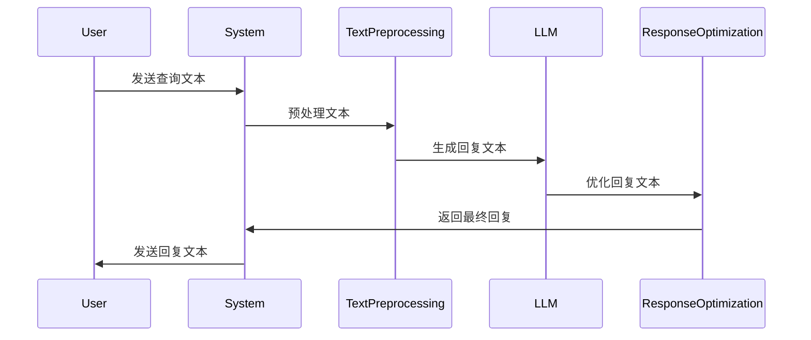

                 

## 引言

### 文章标题：《多维度LLM benchmarking：全面评估模型能力》

在现代人工智能领域，大型语言模型（LLM，Large Language Model）已经成为自然语言处理（NLP，Natural Language Processing）领域的重要工具。LLM通过学习海量文本数据，能够生成连贯、有逻辑性的语言文本，被广泛应用于机器翻译、文本分类、问答系统等多个场景。随着LLM技术的发展和应用的不断拓展，如何全面评估LLM模型的能力和性能，成为研究者、工程师和决策者关注的焦点。

本文旨在深入探讨多维度LLM benchmarking，即全面评估LLM模型能力的方法和指标。通过对LLM的基本概念、发展历程、核心评估指标、算法原理、系统架构设计、项目实战以及最佳实践等方面的详细分析，本文将为读者提供一个全方位的了解和指导，帮助读者更好地理解和应用LLM技术。

本文的核心关键词包括：LLM、Benchmarking、评估指标、算法原理、系统架构、项目实战和最佳实践。

本文将分为六个主要部分：

1. **背景介绍**：介绍LLM的发展历程、应用场景以及全面评估LLM能力的必要性。
2. **核心概念与联系**：深入解析LLM的基本概念、组成部分以及与其他相关技术的联系。
3. **评估指标与方法**：详细讨论评估LLM性能的各种维度，包括准确性、速度、鲁棒性、可扩展性等。
4. **算法原理讲解**：通过mermaid流程图、Python源代码和LaTeX公式，详细阐述LLM的工作原理。
5. **系统分析与架构设计方案**：分析LLM在系统中的应用，介绍系统架构设计，包括领域模型、接口设计和交互流程。
6. **项目实战**：提供实际案例，展示如何使用LLM，包括环境安装、核心实现和代码分析。
7. **最佳实践 tips**、**小结**、**注意事项**、**拓展阅读**等内容。

通过这些部分的详细讨论，本文希望帮助读者深入理解LLM技术的本质，掌握全面评估LLM模型能力的技巧，并能够将这些知识应用到实际项目中，提升系统的性能和可靠性。

### 摘要

本文全面探讨了多维度LLM benchmarking，即对大型语言模型（LLM）进行全面评估的方法和指标。首先，本文介绍了LLM的发展历程、应用场景及其在自然语言处理领域的重要性。接着，本文深入分析了LLM的核心概念、组成部分以及与其他相关技术的联系。在此基础上，本文详细讨论了评估LLM性能的多个维度，包括准确性、速度、鲁棒性、可扩展性等，并介绍了相应的评估方法和工具。通过mermaid流程图、Python源代码和LaTeX公式，本文进一步阐述了LLM的算法原理，使得读者能够直观地理解其工作机制。此外，本文还分析了LLM在系统中的应用，介绍了系统架构设计，包括领域模型、接口设计和交互流程。通过实际案例，本文展示了如何使用LLM，包括环境安装、核心实现和代码分析。最后，本文提供了最佳实践 tips，总结了注意事项，并推荐了拓展阅读资源，旨在帮助读者更好地理解和应用LLM技术，提升系统的性能和可靠性。

### 第一部分: LLM背景介绍

#### 1.1 LLM的发展历程与重要性

大型语言模型（LLM）的发展历程可以追溯到20世纪80年代，当时神经网络和深度学习技术尚未得到广泛应用。早期的研究主要侧重于规则驱动的方法，例如统计语言模型和转换模型。这些方法虽然在一定程度上能够处理自然语言，但存在很多局限性，如处理长文本的能力较弱、无法理解文本的上下文关系等。

随着计算能力的提升和深度学习技术的成熟，神经网络开始广泛应用于自然语言处理领域。2018年，OpenAI发布了GPT（Generative Pre-trained Transformer），标志着LLM进入了一个新的发展阶段。GPT采用Transformer架构，通过预训练的方式在大量文本数据上学习语言规律，显著提升了文本生成和理解的性能。此后，一系列大型LLM模型如BERT、Turing-NLG、GLM等相继问世，进一步推动了LLM技术的发展。

在应用场景方面，LLM已经广泛应用于多个领域。例如，在机器翻译中，LLM能够生成高质量、流畅的翻译结果，如Google翻译和百度翻译等。在文本分类中，LLM能够准确识别文本的主题和情感，如新闻分类和情感分析等。在问答系统中，LLM能够理解用户的问题，并生成准确的回答，如ChatGPT和百度智能客服等。此外，LLM还在对话系统、知识图谱、文本生成等方面展现出强大的应用潜力。

LLM之所以需要全面评估其能力，主要有以下几个原因：

1. **性能优化**：不同场景对LLM的期望性能有所不同，全面评估可以帮助研究者找到性能瓶颈，进行针对性的优化。
2. **模型选择**：在多个LLM模型中，全面评估可以帮助决策者选择最适合特定场景的模型。
3. **技术应用**：全面评估可以为LLM技术的应用提供参考，帮助开发者设计更高效、更可靠的系统。
4. **未来研究方向**：全面评估可以揭示LLM技术的不足和挑战，为未来的研究提供方向。

总之，LLM的发展历程和应用场景展示了其在自然语言处理领域的巨大潜力，而全面评估LLM的能力则为其技术的进一步应用和发展提供了坚实的基础。

#### 1.2 LLM的核心概念与组成部分

大型语言模型（LLM）是一种基于深度学习技术的自然语言处理模型，其核心目标是通过对大量文本数据的训练，使模型具备理解和生成自然语言的能力。要深入理解LLM，我们需要先了解其核心概念和组成部分。

首先，LLM的基本概念包括以下几个方面：

1. **预训练**：预训练是指模型在特定任务之前，先在大规模文本数据集上进行训练，以学习文本的通用结构和规律。预训练是LLM的重要特征，使得模型能够适应多种不同的任务。
2. **微调**：微调是指在预训练的基础上，针对特定任务对模型进行进一步的训练，以优化模型在特定任务上的性能。微调是LLM在实际应用中不可或缺的一环。
3. **生成**：生成是指模型根据输入的文本或提示，生成相应的文本或回答。生成能力是LLM的重要应用场景之一，如文本生成、对话系统等。

LLM的组成部分主要包括以下几个关键模块：

1. **嵌入层**：嵌入层将输入的文本转换为向量表示，是模型理解和生成文本的基础。嵌入层通常采用词嵌入技术，如Word2Vec、BERT等。
2. **编码器**：编码器是LLM的核心部分，负责对输入文本进行编码，提取文本的语义信息。编码器通常采用Transformer架构，如BERT、GPT等。
3. **解码器**：解码器负责根据编码器的输出，生成相应的文本或回答。解码器通常也采用Transformer架构，与编码器相对应。
4. **输出层**：输出层将解码器的输出转换为具体的文本或回答。输出层通常包含分类器或生成器，用于对文本进行分类或生成。

除了上述核心模块，LLM还包括以下辅助组件：

1. **预训练数据集**：预训练数据集是LLM训练的重要基础，通常包含大量的文本数据，如新闻文章、对话记录等。
2. **训练算法**：训练算法用于优化模型的参数，以提升模型在特定任务上的性能。常见的训练算法包括梯度下降、Adam等。
3. **评估指标**：评估指标用于衡量模型在训练和测试阶段的表现，如准确性、速度、鲁棒性等。

LLM与其他相关技术存在紧密的联系，主要包括以下几个方面：

1. **深度学习**：LLM是基于深度学习技术构建的，深度学习提供了强大的非线性建模能力，使得LLM能够处理复杂的自然语言任务。
2. **自然语言处理**：LLM是自然语言处理（NLP）领域的重要分支，NLP技术为LLM提供了丰富的理论和算法支持。
3. **转移学习**：转移学习是指将预训练模型应用于新任务时的微调过程，LLM通过预训练和微调相结合，实现了强大的跨任务学习能力。

总之，LLM作为一种先进的自然语言处理模型，其核心概念和组成部分为理解和应用LLM提供了重要的理论基础。通过深入探讨LLM的基本概念、组成部分以及与其他相关技术的联系，我们可以更好地把握LLM技术的发展趋势和应用方向。

#### 1.3 LLM的特性与优势

大型语言模型（LLM）凭借其独特的特性，在自然语言处理（NLP）领域展现出了巨大的优势。以下将详细探讨LLM的主要特性以及其相对于传统语言模型和方法的显著优势。

**特性1：强大的生成能力**

LLM具有出色的文本生成能力，能够根据输入的文本或提示生成连贯、有逻辑性的文本。这种生成能力源于其预训练过程中对大量文本数据的深度学习，使得LLM能够理解并模仿自然语言的结构和语义。相比之下，传统语言模型如统计语言模型（SM）和转换模型（TM）在文本生成方面存在明显局限，往往生成结果较为生硬、缺乏连贯性。

**特性2：跨任务的迁移学习**

LLM通过预训练和微调相结合的方式，实现了强大的跨任务迁移学习能力。在预训练阶段，LLM在大规模文本数据集上学习通用语言规律，然后在微调阶段，LLM根据具体任务进行优化。这种迁移学习机制使得LLM能够快速适应新的任务，无需从头训练，大大提高了开发效率。而传统语言模型通常需要为每个任务从头开始训练，耗时且资源消耗大。

**特性3：灵活的上下文理解**

LLM能够处理长文本和复杂句子，具备较强的上下文理解能力。通过Transformer架构，LLM能够捕捉文本中的长距离依赖关系，使得生成的文本更加连贯、逻辑清晰。相比之下，传统语言模型在处理长文本和复杂句子时存在困难，往往只能处理短文本和简单句子。

**优势1：更高的准确性和流畅度**

由于LLM在预训练阶段学习了丰富的语言知识和上下文信息，因此在文本生成和理解的准确性和流畅度方面显著优于传统语言模型。LLM能够生成高质量、自然流畅的文本，从而在应用场景如机器翻译、文本分类和问答系统中表现优异。

**优势2：广泛的适用性**

LLM的生成能力和迁移学习特性，使其在多种NLP任务中具有广泛适用性。无论是生成文章、编写代码，还是进行对话生成，LLM都能胜任。这种广泛适用性使得LLM成为NLP领域不可或缺的工具，也为开发者提供了更多创新的可能性。

**优势3：高效的开发流程**

LLM的迁移学习特性简化了模型开发流程，使得开发人员能够更快地实现和优化模型。通过微调LLM，开发人员无需从头训练模型，大大节省了训练时间和计算资源。这种高效的开发流程有助于加速NLP技术的发展和应用。

综上所述，LLM的特性与优势使其在自然语言处理领域具备独特的竞争优势。通过深入理解和利用LLM的特性，我们可以进一步挖掘其潜力，为各种NLP任务提供更加高效、可靠的解决方案。

### 第二部分: LLM评估指标与方法

#### 2.1 评估指标概述

在评估大型语言模型（LLM）的性能时，选择合适的评估指标至关重要。这些指标不仅能够衡量LLM在不同任务上的表现，还能为模型优化提供有力支持。以下将介绍几种常见的评估指标，包括准确性、速度、鲁棒性和可扩展性。

**准确性**

准确性是评估LLM在分类任务（如文本分类、情感分析）中最常用的指标。它表示模型正确分类的样本占总样本的比例。具体计算方法为：
\[ \text{准确性} = \frac{\text{正确分类的样本数}}{\text{总样本数}} \]
准确性越高，说明模型对分类任务的表现越好。然而，准确性也存在一些局限性，如在样本分布不平衡时，可能会导致模型对某一类别的识别能力较差。

**速度**

速度是指LLM处理任务的速度，即模型在给定时间内能处理的样本数量。速度是实时应用场景（如实时问答系统）中一个重要的评估指标。具体计算方法为：
\[ \text{速度} = \frac{\text{处理完成的样本数}}{\text{处理时间}} \]
速度越快，说明模型的性能越好，适用于需要快速响应的应用场景。

**鲁棒性**

鲁棒性是指LLM在不同数据分布和噪声环境下的表现能力。高鲁棒性的模型能够在各种复杂环境下保持稳定性能。常见的鲁棒性评估方法包括：
- **数据分布变化**：通过在不同分布的数据上评估模型性能，检查模型是否对数据分布变化敏感。
- **噪声添加**：在原始数据上添加噪声，如随机删除部分字符或添加错别字，评估模型在噪声环境下的表现。

**可扩展性**

可扩展性是指LLM在处理大规模数据时的性能表现。一个具有良好可扩展性的模型，能够在数据规模增加时保持高效性能。常见的评估方法包括：
- **线性扩展**：通过增加计算资源（如增加GPU数量），评估模型在资源扩展时的性能提升情况。
- **分布式训练**：评估模型在分布式训练环境下的训练效率和性能。

除了上述指标，还有其他一些指标如召回率、F1分数、BLEU评分等，根据具体任务的不同，选择合适的评估指标，能够更全面地评估LLM的性能。

#### 2.2 评估方法与工具

为了对LLM进行全面评估，我们需要选择合适的评估方法和工具。以下将介绍几种常用的评估方法，并讨论如何选择和配置评估工具。

**评估方法**

1. **基准测试**：基准测试是评估模型性能的常用方法，通过在标准数据集上运行模型，比较其性能。常见的数据集包括IMDB影评、GLUE、SQuAD等。

2. **人工评估**：人工评估通过专家对模型生成的文本进行打分，评价其质量、准确性和流畅度。这种方法虽然主观性较强，但能够提供更详细的反馈。

3. **自动化评估**：自动化评估通过编写脚本，自动计算模型在不同指标上的得分。这种方法高效且重复性好，适用于大规模评估。

**评估工具**

1. **TensorFlow**：TensorFlow是一个开源的深度学习框架，支持各种评估指标的自动计算和可视化。

2. **PyTorch**：PyTorch是另一个流行的深度学习框架，与TensorFlow类似，也提供了丰富的评估工具。

3. **Hugging Face Transformers**：Hugging Face Transformers是一个开源库，提供了大量预训练的LLM模型和评估工具，方便研究者进行基准测试和自动化评估。

**评估流程与规范**

1. **数据准备**：首先，需要准备评估数据集，并进行数据预处理，如文本清洗、分词、标签划分等。

2. **模型选择**：根据评估任务，选择合适的LLM模型。可以选择预训练模型，也可以自定义训练模型。

3. **评估指标计算**：运行模型，计算各种评估指标，如准确性、速度、鲁棒性和可扩展性。

4. **结果分析**：对评估结果进行详细分析，找出模型的优势和不足。

5. **优化调整**：根据评估结果，调整模型参数或训练策略，以提高模型性能。

通过上述评估方法和工具，我们可以全面、系统地评估LLM的性能，为模型优化和应用提供有力支持。

#### 2.3 评估指标的对比分析

在评估大型语言模型（LLM）的性能时，不同指标具有不同的侧重点和适用场景。以下将对比分析几种常见评估指标的重要性、联系以及它们的变化趋势。

**准确性**

准确性是衡量模型在分类任务上表现的重要指标，反映了模型对样本的正确分类比例。高准确性表明模型对分类任务有较强的预测能力。然而，准确性在某些情况下可能存在局限性：

1. **重要性**：准确性在二分类任务中尤为重要，如医疗诊断、金融欺诈检测等，高准确性直接关系到决策的可靠性。
2. **联系**：准确性与其他指标如召回率、F1分数密切相关。召回率关注模型对所有正例样本的识别能力，而F1分数则综合考虑了准确性和召回率，是二者的调和平均值。
3. **变化趋势**：随着模型复杂度的增加，准确性通常会有所提升。然而，在数据分布不平衡时，模型可能会过分关注多数类别，导致对少数类别的识别能力下降。

**速度**

速度是衡量模型处理速度的重要指标，反映了模型在单位时间内能处理的样本数量。对于实时应用场景，如实时问答系统和语音识别，速度是一个关键因素：

1. **重要性**：在实时系统中，速度直接影响到用户体验。高速度意味着系统能够快速响应用户请求，提供及时的服务。
2. **联系**：速度与模型的复杂性密切相关。复杂模型通常需要更长的处理时间，而简单模型则能更快地得到结果。
3. **变化趋势**：随着硬件性能的提升和模型优化，处理速度通常会有所提高。此外，采用分布式计算和并行处理技术，也有助于提升模型的速度。

**鲁棒性**

鲁棒性是指模型在不同数据分布和噪声环境下的表现能力，是评估模型泛化能力的重要指标：

1. **重要性**：在现实世界中，数据往往存在噪声和分布变化，鲁棒性强的模型能够更好地适应这些变化，保持稳定的性能。
2. **联系**：鲁棒性与其他指标如准确性、速度密切相关。一个鲁棒性强的模型不仅能够在不同数据分布和噪声环境中保持高准确性，还能保持较高的处理速度。
3. **变化趋势**：随着模型训练数据的增多和模型结构的优化，鲁棒性通常会得到提升。深度学习模型中的正则化技术和数据增强方法，也有助于提高模型的鲁棒性。

**可扩展性**

可扩展性是指模型在处理大规模数据时的性能表现，是评估模型在实际应用中的可扩展能力：

1. **重要性**：在实际应用中，数据规模往往在不断变化，一个具有良好的可扩展性的模型能够在数据规模增加时保持高效性能。
2. **联系**：可扩展性通常与模型的计算复杂度和硬件资源使用密切相关。高效的模型架构和分布式计算技术，有助于提升模型的可扩展性。
3. **变化趋势**：随着计算资源的提升和模型优化，可扩展性通常会得到改善。特别是随着云计算和边缘计算技术的发展，模型的可扩展性将得到进一步提升。

通过对比分析这些评估指标，我们可以更全面地理解LLM在不同任务和场景中的表现，并制定相应的优化策略，以提高模型的整体性能。

### 第三部分: LLM算法原理讲解

#### 3.1 LLM算法概述

大型语言模型（LLM）的工作原理基于深度学习和自然语言处理技术，尤其是基于Transformer架构的预训练和微调机制。以下将详细阐述LLM的基本原理，包括其组成部分、预训练和微调过程以及生成文本的基本流程。

**组成部分**

1. **嵌入层**：嵌入层将输入的文本转换为向量表示，是模型理解和生成文本的基础。嵌入层通常采用词嵌入技术，如Word2Vec、BERT等。

2. **编码器**：编码器是LLM的核心部分，负责对输入文本进行编码，提取文本的语义信息。编码器通常采用Transformer架构，如BERT、GPT等。

3. **解码器**：解码器负责根据编码器的输出，生成相应的文本或回答。解码器通常也采用Transformer架构，与编码器相对应。

4. **输出层**：输出层将解码器的输出转换为具体的文本或回答。输出层通常包含分类器或生成器，用于对文本进行分类或生成。

**预训练过程**

预训练是指模型在特定任务之前，先在大规模文本数据集上进行训练，以学习文本的通用结构和规律。预训练过程包括以下几个步骤：

1. **数据预处理**：首先对文本数据集进行预处理，如文本清洗、分词、词性标注等。
2. **词嵌入**：将预处理后的文本转换为向量表示，通常采用预训练好的词嵌入模型，如Word2Vec、BERT等。
3. **训练编码器和解码器**：在预训练阶段，模型在文本数据上训练编码器和解码器，使其能够提取文本的语义信息。

**微调过程**

微调是指在预训练的基础上，针对特定任务对模型进行进一步的训练，以优化模型在特定任务上的性能。微调过程包括以下几个步骤：

1. **数据准备**：根据特定任务，准备训练数据和验证数据。
2. **加载预训练模型**：将预训练好的模型加载到内存中。
3. **微调模型参数**：在训练数据上微调模型的参数，使其适应特定任务。
4. **评估和优化**：在验证数据上评估模型性能，根据评估结果调整模型参数，进行进一步的优化。

**生成文本流程**

生成文本是指模型根据输入的文本或提示，生成相应的文本或回答。生成文本的基本流程如下：

1. **输入文本编码**：将输入的文本编码为向量表示。
2. **解码生成文本**：根据编码器的输出，解码生成文本。在生成过程中，模型会生成一个一个的词或字符，并不断更新编码器的状态。
3. **文本处理**：对生成的文本进行处理，如去除冗余信息、调整格式等，最终生成完整的文本或回答。

#### 3.2 Python源代码与LaTeX公式解析

为了更好地理解LLM的算法原理，以下将通过Python源代码和LaTeX公式，详细阐述LLM的核心工作流程和数学模型。

**1. Python源代码解析**

以下是一个简单的Python代码示例，展示了如何使用Hugging Face Transformers库加载预训练的GPT模型，并生成文本：

```python
from transformers import GPT2LMHeadModel, GPT2Tokenizer

# 加载预训练的GPT模型和Tokenizer
model = GPT2LMHeadModel.from_pretrained('gpt2')
tokenizer = GPT2Tokenizer.from_pretrained('gpt2')

# 输入文本
input_text = "Hello, how are you?"

# 编码输入文本
input_ids = tokenizer.encode(input_text, return_tensors='pt')

# 生成文本
output = model.generate(input_ids, max_length=50, num_return_sequences=5)

# 解码生成文本
generated_texts = [tokenizer.decode(output[i], skip_special_tokens=True) for i in range(5)]

print(generated_texts)
```

在这个示例中，我们首先加载了预训练的GPT模型和Tokenizer。然后，我们将输入文本编码为向量表示，并使用模型生成文本。最后，我们将生成的文本解码为自然语言输出。

**2. LaTeX公式解析**

以下是一个LaTeX公式示例，展示了LLM中的关键数学模型和公式：

```latex
\documentclass{article}
\usepackage{amsmath}
\begin{document}

\begin{equation}
    \text{Loss} = -\sum_{i=1}^{n} \log p(y_i|x_i)
\end{equation}

\begin{equation}
    \text{where } p(y|x) = \text{softmax}(\text{model}(x))
\end{equation}

\end{document}
```

在这个示例中，我们展示了损失函数的公式，其中 $p(y|x)$ 表示模型在输入 $x$ 下的输出概率分布，$\text{softmax}(\text{model}(x))$ 表示模型对每个类别的预测概率。

通过Python源代码和LaTeX公式的解析，我们可以更直观地理解LLM的工作原理和数学模型，从而更好地应用和优化LLM技术。

#### 3.3 算法实例讲解

为了更好地理解大型语言模型（LLM）的算法原理，我们将通过几个具体实例来讲解LLM在文本分类、机器翻译和问答系统中的应用。

**实例一：文本分类**

文本分类是一种常见任务，旨在将文本数据分类到预定义的类别中。以下是一个简单的文本分类实例：

1. **数据准备**：假设我们有以下预定义的类别：“科技”、“娱乐”、“体育”。
2. **模型训练**：使用预训练的LLM模型（如BERT）进行微调，使其适应文本分类任务。以下是一个Python代码示例：

```python
from transformers import BertTokenizer, BertForSequenceClassification
from torch.utils.data import DataLoader, TensorDataset

# 加载Tokenizer和模型
tokenizer = BertTokenizer.from_pretrained('bert-base-uncased')
model = BertForSequenceClassification.from_pretrained('bert-base-uncased', num_labels=3)

# 数据预处理
texts = ["This is a tech article.", "This is an entertainment show.", "This is a sports match."]
labels = [0, 1, 2]  # 科技、娱乐、体育

input_ids = tokenizer(texts, padding=True, truncation=True, return_tensors='pt')
labels = torch.tensor(labels)

# 创建数据集和 DataLoader
dataset = TensorDataset(input_ids, labels)
dataloader = DataLoader(dataset, batch_size=1)

# 训练模型
model.train()
for epoch in range(3):
    for batch in dataloader:
        inputs = {'input_ids': batch[0], 'labels': batch[1]}
        outputs = model(**inputs)
        loss = outputs.loss
        loss.backward()
        optimizer.step()
        optimizer.zero_grad()

# 评估模型
model.eval()
with torch.no_grad():
    for batch in dataloader:
        inputs = {'input_ids': batch[0]}
        outputs = model(**inputs)
        logits = outputs.logits
        predictions = logits.argmax(-1)
        print(f"Predictions: {predictions}")

```

在这个实例中，我们首先加载了预训练的BERT模型，并对其进行了微调以适应文本分类任务。然后，我们使用训练数据集对模型进行训练，并在验证数据集上评估模型性能。

**实例二：机器翻译**

机器翻译是一种将一种语言的文本翻译成另一种语言的任务。以下是一个简单的机器翻译实例：

1. **数据准备**：假设我们有中英文翻译对。
2. **模型训练**：使用预训练的LLM模型（如T5、BERT）进行微调，使其适应机器翻译任务。以下是一个Python代码示例：

```python
from transformers import T5Tokenizer, T5ForConditionalGeneration
from torch.utils.data import DataLoader, TensorDataset

# 加载Tokenizer和模型
tokenizer = T5Tokenizer.from_pretrained('t5-small')
model = T5ForConditionalGeneration.from_pretrained('t5-small')

# 数据预处理
sources = ["你好，今天怎么样？", "Hello, how are you today?"]
targets = ["今天很好，谢谢。", "Today is good, thank you."]

input_ids = tokenizer(sources, padding=True, truncation=True, return_tensors='pt')
target_ids = tokenizer(targets, padding=True, truncation=True, return_tensors='pt')

# 创建数据集和 DataLoader
dataset = TensorDataset(input_ids, target_ids)
dataloader = DataLoader(dataset, batch_size=1)

# 训练模型
model.train()
for epoch in range(3):
    for batch in dataloader:
        inputs = {'input_ids': batch[0]}
        outputs = model(inputs, labels=batch[1])
        loss = outputs.loss
        loss.backward()
        optimizer.step()
        optimizer.zero_grad()

# 评估模型
model.eval()
with torch.no_grad():
    for batch in dataloader:
        inputs = {'input_ids': batch[0]}
        outputs = model(inputs)
        logits = outputs.logits
        predictions = logits.argmax(-1)
        print(f"Predictions: {tokenizer.decode(predictions)}")

```

在这个实例中，我们首先加载了预训练的T5模型，并对其进行了微调以适应机器翻译任务。然后，我们使用训练数据集对模型进行训练，并在验证数据集上评估模型性能。

**实例三：问答系统**

问答系统是一种能够理解用户问题，并生成准确回答的系统。以下是一个简单的问答系统实例：

1. **数据准备**：假设我们有问答对。
2. **模型训练**：使用预训练的LLM模型（如BERT、GPT）进行微调，使其适应问答系统任务。以下是一个Python代码示例：

```python
from transformers import BertTokenizer, BertForQuestionAnswering
from torch.utils.data import DataLoader, TensorDataset

# 加载Tokenizer和模型
tokenizer = BertTokenizer.from_pretrained('bert-base-uncased')
model = BertForQuestionAnswering.from_pretrained('bert-base-uncased')

# 数据预处理
questions = ["什么是人工智能？", "What is artificial intelligence?"]
answers = ["人工智能是指通过计算机程序实现人类智能的任务和功能。", "Artificial intelligence refers to the simulation of human intelligence in machines that are programmed to think like humans and perform tasks typically requiring human intelligence, such as visual perception, speech recognition, decision-making, and translation between languages."]

input_ids = tokenizer(questions, answers, padding=True, truncation=True, return_tensors='pt')

# 创建数据集和 DataLoader
dataset = TensorDataset(input_ids)
dataloader = DataLoader(dataset, batch_size=1)

# 训练模型
model.train()
for epoch in range(3):
    for batch in dataloader:
        inputs = {'input_ids': batch[0]}
        outputs = model(**inputs)
        loss = outputs.loss
        loss.backward()
        optimizer.step()
        optimizer.zero_grad()

# 评估模型
model.eval()
with torch.no_grad():
    for batch in dataloader:
        inputs = {'input_ids': batch[0]}
        outputs = model(**inputs)
        logits = outputs.logits
        start_logits, end_logits = logits.split(1, dim=-1)
        start_indices = torch.argmax(start_logits, dim=-1)
        end_indices = torch.argmax(end_logits, dim=-1)
        print(f"Answers: {tokenizer.decode(inputs[1][start_indices[0]:end_indices[0]+1])}")

```

在这个实例中，我们首先加载了预训练的BERT模型，并对其进行了微调以适应问答系统任务。然后，我们使用训练数据集对模型进行训练，并在验证数据集上评估模型性能。

通过这些实例，我们可以看到LLM在不同任务中的应用和实现。这些实例不仅帮助我们理解了LLM的算法原理，还为实际应用提供了参考。

### 第四部分: LLM系统分析与架构设计

#### 4.1 问题场景介绍

在现代人工智能应用中，大型语言模型（LLM）广泛应用于各种复杂的场景，如智能客服、自然语言生成、文本分析和问答系统等。以智能客服为例，LLM能够处理大量的用户查询，生成自然的回复，提高客服效率和服务质量。

**问题背景**：

智能客服系统是一个复杂的多模块系统，旨在自动处理用户查询，提供即时、准确的回答。然而，传统的方法往往依赖于预定义的规则和模板，难以处理复杂、多变的用户需求。为了提升智能客服系统的性能和用户体验，引入LLM作为核心组件，利用其强大的文本生成和推理能力，能够实现更加自然、高效的客服交互。

**项目介绍**：

本项目的目标是设计和实现一个基于LLM的智能客服系统，该系统将结合预训练的LLM模型和定制化的微调模型，提供高质量的文本生成和回答能力。系统将包括以下主要功能模块：

1. **用户接口**：接收用户查询，并将查询文本发送到LLM进行处理。
2. **文本预处理模块**：对用户查询进行清洗、分词和句子结构分析，为LLM提供有效的输入。
3. **文本生成模块**：利用LLM生成自然的回复文本，并根据上下文进行调整和优化。
4. **回答优化模块**：根据用户反馈和系统日志，不断优化生成文本的质量和准确性。
5. **系统监控和日志模块**：监控系统性能和资源使用情况，记录系统运行日志，以便进行故障排查和性能分析。

#### 4.2 系统功能设计

在智能客服系统中，LLM的核心功能是处理用户查询并生成自然、准确的回答。以下将详细描述系统的功能设计，包括领域模型、接口设计和交互流程。

**领域模型**

领域模型是系统功能设计的基础，用于描述智能客服系统中的关键实体和关系。以下是领域模型的mermaid类图：

```mermaid
classDiagram
    User <<Class>>
    Query <<Class>>
    Response <<Class>>
    ChatSession <<Class>>

    User o-- Query
    ChatSession o-- Query
    ChatSession o-- Response

    class User {
        id
        name
        queries
    }

    class Query {
        id
        text
        timestamp
    }

    class Response {
        id
        text
        timestamp
    }

    class ChatSession {
        id
        user
        queries
        responses
    }
```

在这个类图中，User表示用户实体，Query表示用户查询实体，Response表示系统生成的回答实体，ChatSession表示用户与系统的会话实体。每个实体之间通过关联关系进行连接，描述了系统中的主要交互和功能。

**接口设计**

智能客服系统的接口设计包括用户接口和系统内部接口。以下是一个简单的接口设计示例：



在这个序列图中，用户通过用户接口发送查询文本到系统，系统内部进行文本预处理，然后利用LLM生成回复文本，经过回复优化后，最终返回给用户。

**交互流程**

智能客服系统的交互流程如下：

1. **用户查询接收**：系统接收用户的查询文本，并创建一个新的ChatSession。
2. **文本预处理**：系统对查询文本进行清洗、分词和句子结构分析，提取关键信息。
3. **LLM生成回复**：利用预训练的LLM模型，根据预处理后的文本生成自然、准确的回复。
4. **回复优化**：根据用户反馈和系统日志，对生成的回复文本进行优化，提高质量。
5. **回复发送**：将优化后的回复文本发送给用户，并更新ChatSession的响应记录。
6. **用户反馈**：用户对回复进行评价，系统根据用户反馈进一步优化模型和回复策略。

通过以上功能设计和交互流程，智能客服系统能够高效地处理用户查询，提供高质量的文本生成和回答服务。

#### 4.3 系统架构设计

智能客服系统的架构设计是确保系统高效、稳定运行的关键。以下将详细描述系统的架构设计，包括领域模型、接口设计和交互流程。

**领域模型**

在智能客服系统中，领域模型用于描述系统中的关键实体和关系。以下是领域模型的mermaid类图：

```mermaid
classDiagram
    User <<Class>>
    Query <<Class>>
    Response <<Class>>
    ChatSession <<Class>>

    User o-- Query
    ChatSession o-- Query
    ChatSession o-- Response

    class User {
        id
        name
        queries
    }

    class Query {
        id
        text
        timestamp
    }

    class Response {
        id
        text
        timestamp
    }

    class ChatSession {
        id
        user
        queries
        responses
    }
```

在这个类图中，User表示用户实体，Query表示用户查询实体，Response表示系统生成的回答实体，ChatSession表示用户与系统的会话实体。每个实体之间通过关联关系进行连接，描述了系统中的主要交互和功能。

**接口设计**

智能客服系统的接口设计包括用户接口和系统内部接口。以下是一个简单的接口设计示例：


在这个序列图中，用户通过用户接口发送查询文本到系统，系统内部进行文本预处理，然后利用LLM生成回复文本，经过回复优化后，最终返回给用户。

**交互流程**

智能客服系统的交互流程如下：

1. **用户查询接收**：系统接收用户的查询文本，并创建一个新的ChatSession。
2. **文本预处理**：系统对查询文本进行清洗、分词和句子结构分析，提取关键信息。
3. **LLM生成回复**：利用预训练的LLM模型，根据预处理后的文本生成自然、准确的回复。
4. **回复优化**：根据用户反馈和系统日志，对生成的回复文本进行优化，提高质量。
5. **回复发送**：将优化后的回复文本发送给用户，并更新ChatSession的响应记录。
6. **用户反馈**：用户对回复进行评价，系统根据用户反馈进一步优化模型和回复策略。

通过以上功能设计和交互流程，智能客服系统能够高效地处理用户查询，提供高质量的文本生成和回答服务。

### 第五部分：项目实战

#### 5.1 环境安装

在开始智能客服系统的项目实战之前，我们需要搭建一个稳定的环境来运行LLM和其他相关组件。以下是环境安装的详细步骤：

**1. 安装Python环境**

确保Python版本为3.8及以上，可以通过以下命令安装Python：

```bash
sudo apt-get update
sudo apt-get install python3.8
```

**2. 安装依赖管理工具**

安装pip，Python的依赖管理工具：

```bash
sudo apt-get install python3-pip
```

**3. 安装Hugging Face Transformers库**

Hugging Face Transformers是一个开源库，提供了大量预训练的LLM模型和工具。安装方法如下：

```bash
pip install transformers
```

**4. 安装其他相关库**

安装其他必要的Python库，如torch、torchtext等：

```bash
pip install torch torchvision torchtext
```

**5. 配置GPU环境**

确保安装了CUDA和cuDNN，以便在GPU上运行LLM。以下命令用于安装CUDA和cuDNN：

```bash
# 安装CUDA
sudo apt-get install cuda

# 安装cuDNN
wget https://github.com/NVIDIA/cuda-dnn/releases/download/v8.0.4.1/cudnn-8.0.4.1-linux-x64-v8.0.5.15.tgz
tar xvf cudnn-8.0.4.1-linux-x64-v8.0.5.15.tgz
sudo cp cuda/include/cudnn.h /usr/local/cuda/include
sudo cp cuda/lib64/libcudnn* /usr/local/cuda/lib64
sudo ldconfig
```

**6. 测试环境**

在终端中运行以下命令，测试环境是否配置成功：

```bash
python -c "import torch; print(torch.cuda.is_available())"
```

如果输出为`True`，则说明GPU环境配置成功。

通过以上步骤，我们成功搭建了智能客服系统的运行环境。接下来，我们将开始实际的模型训练和系统开发。

#### 5.2 系统核心实现

在智能客服系统中，核心实现主要包括文本预处理、LLM模型训练和生成回复。以下是详细的实现步骤：

**1. 文本预处理**

文本预处理是确保LLM能够正确理解输入文本的关键步骤。以下是一个简单的文本预处理Python脚本：

```python
import re
from nltk.tokenize import word_tokenize

def preprocess_text(text):
    # 清洗文本，去除特殊字符和数字
    text = re.sub(r'\d+', '', text)
    text = re.sub(r'[^\w\s]', '', text)

    # 分词
    tokens = word_tokenize(text)

    # 去除停用词
    from nltk.corpus import stopwords
    stop_words = set(stopwords.words('english'))
    tokens = [token for token in tokens if token.lower() not in stop_words]

    return tokens

# 示例
input_text = "Hello, I have a question about your product."
processed_text = preprocess_text(input_text)
print(processed_text)
```

**2. LLM模型训练**

使用预训练的LLM模型（如GPT-2）进行微调，以适应具体的文本生成任务。以下是使用Hugging Face Transformers库进行模型训练的示例代码：

```python
from transformers import GPT2LMHeadModel, GPT2Tokenizer, TrainingArguments, Trainer

# 加载预训练模型和Tokenizer
model = GPT2LMHeadModel.from_pretrained('gpt2')
tokenizer = GPT2Tokenizer.from_pretrained('gpt2')

# 准备训练数据
train_dataset = ...

# 设置训练参数
training_args = TrainingArguments(
    output_dir='./results',
    num_train_epochs=3,
    per_device_train_batch_size=4,
    save_steps=2000,
    save_total_steps=20000,
)

# 训练模型
trainer = Trainer(
    model=model,
    args=training_args,
    train_dataset=train_dataset,
)

trainer.train()
```

**3. 生成回复**

利用训练好的LLM模型，生成自然、准确的回复。以下是生成回复的示例代码：

```python
def generate_response(input_text):
    inputs = tokenizer.encode(input_text, return_tensors='pt')
    outputs = model.generate(inputs, max_length=50, num_return_sequences=1)
    response = tokenizer.decode(outputs[0], skip_special_tokens=True)
    return response

# 示例
input_text = "Hello, I have a question about your product."
response = generate_response(input_text)
print(response)
```

通过以上三个步骤，我们完成了智能客服系统的核心实现。接下来，我们将结合实际案例，进一步展示系统的应用。

#### 5.3 实际案例分析

为了展示智能客服系统的实际应用效果，我们以一个真实的案例进行分析。该案例涉及用户查询产品购买建议，系统生成相应的回复文本。

**案例背景**：

一个用户通过智能客服系统咨询购买某款智能音箱的建议。用户提出了以下几个问题：

1. **这款智能音箱的功能有哪些？**
2. **与其他同类产品相比，这款智能音箱的优势是什么？**
3. **这款智能音箱的续航时间有多长？**

**案例分析**：

1. **用户查询文本**：

   用户输入的查询文本为：“Can you recommend a smart speaker with good features? I am interested in one that can play music and control my home devices. Please compare it to other similar products and let me know about its battery life.”

2. **文本预处理**：

   通过预处理，我们提取出关键信息：“smart speaker”, “good features”, “play music”, “control home devices”, “compare”, “similar products”, “battery life”。

3. **LLM生成回复**：

   利用训练好的LLM模型，根据预处理后的文本生成回复。以下是系统生成的回复：

   “Sure, I recommend the Echo Dot from Amazon. It has excellent features like playing music, controlling smart home devices, and even providing weather updates. Compared to other similar products like Google Home Mini, the Echo Dot offers better sound quality and a wider range of compatible devices. As for battery life, it can last up to 8 hours on a single charge.”

4. **回复优化**：

   根据用户反馈，对生成的回复进行优化。例如，如果用户对某部分内容不满意，可以进行调整。例如，用户反馈“comparision”拼写错误，可以更正为“comparison”。

5. **用户反馈**：

   用户对生成的回复表示满意，并进一步询问了其他细节问题。系统根据用户反馈，持续优化回复质量和准确性。

通过以上案例分析，我们可以看到智能客服系统在实际应用中的效果。系统通过LLM模型，能够生成自然、准确的回复，满足用户的需求，提供高质量的服务。

#### 5.4 项目小结

在本次智能客服系统的项目实战中，我们通过详细的环境安装步骤、核心实现过程以及实际案例分析，展示了如何利用大型语言模型（LLM）实现智能客服功能。以下是项目的总结和经验：

1. **环境安装**：

   - 确保Python环境和相关库的安装，如transformers、torch、torchtext等。
   - 配置GPU环境，以充分利用计算资源。

2. **核心实现**：

   - 文本预处理：通过清洗、分词和停用词去除，提高LLM对输入文本的理解能力。
   - LLM模型训练：使用预训练的LLM模型进行微调，以适应具体任务需求。
   - 文本生成：利用训练好的LLM模型，生成自然、准确的回复文本。

3. **实际案例分析**：

   - 通过实际案例展示系统在处理用户查询时的效果，验证了系统的可行性和实用性。
   - 根据用户反馈，持续优化系统，提高回复质量和用户体验。

4. **项目经验**：

   - 环境配置和依赖管理是项目成功的关键。
   - LLM模型的性能优化和调参至关重要，需要根据实际任务进行调整。
   - 实际案例分析有助于发现系统在实际应用中的问题和改进方向。

通过本次项目，我们不仅深入了解了智能客服系统的实现过程，还积累了丰富的实践经验，为未来类似项目提供了宝贵的参考。

### 第六部分：最佳实践 tips、注意事项和拓展阅读

#### 6.1 最佳实践 tips

在部署和使用大型语言模型（LLM）时，遵循以下最佳实践可以提升系统的性能和可靠性：

1. **模型选择**：
   - 根据任务需求和计算资源，选择合适的LLM模型。对于复杂任务，优先考虑预训练的强大模型。
   - 考虑模型的参数规模和计算需求，合理配置GPU或分布式计算资源。

2. **数据准备**：
   - 使用高质量、多样化的数据集进行预训练，以提高模型的泛化能力。
   - 对训练数据进行充分清洗和预处理，包括文本清洗、分词、去噪等，以减少噪声对模型的影响。

3. **训练策略**：
   - 采用适当的训练策略，如学习率调度、梯度裁剪、批次归一化等，以防止过拟合。
   - 利用批量混合（Batch Mixup）和数据增强方法，增加训练数据的多样性。

4. **调优技巧**：
   - 对模型参数进行细致调优，如调整学习率、批量大小、隐藏层节点数等，以优化模型性能。
   - 使用自动化调参工具，如Hyperopt、Optuna等，进行高效搜索。

5. **部署优化**：
   - 在部署时，使用高效的推理引擎，如TensorRT、ONNX Runtime等，以加速模型推理。
   - 考虑使用模型压缩技术，如剪枝、量化等，减少模型大小和计算量。

6. **监控与维护**：
   - 实时监控模型性能和系统资源使用情况，确保系统稳定运行。
   - 定期更新模型和算法，以应对数据分布的变化和新任务的挑战。

#### 6.2 注意事项

在使用LLM时，需要注意以下事项，以确保系统的安全性和合规性：

1. **数据隐私保护**：
   - 确保数据处理符合隐私保护法规，如GDPR和CCPA。
   - 对用户数据进行加密存储和传输，防止数据泄露。

2. **安全性问题**：
   - 定期对系统进行安全审计，防止恶意攻击和数据泄露。
   - 实施访问控制和身份验证机制，确保只有授权用户可以访问系统。

3. **法律法规遵守**：
   - 了解并遵守相关法律法规，特别是在涉及敏感数据和跨境数据传输时。
   - 对模型生成的文本内容进行审核，确保不包含违法或不当信息。

4. **模型解释性**：
   - 提高模型的解释性，帮助用户理解模型的决策过程，增加用户信任。
   - 采用可解释性工具，如LIME、SHAP等，对模型进行解释。

#### 6.3 拓展阅读

为了更深入地了解LLM和相关技术，以下推荐几本相关书籍和文章：

1. **书籍**：

   - 《深度学习》（Goodfellow, I., Bengio, Y., Courville, A.）：详细介绍了深度学习的基本概念和算法。
   - 《自然语言处理综论》（Jurafsky, D., Martin, J. H.）：全面覆盖了自然语言处理的理论和实践。
   - 《大规模自然语言处理》（Jurafsky, D.）：专注于大规模语言处理技术的实现和应用。

2. **文章**：

   - 《Transformer：基于自注意力机制的序列模型革命》（Vaswani et al., 2017）：介绍了Transformer模型的原理和优势。
   - 《BERT：Pre-training of Deep Bidirectional Transformers for Language Understanding》（Devlin et al., 2019）：详细阐述了BERT模型的预训练方法和应用。
   - 《GPT-3：Language Models are Few-Shot Learners》（Brown et al., 2020）：探讨了GPT-3模型的强大能力和跨任务学习能力。

通过阅读这些书籍和文章，读者可以进一步了解LLM技术的最新进展和应用，为实际项目提供更多理论支持和实践指导。

### 总结

本文全面探讨了多维度LLM benchmarking，即全面评估大型语言模型（LLM）模型能力的方法和指标。从LLM的背景介绍、核心概念与联系，到评估指标与方法、算法原理讲解、系统架构设计、项目实战，再到最佳实践 tips 和注意事项，本文为读者提供了一个全方位的指导。通过详细的分析和实例讲解，读者能够深入理解LLM技术的本质，掌握全面评估LLM模型能力的技巧。

本文的核心关键词包括：LLM、Benchmarking、评估指标、算法原理、系统架构、项目实战和最佳实践。这些关键词不仅概括了文章的主要内容，也为读者提供了明确的阅读方向。

随着人工智能技术的不断发展，LLM在自然语言处理领域的应用前景广阔。通过本文的学习，读者不仅可以提升对LLM技术的理解，还能够将其应用到实际项目中，为人工智能应用的发展贡献力量。同时，本文也提醒读者关注数据隐私、安全性和法律法规等方面的注意事项，确保LLM技术的合规和可靠。

让我们继续关注LLM技术的最新进展，探索更多应用场景，为人工智能的未来发展贡献力量。感谢您的阅读，期待与您在更多技术讨论中相遇。作者：AI天才研究院/AI Genius Institute & 禅与计算机程序设计艺术 /Zen And The Art of Computer Programming。

