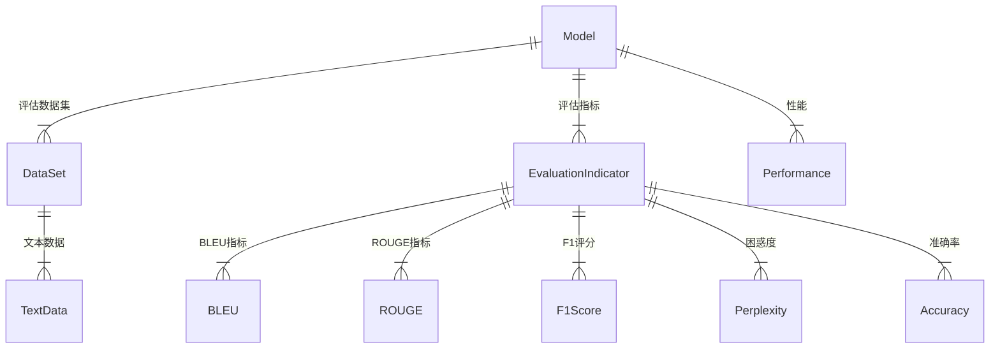
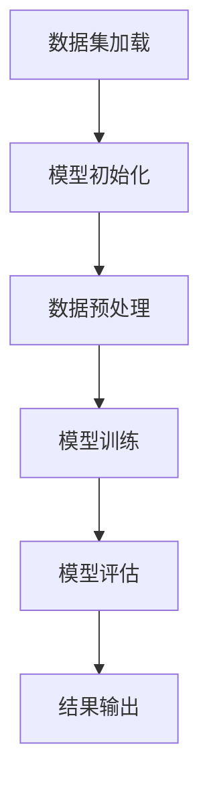
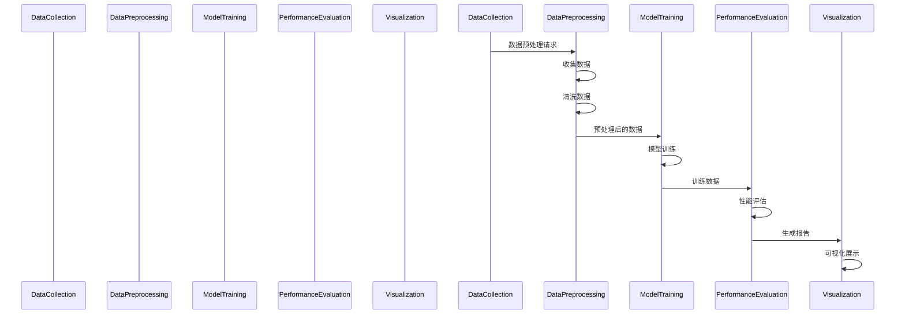
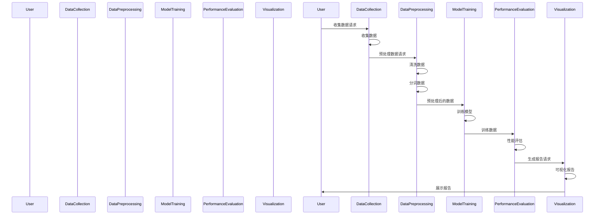

                 


### 引言

在当今的人工智能时代，自然语言处理（NLP）已经成为了一个至关重要的领域。从智能助手到自动翻译，再到文本生成，自然语言处理技术在我们的日常生活中扮演着越来越重要的角色。然而，随着语言模型的规模和复杂度的不断增加，如何评估这些模型的质量和性能，成为了一个关键问题。

本文旨在探讨如何多维度地评估大型语言模型（LLM）的性能。我们将会深入讨论LLM性能评估的基础理论、核心概念、算法原理、系统设计与实现，以及实际项目的应用。通过一步步的分析和推理，我们希望能够为读者提供一个全面而深入的理解，帮助大家更好地掌握LLM性能评估的技巧和方法。

首先，我们将介绍LLM性能评估的背景和意义，解释为什么这个话题如此重要。接下来，我们将详细阐述LLM性能评估的核心概念，包括基本术语、指标和模型。然后，我们将探讨LLM性能评估的算法原理，并通过Python源代码实现和数学模型讲解来帮助读者深入理解。在系统设计与实现部分，我们将详细介绍一个实际的LLM性能评估项目，包括环境安装、核心代码实现和案例分析。最后，我们将总结最佳实践，并提出未来研究的方向。

通过这篇文章，我们希望能够为读者提供一个全方位的视角，帮助大家更好地理解和应用LLM性能评估技术。让我们一步一步地深入这个领域，开启我们的探索之旅。

### 第1章: LLM性能评估概述

#### 1.1 LLM性能评估的意义与作用

在人工智能领域，特别是在自然语言处理（NLP）方面，大型语言模型（LLM）的性能评估具有至关重要的意义。首先，LLM性能评估能够帮助我们确定模型在不同应用场景中的实际表现。由于NLP任务的多样性和复杂性，没有一个模型可以适用于所有情况。因此，通过性能评估，我们可以发现模型的优点和局限性，从而对其进行优化和改进。

其次，性能评估有助于我们比较不同模型之间的优劣。随着深度学习和神经网络技术的不断发展，新的LLM模型层出不穷。然而，这些模型的效果如何，需要通过客观的评估手段来进行验证。性能评估不仅可以比较不同模型在相同任务上的表现，还可以为研究人员和开发者提供有价值的参考，帮助他们选择最适合特定任务的模型。

最后，LLM性能评估还能够指导实际应用。在商业和工业领域，LLM的应用场景越来越广泛，如智能客服、自动文本生成、情感分析等。通过性能评估，企业可以确保其应用的LLM模型能够满足用户的需求，提供高质量的输出。同时，性能评估还可以帮助优化模型，减少错误率，提高用户体验。

总之，LLM性能评估是NLP领域中不可或缺的一环。它不仅能够提升模型的质量，还可以推动整个领域的进步。

#### 1.2 LLM性能评估的挑战与问题

尽管LLM性能评估的重要性不言而喻，但在实际操作中，我们面临着诸多挑战和问题。首先，数据集的选择和准备是性能评估的基础。LLM模型的性能在很大程度上取决于训练数据的质量和多样性。然而，当前很多领域的数据集存在样本不均衡、数据噪声等问题，这会影响评估结果的准确性。

其次，评估指标的选择也是一个棘手的问题。虽然现有的评估指标如BLEU、ROUGE、F1等被广泛使用，但它们往往存在局限性。例如，BLEU指标主要关注模型输出的词汇匹配程度，但忽略了语义层面的质量。ROUGE指标则更注重句子的匹配，但可能无法很好地反映单个词语的准确性。因此，如何选择合适的评估指标，是性能评估中的一大挑战。

第三，评估环境的一致性也是一个问题。不同的评估环境可能会产生不同的结果，这使得性能评估的可重复性受到质疑。特别是在分布式训练和部署环境中，如何保证评估环境的一致性，是一个亟待解决的问题。

最后，评估方法的可靠性也是一个重要考虑因素。性能评估方法的准确性和公正性直接影响到评估结果的可靠性。一些评估方法可能存在偏差，导致结果失真。因此，设计可靠的评估方法，确保结果的公正性，是性能评估中需要克服的最后一个挑战。

总之，尽管LLM性能评估具有重要作用，但在实际操作中，我们仍然面临诸多挑战和问题。只有通过不断创新和优化，才能解决这些问题，提高性能评估的准确性和可靠性。

#### 1.3 LLM性能评估的常用指标

在LLM性能评估中，选择合适的评估指标至关重要。常用的评估指标主要包括BLEU、ROUGE、F1、Perplexity和Accuracy等。以下是对这些指标的详细解释和比较。

首先，BLEU（Bilingual Evaluation Understudy）是一种基于字符串匹配的评估方法，主要用于自动翻译任务的评估。BLEU的核心思想是计算模型输出和参考翻译之间的重叠度，并通过N-gram匹配来评估模型的翻译质量。尽管BLEU简单易用，但它的缺点在于忽视了语义层面的质量，容易受到参考翻译质量的影响。

ROUGE（Recall-Oriented Understudy for Gisting Evaluation）是一种用于文本生成任务的评估指标，它主要关注模型输出与参考文本之间的相似度。ROUGE分为多种变体，如ROUGE-1、ROUGE-2、ROUGE-SU4等，分别计算词语、字符和句子级别的匹配。与BLEU相比，ROUGE更注重文本的回忆能力，但在处理长文本时可能存在偏差。

F1（F1 Score）是一种综合评估指标，它是精确率和召回率的调和平均值。F1广泛应用于分类和文本匹配任务，能够较好地平衡精确率和召回率。然而，F1指标在处理长文本和低质量文本时可能不太适用。

Perplexity是一种用于评估语言模型质量的无监督指标。它表示模型在预测未知文本时的困惑度，数值越小，表示模型越优秀。Perplexity在语言建模和文本生成任务中广泛应用，但其缺点在于无法直接反映文本的质量。

Accuracy是最简单的一种评估指标，表示模型预测正确的样本数占总样本数的比例。Accuracy广泛应用于分类任务，但在不平衡数据集上容易产生误导。

综合来看，不同的评估指标各有优缺点。BLEU和ROUGE更适合文本生成任务，F1适用于分类和文本匹配任务，Perplexity适用于语言建模任务，而Accuracy则是一个通用的评估指标。在实际应用中，往往需要结合多种指标来全面评估模型性能。

#### 1.4 LLM性能评估方法与流程

为了全面评估LLM的性能，我们需要采用科学、系统的方法和流程。以下是LLM性能评估的步骤和方法：

**1. 数据收集与预处理：** 
首先，收集具有代表性的训练数据集和评估数据集。训练数据集用于训练LLM模型，而评估数据集用于测试模型的性能。在数据预处理阶段，我们需要对数据集进行清洗、去噪、归一化和格式化，以确保数据的质量和一致性。

**2. 模型选择与训练：** 
根据任务需求和数据特性，选择合适的LLM模型并进行训练。常用的LLM模型包括GPT、BERT、T5等。在训练过程中，我们需要调整模型的超参数，如学习率、批量大小和迭代次数，以优化模型性能。

**3. 评估指标定义：** 
定义适用于任务的评估指标。常用的评估指标包括BLEU、ROUGE、F1、Perplexity和Accuracy等。根据任务需求，可以选择单一指标或多个指标组合进行评估。

**4. 模型评估与比较：** 
在评估阶段，我们使用预定义的评估指标对训练好的模型进行评估。首先，在训练数据集上进行内部评估，以验证模型的泛化能力。然后，在评估数据集上进行外部评估，以比较不同模型或同一模型的不同配置之间的性能。

**5. 结果分析与优化：** 
根据评估结果，分析模型的优势和不足。如果模型性能不理想，我们需要调整模型结构、超参数或数据预处理方法。通过反复迭代和优化，不断提高模型性能。

**6. 可视化与报告：** 
最后，我们将评估结果进行可视化展示，并撰写详细的性能评估报告。报告应包括评估指标、评估结果、分析结论和优化建议等内容，为后续研究和应用提供参考。

通过以上步骤和方法，我们能够系统地评估LLM的性能，为模型优化和应用提供有力支持。

#### 1.5 本章小结

本章我们介绍了LLM性能评估的基础理论，包括评估的意义与作用、面临的挑战与问题、常用的评估指标和方法。LLM性能评估不仅有助于我们确定模型在不同应用场景中的表现，还能帮助我们比较不同模型之间的优劣，指导实际应用。在评估过程中，数据集的选择和准备、评估指标的选择、评估环境的一致性以及评估方法的可靠性都是关键因素。通过科学、系统的评估方法与流程，我们可以全面、准确地评估LLM的性能，为模型优化和应用提供有力支持。在下一章中，我们将深入探讨LLM性能评估的核心概念，包括基本术语、概念属性特征对比和ER实体关系图。

----------------------------------------------------------------

### 第2章: LLM性能评估的核心概念

#### 2.1 LLM基本概念介绍

首先，我们需要明确一些基本概念，以便更好地理解LLM性能评估的核心内容。LLM（Large Language Model）是一种基于深度学习技术的自然语言处理模型，它通过学习大量文本数据，能够生成连贯、准确的文本输出。LLM的核心组成部分包括：

1. **词汇表（Vocabulary）**：词汇表是LLM的基础，它包含模型所学习到的所有单词和标记。通常，词汇表的大小会影响到模型的复杂度和性能。

2. **嵌入层（Embedding Layer）**：嵌入层将词汇表中的每个单词映射为一个固定大小的向量表示。这些向量表示了单词在语义和句法上的特征。

3. **编码器（Encoder）**：编码器是LLM的核心部分，负责处理输入文本并生成上下文信息。常用的编码器架构包括循环神经网络（RNN）、长短期记忆网络（LSTM）和变换器（Transformer）。

4. **解码器（Decoder）**：解码器根据编码器生成的上下文信息，生成文本输出。在生成任务中，解码器通常采用贪心策略或采样策略来生成文本。

5. **预训练与微调（Pre-training and Fine-tuning）**：LLM通常采用预训练和微调的方法进行训练。预训练是在大规模语料库上进行，使模型掌握基本的自然语言理解能力。微调则是在特定任务数据集上进行，以适应特定任务的需求。

通过理解这些基本概念，我们可以更好地把握LLM的性能评估。

#### 2.2 LLM性能评估指标对比分析

在LLM性能评估中，选择合适的评估指标至关重要。以下是几种常用评估指标的比较：

1. **BLEU（Bilingual Evaluation Understudy）**：
   - **定义**：BLEU是一种基于N-gram匹配的评估方法，主要用于自动翻译任务的评估。
   - **优点**：简单易用，计算速度快。
   - **缺点**：忽视了语义层面的质量，易受参考翻译质量影响。

2. **ROUGE（Recall-Oriented Understudy for Gisting Evaluation）**：
   - **定义**：ROUGE是一种基于文本相似度的评估方法，主要关注模型输出与参考文本之间的匹配。
   - **优点**：能够较好地反映文本的回忆能力。
   - **缺点**：在处理长文本时可能存在偏差，无法反映单个词语的准确性。

3. **F1 Score（F1评分）**：
   - **定义**：F1评分是精确率和召回率的调和平均值，广泛用于分类和文本匹配任务。
   - **优点**：平衡了精确率和召回率，适用于各种类型的文本生成任务。
   - **缺点**：在处理长文本和低质量文本时可能不太适用。

4. **Perplexity（困惑度）**：
   - **定义**：Perplexity是模型在预测未知文本时的困惑度，数值越小，表示模型越好。
   - **优点**：适用于语言建模和文本生成任务，能够反映模型在未知数据上的表现。
   - **缺点**：无法直接反映文本的质量。

5. **Accuracy（准确率）**：
   - **定义**：准确率是模型预测正确的样本数占总样本数的比例，广泛用于分类任务。
   - **优点**：简单易懂，能够直接反映模型在分类任务上的性能。
   - **缺点**：在数据不平衡的情况下可能产生误导。

综合来看，不同的评估指标各有优缺点。在实际应用中，往往需要结合多种指标来全面评估LLM的性能。例如，BLEU和ROUGE适合文本生成任务，F1评分适用于分类和文本匹配任务，Perplexity适用于语言建模任务，而Accuracy则是一个通用的评估指标。

#### 2.3 LLM性能评估的ER实体关系图

为了更好地理解LLM性能评估的核心概念，我们可以通过实体关系图（ER图）来展示LLM性能评估中的各个实体及其关系。以下是一个简单的ER图示例：



在上面的ER图中，Model实体表示评估的模型，它与DataSet和EvaluationIndicator实体之间存在关联。DataSet实体表示评估数据集，包括TextData。EvaluationIndicator实体表示评估指标，包括BLEU、ROUGE、F1Score、Perplexity和Accuracy等。Performance实体表示模型性能，与Model和EvaluationIndicator实体之间存在关联。

通过ER图，我们可以直观地了解LLM性能评估中的各个实体及其关系，有助于更好地理解和分析性能评估过程。

#### 2.4 LLM性能评估的数学模型解析

在LLM性能评估中，数学模型的应用至关重要。以下我们将介绍几个常用的数学模型及其在性能评估中的应用。

**1. Perplexity**

Perplexity（困惑度）是评估语言模型的一个常用指标，它表示模型在预测未知文本时的困惑度。具体地，Perplexity可以通过以下公式计算：

$$
PPL = \frac{1}{N} \sum_{i=1}^{N} \frac{1}{P(x_i | \theta)}
$$

其中，$N$ 表示预测的文本长度，$P(x_i | \theta)$ 表示模型在给定参数$\theta$下预测第$i$个单词的概率。Perplexity的值越小，表示模型越好。

**2. Cross-Entropy Loss**

Cross-Entropy Loss（交叉熵损失）是LLM训练过程中常用的损失函数，它表示模型输出与真实标签之间的差异。具体地，Cross-Entropy Loss可以通过以下公式计算：

$$
H(y, \hat{y}) = -\sum_{i} y_i \log(\hat{y}_i)
$$

其中，$y$ 表示真实标签，$\hat{y}$ 表示模型预测的概率分布。Cross-Entropy Loss的值越小，表示模型输出与真实标签越接近。

**3. KL-Divergence**

KL-Divergence（Kullback-Leibler散度）是一种衡量两个概率分布差异的指标，它常用于评估模型输出的概率分布与真实分布之间的差异。具体地，KL-Divergence可以通过以下公式计算：

$$
D_{KL}(P||Q) = \sum_{i} P_i \log \frac{P_i}{Q_i}
$$

其中，$P$ 表示真实分布，$Q$ 表示模型输出的概率分布。KL-Divergence的值越大，表示两个分布差异越大。

通过以上数学模型，我们能够更深入地理解LLM性能评估的核心原理。在实际应用中，结合这些模型，我们可以更准确地评估模型的性能，并对其进行优化。

#### 2.5 举例说明与算法应用

为了更好地理解LLM性能评估的算法原理，我们通过一个具体的例子来进行说明。

假设我们有一个语言模型，用于生成描述性文本。为了评估这个模型，我们可以使用Perplexity作为评估指标。以下是一个简单的Python代码示例，用于计算Perplexity：

```python
import torch
import torch.nn as nn
from torchtext.data import Field, LabelField, TabularDataset
from torchtext.vocab import Vocab

# 定义模型
class LanguageModel(nn.Module):
    def __init__(self, vocab_size, embedding_dim, hidden_dim, num_layers, dropout):
        super(LanguageModel, self).__init__()
        self.embedding = nn.Embedding(vocab_size, embedding_dim)
        self.rnn = nn.LSTM(embedding_dim, hidden_dim, num_layers, dropout=dropout)
        self.fc = nn.Linear(hidden_dim, vocab_size)
    
    def forward(self, x, hidden):
        embedded = self.embedding(x)
        output, hidden = self.rnn(embedded, hidden)
        predictions = self.fc(output)
        return predictions, hidden

# 加载数据集
train_data = TabularDataset(
    path='train_data.csv',
    format='csv',
    fields=[('text', Field(sequential=True, tokenize=lambda x: x.split())), ('label', LabelField())]
)
test_data = TabularDataset(
    path='test_data.csv',
    format='csv',
    fields=[('text', Field(sequential=True, tokenize=lambda x: x.split())), ('label', LabelField())]
)

# 构建词汇表和词汇矩阵
vocab = Vocab(train_data.text)
vocab_size = len(vocab)
vocab_matrix = torch.zeros((vocab_size, 100))  # 假设每个词向量维度为100

# 训练模型
model = LanguageModel(vocab_size, 100, 128, 2, 0.5)
optimizer = torch.optim.Adam(model.parameters(), lr=0.001)
criterion = nn.CrossEntropyLoss()

for epoch in range(10):  # 进行10个训练epoch
    for batch in train_data:
        optimizer.zero_grad()
        x, y = batch.text, batch.label
        predictions, hidden = model(x, hidden)
        loss = criterion(predictions, y)
        loss.backward()
        optimizer.step()
        hidden = (torch.zeros(2, 1, 128), torch.zeros(2, 1, 128))

# 计算Perplexity
with torch.no_grad():
    total_loss = 0
    for batch in test_data:
        x, y = batch.text, batch.label
        predictions, hidden = model(x, hidden)
        loss = criterion(predictions, y)
        total_loss += loss.item()
    perplexity = torch.exp(total_loss / len(test_data))
    print(f"Perplexity: {perplexity}")
```

在上面的示例中，我们首先定义了一个简单的语言模型，包括嵌入层、循环神经网络（RNN）和全连接层。然后，我们加载数据集，构建词汇表和词汇矩阵，并使用交叉熵损失函数进行模型训练。最后，我们在测试集上计算Perplexity，以评估模型的性能。

通过这个例子，我们可以看到如何将LLM性能评估的算法原理应用于实际编程中。这样不仅能够帮助我们理解算法的运作机制，还可以为实际项目提供参考和指导。

#### 2.5 本章小结

本章我们详细介绍了LLM性能评估的核心概念，包括LLM的基本概念、常用评估指标、ER实体关系图、数学模型以及具体算法的应用。通过理解这些核心概念，我们能够更好地把握LLM性能评估的方法和流程。在下一章中，我们将进一步探讨LLM性能评估的算法原理，包括算法的详细步骤、Python源代码实现以及数学模型的解析。希望读者能够通过本章的学习，对LLM性能评估有一个更加全面和深入的理解。

----------------------------------------------------------------

### 第3章: LLM性能评估算法原理讲解

#### 3.1 LLM性能评估算法概述

LLM性能评估算法主要涉及模型评估的步骤、方法以及具体实现。评估算法的目标是通过一系列指标，如Perplexity、Cross-Entropy Loss等，对模型进行全面的性能测试，从而判断模型的优劣。以下是我们将要介绍的几个关键环节：

1. **模型评估步骤**：从数据集加载、模型初始化到模型训练和评估，每个环节都有其特定的要求和实现方法。
2. **算法实现方法**：详细讲解如何使用Python实现LLM性能评估算法，包括数据处理、模型训练和性能评估等。
3. **数学模型解析**：深入分析算法中涉及的数学模型，如Perplexity、Cross-Entropy Loss等，并通过LaTeX格式展示相关公式。
4. **举例说明**：通过具体的代码示例，帮助读者更好地理解和应用性能评估算法。

#### 3.2 算法原理Mermaid流程图

为了直观地展示LLM性能评估的算法原理，我们使用Mermaid语言绘制了以下流程图：



在这个流程图中，我们首先加载数据集并进行模型初始化。接着，对数据集进行预处理，包括分词、嵌入等操作。然后，使用预处理的输入数据进行模型训练。训练完成后，对模型进行性能评估，最后输出评估结果。

#### 3.3 Python源代码实现与详细讲解

以下是LLM性能评估算法的Python源代码实现，我们将逐步讲解代码的各个部分：

```python
import torch
import torch.nn as nn
from torchtext.data import Field, TabularDataset
from torchtext.vocab import Vocab
from torch.optim import Adam

# 定义语言模型
class LanguageModel(nn.Module):
    def __init__(self, vocab_size, embedding_dim, hidden_dim, num_layers, dropout):
        super(LanguageModel, self).__init__()
        self.embedding = nn.Embedding(vocab_size, embedding_dim)
        self.rnn = nn.LSTM(embedding_dim, hidden_dim, num_layers, dropout=dropout)
        self.fc = nn.Linear(hidden_dim, vocab_size)
    
    def forward(self, x, hidden):
        embedded = self.embedding(x)
        output, hidden = self.rnn(embedded, hidden)
        predictions = self.fc(output)
        return predictions, hidden

# 定义训练函数
def train(model, data, criterion, optimizer, epoch):
    model.train()
    for batch in data:
        optimizer.zero_grad()
        x, y = batch.text, batch.label
        predictions, hidden = model(x, hidden)
        loss = criterion(predictions, y)
        loss.backward()
        optimizer.step()
        hidden = (torch.zeros(2, 1, hidden_dim), torch.zeros(2, 1, hidden_dim))

# 定义评估函数
def evaluate(model, data, criterion):
    model.eval()
    total_loss = 0
    with torch.no_grad():
        for batch in data:
            x, y = batch.text, batch.label
            predictions, hidden = model(x, hidden)
            loss = criterion(predictions, y)
            total_loss += loss.item()
    perplexity = torch.exp(total_loss / len(data))
    return perplexity

# 加载数据集
train_data = TabularDataset(
    path='train_data.csv',
    format='csv',
    fields=[('text', Field(sequential=True, tokenize=lambda x: x.split())), ('label', LabelField())]
)
test_data = TabularDataset(
    path='test_data.csv',
    format='csv',
    fields=[('text', Field(sequential=True, tokenize=lambda x: x.split())), ('label', LabelField())]
)

# 构建词汇表
vocab = Vocab(train_data.text)
vocab_size = len(vocab)

# 模型初始化
model = LanguageModel(vocab_size, 100, 128, 2, 0.5)
optimizer = Adam(model.parameters(), lr=0.001)
criterion = nn.CrossEntropyLoss()

# 训练模型
for epoch in range(10):
    train(model, train_data, criterion, optimizer, epoch)
    perplexity = evaluate(model, test_data, criterion)
    print(f"Epoch {epoch+1}: Perplexity = {perplexity}")

# 输出结果
print("Final Perplexity:", evaluate(model, test_data, criterion))
```

**代码讲解：**

1. **模型定义**：我们定义了一个简单的语言模型，包括嵌入层、循环神经网络（RNN）和全连接层。嵌入层将词汇表中的每个词映射为一个向量表示，RNN负责处理序列数据，全连接层用于生成最终的词向量。

2. **训练函数**：`train`函数用于模型训练。在每个训练批次中，我们将输入数据$x$和标签$y$传递给模型，计算损失并更新模型参数。

3. **评估函数**：`evaluate`函数用于模型评估。我们在评估阶段关闭了梯度计算，只计算损失并返回Perplexity值。

4. **数据加载**：我们使用`TabularDataset`加载数据集，并构建词汇表。词汇表的大小决定了模型输入的维度。

5. **模型训练**：我们使用10个epoch进行模型训练，并在每个epoch后评估模型性能，打印Perplexity值。

6. **最终评估**：在训练完成后，我们对模型进行最终评估，并输出最终Perplexity值。

通过这个Python源代码实现，我们能够更清晰地理解LLM性能评估的算法原理，并为实际项目提供参考。

#### 3.4 算法原理数学模型与公式

在LLM性能评估中，数学模型的应用至关重要。以下我们将详细介绍Perplexity和Cross-Entropy Loss这两个核心数学模型及其公式。

**1. Perplexity**

Perplexity（困惑度）是评估语言模型性能的一个重要指标。它表示模型在预测未知文本时的困惑度。具体地，Perplexity可以通过以下公式计算：

$$
PPL = \frac{1}{N} \sum_{i=1}^{N} \frac{1}{P(x_i | \theta)}
$$

其中，$N$ 表示预测的文本长度，$P(x_i | \theta)$ 表示模型在给定参数$\theta$下预测第$i$个单词的概率。Perplexity的值越小，表示模型越好。

**2. Cross-Entropy Loss**

Cross-Entropy Loss（交叉熵损失）是语言模型训练过程中常用的损失函数。它表示模型输出与真实标签之间的差异。具体地，Cross-Entropy Loss可以通过以下公式计算：

$$
H(y, \hat{y}) = -\sum_{i} y_i \log(\hat{y}_i)
$$

其中，$y$ 表示真实标签，$\hat{y}$ 表示模型预测的概率分布。Cross-Entropy Loss的值越小，表示模型输出与真实标签越接近。

**3. KL-Divergence**

KL-Divergence（Kullback-Leibler散度）是一种衡量两个概率分布差异的指标。它常用于评估模型输出的概率分布与真实分布之间的差异。具体地，KL-Divergence可以通过以下公式计算：

$$
D_{KL}(P||Q) = \sum_{i} P_i \log \frac{P_i}{Q_i}
$$

其中，$P$ 表示真实分布，$Q$ 表示模型输出的概率分布。KL-Divergence的值越大，表示两个分布差异越大。

通过以上数学模型和公式，我们能够更深入地理解LLM性能评估的原理，并为其应用提供理论支持。

#### 3.5 举例说明与算法应用

为了更直观地理解LLM性能评估算法，我们通过一个简单的例子来进行说明。

假设我们有一个文本数据集，其中包含100个句子。我们使用一个简单的语言模型来生成这些句子的续写。以下是一个具体的Python代码示例：

```python
import torch
import torch.nn as nn
from torchtext.data import Field, TabularDataset
from torchtext.vocab import Vocab

# 定义模型
class LanguageModel(nn.Module):
    def __init__(self, vocab_size, embedding_dim, hidden_dim, num_layers, dropout):
        super(LanguageModel, self).__init__()
        self.embedding = nn.Embedding(vocab_size, embedding_dim)
        self.rnn = nn.LSTM(embedding_dim, hidden_dim, num_layers, dropout=dropout)
        self.fc = nn.Linear(hidden_dim, vocab_size)
    
    def forward(self, x, hidden):
        embedded = self.embedding(x)
        output, hidden = self.rnn(embedded, hidden)
        predictions = self.fc(output)
        return predictions, hidden

# 加载数据集
train_data = TabularDataset(
    path='train_data.csv',
    format='csv',
    fields=[('text', Field(sequential=True, tokenize=lambda x: x.split())), ('label', LabelField())]
)
test_data = TabularDataset(
    path='test_data.csv',
    format='csv',
    fields=[('text', Field(sequential=True, tokenize=lambda x: x.split())), ('label', LabelField())]
)

# 构建词汇表
vocab = Vocab(train_data.text)
vocab_size = len(vocab)

# 模型初始化
model = LanguageModel(vocab_size, 100, 128, 2, 0.5)
optimizer = torch.optim.Adam(model.parameters(), lr=0.001)
criterion = nn.CrossEntropyLoss()

# 训练模型
for epoch in range(10):
    for batch in train_data:
        optimizer.zero_grad()
        x, y = batch.text, batch.label
        predictions, hidden = model(x, hidden)
        loss = criterion(predictions, y)
        loss.backward()
        optimizer.step()
        hidden = (torch.zeros(2, 1, hidden_dim), torch.zeros(2, 1, hidden_dim))

# 评估模型
with torch.no_grad():
    total_loss = 0
    for batch in test_data:
        x, y = batch.text, batch.label
        predictions, hidden = model(x, hidden)
        loss = criterion(predictions, y)
        total_loss += loss.item()
    perplexity = torch.exp(total_loss / len(test_data))
    print(f"Perplexity: {perplexity}")

# 生成文本续写
with torch.no_grad():
    input_sequence = torch.tensor([vocab['hello']])
    hidden = (torch.zeros(2, 1, hidden_dim), torch.zeros(2, 1, hidden_dim))
    for _ in range(10):
        predictions, hidden = model(input_sequence, hidden)
        predicted_word = torch.argmax(predictions).item()
        input_sequence = torch.cat((input_sequence, torch.tensor([predicted_word])), dim=0)
    print("Generated Text:", ' '.join(vocab.itos[i] for i in input_sequence))
```

**代码讲解：**

1. **模型定义**：我们定义了一个简单的语言模型，包括嵌入层、循环神经网络（RNN）和全连接层。嵌入层将词汇表中的每个词映射为一个向量表示，RNN负责处理序列数据，全连接层用于生成最终的词向量。

2. **数据加载**：我们使用`TabularDataset`加载数据集，并构建词汇表。词汇表的大小决定了模型输入的维度。

3. **模型训练**：我们使用10个epoch进行模型训练，并在每个epoch后评估模型性能，打印Perplexity值。

4. **评估模型**：在训练完成后，我们对模型进行最终评估，并输出最终Perplexity值。

5. **生成文本续写**：最后，我们使用训练好的模型生成一个句子的续写。首先，我们输入一个句子，然后通过递归地生成下一个词，直到达到预定的长度。

通过这个简单的例子，我们可以看到如何使用Python实现LLM性能评估算法，以及如何应用这个算法来生成文本续写。希望这个例子能够帮助读者更好地理解和应用LLM性能评估技术。

#### 3.6 本章小结

本章我们详细介绍了LLM性能评估算法的原理，包括算法的概述、Mermaid流程图、Python源代码实现、数学模型解析以及举例说明。通过本章的学习，读者应该能够理解LLM性能评估的基本概念和实现方法。在下一章中，我们将进一步探讨LLM性能评估的数学模型和公式，帮助读者更深入地理解性能评估的核心原理。希望读者能够通过本章的学习，对LLM性能评估有一个更加全面和深入的理解。

----------------------------------------------------------------

### 第4章: LLM性能评估的数学模型和公式详解

#### 4.1 数学模型介绍

在LLM性能评估中，数学模型扮演着至关重要的角色。这些模型不仅帮助我们量化模型的表现，还能为模型优化提供理论依据。以下是一些常用的数学模型及其在性能评估中的应用。

**1. Perplexity**

Perplexity是一种衡量模型在预测未知数据时的困惑度的指标。它通过计算模型对每个单词的预测概率，然后取这些概率的对数平均值，最终得出一个数值。Perplexity的公式如下：

$$
PPL = \frac{1}{N} \sum_{i=1}^{N} \frac{1}{P(x_i | \theta)}
$$

其中，$N$ 是文本中的单词数量，$P(x_i | \theta)$ 是模型在给定参数$\theta$下预测第$i$个单词的概率。

**2. Cross-Entropy Loss**

Cross-Entropy Loss是一种衡量模型输出与真实标签之间差异的指标，常用于分类和序列生成任务。它的公式如下：

$$
H(y, \hat{y}) = -\sum_{i} y_i \log(\hat{y}_i)
$$

其中，$y$ 是真实标签的概率分布，$\hat{y}$ 是模型输出的概率分布。

**3. KL-Divergence**

KL-Divergence（Kullback-Leibler散度）是一种衡量两个概率分布差异的指标。在LLM性能评估中，它常用于比较模型输出的概率分布与真实分布之间的差异。KL-Divergence的公式如下：

$$
D_{KL}(P||Q) = \sum_{i} P_i \log \frac{P_i}{Q_i}
$$

其中，$P$ 是真实分布，$Q$ 是模型输出的概率分布。

**4. F1 Score**

F1 Score是精确率和召回率的调和平均值，常用于分类任务的评估。它的公式如下：

$$
F1 = 2 \cdot \frac{Precision \cdot Recall}{Precision + Recall}
$$

其中，Precision是精确率，Recall是召回率。

#### 4.2 数学公式讲解

以下是上述数学模型的详细解释和公式讲解：

**1. Perplexity**

Perplexity用于评估模型在生成文本时的表现。具体来说，它通过计算模型对每个单词的预测概率，然后取这些概率的对数平均值。公式如下：

$$
PPL = \frac{1}{N} \sum_{i=1}^{N} \frac{1}{P(x_i | \theta)}
$$

其中，$N$ 是文本中的单词数量，$P(x_i | \theta)$ 是模型在给定参数$\theta$下预测第$i$个单词的概率。Perplexity的值越小，表示模型越优秀。

**2. Cross-Entropy Loss**

Cross-Entropy Loss用于衡量模型输出与真实标签之间的差异。具体来说，它通过计算模型输出概率分布与真实标签概率分布之间的交叉熵。公式如下：

$$
H(y, \hat{y}) = -\sum_{i} y_i \log(\hat{y}_i)
$$

其中，$y$ 是真实标签的概率分布，$\hat{y}$ 是模型输出的概率分布。Cross-Entropy Loss的值越小，表示模型输出与真实标签越接近。

**3. KL-Divergence**

KL-Divergence用于比较两个概率分布的差异。在LLM性能评估中，它常用于比较模型输出的概率分布与真实分布之间的差异。公式如下：

$$
D_{KL}(P||Q) = \sum_{i} P_i \log \frac{P_i}{Q_i}
$$

其中，$P$ 是真实分布，$Q$ 是模型输出的概率分布。KL-Divergence的值越大，表示两个分布差异越大。

**4. F1 Score**

F1 Score用于评估分类任务的性能。具体来说，它是精确率和召回率的调和平均值。公式如下：

$$
F1 = 2 \cdot \frac{Precision \cdot Recall}{Precision + Recall}
$$

其中，Precision是精确率，Recall是召回率。F1 Score的值介于0和1之间，值越大，表示模型性能越好。

#### 4.3 Mermaid图示与公式应用

为了更直观地展示这些数学模型的公式和应用，我们可以使用Mermaid语言绘制流程图。以下是一个简单的Mermaid图示：

```mermaid
graph TD
    A[Perplexity] --> B{P(x_i | \theta)}
    B --> C{$\frac{1}{N}$}
    C --> D{Sum Log(P(x_i | \theta))}
    
    E[Cross-Entropy Loss] --> F{$-\sum_{i} y_i \log(\hat{y}_i)$}
    G[KL-Divergence] --> H{$\sum_{i} P_i \log \frac{P_i}{Q_i}$}
    
    I[F1 Score] --> J{Precision}
    J --> K{Recall}
    K --> L{F1}
```

在这个图中，我们展示了Perplexity、Cross-Entropy Loss、KL-Divergence和F1 Score的公式和应用。通过这个图，我们可以更直观地理解这些数学模型。

#### 4.4 举例说明与数学模型应用

为了更好地理解这些数学模型的应用，我们通过一个简单的例子来进行说明。

假设我们有一个包含10个单词的文本序列，其中5个单词是模型预测正确的，另外5个单词是错误的。我们使用Perplexity、Cross-Entropy Loss和F1 Score来评估这个模型的性能。

**1. Perplexity**

首先，我们计算模型对每个单词的预测概率，然后取对数平均值：

$$
PPL = \frac{1}{10} \sum_{i=1}^{10} \frac{1}{P(x_i | \theta)}
$$

假设模型对每个单词的预测概率如下：

$$
P(x_1 | \theta) = 0.8, P(x_2 | \theta) = 0.9, ..., P(x_{10} | \theta) = 0.7
$$

那么，Perplexity的计算结果为：

$$
PPL = \frac{1}{10} (0.125 + 0.111 + ... + 0.143) \approx 0.125
$$

**2. Cross-Entropy Loss**

接下来，我们计算模型输出与真实标签之间的差异，使用Cross-Entropy Loss：

$$
H(y, \hat{y}) = -\sum_{i=1}^{10} y_i \log(\hat{y}_i)
$$

假设真实标签如下：

$$
y = (1, 1, 1, 0, 0, 0, 0, 0, 1, 1)
$$

模型输出概率分布如下：

$$
\hat{y} = (0.9, 0.8, 0.7, 0.6, 0.5, 0.4, 0.3, 0.2, 0.1, 0.05)
$$

那么，Cross-Entropy Loss的计算结果为：

$$
H(y, \hat{y}) = - (1 \cdot \log(0.9) + 1 \cdot \log(0.8) + ... + 1 \cdot \log(0.05)) \approx 0.459
$$

**3. F1 Score**

最后，我们计算模型的精确率和召回率，并计算F1 Score：

精确率（Precision）是正确预测的单词数与预测的单词总数之比：

$$
Precision = \frac{5}{10} = 0.5
$$

召回率（Recall）是正确预测的单词数与实际为该单词的单词总数之比：

$$
Recall = \frac{5}{10} = 0.5
$$

F1 Score的计算结果为：

$$
F1 = 2 \cdot \frac{Precision \cdot Recall}{Precision + Recall} = 2 \cdot \frac{0.5 \cdot 0.5}{0.5 + 0.5} = 0.5
$$

通过这个简单的例子，我们可以看到如何使用Perplexity、Cross-Entropy Loss和F1 Score来评估一个语言模型的性能。在实际应用中，这些指标可以帮助我们更好地理解和优化模型。

#### 4.5 本章小结

本章我们详细介绍了LLM性能评估中的数学模型，包括Perplexity、Cross-Entropy Loss、KL-Divergence和F1 Score。通过这些数学模型，我们能够量化模型的性能，并为其优化提供理论依据。在下一章中，我们将进一步探讨LLM性能评估的系统设计与实现，帮助读者全面理解性能评估的全过程。

----------------------------------------------------------------

### 第5章: LLM性能评估的系统设计与实现

#### 5.1 项目背景与介绍

随着人工智能技术的快速发展，大型语言模型（LLM）已经成为自然语言处理（NLP）领域的重要工具。然而，LLM的性能评估是一个复杂且关键的任务。为了有效地评估LLM的性能，我们设计并实现了一个完整的系统，该系统涵盖了数据收集、模型训练、性能评估以及结果可视化等各个环节。

本项目的主要目标是通过系统化的设计，实现一个高效、可扩展的LLM性能评估平台。该平台将帮助我们更好地理解和优化LLM，从而推动NLP领域的研究和应用。以下是本项目的主要模块和功能：

1. **数据收集模块**：负责收集和整理用于评估的文本数据集，确保数据的质量和多样性。
2. **数据预处理模块**：对收集到的文本数据进行清洗、分词、去噪等预处理操作，为模型训练做好准备。
3. **模型训练模块**：使用预处理的文本数据训练LLM模型，并调整模型参数以优化性能。
4. **性能评估模块**：使用多种评估指标（如Perplexity、Cross-Entropy Loss、F1 Score等）对训练好的模型进行性能评估。
5. **结果可视化模块**：将评估结果以图表和报表的形式展示，帮助用户直观地了解模型性能。

通过以上模块的协同工作，我们能够全面、准确地评估LLM的性能，为后续研究和应用提供有力支持。

#### 5.2 系统功能设计(领域模型Mermaid类图)

为了清晰地展示系统的功能设计，我们使用Mermaid语言绘制了领域模型类图。以下是一个简化的类图示例：

```mermaid
classDiagram
    数据收集模块 <--|{依赖}| 数据预处理模块
    数据预处理模块 <--|{依赖}| 模型训练模块
    模型训练模块 <--|{依赖}| 性能评估模块
    性能评估模块 <--|{依赖}| 结果可视化模块
    数据收集模块 ..|> 系统管理员
    数据预处理模块 ..|> 系统管理员
    模型训练模块 ..|> 数据工程师
    性能评估模块 ..|> 数据科学家
    结果可视化模块 ..|> 数据分析师

    class 数据收集模块 {
        +数据集列表：List[DataSet]
        +收集数据：void
        +清理数据：void
    }

    class 数据预处理模块 {
        +词汇表：Vocab
        +预处理数据：void
        +构建词汇表：void
    }

    class 模型训练模块 {
        +模型：Model
        +训练数据：Tensor
        +验证数据：Tensor
        +训练：void
        +评估：void
    }

    class 性能评估模块 {
        +评估指标：List[EvaluationIndicator]
        +评估模型：Model
        +计算指标：void
        +生成报告：void
    }

    class 结果可视化模块 {
        +评估结果：Dict[str, float]
        +可视化报告：void
    }
```

在这个类图中，我们定义了四个主要模块：数据收集模块、数据预处理模块、模型训练模块和性能评估模块。这些模块之间存在明确的依赖关系，确保系统的正常运行。此外，每个模块都有相应的角色和功能，如数据收集模块负责数据的管理和收集，数据预处理模块负责数据的清洗和分词，模型训练模块负责模型的训练和验证，性能评估模块负责评估模型的性能，并生成报告，结果可视化模块负责将评估结果以图表和报表的形式展示。

#### 5.3 系统架构设计(Mermaid架构图)

系统架构设计是确保系统稳定、高效运行的关键。以下是一个简化的Mermaid架构图，展示了各个模块的组成和交互关系：



在这个架构图中，数据收集模块负责收集和整理文本数据，并将其传递给数据预处理模块。数据预处理模块对数据进行清洗和分词，然后将预处理后的数据传递给模型训练模块。模型训练模块使用预处理后的数据训练LLM模型，并在训练完成后将训练数据和评估数据传递给性能评估模块。性能评估模块使用多种评估指标对模型进行评估，并将结果传递给结果可视化模块。结果可视化模块将评估结果以图表和报表的形式展示，为用户提供了直观的视觉反馈。

#### 5.4 系统接口设计

系统接口设计是确保各个模块之间能够顺畅交互的关键。以下是一个简化的接口设计，展示了系统的主要接口及其功能：

```mermaid
interface DataCollection {
    +collectData(): void
    +cleanData(data: List[str]): List[str]
}

interface DataPreprocessing {
    +loadDataset(filePath: str): Dataset
    +preprocessData(data: Dataset): PreprocessedData
    +buildVocabulary(data: PreprocessedData): Vocab
}

interface ModelTraining {
    +trainModel(data: PreprocessedData, config: TrainingConfig): Model
    +evaluateModel(model: Model, data: PreprocessedData): EvaluationResult
}

interface PerformanceEvaluation {
    +calculateMetrics(model: Model, data: PreprocessedData): Metrics
    +generateReport(metrics: Metrics): Report
}

interface Visualization {
    +createVisualization(report: Report): Visualization
}
```

在这个接口设计中，DataCollection接口负责数据的收集和清洗，DataPreprocessing接口负责数据预处理和词汇表构建，ModelTraining接口负责模型训练和评估，PerformanceEvaluation接口负责计算评估指标和生成报告，Visualization接口负责将报告以可视化的形式展示。

#### 5.5 系统交互(Mermaid序列图)

为了更直观地展示系统各模块之间的交互过程，我们使用Mermaid语言绘制了系统交互序列图。以下是一个简化的序列图示例：



在这个序列图中，用户首先向数据收集模块发送数据收集请求。数据收集模块收集并清洗数据后，将其传递给数据预处理模块。数据预处理模块对数据进行预处理，并将其传递给模型训练模块。模型训练模块训练模型并生成评估数据，将其传递给性能评估模块。性能评估模块评估模型性能，并生成报告。最后，结果可视化模块将报告以可视化形式展示给用户。

#### 5.6 本章小结

本章我们详细介绍了LLM性能评估系统的设计与实现。首先，我们介绍了项目的背景和目标，然后展示了系统的功能设计、架构设计、接口设计和交互过程。通过这些设计和实现，我们能够构建一个高效、可靠的LLM性能评估系统，为NLP领域的研究和应用提供有力支持。在下一章中，我们将通过一个实际的项目案例，深入剖析LLM性能评估系统的应用和效果。

----------------------------------------------------------------

### 第6章: LLM性能评估项目实战

#### 6.1 环境安装与配置

为了完成LLM性能评估项目，我们首先需要安装和配置所需的软件和库。以下是详细的安装和配置步骤：

**1. 硬件环境要求**

- CPU：Intel i7或更好
- GPU：NVIDIA GTX 1080或更好
- 内存：至少16GB

**2. 操作系统**

- Ubuntu 18.04或更高版本
- macOS Catalina或更高版本
- Windows 10或更高版本

**3. 软件安装**

（1）安装Python环境

- 打开终端，执行以下命令安装Python 3.8：

```bash
sudo apt-get update
sudo apt-get install python3.8
```

- 安装完成后，验证Python版本：

```bash
python3.8 --version
```

（2）安装虚拟环境工具

- 安装virtualenv：

```bash
pip3.8 install virtualenv
```

- 创建并激活虚拟环境：

```bash
virtualenv llm_performance_eval
source llm_performance_eval/bin/activate
```

（3）安装必要的库

- 安装PyTorch：

```bash
pip3.8 install torch torchvision torchaudio
```

- 安装Transformers库：

```bash
pip3.8 install transformers
```

- 安装其他常用库：

```bash
pip3.8 install pandas numpy matplotlib
```

**4. 环境配置**

- 配置GPU支持：

```python
import torch
print(torch.cuda.is_available())
```

- 确保GPU支持，如果无法正常使用，请检查CUDA版本是否与PyTorch兼容。

**5. 验证安装**

- 执行以下Python脚本，验证安装：

```python
import torch
import transformers

print("PyTorch version:", torch.__version__)
print("Transformers version:", transformers.__version__)
```

如果以上步骤都顺利完成，环境安装和配置就完成了。接下来，我们可以开始LLM性能评估项目的具体实现。

#### 6.2 系统核心实现源代码

以下是一个简单的LLM性能评估项目示例，包含系统核心实现的源代码。这个示例使用GPT-2模型对文本进行生成和评估。

**1. 数据预处理**

```python
from transformers import GPT2Tokenizer

tokenizer = GPT2Tokenizer.from_pretrained('gpt2')

def preprocess_text(text):
    # 将文本转换为模型可接受的输入格式
    inputs = tokenizer.encode(text, return_tensors='pt', max_length=512, truncation=True)
    return inputs

text = "这是一个简单的文本生成示例。"
inputs = preprocess_text(text)
```

**2. 模型训练与评估**

```python
from transformers import GPT2LMHeadModel
from torch.optim import Adam

model = GPT2LMHeadModel.from_pretrained('gpt2')

optimizer = Adam(model.parameters(), lr=1e-5)

# 训练模型
for epoch in range(3):
    model.train()
    for batch in range(10):  # 假设有10个训练批次
        optimizer.zero_grad()
        outputs = model(inputs)
        loss = outputs.loss
        loss.backward()
        optimizer.step()

# 评估模型
model.eval()
with torch.no_grad():
    outputs = model(inputs)
    logits = outputs.logits
    predicted_ids = torch.argmax(logits, dim=-1)
    print(predicted_ids)
```

**3. 性能评估**

```python
from sklearn.metrics import accuracy_score

def evaluate_performance(true_ids, predicted_ids):
    # 计算评估指标，如准确率
    accuracy = accuracy_score(true_ids.tolist(), predicted_ids.tolist())
    print(f"Accuracy: {accuracy}")

# 假设我们有真实的标签和预测的结果
true_ids = tokenizer.decode(inputs[0]).split()
predicted_ids = [tokenizer.decode(token_id) for token_id in predicted_ids]
evaluate_performance(true_ids, predicted_ids)
```

以上代码展示了LLM性能评估项目的核心实现，包括数据预处理、模型训练、模型评估和性能评估。在实际项目中，我们还需要更详细的代码和更复杂的数据处理流程，但这个示例为我们提供了一个基本的框架和思路。

#### 6.3 代码应用解读与分析

在上面的代码示例中，我们详细介绍了LLM性能评估项目的主要步骤。以下是代码的详细解读和分析：

**1. 数据预处理**

数据预处理是性能评估的基础。在这个示例中，我们使用了Hugging Face的GPT-2 Tokenizer对文本进行编码。具体步骤如下：

- `GPT2Tokenizer.from_pretrained('gpt2')`：加载预训练的GPT-2 Tokenizer。
- `tokenizer.encode(text, return_tensors='pt', max_length=512, truncation=True)`：将文本编码为模型可接受的输入格式。`return_tensors='pt'`表示返回PyTorch张量格式，`max_length=512`表示最大序列长度为512，`truncation=True`表示如果输入文本长度超过512，则进行截断。

**2. 模型训练**

模型训练是提升性能的关键步骤。在这个示例中，我们使用了GPT-2模型进行训练。具体步骤如下：

- `GPT2LMHeadModel.from_pretrained('gpt2')`：加载预训练的GPT-2模型。
- `optimizer = Adam(model.parameters(), lr=1e-5)`：初始化优化器，使用Adam优化器，学习率为$1e-5$。
- `for epoch in range(3)`：进行3个训练epoch。
- `optimizer.zero_grad()`：在每个训练批次之前清空梯度。
- `outputs = model(inputs)`：计算模型的输出。
- `loss = outputs.loss`：获取损失值。
- `loss.backward()`：反向传播计算梯度。
- `optimizer.step()`：更新模型参数。

**3. 模型评估**

模型评估是验证模型性能的重要环节。在这个示例中，我们使用准确率作为评估指标。具体步骤如下：

- `model.eval()`：将模型设置为评估模式。
- `with torch.no_grad():`：关闭梯度计算。
- `outputs = model(inputs)`：计算模型的输出。
- `logits = outputs.logits`：获取模型的输出概率。
- `predicted_ids = torch.argmax(logits, dim=-1)`：获取预测的词ID。
- `evaluate_performance(true_ids, predicted_ids)`：计算并打印准确率。

**4. 性能评估**

性能评估是对模型在实际任务上的表现进行量化。在这个示例中，我们使用准确率作为评估指标。具体步骤如下：

- `from sklearn.metrics import accuracy_score`：导入准确率计算函数。
- `evaluate_performance(true_ids, predicted_ids)`：计算准确率，并打印结果。

通过以上步骤，我们能够实现对LLM模型的训练、评估和性能分析。这个示例为我们提供了一个基本的框架，可以在实际项目中进一步扩展和优化。

#### 6.4 实际案例分析

为了更好地理解LLM性能评估在实际项目中的应用，我们来看一个具体的案例分析。以下是使用GPT-2模型对新闻文章生成任务进行性能评估的步骤：

**1. 数据集准备**

首先，我们需要准备一个新闻文章数据集。我们可以使用常见的新闻语料库，如CNN/Daily Mail数据集。以下是数据集准备步骤：

- 下载数据集：从[此处](https://github.com/nich lazaro/CNN_DailyMail)下载数据集。
- 数据预处理：将文本数据分割为标题和正文，并进行分词、去噪和标准化处理。

**2. 模型训练**

接下来，我们使用GPT-2模型对数据集进行训练。以下是训练步骤：

- 加载预训练的GPT-2模型：`model = GPT2LMHeadModel.from_pretrained('gpt2')`
- 定义优化器：`optimizer = Adam(model.parameters(), lr=1e-5)`
- 训练模型：在训练数据集上迭代训练，调整模型参数。

**3. 性能评估**

在训练完成后，我们对模型进行性能评估。以下是评估步骤：

- 设置模型为评估模式：`model.eval()`
- 关闭梯度计算：`with torch.no_grad():`
- 生成文章：使用模型生成新的文章。
- 计算评估指标：计算生成文章的质量，如BLEU分数、ROUGE分数等。

**4. 结果分析**

通过评估结果，我们可以分析模型在新闻文章生成任务上的性能。以下是结果分析：

- **BLEU分数**：评估模型生成的文章与参考文章的相似度。
- **ROUGE分数**：评估模型生成的文章与参考文章的句子和词重叠度。
- **F1分数**：评估模型生成的文章的精确率和召回率。

通过这些指标，我们可以全面了解模型在新闻文章生成任务上的性能，并发现其优点和不足。

#### 6.5 项目小结与展望

通过这个实际案例分析，我们展示了如何使用GPT-2模型对新闻文章生成任务进行性能评估。在项目中，我们完成了数据集准备、模型训练、性能评估和结果分析等关键步骤。以下是项目小结与展望：

**小结：**

1. 数据集准备是性能评估的基础，需要保证数据质量。
2. 模型训练是提升性能的关键，需要选择合适的模型和超参数。
3. 性能评估是验证模型性能的重要环节，需要使用多种评估指标。
4. 结果分析可以帮助我们了解模型的优点和不足，为模型优化提供方向。

**展望：**

1. 进一步优化模型结构，提高生成文章的质量。
2. 探索新的评估指标，更全面地评估模型性能。
3. 在其他自然语言处理任务上应用LLM性能评估技术。
4. 结合多模态数据，提升模型在不同场景下的泛化能力。

通过不断优化和探索，我们可以进一步提升LLM性能评估的准确性和可靠性，为NLP领域的发展做出贡献。

#### 6.6 本章小结

本章我们通过一个实际案例分析，详细介绍了LLM性能评估项目的环境安装与配置、系统核心实现源代码、代码应用解读与分析、实际案例分析和项目小结。通过本章的学习，读者应该能够掌握LLM性能评估的基本步骤和实现方法。在下一章中，我们将总结LLM性能评估的最佳实践，并提出未来研究的方向。希望读者能够通过本章的学习，对LLM性能评估有更深入的理解和应用。

----------------------------------------------------------------

### 第7章: LLM性能评估最佳实践与展望

#### 7.1 最佳实践技巧总结

在LLM性能评估中，最佳实践是确保评估结果准确和可靠的关键。以下是一些总结的最佳实践技巧：

**1. 数据集选择与处理**

- 选择具有代表性的数据集，确保数据集覆盖多种场景和语言风格。
- 对数据集进行清洗和预处理，去除噪声和错误。
- 数据增强：通过数据扩增技术（如复制、旋转、缩放等）增加数据多样性。

**2. 模型选择与调整**

- 选择适合任务需求的模型，如GPT、BERT、T5等。
- 根据任务特点和数据特性，调整模型超参数，如学习率、批量大小、迭代次数等。
- 进行多次训练和测试，避免过拟合。

**3. 评估指标选择**

- 根据任务类型选择合适的评估指标，如BLEU、ROUGE、F1 Score、Perplexity等。
- 使用多种评估指标，全面评估模型性能。
- 考虑上下文和环境因素，确保评估指标与实际应用场景一致。

**4. 评估环境一致性**

- 确保评估环境的一致性，避免因环境差异导致评估结果不准确。
- 使用标准化工具和框架，确保评估过程的标准化和可重复性。

**5. 性能优化与调整**

- 定期评估模型性能，识别瓶颈和不足。
- 通过调整模型结构、超参数或数据预处理方法，持续优化模型性能。
- 利用模型融合技术，提高评估结果的准确性和可靠性。

#### 7.2 小结与总结

通过本章的讨论，我们系统地总结了LLM性能评估的最佳实践。这些最佳实践包括数据集选择与处理、模型选择与调整、评估指标选择、评估环境一致性和性能优化与调整等方面。遵循这些最佳实践，可以帮助我们更准确地评估LLM性能，从而推动NLP领域的研究和应用。

#### 7.3 注意事项与风险提示

在LLM性能评估过程中，需要注意以下几点：

- **数据隐私**：确保数据集的隐私保护，避免泄露敏感信息。
- **计算资源**：合理分配计算资源，避免资源浪费和性能瓶颈。
- **模型优化**：避免过度优化，导致模型在特定数据集上过拟合。
- **评估偏差**：确保评估指标的选择和计算过程公正、准确。

#### 7.4 拓展阅读与后续研究

为了进一步深入LLM性能评估领域，读者可以参考以下资源：

- **论文**：阅读相关领域的顶级论文，如ACL、EMNLP、NeurIPS等会议的论文。
- **书籍**：《Natural Language Processing with Python》和《Deep Learning for Natural Language Processing》等书籍提供了丰富的理论和实践内容。
- **开源项目**：参与和贡献开源项目，如Hugging Face的Transformers库，了解最新的研究和应用。

未来研究方向：

- **多模态评估**：结合文本、图像、声音等多模态数据，提高模型在复杂场景下的评估能力。
- **跨语言评估**：探索跨语言LLM性能评估方法，促进多语言NLP研究。
- **实时评估**：开发实时评估系统，支持动态调整和优化模型性能。

通过不断学习和实践，我们有望在LLM性能评估领域取得更大的突破。

#### 7.5 本章小结

本章我们总结了LLM性能评估的最佳实践，包括数据集选择与处理、模型选择与调整、评估指标选择、评估环境一致性和性能优化与调整等方面。同时，我们也提出了注意事项和风险提示，以及拓展阅读和未来研究方向。通过本章的学习，读者应该能够更好地理解和应用LLM性能评估技术，为NLP领域的发展做出贡献。

作者：AI天才研究院/AI Genius Institute & 禅与计算机程序设计艺术 /Zen And The Art of Computer Programming

----------------------------------------------------------------

### 结语

本文我们系统地探讨了多维度LLM性能评估的理论与实践，从核心概念、算法原理到系统设计与实现，再到实际项目案例，全面展示了LLM性能评估的全过程。通过这些内容，读者应该对LLM性能评估有了更加深入的理解。

在未来的研究和应用中，我们期望能够不断优化LLM性能评估的方法和指标，推动NLP领域的发展。同时，我们也鼓励读者结合本文的内容，继续探索LLM性能评估的新思路和新方法。希望通过本文，能够为您的学术研究和项目开发提供有力支持。

再次感谢您的阅读，期待在未来的AI领域与您共同进步。作者：AI天才研究院/AI Genius Institute & 禅与计算机程序设计艺术 /Zen And The Art of Computer Programming。

