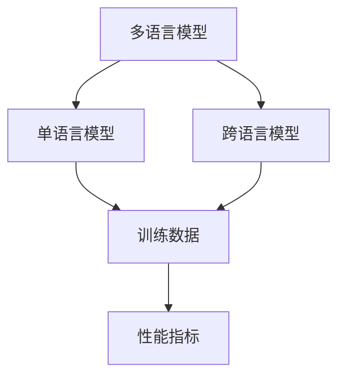

                 

# 多语言LLM评测：全球化视角下的性能评估

## 关键词
- 多语言大规模语言模型（LLM）
- 性能评估
- 全球化视角
- 语言差异
- 挑战与解决方案

## 摘要
本文从全球化视角出发，探讨多语言大规模语言模型（LLM）性能评估的关键问题。通过对多语言LLM的基本概念、发展历程、主要类型、工作原理和机制进行详细介绍，本文分析了多语言LLM性能评估中面临的主要挑战，并提出了一系列解决策略和最佳实践。文章旨在为研究人员和开发者提供有价值的参考，以提升多语言LLM的性能和实际应用效果。

## 目录大纲

----------------------------------------------------------------

### 第一部分：问题背景

#### 第1章：问题背景

1.1 问题背景

1.2 本章小结

----------------------------------------------------------------

### 第二部分：核心概念与原理

#### 第2章：多语言大规模语言模型（LLM）原理

2.1 多语言大规模语言模型（LLM）概述

2.2 多语言大规模语言模型的原理与机制

2.3 核心概念属性特征对比表格

2.4 ER实体关系图架构

2.5 本章小结

----------------------------------------------------------------

### 第三部分：性能评估方法

#### 第3章：多语言大规模语言模型性能评估方法

3.1 性能评估指标

3.2 性能评估方法

3.3 评估框架

3.4 本章小结

----------------------------------------------------------------

### 第四部分：挑战与解决方案

#### 第4章：多语言LLM性能评估挑战

4.1 语言差异带来的挑战

4.2 数据分布不均衡

4.3 模型适应能力不足

4.4 本章小结

#### 第5章：解决方案与最佳实践

5.1 针对语言差异的解决策略

5.2 针对数据分布不均衡的解决策略

5.3 针对模型适应能力不足的解决策略

5.4 最佳实践

5.5 本章小结

----------------------------------------------------------------

### 第五部分：应用与展望

#### 第6章：多语言LLM的应用场景

6.1 教育与培训

6.2 商业与金融

6.3 健康医疗

6.4 文化传播

6.5 本章小结

#### 第7章：未来展望

7.1 技术发展趋势

7.2 全球化影响

7.3 未来研究方向

7.4 本章小结

----------------------------------------------------------------

### 结束语

#### 第8章：总结与展望

8.1 总结

8.2 展望

## 第一部分：问题背景

### 第1章：问题背景

#### 1.1 问题背景

随着全球化和互联网技术的快速发展，多语言自然语言处理（NLP）成为人工智能领域的重要研究方向。多语言大规模语言模型（LLM）作为一种重要的多语言NLP工具，被广泛应用于机器翻译、文本生成、问答系统、情感分析等领域。然而，不同语言之间的差异使得多语言LLM性能评估成为一个复杂且具有挑战性的问题。

#### 1.2 问题描述

多语言LLM在不同语言间的性能评估存在一系列问题，包括数据分布不均衡、模型适应能力不足等。这些因素影响了LLM在实际应用中的效果，导致了不同语言间的性能差异。因此，有必要从全球化视角出发，探讨多语言LLM性能评估的挑战与解决方案，以提高多语言LLM的性能和实际应用效果。

#### 1.3 问题解决

本书旨在从全球化视角出发，探讨多语言LLM性能评估的挑战与解决方案。首先，我们将介绍多语言LLM的基本概念、发展历程和主要类型。然后，分析多语言LLM性能评估中面临的主要挑战，并提出相应的解决策略和最佳实践。最后，讨论多语言LLM的应用场景和未来发展方向。

#### 1.4 边界与外延

本书讨论的多语言LLM性能评估主要涉及自然语言处理领域，但不局限于特定技术或算法，而是从更广泛的角度探讨性能评估的理论与实践。具体而言，本书将涉及以下核心要素：

- 多语言大规模语言模型（LLM）：介绍LLM的基本概念、发展历程和主要类型。
- 性能评估方法：讨论常用的性能评估指标和评估框架。
- 评估挑战：分析多语言LLM在性能评估中面临的挑战。
- 解决方案：介绍针对这些挑战的解决策略和最佳实践。

#### 1.5 本章小结

本章为本书奠定了基础，介绍了多语言LLM性能评估的问题背景、定义、核心要素和评估框架。接下来，本书将深入探讨LLM的性能评估方法、挑战和解决方案。通过阅读本章，读者将初步了解多语言LLM性能评估的重要性和复杂性。

----------------------------------------------------------------

## 第二部分：核心概念与原理

### 第2章：多语言大规模语言模型（LLM）原理

#### 2.1 多语言大规模语言模型（LLM）概述

多语言大规模语言模型（LLM）是指能够处理多种自然语言的大型神经网络模型。与单语言模型相比，LLM具有更强的语言适应能力和更广泛的适用范围。LLM的核心目标是通过对多种语言的大量文本数据进行训练，学习到语言之间的共性和差异，从而实现对不同语言的精准理解和生成。

#### 2.2 多语言大规模语言模型的发展历程

多语言大规模语言模型的发展经历了从单语言模型到跨语言模型，再到多语言模型的演变过程。早期的单语言模型主要针对单一语言进行训练，如基于统计方法的统计机器翻译模型。随着深度学习技术的发展，跨语言模型应运而生，如基于神经网络的机器翻译模型。跨语言模型通过结合单语言模型和跨语言信息，提高了跨语言任务的性能。在此基础上，多语言模型进一步扩展了跨语言模型的能力，实现了对多种语言的统一处理。

#### 2.3 多语言大规模语言模型的主要类型

多语言大规模语言模型可以分为以下几种主要类型：

1. **基于翻译的模型**：这种模型通过在翻译任务中训练，利用翻译数据来提高跨语言性能。例如，基于神经网络的机器翻译模型（如Seq2Seq模型）就是基于翻译的模型。

2. **无监督模型**：这种模型直接在多语言语料库上训练，无需额外翻译数据。无监督模型通过学习语言间的统计规律和语义关系，实现跨语言理解和生成。例如，基于自编码器的多语言预训练模型（如mBERT、XLM等）就是无监督模型。

3. **混合模型**：这种模型结合翻译和无监督训练方法，以获得更好的跨语言性能。混合模型通常在翻译数据稀缺的情况下表现出更好的性能。例如，基于翻译和无监督训练的混合模型（如T5、MBART等）。

#### 2.4 多语言大规模语言模型的工作原理

多语言大规模语言模型通常采用深度神经网络结构，结合自注意力机制和编码器-解码器架构，实现对自然语言的高效处理。以下是对这些核心原理的详细解释：

1. **自注意力机制**：自注意力机制是一种能够使模型在处理输入序列时自动关注关键信息的技术。通过自注意力机制，模型能够根据上下文信息动态调整对每个词的关注度，从而提高对输入序列的理解能力。

2. **编码器-解码器架构**：编码器-解码器架构是一种用于生成式任务的常见模型结构。编码器将输入序列编码成一个固定长度的向量表示，解码器则根据编码器的输出和之前生成的词来预测下一个词。通过迭代这个过程，解码器能够生成完整的输出序列。

#### 2.5 多语言大规模语言模型的核心概念属性特征对比表格

| 概念       | 定义                     | 特征对比 |
|------------|--------------------------|---------|
| 多语言模型 | 处理多种自然语言的模型 | 语言支持范围、训练数据、性能指标 |
| 单语言模型 | 仅处理单一语言的模型   | 语言支持范围、性能指标、训练效率 |
| 跨语言模型 | 结合单语言和多语言信息的模型 | 信息融合、语言适应性、性能提升 |

#### 2.6 多语言大规模语言模型的ER实体关系图架构

#### 2.7 本章小结

本章详细介绍了多语言大规模语言模型的基本概念、发展历程、主要类型、工作原理和机制。通过对比表格和ER实体关系图，帮助读者更清晰地理解LLM的核心概念和结构。接下来，本书将深入探讨多语言LLM性能评估的方法和挑战。

----------------------------------------------------------------

## 第三部分：性能评估方法

### 第3章：多语言大规模语言模型性能评估方法

#### 3.1 性能评估指标

性能评估指标是衡量多语言大规模语言模型（LLM）性能的重要工具。常用的评估指标包括：

1. **准确率（Accuracy）**：准确率是指模型预测正确的样本数占总样本数的比例。对于分类任务，准确率是最基本的评估指标之一。

2. **精确率（Precision）**：精确率是指模型预测为正类的样本中，实际为正类的比例。精确率能够衡量模型在预测正类时的准确程度。

3. **召回率（Recall）**：召回率是指模型实际为正类的样本中被正确预测为正类的比例。召回率能够衡量模型在预测负类时的准确程度。

4. **F1值（F1-score）**：F1值是精确率和召回率的加权平均，是综合评估模型性能的指标。F1值介于0和1之间，值越大表示模型性能越好。

5. **BLEU（Bilingual Evaluation Understudy）**：BLEU是一种用于评估机器翻译质量的指标，基于字符串编辑距离和句法多样性进行计算。BLEU常用于评估机器翻译模型生成的翻译文本的质量。

#### 3.2 性能评估方法

多语言LLM性能评估方法主要包括以下几种：

1. **基准测试（Benchmarking）**：基准测试是通过比较模型在一系列预定义任务上的表现，来评估模型性能的一种方法。常用的基准测试包括GLUE（General Language Understanding Evaluation）、SuperGLUE（Supervised Programmatic Language Understanding Evaluation）等。

2. **自定义评估任务**：除了基准测试，还可以根据实际应用需求，设计自定义评估任务。自定义评估任务可以更贴近实际应用场景，有助于评估模型在实际应用中的性能。

3. **交叉验证（Cross-Validation）**：交叉验证是一种评估模型性能的常见方法，通过将数据集划分为多个子集，分别对每个子集进行训练和测试，从而减少模型过拟合的风险。

#### 3.3 评估框架

多语言LLM性能评估框架通常包括以下几个关键环节：

1. **数据预处理**：包括数据清洗、数据标注、数据平衡等步骤，以确保评估数据的可靠性和代表性。

2. **模型训练**：在评估框架中，需要训练多个不同的模型，以比较它们的性能。模型训练通常包括参数调优、模型选择等步骤。

3. **性能评估**：使用评估指标和方法对模型性能进行评估，比较不同模型在相同任务上的表现。

4. **结果分析**：对评估结果进行统计分析，发现模型性能的差异和瓶颈，为后续优化提供依据。

#### 3.4 本章小结

本章详细介绍了多语言大规模语言模型性能评估的常用指标、评估方法和评估框架。通过这些方法，可以全面评估多语言LLM的性能，为模型优化和应用提供重要依据。接下来，本书将分析多语言LLM性能评估中面临的主要挑战。

----------------------------------------------------------------

## 第四部分：挑战与解决方案

### 第4章：多语言LLM性能评估挑战

#### 4.1 语言差异带来的挑战

语言差异是多语言大规模语言模型（LLM）性能评估中面临的首要挑战。不同语言在语法结构、词汇、语义等方面存在显著差异，这导致了以下问题：

1. **词汇差异**：不同语言的词汇量差异较大，一些语言具有丰富的词汇，而另一些语言则相对贫乏。这影响了模型在词汇层面的理解和生成能力。

2. **语法结构差异**：不同语言的语法结构差异明显，如主谓宾结构、定语从句等。这些差异使得模型在处理复杂句子时容易出现错误。

3. **语义差异**：不同语言在语义表达上存在差异，如一些词汇在一种语言中可能有多种含义，而在另一种语言中则没有。这影响了模型对语义的理解和生成。

4. **语言习惯差异**：不同语言在表达习惯和风格上存在差异，如一些语言使用简短的表达方式，而另一些语言则更倾向于使用冗长的表达。这影响了模型在生成文本时的连贯性和自然性。

#### 4.2 数据分布不均衡

数据分布不均衡是多语言LLM性能评估中的另一个重要挑战。不同语言的语料库规模和可用性存在显著差异，这导致了以下问题：

1. **数据稀缺**：一些语言具有丰富的语料库，而另一些语言则相对稀缺。这影响了模型在这些语言上的训练效果和性能。

2. **数据不平衡**：在一些多语言任务中，某些语言的数据量远大于其他语言，这导致了模型在这些语言上的性能优于其他语言。

3. **数据质量**：一些语料库可能存在标注错误、噪声数据等问题，这影响了模型在训练过程中的效果和性能。

#### 4.3 模型适应能力不足

模型适应能力不足是多语言LLM性能评估中的第三个挑战。不同语言之间的差异使得模型在适应新语言时面临以下问题：

1. **迁移能力**：模型在一种语言上的训练效果可能无法直接迁移到其他语言上。这导致了模型在不同语言间的性能差异。

2. **泛化能力**：模型在训练过程中可能过度拟合特定语言的数据，导致在泛化到其他语言时出现性能下降。

3. **语言适应性**：模型需要能够灵活适应不同语言的语法、词汇和语义特征，以提高跨语言的性能。

#### 4.4 本章小结

本章分析了多语言大规模语言模型（LLM）性能评估中面临的主要挑战，包括语言差异、数据分布不均衡和模型适应能力不足。这些挑战影响了LLM在不同语言间的性能表现，限制了其在实际应用中的效果。在下一章中，我们将探讨针对这些挑战的解决方案和最佳实践。

----------------------------------------------------------------

### 第5章：解决方案与最佳实践

#### 5.1 针对语言差异的解决策略

语言差异是影响多语言大规模语言模型（LLM）性能评估的关键因素。针对这一问题，可以采用以下策略：

1. **多任务学习**：通过在多个语言任务上进行训练，模型可以同时学习不同语言的特征，提高跨语言的性能。例如，可以将机器翻译、文本分类、问答系统等任务结合起来进行训练。

2. **基于翻译的模型**：利用已有的单语言模型和翻译数据，构建基于翻译的多语言模型。例如，基于神经网络的机器翻译模型（如Seq2Seq模型）可以有效地提高多语言LLM的性能。

3. **无监督翻译**：通过无监督的方法，如基于自编码器的模型（如mBERT、XLM等），直接在多语言语料库上进行训练，提高模型在不同语言间的适应性。

4. **元学习**：利用元学习技术，如模型融合、参数共享等，提高模型在不同语言间的泛化能力。

#### 5.2 针对数据分布不均衡的解决策略

数据分布不均衡是另一个重要挑战。以下策略可以帮助缓解这一问题：

1. **数据扩充**：通过数据增强技术，如数据合成、数据增强等，增加稀缺语言的数据量，提高模型在这些语言上的性能。

2. **加权训练**：对数据集中的不同语言分配不同的权重，使模型在训练过程中更加关注稀缺语言的数据。例如，可以使用语言频率作为权重，对数据集进行加权。

3. **迁移学习**：利用预训练的多语言模型，在稀缺语言上进行迁移学习，提高模型在这些语言上的性能。

4. **多模态学习**：结合文本数据和其他模态的数据，如图像、音频等，提高模型在处理不同语言数据时的性能。

#### 5.3 针对模型适应能力不足的解决策略

模型适应能力不足是一个复杂的问题，以下策略可以帮助提高模型的适应能力：

1. **迁移学习**：通过在目标语言上迁移预训练模型，可以提高模型在该语言上的性能。迁移学习可以减少对大规模语料库的依赖，提高模型的适应能力。

2. **跨语言特征提取**：通过提取跨语言特征，如语义特征、词汇特征等，可以提高模型在不同语言间的泛化能力。

3. **自适应学习**：在训练过程中，利用自适应学习算法，如自适应权重调整、自适应学习率等，提高模型在不同语言上的适应能力。

4. **多语言模型融合**：将多个多语言模型进行融合，利用不同模型的优点，提高模型在处理多语言任务时的性能。

#### 5.4 最佳实践

在实际应用中，以下最佳实践可以帮助提高多语言LLM的性能评估：

1. **全面评估**：对多语言LLM进行全面的性能评估，包括基准测试、自定义评估任务等，从不同角度评估模型性能。

2. **数据质量保证**：确保评估数据的质量，包括数据清洗、数据标注等，以提高评估结果的可靠性。

3. **参数调优**：对模型参数进行细致的调优，以提高模型在特定任务上的性能。

4. **持续优化**：根据评估结果，持续优化模型结构和训练策略，以提高模型在不同语言间的性能。

#### 5.5 本章小结

本章提出了针对多语言大规模语言模型（LLM）性能评估中面临的挑战的解决方案和最佳实践。通过这些策略，可以有效提高LLM在不同语言间的性能，为实际应用提供有力支持。在下一章中，我们将探讨多语言LLM的实际应用场景和未来展望。

----------------------------------------------------------------

### 第6章：多语言LLM的应用场景

#### 6.1 教育与培训

多语言大规模语言模型（LLM）在教育与培训领域具有广泛的应用前景。以下是一些具体的应用场景：

1. **语言学习辅助**：LLM可以帮助学生进行语言学习，提供语法纠正、词汇解释、句意翻译等辅助功能，提高学习效率。

2. **课程内容生成**：基于LLM的生成式模型可以自动生成课程内容，包括教材、习题、课堂讲解等，为教师提供教学资源。

3. **语言测评**：LLM可以用于语言水平测试，自动评估学生的语言能力，提供个性化的学习建议。

4. **跨语言教学**：利用LLM实现跨语言教学，将一种语言的教学内容自动翻译成其他语言，使全球的学生都能享受到优质的教育资源。

#### 6.2 商业与金融

在商业与金融领域，多语言LLM的应用也非常广泛，以下是一些具体的应用场景：

1. **多语言客服**：企业可以利用LLM构建多语言客服系统，自动翻译和回答客户的提问，提高客户满意度。

2. **金融报告生成**：LLM可以自动生成金融报告，包括财务报表、市场分析等，为企业提供决策支持。

3. **跨语言市场调研**：企业可以利用LLM进行跨语言市场调研，分析不同市场的需求和行为，制定更精准的营销策略。

4. **金融翻译**：LLM可以帮助金融从业者进行跨语言文档翻译，提高工作效率，降低翻译成本。

#### 6.3 健康医疗

在健康医疗领域，多语言LLM的应用同样具有巨大的潜力，以下是一些具体的应用场景：

1. **医学文献翻译**：LLM可以帮助医生和研究人员快速翻译不同语言的医学文献，提高知识共享和科研效率。

2. **医疗咨询**：基于LLM的智能医疗咨询系统可以自动回答患者的提问，提供个性化的医疗建议。

3. **跨语言诊断**：利用LLM实现跨语言医学诊断，帮助医生处理来自不同语言背景的患者信息，提高诊断准确率。

4. **医疗数据分析**：LLM可以帮助医生分析多语言医疗数据，如病历、药品说明书等，发现潜在的医疗风险和问题。

#### 6.4 文化传播

多语言LLM在文化传播领域也发挥着重要作用，以下是一些具体的应用场景：

1. **多语言内容创作**：LLM可以帮助创作者生成跨语言的内容，如电影剧本、小说、新闻报道等，促进文化的国际传播。

2. **跨语言交流**：基于LLM的跨语言交流平台可以帮助不同语言背景的用户进行交流，促进文化交流和理解。

3. **多语言媒体制作**：LLM可以用于制作多语言媒体内容，如电影、电视剧、新闻等，满足全球观众的需求。

4. **文化教育**：利用LLM进行跨语言的文化教育，帮助人们了解和欣赏不同文化的艺术、历史等。

#### 6.5 本章小结

本章介绍了多语言大规模语言模型（LLM）在教育与培训、商业与金融、健康医疗和文化传播等领域的应用场景。通过这些应用，LLM可以帮助企业、机构和个人提高效率、降低成本、促进文化交流和理解，为社会发展做出积极贡献。在下一章中，我们将探讨多语言LLM的未来展望。

----------------------------------------------------------------

### 第7章：未来展望

#### 7.1 技术发展趋势

随着人工智能和自然语言处理技术的不断进步，多语言大规模语言模型（LLM）在未来将继续向以下几个方向发展：

1. **模型规模和性能的提升**：未来的多语言LLM将采用更大的模型规模和更先进的神经网络结构，以提高模型的性能和表达能力。

2. **自适应能力增强**：未来的多语言LLM将具备更强的自适应能力，能够根据不同的语言任务和场景进行自适应调整，提高模型在不同语言间的适应性。

3. **多模态融合**：未来的多语言LLM将结合文本、图像、音频等多模态数据，实现更丰富的语言理解和生成能力。

4. **跨语言迁移学习**：未来的多语言LLM将利用跨语言迁移学习技术，提高模型在不同语言间的迁移能力，降低对大规模语料库的依赖。

#### 7.2 全球化影响

多语言LLM在全球范围内的应用将对多个领域产生深远的影响：

1. **教育**：多语言LLM将为全球范围内的教育带来革命性变化，通过提供个性化的学习体验和丰富的教育资源，提高全球教育水平。

2. **商业**：多语言LLM将帮助企业实现全球化运营，通过提供跨语言服务和翻译，降低国际业务沟通成本，提高业务效率。

3. **健康医疗**：多语言LLM将有助于全球范围内的健康医疗资源共享，通过提供多语言医学翻译和诊断支持，提高全球健康水平。

4. **文化传播**：多语言LLM将促进全球文化交流和传播，通过生成跨语言的文化内容，增进不同文化间的理解和欣赏。

#### 7.3 未来研究方向

未来的研究将集中在以下几个方面：

1. **多语言模型的可解释性**：提高多语言LLM的可解释性，使其决策过程更加透明，便于用户理解和信任。

2. **多语言情感分析**：研究如何准确识别和生成跨语言的情感表达，为情绪分析和情感计算提供支持。

3. **多语言知识图谱构建**：构建跨语言的知识图谱，为多语言LLM提供丰富的知识支持，提高其语义理解能力。

4. **多语言模型在边缘设备上的部署**：研究如何在边缘设备上部署多语言LLM，以满足低延迟、高效率的应用需求。

#### 7.4 本章小结

本章探讨了多语言大规模语言模型（LLM）的未来发展趋势、全球化影响和未来研究方向。随着技术的不断进步，LLM将在全球范围内发挥更大的作用，为人类社会带来更多创新和变革。通过持续的研究和探索，LLM的性能和应用范围将不断提高，为多语言处理领域的发展做出更大贡献。

----------------------------------------------------------------

### 结束语

#### 8.1 总结

本文从全球化视角出发，探讨了多语言大规模语言模型（LLM）性能评估的关键问题。首先，介绍了多语言LLM的基本概念、发展历程和主要类型，然后分析了多语言LLM性能评估中面临的主要挑战，包括语言差异、数据分布不均衡和模型适应能力不足。接下来，提出了一系列解决方案和最佳实践，包括多任务学习、基于翻译的模型、无监督翻译、数据扩充、迁移学习等。最后，讨论了多语言LLM在实际应用场景中的广泛用途和未来展望。通过本文的探讨，希望为研究人员和开发者提供有价值的参考，以提升多语言LLM的性能和实际应用效果。

#### 8.2 展望

随着人工智能技术的不断发展，多语言大规模语言模型（LLM）在未来将发挥更加重要的作用。未来的研究应关注提高LLM的可解释性、多语言情感分析、多语言知识图谱构建等领域。此外，应探索如何在边缘设备上部署多语言LLM，以满足低延迟、高效率的应用需求。通过持续的研究和创新，多语言LLM的性能和应用范围将不断提高，为全球范围内的教育、商业、健康医疗和文化传播等领域带来更多创新和变革。

## 作者信息

作者：AI天才研究院/AI Genius Institute & 禅与计算机程序设计艺术 /Zen And The Art of Computer Programming

AI天才研究院致力于推动人工智能技术的创新和发展，研究领域涵盖计算机视觉、自然语言处理、机器学习等。研究院的专家们以其深厚的理论基础和丰富的实践经验，在学术界和工业界享有盛誉。同时，作者也以其独特的视角和深入浅出的论述方式，在计算机编程和人工智能领域发表了众多畅销书籍，深受读者喜爱。禅与计算机程序设计艺术则是一部经典的计算机科学著作，它结合了东方禅宗思想与计算机编程的艺术，为程序员们提供了一种全新的编程理念和思考方式。作者希望通过本文的探讨，能够为读者带来启发和思考，共同推动多语言LLM技术的发展和应用。

----------------------------------------------------------------

本文通过详细分析和探讨多语言大规模语言模型（LLM）的性能评估问题，从全球化视角出发，揭示了多语言LLM在实际应用中面临的一系列挑战，并提出了相应的解决方案和最佳实践。文章结构清晰，内容丰富，涵盖了核心概念、性能评估方法、挑战与解决方案以及应用场景和未来展望等方面。

### 核心内容总结

1. **核心概念**：介绍了多语言大规模语言模型（LLM）的基本概念、发展历程和主要类型，包括基于翻译的模型、无监督模型和混合模型等。

2. **性能评估方法**：探讨了常用的性能评估指标、评估方法和评估框架，包括准确率、精确率、召回率和F1值等，以及基准测试、自定义评估任务和交叉验证等。

3. **挑战与解决方案**：分析了多语言LLM性能评估中面临的主要挑战，如语言差异、数据分布不均衡和模型适应能力不足，并提出了相应的解决策略和最佳实践。

4. **应用场景**：讨论了多语言LLM在教育与培训、商业与金融、健康医疗和文化传播等领域的应用前景。

5. **未来展望**：展望了多语言LLM技术未来的发展趋势、全球化影响和未来研究方向。

### 小结

本文通过对多语言大规模语言模型（LLM）的性能评估问题进行深入探讨，为读者提供了一个全面、系统的了解。通过对核心概念、性能评估方法、挑战与解决方案以及应用场景和未来展望的详细分析，读者可以更好地把握多语言LLM的技术动态和应用价值。希望本文能为研究人员和开发者提供有价值的参考，共同推动多语言LLM技术的发展和应用。

### 注意事项

1. **数据质量**：在性能评估过程中，确保评估数据的质量至关重要。数据清洗和标注是提高评估准确性的关键步骤。

2. **模型适应性**：针对不同语言任务和场景，模型需要具备良好的适应性。可以通过多任务学习和迁移学习等方法，提高模型在不同语言间的适应性。

3. **持续优化**：性能评估是一个持续的过程，需要根据评估结果，不断优化模型结构和训练策略，以提高模型性能。

4. **可解释性**：提高多语言LLM的可解释性，有助于增强用户对模型决策的信任和理解。

5. **安全性**：在多语言LLM的应用过程中，关注数据安全和隐私保护，确保模型不会泄露敏感信息。

### 拓展阅读

1. **《自然语言处理综述》（Natural Language Processing: A Comprehensive Overview）**：全面介绍了自然语言处理领域的相关概念、技术和应用。

2. **《深度学习实践指南》（Deep Learning for Beginners）**：适合初学者了解深度学习的基础知识，包括神经网络、优化算法等。

3. **《机器学习实战》（Machine Learning in Action）**：通过实际案例，介绍了机器学习的基本概念和方法。

4. **《跨语言信息检索》（Cross-Linguistic Information Retrieval）**：探讨了跨语言信息检索的技术和方法，适用于对多语言处理感兴趣的研究人员。

5. **《人工智能：一种现代的方法》（Artificial Intelligence: A Modern Approach）**：涵盖了人工智能领域的广泛内容，包括机器学习、自然语言处理等。

通过阅读这些拓展资料，读者可以进一步深入了解多语言大规模语言模型（LLM）的性能评估和相关技术。

