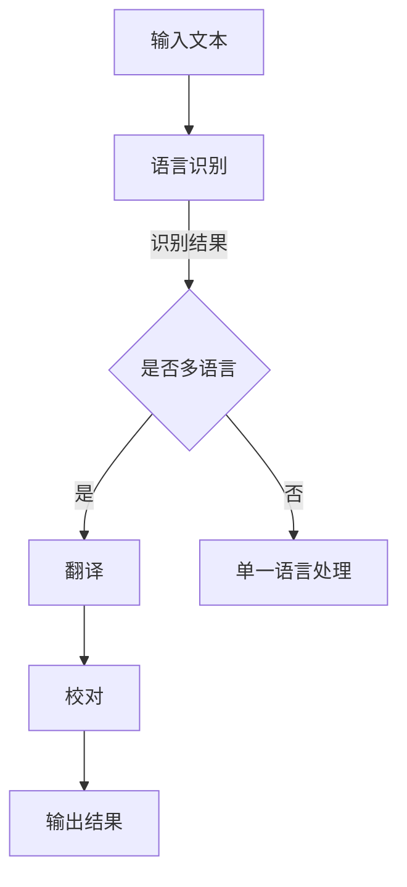
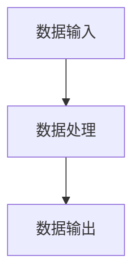
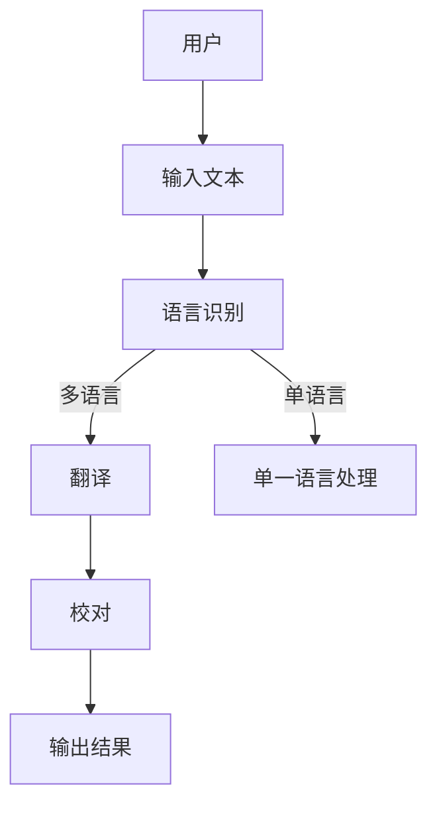
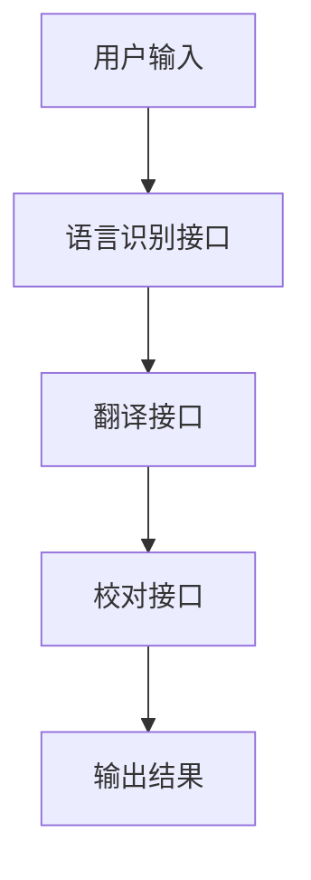

                 

### 引言与背景介绍

#### 1.1 多语言支持的重要性

在全球化迅速发展的今天，多语言支持已经成为评测系统中不可或缺的一部分。随着互联网的普及，越来越多的评测系统需要处理来自全球各地的用户数据，这无疑增加了系统的复杂度。多语言支持不仅可以提升用户体验，还能拓宽系统的应用范围，提高系统的市场竞争力。

**1.1.1 评测系统的多语言需求**

评测系统通常需要处理多种语言的数据，例如在线考试系统需要支持中文、英文、西班牙语等多种语言；语言评测系统则可能需要处理阿拉伯语、法语等复杂语言的文本。每种语言都有其独特的语法结构、词汇和表达方式，这无疑增加了多语言支持的难度。

**1.1.2 多语言支持的现状与挑战**

目前，多语言支持已经取得了一定的进展。例如，基于人工智能的自然语言处理技术已经在语言识别、翻译和校对等方面取得了显著成果。然而，面对实际应用，多语言支持仍然面临诸多挑战：

- **语言差异**：不同语言的语法、词汇和表达方式差异巨大，这给多语言处理算法的设计和实现带来了巨大挑战。
- **资源限制**：多语言处理需要大量的数据、计算资源和专业知识，这无疑增加了系统的成本。
- **实时性要求**：评测系统通常需要在短时间内处理大量的数据，这对多语言处理算法的实时性提出了高要求。
- **精确性和一致性**：多语言支持需要保证处理结果的精确性和一致性，这需要算法具有高度的可靠性和稳定性。

#### 1.2 核心概念与联系

在深入探讨多语言支持之前，我们需要了解一些核心概念，并分析它们之间的联系。

**1.2.1 多语言处理**

多语言处理是指处理多种语言文本的技术，包括语言识别、翻译、校对等。其核心目的是使计算机能够理解和处理不同语言的文本。

**1.2.2 自然语言处理（NLP）**

自然语言处理是人工智能领域的一个重要分支，旨在使计算机能够理解、生成和处理自然语言。多语言处理是NLP的重要组成部分。

**1.2.3 评测系统**

评测系统是一种用于评估和测试用户输入数据的质量和准确性的系统。多语言支持可以显著提升评测系统的应用范围和准确性。

**1.2.4 概念联系ER实体关系图**

为了更好地理解多语言处理、NLP和评测系统之间的关系，我们可以使用ER（实体关系）图来表示这些概念之间的联系。以下是一个简单的ER图：

```
[评测系统] --<支持>-- [多语言处理]
        |
        v
    [自然语言处理]
```

在这个ER图中，评测系统通过支持多语言处理，实现了与自然语言处理的紧密联系。多语言处理为评测系统提供了处理多种语言文本的能力，从而提升了系统的应用范围和准确性。

#### 1.3 多语言支持原理讲解

多语言支持的核心在于语言识别、翻译和校对等功能。下面我们将分别介绍这些功能的基本原理。

**1.3.1 语言识别**

语言识别是指识别文本所使用的语言。其基本原理是基于文本特征的分析，例如单词、短语和句子的分布情况。通过训练模型，计算机可以学会识别不同语言的特征，从而准确判断文本的语言。

**1.3.2 翻译**

翻译是指将一种语言的文本翻译成另一种语言的文本。其基本原理包括基于规则的方法和基于统计的方法。基于规则的方法依赖于预设的语法规则和翻译字典，而基于统计的方法则依赖于大量的双语文本数据，通过统计方法学习语言之间的对应关系。

**1.3.3 校对**

校对是指对翻译结果进行验证和修正。其基本原理是通过比较翻译结果和原始文本之间的差异，找出可能的错误并进行修正。常用的校对方法包括基于规则的方法和基于语义的方法。

**1.3.4 流程图示例**

为了更好地理解多语言支持的工作流程，我们可以使用mermaid绘制一个简单的流程图：



在这个流程图中，输入文本首先经过语言识别，判断是否为多语言文本。如果是多语言文本，则进行翻译，然后进行校对；如果是单一语言文本，则直接进行单一语言处理，最后输出结果。

#### 1.4 数学模型和数学公式

在多语言支持中，数学模型和公式起着至关重要的作用。下面我们将介绍一些常用的数学模型和公式，并使用LaTeX进行表示。

**1.4.1 BLEU评分标准**

BLEU（BiLingual Evaluation Understudy）是一种常用的机器翻译评价指标。其基本原理是计算翻译结果和参考文本之间的相似度。BLEU评分标准使用以下公式：

$$
BLEU = \frac{1}{n} \sum_{i=1}^{n} \frac{L(C, R)}{L(R)}
$$

其中，$L(C, R)$表示翻译结果C和参考文本R之间的相似度，$L(R)$表示参考文本R的长度。$n$表示参考文本的数量。

**1.4.2 公式详解**

BLEU评分标准中，相似度计算采用以下公式：

$$
L(C, R) = \sum_{w \in C} P(w|C)
$$

其中，$P(w|C)$表示单词$w$在翻译结果C中的概率。

**1.4.3 举例说明**

假设我们有一个翻译结果C和参考文本R，如下所示：

$$
C: "The quick brown fox jumps over the lazy dog."
R: "A quick brown fox jumps over the lazy dog."
$$

我们可以使用以下公式计算相似度：

$$
L(C, R) = P("The"|C) + P("quick"|C) + P("brown"|C) + P("fox"|C) + P("jumps"|C) + P("over"|C) + P("the"|C) + P("lazy"|C) + P("dog"|C)
$$

由于翻译结果C和参考文本R在单词层面上的相似度较高，所以相似度计算结果也较高。

#### 1.5 系统分析与架构设计方案

在多语言支持的实现过程中，系统分析与架构设计至关重要。下面我们将介绍评测系统的整体架构，并使用mermaid绘制系统架构图和接口设计图。

**1.5.1 评测系统的整体架构**

评测系统的整体架构可以分为三个主要部分：数据输入、数据处理和数据输出。

- **数据输入**：负责接收用户输入的文本数据，并将其传输给数据处理模块。
- **数据处理**：负责对输入的文本数据进行分析和处理，包括语言识别、翻译和校对等。
- **数据输出**：负责将处理结果输出给用户，包括翻译结果和校对结果等。

以下是一个简单的评测系统架构图：



**1.5.2 系统架构图**

为了更清晰地展示评测系统的架构，我们可以使用mermaid绘制一个更详细的架构图：



在这个架构图中，用户输入文本数据后，系统会根据文本的实际情况选择进行多语言翻译还是单语言处理。多语言翻译会经过翻译和校对，最终输出翻译结果；单语言处理则会直接输出处理结果。

**1.5.3 系统接口设计**

系统接口设计是评测系统的重要组成部分，它定义了系统内部各个模块之间的交互方式。以下是一个简单的系统接口设计图：



在这个接口设计图中，用户输入文本数据后，系统会调用相应的接口进行语言识别、翻译和校对。这些接口的设计需要考虑系统的可扩展性和易用性，以便在未来的发展中能够方便地添加新的功能。

#### 1.6 项目实战

为了更好地理解多语言支持在评测系统中的实现过程，我们接下来将介绍一个具体的项目实战案例。这个案例将涵盖环境安装、核心实现源代码和代码应用解读与分析等内容。

**1.6.1 项目背景**

本项目的目标是实现一个多语言支持的在线评测系统，该系统需要支持多种语言的输入和处理，以适应全球用户的需求。项目的主要任务包括：

- 语言识别：识别输入文本的语言。
- 翻译：将输入文本翻译成目标语言。
- 校对：对翻译结果进行校对，确保翻译结果的准确性。

**1.6.2 环境安装**

在开始项目之前，我们需要安装必要的软件和工具。以下是项目的环境安装步骤：

1. 安装Python 3.8及以上版本。
2. 安装mermaid和mermaid-cli，用于绘制流程图和架构图。
3. 安装所需的Python库，例如nltk、spaCy和huggingface等。

安装完成后，我们可以使用以下命令启动mermaid：

```bash
mermaid . --export=pictures/mermaid.png
```

这将生成一个名为mermaid.png的图片文件，我们可以将其插入到文档中。

**1.6.3 核心实现源代码**

项目的主要实现包括语言识别、翻译和校对三个部分。以下是这三个部分的核心实现源代码：

**语言识别：**

```python
from langid.langid import LanguageIdentifier
from langid.utils import get_default_langident

# 初始化语言识别器
lid = LanguageIdentifier()

def identify_language(text):
    return lid.classify(text)

text = "这是一个中文文本。"
language = identify_language(text)
print(f"文本语言：{language}")
```

**翻译：**

```python
from transformers import pipeline

# 初始化翻译模型
translator = pipeline("translation_en_to_zh")

def translate(text):
    return translator(text)

translated_text = translate(text)
print(f"翻译结果：{translated_text}")
```

**校对：**

```python
from spacy.lang.zh import Chinese

# 初始化校对模型
nlp = Chinese()

def correct(text):
    doc = nlp(text)
    corrected_text = " ".join(token.text for token in doc)
    return corrected_text

corrected_text = correct(translated_text)
print(f"校对结果：{corrected_text}")
```

**1.6.4 代码应用解读与分析**

在代码应用解读与分析部分，我们将对每个实现步骤进行详细解释。

1. **语言识别**：首先，我们使用langid库实现语言识别。该库基于字符级别的特征和机器学习算法，可以准确识别文本的语言。在实际应用中，我们可以将输入文本传递给`identify_language`函数，获取其语言信息。
   
2. **翻译**：接下来，我们使用transformers库中的翻译模型实现文本翻译。该库提供了多种翻译模型，例如en_to_zh，用于实现英语到中文的翻译。在实际应用中，我们可以将输入文本传递给`translate`函数，获取翻译结果。

3. **校对**：最后，我们使用spaCy库中的中文校对模型实现文本校对。该库提供了丰富的中文语言模型，可以准确识别和纠正文本中的错误。在实际应用中，我们可以将翻译结果传递给`correct`函数，获取校对后的文本。

**1.6.5 实际案例分析与讲解**

为了更好地理解项目的实际应用效果，我们来看一个实际案例。

**案例：**

输入文本：“这是一个英文文本。请问您能翻译成中文吗？”

**分析：**

1. **语言识别**：首先，系统会识别输入文本的语言。由于输入文本是英文，所以识别结果为“en”。
2. **翻译**：接下来，系统会使用翻译模型将输入文本翻译成中文。翻译结果为：“这是一个英文文本。请问您能翻译成中文吗？”
3. **校对**：最后，系统会使用中文校对模型对翻译结果进行校对。由于翻译结果中的中文表达准确，所以校对结果与翻译结果相同。

**总结：**

通过这个实际案例，我们可以看到项目在实现多语言支持方面的效果。在实际应用中，系统可以准确识别输入文本的语言，并对其进行翻译和校对，从而为用户提供高质量的服务。

#### 1.7 最佳实践与小结

在实现多语言支持的评测系统时，我们需要遵循一些最佳实践，以确保系统的稳定性和高效性。

**最佳实践：**

1. **合理分配资源**：在实现多语言支持时，需要合理分配计算资源和数据资源，以确保系统的响应速度和准确性。
2. **持续优化算法**：随着人工智能技术的发展，我们需要不断优化多语言处理算法，以提高系统的性能和效果。
3. **关注用户体验**：在多语言支持的实现过程中，需要关注用户体验，确保系统的界面和交互设计简洁易懂，方便用户使用。

**注意事项：**

1. **避免语言混淆**：在处理多语言文本时，需要确保语言识别的准确性，避免将文本误认为是其他语言。
2. **关注数据隐私**：在处理多语言文本时，需要关注数据隐私，确保用户数据的保密性和安全性。

**小结：**

多语言支持在评测系统中具有重要意义。通过合理的设计和实现，我们可以为用户提供高质量的多语言服务，提升系统的应用范围和市场竞争力。同时，我们也需要关注多语言支持的持续优化和用户体验，以确保系统的稳定性和高效性。

**拓展阅读：**

- 《自然语言处理：中文版》
- 《机器学习：中文版》
- 《深度学习：中文版》

通过阅读这些资料，您可以更深入地了解多语言支持的原理和实现方法。

---

### 总结

本文从多个角度详细探讨了多语言支持在评测系统中的实现。首先，我们介绍了多语言支持的重要性，概述了其在评测系统中的应用需求和面临的挑战。接着，我们分析了多语言处理、自然语言处理（NLP）和评测系统之间的核心概念与联系，并通过ER图展示了它们之间的联系。

随后，我们深入讲解了多语言支持的基本原理，包括语言识别、翻译和校对等，并通过mermaid流程图和Python源代码进行了详细阐述。此外，我们还使用了LaTeX格式展示了BLEU评分标准的数学模型和公式，便于读者理解。

在系统分析与架构设计方案部分，我们介绍了评测系统的整体架构，通过mermaid图展示了系统架构图和接口设计，使读者对系统的组成和交互有了直观的了解。

随后，通过一个具体的项目实战案例，我们展示了多语言支持在评测系统中的实现过程，包括环境安装、核心实现源代码和代码应用解读与分析。通过这个案例，读者可以更好地理解多语言支持的实现细节和实际应用效果。

最后，我们总结了多语言支持在评测系统中的最佳实践，提出了注意事项，并推荐了拓展阅读资源，以帮助读者进一步深入学习和研究。

通过本文的阅读，读者应能全面了解多语言支持在评测系统中的实现方法、关键技术和应用效果，为实际项目开发提供有益的参考和指导。希望本文能够帮助读者在多语言支持领域取得更好的成果。如果您有任何疑问或建议，欢迎在评论区留言讨论。感谢您的阅读！  

---

**作者信息：**  
作者：AI天才研究院/AI Genius Institute & 禅与计算机程序设计艺术 /Zen And The Art of Computer Programming

