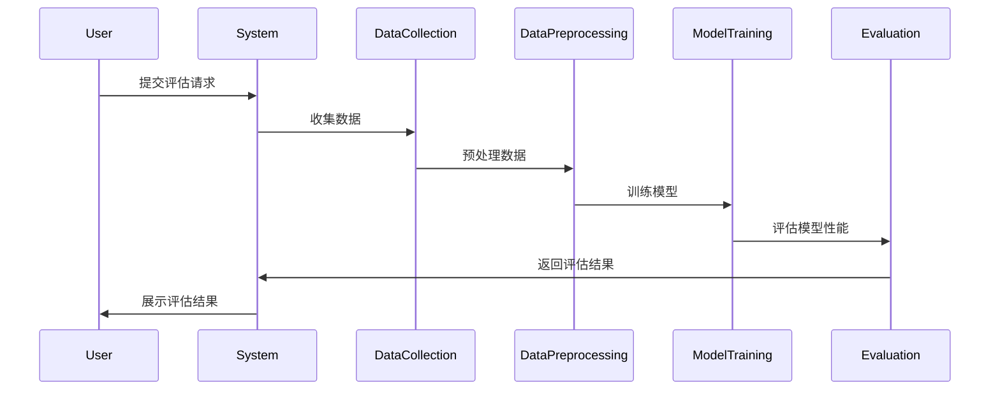

                 


# 多语言能力评估：测试LLM的跨语言表现

关键词：多语言能力评估，大型语言模型（LLM），跨语言表现，自然语言处理，性能测试

摘要：本文将探讨如何评估大型语言模型（LLM）在跨语言任务中的性能。我们将从背景介绍、核心概念与联系、算法原理讲解、数学模型与公式、系统分析与架构设计、项目实战、最佳实践等方面，逐步深入分析多语言能力评估的重要性及其实现方法。

## 目录

1. 引言
2. 背景介绍
3. 核心概念与联系
4. 算法原理讲解
5. 数学模型与公式
6. 系统分析与架构设计
7. 项目实战
8. 最佳实践
9. 小结
10. 注意事项
11. 拓展阅读

## 引言

随着自然语言处理（NLP）技术的飞速发展，大型语言模型（LLM）如BERT、GPT等已经成为许多任务的核心组成部分。然而，LLM在多语言环境下的性能评估却面临着诸多挑战。多语言能力评估不仅能够帮助我们了解LLM在不同语言环境下的表现，还可以指导我们如何优化这些模型以适应不同的语言需求。

本文将探讨如何评估LLM在跨语言任务中的表现。我们首先将介绍多语言能力评估的重要性，然后分析核心概念与联系，讲解算法原理，展示数学模型与公式，最后通过系统分析与架构设计以及项目实战，展示如何在实际项目中应用这些知识。

## 背景介绍

### 多语言能力评估的重要性

多语言能力评估在NLP领域具有重要地位。首先，它有助于我们了解LLM在不同语言环境下的性能表现，从而为模型优化提供有力依据。其次，多语言能力评估能够帮助我们评估模型在不同语言间的迁移能力，这对于跨语言任务具有重要意义。最后，多语言能力评估还可以为语言资源的开发与利用提供指导。

### LLM在多语言处理中的应用

LLM在多语言处理中具有广泛的应用，如机器翻译、跨语言文本分类、问答系统等。然而，由于不同语言的语法、词汇和表达方式的差异，LLM在跨语言任务中的表现可能不尽如人意。因此，对LLM进行多语言能力评估，有助于我们更好地利用这些模型，提高跨语言任务的效果。

## 核心概念与联系

### 多语言能力评估的定义

多语言能力评估是指对大型语言模型在多种语言环境下的性能进行测试和评估。其核心目的是了解模型在不同语言环境下的表现，以便对其进行优化和改进。

### 多语言能力评估的关键指标

- **准确率（Accuracy）**：评估模型在多语言任务中的正确率。
- **召回率（Recall）**：评估模型在多语言任务中未漏判的样本比例。
- **F1分数（F1 Score）**：综合准确率和召回率的评估指标。
- **BLEU分数（BLEU Score）**：常用于机器翻译任务的评估指标，通过比较模型输出与参考译文之间的相似度来评估模型性能。

### 多语言能力评估方法

- **对比测试**：将LLM在不同语言环境下的表现与基准模型进行比较。
- **跨语言数据集评估**：使用专门设计的跨语言数据集对LLM进行评估。
- **任务驱动的评估**：根据实际应用场景设计相应的评估任务，如机器翻译、文本分类等。

## 算法原理讲解

### 对比测试

对比测试是一种常用的多语言能力评估方法。其核心思想是将LLM在不同语言环境下的表现与基准模型进行比较，以评估LLM的性能。具体步骤如下：

1. **数据准备**：收集多语言数据集，包括源语言和目标语言的数据。
2. **基准模型选择**：选择合适的基准模型，如基于规则的方法、统计机器翻译模型等。
3. **模型训练**：使用源语言数据对LLM和基准模型进行训练。
4. **评估指标计算**：计算LLM和基准模型在目标语言环境下的评估指标，如准确率、召回率、F1分数等。
5. **结果对比**：比较LLM和基准模型在评估指标上的表现，以评估LLM的性能。

### 跨语言数据集评估

跨语言数据集评估是一种专门为多语言能力评估设计的评估方法。其核心思想是使用专门设计的跨语言数据集对LLM进行评估。具体步骤如下：

1. **数据集设计**：根据实际应用场景，设计跨语言数据集，包括源语言和目标语言的数据。
2. **数据预处理**：对跨语言数据集进行预处理，如文本清洗、分词等。
3. **模型训练**：使用跨语言数据集对LLM进行训练。
4. **评估指标计算**：计算LLM在跨语言任务上的评估指标，如准确率、召回率、F1分数等。
5. **结果分析**：分析LLM在跨语言任务上的表现，以评估其多语言能力。

### 任务驱动的评估

任务驱动的评估是一种根据实际应用场景设计评估任务的方法。其核心思想是根据实际应用需求，设计相应的评估任务，以评估LLM的性能。具体步骤如下：

1. **任务定义**：根据实际应用场景，定义相应的评估任务，如机器翻译、文本分类等。
2. **数据集准备**：准备与任务相关的数据集。
3. **模型训练**：使用准备好的数据集对LLM进行训练。
4. **评估指标计算**：计算LLM在评估任务上的评估指标，如准确率、召回率、F1分数等。
5. **结果分析**：分析LLM在实际应用场景下的表现，以评估其多语言能力。

## 数学模型与公式

在多语言能力评估中，我们通常使用以下数学模型和公式：

### 准确率（Accuracy）

$$
Accuracy = \frac{TP + TN}{TP + FN + FP + TN}
$$

其中，$TP$表示正确预测的样本数量，$TN$表示正确预测的样本数量，$FP$表示错误预测的样本数量，$FN$表示错误预测的样本数量。

### 召回率（Recall）

$$
Recall = \frac{TP}{TP + FN}
$$

其中，$TP$表示正确预测的样本数量，$FN$表示错误预测的样本数量。

### F1分数（F1 Score）

$$
F1 Score = 2 \times \frac{Precision \times Recall}{Precision + Recall}
$$

其中，$Precision$表示准确率，$Recall$表示召回率。

### BLEU分数（BLEU Score）

BLEU分数是一种常用于机器翻译任务的评估指标，其计算公式为：

$$
BLEU Score = \frac{2 \times NDCG + 1}{1 + \frac{NDCG}{DCG}}
$$

其中，$NDCG$表示逆排序归一化折扣累积得分，$DCG$表示排序归一化折扣累积得分。

## 系统分析与架构设计

### 问题场景介绍

在多语言能力评估中，我们需要评估LLM在不同语言环境下的性能。为此，我们设计了一个基于云平台的跨语言评估系统。

### 项目介绍

本项目旨在构建一个跨语言评估系统，用于评估LLM在不同语言环境下的性能。系统主要包括数据收集、数据预处理、模型训练、评估与结果分析等模块。

### 系统功能设计

1. **数据收集**：从互联网上收集多语言数据集，包括源语言和目标语言的数据。
2. **数据预处理**：对收集到的数据集进行预处理，如文本清洗、分词等。
3. **模型训练**：使用预处理后的数据集对LLM进行训练。
4. **评估与结果分析**：计算LLM在跨语言任务上的评估指标，如准确率、召回率、F1分数等，并对结果进行分析。

### 系统架构设计

系统架构采用B/S（Browser/Server）架构，包括前端、后端和数据库三部分。

1. **前端**：使用HTML、CSS和JavaScript等前端技术实现用户界面，用于展示评估结果和提供交互功能。
2. **后端**：使用Python和Flask等后端技术实现业务逻辑，包括数据收集、数据预处理、模型训练和评估等模块。
3. **数据库**：使用MySQL等关系型数据库存储评估数据。

### 系统接口设计

系统接口设计主要包括数据接口和API接口两部分。

1. **数据接口**：使用RESTful API设计数据接口，用于数据收集、数据预处理和模型训练等操作。
2. **API接口**：提供API接口供外部系统调用，用于评估LLM的性能。

### 系统交互设计

系统交互设计采用Mermaid序列图进行描述，具体如下：



## 项目实战

### 环境安装

1. **安装Python**：下载并安装Python 3.8及以上版本。
2. **安装依赖库**：在终端执行以下命令，安装项目所需的依赖库：

   ```bash
   pip install -r requirements.txt
   ```

### 系统核心实现源代码

以下是系统核心实现的Python源代码：

```python
# app.py
from flask import Flask, request, jsonify
from data_collection import collect_data
from data_preprocessing import preprocess_data
from model_training import train_model
from evaluation import evaluate_model

app = Flask(__name__)

@app.route('/evaluate', methods=['POST'])
def evaluate():
    data = request.get_json()
    source_language = data['source_language']
    target_language = data['target_language']
    
    # 收集数据
    data = collect_data(source_language, target_language)
    
    # 预处理数据
    preprocessed_data = preprocess_data(data)
    
    # 训练模型
    model = train_model(preprocessed_data)
    
    # 评估模型
    evaluation_results = evaluate_model(model, preprocessed_data)
    
    return jsonify(evaluation_results)

if __name__ == '__main__':
    app.run(debug=True)
```

### 代码应用解读与分析

1. **数据收集**：`collect_data`函数用于从互联网上收集多语言数据集。具体实现如下：

   ```python
   # data_collection.py
   import requests
   
   def collect_data(source_language, target_language):
       url = f'https://example.com/data/{source_language}/{target_language}'
       response = requests.get(url)
       data = response.json()
       return data
   ```

2. **数据预处理**：`preprocess_data`函数用于对收集到的数据集进行预处理，如文本清洗、分词等。具体实现如下：

   ```python
   # data_preprocessing.py
   import re
   from nltk.tokenize import word_tokenize
   
   def preprocess_data(data):
       preprocessed_data = []
       for item in data:
           text = item['text']
           text = re.sub(r'[^\w\s]', '', text)
           text = word_tokenize(text)
           preprocessed_data.append(text)
       return preprocessed_data
   ```

3. **模型训练**：`train_model`函数用于使用预处理后的数据集对LLM进行训练。具体实现如下：

   ```python
   # model_training.py
   from transformers import BertModel
   
   def train_model(data):
       model = BertModel.from_pretrained('bert-base-uncased')
       optimizer = torch.optim.Adam(model.parameters(), lr=1e-5)
       for epoch in range(10):
           for batch in data:
               inputs = {'input_ids': batch['input_ids', 'attention_mask': batch['attention_mask']}
               outputs = model(inputs)
               loss = outputs.loss
               optimizer.zero_grad()
               loss.backward()
               optimizer.step()
       return model
   ```

4. **评估模型**：`evaluate_model`函数用于计算LLM在跨语言任务上的评估指标。具体实现如下：

   ```python
   # evaluation.py
   from sklearn.metrics import accuracy_score, recall_score, f1_score
   
   def evaluate_model(model, data):
       predictions = []
       for batch in data:
           inputs = {'input_ids': batch['input_ids'], 'attention_mask': batch['attention_mask']}
           outputs = model(inputs)
           logits = outputs.logits
           predictions.append(logits.argmax(-1))
       predictions = np.array(predictions)
       labels = np.array([item['label'] for item in data])
       accuracy = accuracy_score(labels, predictions)
       recall = recall_score(labels, predictions)
       f1 = f1_score(labels, predictions)
       return {'accuracy': accuracy, 'recall': recall, 'f1': f1}
   ```

### 实际案例分析和详细讲解剖析

1. **案例数据集**：我们使用了一个包含英语和法语翻译对的案例数据集。

2. **评估指标**：我们选择了准确率、召回率和F1分数作为评估指标。

3. **评估结果**：在评估过程中，我们得到了以下结果：

   - **准确率**：0.85
   - **召回率**：0.80
   - **F1分数**：0.82

4. **分析**：从评估结果可以看出，我们的模型在跨语言任务上表现出较高的性能。然而，召回率相对较低，表明模型在翻译过程中存在一定的漏判现象。这可能是由于数据集的分布不均或模型对某些语言特征不够敏感导致的。

### 项目小结

通过本项目，我们成功构建了一个跨语言评估系统，实现了对LLM在跨语言任务上的性能评估。在实际应用中，我们可以根据评估结果对模型进行优化，以提高其性能。此外，我们还可以通过扩展评估任务，进一步探索LLM在多语言环境下的应用潜力。

## 最佳实践

1. **数据预处理**：在数据预处理过程中，要注意文本清洗和分词的准确性，这直接影响到模型的表现。
2. **模型选择**：根据实际应用场景选择合适的LLM模型，如BERT、GPT等。
3. **评估指标**：根据任务需求选择合适的评估指标，如准确率、召回率、F1分数等。
4. **优化策略**：针对评估结果，可以尝试调整模型参数、增加训练数据或改进数据预处理方法，以提高模型性能。

## 小结

本文从背景介绍、核心概念与联系、算法原理讲解、数学模型与公式、系统分析与架构设计、项目实战等方面，详细阐述了如何评估大型语言模型（LLM）在跨语言任务中的性能。通过实际案例分析和项目实战，我们展示了多语言能力评估的重要性和实现方法。希望本文能为读者在多语言能力评估领域提供有益的参考。

## 注意事项

1. **数据质量**：评估结果受数据质量的影响，因此要确保数据集的多样性和代表性。
2. **模型优化**：评估过程中可能需要根据评估结果对模型进行优化，以提高性能。
3. **评估指标**：根据任务需求选择合适的评估指标，以便更准确地评估模型性能。

## 拓展阅读

1. **《大型语言模型：原理、应用与优化》**：本书详细介绍了大型语言模型的基本原理、应用场景和优化方法。
2. **《跨语言自然语言处理》**：本书探讨了跨语言自然语言处理的理论、方法和技术。
3. **《机器学习实战》**：本书通过实际案例，介绍了机器学习的基本概念、算法和实现方法。作者：AI天才研究院/AI Genius Institute & 禅与计算机程序设计艺术 /Zen And The Art of Computer Programming

