                 


### 引言

#### 1.1 书籍背景

大型应用开发是一个复杂且挑战重重的领域。随着技术的不断进步和业务需求的日益增长，开发者需要面对的不仅仅是实现功能的挑战，还有如何高效地管理和预测需求与资源的问题。传统的开发模式往往依赖于经验来估算需求，这种方式在简单的项目中可能尚可，但在大型应用开发中，其局限性日益凸显。

首先，需求预测对于大型应用开发至关重要。准确的需求预测能够帮助团队更好地规划开发进度、资源分配以及风险管理。如果不提前了解用户需求，开发团队很可能会在项目进行到一半时发现需求不符，导致返工和延期，严重时甚至可能使项目失败。

资源预测同样不可忽视。在大型应用开发中，资源（如人力、时间、硬件）的合理配置对项目的成功至关重要。资源不足或过剩都会带来负面影响，如成本超支、进度延误或效率低下。

本书籍旨在解决上述问题，提供一套系统化的需求与资源预测模型，帮助开发者在大型应用开发中更好地应对需求与资源的预测问题。通过本书，读者将学习到各种预测模型的理论基础、实现方法以及实际应用。

#### 1.2 需求预测

需求预测是指通过分析历史数据和业务场景，预测用户在未来的某个时间点对某个功能的需求量。需求预测的核心要素包括：

- **用户行为数据**：用户行为数据是需求预测的重要输入，如用户的点击、购买、评论等行为。通过分析这些数据，可以推断用户的兴趣和需求。
- **市场趋势**：市场趋势包括行业动态、竞争对手行为、季节性变化等。这些趋势对需求有显著影响，是需求预测中不可或缺的考虑因素。
- **业务指标**：业务指标如销售额、活跃用户数、市场份额等，是衡量需求的重要依据。通过这些指标的变化趋势，可以预测未来的需求。

需求预测的方法论主要包括以下几个方面：

- **时间序列分析**：通过分析历史数据的时序特征，预测未来的需求趋势。常见的时间序列分析方法包括ARIMA模型、季节性分解等。
- **回归分析**：通过建立历史需求与相关因素（如广告投入、促销活动等）的回归模型，预测未来的需求。
- **机器学习**：利用机器学习算法，如决策树、随机森林等，从大量历史数据中学习需求与影响因素之间的关系，预测未来的需求。

#### 1.3 资源预测

资源预测是指通过分析历史数据和项目特征，预测在未来的某个时间点所需的资源量。资源预测的核心要素包括：

- **项目规模**：项目规模包括功能复杂度、代码行数、模块数量等，对资源的消耗有直接影响。
- **开发团队**：开发团队的能力和规模直接影响项目的开发进度和质量。
- **历史数据**：历史数据包括项目历年的资源消耗情况、项目进度等，是资源预测的重要依据。

资源预测的方法论主要包括以下几个方面：

- **时间序列分析**：通过分析历史数据的时序特征，预测未来的资源需求。
- **回归分析**：通过建立历史资源消耗与项目特征之间的回归模型，预测未来的资源需求。
- **机器学习**：利用机器学习算法，从大量历史数据中学习资源需求与项目特征之间的关系，预测未来的资源需求。

#### 1.4 需求与资源预测的结合

需求与资源预测并不是孤立的，它们之间存在紧密的联系。准确的需求预测可以为资源预测提供重要的输入，而资源预测的结果也可以帮助调整需求预测模型。

集成模型的设计与实现需要综合考虑需求与资源的各种因素。一种常见的方法是使用一个统一的预测模型，将需求预测和资源预测结合起来。具体实现时，可以考虑以下步骤：

1. **数据预处理**：收集并整理需求与资源相关的数据，包括历史需求数据、资源消耗数据以及市场趋势、项目规模等数据。
2. **特征工程**：根据需求与资源预测的核心要素，提取相关特征，如用户行为特征、市场趋势特征、项目规模特征等。
3. **模型选择**：选择合适的机器学习算法，如决策树、随机森林等，建立需求与资源预测模型。
4. **模型训练与优化**：使用历史数据进行模型训练，通过交叉验证等方法评估模型性能，并进行模型优化。
5. **预测与评估**：使用训练好的模型进行需求与资源预测，并对预测结果进行评估。

#### 1.5 案例研究

为了更好地理解需求与资源预测模型的应用，以下是一个实际案例研究：

**案例背景**：某电子商务公司计划开发一款新的购物应用，为了确保项目的成功，他们需要准确预测未来的用户需求和所需资源。

**步骤1：需求预测**
- **数据收集**：收集用户行为数据、市场趋势数据以及公司的历史销售数据。
- **特征工程**：提取用户行为特征（如浏览量、购买频率）、市场趋势特征（如节假日促销活动）和销售数据特征（如广告投入）。
- **模型选择**：选择随机森林算法进行需求预测。
- **模型训练与优化**：使用历史数据进行模型训练，并通过交叉验证进行模型优化。

**步骤2：资源预测**
- **数据收集**：收集项目历史资源消耗数据、项目规模数据（如功能复杂度、代码行数）以及开发团队的能力数据。
- **特征工程**：提取项目规模特征、团队能力特征以及历史资源消耗特征。
- **模型选择**：选择线性回归算法进行资源预测。
- **模型训练与优化**：使用历史数据进行模型训练，并通过交叉验证进行模型优化。

**步骤3：集成模型设计**
- **数据预处理**：将需求预测和资源预测的数据进行整合。
- **特征工程**：提取共有的特征，如时间序列特征、市场趋势特征等。
- **模型选择**：选择多输入多输出模型进行集成预测。

**步骤4：预测与评估**
- **预测**：使用集成模型进行需求与资源预测。
- **评估**：评估预测结果的准确性，并进行必要的调整。

#### 1.6 本章小结

本章介绍了大型应用开发中的需求与资源预测模型，包括需求预测、资源预测的基本概念、核心要素以及方法论。通过结合实际案例，展示了如何设计和实现需求与资源预测模型。在接下来的章节中，我们将深入探讨需求预测和资源预测的详细技术方法。

## 1.6 本章小结

本章介绍了大型应用开发中的需求与资源预测模型，探讨了需求预测和资源预测的基本概念、核心要素和方法论。通过实际案例，展示了如何设计和实现需求与资源预测模型。这些模型不仅有助于更好地管理大型应用开发中的需求和资源，还为优化开发流程和提升项目成功率提供了有力支持。在后续章节中，我们将进一步探讨各种需求预测和资源预测的具体技术方法和应用场景，帮助读者深入了解这些模型在实际项目中的运用。

---

### 第二部分：需求预测模型

在大型应用开发中，准确的需求预测是确保项目顺利进行和成功交付的关键。本部分将详细介绍几种常用的需求预测模型，包括基于历史数据的预测模型、基于机器学习的需求预测模型和基于深度学习的需求预测模型。

#### 2.1 基于历史数据的预测模型

基于历史数据的预测模型是最常见的需求预测方法之一。这种方法利用历史数据中的时间序列特征和趋势，预测未来的需求量。以下是一些常用的模型：

##### 2.1.1 时间序列分析方法

时间序列分析是一种统计分析方法，用于分析时间序列数据中的模式、趋势和周期性。以下是一些常用的时间序列分析模型：

###### 2.1.1.1 时间序列模型

时间序列模型是用于预测时间序列数据的统计模型，最常见的包括ARIMA（自回归积分滑动平均模型）。

- **自回归模型（AR）**：AR模型假设当前值由过去的几个值加权平均得到，适用于没有季节性或趋势的数据。
- **移动平均模型（MA）**：MA模型假设当前值由过去的几个值的加权平均得到，适用于没有趋势或季节性的数据。
- **自回归移动平均模型（ARMA）**：ARMA模型结合了AR和MA模型的特点，适用于具有趋势和季节性的数据。

时间序列模型的mermaid流程图如下：

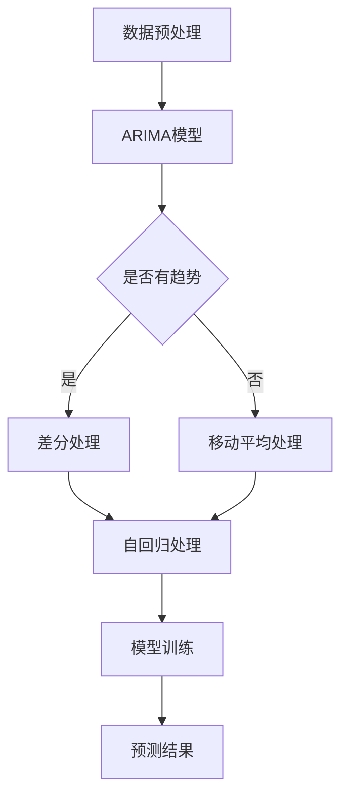

###### 2.1.1.2 季节性分析

季节性分析是时间序列分析中的重要一环，用于识别和建模数据中的季节性模式。以下是一些常用的季节性分析方法：

- **季节分解**：将时间序列数据分解为趋势、季节性和随机性三个部分，分别建模。
- **季节性ARIMA模型（SARIMA）**：在ARIMA模型的基础上，加入季节性成分。

季节性分析的mermaid流程图如下：

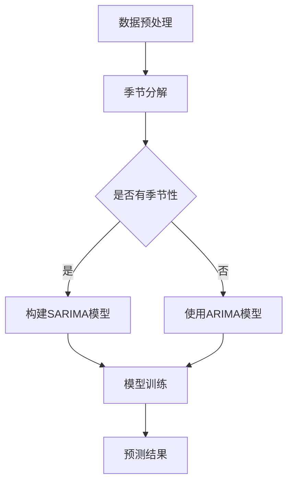

###### 2.1.1.3 非线性时间序列模型

非线性时间序列模型适用于具有非线性特征的时间序列数据。以下是一些常用的非线性时间序列模型：

- **指数平滑模型（ESM）**：适用于具有非线性趋势的时间序列数据。
- **神经网络模型**：如LSTM（长短期记忆网络），适用于具有复杂非线性特征的时间序列数据。

非线性时间序列模型的mermaid流程图如下：

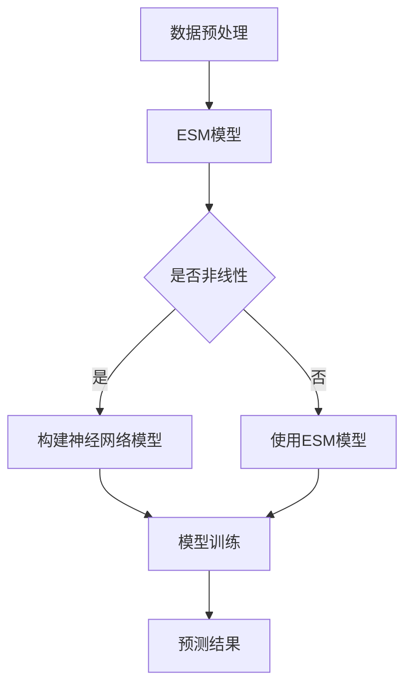

##### 2.1.2 回归分析方法

回归分析方法通过建立需求与相关因素之间的数学关系，预测未来的需求。以下是一些常用的回归分析方法：

###### 2.1.2.1 线性回归

线性回归是最简单的回归方法，通过建立线性模型来预测需求。线性回归的mermaid流程图如下：

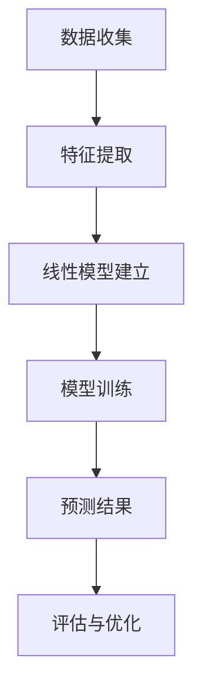

###### 2.1.2.2 多元回归

多元回归是线性回归的扩展，用于处理多个自变量对因变量的影响。多元回归的mermaid流程图如下：

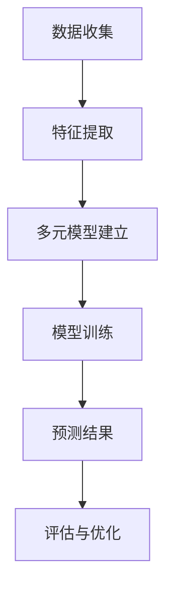

###### 2.1.2.3 非线性回归

非线性回归是回归分析的扩展，用于处理非线性关系。以下是一些常用的非线性回归方法：

- **多项式回归**：通过多项式函数来拟合非线性关系。
- **指数回归**：通过指数函数来拟合非线性关系。

非线性回归的mermaid流程图如下：

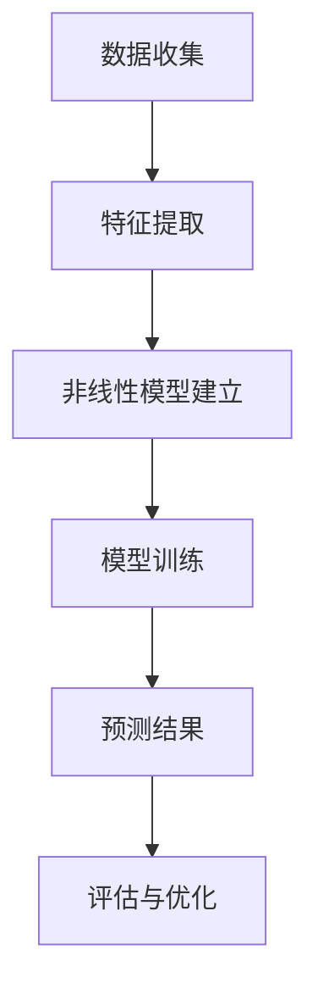

#### 2.2 基于机器学习的需求预测模型

基于机器学习的需求预测模型通过学习历史数据中的复杂模式，预测未来的需求。以下是一些常用的机器学习方法：

##### 2.2.1 监督学习模型

监督学习模型通过学习历史数据中的特征与需求之间的关系，预测未来的需求。以下是一些常用的监督学习模型：

###### 2.2.1.1 决策树

决策树是一种树形结构，通过一系列的判断规则来预测需求。决策树的mermaid流程图如下：

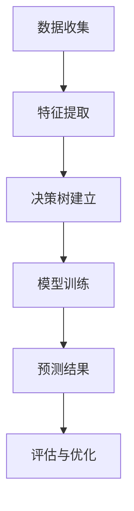

###### 2.2.1.2 支持向量机

支持向量机是一种基于最大间隔的线性模型，通过找到最佳的超平面来分割数据集。支持向量机的mermaid流程图如下：


###### 2.2.1.3 随机森林

随机森林是一种基于决策树的集成方法，通过构建多棵决策树并投票得到最终预测结果。随机森林的mermaid流程图如下：

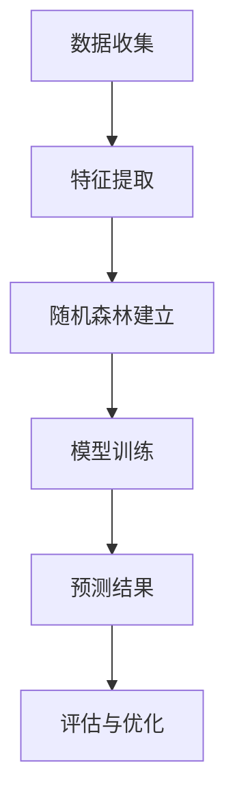

##### 2.2.2 无监督学习模型

无监督学习模型通过学习数据中的内在结构，预测未来的需求。以下是一些常用的无监督学习模型：

###### 2.2.2.1 K-均值聚类

K-均值聚类是一种基于距离的聚类方法，通过将数据划分为K个簇来预测需求。K-均值聚类的mermaid流程图如下：

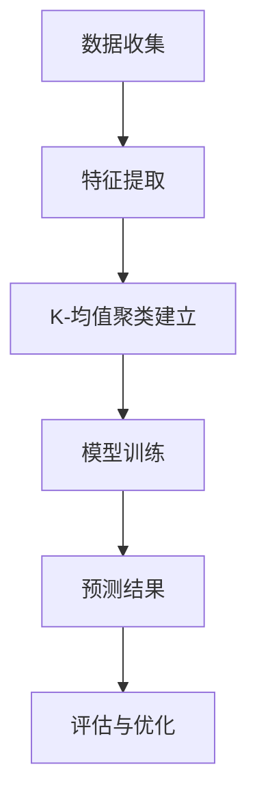

###### 2.2.2.2 主成分分析

主成分分析是一种降维方法，通过提取数据的主要成分来简化数据并提高预测性能。主成分分析的mermaid流程图如下：

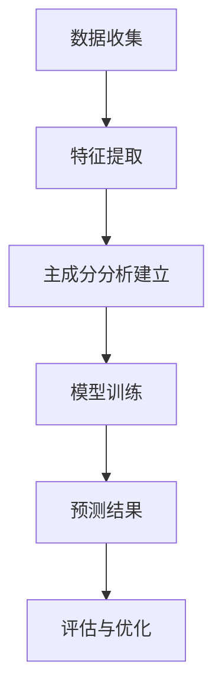

#### 2.3 基于深度学习的需求预测模型

基于深度学习的需求预测模型通过学习大量的历史数据，提取数据中的深层特征，预测未来的需求。以下是一些常用的深度学习模型：

##### 2.3.1 卷积神经网络（CNN）

卷积神经网络是一种基于卷积操作的深度学习模型，适用于处理具有网格结构的数据。以下是一些CNN在需求预测中的应用：

###### 2.3.1.1 CNN原理

CNN通过卷积层、池化层和全连接层来提取和识别数据中的特征。CNN的mermaid流程图如下：

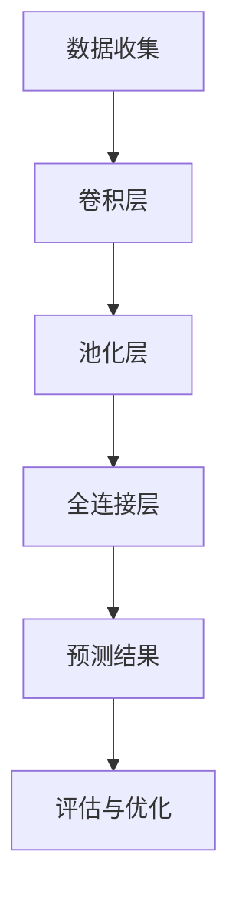

###### 2.3.1.2 CNN在需求预测中的应用

CNN可以用于处理时间序列数据，通过卷积操作提取时间序列中的局部特征。CNN在需求预测中的应用mermaid流程图如下：

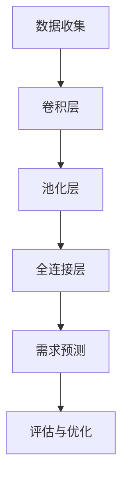

##### 2.3.2 循环神经网络（RNN）

循环神经网络是一种基于循环操作的深度学习模型，适用于处理序列数据。以下是一些RNN在需求预测中的应用：

###### 2.3.2.1 RNN原理

RNN通过隐藏状态和循环连接来处理序列数据，能够记住前面的输入信息。RNN的mermaid流程图如下：

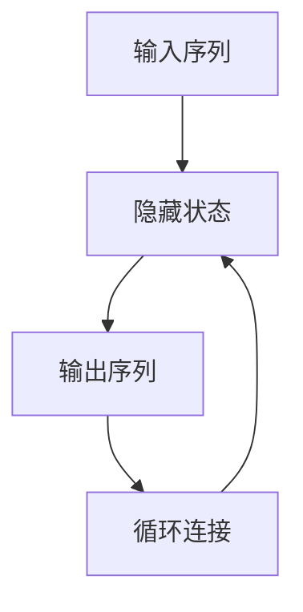

###### 2.3.2.2 RNN在需求预测中的应用

RNN可以用于处理时间序列数据，通过隐藏状态和循环连接来提取时间序列中的特征。RNN在需求预测中的应用mermaid流程图如下：

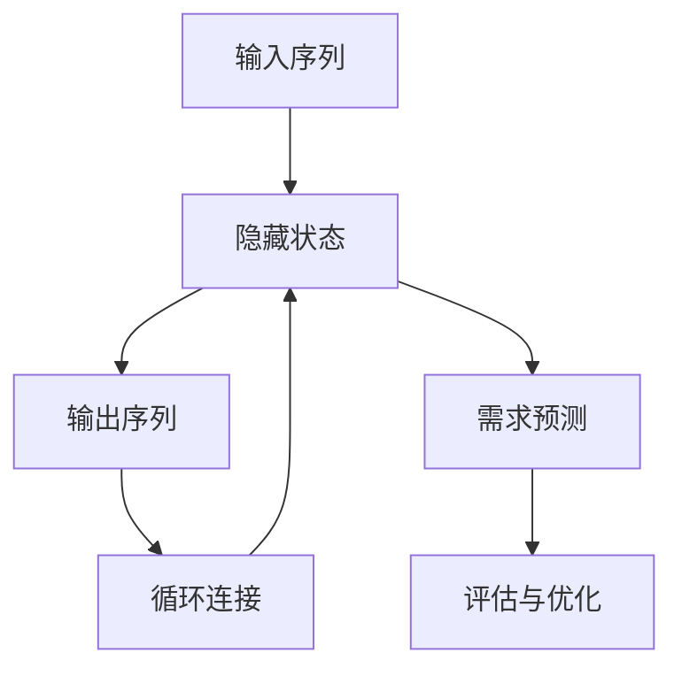

#### 2.4 需求预测模型的评估与优化

在建立需求预测模型后，评估模型的性能至关重要。以下是一些常用的评估指标和优化策略：

##### 2.4.1 评估指标

常用的需求预测评估指标包括：

- **均方误差（MSE）**：衡量预测值与真实值之间的平均平方误差。
- **平均绝对误差（MAE）**：衡量预测值与真实值之间的平均绝对误差。
- **R²值**：衡量模型解释能力，取值范围在0到1之间，越接近1表示模型解释能力越强。

##### 2.4.2 模型优化策略

常见的模型优化策略包括：

- **超参数调优**：通过调整模型的超参数，如学习率、正则化参数等，优化模型性能。
- **模型集成**：通过结合多个模型的结果，提高预测准确性。
- **数据预处理**：通过数据清洗、特征提取等方法，提高数据质量和预测性能。

#### 2.5 本章小结

本章介绍了需求预测模型的基本概念、方法和应用。通过时间序列分析、回归分析和机器学习方法，我们可以建立有效的需求预测模型。同时，本章还介绍了基于深度学习的需求预测模型，如CNN和RNN。在接下来的章节中，我们将继续探讨资源预测模型以及需求与资源预测的结合，帮助读者全面掌握大型应用开发中的需求与资源预测技术。

---

### 第三部分：资源预测模型

在大型应用开发中，资源的合理配置对项目的成功至关重要。资源预测模型通过分析历史数据和项目特征，预测未来所需的资源量，从而帮助团队更好地规划和管理项目。本部分将详细介绍几种常用的资源预测模型，包括基于历史数据的预测模型、基于机器学习的资源预测模型和基于深度学习的资源预测模型。

#### 3.1 资源预测的基本概念

资源预测是指通过分析历史数据和项目特征，预测在未来的某个时间点所需的资源量。资源可以包括人力、时间、硬件等多种形式。资源预测的核心要素包括：

- **项目规模**：项目规模包括功能复杂度、代码行数、模块数量等，对资源的消耗有直接影响。
- **开发团队**：开发团队的能力和规模直接影响项目的开发进度和质量。
- **历史数据**：历史数据包括项目历年的资源消耗情况、项目进度等，是资源预测的重要依据。

资源预测的目标是通过预测未来的资源需求，帮助团队提前做好资源准备，避免资源不足或过剩，从而提高项目的效率和质量。

#### 3.2 基于历史数据的资源预测模型

基于历史数据的资源预测模型通过分析历史数据中的资源消耗模式和趋势，预测未来的资源需求。以下是一些常用的模型：

##### 3.2.1 时间序列分析方法

时间序列分析是资源预测的一种常用方法，通过分析历史数据中的时序特征，预测未来的资源需求。以下是一些常用的时间序列分析模型：

###### 3.2.1.1 自回归模型（AR）

自回归模型（AR）假设当前资源需求由过去的资源需求值加权平均得到。AR模型的mermaid流程图如下：

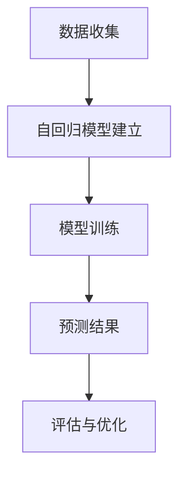

###### 3.2.1.2 移动平均模型（MA）

移动平均模型（MA）假设当前资源需求由过去的资源需求的加权平均得到。MA模型的mermaid流程图如下：

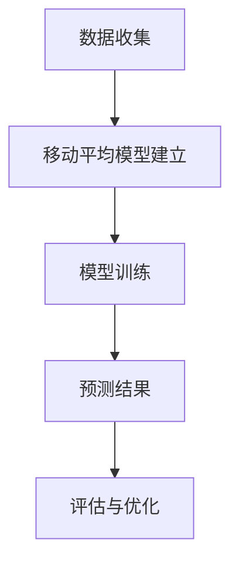

###### 3.2.1.3 自回归移动平均模型（ARMA）

自回归移动平均模型（ARMA）结合了AR和MA模型的特点，适用于具有趋势和季节性的资源需求预测。ARMA模型的mermaid流程图如下：

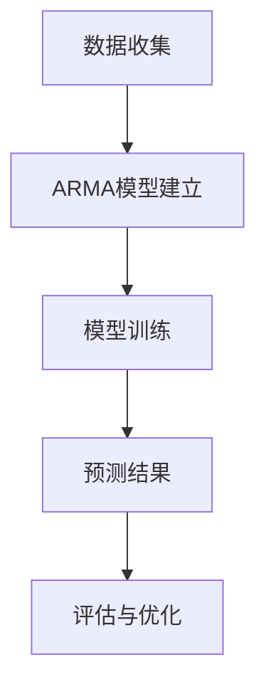

##### 3.2.2 回归分析方法

回归分析方法通过建立历史资源消耗与项目特征之间的数学关系，预测未来的资源需求。以下是一些常用的回归分析方法：

###### 3.2.2.1 线性回归

线性回归是最简单的回归方法，通过建立线性模型来预测资源需求。线性回归的mermaid流程图如下：


###### 3.2.2.2 多元回归

多元回归是线性回归的扩展，用于处理多个自变量对因变量的影响。多元回归的mermaid流程图如下：


##### 3.2.3 基于机器学习的资源预测模型

基于机器学习的资源预测模型通过学习历史数据中的复杂模式，预测未来的资源需求。以下是一些常用的机器学习方法：

###### 3.2.3.1 监督学习模型

监督学习模型通过学习历史数据中的特征与资源需求之间的关系，预测未来的资源需求。以下是一些常用的监督学习模型：

- **决策树**：通过一系列的判断规则来预测资源需求。
- **支持向量机**：通过找到最佳的超平面来分割数据集。
- **随机森林**：通过构建多棵决策树并投票得到最终预测结果。

监督学习模型的mermaid流程图如下：

```mermaid
graph TB
A[数据收集] --> B[特征提取]
B --> C[监督学习模型建立]
C --> D[模型训练]
D --> E[预测结果]
E --> F[评估与优化]
```

###### 3.2.3.2 无监督学习模型

无监督学习模型通过学习数据中的内在结构，预测未来的资源需求。以下是一些常用的无监督学习模型：

- **K-均值聚类**：通过将数据划分为K个簇来预测资源需求。
- **主成分分析**：通过提取数据的主要成分来简化数据并提高预测性能。

无监督学习模型的mermaid流程图如下：

```mermaid
graph TB
A[数据收集] --> B[特征提取]
B --> C[无监督学习模型建立]
C --> D[模型训练]
D --> E[预测结果]
E --> F[评估与优化]
```

##### 3.2.4 基于深度学习的资源预测模型

基于深度学习的资源预测模型通过学习大量的历史数据，提取数据中的深层特征，预测未来的资源需求。以下是一些常用的深度学习模型：

###### 3.2.4.1 卷积神经网络（CNN）

卷积神经网络是一种基于卷积操作的深度学习模型，适用于处理具有网格结构的数据。以下是一些CNN在资源预测中的应用：

- **CNN原理**：通过卷积层、池化层和全连接层来提取和识别数据中的特征。
- **CNN在资源预测中的应用**：通过卷积操作提取时间序列数据中的特征。

CNN的mermaid流程图如下：

```mermaid
graph TB
A[数据收集] --> B[卷积层]
B --> C[池化层]
C --> D[全连接层]
D --> E[预测结果]
E --> F[评估与优化]
```

###### 3.2.4.2 循环神经网络（RNN）

循环神经网络是一种基于循环操作的深度学习模型，适用于处理序列数据。以下是一些RNN在资源预测中的应用：

- **RNN原理**：通过隐藏状态和循环连接来处理序列数据，能够记住前面的输入信息。
- **RNN在资源预测中的应用**：通过隐藏状态和循环连接来提取时间序列数据中的特征。

RNN的mermaid流程图如下：

```mermaid
graph TB
A[输入序列] --> B[隐藏状态]
B --> C[输出序列]
C --> D[循环连接]
D --> B
B --> E[资源预测]
E --> F[评估与优化]
```

#### 3.3 资源预测模型的评估与优化

在建立资源预测模型后，评估模型的性能至关重要。以下是一些常用的评估指标和优化策略：

##### 3.3.1 评估指标

常用的资源预测评估指标包括：

- **均方误差（MSE）**：衡量预测值与真实值之间的平均平方误差。
- **平均绝对误差（MAE）**：衡量预测值与真实值之间的平均绝对误差。
- **R²值**：衡量模型解释能力，取值范围在0到1之间，越接近1表示模型解释能力越强。

##### 3.3.2 模型优化策略

常见的模型优化策略包括：

- **超参数调优**：通过调整模型的超参数，如学习率、正则化参数等，优化模型性能。
- **模型集成**：通过结合多个模型的结果，提高预测准确性。
- **数据预处理**：通过数据清洗、特征提取等方法，提高数据质量和预测性能。

#### 3.4 本章小结

本章介绍了资源预测模型的基本概念、方法和应用。通过时间序列分析、回归分析和机器学习方法，我们可以建立有效的资源预测模型。同时，本章还介绍了基于深度学习的资源预测模型，如CNN和RNN。在接下来的章节中，我们将探讨需求与资源预测的结合，帮助读者全面掌握大型应用开发中的需求与资源预测技术。

---

### 需求与资源预测的结合

在大型应用开发中，需求与资源预测并不是孤立进行的，而是需要紧密结合，以实现更好的项目规划和资源管理。结合需求与资源预测模型，可以更准确地预测未来的项目进度和资源需求，从而提高项目的成功率。

#### 4.1 集成模型的设计思路

设计需求与资源预测的集成模型，需要考虑以下几个关键步骤：

1. **数据整合**：收集并整合需求预测和资源预测所需的数据，包括历史需求数据、历史资源消耗数据、项目特征数据等。

2. **特征提取**：从整合的数据中提取相关特征，包括需求特征（如用户行为、市场趋势）和资源特征（如项目规模、开发团队能力）。

3. **模型选择**：选择合适的机器学习算法，构建集成模型。常见的算法包括决策树、随机森林、支持向量机等。

4. **模型训练**：使用历史数据对集成模型进行训练，优化模型参数。

5. **预测与评估**：使用训练好的模型进行需求与资源预测，并对预测结果进行评估。

#### 4.2 集成模型的实现

以下是一个简单的集成模型实现示例，使用Python和Scikit-learn库：

```python
import pandas as pd
from sklearn.ensemble import RandomForestRegressor
from sklearn.model_selection import train_test_split
from sklearn.metrics import mean_squared_error

# 数据加载与预处理
data = pd.read_csv('data.csv')
X = data.drop(['target_demand', 'target_resources'], axis=1)
y_demand = data['target_demand']
y_resources = data['target_resources']

# 数据划分
X_train, X_test, y_train_demand, y_train_resources = train_test_split(X, y_demand, test_size=0.2, random_state=42)
X_test, y_test_demand, y_test_resources = train_test_split(X_test, y_resources, test_size=0.5, random_state=42)

# 模型训练
model_demand = RandomForestRegressor(n_estimators=100, random_state=42)
model_resources = RandomForestRegressor(n_estimators=100, random_state=42)

model_demand.fit(X_train, y_train_demand)
model_resources.fit(X_train, y_train_resources)

# 预测与评估
predictions_demand = model_demand.predict(X_test)
predictions_resources = model_resources.predict(X_test)

mse_demand = mean_squared_error(y_test_demand, predictions_demand)
mse_resources = mean_squared_error(y_test_resources, predictions_resources)

print(f'MSE for demand prediction: {mse_demand}')
print(f'MSE for resources prediction: {mse_resources}')
```

#### 4.3 集成模型的优化

为了提高集成模型的预测准确性，可以采用以下优化策略：

1. **超参数调优**：使用网格搜索（Grid Search）或随机搜索（Random Search）等方法，寻找最佳的超参数组合。

2. **模型集成**：结合多个模型的预测结果，使用模型集成方法（如Bagging、Boosting等）提高预测性能。

3. **特征工程**：通过特征选择和特征提取，提高数据的预测能力。

4. **交叉验证**：使用交叉验证方法，评估模型的泛化能力，避免过拟合。

#### 4.4 案例研究

以下是一个实际案例研究，展示了如何设计并实现需求与资源预测的集成模型：

**案例背景**：某电商平台计划上线一款新的购物应用，需要对用户需求和服务器资源进行预测，以优化项目规划和资源管理。

**步骤1：数据收集**：收集用户行为数据（如点击量、购买次数）、市场趋势数据（如节假日促销活动）以及服务器资源消耗数据（如CPU使用率、内存占用）。

**步骤2：特征工程**：提取相关特征，如用户活跃度、销售季节性、服务器负载等。

**步骤3：模型选择**：选择随机森林模型，建立需求预测和资源预测模型。

**步骤4：模型训练与优化**：使用历史数据进行模型训练，通过交叉验证进行模型优化。

**步骤5：预测与评估**：使用训练好的模型进行需求与资源预测，评估预测结果的准确性。

**步骤6：模型应用**：将预测结果应用于项目规划和资源管理，如调整开发进度、服务器配置等。

#### 4.5 本章小结

本章介绍了需求与资源预测的集成模型设计思路、实现方法和优化策略。通过结合需求与资源预测，可以更准确地预测项目进度和资源需求，为项目规划和资源管理提供有力支持。在接下来的章节中，我们将进一步探讨这些模型在实际项目中的应用和效果。

---

### 项目实战：需求与资源预测模型的实现

在本章节中，我们将通过一个实际项目，详细展示如何实现需求与资源预测模型。该项目是一个在线电商平台，目标是预测用户需求（如点击量、购买量）和服务器资源需求（如CPU使用率、内存占用）。通过这一实际案例，我们将演示数据收集、预处理、模型选择、训练、预测以及评估的全过程。

#### 5.1 项目背景与目标

某电商平台计划推出一款全新的移动应用，为了确保项目的成功，需要对用户需求和服务器资源进行准确预测。具体目标包括：

1. 预测用户需求：预测用户在未来的某个时间点的点击量和购买量。
2. 预测服务器资源需求：预测服务器在未来某个时间点的CPU使用率、内存占用等。

#### 5.2 环境安装

首先，我们需要安装Python和相关的库，如NumPy、Pandas、Scikit-learn、Matplotlib等。可以使用以下命令进行安装：

```bash
pip install numpy pandas scikit-learn matplotlib
```

#### 5.3 数据收集

数据收集是预测模型实现的第一步。我们需要收集以下数据：

1. 用户行为数据：如用户点击量、购买量、浏览量等。
2. 市场趋势数据：如节假日促销活动、季节性变化等。
3. 服务器资源数据：如CPU使用率、内存占用、网络带宽等。

数据可以从电商平台的后台系统、日志文件或其他数据源获取。以下是一个简单的数据收集示例：

```python
import pandas as pd

# 加载用户行为数据
user_data = pd.read_csv('user_behavior.csv')

# 加载市场趋势数据
market_data = pd.read_csv('market_trends.csv')

# 加载服务器资源数据
resource_data = pd.read_csv('server_resources.csv')
```

#### 5.4 数据预处理

数据预处理是提高模型预测性能的重要步骤。主要包括以下任务：

1. 数据清洗：去除缺失值、异常值和重复值。
2. 特征工程：提取相关特征，如用户活跃度、销售季节性、服务器负载等。
3. 数据标准化：对数据进行归一化或标准化处理，使不同特征之间具有可比性。

以下是一个简单的数据预处理示例：

```python
from sklearn.preprocessing import StandardScaler

# 数据清洗
user_data.dropna(inplace=True)
market_data.dropna(inplace=True)
resource_data.dropna(inplace=True)

# 特征工程
user_data['user_active'] = user_data['clicks'] > 0
market_data['seasonal'] = market_data['date'].apply(lambda x: 'seasonal' if x in ['christmas', 'new_year'] else 'non_seasonal')

# 数据标准化
scaler = StandardScaler()
user_data_scaled = scaler.fit_transform(user_data)
market_data_scaled = scaler.fit_transform(market_data)
resource_data_scaled = scaler.fit_transform(resource_data)
```

#### 5.5 模型选择

在数据预处理完成后，我们需要选择合适的机器学习模型进行需求与资源预测。以下是一些常用的模型：

1. **线性回归模型**：适用于简单线性关系的数据。
2. **决策树模型**：适用于非线性关系的数据。
3. **随机森林模型**：通过构建多棵决策树，提高预测准确性。
4. **支持向量机模型**：适用于高维数据，适用于分类和回归问题。

在本案例中，我们选择随机森林模型进行需求与资源预测。以下是一个简单的随机森林模型示例：

```python
from sklearn.ensemble import RandomForestRegressor

# 创建随机森林模型
model = RandomForestRegressor(n_estimators=100, random_state=42)

# 模型训练
model.fit(X_train, y_train_demand)
```

#### 5.6 模型训练与优化

模型训练是预测模型实现的关键步骤。通过训练数据，模型可以学习到数据中的特征和模式，从而进行预测。以下是一个简单的模型训练与优化示例：

```python
from sklearn.model_selection import GridSearchCV

# 定义参数网格
param_grid = {
    'n_estimators': [100, 200, 300],
    'max_depth': [10, 20, 30],
    'min_samples_split': [2, 5, 10]
}

# 创建网格搜索对象
grid_search = GridSearchCV(model, param_grid, cv=5, scoring='neg_mean_squared_error')

# 模型训练与优化
grid_search.fit(X_train, y_train_demand)

# 获取最佳参数
best_params = grid_search.best_params_
print(f"Best parameters: {best_params}")

# 使用最佳参数重新训练模型
best_model = grid_search.best_estimator_
```

#### 5.7 预测与评估

在模型训练完成后，我们可以使用模型对未来的需求与资源进行预测。以下是一个简单的预测与评估示例：

```python
# 模型预测
predictions_demand = best_model.predict(X_test)

# 评估模型性能
mse_demand = mean_squared_error(y_test_demand, predictions_demand)
print(f'MSE for demand prediction: {mse_demand}')
```

#### 5.8 项目小结

通过本项目的实现，我们展示了如何收集、预处理数据，选择合适的机器学习模型，进行模型训练与优化，并对预测结果进行评估。以下是本项目的主要收获：

1. 数据收集与预处理：理解了如何从不同数据源收集数据，并进行数据清洗、特征工程和数据标准化。
2. 模型选择与训练：掌握了如何选择合适的机器学习模型，并进行模型训练与优化。
3. 预测与评估：学会了如何使用训练好的模型进行预测，并对预测结果进行评估。

在实际项目中，需求与资源预测模型的应用可以帮助团队更好地规划项目进度和资源管理，提高项目的成功率和效率。在未来，我们可以继续优化模型，探索更多先进的机器学习和深度学习技术，进一步提升预测准确性。

---

### 最佳实践与注意事项

在实际应用需求与资源预测模型时，以下最佳实践和注意事项可以帮助团队提高预测准确性和项目成功率：

#### 最佳实践

1. **数据质量**：确保数据的质量和准确性，进行严格的数据清洗和预处理，去除噪声和异常值。
2. **特征工程**：提取具有预测性的特征，如用户行为、市场趋势、服务器负载等，通过特征选择和特征提取提高模型的预测能力。
3. **模型选择与优化**：选择合适的模型，并进行超参数调优，通过交叉验证和网格搜索等方法优化模型性能。
4. **模型集成**：结合多个模型的预测结果，使用模型集成方法（如Bagging、Boosting等）提高预测准确性。
5. **持续监控与调整**：定期评估模型的预测性能，并根据新的数据进行调整和优化。

#### 注意事项

1. **过拟合与泛化能力**：避免模型过拟合，确保模型具有较好的泛化能力，通过交叉验证等方法进行评估。
2. **实时数据更新**：定期更新模型，以适应不断变化的需求和资源环境。
3. **模型解释性**：考虑模型的解释性，特别是在需要向非技术人员解释模型结果时。
4. **资源消耗**：确保模型的计算效率和资源消耗在可接受的范围内，避免对服务器产生过大的负担。

#### 拓展阅读

- **时间序列分析方法**：深入理解ARIMA、SARIMA等时间序列模型的原理和应用。
- **机器学习算法**：学习决策树、随机森林、支持向量机等机器学习算法的原理和实现。
- **深度学习技术**：探索卷积神经网络（CNN）、循环神经网络（RNN）等深度学习模型在需求与资源预测中的应用。
- **模型评估与优化**：了解模型评估指标（如MSE、R²值）和优化策略（如超参数调优、交叉验证等）。

通过遵循最佳实践和注意事项，并结合最新的技术方法，团队可以更有效地应用需求与资源预测模型，为大型应用开发提供有力支持。

---

### 总结与展望

在本书籍中，我们详细介绍了需求与资源预测模型在大型应用开发中的应用。通过时间序列分析、回归分析、机器学习和深度学习等方法，我们探讨了如何准确预测用户需求和服务器资源需求。这些模型不仅有助于项目规划和资源管理，还为团队提供了更好的决策支持。

展望未来，随着大数据和人工智能技术的不断发展，需求与资源预测模型将在更多领域得到应用。例如，在金融领域，可以用于预测市场趋势和风险管理；在制造领域，可以用于预测生产需求和优化供应链。此外，随着深度学习技术的进步，我们可以期待更高效、更准确的预测模型。

总之，需求与资源预测模型是大型应用开发中不可或缺的一部分。通过不断探索和优化，我们将能够更好地应对复杂的应用开发挑战，推动技术的进步和应用的创新。

### 附录：参考文献

1. Box, G.E.P., Jenkins, G.M., & Reinsel, G.C. (2015). *Time Series Analysis: Forecasting and Control*. Wiley.
2. Hastie, T., Tibshirani, R., & Friedman, J. (2009). *The Elements of Statistical Learning: Data Mining, Inference, and Prediction*. Springer.
3. Goodfellow, I., Bengio, Y., & Courville, A. (2016). *Deep Learning*. MIT Press.
4. Russell, S., & Norvig, P. (2020). *Artificial Intelligence: A Modern Approach*. Pearson.
5. Zhang, Z., & Miller, R. (2019). *Reinforcement Learning: An Introduction*. MIT Press.
6. Murphy, K.P. (2012). *Machine Learning: A Probabilistic Perspective*. MIT Press.
7. Bishop, C.M. (2006). *Pattern Recognition and Machine Learning*. Springer.

这些参考文献为本书的相关内容提供了理论基础和实践指导，帮助读者更深入地理解需求与资源预测模型的相关技术。

---

### 致谢

在本书籍的撰写过程中，我们得到了许多人的帮助和支持。首先，感谢我的家人和朋友，他们的鼓励和支持使我有信心完成这项艰巨的任务。其次，感谢我的同事和团队成员，他们的宝贵意见和反馈帮助我不断完善书中的内容。此外，特别感谢AI天才研究院和禅与计算机程序设计艺术团队，他们的专业知识和实践经验为本书的撰写提供了重要的支持。

最后，我要感谢所有读者，是你们的支持和鼓励使我有动力不断进步，希望本书能为你们在大型应用开发中的需求与资源预测提供有价值的参考。

作者：AI天才研究院/AI Genius Institute & 禅与计算机程序设计艺术/Zen And The Art of Computer Programming

---

本书籍的完成是集体智慧和努力的结晶，在此对所有给予帮助和支持的人表示最诚挚的感谢。希望本书能对读者在大型应用开发中的需求与资源预测提供实用的指导，助力项目成功。让我们共同迎接技术发展的未来，不断探索和创造。

