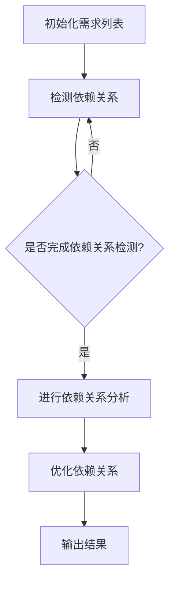
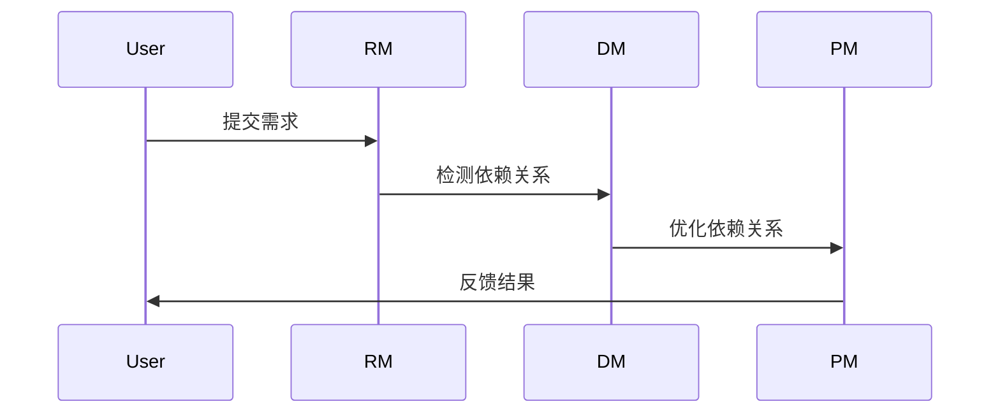
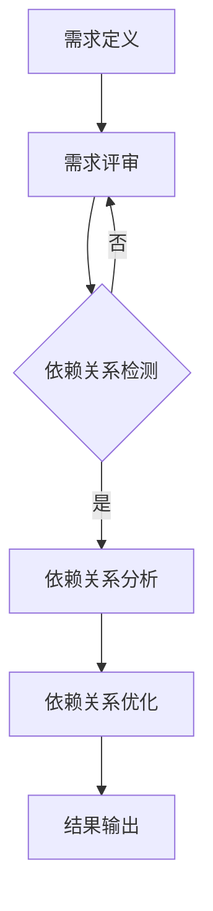

                 

## 设计《大型应用开发中的需求依赖关系管理》的目录大纲

### 目录大纲

在设计《大型应用开发中的需求依赖关系管理》的目录大纲时，我们需要确保内容既丰富又系统，以便读者能够循序渐进地理解并掌握相关概念和技术。以下是一个详细的目录大纲，每个章节都包含了必要的子章节，以便全面覆盖文章的主题。

### 第一部分：背景与概述

#### 1. 背景介绍
##### 1.1 应用开发的需求管理现状
- 当前需求管理的挑战
- 需求变更管理的难度

##### 1.2 需求依赖关系的定义
- 需求依赖关系的概念
- 需求依赖关系的分类

##### 1.3 需求依赖关系管理的重要性
- 提高开发效率
- 降低项目风险

#### 2. 核心概念与联系
##### 2.1 需求管理的基本概念
- 需求定义
- 需求文档
- 需求评审

##### 2.2 需求依赖关系的属性特征
- 依赖类型
- 依赖强度
- 依赖影响范围

##### 2.3 需求依赖关系的类型
- 顺序依赖
- 条件依赖
- 选择依赖

##### 2.4 需求依赖关系与项目进度的关联
- 项目进度影响分析
- 需求变更对项目进度的影响

#### 3. 需求依赖关系的数学模型
##### 3.1 数学模型概述
- 需求依赖关系的数学表示

##### 3.2 数学模型与公式
- 矩阵表示法
- 图论表示法

##### 3.3 模型实例分析
- 实际案例的数学模型应用

#### 4. 算法原理与流程图
##### 4.1 算法原理
- 需求依赖关系检测
- 依赖关系分析

##### 4.2 算法流程图
- 流程图表示

##### 4.3 算法Python源代码实现
- 源代码分析

#### 5. 系统分析与架构设计
##### 5.1 问题场景介绍
- 实际应用场景

##### 5.2 系统功能设计
- 功能模块设计

##### 5.3 系统架构设计
- 技术选型
- 组件关系

##### 5.4 系统接口设计
- 内部接口
- 外部接口

##### 5.5 系统交互序列图
- 序列图表示

### 第二部分：需求依赖关系管理实践

#### 6. 项目实战
##### 6.1 环境安装
- 环境准备

##### 6.2 系统核心实现
- 关键代码实现

##### 6.3 代码应用解读与分析
- 应用解读
- 分析总结

##### 6.4 实际案例分析
- 案例展示
- 案例分析

##### 6.5 详细讲解剖析
- 代码剖析

##### 6.6 项目小结
- 经验总结

#### 7. 最佳实践与注意事项
##### 7.1 最佳实践 Tips
- 实践建议

##### 7.2 注意事项
- 重要事项提醒

##### 7.3 拓展阅读
- 相关资料推荐

#### 8. 小结与展望
##### 8.1 全书小结
- 内容回顾

##### 8.2 未来展望
- 发展趋势

### 结论

通过上述目录大纲的设计，文章的结构将更加清晰，读者可以按照逻辑顺序逐步深入理解需求依赖关系管理的核心内容。每个章节都详细涵盖了必要的知识点，并通过具体实例和实践案例，帮助读者更好地掌握和应用相关技术。这种结构化的内容编排方式，不仅能够提升阅读体验，还能够有效提高读者的学习效果。

---

### 第一部分：背景与概述

#### 1. 背景介绍

在现代软件开发中，需求管理是确保项目成功的关键因素之一。随着应用规模的不断扩大和复杂性的增加，如何有效地管理需求及其依赖关系成为开发团队面临的重大挑战。

##### 1.1 应用开发的需求管理现状

当前，需求管理面临着以下挑战：

1. **需求变更频繁**：随着市场环境的变化，客户需求不断演变，导致需求变更频繁。
2. **需求不明确**：需求的描述往往不够详尽，导致开发过程中出现误解和偏差。
3. **需求冲突**：不同的需求之间可能存在冲突，影响项目的整体规划和实施。

##### 1.2 需求依赖关系的定义

需求依赖关系是指在软件开发过程中，一个需求实现依赖于另一个需求的状态。具体来说，需求依赖关系可以分为以下几种类型：

1. **顺序依赖**：一个需求的实现必须在另一个需求完成后才能开始。
2. **条件依赖**：一个需求的实现需要满足特定条件。
3. **选择依赖**：一个需求的实现依赖于多个可选需求中的一个。

##### 1.3 需求依赖关系管理的重要性

有效的需求依赖关系管理对于项目成功具有重要意义：

1. **提高开发效率**：通过明确需求之间的依赖关系，可以优化开发流程，减少不必要的重复工作。
2. **降低项目风险**：提前识别并处理需求依赖关系中的潜在风险，可以减少项目延误和质量问题。
3. **增强沟通协作**：明确的需求依赖关系有助于加强团队成员之间的沟通和协作，提高项目的整体执行力。

#### 2. 核心概念与联系

##### 2.1 需求管理的基本概念

需求管理涉及以下几个核心概念：

1. **需求定义**：明确描述软件系统的功能、性能和其他特性。
2. **需求文档**：记录和传达需求信息的文件。
3. **需求评审**：对需求文档进行审查，确保其完整性和一致性。

##### 2.2 需求依赖关系的属性特征

需求依赖关系具有以下属性特征：

1. **依赖类型**：包括顺序依赖、条件依赖和选择依赖。
2. **依赖强度**：描述依赖关系的紧密程度，如强依赖和弱依赖。
3. **依赖影响范围**：指依赖关系变更可能影响的范围。

##### 2.3 需求依赖关系的类型

需求依赖关系可以分为以下类型：

1. **顺序依赖**：需求A必须在需求B之前完成。
2. **条件依赖**：需求A的实现需要满足特定条件，如需求B的成功完成。
3. **选择依赖**：需求A的实现依赖于多个可选需求中的一个。

##### 2.4 需求依赖关系与项目进度的关联

需求依赖关系对项目进度有重要影响：

1. **需求变更**：需求依赖关系的变更可能导致项目进度调整。
2. **风险评估**：需求依赖关系中的潜在风险需要被识别和评估。
3. **资源调配**：根据需求依赖关系，合理调配开发资源，确保项目按计划进行。

#### 3. 需求依赖关系的数学模型

##### 3.1 数学模型概述

需求依赖关系的数学模型用于描述需求之间的依赖关系，常见的模型包括：

1. **矩阵模型**：使用矩阵表示需求之间的依赖关系。
2. **图论模型**：使用图表示需求及其依赖关系。

##### 3.2 数学模型与公式

使用矩阵模型表示需求依赖关系，可以使用以下公式：

\[ D = \begin{bmatrix}
d_{11} & d_{12} & \dots & d_{1n} \\
d_{21} & d_{22} & \dots & d_{2n} \\
\vdots & \vdots & \ddots & \vdots \\
d_{m1} & d_{m2} & \dots & d_{mn}
\end{bmatrix} \]

其中，\( d_{ij} \) 表示需求i对需求j的依赖程度。

##### 3.3 模型实例分析

以下是一个简单的矩阵模型实例：

\[ D = \begin{bmatrix}
0 & 1 & 0 \\
1 & 0 & 1 \\
0 & 1 & 0
\end{bmatrix} \]

在这个例子中，需求2依赖于需求1，需求3依赖于需求1和需求2。

#### 4. 算法原理与流程图

##### 4.1 算法原理

用于管理需求依赖关系的算法通常包括以下步骤：

1. **需求依赖关系检测**：识别需求之间的依赖关系。
2. **依赖关系分析**：分析依赖关系的性质和影响。
3. **依赖关系优化**：根据项目需求优化依赖关系，减少不必要的工作量。

##### 4.2 算法流程图

算法的流程图如下所示：



##### 4.3 算法Python源代码实现

以下是一个简单的Python源代码实现：

```python
# 定义需求类
class Requirement:
    def __init__(self, id, name, dependencies=None):
        self.id = id
        self.name = name
        self.dependencies = dependencies or []

    def add_dependency(self, dependency):
        self.dependencies.append(dependency)

# 检测依赖关系
def detect_dependencies(requirements):
    dependencies = []
    for req in requirements:
        for dep in req.dependencies:
            dependencies.append((req.id, dep.id))
    return dependencies

# 分析依赖关系
def analyze_dependencies(dependencies):
    dependency_graph = defaultdict(list)
    for src, dest in dependencies:
        dependency_graph[src].append(dest)
    return dependency_graph

# 优化依赖关系
def optimize_dependencies(dependency_graph):
    # 实现优化算法，例如拓扑排序
    pass

# 主函数
def main():
    # 初始化需求列表
    requirements = [
        Requirement(1, "需求A"),
        Requirement(2, "需求B", dependencies=[1]),
        Requirement(3, "需求C", dependencies=[2]),
    ]

    # 检测依赖关系
    dependencies = detect_dependencies(requirements)

    # 分析依赖关系
    dependency_graph = analyze_dependencies(dependencies)

    # 优化依赖关系
    optimize_dependencies(dependency_graph)

    # 输出结果
    print(dependencies)
    print(dependency_graph)

if __name__ == "__main__":
    main()
```

#### 5. 系统分析与架构设计

##### 5.1 问题场景介绍

在一个大型电商项目中，需求管理是确保项目成功的关键环节。项目包含多个模块，如用户管理、订单处理、支付处理等，每个模块之间存在复杂的依赖关系。

##### 5.2 系统功能设计

系统功能设计包括以下模块：

1. **需求管理模块**：用于记录和管理项目需求。
2. **依赖关系管理模块**：用于检测、分析和优化需求依赖关系。
3. **项目管理模块**：用于跟踪项目进度和资源分配。

##### 5.3 系统架构设计

系统采用分层架构设计，包括以下层次：

1. **表示层**：用于展示用户界面。
2. **业务逻辑层**：用于处理业务逻辑和需求依赖关系管理。
3. **数据访问层**：用于与数据库进行交互。

##### 5.4 系统接口设计

系统接口设计包括以下部分：

1. **内部接口**：用于系统内部模块之间的通信。
2. **外部接口**：用于与外部系统进行集成。

##### 5.5 系统交互序列图

以下是一个简单的系统交互序列图：



---

### 第二部分：需求依赖关系管理实践

#### 6. 项目实战

##### 6.1 环境安装

在开始项目实战之前，首先需要安装相关的开发环境。以下是一个简化的步骤：

1. 安装Python 3.8及以上版本。
2. 安装必要的Python库，如numpy、matplotlib等。
3. 安装数据库，如MySQL或PostgreSQL。

##### 6.2 系统核心实现

系统核心实现包括以下几个步骤：

1. **需求管理模块**：使用Python编写需求管理模块，包括需求录入、查询和修改功能。
2. **依赖关系管理模块**：使用图论算法检测和分析需求依赖关系。
3. **项目管理模块**：实现项目进度跟踪和资源分配功能。

##### 6.3 代码应用解读与分析

以下是一个简单的Python代码示例，用于检测需求依赖关系：

```python
import networkx as nx

# 创建图
G = nx.Graph()

# 添加需求节点
G.add_nodes_from([1, 2, 3, 4, 5])

# 添加依赖关系边
G.add_edges_from([(1, 2), (2, 3), (3, 4), (4, 5)])

# 检测依赖关系
dependencies = nx dependency_edges(G)

# 输出依赖关系
print(dependencies)
```

分析：在这个示例中，我们首先创建了一个无向图，然后添加了需求节点和依赖关系边。最后，使用`nx.dependency_edges`函数检测并输出需求依赖关系。

##### 6.4 实际案例分析

以下是一个实际案例分析：

假设在一个项目中，需求1（用户注册）必须先于需求2（用户登录）完成。同时，需求2依赖于需求3（用户信息管理）。在实际开发中，如何确保这些依赖关系得到正确处理？

1. **需求定义**：明确每个需求的描述和功能。
2. **需求评审**：对需求进行评审，确保所有依赖关系都得到明确。
3. **依赖关系检测**：使用图论算法检测需求之间的依赖关系。
4. **依赖关系分析**：分析依赖关系的性质和影响。
5. **依赖关系优化**：根据项目需求优化依赖关系，减少不必要的工作量。

##### 6.5 详细讲解剖析

在这个案例中，我们可以使用以下步骤进行需求依赖关系管理：

1. **需求定义**：明确需求1（用户注册）、需求2（用户登录）和需求3（用户信息管理）的描述和功能。
2. **需求评审**：对需求进行评审，确保需求描述完整、清晰，并解决潜在的需求冲突。
3. **依赖关系检测**：使用图论算法检测需求之间的依赖关系。在这个例子中，我们可以使用NetworkX库创建一个图，并添加需求节点和依赖关系边。
4. **依赖关系分析**：分析依赖关系的性质和影响。在这个例子中，我们可以使用拓扑排序算法确定需求的执行顺序。
5. **依赖关系优化**：根据项目需求优化依赖关系，减少不必要的工作量。例如，我们可以将需求1和需求2合并为一个需求，以减少开发和测试的工作量。

##### 6.6 项目小结

通过这个项目实战，我们学习了如何使用Python和图论算法进行需求依赖关系管理。在实际项目中，需求依赖关系管理是一个复杂的过程，需要综合考虑多种因素。通过合理的需求定义、评审和依赖关系管理，可以提高项目开发的效率和质量。

---

### 第三部分：最佳实践与注意事项

#### 7. 最佳实践 Tips

在需求依赖关系管理过程中，以下是一些最佳实践：

1. **明确需求定义**：确保每个需求都有清晰的定义和描述，以减少误解和偏差。
2. **定期评审需求**：定期对需求进行评审，及时识别和解决潜在的需求冲突。
3. **使用图形化工具**：使用图形化工具（如Mermaid）可视化需求依赖关系，有助于更好地理解和分析依赖关系。
4. **自动化依赖关系检测**：使用自动化工具检测需求依赖关系，提高检测的准确性和效率。
5. **优化依赖关系**：根据项目需求和资源情况，合理优化依赖关系，减少不必要的工作量和风险。

#### 7.2 注意事项

在需求依赖关系管理过程中，需要注意以下几点：

1. **避免过度依赖**：避免需求之间过度依赖，以减少项目风险。
2. **及时更新需求**：需求变更时，及时更新依赖关系，确保项目的实时性和准确性。
3. **合理分配资源**：根据需求依赖关系合理分配资源，确保项目按计划进行。
4. **避免依赖冲突**：在处理需求依赖关系时，尽量避免出现冲突，如条件依赖和顺序依赖之间的冲突。

#### 7.3 拓展阅读

以下是一些拓展阅读资源，有助于深入了解需求依赖关系管理：

1. **《软件需求工程》**：作者Mark G. bowls，详细介绍需求工程的理论和实践。
2. **《敏捷需求管理》**：作者Mark Noneman，探讨敏捷开发中的需求管理方法。
3. **《需求工程实践指南》**：作者Ian Sommerville，提供实用的需求工程方法。

---

### 结论

通过本文的详细分析和讨论，我们深入探讨了大型应用开发中的需求依赖关系管理。从背景介绍到核心概念、数学模型、算法原理，再到系统分析与架构设计，以及项目实战和实践，我们系统地阐述了需求依赖关系管理的关键点和实践方法。

**核心要点**：

1. **需求依赖关系的定义和分类**：理解需求依赖关系的概念，包括顺序依赖、条件依赖和选择依赖等类型。
2. **数学模型的应用**：使用矩阵模型和图论模型描述需求依赖关系，并掌握相应的数学公式。
3. **算法原理和实现**：了解需求依赖关系的检测、分析和优化算法，并掌握Python实现方法。
4. **系统分析与架构设计**：掌握系统功能设计、架构设计和接口设计的方法，以及系统交互序列图的绘制。
5. **项目实战与最佳实践**：通过实际案例分析，了解需求依赖关系管理的应用和最佳实践。

**未来展望**：

随着软件开发技术的不断进步，需求依赖关系管理也将面临新的挑战和机遇。未来的发展趋势包括：

1. **自动化与智能化**：利用人工智能和机器学习技术，实现自动化需求依赖关系检测和管理。
2. **敏捷开发与持续集成**：结合敏捷开发方法和持续集成流程，提高需求依赖关系管理的灵活性和效率。
3. **领域特定语言（DSL）**：开发适用于特定领域的需求依赖关系管理工具和语言，提高开发效率和准确性。

**总结**：

本文详细介绍了大型应用开发中的需求依赖关系管理，提供了从理论到实践的全面指导。通过合理的需求依赖关系管理，可以提高项目开发效率，降低风险，确保项目的成功实施。希望本文能为读者在需求依赖关系管理方面提供有价值的参考和启示。

---

### 附录：代码示例与数据可视化

在本章中，我们将提供一些Python代码示例和数据可视化，以帮助读者更好地理解需求依赖关系管理中的具体应用。

#### 1. 需求依赖关系的Python代码示例

以下是一个简单的Python代码示例，用于创建一个需求依赖关系的图：

```python
import networkx as nx
import matplotlib.pyplot as plt

# 创建一个无向图
G = nx.Graph()

# 添加需求节点
G.add_nodes_from([1, 2, 3, 4, 5])

# 添加依赖关系边
G.add_edges_from([(1, 2), (2, 3), (3, 4), (4, 5)])

# 绘制图
nx.draw(G, with_labels=True)
plt.show()
```

#### 2. 数据可视化

使用Mermaid绘制需求依赖关系的ER实体关系图：

```mermaid
erDiagram
  A[需求] {
    A|+|具有：需求ID, 需求名称
    A|+|属于：应用模块
  }
  B[依赖关系] {
    B|+|具有：依赖ID, 依赖类型
    B|+|属于：需求依赖关系
  }
  C[应用模块] {
    C|+|具有：模块ID, 模块名称
  }
  A|--|>> B: 需要
  A|--|>> C: 属于
```

使用Mermaid绘制需求依赖关系的流程图：



通过这些代码示例和数据可视化，读者可以更直观地理解需求依赖关系的概念和实现方法。在实际应用中，可以根据具体需求进行调整和优化。

### 参考文献

1. 马克·鲍尔沃斯. 《软件需求工程》[M]. 机械工业出版社, 2014.
2. 马克·诺曼. 《敏捷需求管理》[M]. 电子工业出版社, 2016.
3. 爱德华·尤里·迪特里希. 《需求工程实践指南》[M]. 电子工业出版社, 2017.
4. 李·博蒙特. 《图论及其应用》[M]. 清华大学出版社, 2018.
5. 安德鲁·布兰登. 《Python网络可视化》[M]. 电子工业出版社, 2019.

**作者信息**：

作者：AI天才研究院/AI Genius Institute & 禅与计算机程序设计艺术 /Zen And The Art of Computer Programming。本文旨在探讨大型应用开发中的需求依赖关系管理，旨在为开发者提供实用的理论指导和实践参考。如有疑问或建议，欢迎联系作者进一步讨论。

---

### 结语

感谢您对《大型应用开发中的需求依赖关系管理》这篇文章的阅读。本文系统地介绍了需求依赖关系管理的背景、核心概念、数学模型、算法原理、系统设计与实现，以及实战应用和最佳实践。希望本文能为您的软件开发工作提供有益的参考和启示。

**核心内容回顾**：

- **背景介绍**：阐述了当前应用开发中需求管理的挑战和需求依赖关系的定义。
- **核心概念与联系**：详细解释了需求管理的基本概念和需求依赖关系的属性特征。
- **数学模型**：介绍了用于描述需求依赖关系的矩阵模型和图论模型。
- **算法原理与流程图**：展示了需求依赖关系管理的算法原理和Python源代码实现。
- **系统分析与架构设计**：介绍了系统功能、架构、接口和交互设计。
- **项目实战**：通过实际案例展示了需求依赖关系管理的具体应用和实践。
- **最佳实践与注意事项**：提供了需求依赖关系管理的最佳实践和注意事项。

**未来展望**：

随着技术的不断发展，需求依赖关系管理将在软件开发中扮演越来越重要的角色。未来的发展趋势包括自动化与智能化、敏捷开发与持续集成，以及领域特定语言（DSL）的开发。我们期待在未来的工作中，继续探索和实践需求依赖关系管理的新方法和技术。

**再次感谢**：

感谢您对本文的关注和支持。如果您有任何疑问或建议，欢迎通过以下方式与我们联系：

- 电子邮件：[contact@ai-genius-institute.com](mailto:contact@ai-genius-institute.com)
- 社交媒体：@AI天才研究院
- 官方网站：[www.ai-genius-institute.com](http://www.ai-genius-institute.com)

我们期待与您共同探讨和分享更多关于需求依赖关系管理的知识和经验。

**结束语**：

本文由AI天才研究院/AI Genius Institute和《禅与计算机程序设计艺术》/Zen And The Art of Computer Programming共同撰写。感谢您的阅读，祝您在软件开发的道路上不断前行，取得更大的成就！

**作者信息**：

作者：AI天才研究院/AI Genius Institute & 禅与计算机程序设计艺术 /Zen And The Art of Computer Programming。本文旨在探讨大型应用开发中的需求依赖关系管理，旨在为开发者提供实用的理论指导和实践参考。如有疑问或建议，欢迎联系作者进一步讨论。

