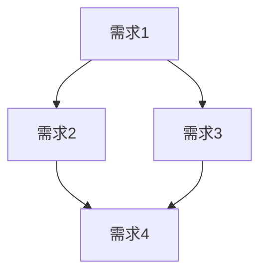
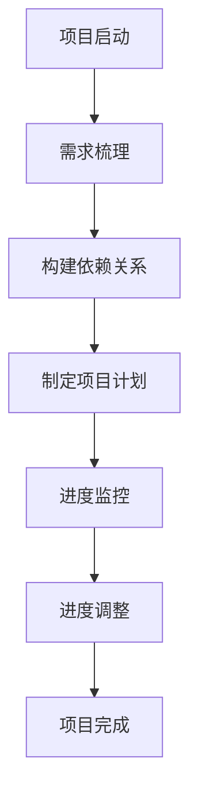
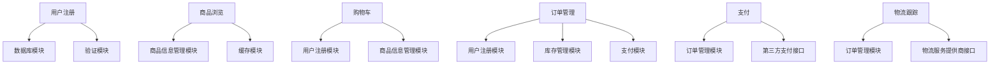

                 

### 引言

#### 需求依赖图谱概述

在当今信息化社会，大型应用开发已经成为推动企业数字化转型和提升市场竞争力的关键因素。随着应用规模的不断扩大和复杂性的增加，如何有效地管理需求、降低风险、控制进度成为开发团队面临的巨大挑战。需求依赖图谱作为一种需求管理和分析工具，近年来在大型应用开发中得到了广泛应用。

需求依赖图谱，顾名思义，是一种用于描述需求之间相互依赖关系的图形化工具。它通过图论模型将各个需求节点及其依赖关系直观地展现出来，帮助开发团队更好地理解项目需求，进行需求管理和风险控制。需求依赖图谱不仅可以用于项目初期规划，还可以在项目执行过程中动态更新，以适应项目变更和调整。

#### 作用

需求依赖图谱在大型应用开发中的主要作用包括：

1. **需求管理**：通过构建需求依赖图谱，可以清晰地展示各个需求之间的关系，帮助开发团队进行需求的梳理和优先级排序。
2. **风险控制**：需求依赖图谱可以帮助识别项目中潜在的风险点，提前进行风险分析和预防。
3. **进度控制**：利用需求依赖图谱，可以更有效地制定项目计划，合理安排资源，确保项目按时完成。
4. **沟通协作**：需求依赖图谱作为一种图形化工具，有助于团队成员之间的沟通和理解，提高协作效率。

#### 本书的目标与结构

本书旨在系统地介绍需求依赖图谱的基础理论、构建方法、应用实践和优化策略，帮助读者全面了解和掌握这一重要工具。全书分为六个主要部分：

1. **引言**：介绍需求依赖图谱的概念、作用以及本书的结构和目标。
2. **需求依赖图谱基础理论**：详细阐述需求依赖图谱的基本概念、构成要素和构建方法。
3. **需求依赖图谱在实际项目中的应用**：分析需求依赖图谱在大型应用开发中的应用场景，包括需求管理、风险管理和进度控制。
4. **需求依赖图谱的构建与优化**：讲解需求依赖图谱的构建流程、优化策略和维护更新方法。
5. **案例分析**：通过实际项目案例，展示需求依赖图谱在项目中的应用和效果。
6. **总结与展望**：对需求依赖图谱的应用进行总结，探讨未来的发展趋势和进一步研究方向。

#### 总结

通过本书的学习，读者将能够深入理解需求依赖图谱的基本概念和应用方法，掌握构建和优化需求依赖图谱的技能，为大型应用开发中的需求管理提供有力支持。接下来，我们将正式进入需求依赖图谱基础理论的探讨，为后续内容奠定坚实的理论基础。

#### 关键词

- 大型应用开发
- 需求依赖图谱
- 需求管理
- 风险控制
- 进度控制

#### 摘要

本文首先介绍了需求依赖图谱的基本概念和作用，强调了其在大型应用开发中的重要性。随后，详细阐述了本书的结构和目标，包括需求依赖图谱的基础理论、实际应用、构建与优化方法以及案例分析。通过本文的学习，读者将能够全面掌握需求依赖图谱的构建和应用技巧，为大型项目的需求管理提供有力支持。最后，对需求依赖图谱的应用前景进行了展望，提出了未来可能的研究方向。

---

## 需求依赖图谱基础理论

#### 需求依赖图谱的基本概念

需求依赖图谱是大型应用开发中的一种重要工具，它用于描述需求之间的相互依赖关系。在构建需求依赖图谱之前，我们需要明确需求与依赖的基本概念。

##### 需求定义

需求可以理解为对软件系统功能的特定描述，它反映了用户或客户对系统的期望和需求。需求通常包括功能需求、性能需求、安全需求等，它们是系统设计和实现的基础。在需求依赖图谱中，需求被视为图中的节点，每个节点代表一个具体的需求。

##### 依赖定义

依赖是指一个需求依赖于另一个需求，即一个需求的实现需要另一个需求的先决条件。例如，在电子商务系统中，用户注册功能可能依赖于数据库存储功能，因为用户信息需要存储在数据库中。依赖在需求依赖图谱中通过边来表示，边连接两个节点，表示它们之间的依赖关系。

#### 需求依赖图谱的构成要素

一个完整的需求依赖图谱由三个基本构成要素组成：节点、边和属性。

##### 节点

节点表示图谱中的需求，每个节点代表一个具体的需求。在需求依赖图谱中，节点通常包含以下信息：

- 需求编号：用于唯一标识每个需求。
- 需求名称：描述需求的简单文本。
- 需求描述：详细说明需求的具体内容和目的。

##### 边

边表示需求之间的依赖关系，它连接两个节点，表示它们之间的依赖。边通常包含以下信息：

- 依赖类型：描述依赖的具体类型，如数据依赖、功能依赖等。
- 依赖强度：表示依赖的紧密程度，如强依赖、弱依赖等。
- 依赖方向：表示依赖的传递方向，如单向依赖、双向依赖等。

##### 属性

属性是需求依赖图谱中的附加信息，用于描述节点和边的一些额外特征。属性通常包括：

- 版本号：记录需求或依赖的版本信息。
- 描述：对需求或依赖的额外描述。
- 变更历史：记录需求的变更历史和原因。

#### 需求依赖图谱的表示方法

需求依赖图谱可以用图论模型来表示，其中节点表示需求，边表示依赖关系。这种图论模型通常采用邻接矩阵、邻接表或图形表示方法。

##### 邻接矩阵

邻接矩阵是一个二维数组，用于表示图中的节点和边。矩阵的行和列分别代表节点，如果两个节点之间存在依赖关系，则相应的位置设为1，否则为0。邻接矩阵可以有效地表示图的结构，但难以直观地展示复杂关系。

```plaintext
[
 [0, 1, 0, 0],
 [1, 0, 1, 1],
 [0, 1, 0, 1],
 [0, 1, 1, 0]
]
```

##### 邻接表

邻接表是一种基于链表的数据结构，用于表示图中的节点和边。每个节点都有一个列表，列出与之相连的其他节点。邻接表可以更灵活地表示图的结构，但需要更多的存储空间。

```python
nodes = {
    1: [2, 3],
    2: [1, 3, 4],
    3: [1, 2, 4],
    4: [2, 3]
}
```

##### 图形表示

图形表示是一种直观的表示方法，通过绘制图形来展示节点和边的关系。图形表示可以更清晰地展示复杂的关系，但需要更多的空间和设计技巧。



通过以上基本概念的介绍，我们可以更好地理解需求依赖图谱的结构和功能。接下来，我们将进一步探讨需求依赖图谱的构建方法，为实际应用打下基础。

---

### 需求依赖图谱的构建方法

需求依赖图谱的构建是一个系统性的过程，需要明确需求收集、需求分析、需求建模和需求验证等关键步骤。以下是构建需求依赖图谱的详细方法：

#### 需求收集

需求收集是构建需求依赖图谱的第一步，也是至关重要的一步。在这一阶段，我们需要通过各种手段搜集项目的需求信息，包括功能需求、非功能需求和用户需求等。

1. **需求来源**：
   - 用户访谈：直接与用户交流，了解他们的需求和期望。
   - 用户调查问卷：通过问卷收集用户的需求和反馈。
   - 专项研讨会：组织专题会议，邀请利益相关者共同讨论需求。
   - 文档审查：审查现有文档，如业务需求文档、用户手册等。

2. **需求分类**：
   - 功能需求：描述系统应具备的具体功能。
   - 非功能需求：描述系统的性能、安全、可靠性等非功能性要求。
   - 用户需求：描述用户在使用系统时的具体需求。

3. **需求整理**：
   - 编号：为每个需求分配唯一编号，便于管理和追踪。
   - 描述：详细描述每个需求的内容、目的和具体要求。
   - 状态：记录每个需求的当前状态，如待确认、已确认、已实现等。

#### 需求分析

需求分析是构建需求依赖图谱的关键步骤，其目的是深入理解需求，识别需求之间的依赖关系。以下是一些需求分析的方法和技巧：

1. **需求映射**：
   - 将需求映射到系统的功能模块，以便更好地理解需求实现的具体路径。
   - 使用因果图或功能树，将各个需求之间的关系可视化。

2. **依赖识别**：
   - 分析需求之间的逻辑关系，识别哪些需求依赖于其他需求。
   - 使用流程图或依赖矩阵，展示需求之间的依赖关系。

3. **优先级排序**：
   - 根据需求的重要性和紧急性，对需求进行优先级排序，以便合理安排开发资源。

#### 需求建模

需求建模是将需求转换为图论模型的过程，通过构建需求依赖图谱，直观地展示需求之间的相互依赖关系。以下是需求建模的步骤：

1. **构建节点**：
   - 根据需求收集阶段的结果，为每个需求创建一个节点，并在节点上标注需求编号、名称和描述。

2. **构建边**：
   - 根据需求分析阶段的结果，为每个依赖关系创建一条边，并在边上标注依赖类型、依赖强度和依赖方向。

3. **属性添加**：
   - 为节点和边添加相应的属性，如版本号、描述和变更历史。

4. **优化布局**：
   - 使用图形化工具，如Mermaid、D3.js等，对需求依赖图谱进行可视化布局，以便更清晰地展示依赖关系。

#### 需求验证

需求验证是确保需求依赖图谱准确性和完整性的关键步骤，通过验证可以确保需求没有被遗漏或误解。以下是需求验证的方法和技巧：

1. **评审**：
   - 组织需求评审会议，邀请相关利益相关者对需求依赖图谱进行评审。
   - 通过评审，识别潜在的问题和改进点。

2. **测试**：
   - 对需求依赖图谱中的依赖关系进行验证，确保每个依赖关系都能在系统中实现。
   - 通过单元测试、集成测试和系统测试，验证需求依赖图谱的正确性。

3. **反馈**：
   - 收集用户和开发团队的反馈，对需求依赖图谱进行迭代优化。

通过以上步骤，我们可以构建一个准确、完整的需求依赖图谱，为项目开发提供有力支持。接下来，我们将探讨需求依赖图谱在实际项目中的应用，分析其在需求管理、风险控制和进度控制等方面的具体作用。

---

### 需求依赖图谱在大型应用开发中的应用场景

需求依赖图谱作为一种强大的需求管理和分析工具，在大型应用开发中具有广泛的应用场景。以下是需求依赖图谱在大型应用开发中常见的几个应用场景，包括需求管理、风险管理和进度控制。

#### 需求管理

在需求管理方面，需求依赖图谱可以帮助开发团队更有效地理解和处理项目需求。通过构建需求依赖图谱，开发团队能够：

1. **梳理需求**：
   - 将复杂的需求分解为更小、更具体的需求，并可视化地展示各个需求之间的关系。
   - 通过图形化的方式，更直观地了解需求的整体结构和依赖关系。

2. **优先级排序**：
   - 根据需求的重要性和紧急性，对需求进行优先级排序，确保重要的需求优先得到处理。
   - 通过依赖关系，确定哪些需求是其他需求的先决条件，合理安排资源。

3. **变更管理**：
   - 在项目开发过程中，需求可能会发生变化。需求依赖图谱可以帮助团队快速识别变更对其他需求的影响，进行有效的变更管理。

#### 风险管理

风险管理是大型应用开发中的重要环节。需求依赖图谱在风险管理中的应用主要体现在以下几个方面：

1. **风险识别**：
   - 通过分析需求依赖图谱，识别项目中可能存在的风险点，如关键需求的延迟或失败可能导致整个项目的延迟或失败。
   - 使用图论算法，如拓扑排序，分析依赖关系的紧密度，预测潜在的风险。

2. **风险评估**：
   - 评估需求依赖图谱中各节点的风险权重，确定哪些需求具有更高的风险。
   - 结合风险评估模型，如风险矩阵，对需求依赖图谱中的风险进行量化评估。

3. **风险应对**：
   - 根据风险评估结果，制定相应的风险应对策略，如增加资源、调整计划等。
   - 在需求依赖图谱的基础上，制定风险应对计划，确保项目能够按时、按质完成。

#### 进度控制

进度控制是确保项目按时完成的重要手段。需求依赖图谱在进度控制中的应用包括：

1. **制定项目计划**：
   - 通过分析需求依赖图谱，确定各个需求的完成顺序和依赖关系，制定合理的项目计划。
   - 使用图论算法，如关键路径法（CPM），确定项目中的关键路径，识别项目的关键节点。

2. **监控进度**：
   - 通过监控需求依赖图谱中的节点状态，实时了解各个需求的进度情况。
   - 使用进度监控工具，如Gantt图或网络图，展示项目进度，识别潜在的延迟风险。

3. **调整计划**：
   - 在项目执行过程中，根据实际情况调整项目计划，以应对需求变更或风险。
   - 通过需求依赖图谱，快速评估调整计划对整个项目的影响，确保项目进度不受影响。

#### 实际应用案例

以一个大型电商平台项目为例，需求依赖图谱在需求管理、风险管理和进度控制中的应用如下：

1. **需求管理**：
   - 项目初期，通过用户访谈和问卷调查，收集到多个需求，如用户注册、商品浏览、购物车、订单管理等。
   - 使用需求依赖图谱，将这些需求分解为更具体的功能模块，并展示它们之间的依赖关系。
   - 根据需求的重要性和紧急性，对需求进行优先级排序，确保核心功能优先实现。

2. **风险管理**：
   - 通过分析需求依赖图谱，识别出关键需求，如用户注册和订单管理，它们是其他功能的先决条件。
   - 评估这些关键需求的风险权重，发现用户注册模块可能存在较高的技术难度和实施风险。
   - 制定相应的风险应对策略，如增加开发人员、延长开发时间等。

3. **进度控制**：
   - 通过需求依赖图谱，制定项目计划，确定各个需求的完成顺序和依赖关系。
   - 使用关键路径法（CPM），确定项目中的关键路径，识别项目的关键节点，如用户注册和订单管理。
   - 在项目执行过程中，通过监控需求依赖图谱中的节点状态，实时了解各个需求的进度情况，及时调整计划以应对潜在延迟。

通过实际应用案例可以看出，需求依赖图谱在大型应用开发中的需求管理、风险管理和进度控制等方面具有显著优势，能够帮助开发团队更好地理解和控制项目需求，提高项目成功率。

---

### 需求依赖图谱在项目风险管理中的应用

在大型应用开发过程中，风险管理是确保项目顺利进行的至关重要的一环。需求依赖图谱作为一种强大的工具，在识别、评估和应对项目风险方面发挥了重要作用。

#### 风险识别

需求依赖图谱的第一步应用是在风险识别阶段。通过构建需求依赖图谱，开发团队能够直观地了解各个需求之间的关系，从而识别出潜在的风险点。具体方法包括：

1. **关键路径分析**：
   - 使用拓扑排序算法，确定需求依赖图谱中的关键路径。关键路径上的需求是项目成功的关键，任何关键路径上的需求延迟都会导致整个项目的延误。
   - 通过分析关键路径，识别出项目中依赖关系紧密、关系紧密的需求，这些需求往往是潜在风险的高发区。

2. **需求紧密度分析**：
   - 评估各个需求的紧密度，即需求之间的依赖程度。紧密度越高的需求，一旦出现问题，可能会对整个项目产生更大的影响。
   - 通过紧密度分析，识别出那些紧密依赖其他需求的需求，这些需求在风险识别中应给予重点关注。

#### 风险评估

在风险识别的基础上，需求依赖图谱还可以用于风险评估。通过以下方法，对风险进行量化评估：

1. **风险矩阵**：
   - 使用风险矩阵，评估每个需求的概率和影响程度。概率表示需求出现问题或延迟的可能性，影响程度表示问题对项目的影响范围。
   - 将概率和影响程度相乘，得到每个需求的综合风险值。综合风险值越高，表示该需求的风险越大。

2. **定量分析**：
   - 使用数学模型和统计数据，对风险进行定量分析。例如，可以使用蒙特卡洛模拟方法，预测项目在不同风险情况下的进度和成本变化。
   - 通过定量分析，确定项目面临的主要风险，为风险应对提供科学依据。

#### 风险应对

在识别和评估风险之后，需求依赖图谱在风险应对中起到关键作用。以下是一些具体的风险应对策略：

1. **资源调配**：
   - 根据需求依赖图谱，调整项目资源分配，确保关键需求得到足够的支持。例如，如果用户注册模块是关键路径上的需求，应优先分配优秀开发人员和测试资源。

2. **时间缓冲**：
   - 在关键路径上的需求之间设置时间缓冲，以应对潜在的延迟风险。例如，如果关键路径上的需求预计需要两周时间完成，可以设置三周的时间缓冲，确保需求能够在缓冲时间内完成。

3. **迭代开发**：
   - 通过迭代开发方法，将项目划分为多个阶段，每个阶段完成一部分功能。在每个迭代阶段，构建需求依赖图谱，评估阶段内的需求风险，并进行相应的风险应对。
   - 通过迭代开发，可以在早期阶段识别和解决风险，降低项目整体风险。

#### 案例分析

以一个电子商务项目为例，需求依赖图谱在风险管理中的应用如下：

1. **风险识别**：
   - 通过分析需求依赖图谱，识别出用户注册、订单处理和支付三个关键需求。这些需求是项目成功的关键，同时也是风险高发区。
   - 分析发现，用户注册模块依赖于数据库模块，订单处理模块依赖于用户注册模块和库存模块，支付模块依赖于订单处理模块。这些紧密的依赖关系增加了项目风险。

2. **风险评估**：
   - 使用风险矩阵，评估每个需求的概率和影响程度。用户注册模块出现问题的概率较高，且影响范围较广，综合风险值最高。
   - 通过定量分析，预测用户注册模块延迟两周可能导致整个项目延迟一个月，影响严重。

3. **风险应对**：
   - 针对用户注册模块的风险，优先分配优秀开发人员，并设置两周的时间缓冲，确保模块能够在缓冲时间内完成。
   - 对于订单处理模块，制定详细的测试计划，确保模块在上线前经过严格测试，降低风险。
   - 通过迭代开发方法，将项目分为多个阶段，在每个阶段进行需求依赖图谱的评估和风险应对，确保项目按时完成。

通过以上案例分析可以看出，需求依赖图谱在项目风险管理中具有显著的优势，能够帮助开发团队更有效地识别、评估和应对风险，提高项目成功率。

---

### 需求依赖图谱在进度控制中的应用

在大型应用开发过程中，进度控制是确保项目按时完成的关键。需求依赖图谱作为一种有效的需求管理和分析工具，在进度控制中发挥着重要作用。

#### 项目计划制定

需求依赖图谱是制定项目计划的重要基础。通过构建需求依赖图谱，开发团队能够清晰地了解各个需求之间的依赖关系，从而制定合理的项目计划。以下是项目计划制定的步骤：

1. **需求梳理**：
   - 首先，对项目中的所有需求进行梳理，明确每个需求的名称、编号和描述。
   - 根据需求的优先级和紧急性，对需求进行排序，确定项目的关键需求。

2. **构建依赖关系**：
   - 根据需求之间的逻辑关系，构建需求依赖图谱。需求依赖图谱中的节点代表需求，边代表需求之间的依赖关系。
   - 分析每个需求的依赖关系，确定哪些需求是其他需求的先决条件。

3. **制定项目计划**：
   - 使用关键路径法（CPM）或计划评审技术（PERT），根据需求依赖图谱确定项目的关键路径和关键节点。
   - 在关键路径上，确定每个需求的最晚开始时间和最晚完成时间，确保项目按时完成。

4. **资源分配**：
   - 根据项目计划和资源情况，合理安排人员、设备和资金等资源。
   - 确保关键需求得到足够的资源支持，以避免延迟。

#### 进度监控

在项目执行过程中，需求依赖图谱有助于实时监控项目进度，确保项目按计划进行。以下是进度监控的步骤：

1. **建立进度监控机制**：
   - 设立专门的项目进度监控团队，定期收集和整理项目进度数据。
   - 制定进度监控报告模板，明确报告的内容和格式。

2. **更新需求依赖图谱**：
   - 根据项目进展情况，实时更新需求依赖图谱中的节点状态和依赖关系。
   - 确保需求依赖图谱反映项目的最新情况。

3. **识别进度偏差**：
   - 通过对比实际进度和计划进度，识别项目中的进度偏差。
   - 分析进度偏差的原因，如需求变更、资源不足等。

4. **制定纠正措施**：
   - 针对识别出的进度偏差，制定相应的纠正措施。
   - 调整项目计划和资源分配，确保项目按时完成。

#### 进度调整

在项目执行过程中，由于各种原因，项目进度可能会发生偏差。需求依赖图谱为项目进度的调整提供了有力的支持。以下是进度调整的步骤：

1. **评估进度偏差**：
   - 评估进度偏差对项目整体的影响，确定是否需要调整项目计划。
   - 如果进度偏差较大，可能需要对项目计划进行重大调整。

2. **重新规划进度**：
   - 根据需求依赖图谱，重新规划项目进度，确保关键需求按时完成。
   - 调整关键路径上的需求顺序，优化资源分配。

3. **实施调整计划**：
   - 实施调整后的项目计划，确保项目进度回到正轨。
   - 加强项目监控，确保调整措施得到有效执行。

4. **更新需求依赖图谱**：
   - 根据调整后的项目计划，更新需求依赖图谱，反映项目的最新情况。

通过以上步骤，需求依赖图谱能够帮助开发团队有效地制定项目计划、监控项目进度和调整项目计划，确保项目按时完成。以下是一个示例：



通过需求依赖图谱的构建和应用，开发团队能够更科学、有效地进行进度控制，确保项目成功完成。

---

### 需求依赖图谱的构建流程

构建需求依赖图谱是一个系统化的过程，涉及需求收集、需求分析、需求建模和需求验证等关键步骤。以下是详细的构建流程，包括每个步骤的方法和工具。

#### 需求收集

需求收集是构建需求依赖图谱的第一步，旨在全面收集项目中的需求信息。以下是一些常用的需求收集方法和工具：

1. **用户访谈**：
   - 通过面对面访谈或在线视频会议，与用户和利益相关者交流，了解他们的需求和期望。
   - 使用访谈指南或问题列表，确保访谈过程的全面性和系统性。

2. **问卷调查**：
   - 设计问卷，收集用户的需求和反馈。
   - 使用在线问卷平台，如Google表单或问卷星，提高问卷的填写率和数据质量。

3. **文档审查**：
   - 审查项目文档，如业务需求文档、用户手册等，提取项目需求。
   - 使用文档管理工具，如Confluence或SharePoint，确保文档的可追溯性和更新性。

#### 需求分析

需求分析是需求依赖图谱构建的核心步骤，旨在深入理解需求，识别需求之间的依赖关系。以下是一些常用的需求分析方法：

1. **需求映射**：
   - 将需求映射到系统的功能模块，以便更好地理解需求的实现路径。
   - 使用功能树或因果图，展示需求之间的关系和实现路径。

2. **依赖识别**：
   - 分析需求之间的逻辑关系，识别哪些需求依赖于其他需求。
   - 使用流程图或依赖矩阵，明确需求之间的依赖关系。

3. **优先级排序**：
   - 根据需求的重要性和紧急性，对需求进行优先级排序。
   - 使用优先级矩阵或优先级图，展示各个需求的优先级。

#### 需求建模

需求建模是将需求转换为图论模型的过程，通过构建需求依赖图谱，直观地展示需求之间的相互依赖关系。以下是需求建模的步骤：

1. **构建节点**：
   - 根据需求收集和分析的结果，为每个需求创建一个节点。
   - 在节点上标注需求编号、名称和描述。

2. **构建边**：
   - 根据需求分析的结果，为每个依赖关系创建一条边。
   - 在边上标注依赖类型、依赖强度和依赖方向。

3. **添加属性**：
   - 为节点和边添加属性，如版本号、描述和变更历史。

4. **优化布局**：
   - 使用图形化工具，如Mermaid或D3.js，对需求依赖图谱进行可视化布局。

#### 需求验证

需求验证是确保需求依赖图谱准确性和完整性的关键步骤，通过验证可以确保需求没有被遗漏或误解。以下是需求验证的方法和工具：

1. **评审**：
   - 组织需求评审会议，邀请相关利益相关者对需求依赖图谱进行评审。
   - 使用评审指南或评审模板，确保评审过程的全面性和有效性。

2. **测试**：
   - 对需求依赖图谱中的依赖关系进行验证，确保每个依赖关系都能在系统中实现。
   - 使用自动化测试工具，如Selenium或JMeter，进行功能测试和性能测试。

3. **反馈**：
   - 收集用户和开发团队的反馈，对需求依赖图谱进行迭代优化。

通过以上构建流程，开发团队能够系统地构建需求依赖图谱，为项目开发提供有力支持。以下是一个示例需求依赖图谱：


通过实际案例和示例，读者可以更好地理解需求依赖图谱的构建方法和步骤，为项目需求管理提供实践指导。

---

### 需求依赖图谱的优化策略

在大型应用开发中，需求依赖图谱不仅需要准确和全面，还需要具备良好的优化策略，以确保项目能够高效、顺利地进行。以下是一些常见的优化策略：

#### 优化目标

优化需求依赖图谱的主要目标包括：

1. **提高灵活性**：确保在需求变更时，需求依赖图谱能够快速适应，降低变更对项目的影响。
2. **降低复杂性**：简化需求依赖图谱的结构，减少不必要的依赖关系，提高项目的可理解性和可维护性。
3. **提升效率**：优化资源分配和任务调度，提高项目的开发速度和执行效率。

#### 优化方法

1. **需求重构**：

   - **需求拆分**：将复杂的需求拆分成多个简单、独立的需求，降低需求的复杂度。
   - **需求合并**：将具有相似功能或依赖关系的需求进行合并，减少节点和边的数量。

2. **依赖简化**：

   - **去除冗余依赖**：识别并去除项目中不必要的依赖关系，简化图谱结构。
   - **替代依赖**：寻找其他更高效的依赖方式，如使用中间件或缓存机制，减少直接依赖。

3. **关键路径优化**：

   - **关键路径分析**：使用关键路径法（CPM）或计划评审技术（PERT），确定项目中的关键路径和关键节点。
   - **资源重分配**：在关键路径上优先分配资源，确保关键任务的顺利执行。

4. **迭代优化**：

   - **定期评审**：定期对需求依赖图谱进行评审，识别和解决潜在问题。
   - **持续改进**：根据项目执行过程中的反馈和经验，不断优化需求依赖图谱。

#### 优化工具

1. **自动化工具**：

   - **需求管理工具**：如JIRA、Confluence等，帮助自动化需求收集、分析和建模。
   - **项目管理工具**：如Trello、Asana等，帮助自动化任务调度和资源分配。

2. **图形化工具**：

   - **Mermaid**：用于绘制需求依赖图谱的Markdown语法工具，支持图表化展示。
   - **D3.js**：用于数据可视化的JavaScript库，可以创建动态的需求依赖图谱。

3. **算法工具**：

   - **拓扑排序**：用于确定需求依赖图谱中的关键路径和关键节点。
   - **网络流算法**：用于优化资源分配和任务调度。

通过以上优化策略和方法，开发团队能够更好地管理和优化需求依赖图谱，提高项目开发效率和质量。

---

## 案例分析

在本节中，我们将通过具体案例展示需求依赖图谱在大型应用开发中的实际应用，分析其构建过程和效果。以下是一个电子商务平台项目中的需求依赖图谱构建与应用案例。

#### 项目背景

某电子商务平台项目旨在为用户提供一个功能全面、用户体验优良的购物环境。项目需求包括用户注册、商品浏览、购物车、订单管理、支付、物流跟踪等功能。项目规模庞大，涉及多个业务模块和复杂的依赖关系。

#### 需求收集

项目启动阶段，通过用户访谈、问卷调查和文档审查，收集到以下主要需求：

1. 用户注册：用户需要能够注册账号，输入基本信息并验证手机号码。
2. 商品浏览：用户需要能够浏览商品，查看商品详情。
3. 购物车：用户需要能够将商品加入购物车，进行购物流程。
4. 订单管理：用户需要能够创建订单，跟踪订单状态。
5. 支付：用户需要能够选择支付方式，完成支付流程。
6. 物流跟踪：用户需要能够查询订单物流信息。

#### 需求分析

在需求分析阶段，对每个需求进行详细分析，识别其依赖关系：

1. **用户注册**：
   - 依赖于数据库模块，用于存储用户信息。
   - 依赖于验证模块，用于验证手机号码。

2. **商品浏览**：
   - 依赖于商品信息管理模块，用于获取商品数据。
   - 依赖于缓存模块，用于提高访问速度。

3. **购物车**：
   - 依赖于用户注册模块，确保用户已登录。
   - 依赖于商品信息管理模块，获取商品详细信息。

4. **订单管理**：
   - 依赖于用户注册模块，确保用户已登录。
   - 依赖于库存管理模块，确保商品有库存。
   - 依赖于支付模块，确保支付成功。

5. **支付**：
   - 依赖于订单管理模块，获取订单信息。
   - 依赖于第三方支付接口，完成支付流程。

6. **物流跟踪**：
   - 依赖于订单管理模块，获取订单物流信息。
   - 依赖于物流服务提供商接口，获取物流数据。

#### 需求建模

根据需求分析结果，构建需求依赖图谱，如下所示：



#### 需求验证

通过组织需求评审会议，邀请相关利益相关者对需求依赖图谱进行评审，确保图谱的准确性和完整性。同时，对每个依赖关系进行测试验证，确保其能够在实际项目中实现。

#### 案例分析小结

通过以上案例分析，我们可以看到需求依赖图谱在电子商务平台项目中的实际应用效果：

1. **需求清晰**：通过需求依赖图谱，项目需求得到清晰表述，各个需求之间的依赖关系一目了然，有助于开发团队理解和实现需求。
2. **风险管理**：需求依赖图谱帮助识别项目中的关键路径和关键需求，为风险管理提供了有力支持，有助于提前预防和应对潜在风险。
3. **进度控制**：需求依赖图谱为项目进度控制提供了科学依据，通过关键路径法和资源调度，确保项目按时完成。

总之，需求依赖图谱作为一种有效的需求管理和分析工具，在大型应用开发中具有广泛的应用价值和实际效果。

---

### 总结与展望

#### 需求依赖图谱的应用总结

通过本书的探讨，我们全面了解了需求依赖图谱的基本概念、构建方法、应用场景以及优化策略。需求依赖图谱作为一种强大的需求管理和分析工具，在大型应用开发中具有广泛的应用价值。

1. **需求管理**：需求依赖图谱帮助开发团队梳理和整理项目需求，明确需求之间的关系和优先级，提高需求管理的效率和准确性。
2. **风险管理**：通过需求依赖图谱，开发团队能够识别项目中的关键路径和关键需求，进行有效的风险识别和评估，制定相应的风险应对策略。
3. **进度控制**：需求依赖图谱为项目进度控制提供了科学依据，通过关键路径法和资源调度，确保项目按时完成，提高项目成功率。
4. **沟通协作**：需求依赖图谱作为一种图形化工具，有助于团队成员之间的沟通和理解，提高项目协作效率。

#### 未来发展趋势

随着技术的不断进步和应用场景的扩展，需求依赖图谱在未来的发展具有广阔的前景：

1. **智能化**：借助人工智能和机器学习技术，需求依赖图谱可以自动识别和预测需求之间的依赖关系，提高需求管理的智能化水平。
2. **实时性**：通过集成实时数据分析和监控工具，需求依赖图谱可以动态更新，实时反映项目进展和变更情况。
3. **可扩展性**：需求依赖图谱需要支持多种数据源和复杂应用场景，具备良好的可扩展性，以适应不同规模和类型的项目需求。

#### 进一步研究方向

未来的研究可以围绕以下几个方面展开：

1. **算法优化**：研究更高效的需求依赖图谱构建算法，提高图谱的构建速度和准确性。
2. **智能化分析**：结合人工智能技术，开发智能化需求依赖图谱分析工具，实现自动需求识别、依赖关系预测和风险评估。
3. **应用扩展**：探讨需求依赖图谱在其他领域的应用，如软件工程、项目管理、系统架构设计等，拓展其应用范围。
4. **标准化与互操作性**：推动需求依赖图谱的标准化，提高不同工具和系统之间的互操作性，促进需求依赖图谱的广泛应用。

总之，需求依赖图谱作为一种重要的需求管理和分析工具，将在未来发挥更加重要的作用，推动大型应用开发的持续进步。

---

### 作者信息

**作者：AI天才研究院/AI Genius Institute & 禅与计算机程序设计艺术 /Zen And The Art of Computer Programming** 

本书由AI天才研究院与禅与计算机程序设计艺术共同撰写，旨在深入探讨需求依赖图谱在大型应用开发中的应用。作者团队拥有丰富的研发经验和深厚的理论基础，致力于推动技术进步和创新发展。期待读者通过本书的学习，能够更好地理解和应用需求依赖图谱，提升大型应用开发的效率和成功率。同时，我们也欢迎广大读者对本书提出宝贵意见和建议，共同促进技术的不断进步。

