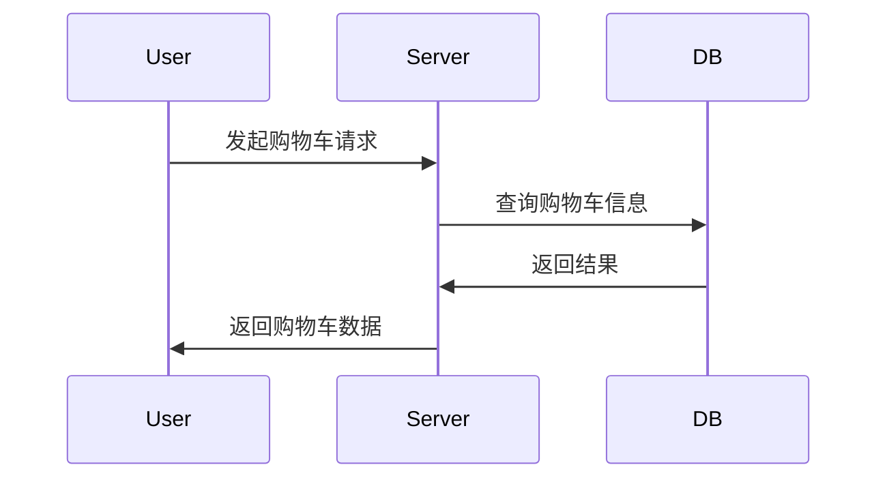
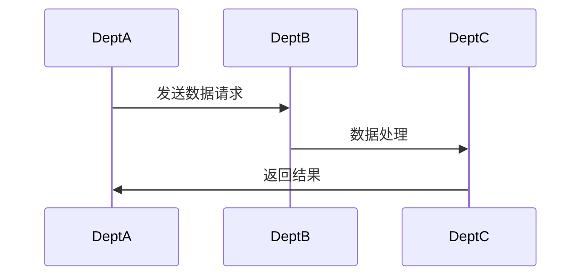

                 

# 大型应用开发中的需求文档版本控制策略

关键词：需求文档、版本控制、大型应用开发、敏捷开发、敏捷迭代、Git、SVN、Mercurial

摘要：
在大型应用开发过程中，需求文档的版本控制是一个关键环节，它不仅关系到项目进度的顺利进行，还影响到最终产品的质量和稳定性。本文将深入探讨需求文档版本控制策略，从背景介绍、核心概念、实施方法和实战案例等多个方面，为读者提供一套全面、实用的版本控制解决方案。

## 1. 背景介绍

### 1.1 问题背景
随着软件工程的不断发展，大型应用的开发变得越来越复杂。在这种背景下，如何高效地管理需求文档版本成为了一个亟待解决的问题。版本控制不仅仅是软件开发中的基础，更是大型应用开发中的关键环节。

### 1.2 问题描述
在大型应用开发过程中，需求变更频繁，文档更新速度快。如果没有有效的版本控制策略，将导致以下问题：
- **文档丢失**：没有版本控制机制，容易导致文档的丢失和混乱。
- **版本混乱**：多个版本的文档并存，难以区分和追踪。
- **协作困难**：团队成员之间的协作受到影响，无法有效同步文档。

### 1.3 问题解决
有效的版本控制策略可以解决上述问题，确保需求文档的版本清晰、可追踪，并提高团队协作效率。以下是一些常见的版本控制方法。

### 1.4 边界与外延
本文主要探讨在大型应用开发中如何进行需求文档的版本控制，不包括通用软件开发的版本控制。此外，本文将重点关注版本控制策略在敏捷开发模式中的应用。

## 2. 核心概念与联系

### 2.1 版本控制概述
版本控制是一种管理文档、代码或其他任何类型文件变化的技术。它可以帮助团队跟踪文件的多个版本，并确保文档的完整性。

### 2.2 版本控制系统
常见的版本控制系统包括Git、SVN和Mercurial。每种系统都有其独特的特点和适用场景。

#### 2.2.1 Git
- **特点**：分布式版本控制系统，可以离线工作，支持并行开发。
- **适用场景**：适合大型项目，特别是需要快速迭代的项目。

#### 2.2.2 SVN
- **特点**：集中式版本控制系统，易于安装和管理。
- **适用场景**：适合中小型项目，特别是需要中央管理的项目。

#### 2.2.3 Mercurial
- **特点**：分布式版本控制系统，简洁易用。
- **适用场景**：适合个人项目和小型团队，特别是不需要复杂权限管理的项目。

### 2.3 概念属性特征对比表格

| 特征         | Git                           | SVN                           | Mercurial                      |
|--------------|-------------------------------|-------------------------------|--------------------------------|
| 分布式/集中式 | 分布式                         | 集中式                         | 分布式                         |
| 并行开发     | 支持，适用于并行开发           | 不支持，适用于串行开发           | 支持，适用于并行开发           |
| 易用性       | 高度易用，但有学习曲线         | 较易使用，学习曲线较低           | 较易使用，学习曲线较低           |
| 适用场景     | 大型项目，快速迭代             | 中小型项目，中央管理             | 个人项目，小型团队             |

### 2.4 ER实体关系图架构
```mermaid
erDiagram
  Class1 ||--|{ Class2 : 拥有 }
  Class1 ||--|{ Class3 : 父类 }
  Class2 ||--|{ Class4 : 子类 }
```

## 3. 实施方法和技巧

### 3.1 选择合适的版本控制系统
根据项目规模、团队协作模式和技术栈选择合适的版本控制系统。例如，对于需要快速迭代的大型项目，Git可能是更好的选择。

### 3.2 版本命名规范
制定统一的版本命名规范，例如使用`major.minor.patch`格式，便于识别和追踪版本。

### 3.3 版本库管理
建立集中或分布式的版本库，确保版本库的安全和稳定性。

### 3.4 版本合并策略
制定清晰的合并策略，避免版本冲突和代码污染。

### 3.5 版本变更记录
详细记录每次版本变更的原因、内容和影响，便于审计和追踪。

## 4. 实战案例

### 4.1 案例一：敏捷开发中的版本控制
在敏捷开发模式中，需求文档的版本控制尤为重要。以下是一个案例：

#### 4.1.1 项目介绍
某电商平台在进行新功能开发时，采用Git进行版本控制。

#### 4.1.2 系统功能设计
- **需求**：添加购物车功能。
- **设计**：使用RESTful API进行数据交互。

#### 4.1.3 系统架构设计


#### 4.1.4 版本合并策略
每次迭代结束时，进行版本合并，确保功能完整。

### 4.2 案例二：多团队协作中的版本控制
在多团队协作中，版本控制更加复杂。以下是一个案例：

#### 4.2.1 项目介绍
某医疗设备公司开发一个新系统，涉及多个部门。

#### 4.2.2 系统功能设计
- **需求**：集成多个子系统，实现数据共享。
- **设计**：采用SVN进行版本控制。

#### 4.2.3 系统架构设计


#### 4.2.4 版本合并策略
- **阶段一**：各部门独立开发，分别提交到SVN。
- **阶段二**：集成阶段，进行版本合并。

## 5. 最佳实践与注意事项

### 5.1 最佳实践
- **定期备份**：定期备份版本库，防止数据丢失。
- **详细记录**：详细记录每次版本变更，便于追踪和审计。
- **团队协作**：建立清晰的权限管理，确保团队成员可以高效协作。

### 5.2 注意事项
- **避免冲突**：尽量避免版本冲突，减少问题出现。
- **合理命名**：使用清晰、合理的版本命名规范。

## 6. 总结

在大型应用开发中，需求文档的版本控制至关重要。本文从背景介绍、核心概念、实施方法和实战案例等多个方面，为读者提供了全面的版本控制策略。通过合理选择版本控制系统、制定规范、详细记录和有效合并，可以确保需求文档的版本清晰、可追踪，提高项目开发效率。

## 7. 拓展阅读

- 《Git Pro》
- 《Pro Git》
- 《Subversion Complete Reference》
- 《Mercurial: The Definitive Guide》

## 8. 作者信息

作者：AI天才研究院/AI Genius Institute & 禅与计算机程序设计艺术 /Zen And The Art of Computer Programming

