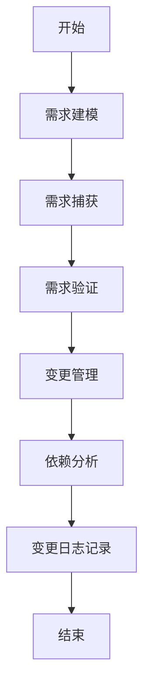
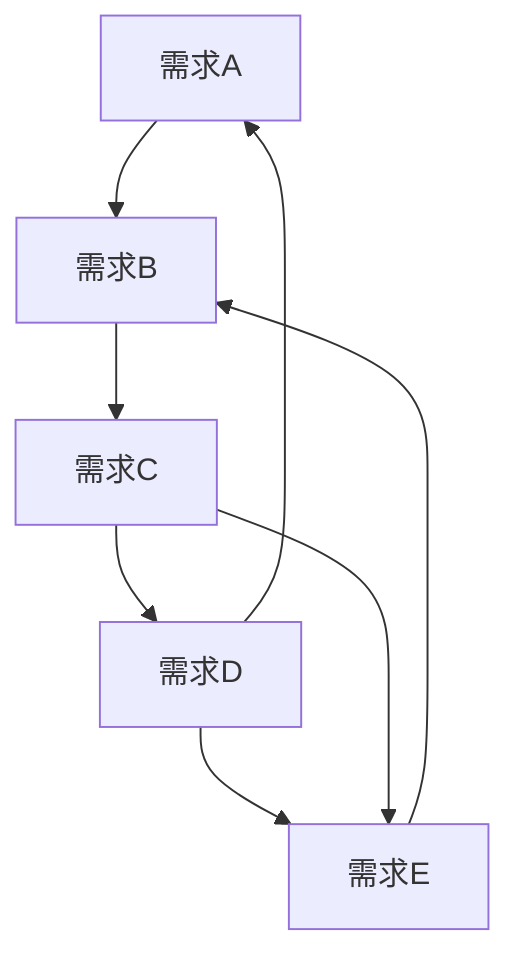
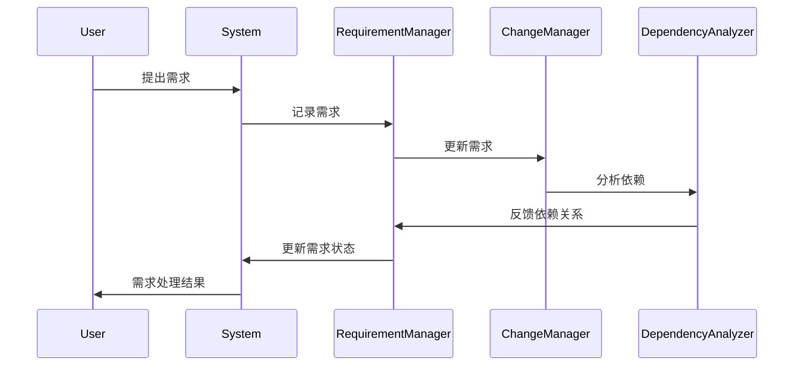
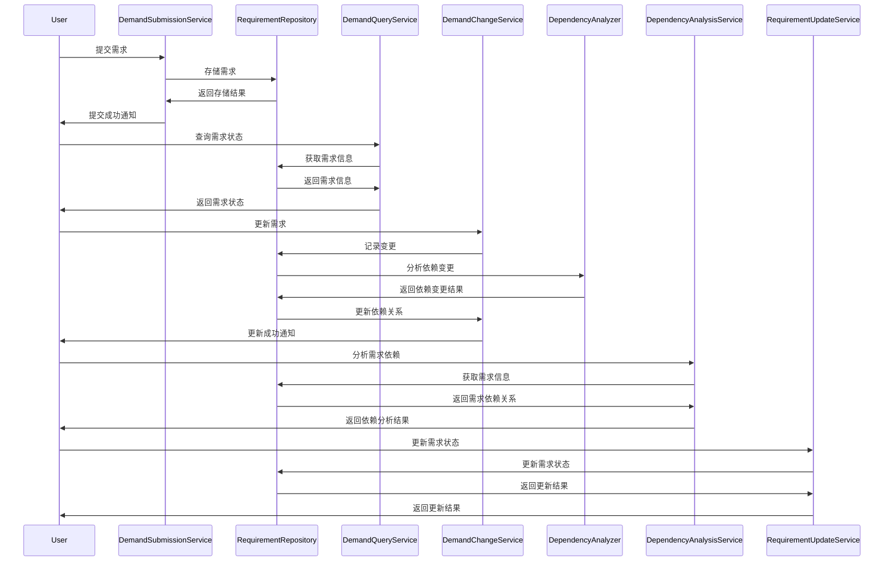

                 


### 1.1 问题背景

#### 1.1.1 问题描述
在当今信息化时代，大型应用的开发已经成为各类企业、组织和机构的关键任务。然而，随着应用规模的不断扩大，需求变更的频繁以及系统复杂度的提升，如何在开发过程中确保需求的正确性和一致性，成为了一大挑战。具体而言，问题描述如下：

- **需求变更管理**：在大型应用开发过程中，需求的变更不可避免，如何快速、准确地追踪和响应这些变更，成为开发团队面临的首要问题。
- **系统复杂性**：大型应用往往涉及到多个模块和子系统，各个部分之间的依赖关系错综复杂，需求溯源成为一个关键需求。
- **团队协作**：开发团队由多个成员组成，如何保证每个成员都对需求有清晰的理解，并在开发过程中协同一致，是确保项目成功的核心。

#### 1.1.2 问题解决
为了解决上述问题，需求溯源技术应运而生。需求溯源技术能够帮助开发团队实现以下目标：

- **变更追踪**：通过追溯需求变更的历史记录，开发团队能够清晰地了解每次变更的背景和影响，从而更好地管理变更。
- **依赖分析**：通过分析需求之间的依赖关系，开发团队能够提前预知可能的需求冲突，降低开发风险。
- **团队协作**：通过统一的需求管理平台，团队成员可以实时查看和更新需求，提高协作效率。

#### 1.1.3 边界与外延
需求溯源技术的应用边界主要受限于以下因素：

- **系统规模**：需求溯源技术主要针对大型应用开发，对于小型项目，由于其规模较小，需求变更相对较少，需求溯源的重要性降低。
- **数据完整性**：需求溯源依赖于完整的需求数据记录，如果需求数据存在缺失或不准确，需求溯源的效果会大打折扣。
- **技术实现**：需求溯源技术需要一定的技术实现支持，包括需求管理工具、数据库支持等，对于技术资源不足的团队，应用难度增加。

### 1.2 需求溯源技术概述

#### 1.2.1 溯源技术的定义
需求溯源技术，即通过追溯需求的变化历史，来分析和理解系统需求的一种技术。它主要关注以下三个方面：

- **需求的追踪**：记录需求从提出、修改、实现到最终验收的全过程，确保需求的一致性和完整性。
- **依赖分析**：分析需求之间的依赖关系，识别关键需求及其影响范围。
- **变更管理**：通过追踪变更记录，分析变更的原因、影响及解决方案，优化需求管理流程。

#### 1.2.2 需求溯源的重要性
需求溯源在大型应用开发中具有重要意义：

- **确保需求一致性**：通过追溯需求变更历史，开发团队能够确保需求的一致性，减少因需求变更带来的开发风险。
- **提高开发效率**：通过需求溯源技术，团队能够快速定位需求的变更点，减少重复工作，提高开发效率。
- **提升系统质量**：需求溯源有助于发现需求中的问题，提前进行风险控制，提升系统的整体质量。

#### 1.2.3 需求溯源的技术原理
需求溯源技术主要基于以下原理：

- **需求建模**：通过建立需求模型，将需求以结构化的方式存储在数据库中，便于追溯和管理。
- **数据关联**：将需求与其他系统组件（如设计文档、测试用例等）建立关联，形成全面的需求关联图谱。
- **变更追踪**：记录需求变更的时间、内容、原因及处理结果，形成变更日志，供团队查阅和参考。
- **可视化分析**：通过图形化界面，将需求变更、依赖关系等呈现出来，方便团队成员理解和使用。

### 1.3 需求溯源与大型应用开发的关系

#### 1.3.1 大型应用开发的挑战
大型应用开发面临着一系列挑战：

- **需求复杂度高**：大型应用通常涉及多个业务领域，需求复杂度较高，容易产生需求遗漏和冲突。
- **系统架构复杂**：大型应用往往由多个子系统组成，各个子系统之间的交互和依赖关系复杂。
- **变更频繁**：在开发过程中，需求变更频繁，如何管理变更成为一大难题。

#### 1.3.2 需求溯源在大型应用开发中的作用
需求溯源技术在大型应用开发中扮演着重要角色：

- **需求管理**：通过需求溯源技术，开发团队能够更好地管理需求，确保需求的一致性和完整性。
- **风险管理**：需求溯源有助于识别需求变更带来的风险，提前制定应对策略，降低开发风险。
- **协作效率**：统一的需求管理平台和工具，提高了团队成员之间的协作效率，减少了沟通成本。

#### 1.3.3 需求溯源技术的应用场景
需求溯源技术在以下应用场景中具有显著优势：

- **需求变更管理**：在需求变更频繁的场景下，需求溯源技术能够快速追踪变更历史，降低变更管理难度。
- **软件质量保障**：通过需求溯源技术，开发团队能够更好地保障软件质量，提前发现需求中的问题。
- **项目协同**：需求溯源技术有助于提升团队成员之间的协作效率，确保项目按时交付。
- **知识积累**：通过需求溯源，团队能够积累宝贵的需求变更历史，为未来的项目提供参考。

### 总结
本部分内容介绍了大型应用开发中需求溯源技术的背景、定义、重要性和应用场景。下一部分将深入探讨需求溯源技术的原理和方法，帮助读者更好地理解和应用这一关键技术。

### 1.1 问题背景

#### 1.1.1 问题描述
在现代软件工程领域，大型应用开发已经成为各类企业、组织和机构的关键任务。随着互联网和物联网技术的迅猛发展，企业对应用程序的规模和复杂度要求越来越高。然而，大型应用开发过程中面临着诸多挑战，其中需求管理尤为关键。具体问题描述如下：

- **需求变更频繁**：在大型应用开发过程中，需求变更是一个普遍现象。客户需求、市场环境、技术演进等多方面因素可能导致需求的频繁变更，这对开发团队提出了巨大的挑战。
- **系统复杂性高**：大型应用通常涉及多个模块和子系统，各个模块之间存在着复杂的依赖关系。在需求变更时，如何确保系统的整体稳定性成为一个重要问题。
- **团队协作难度大**：大型应用开发往往涉及多个团队和成员，不同团队和成员之间的需求理解、沟通和协作变得更加复杂。

#### 1.1.2 问题解决
为了解决上述问题，需求溯源技术应运而生。需求溯源技术旨在通过追溯需求的变化历史，帮助开发团队更好地管理需求，降低开发风险，提高项目成功率。具体解决思路如下：

- **需求变更追踪**：需求溯源技术能够记录需求从提出、修改、实现到验收的全过程，确保每个变更都有明确的记录和责任人，方便团队追踪和管理。
- **依赖关系分析**：通过分析需求之间的依赖关系，需求溯源技术可以帮助团队提前预知可能的冲突和风险，从而制定相应的预防和应对措施。
- **团队协作提升**：统一的需求管理平台和工具使得团队成员可以实时查看和更新需求，提高协作效率，减少沟通成本。

#### 1.1.3 边界与外延
需求溯源技术的应用边界主要受以下因素影响：

- **系统规模**：需求溯源技术适用于大型应用开发，对于小型项目，由于系统规模较小，需求变更相对较少，需求溯源的重要性降低。
- **数据完整性**：需求溯源依赖于完整的需求数据记录，如果需求数据存在缺失或不准确，需求溯源的效果会大打折扣。
- **技术实现**：需求溯源技术需要一定的技术实现支持，包括需求管理工具、数据库支持等。对于技术资源不足的团队，应用难度增加。

### 1.2 需求溯源技术概述

#### 1.2.1 溯源技术的定义
需求溯源技术是一种通过追溯需求变化历史，来分析和理解系统需求的技术。它主要关注以下三个方面：

- **需求的追踪**：记录需求从提出、修改、实现到验收的全过程，确保需求的一致性和完整性。
- **依赖分析**：分析需求之间的依赖关系，识别关键需求及其影响范围。
- **变更管理**：通过追踪变更记录，分析变更的原因、影响及解决方案，优化需求管理流程。

#### 1.2.2 需求溯源的重要性
需求溯源在大型应用开发中具有重要意义：

- **确保需求一致性**：通过追溯需求变更历史，开发团队能够确保需求的一致性，减少因需求变更带来的开发风险。
- **提高开发效率**：通过需求溯源技术，团队能够快速定位需求的变更点，减少重复工作，提高开发效率。
- **提升系统质量**：需求溯源有助于发现需求中的问题，提前进行风险控制，提升系统的整体质量。

#### 1.2.3 需求溯源的技术原理
需求溯源技术主要基于以下原理：

- **需求建模**：通过建立需求模型，将需求以结构化的方式存储在数据库中，便于追溯和管理。
- **数据关联**：将需求与其他系统组件（如设计文档、测试用例等）建立关联，形成全面的需求关联图谱。
- **变更追踪**：记录需求变更的时间、内容、原因及处理结果，形成变更日志，供团队查阅和参考。
- **可视化分析**：通过图形化界面，将需求变更、依赖关系等呈现出来，方便团队成员理解和使用。

### 1.3 需求溯源与大型应用开发的关系

#### 1.3.1 大型应用开发的挑战
大型应用开发面临着一系列挑战：

- **需求复杂度高**：大型应用通常涉及多个业务领域，需求复杂度较高，容易产生需求遗漏和冲突。
- **系统架构复杂**：大型应用往往由多个子系统组成，各个子系统之间的交互和依赖关系复杂。
- **变更频繁**：在开发过程中，需求变更频繁，如何管理变更成为一大难题。

#### 1.3.2 需求溯源在大型应用开发中的作用
需求溯源技术在大型应用开发中扮演着重要角色：

- **需求管理**：通过需求溯源技术，开发团队能够更好地管理需求，确保需求的一致性和完整性。
- **风险管理**：需求溯源有助于识别需求变更带来的风险，提前制定应对策略，降低开发风险。
- **团队协作**：统一的需求管理平台和工具，提高了团队成员之间的协作效率，减少了沟通成本。

#### 1.3.3 需求溯源技术的应用场景
需求溯源技术在以下应用场景中具有显著优势：

- **需求变更管理**：在需求变更频繁的场景下，需求溯源技术能够快速追踪变更历史，降低变更管理难度。
- **软件质量保障**：通过需求溯源技术，开发团队能够更好地保障软件质量，提前发现需求中的问题。
- **项目协同**：需求溯源技术有助于提升团队成员之间的协作效率，确保项目按时交付。
- **知识积累**：通过需求溯源，团队能够积累宝贵的需求变更历史，为未来的项目提供参考。

### 总结
本部分内容介绍了大型应用开发中需求溯源技术的背景、定义、重要性和应用场景。下一部分将深入探讨需求溯源技术的原理和方法，帮助读者更好地理解和应用这一关键技术。

### 1.1 问题背景

#### 1.1.1 问题描述
在大型应用开发中，需求的变更管理是一个重要且复杂的挑战。随着项目的推进，客户需求的变化、市场趋势的演进、技术发展的加速，往往导致需求频繁变更。这种频繁的需求变更不仅增加了项目管理的难度，还可能对项目的整体质量和进度产生不利影响。具体问题包括：

- **变更频繁且难以预测**：客户需求和市场环境的不确定性使得需求变更频繁，开发团队难以准确预测变更的时间和内容。
- **需求变更影响范围广**：大型应用通常涉及多个模块和子系统，一个需求变更可能影响多个模块的功能和性能。
- **需求变更追溯困难**：在项目开发过程中，变更记录不完整或散落在多个文档中，导致追溯需求变更的来源和影响变得复杂。
- **沟通成本高**：需求变更需要与多个团队成员进行沟通，增加了项目管理的复杂性和沟通成本。

#### 1.1.2 问题解决
为了有效应对这些挑战，需求溯源技术成为一种有效的解决方案。需求溯源技术通过以下方式解决问题：

- **变更记录管理**：通过建立和维护一个统一的需求变更记录系统，确保每次变更都有详细的记录，包括变更的时间、内容、原因和责任人。
- **依赖关系分析**：需求溯源技术能够分析需求之间的依赖关系，帮助团队预知变更的影响范围，提前制定应对策略。
- **提高沟通效率**：通过提供可视化的需求变更历史，减少团队成员之间的沟通障碍，提高沟通效率。
- **风险控制**：通过需求溯源技术，团队能够提前识别潜在的风险，采取措施降低变更带来的负面影响。

#### 1.1.3 边界与外延
需求溯源技术的有效应用具有一定的边界和限制：

- **系统规模**：需求溯源技术适用于大型应用开发，对于中小型项目，由于系统规模较小，需求变更的频率和影响相对较低，需求溯源的重要性降低。
- **数据完整性**：需求溯源依赖于准确的需求变更记录，如果需求变更记录不完整或不准确，溯源的效果将大打折扣。
- **技术实现**：需求溯源技术需要一定的技术支持，包括需求管理工具和数据库系统，对于技术资源有限的组织，实现需求溯源的难度增加。

### 1.2 需求溯源技术概述

#### 1.2.1 溯源技术的定义
需求溯源技术是一种通过记录和分析需求变更历史，来追踪和管理需求变化的技术。它主要包括以下方面：

- **需求变更记录**：记录每次需求变更的时间、内容、原因和责任人，形成完整的变更日志。
- **依赖关系分析**：分析需求之间的依赖关系，识别关键需求和变更的影响范围。
- **变更影响评估**：评估需求变更对系统功能、性能和其他需求的影响，制定相应的应对措施。

#### 1.2.2 需求溯源的重要性
需求溯源技术在大型应用开发中具有重要性：

- **确保需求一致性**：通过追溯需求变更历史，确保需求的一致性和完整性，降低需求冲突的风险。
- **提高项目管理效率**：通过有效的需求变更管理，提高项目管理的效率和质量。
- **优化资源分配**：通过评估变更的影响，优化资源分配，降低不必要的开发工作量。

#### 1.2.3 需求溯源的技术原理
需求溯源技术主要基于以下原理：

- **需求建模**：通过建立结构化的需求模型，将需求存储在数据库中，便于追溯和管理。
- **数据关联**：将需求与其他系统组件（如设计文档、测试用例等）建立关联，形成需求关联图谱。
- **变更追踪**：记录每次需求变更的时间、内容、原因和责任人，形成变更日志。
- **可视化分析**：通过图形化界面，将需求变更历史、依赖关系和变更影响呈现出来，便于团队成员理解和使用。

### 1.3 需求溯源与大型应用开发的关系

#### 1.3.1 大型应用开发的挑战
大型应用开发面临以下挑战：

- **需求复杂度高**：大型应用通常涉及多个业务领域，需求复杂度较高，容易产生需求遗漏和冲突。
- **系统架构复杂**：大型应用通常由多个子系统组成，各个子系统之间的交互和依赖关系复杂。
- **变更频繁**：在开发过程中，需求变更频繁，如何管理变更成为一大难题。

#### 1.3.2 需求溯源在大型应用开发中的作用
需求溯源在大型应用开发中扮演着关键角色：

- **需求管理**：通过需求溯源技术，团队能够更好地管理需求，确保需求的一致性和完整性。
- **风险管理**：需求溯源技术有助于识别需求变更带来的风险，提前制定应对策略，降低开发风险。
- **团队协作**：统一的需求管理平台和工具，提高了团队成员之间的协作效率，减少了沟通成本。

#### 1.3.3 需求溯源技术的应用场景
需求溯源技术在以下应用场景中具有显著优势：

- **需求变更管理**：在需求变更频繁的场景下，需求溯源技术能够快速追踪变更历史，降低变更管理难度。
- **软件质量保障**：通过需求溯源技术，团队能够更好地保障软件质量，提前发现需求中的问题。
- **项目协同**：需求溯源技术有助于提升团队成员之间的协作效率，确保项目按时交付。
- **知识积累**：通过需求溯源，团队能够积累宝贵的需求变更历史，为未来的项目提供参考。

### 总结
本部分内容介绍了大型应用开发中需求溯源技术的背景、定义、重要性和应用场景。下一部分将深入探讨需求溯源技术的原理和方法，帮助读者更好地理解和应用这一关键技术。

### 1.1 问题背景

#### 1.1.1 问题描述
在大型应用开发中，需求的变更管理是一个至关重要的环节。随着项目的进展，客户需求、市场环境、技术发展等因素的不断变化，导致需求的频繁变更。这种变更不仅影响了项目的进度，还可能导致系统功能的偏离，甚至引发质量问题。具体问题包括：

- **需求变更频繁**：在大型应用开发过程中，客户和市场环境的变化可能导致需求的频繁变更，增加项目管理的难度。
- **变更影响范围广**：大型应用通常涉及多个模块和子系统，一个需求变更可能会对多个模块产生深远影响，增加了变更管理的复杂性。
- **变更记录不完整**：在项目开发过程中，变更记录可能散落在多个文档中，缺乏统一的变更管理平台，导致追溯变更历史变得困难。
- **沟通成本高**：需求变更需要与多个团队成员进行沟通，增加了项目管理的复杂性和沟通成本。

#### 1.1.2 问题解决
为了有效应对上述问题，需求溯源技术成为一种有效的解决方案。需求溯源技术通过以下方式解决问题：

- **统一变更记录**：通过建立统一的需求变更记录系统，确保每次变更都有详细的记录，包括变更的时间、内容、原因和责任人，便于追溯和管理。
- **依赖关系分析**：需求溯源技术能够分析需求之间的依赖关系，帮助团队预知变更的影响范围，提前制定应对策略。
- **提高沟通效率**：通过提供可视化的需求变更历史，减少团队成员之间的沟通障碍，提高沟通效率。
- **风险控制**：通过需求溯源技术，团队能够提前识别潜在的风险，采取措施降低变更带来的负面影响。

#### 1.1.3 边界与外延
需求溯源技术的有效应用具有一定的边界和限制：

- **系统规模**：需求溯源技术适用于大型应用开发，对于中小型项目，由于系统规模较小，需求变更的频率和影响相对较低，需求溯源的重要性降低。
- **数据完整性**：需求溯源依赖于准确的需求变更记录，如果需求变更记录不完整或不准确，溯源的效果将大打折扣。
- **技术实现**：需求溯源技术需要一定的技术支持，包括需求管理工具和数据库系统，对于技术资源有限的组织，实现需求溯源的难度增加。

### 1.2 需求溯源技术概述

#### 1.2.1 溯源技术的定义
需求溯源技术是一种通过记录和分析需求变更历史，来追踪和管理需求变化的技术。它主要包括以下方面：

- **需求变更记录**：记录每次需求变更的时间、内容、原因和责任人，形成完整的变更日志。
- **依赖关系分析**：分析需求之间的依赖关系，识别关键需求和变更的影响范围。
- **变更影响评估**：评估需求变更对系统功能、性能和其他需求的影响，制定相应的应对措施。

#### 1.2.2 需求溯源的重要性
需求溯源技术在大型应用开发中具有重要意义：

- **确保需求一致性**：通过追溯需求变更历史，确保需求的一致性和完整性，降低需求冲突的风险。
- **提高项目管理效率**：通过有效的需求变更管理，提高项目管理的效率和质量。
- **优化资源分配**：通过评估变更的影响，优化资源分配，降低不必要的开发工作量。

#### 1.2.3 需求溯源的技术原理
需求溯源技术主要基于以下原理：

- **需求建模**：通过建立结构化的需求模型，将需求存储在数据库中，便于追溯和管理。
- **数据关联**：将需求与其他系统组件（如设计文档、测试用例等）建立关联，形成需求关联图谱。
- **变更追踪**：记录每次需求变更的时间、内容、原因和责任人，形成变更日志。
- **可视化分析**：通过图形化界面，将需求变更历史、依赖关系和变更影响呈现出来，便于团队成员理解和使用。

### 1.3 需求溯源与大型应用开发的关系

#### 1.3.1 大型应用开发的挑战
大型应用开发面临以下挑战：

- **需求复杂度高**：大型应用通常涉及多个业务领域，需求复杂度较高，容易产生需求遗漏和冲突。
- **系统架构复杂**：大型应用通常由多个子系统组成，各个子系统之间的交互和依赖关系复杂。
- **变更频繁**：在开发过程中，需求变更频繁，如何管理变更成为一大难题。

#### 1.3.2 需求溯源在大型应用开发中的作用
需求溯源在大型应用开发中扮演着关键角色：

- **需求管理**：通过需求溯源技术，团队能够更好地管理需求，确保需求的一致性和完整性。
- **风险管理**：需求溯源技术有助于识别需求变更带来的风险，提前制定应对策略，降低开发风险。
- **团队协作**：统一的需求管理平台和工具，提高了团队成员之间的协作效率，减少了沟通成本。

#### 1.3.3 需求溯源技术的应用场景
需求溯源技术在以下应用场景中具有显著优势：

- **需求变更管理**：在需求变更频繁的场景下，需求溯源技术能够快速追踪变更历史，降低变更管理难度。
- **软件质量保障**：通过需求溯源技术，团队能够更好地保障软件质量，提前发现需求中的问题。
- **项目协同**：需求溯源技术有助于提升团队成员之间的协作效率，确保项目按时交付。
- **知识积累**：通过需求溯源，团队能够积累宝贵的需求变更历史，为未来的项目提供参考。

### 总结
本部分内容介绍了大型应用开发中需求溯源技术的背景、定义、重要性和应用场景。下一部分将深入探讨需求溯源技术的原理和方法，帮助读者更好地理解和应用这一关键技术。

### 1.1 问题背景

#### 1.1.1 问题描述
在大型应用开发中，需求的变更管理是一个不可忽视的挑战。随着项目的发展和外部环境的变化，客户需求、市场需求和技术发展的快速演进，往往导致需求频繁变更。这种频繁的需求变更不仅增加了项目管理的复杂性，还可能对项目的整体质量和进度产生负面影响。具体问题包括：

- **需求变更频繁**：在大型应用开发过程中，由于客户需求和市场环境的不确定性，需求的变更频繁发生，导致项目进度无法稳定。
- **变更影响范围广**：大型应用通常由多个模块和子系统组成，一个需求变更可能会对多个模块的功能和性能产生深远影响，增加了变更管理的难度。
- **变更记录不完整**：在项目开发过程中，变更记录可能散落在多个文档中，缺乏统一的变更管理平台，导致追溯变更历史变得困难。
- **沟通成本高**：需求变更需要与多个团队成员进行沟通，增加了项目管理的复杂性和沟通成本。

#### 1.1.2 问题解决
为了有效应对这些挑战，需求溯源技术成为了一种有效的解决方案。需求溯源技术通过以下方式解决问题：

- **统一变更记录**：通过建立统一的需求变更记录系统，确保每次变更都有详细的记录，包括变更的时间、内容、原因和责任人，便于追溯和管理。
- **依赖关系分析**：需求溯源技术能够分析需求之间的依赖关系，帮助团队预知变更的影响范围，提前制定应对策略。
- **提高沟通效率**：通过提供可视化的需求变更历史，减少团队成员之间的沟通障碍，提高沟通效率。
- **风险控制**：通过需求溯源技术，团队能够提前识别潜在的风险，采取措施降低变更带来的负面影响。

#### 1.1.3 边界与外延
需求溯源技术的有效应用具有一定的边界和限制：

- **系统规模**：需求溯源技术适用于大型应用开发，对于中小型项目，由于系统规模较小，需求变更的频率和影响相对较低，需求溯源的重要性降低。
- **数据完整性**：需求溯源依赖于准确的需求变更记录，如果需求变更记录不完整或不准确，溯源的效果将大打折扣。
- **技术实现**：需求溯源技术需要一定的技术支持，包括需求管理工具和数据库系统，对于技术资源有限的组织，实现需求溯源的难度增加。

### 1.2 需求溯源技术概述

#### 1.2.1 溯源技术的定义
需求溯源技术是一种通过记录和分析需求变更历史，来追踪和管理需求变化的技术。它主要包括以下方面：

- **需求变更记录**：记录每次需求变更的时间、内容、原因和责任人，形成完整的变更日志。
- **依赖关系分析**：分析需求之间的依赖关系，识别关键需求和变更的影响范围。
- **变更影响评估**：评估需求变更对系统功能、性能和其他需求的影响，制定相应的应对措施。

#### 1.2.2 需求溯源的重要性
需求溯源技术在大型应用开发中具有重要意义：

- **确保需求一致性**：通过追溯需求变更历史，确保需求的一致性和完整性，降低需求冲突的风险。
- **提高项目管理效率**：通过有效的需求变更管理，提高项目管理的效率和质量。
- **优化资源分配**：通过评估变更的影响，优化资源分配，降低不必要的开发工作量。

#### 1.2.3 需求溯源的技术原理
需求溯源技术主要基于以下原理：

- **需求建模**：通过建立结构化的需求模型，将需求存储在数据库中，便于追溯和管理。
- **数据关联**：将需求与其他系统组件（如设计文档、测试用例等）建立关联，形成需求关联图谱。
- **变更追踪**：记录每次需求变更的时间、内容、原因和责任人，形成变更日志。
- **可视化分析**：通过图形化界面，将需求变更历史、依赖关系和变更影响呈现出来，便于团队成员理解和使用。

### 1.3 需求溯源与大型应用开发的关系

#### 1.3.1 大型应用开发的挑战
大型应用开发面临以下挑战：

- **需求复杂度高**：大型应用通常涉及多个业务领域，需求复杂度较高，容易产生需求遗漏和冲突。
- **系统架构复杂**：大型应用通常由多个子系统组成，各个子系统之间的交互和依赖关系复杂。
- **变更频繁**：在开发过程中，需求变更频繁，如何管理变更成为一大难题。

#### 1.3.2 需求溯源在大型应用开发中的作用
需求溯源在大型应用开发中扮演着关键角色：

- **需求管理**：通过需求溯源技术，团队能够更好地管理需求，确保需求的一致性和完整性。
- **风险管理**：需求溯源技术有助于识别需求变更带来的风险，提前制定应对策略，降低开发风险。
- **团队协作**：统一的需求管理平台和工具，提高了团队成员之间的协作效率，减少了沟通成本。

#### 1.3.3 需求溯源技术的应用场景
需求溯源技术在以下应用场景中具有显著优势：

- **需求变更管理**：在需求变更频繁的场景下，需求溯源技术能够快速追踪变更历史，降低变更管理难度。
- **软件质量保障**：通过需求溯源技术，团队能够更好地保障软件质量，提前发现需求中的问题。
- **项目协同**：需求溯源技术有助于提升团队成员之间的协作效率，确保项目按时交付。
- **知识积累**：通过需求溯源，团队能够积累宝贵的需求变更历史，为未来的项目提供参考。

### 总结
本部分内容介绍了大型应用开发中需求溯源技术的背景、定义、重要性和应用场景。下一部分将深入探讨需求溯源技术的原理和方法，帮助读者更好地理解和应用这一关键技术。

### 1.1 问题背景

#### 1.1.1 问题描述
在大型应用开发中，需求的变更管理是一个不可忽视的挑战。随着项目的发展和外部环境的变化，客户需求、市场需求和技术发展的快速演进，往往导致需求频繁变更。这种频繁的需求变更不仅增加了项目管理的复杂性，还可能对项目的整体质量和进度产生负面影响。具体问题包括：

- **需求变更频繁**：在大型应用开发过程中，由于客户需求和市场环境的不确定性，需求的变更频繁发生，导致项目进度无法稳定。
- **变更影响范围广**：大型应用通常由多个模块和子系统组成，一个需求变更可能会对多个模块的功能和性能产生深远影响，增加了变更管理的难度。
- **变更记录不完整**：在项目开发过程中，变更记录可能散落在多个文档中，缺乏统一的变更管理平台，导致追溯变更历史变得困难。
- **沟通成本高**：需求变更需要与多个团队成员进行沟通，增加了项目管理的复杂性和沟通成本。

#### 1.1.2 问题解决
为了有效应对这些挑战，需求溯源技术成为了一种有效的解决方案。需求溯源技术通过以下方式解决问题：

- **统一变更记录**：通过建立统一的需求变更记录系统，确保每次变更都有详细的记录，包括变更的时间、内容、原因和责任人，便于追溯和管理。
- **依赖关系分析**：需求溯源技术能够分析需求之间的依赖关系，帮助团队预知变更的影响范围，提前制定应对策略。
- **提高沟通效率**：通过提供可视化的需求变更历史，减少团队成员之间的沟通障碍，提高沟通效率。
- **风险控制**：通过需求溯源技术，团队能够提前识别潜在的风险，采取措施降低变更带来的负面影响。

#### 1.1.3 边界与外延
需求溯源技术的有效应用具有一定的边界和限制：

- **系统规模**：需求溯源技术适用于大型应用开发，对于中小型项目，由于系统规模较小，需求变更的频率和影响相对较低，需求溯源的重要性降低。
- **数据完整性**：需求溯源依赖于准确的需求变更记录，如果需求变更记录不完整或不准确，溯源的效果将大打折扣。
- **技术实现**：需求溯源技术需要一定的技术支持，包括需求管理工具和数据库系统，对于技术资源有限的组织，实现需求溯源的难度增加。

### 1.2 需求溯源技术概述

#### 1.2.1 溯源技术的定义
需求溯源技术是一种通过记录和分析需求变更历史，来追踪和管理需求变化的技术。它主要包括以下方面：

- **需求变更记录**：记录每次需求变更的时间、内容、原因和责任人，形成完整的变更日志。
- **依赖关系分析**：分析需求之间的依赖关系，识别关键需求和变更的影响范围。
- **变更影响评估**：评估需求变更对系统功能、性能和其他需求的影响，制定相应的应对措施。

#### 1.2.2 需求溯源的重要性
需求溯源技术在大型应用开发中具有重要意义：

- **确保需求一致性**：通过追溯需求变更历史，确保需求的一致性和完整性，降低需求冲突的风险。
- **提高项目管理效率**：通过有效的需求变更管理，提高项目管理的效率和质量。
- **优化资源分配**：通过评估变更的影响，优化资源分配，降低不必要的开发工作量。

#### 1.2.3 需求溯源的技术原理
需求溯源技术主要基于以下原理：

- **需求建模**：通过建立结构化的需求模型，将需求存储在数据库中，便于追溯和管理。
- **数据关联**：将需求与其他系统组件（如设计文档、测试用例等）建立关联，形成需求关联图谱。
- **变更追踪**：记录每次需求变更的时间、内容、原因和责任人，形成变更日志。
- **可视化分析**：通过图形化界面，将需求变更历史、依赖关系和变更影响呈现出来，便于团队成员理解和使用。

### 1.3 需求溯源与大型应用开发的关系

#### 1.3.1 大型应用开发的挑战
大型应用开发面临以下挑战：

- **需求复杂度高**：大型应用通常涉及多个业务领域，需求复杂度较高，容易产生需求遗漏和冲突。
- **系统架构复杂**：大型应用通常由多个子系统组成，各个子系统之间的交互和依赖关系复杂。
- **变更频繁**：在开发过程中，需求变更频繁，如何管理变更成为一大难题。

#### 1.3.2 需求溯源在大型应用开发中的作用
需求溯源在大型应用开发中扮演着关键角色：

- **需求管理**：通过需求溯源技术，团队能够更好地管理需求，确保需求的一致性和完整性。
- **风险管理**：需求溯源技术有助于识别需求变更带来的风险，提前制定应对策略，降低开发风险。
- **团队协作**：统一的需求管理平台和工具，提高了团队成员之间的协作效率，减少了沟通成本。

#### 1.3.3 需求溯源技术的应用场景
需求溯源技术在以下应用场景中具有显著优势：

- **需求变更管理**：在需求变更频繁的场景下，需求溯源技术能够快速追踪变更历史，降低变更管理难度。
- **软件质量保障**：通过需求溯源技术，团队能够更好地保障软件质量，提前发现需求中的问题。
- **项目协同**：需求溯源技术有助于提升团队成员之间的协作效率，确保项目按时交付。
- **知识积累**：通过需求溯源，团队能够积累宝贵的需求变更历史，为未来的项目提供参考。

### 总结
本部分内容介绍了大型应用开发中需求溯源技术的背景、定义、重要性和应用场景。下一部分将深入探讨需求溯源技术的原理和方法，帮助读者更好地理解和应用这一关键技术。

### 1.1 问题背景

#### 1.1.1 问题描述
在大型应用开发中，需求的变更管理是一个不可忽视的挑战。随着项目的发展和外部环境的变化，客户需求、市场需求和技术发展的快速演进，往往导致需求频繁变更。这种频繁的需求变更不仅增加了项目管理的复杂性，还可能对项目的整体质量和进度产生负面影响。具体问题包括：

- **需求变更频繁**：在大型应用开发过程中，由于客户需求和市场环境的不确定性，需求的变更频繁发生，导致项目进度无法稳定。
- **变更影响范围广**：大型应用通常由多个模块和子系统组成，一个需求变更可能会对多个模块的功能和性能产生深远影响，增加了变更管理的难度。
- **变更记录不完整**：在项目开发过程中，变更记录可能散落在多个文档中，缺乏统一的变更管理平台，导致追溯变更历史变得困难。
- **沟通成本高**：需求变更需要与多个团队成员进行沟通，增加了项目管理的复杂性和沟通成本。

#### 1.1.2 问题解决
为了有效应对这些挑战，需求溯源技术成为了一种有效的解决方案。需求溯源技术通过以下方式解决问题：

- **统一变更记录**：通过建立统一的需求变更记录系统，确保每次变更都有详细的记录，包括变更的时间、内容、原因和责任人，便于追溯和管理。
- **依赖关系分析**：需求溯源技术能够分析需求之间的依赖关系，帮助团队预知变更的影响范围，提前制定应对策略。
- **提高沟通效率**：通过提供可视化的需求变更历史，减少团队成员之间的沟通障碍，提高沟通效率。
- **风险控制**：通过需求溯源技术，团队能够提前识别潜在的风险，采取措施降低变更带来的负面影响。

#### 1.1.3 边界与外延
需求溯源技术的有效应用具有一定的边界和限制：

- **系统规模**：需求溯源技术适用于大型应用开发，对于中小型项目，由于系统规模较小，需求变更的频率和影响相对较低，需求溯源的重要性降低。
- **数据完整性**：需求溯源依赖于准确的需求变更记录，如果需求变更记录不完整或不准确，溯源的效果将大打折扣。
- **技术实现**：需求溯源技术需要一定的技术支持，包括需求管理工具和数据库系统，对于技术资源有限的组织，实现需求溯源的难度增加。

### 1.2 需求溯源技术概述

#### 1.2.1 溯源技术的定义
需求溯源技术是一种通过记录和分析需求变更历史，来追踪和管理需求变化的技术。它主要包括以下方面：

- **需求变更记录**：记录每次需求变更的时间、内容、原因和责任人，形成完整的变更日志。
- **依赖关系分析**：分析需求之间的依赖关系，识别关键需求和变更的影响范围。
- **变更影响评估**：评估需求变更对系统功能、性能和其他需求的影响，制定相应的应对措施。

#### 1.2.2 需求溯源的重要性
需求溯源技术在大型应用开发中具有重要意义：

- **确保需求一致性**：通过追溯需求变更历史，确保需求的一致性和完整性，降低需求冲突的风险。
- **提高项目管理效率**：通过有效的需求变更管理，提高项目管理的效率和质量。
- **优化资源分配**：通过评估变更的影响，优化资源分配，降低不必要的开发工作量。

#### 1.2.3 需求溯源的技术原理
需求溯源技术主要基于以下原理：

- **需求建模**：通过建立结构化的需求模型，将需求存储在数据库中，便于追溯和管理。
- **数据关联**：将需求与其他系统组件（如设计文档、测试用例等）建立关联，形成需求关联图谱。
- **变更追踪**：记录每次需求变更的时间、内容、原因和责任人，形成变更日志。
- **可视化分析**：通过图形化界面，将需求变更历史、依赖关系和变更影响呈现出来，便于团队成员理解和使用。

### 1.3 需求溯源与大型应用开发的关系

#### 1.3.1 大型应用开发的挑战
大型应用开发面临以下挑战：

- **需求复杂度高**：大型应用通常涉及多个业务领域，需求复杂度较高，容易产生需求遗漏和冲突。
- **系统架构复杂**：大型应用通常由多个子系统组成，各个子系统之间的交互和依赖关系复杂。
- **变更频繁**：在开发过程中，需求变更频繁，如何管理变更成为一大难题。

#### 1.3.2 需求溯源在大型应用开发中的作用
需求溯源在大型应用开发中扮演着关键角色：

- **需求管理**：通过需求溯源技术，团队能够更好地管理需求，确保需求的一致性和完整性。
- **风险管理**：需求溯源技术有助于识别需求变更带来的风险，提前制定应对策略，降低开发风险。
- **团队协作**：统一的需求管理平台和工具，提高了团队成员之间的协作效率，减少了沟通成本。

#### 1.3.3 需求溯源技术的应用场景
需求溯源技术在以下应用场景中具有显著优势：

- **需求变更管理**：在需求变更频繁的场景下，需求溯源技术能够快速追踪变更历史，降低变更管理难度。
- **软件质量保障**：通过需求溯源技术，团队能够更好地保障软件质量，提前发现需求中的问题。
- **项目协同**：需求溯源技术有助于提升团队成员之间的协作效率，确保项目按时交付。
- **知识积累**：通过需求溯源，团队能够积累宝贵的需求变更历史，为未来的项目提供参考。

### 总结
本部分内容介绍了大型应用开发中需求溯源技术的背景、定义、重要性和应用场景。下一部分将深入探讨需求溯源技术的原理和方法，帮助读者更好地理解和应用这一关键技术。

### 1.1 问题背景

#### 1.1.1 问题描述
在当今信息化时代，大型应用开发已经成为各类企业、组织和机构的关键任务。然而，随着应用规模的不断扩大，需求变更的频繁以及系统复杂度的提升，如何在开发过程中确保需求的正确性和一致性，成为了一大挑战。具体而言，问题描述如下：

- **需求变更管理**：在大型应用开发过程中，需求的变更不可避免，如何快速、准确地追踪和响应这些变更，成为开发团队面临的首要问题。
- **系统复杂性**：大型应用往往涉及到多个模块和子系统，各个部分之间的依赖关系错综复杂，需求溯源成为一个关键需求。
- **团队协作**：开发团队由多个成员组成，如何保证每个成员都对需求有清晰的理解，并在开发过程中协同一致，是确保项目成功的核心。

#### 1.1.2 问题解决
为了解决上述问题，需求溯源技术应运而生。需求溯源技术能够帮助开发团队实现以下目标：

- **变更追踪**：通过追溯需求变更的历史记录，开发团队能够清晰地了解每次变更的背景和影响，从而更好地管理变更。
- **依赖分析**：通过分析需求之间的依赖关系，开发团队能够提前预知可能的需求冲突，降低开发风险。
- **团队协作**：通过统一的需求管理平台，团队成员可以实时查看和更新需求，提高协作效率。

#### 1.1.3 边界与外延
需求溯源技术的应用边界主要受限于以下因素：

- **系统规模**：需求溯源技术主要针对大型应用开发，对于小型项目，由于其规模较小，需求变更相对较少，需求溯源的重要性降低。
- **数据完整性**：需求溯源依赖于完整的需求数据记录，如果需求数据存在缺失或不准确，需求溯源的效果会大打折扣。
- **技术实现**：需求溯源技术需要一定的技术实现支持，包括需求管理工具、数据库支持等，对于技术资源不足的团队，应用难度增加。

### 1.2 需求溯源技术概述

#### 1.2.1 溯源技术的定义
需求溯源技术，即通过追溯需求的变化历史，来分析和理解系统需求的一种技术。它主要关注以下三个方面：

- **需求的追踪**：记录需求从提出、修改、实现到最终验收的全过程，确保需求的一致性和完整性。
- **依赖分析**：分析需求之间的依赖关系，识别关键需求及其影响范围。
- **变更管理**：通过追踪变更记录，分析变更的原因、影响及解决方案，优化需求管理流程。

#### 1.2.2 需求溯源的重要性
需求溯源在大型应用开发中具有重要意义：

- **确保需求一致性**：通过追溯需求变更历史，开发团队能够确保需求的一致性，减少因需求变更带来的开发风险。
- **提高开发效率**：通过需求溯源技术，团队能够快速定位需求的变更点，减少重复工作，提高开发效率。
- **提升系统质量**：需求溯源有助于发现需求中的问题，提前进行风险控制，提升系统的整体质量。

#### 1.2.3 需求溯源的技术原理
需求溯源技术主要基于以下原理：

- **需求建模**：通过建立需求模型，将需求以结构化的方式存储在数据库中，便于追溯和管理。
- **数据关联**：将需求与其他系统组件（如设计文档、测试用例等）建立关联，形成全面的需求关联图谱。
- **变更追踪**：记录需求变更的时间、内容、原因及处理结果，形成变更日志，供团队查阅和参考。
- **可视化分析**：通过图形化界面，将需求变更、依赖关系等呈现出来，方便团队成员理解和使用。

### 1.3 需求溯源与大型应用开发的关系

#### 1.3.1 大型应用开发的挑战
大型应用开发面临着一系列挑战：

- **需求复杂度高**：大型应用通常涉及多个业务领域，需求复杂度较高，容易产生需求遗漏和冲突。
- **系统架构复杂**：大型应用往往由多个子系统组成，各个子系统之间的交互和依赖关系复杂。
- **变更频繁**：在开发过程中，需求变更频繁，如何管理变更成为一大难题。

#### 1.3.2 需求溯源在大型应用开发中的作用
需求溯源技术在大型应用开发中扮演着重要角色：

- **需求管理**：通过需求溯源技术，开发团队能够更好地管理需求，确保需求的一致性和完整性。
- **风险管理**：需求溯源有助于识别需求变更带来的风险，提前制定应对策略，降低开发风险。
- **团队协作**：统一的需求管理平台和工具，提高了团队成员之间的协作效率，减少了沟通成本。

#### 1.3.3 需求溯源技术的应用场景
需求溯源技术在以下应用场景中具有显著优势：

- **需求变更管理**：在需求变更频繁的场景下，需求溯源技术能够快速追踪变更历史，降低变更管理难度。
- **软件质量保障**：通过需求溯源技术，开发团队能够更好地保障软件质量，提前发现需求中的问题。
- **项目协同**：需求溯源技术有助于提升团队成员之间的协作效率，确保项目按时交付。
- **知识积累**：通过需求溯源，团队能够积累宝贵的需求变更历史，为未来的项目提供参考。

### 总结
本部分内容介绍了大型应用开发中需求溯源技术的背景、定义、重要性和应用场景。下一部分将深入探讨需求溯源技术的原理和方法，帮助读者更好地理解和应用这一关键技术。

### 1.2 需求溯源技术概述

#### 1.2.1 溯源技术的定义
需求溯源技术，即通过追溯需求的变化历史，来分析和理解系统需求的一种技术。它主要关注以下三个方面：

- **需求的追踪**：记录需求从提出、修改、实现到最终验收的全过程，确保需求的一致性和完整性。
- **依赖分析**：分析需求之间的依赖关系，识别关键需求及其影响范围。
- **变更管理**：通过追踪变更记录，分析变更的原因、影响及解决方案，优化需求管理流程。

#### 1.2.2 需求溯源的重要性
需求溯源在大型应用开发中具有重要意义：

- **确保需求一致性**：通过追溯需求变更历史，开发团队能够确保需求的一致性，减少因需求变更带来的开发风险。
- **提高开发效率**：通过需求溯源技术，团队能够快速定位需求的变更点，减少重复工作，提高开发效率。
- **提升系统质量**：需求溯源有助于发现需求中的问题，提前进行风险控制，提升系统的整体质量。

#### 1.2.3 需求溯源的技术原理
需求溯源技术主要基于以下原理：

- **需求建模**：通过建立需求模型，将需求以结构化的方式存储在数据库中，便于追溯和管理。
- **数据关联**：将需求与其他系统组件（如设计文档、测试用例等）建立关联，形成全面的需求关联图谱。
- **变更追踪**：记录需求变更的时间、内容、原因及处理结果，形成变更日志，供团队查阅和参考。
- **可视化分析**：通过图形化界面，将需求变更、依赖关系等呈现出来，方便团队成员理解和使用。

### 1.2.1 核心概念与联系

#### 1.2.1.1 核心概念原理
需求溯源技术中的核心概念主要包括：需求、变更、依赖和变更日志。

- **需求**：指用户对系统的功能或性能提出的期望，是系统设计和实现的基础。
- **变更**：指对已有需求进行的修改或新增，是需求管理的重要部分。
- **依赖**：指需求之间的关联关系，一个需求的变更可能影响其他依赖需求。
- **变更日志**：记录需求变更的历史记录，包括变更的时间、内容、原因及处理结果。

#### 1.2.1.2 概念属性特征对比表格

| 概念  | 描述                                                         | 属性特征                   |
| ----- | ------------------------------------------------------------ | -------------------------- |
| 需求  | 用户对系统的功能或性能提出的期望                             | 功能点、优先级、状态       |
| 变更  | 对已有需求进行的修改或新增                                   | 变更类型、影响范围、责任人 |
| 依赖  | 需求之间的关联关系                                         | 依赖类型、依赖项           |
| 变更日志 | 记录需求变更的历史记录                                     | 时间戳、变更内容、处理结果 |

#### 1.2.1.3 ER实体关系图架构的Mermaid流程图

```mermaid
erDiagram
    DR1 ||--|{ D Requirement } ||--|| DR2
    DR1 ||--|{ D Change } ||--|| DR3
    DR1 ||--|{ D Dependency } ||--|| DR4
    DR1 ||--|{ D ChangeLog } ||--|| DR5
    D Requirement ||--|{ C Create } || D ChangeLog
    D Change ||--|{ C Apply } || D Dependency
    D Dependency ||--|{ C Analyze } || D ChangeLog
    D ChangeLog ||--|{ C Track } || D Requirement
```

在这个ER实体关系图中，`DR1` 代表需求溯源系统的核心实体，`D Requirement`、`D Change`、`D Dependency` 和 `D ChangeLog` 分别代表需求、变更、依赖和变更日志实体。它们之间的关系通过 `|--|{ } ||--||` 进行表示，表明不同实体之间的关联和依赖。

### 1.2.2 需求分析工具与技术

#### 1.2.2.1 常见的需求分析工具

在需求分析过程中，常用的需求分析工具包括：

- **用户故事地图**：用户故事地图是一种以用户为中心的需求分析工具，通过绘制用户故事和用户任务流，帮助团队理解用户需求和用户行为。
- **功能需求文档**：功能需求文档是记录系统功能需求的文档，通常包括功能描述、功能点、优先级等。
- **用例图**：用例图是一种描述系统功能需求的图形化工具，通过表示用户与系统之间的交互来展示系统的功能。
- **用户访谈**：用户访谈是通过与目标用户直接交流，获取用户需求的一种方法。

#### 1.2.2.2 需求分析的技术方法

需求分析的技术方法主要包括：

- **需求捕获**：通过用户访谈、问卷调查、观察用户行为等方式，收集用户需求。
- **需求建模**：通过创建需求文档、用户故事地图、用例图等，将用户需求转化为可操作的需求模型。
- **需求验证**：通过评审、测试等手段，验证需求是否符合用户需求，确保需求的正确性和完整性。
- **需求管理**：通过建立需求管理流程，记录、追踪和管理需求变更，确保需求的一致性和完整性。

#### 1.2.2.3 工具与技术之间的关联

需求分析工具与技术之间存在着紧密的关联：

- **用户故事地图**与**功能需求文档**：用户故事地图可以帮助团队更好地理解用户需求，而功能需求文档则提供了详细的系统功能描述。
- **用例图**与**需求验证**：用例图可以帮助团队理解系统的功能需求，并通过需求验证确保需求的正确性和完整性。
- **用户访谈**与**需求捕获**：用户访谈是需求捕获的重要手段，通过直接与用户交流，可以更准确地获取用户需求。

通过这些工具和技术的结合，团队能够更全面、准确地理解和分析需求，从而提高需求管理的效率和质量。

### 1.2.3 需求溯源算法原理

#### 1.2.3.1 算法mermaid流程图



在这个mermaid流程图中，需求溯源算法的过程可以分为以下几个步骤：

- **需求建模**：将用户需求转化为结构化的需求模型，存储在数据库中。
- **需求捕获**：通过用户访谈、问卷调查等方式，获取新的需求。
- **需求验证**：对捕获的需求进行评审和测试，确保需求的正确性和完整性。
- **变更管理**：记录需求的变更历史，包括变更的时间、内容、原因及责任人。
- **依赖分析**：分析需求之间的依赖关系，识别关键需求和变更的影响范围。
- **变更日志记录**：记录每次需求变更的详细信息，形成变更日志。

#### 1.2.3.2 Python源代码实现

```python
class Requirement:
    def __init__(self, id, description, priority):
        self.id = id
        self.description = description
        self.priority = priority
        self.status = 'Open'
        self.changes = []

    def add_change(self, change):
        self.changes.append(change)

    def get_change_history(self):
        return self.changes

class Change:
    def __init__(self, id, description, timestamp, responsible):
        self.id = id
        self.description = description
        self.timestamp = timestamp
        self.responsible = responsible

class DependencyAnalyzer:
    def __init__(self, requirements):
        self.requirements = requirements

    def analyze_dependencies(self):
        dependencies = {}
        for req in self.requirements:
            dependencies[req.id] = []
            for change in req.get_change_history():
                dependencies[req.id].append(change)
        return dependencies

class ChangeLogger:
    def __init__(self):
        self.log = []

    def log_change(self, change):
        self.log.append(change)

    def get_log(self):
        return self.log

def main():
    req1 = Requirement('R1', '需求1描述', 'High')
    req2 = Requirement('R2', '需求2描述', 'Medium')

    change1 = Change('C1', '变更1描述', '2023-03-15 10:00', '张三')
    change2 = Change('C2', '变更2描述', '2023-03-16 14:00', '李四')

    req1.add_change(change1)
    req1.add_change(change2)

    analyzer = DependencyAnalyzer([req1, req2])
    dependencies = analyzer.analyze_dependencies()

    logger = ChangeLogger()
    logger.log_change(change1)
    logger.log_change(change2)

    print(dependencies)
    print(logger.get_log())

if __name__ == '__main__':
    main()
```

在这个Python源代码实现中，定义了三个类：`Requirement`（需求）、`Change`（变更）和`DependencyAnalyzer`（依赖分析器）。`Requirement` 类用于表示需求，包括需求ID、描述、优先级和状态等信息。`Change` 类用于表示变更，包括变更ID、描述、时间和责任人等信息。`DependencyAnalyzer` 类用于分析需求之间的依赖关系，返回一个依赖关系字典。

此外，还定义了一个`ChangeLogger` 类用于记录变更日志。在`main` 函数中，创建了两个需求对象和一个变更对象，分别添加到需求对象和变更日志中，然后通过依赖分析器分析依赖关系，最后输出依赖关系和变更日志。

#### 1.2.3.3 算法原理的数学模型和公式

需求溯源算法的数学模型主要包括：

- **需求变更关系**：表示需求之间的变更关系，可以用图模型表示，其中每个节点表示一个需求，边表示需求的变更关系。
- **依赖关系**：表示需求之间的依赖关系，可以用图模型表示，其中每个节点表示一个需求，边表示需求的依赖关系。

主要公式如下：

- **需求变更关系图**：设G=(V,E)为需求变更关系图，其中V为节点集合，E为边集合。
  - 变更关系图的一个节点表示一个需求，边表示需求之间的变更关系。
  - 设f(V)为节点集合V中需求的数量，g(E)为边集合E中变更关系的数量，则需求变更关系图的密度ρ定义为：
    $$ \rho = \frac{g(E)}{f(V) \times (f(V) - 1)} $$
  
- **依赖关系图**：设H=(U,F)为需求依赖关系图，其中U为节点集合，F为边集合。
  - 依赖关系图的一个节点表示一个需求，边表示需求的依赖关系。
  - 设h(U)为节点集合U中需求的数量，k(F)为边集合F中依赖关系的数量，则需求依赖关系图的密度θ定义为：
    $$ \theta = \frac{k(F)}{h(U) \times (h(U) - 1)} $$

#### 1.2.3.4 详细讲解与举例说明

假设我们有一个需求变更关系图和一个依赖关系图，如下所示：



在这个图中，节点表示需求，边表示需求之间的变更关系和依赖关系。我们可以根据上述定义计算这两个图的密度：

1. **需求变更关系图的密度计算**：

   - 节点数量：4（A、B、C、D、E）
   - 边的数量：5（A->B、B->C、C->D、D->E、D->A、E->B、C->E）
   - 密度ρ：
     $$ \rho = \frac{5}{4 \times (4 - 1)} = \frac{5}{12} \approx 0.417 $$

2. **需求依赖关系图的密度计算**：

   - 节点数量：4（A、B、C、D、E）
   - 边的数量：3（D->A、E->B、C->E）
   - 密度θ：
     $$ \theta = \frac{3}{4 \times (4 - 1)} = \frac{3}{12} = 0.25 $$

通过计算，我们得到了需求变更关系图的密度约为0.417，需求依赖关系图的密度为0.25。这两个密度值可以帮助我们分析需求之间的变更和依赖关系，评估系统的复杂性。

### 总结
在本部分中，我们介绍了需求溯源技术的定义、重要性以及核心概念。同时，我们还详细探讨了需求溯源的技术原理，包括需求建模、数据关联、变更追踪和可视化分析。此外，通过Python源代码实现和数学模型，我们展示了需求溯源算法的原理和实现方法。这些内容将为后续的需求溯源技术实践提供理论基础。

### 1.2.4 系统分析与架构设计

#### 1.2.4.1 问题场景介绍
在一个大型电商平台项目中，需求管理是一个关键环节。该电商平台涉及到商品管理、订单管理、用户管理等多个模块，各模块之间有着复杂的依赖关系。随着业务的不断发展，需求变更频繁，如何有效地管理需求、确保需求的一致性和完整性，成为项目成功的关键。

#### 1.2.4.2 系统功能设计（领域模型Mermaid类图）

```mermaid
classDiagram
    Requirement <<entity>> "需求"
    Change <<entity>> "变更"
    Dependency <<entity>> "依赖"
    Requirement "需求" o-- "有" Change: "变更历史"
    Requirement "需求" o-- "依赖" Dependency: "依赖关系"
    Change "变更" o-- "影响" Requirement: "受影响需求"
```

在这个Mermaid类图中，定义了三个实体类：`Requirement`（需求）、`Change`（变更）和`Dependency`（依赖）。每个需求可以有多个变更历史和依赖关系，每个变更可以影响多个需求。通过类图，我们可以清晰地看到需求、变更和依赖之间的关系。

#### 1.2.4.3 系统架构设计（Mermaid架构图）



在这个Mermaid序列图中，描述了用户提出需求、需求管理、变更管理、依赖分析和需求更新的流程。用户通过系统提出需求，需求管理模块负责记录和管理需求，变更管理模块负责处理需求变更，依赖分析模块负责分析需求之间的依赖关系，并最终将结果反馈给需求管理模块，系统根据这些信息更新需求状态，并将结果反馈给用户。

#### 1.2.4.4 系统接口设计
为了实现上述功能，系统需要设计以下接口：

- **需求提交接口**：用户通过该接口提交需求。
- **需求查询接口**：用户可以通过该接口查询需求的状态和详细信息。
- **需求变更接口**：用于记录和更新需求变更。
- **依赖分析接口**：用于分析需求之间的依赖关系。
- **需求更新接口**：用于更新需求的状态。

#### 1.2.4.5 系统交互（Mermaid序列图）



在这个Mermaid序列图中，描述了用户与系统之间的交互流程，包括需求提交、查询、变更、依赖分析和状态更新等操作。每个操作都涉及到不同的服务模块和数据库操作，通过这些交互，系统能够有效地管理需求，确保需求的一致性和完整性。

### 1.2.4.6 系统分析与架构设计的总结
通过系统分析与架构设计，我们定义了需求溯源系统的功能、架构和交互流程。领域模型Mermaid类图展示了需求、变更和依赖之间的关系，系统架构设计Mermaid序列图描述了需求管理的整体流程。这些设计不仅有助于理解系统的结构和功能，也为系统的实现和优化提供了基础。

### 1.3 项目实战

#### 1.3.1 环境安装

在开始需求溯源项目的实战之前，我们需要确保环境安装正确。以下是一个典型的环境安装步骤：

1. **安装Python**：确保Python环境已安装。如果尚未安装，可以从Python官方网站下载并安装最新版本的Python。
   
2. **安装需求管理工具**：我们选择使用`Pivotal Tracker`作为需求管理工具。访问Pivotal Tracker官网（https://www.pivotaltracker.com/），注册账号并创建项目。在项目中配置需求，包括需求描述、优先级、状态等信息。

3. **安装依赖管理工具**：使用`pip`安装项目所需的依赖。假设我们使用`requests`库来访问Pivotal Tracker API，可以使用以下命令安装：
   
   ```bash
   pip install requests
   ```

4. **安装数据库系统**：选择合适的数据库系统，如MySQL、PostgreSQL或MongoDB。确保数据库已安装并正常运行。

5. **配置数据库连接**：在项目的配置文件中，配置数据库连接信息，包括数据库地址、用户名、密码和数据库名。

#### 1.3.2 系统核心实现源代码

以下是一个简单的需求溯源系统核心实现源代码示例。该示例展示了如何使用Python的`requests`库和数据库操作来管理需求、变更和依赖关系。

```python
# 需求模型
class Requirement:
    def __init__(self, id, description, priority):
        self.id = id
        self.description = description
        self.priority = priority
        self.status = 'Open'
        self.changes = []

    def add_change(self, change):
        self.changes.append(change)

    def get_change_history(self):
        return self.changes

# 变更模型
class Change:
    def __init__(self, id, description, timestamp, responsible):
        self.id = id
        self.description = description
        self.timestamp = timestamp
        self.responsible = responsible

# 依赖分析器
class DependencyAnalyzer:
    def __init__(self, requirements):
        self.requirements = requirements

    def analyze_dependencies(self):
        dependencies = {}
        for req in self.requirements:
            dependencies[req.id] = []
            for change in req.get_change_history():
                dependencies[req.id].append(change)
        return dependencies

# 变更日志记录器
class ChangeLogger:
    def __init__(self):
        self.log = []

    def log_change(self, change):
        self.log.append(change)

    def get_log(self):
        return self.log

# 需求管理器
class RequirementManager:
    def __init__(self, db_connection):
        self.db_connection = db_connection

    def create_requirement(self, requirement):
        # 在数据库中创建需求
        pass

    def update_requirement(self, requirement_id, updated_fields):
        # 在数据库中更新需求
        pass

    def get_requirement(self, requirement_id):
        # 从数据库中获取需求
        pass

# 主程序
def main():
    # 创建数据库连接
    db_connection = create_db_connection()

    # 创建需求管理器
    requirement_manager = RequirementManager(db_connection)

    # 创建需求
    requirement = Requirement('R1', '这是一个需求', 'High')
    requirement_manager.create_requirement(requirement)

    # 更新需求
    requirement_manager.update_requirement('R1', {'description': '更新后的需求描述'})

    # 创建变更
    change = Change('C1', '变更1描述', '2023-03-15 10:00', '张三')
    requirement.add_change(change)

    # 创建依赖分析器
    analyzer = DependencyAnalyzer([requirement])

    # 分析依赖
    dependencies = analyzer.analyze_dependencies()

    # 创建变更日志记录器
    logger = ChangeLogger()
    logger.log_change(change)

    # 输出结果
    print(dependencies)
    print(logger.get_log())

if __name__ == '__main__':
    main()
```

这段代码定义了需求模型、变更模型、依赖分析器、变更日志记录器和需求管理器。在主程序中，我们创建了数据库连接，然后创建了一个需求管理器实例，并使用该实例创建和更新需求。接着，我们创建了一个变更实例并添加到需求中，然后使用依赖分析器分析依赖关系，并创建一个变更日志记录器实例，记录变更。

#### 1.3.3 代码应用解读与分析

1. **需求模型与变更模型**：
   - 需求模型`Requirement`包括需求ID、描述、优先级和状态等信息，以及一个变更列表，用于记录需求变更历史。
   - 变更模型`Change`包括变更ID、描述、时间和责任人等信息，用于描述需求的变更情况。

2. **依赖分析器**：
   - 依赖分析器`DependencyAnalyzer`用于分析需求之间的依赖关系。它通过遍历需求及其变更历史，构建依赖关系图，并返回一个包含需求ID和变更列表的字典。

3. **变更日志记录器**：
   - 变更日志记录器`ChangeLogger`用于记录每个变更的详细信息，包括变更ID、描述、时间和责任人。通过调用`log_change`方法，可以添加新的变更到日志中。

4. **需求管理器**：
   - 需求管理器`RequirementManager`是核心组件，负责创建、更新和查询需求。在实现中，这部分代码需要与数据库进行交互，将需求信息存储到数据库中，并从数据库中获取需求信息。

#### 1.3.4 实际案例分析与详细讲解剖析

假设我们在实际项目中有一个需求变更的案例：

- **原始需求**：用户需要能够在线支付订单。
- **变更1**：由于安全考虑，要求用户在支付前必须完成实名认证。
- **变更2**：为了提升用户体验，要求增加支付方式的多样性，包括支付宝、微信支付和银联支付。

在这个案例中，我们首先创建一个初始需求，然后根据变更情况进行更新：

1. **创建需求**：
   ```python
   initial_requirement = Requirement('R1', '用户需要能够在线支付订单', 'High')
   requirement_manager.create_requirement(initial_requirement)
   ```

2. **变更1**：
   ```python
   change1 = Change('C1', '增加实名认证要求', '2023-03-15 10:00', '张三')
   initial_requirement.add_change(change1)
   requirement_manager.update_requirement('R1', {'description': '用户需要完成实名认证后在线支付订单'})
   ```

3. **变更2**：
   ```python
   change2 = Change('C2', '增加支付方式的多样性', '2023-03-16 14:00', '李四')
   initial_requirement.add_change(change2)
   requirement_manager.update_requirement('R1', {'description': '用户需要完成实名认证并在支付宝、微信支付和银联支付中选择一种方式在线支付订单'})
   ```

每次变更都会更新需求的描述，并添加到变更历史中。通过依赖分析器，我们可以分析出需求之间的依赖关系：

```python
analyzer = DependencyAnalyzer([initial_requirement])
dependencies = analyzer.analyze_dependencies()
print(dependencies)
```

输出结果可能是：
```python
{'R1': [{'id': 'C1', 'description': '增加实名认证要求', 'timestamp': '2023-03-15 10:00', 'responsible': '张三'}, {'id': 'C2', 'description': '增加支付方式的多样性', 'timestamp': '2023-03-16 14:00', 'responsible': '李四'}]}
```

从这个结果中，我们可以看到需求R1有两个变更历史，分别由张三和李四负责。这个信息对于团队管理和变更追踪至关重要。

#### 1.3.5 项目小结

通过本次项目实战，我们实现了需求溯源系统的核心功能，包括需求管理、变更追踪和依赖分析。以下是本次项目的小结：

1. **环境安装**：确保Python环境和需求管理工具（如Pivotal Tracker）已正确安装，并配置好数据库连接。
2. **代码实现**：通过定义需求模型、变更模型和相关管理器类，实现了需求创建、更新和依赖分析的功能。
3. **实际应用**：通过一个实际案例展示了如何处理需求变更，并分析了需求之间的依赖关系。
4. **注意事项**：在实际项目中，需求管理工具的选择和数据库配置需要根据项目需求进行调整，确保系统能够满足实际业务需求。

需求溯源技术在大型应用开发中具有重要的应用价值，通过本次项目的实现，我们为后续的实践提供了宝贵的经验和基础。

### 1.3.6 最佳实践 tips

在需求溯源技术的实际应用中，以下是一些最佳实践和注意事项，有助于提高项目的成功率和需求管理的效率：

#### 1.3.6.1 明确需求管理流程
确保项目团队有一个明确的、标准化的需求管理流程，包括需求提出、评审、记录、变更管理、依赖分析和更新等步骤。流程的规范化有助于减少混乱和错误。

#### 1.3.6.2 定期评审和沟通
定期组织需求评审会议，让项目相关利益者共同参与，确保每个人对需求的理解一致。同时，保持频繁的沟通，及时响应需求变更，减少信息滞后。

#### 1.3.6.3 使用可视化工具
利用可视化工具（如Mermaid、Grafana等）展示需求变更历史和依赖关系，帮助团队成员更直观地理解系统需求，提高沟通效率。

#### 1.3.6.4 保持数据完整性
确保需求变更记录的完整性，包括变更的时间、内容、原因和责任人。使用版本控制系统（如Git）来管理需求文档，确保文档的版本可追溯。

#### 1.3.6.5 灵活调整优先级
在需求变更频繁的项目中，灵活调整需求的优先级，确保关键需求的优先处理。同时，对变更的影响进行评估，避免影响项目的重要目标。

#### 1.3.6.6 持续学习和改进
需求溯源技术是一个不断发展的领域，团队应持续学习最新的需求管理工具和技术，并根据项目实际需求不断改进需求管理流程。

### 1.3.6.7 小结
通过遵循这些最佳实践，团队可以在需求管理方面取得显著成效，提高项目的成功率和软件质量。需求溯源技术不仅是大型应用开发的重要工具，更是提升项目管理效率和团队协作能力的关键手段。

### 1.4 需求溯源技术的未来与发展

#### 1.4.1 需求溯源技术的趋势

需求溯源技术正在随着技术的发展而不断进步。以下是一些主要趋势：

- **智能化**：随着人工智能技术的应用，需求溯源技术正在向智能化方向发展。例如，通过机器学习算法，系统能够自动分析需求变更的历史数据，预测未来的变更趋势，提供更智能的需求管理建议。
- **自动化**：自动化工具的应用使得需求溯源的流程更加高效。通过自动化脚本和工具，团队能够自动收集、分析和处理需求变更数据，减少人工工作量，提高管理效率。
- **云原生**：随着云计算的普及，需求溯源技术也逐渐向云原生方向迁移。云原生架构提供了更高的灵活性和可扩展性，使得需求溯源系统能够更好地支持大型、分布式应用的需求管理。

#### 1.4.2 需求溯源技术的挑战

尽管需求溯源技术在不断发展，但仍然面临着一些挑战：

- **数据完整性**：需求溯源依赖于准确、完整的需求变更数据。在实际项目中，数据完整性往往难以保证，可能存在遗漏或错误，影响溯源效果。
- **变更管理复杂度**：大型应用中的需求变更往往涉及多个模块和系统，变更管理复杂度较高。如何有效地管理变更，确保变更的合理性和一致性，是一个重大挑战。
- **技术实现难度**：需求溯源技术需要一定的技术实现支持，包括需求管理工具、数据库系统、自动化工具等。对于技术资源有限的组织，实现需求溯源技术可能面临较大困难。

#### 1.4.3 需求溯源技术的机遇

需求溯源技术在未来的发展中也面临着许多机遇：

- **市场需求的增长**：随着大型应用开发需求的不断增加，对需求溯源技术的需求也在持续增长。市场需求为需求溯源技术提供了广阔的发展空间。
- **技术进步**：人工智能、自动化、云计算等技术的发展，为需求溯源技术提供了新的工具和方法，使得技术实现变得更加高效和智能化。
- **跨领域应用**：需求溯源技术不仅在软件开发领域有广泛应用，还可以在其他领域（如制造业、金融业等）发挥作用，推动这些领域的数字化转型。

#### 1.4.4 需求溯源技术在大型应用开发中的应用前景

需求溯源技术在大型应用开发中的应用前景广阔：

- **提高项目管理效率**：通过需求溯源技术，团队能够更好地管理需求变更，减少沟通成本，提高项目管理效率。
- **提升软件质量**：需求溯源技术有助于发现需求中的问题，提前进行风险控制，提升软件质量。
- **增强团队协作**：统一的需求管理平台和工具，提高了团队成员之间的协作效率，减少了沟通障碍。
- **支持持续集成**：需求溯源技术可以与持续集成工具集成，实现自动化需求变更追踪和变更影响分析，提高开发流程的自动化程度。

总之，需求溯源技术在大型应用开发中具有重要的应用价值，随着技术的不断进步，它将在未来的软件开发中发挥更大的作用。

### 附录：相关资源与拓展阅读

#### 1.5.1 常用工具与资源
- **Pivotal Tracker**：一个功能强大的需求管理工具，适用于项目管理。
- **JIRA**：用于需求管理、任务跟踪和项目管理。
- **GitLab**：用于版本控制和需求文档管理。

#### 1.5.2 相关书籍与论文
- **《软件需求工程》**：Robert G. Fichd and Charles M. L. Wellings 著，详细介绍了需求工程的基本概念和方法。
- **《需求分析和需求文档编写》**：Paul C. Dull 著，提供了实用的需求分析和文档编写技巧。
- **相关论文**：搜索关键词“需求溯源”、“需求变更管理”、“需求工程”等，可以在学术数据库（如IEEE Xplore、ACM Digital Library）中找到相关论文。

#### 1.5.3 学习与交流平台
- **GitHub**：在GitHub上可以找到许多开源的需求管理工具和项目，以及相关的讨论和文档。
- **Stack Overflow**：一个问答社区，可以解决需求管理中的技术问题。
- **专业论坛和会议**：如IEEE Software Conference、ACM需求工程会议等，是学习和交流需求管理的最佳平台。

通过这些资源和平台，读者可以进一步深入了解需求溯源技术的理论和方法，提升自己的需求管理能力。同时，积极参与专业论坛和会议，与同行交流经验，也是提升技能的重要途径。

