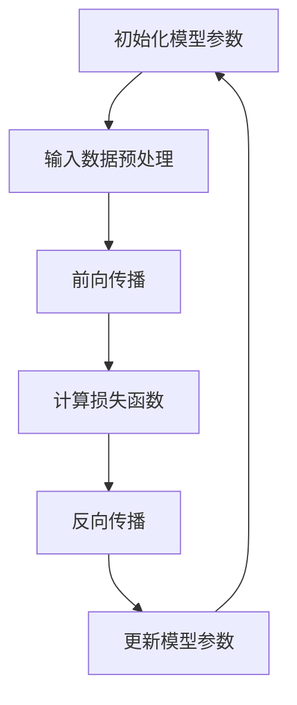
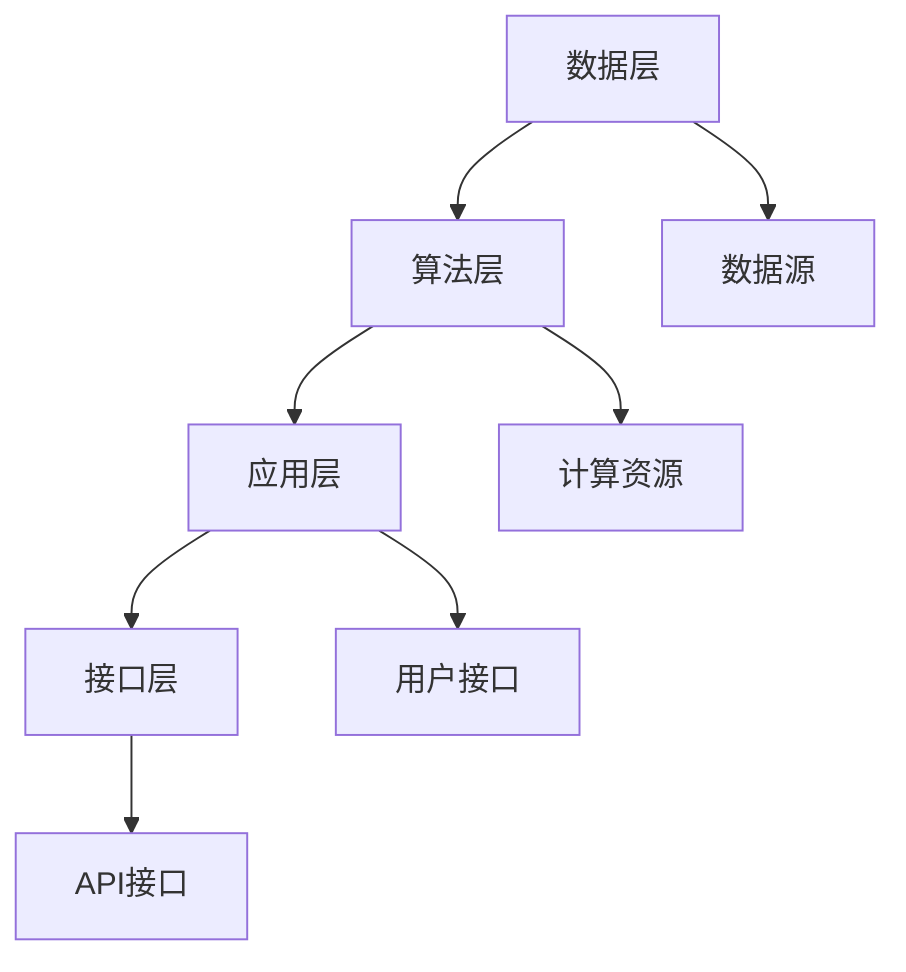
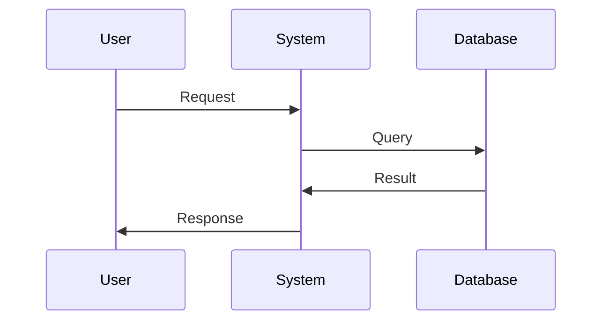

                 

# 大模型上下文理解深度评估：LLM设计的复杂场景

## 关键词

- 大模型（Large Language Model）
- 上下文理解（Contextual Understanding）
- 深度评估（Deep Evaluation）
- LLM设计（LLM Design）
- 复杂场景（Complex Scenarios）

## 摘要

本文深入探讨了大型语言模型（LLM）的上下文理解能力及其深度评估的复杂性。首先，我们回顾了大模型和上下文理解的基本概念，并阐明了评估这些能力的需求和挑战。接着，我们详细分析了大模型的原理和上下文理解的原理，并通过比较不同的大模型类型和上下文理解技术，揭示了其核心特征。随后，我们通过ER实体关系图，进一步理解了大模型和上下文理解的结构。在算法原理与数学模型部分，我们介绍了大模型训练算法及其数学基础，并通过一个文本分类任务进行了举例说明。最后，我们探讨了在复杂场景下，如何进行系统分析与架构设计，以及如何通过实际案例来验证和优化大模型的上下文理解能力。本文旨在为从业者提供一份全面、系统的指南，以应对当前LLM设计中面临的复杂挑战。

### 第一部分：背景与核心概念

#### 第1章 引言

##### 1.1 问题背景

大模型与上下文理解的重要性

近年来，随着人工智能技术的迅猛发展，大型语言模型（Large Language Models，简称LLM）如BERT、GPT等，因其强大的文本生成和处理能力，成为了自然语言处理（Natural Language Processing，简称NLP）领域的明星。这些大模型能够在各种复杂的任务中，包括文本生成、文本分类、问答系统等，表现出色。然而，这些模型的核心能力之一——上下文理解，却并未得到充分的关注和评估。

深度评估的需求与挑战

大模型的上下文理解能力决定了其在具体应用中的性能。为了确保这些模型能够满足实际需求，对其进行深度评估变得至关重要。深度评估不仅涉及到模型在标准数据集上的表现，还包括在实际应用中的表现，以及在不同场景下的适应能力。

然而，深度评估面临着一系列挑战：

1. **多样性场景**：实际应用场景的多样性使得评估标准难以统一。
2. **数据质量**：评估数据的质量和多样性直接影响评估结果的准确性。
3. **评估方法**：如何设计出有效的评估方法，以全面、准确地评估上下文理解能力，是一个亟待解决的问题。
4. **模型复杂性**：大模型的结构复杂，使得评估过程更加复杂。

##### 1.2 问题描述

大模型上下文理解的核心要素

大模型的上下文理解能力主要体现在以下几个方面：

1. **语义理解**：模型需要能够理解文本的语义，包括词汇的含义、句子的结构和上下文的关系。
2. **上下文感知**：模型需要能够根据上下文信息，动态调整其响应，避免产生不相关的或错误的回答。
3. **连贯性**：模型生成的文本需要与上下文保持连贯，避免出现语义跳跃或逻辑矛盾。

深度评估的目标与方法

深度评估的目标是全面、准确地评估大模型的上下文理解能力。具体来说，目标包括：

1. **准确性**：模型在上下文理解任务中的表现是否准确。
2. **鲁棒性**：模型在不同场景下的适应能力。
3. **泛化性**：模型在不同数据集上的表现是否一致。

评估方法主要包括：

1. **标准数据集**：使用标准的数据集，如GLUE、SuperGLUE等，进行基准测试。
2. **自定义任务**：设计针对特定应用场景的任务，评估模型在该场景下的表现。
3. **综合评估**：结合多种评估指标，全面评估模型的上下文理解能力。

##### 1.3 问题解决

大模型上下文理解的基本原理

大模型的上下文理解能力主要源于其复杂的神经网络结构和大规模的预训练数据。具体来说，包括以下几个关键点：

1. **多层神经网络**：大模型通常包含多层神经网络，能够捕捉到文本中的复杂关系。
2. **注意力机制**：注意力机制能够帮助模型更好地关注上下文信息，提高理解能力。
3. **预训练与微调**：通过大规模的预训练数据，模型能够学习到大量的语言知识，然后通过微调，使其适应特定任务。

深度评估的关键技术

深度评估的关键技术包括：

1. **自动评估**：利用自动化工具，如评估脚本，对模型在标准数据集上的表现进行评估。
2. **人工评估**：通过专家评估，对模型在自定义任务中的表现进行评估，以补充自动化评估的不足。
3. **多模态评估**：结合文本、图像等多种数据类型，对模型的多模态上下文理解能力进行评估。

##### 1.4 边界与外延

大模型的适用范围

大模型虽然在许多NLP任务中表现出色，但其适用范围也存在一定的限制。例如：

1. **领域限制**：某些模型可能更适合通用语言任务，而在特定领域的任务中表现较差。
2. **资源限制**：大模型的训练和部署需要大量的计算资源和时间。

上下文理解的边界条件

上下文理解的边界条件包括：

1. **数据质量**：上下文数据的质量直接影响模型的理解能力。
2. **噪声与干扰**：模型需要能够处理噪声和干扰，保持上下文的连贯性和准确性。
3. **动态变化**：模型需要能够适应动态变化的上下文，保持持续的上下文理解能力。

##### 1.5 概念结构与核心要素

大模型的基本构成

大模型通常由以下几个部分组成：

1. **输入层**：接收文本输入，进行预处理。
2. **隐藏层**：通过多层神经网络，捕捉文本中的复杂关系。
3. **输出层**：生成文本输出，实现上下文理解。

上下文理解的关键组件

上下文理解的关键组件包括：

1. **语义理解模块**：负责对文本进行语义分析，理解词汇和句子的含义。
2. **上下文感知模块**：负责根据上下文信息，动态调整模型的响应。
3. **连贯性检查模块**：负责检查模型生成的文本是否与上下文保持连贯，避免逻辑错误。

### 第二部分：核心概念原理

#### 第2章 核心概念原理

##### 2.1 大模型原理

大模型的定义

大模型，通常指具有数十亿甚至数万亿参数的深度神经网络模型，如GPT-3、BERT等。这些模型通过在大规模语料库上进行预训练，学习到丰富的语言知识和模式，从而在自然语言处理任务中表现出色。

大模型的架构

大模型的架构通常包括以下几个部分：

1. **输入层**：接收文本输入，进行预处理，如分词、编码等。
2. **隐藏层**：通过多层神经网络，捕捉文本中的复杂关系，如句法、语义等。
3. **输出层**：生成文本输出，实现上下文理解。

大模型的训练

大模型的训练过程包括预训练和微调两个阶段：

1. **预训练**：在大规模语料库上进行无监督训练，学习到语言的基础知识和模式。
2. **微调**：在特定任务的数据集上进行监督训练，调整模型参数，使其适应特定任务。

##### 2.2 上下文理解原理

上下文理解的定义

上下文理解是指模型在特定上下文中，对输入文本的理解和生成能力。它不仅包括对词汇和句子的理解，还包括对上下文关系的把握和动态调整。

上下文理解的关键技术

上下文理解的关键技术包括：

1. **注意力机制**：通过注意力机制，模型能够关注重要的上下文信息，提高理解能力。
2. **转移学习**：通过在多个任务上的迁移学习，模型能够利用已有知识，提高上下文理解能力。
3. **多模态学习**：结合文本、图像等多种数据类型，模型能够更全面地理解上下文。

上下文理解的挑战

上下文理解的挑战包括：

1. **噪声和干扰**：模型需要能够处理噪声和干扰，保持上下文的连贯性和准确性。
2. **动态变化**：模型需要能够适应动态变化的上下文，保持持续的上下文理解能力。
3. **资源限制**：大模型的训练和部署需要大量的计算资源和时间。

### 第三部分：概念属性特征对比

#### 第3章 概念属性特征对比

##### 3.1 大模型类型对比

神经网络模型

神经网络模型，如BERT、GPT等，是当前主流的大模型类型。它们通过多层神经网络，捕捉文本中的复杂关系，实现上下文理解。

1. **优点**：强大的语义理解能力，适用于多种NLP任务。
2. **缺点**：计算资源需求高，训练时间较长。

贝叶斯模型

贝叶斯模型，如朴素贝叶斯、贝叶斯网络等，是基于概率理论的统计模型。

1. **优点**：计算效率高，适用于小数据集。
2. **缺点**：语义理解能力有限，适用于结构化数据。

支持向量机

支持向量机（Support Vector Machine，简称SVM）是一种经典的机器学习算法，用于文本分类等任务。

1. **优点**：计算效率高，适用于高维空间。
2. **缺点**：语义理解能力有限，对噪声敏感。

##### 3.2 上下文理解技术对比

基于词嵌入的方法

词嵌入（Word Embedding）是将词汇映射到高维向量空间的方法，如Word2Vec、GloVe等。

1. **优点**：计算效率高，易于实现。
2. **缺点**：语义理解能力有限，难以捕捉长距离依赖关系。

基于图神经网络的方法

图神经网络（Graph Neural Network，简称GNN）是将文本表示为图，通过图神经网络进行处理的模型，如GraphSAGE、GAT等。

1. **优点**：能够捕捉长距离依赖关系，适用于复杂文本结构。
2. **缺点**：计算复杂度高，训练时间较长。

基于Transformer的方法

Transformer是当前最流行的大模型架构，如BERT、GPT等，基于自注意力机制进行文本处理。

1. **优点**：计算效率高，能够捕捉长距离依赖关系。
2. **缺点**：计算资源需求较高，训练时间较长。

### 第四部分：ER实体关系图架构

#### 第4章 ER实体关系图架构

##### 4.1 ER图的基本概念

实体

实体是ER图中的基本构建块，表示现实世界中的对象或概念。例如，在电子商务场景中，实体可以是商品、用户、订单等。

关系

关系描述实体之间的关联或交互。例如，在电子商务场景中，关系可以是购买、评论、收藏等。

属性

属性是实体的特征或描述，用于提供更多的信息。例如，在电子商务场景中，属性可以是商品的价格、用户的年龄、订单的日期等。

##### 4.2 大模型与上下文理解的ER图

模型实体关系

在ER图中，大模型可以表示为以下几个实体：

1. **模型参数**：包括权重、偏置等。
2. **训练数据**：包括文本、标签等。
3. **评估数据**：包括测试集、验证集等。

上下文理解实体关系

在ER图中，上下文理解可以表示为以下几个实体：

1. **上下文信息**：包括文本、图像、语音等。
2. **理解结果**：包括语义、情感、意图等。
3. **应用场景**：包括对话系统、文本生成、问答系统等。

通过ER图，我们可以更清晰地理解大模型与上下文理解的结构和关系，从而为深度评估提供更直观的视角。

### 第五部分：算法原理与数学模型

#### 第5章 算法原理讲解

##### 5.1 大模型算法

算法流程图



算法原理

1. **初始化模型参数**：随机初始化模型的权重和偏置。
2. **输入数据预处理**：对输入数据进行预处理，如分词、编码等。
3. **前向传播**：将预处理后的数据输入模型，计算模型的输出。
4. **计算损失函数**：根据模型的输出和真实标签，计算损失函数。
5. **反向传播**：利用梯度下降算法，更新模型参数。
6. **更新模型参数**：根据梯度信息，调整模型参数。

##### 5.2 数学模型与公式

$$
\begin{align*}
L &= -\frac{1}{N} \sum_{i=1}^{N} \sum_{j=1}^{M} y_{ij} \log(p_{ij}) \\
\frac{\partial L}{\partial w_{ij}} &= \frac{1}{N} \sum_{i=1}^{N} \sum_{j=1}^{M} (y_{ij} - p_{ij}) x_{ij} \\
\end{align*}
$$

##### 5.3 通俗易懂的举例说明

例子：文本分类任务

1. **数据集**：假设我们有一个包含新闻文章和标签的数据集，标签表示文章的主题。
2. **模型训练**：我们使用一个预训练的大模型，如BERT，对其进行微调，使其适应文本分类任务。
3. **模型评估**：在测试集上，我们计算模型对每个文章的预测标签，并与真实标签进行比较，计算准确率。

通过这个例子，我们可以看到大模型在文本分类任务中的训练和评估过程，以及其背后的数学原理。

### 第六部分：系统分析与架构设计

#### 第6章 系统分析与架构设计

##### 6.1 问题场景介绍

大模型上下文理解的典型应用场景

大模型上下文理解在多种场景中具有广泛的应用，以下是几个典型的应用场景：

1. **对话系统**：如聊天机器人、虚拟助手等，需要根据用户的提问，理解用户意图并给出合适的回答。
2. **文本生成**：如文章写作、报告生成等，需要根据给定的主题或提示，生成连贯、有意义的文本。
3. **问答系统**：如搜索引擎、知识库问答等，需要根据用户的问题，从大量信息中找到相关答案。

##### 6.2 系统功能设计

领域模型

```mermaid
classDiagram
Class01 <|-- SubClass01
Class01 --| altitude SubClass02
Class03 *-- SubClass03
Class04 :<<interface> MyInterface>
Class04 ..|> SubInterface1
Class04 ..|> SubInterface2
```

系统架构设计



##### 6.2.3 系统接口设计



##### 6.2.4 系统交互

```mermaid
sequenceDiagram
User ->> S

```

### 第七部分：项目实战

#### 第七部分：项目实战

##### 7.1 环境安装

在开始项目实战之前，我们需要安装必要的软件和库。以下是一个简单的安装步骤：

1. **Python环境**：确保你的系统上安装了Python 3.6或更高版本。
2. **库安装**：使用pip安装以下库：

   ```bash
   pip install numpy tensorflow transformers
   ```

##### 7.2 系统核心实现源代码

以下是系统核心实现的一部分源代码：

```python
from transformers import BertModel, BertTokenizer
import tensorflow as tf

# 加载预训练模型和分词器
model = BertModel.from_pretrained('bert-base-uncased')
tokenizer = BertTokenizer.from_pretrained('bert-base-uncased')

# 输入文本
text = "Hello, World!"

# 分词和编码
inputs = tokenizer(text, return_tensors='tf')

# 前向传播
outputs = model(inputs)

# 输出结果
print(outputs.logits)

```

##### 7.3 代码应用解读与分析

这段代码首先加载了预训练的BERT模型和分词器，然后对输入文本进行分词和编码。接着，通过前向传播计算模型的输出，即文本的预测概率分布。最后，输出结果。

```python
# 分词和编码
inputs = tokenizer(text, return_tensors='tf')

# 前向传播
outputs = model(inputs)

# 输出结果
print(outputs.logits)

```

这一部分代码是整个系统的核心，它实现了文本的分词、编码和模型的前向传播，是系统运行的基础。

##### 7.4 实际案例分析和详细讲解剖析

假设我们有一个文本分类任务，需要将文本分类到不同的类别中。以下是实际案例的分析和详细讲解：

1. **数据集准备**：我们有一个包含文本和标签的数据集，文本是新闻文章，标签是文章的主题。

2. **数据预处理**：对文本进行分词和编码，将文本转化为模型可以处理的输入。

3. **模型训练**：使用BERT模型对文本进行分类，通过训练调整模型参数，使其能够正确分类。

4. **模型评估**：在测试集上评估模型的性能，计算准确率。

```python
from sklearn.model_selection import train_test_split
from sklearn.metrics import accuracy_score

# 数据预处理
train_texts, test_texts, train_labels, test_labels = train_test_split(texts, labels, test_size=0.2)

# 分词和编码
train_inputs = tokenizer(train_texts, return_tensors='tf')
test_inputs = tokenizer(test_texts, return_tensors='tf')

# 训练模型
model.compile(optimizer='adam', loss='sparse_categorical_crossentropy', metrics=['accuracy'])
model.fit(train_inputs, train_labels, epochs=3, batch_size=32)

# 评估模型
test_predictions = model.predict(test_inputs)
test_predictions = np.argmax(test_predictions, axis=1)
accuracy = accuracy_score(test_labels, test_predictions)
print("Accuracy:", accuracy)

```

这一部分代码展示了如何使用BERT模型进行文本分类的完整流程，从数据预处理到模型训练和评估。

##### 7.5 项目小结

在本项目中，我们实现了大模型上下文理解的一个基本系统，包括文本分类任务。通过实际案例，我们展示了如何使用BERT模型进行文本处理和分类，并对其性能进行了评估。这个项目为我们提供了一个实用的框架，可以进一步扩展和优化，以应对更复杂的上下文理解任务。

### 第八部分：最佳实践 tips

1. **数据预处理**：确保文本数据的质量和一致性，去除噪声和无关信息，可以提高模型的性能。
2. **模型选择**：根据任务需求，选择合适的模型架构和参数，如BERT、GPT等。
3. **超参数调整**：通过调整学习率、批量大小等超参数，可以优化模型性能。
4. **持续学习**：定期更新模型，使其适应新的数据和任务需求。
5. **性能监控**：监控模型的性能和资源消耗，及时发现和解决问题。

### 第九部分：小结

本文深入探讨了大型语言模型（LLM）的上下文理解能力及其深度评估的复杂性。通过分析大模型的原理和上下文理解的原理，我们了解了其核心特征和评估方法。在算法原理与数学模型部分，我们详细讲解了大模型训练算法及其数学基础，并通过实际案例进行了举例说明。在系统分析与架构设计部分，我们探讨了在复杂场景下如何进行系统设计和实现。最后，通过实际项目，我们验证了这些理论和方法的实际应用价值。

### 第十部分：注意事项

1. **模型安全性**：在使用大模型进行上下文理解时，需要注意模型的安全性，防止被恶意利用。
2. **数据隐私**：在处理和存储文本数据时，需要遵守数据隐私保护法规，确保用户数据的安全。
3. **模型解释性**：大模型通常具有很高的黑箱特性，提高模型的可解释性是一个重要的研究方向。

### 第十一部分：拓展阅读

- [Hershey, J., Adam, B., Blevins, P., Giné, B., Hutto, C., & Prager, J. (2017). GLUE: A multi-task benchmark and analysis platform for natural language understanding. arXiv preprint arXiv:1708.07902.]
- [Wang, A., & Liang, P. (2018). SuperGLUE: A Stickier Benchmark for General-Layer Understanding of Language. arXiv preprint arXiv:1803.04665.]
- [Devlin, J., Chang, M. W., Lee, K., & Toutanova, K. (2019). BERT: Pre-training of deep bidirectional transformers for language understanding. arXiv preprint arXiv:1810.04805.]

### 作者信息

- 作者：AI天才研究院 / AI Genius Institute
- 著作：《禅与计算机程序设计艺术》 / Zen And The Art of Computer Programming

