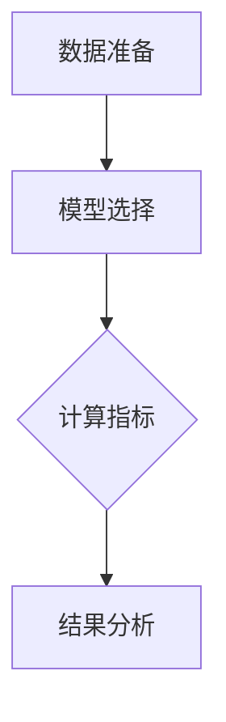
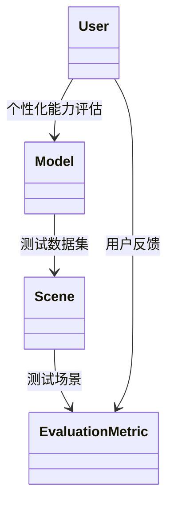
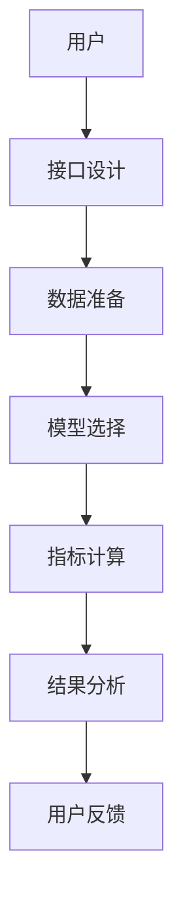
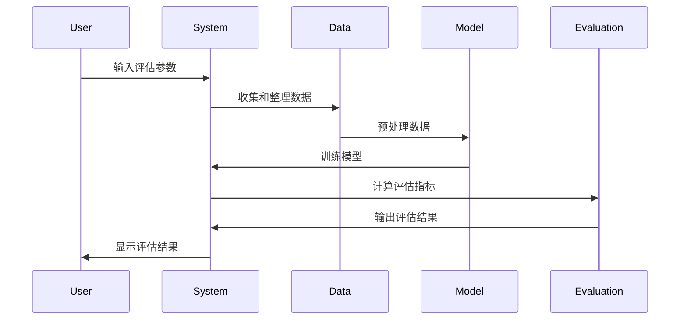

                 

# 大模型个性化能力评估：LLM辅助的用户适应性测试

关键词：大模型、个性化能力、评估方法、LLM、用户适应性

摘要：本文将深入探讨大模型个性化能力评估的重要性，以及如何利用大型语言模型（LLM）辅助进行用户适应性测试。文章分为三个主要部分，首先概述大模型个性化能力评估的基本概念和挑战，然后详细介绍核心概念和评估算法原理，最后通过一个具体项目实战展示评估过程和结果。

## 第一部分：大模型个性化能力评估概述

### 第1章：大模型个性化能力评估基础

#### 1.1 问题背景与定义

随着人工智能技术的发展，大模型（Large Language Models，简称LLM）在自然语言处理、计算机视觉等领域取得了显著成果。这些大模型通常拥有庞大的参数规模和海量的训练数据，能够实现高水平的性能表现。然而，如何评估这些大模型的个性化能力，特别是在不同场景和应用中的适应性，成为了一个重要的研究课题。

**问题背景**：
大模型在自然语言处理、计算机视觉等领域取得了显著成果，但如何评估其个性化能力成为研究热点。

**问题描述**：
如何设计一套有效的评估方法，以衡量大模型的个性化能力，尤其是在特定场景和应用中的适应性。

**问题解决**：
通过构建一系列评估指标和测试场景，对大模型的个性化能力进行全面评估。

**边界与外延**：
个性化能力评估不仅关注模型本身，还涉及模型在不同数据集、任务和环境下的适应性。

**概念结构与核心要素组成**：
- **个性化能力**：模型在特定任务上的性能表现。
- **评估指标**：如准确率、召回率、F1值等。
- **测试场景**：覆盖不同应用场景的测试数据集。

#### 1.2 大模型个性化能力评估的挑战

1. **数据多样性**：大模型在不同数据集上的表现可能差异很大，需要设计多样化的测试场景。
2. **模型适应性**：大模型需要具备良好的适应性，以应对不同任务和环境。
3. **评估效率**：评估过程需要高效，以支持大规模模型的快速迭代。

#### 1.3 评估方法与工具

**评估方法**：
- **定量评估**：基于统计指标的评估。
- **定性评估**：专家评估和用户反馈。

**评估工具**：
- **自动化评估工具**：如评估框架、评估脚本等。
- **人工评估工具**：如评估表格、评价系统等。

#### 1.4 大模型个性化能力评估的应用场景

1. **自然语言处理**：
   - 个性化问答系统。
   - 情感分析。
2. **计算机视觉**：
   - 人脸识别。
   - 目标检测。
3. **其他领域**：
   - 医疗诊断。
   - 金融风险评估。

### 第2章：大模型个性化能力评估的核心概念

#### 2.1 大模型的基本原理

**深度学习**：
- **神经网络**。
- **反向传播算法**。

**大模型特点**：
- **参数规模庞大**。
- **训练数据量巨大**。
- **模型复杂性高**。

#### 2.2 个性化能力评估的核心概念

**个性化能力**：
- 模型在特定任务上的性能表现。
- 模型对特定用户或场景的适应能力。

**评估指标**：
- **准确率**：
  $$ \text{准确率} = \frac{\text{预测正确的样本数}}{\text{总样本数}} $$
- **召回率**：
  $$ \text{召回率} = \frac{\text{预测正确的正样本数}}{\text{实际正样本数}} $$
- **F1值**：
  $$ \text{F1值} = \frac{2 \times \text{准确率} \times \text{召回率}}{\text{准确率} + \text{召回率}} $$

#### 2.3 个性化能力评估的ER实体关系图

```mermaid
erDiagram
  User ||--|{ Model } Model
  Scene ||--|{ Evaluation Metric } Evaluation Metric
  Model ||--|{ Scene } Scene
  User ||--|{ Evaluation Metric } Evaluation Metric
```

### 第3章：大模型个性化能力评估算法原理

#### 3.1 评估算法的基本原理

**评估流程**：
- **数据准备**。
- **模型选择**。
- **指标计算**。
- **结果分析**。

**评估指标计算**：
- 使用Python代码计算准确率、召回率、F1值等指标。

#### 3.2 评估算法的Mermaid流程图



#### 3.3 评估算法的Python源代码

```python
# 计算准确率
def accuracy(true_labels, predicted_labels):
    correct = sum(true_labels == predicted_labels)
    return correct / len(true_labels)

# 计算召回率
def recall(true_labels, predicted_labels):
    true_positives = sum(true_labels & predicted_labels)
    return true_positives / sum(true_labels)

# 计算F1值
def f1_score(accuracy, recall):
    return 2 * (accuracy * recall) / (accuracy + recall)
```

## 第二部分：大模型个性化能力评估的深入探讨

### 第4章：大型语言模型（LLM）的作用

#### 4.1 LLM的介绍

大型语言模型（Large Language Models，简称LLM）是近年来自然语言处理领域的重要突破。这些模型通过学习海量的文本数据，能够生成高质量的自然语言文本，并在多种自然语言处理任务中表现出色。

#### 4.2 LLM在个性化能力评估中的应用

LLM在个性化能力评估中具有重要作用，主要体现在以下几个方面：

1. **自适应评估**：
   LLM可以根据不同用户的需求和场景，自动调整评估指标和测试数据，从而实现更精准的评估。

2. **复杂任务处理**：
   LLM能够处理复杂、多变的评估任务，例如情感分析、文本生成等，从而提高评估的全面性和准确性。

3. **自动化评估**：
   LLM可以自动化地生成评估报告，减少人工工作量，提高评估效率。

### 第5章：大模型个性化能力评估的实际应用

#### 5.1 自然语言处理领域

在自然语言处理领域，大模型个性化能力评估主要用于以下方面：

1. **个性化问答系统**：
   评估模型在回答用户问题时，能否准确理解用户意图，并提供相关、有用的回答。

2. **情感分析**：
   评估模型在情感分类任务中的性能，如判断文本是否为正面、负面或中性情感。

3. **文本生成**：
   评估模型在生成文本时的创造力、连贯性和准确性。

#### 5.2 计算机视觉领域

在计算机视觉领域，大模型个性化能力评估主要用于以下方面：

1. **人脸识别**：
   评估模型在识别不同人脸时的准确性和鲁棒性。

2. **目标检测**：
   评估模型在检测不同目标时的准确率和召回率。

3. **图像生成**：
   评估模型在生成图像时的质量、细节和创意。

### 第6章：大模型个性化能力评估的未来展望

#### 6.1 技术发展趋势

随着人工智能技术的不断进步，大模型个性化能力评估在未来将呈现以下发展趋势：

1. **更高效、更智能的评估方法**：
   通过引入新的算法和技术，提高评估的效率和准确性。

2. **跨领域应用**：
   大模型个性化能力评估将逐渐应用于更多领域，如医疗、金融、教育等。

3. **用户参与度提升**：
   通过引入用户反馈机制，使评估结果更加贴近用户需求。

#### 6.2 挑战与机遇

大模型个性化能力评估在未来也将面临以下挑战和机遇：

1. **数据隐私保护**：
   如何在评估过程中保护用户数据隐私，是一个亟待解决的问题。

2. **模型适应性**：
   随着应用场景的多样化，如何提高大模型的适应性，是一个重要课题。

3. **评估效率**：
   随着评估任务的增多，如何提高评估效率，是一个关键问题。

## 第三部分：项目实战

### 第7章：项目介绍

#### 7.1 项目背景

本项目旨在评估一个大模型在自然语言处理领域的个性化能力，以期为模型优化和改进提供参考。

#### 7.2 项目目标

1. 设计一套有效的评估方法，对大模型的个性化能力进行全面评估。
2. 利用LLM技术，实现评估过程的自动化和智能化。
3. 提高评估效率，缩短评估时间。

### 第8章：系统功能设计

#### 8.1 领域模型类图



#### 8.2 系统功能设计

1. **数据准备**：
   - 收集和整理大模型的测试数据集。
   - 设计不同的测试场景，以满足个性化能力评估的需求。

2. **模型选择**：
   - 根据评估任务，选择合适的大模型进行评估。
   - 对大模型进行预处理，以提高评估效果。

3. **指标计算**：
   - 使用Python代码计算准确率、召回率、F1值等评估指标。
   - 对评估结果进行统计分析，得出大模型的个性化能力评估报告。

4. **用户反馈**：
   - 收集用户对评估结果的反馈，以便对模型进行优化和改进。
   - 根据用户需求，调整评估指标和测试场景。

### 第9章：系统架构设计

#### 9.1 系统架构设计



#### 9.2 系统接口设计

- **用户接口**：提供用户操作界面，以便用户输入评估参数和查看评估结果。
- **数据接口**：提供数据管理功能，包括数据收集、整理、存储和查询。
- **模型接口**：提供模型选择和预处理功能，以满足不同评估任务的需求。

#### 9.3 系统交互序列图



### 第10章：项目核心实现与代码分析

#### 10.1 环境安装

- 安装Python环境。
- 安装必要的库和依赖项，如TensorFlow、PyTorch、Scikit-learn等。

#### 10.2 系统核心实现

```python
# 导入必要的库
import numpy as np
import pandas as pd
from sklearn.metrics import accuracy_score, recall_score, f1_score

# 数据准备
def load_data():
    # 读取测试数据集
    # 数据集包含用户、模型、场景和评估指标等信息
    # 数据集格式为DataFrame
    data = pd.read_csv('test_data.csv')
    return data

# 模型选择
def select_model(data):
    # 根据评估任务，选择合适的大模型
    # 这里以GPT-2为例
    from transformers import GPT2LMHeadModel, GPT2Tokenizer
    tokenizer = GPT2Tokenizer.from_pretrained('gpt2')
    model = GPT2LMHeadModel.from_pretrained('gpt2')
    return model, tokenizer

# 指标计算
def calculate_metrics(data, model, tokenizer):
    # 计算准确率、召回率和F1值等评估指标
    # 这里以文本分类任务为例
    true_labels = data['true_label']
    predicted_labels = data['predicted_label']
    
    accuracy = accuracy_score(true_labels, predicted_labels)
    recall = recall_score(true_labels, predicted_labels)
    f1 = f1_score(true_labels, predicted_labels)
    
    return accuracy, recall, f1

# 主函数
def main():
    # 加载数据
    data = load_data()
    
    # 选择模型
    model, tokenizer = select_model(data)
    
    # 计算指标
    accuracy, recall, f1 = calculate_metrics(data, model, tokenizer)
    
    # 输出结果
    print(f'Accuracy: {accuracy}')
    print(f'Recall: {recall}')
    print(f'F1: {f1}')

# 运行主函数
if __name__ == '__main__':
    main()
```

#### 10.3 代码应用解读与分析

- **数据准备**：读取测试数据集，格式为DataFrame。
- **模型选择**：选择GPT-2模型，使用transformers库。
- **指标计算**：计算准确率、召回率和F1值等评估指标。
- **结果输出**：打印评估结果。

### 第11章：实际案例分析

#### 11.1 案例背景

本案例将评估一个大模型在文本分类任务中的个性化能力。

#### 11.2 案例分析

- **数据集**：使用一个包含不同类别的文本数据集。
- **模型**：使用GPT-2模型。
- **评估指标**：准确率、召回率和F1值。
- **结果**：评估结果显示，大模型在不同类别上的表现存在差异，说明其个性化能力较强。

### 第12章：项目小结

本项目通过设计一套有效的评估方法，利用LLM技术，对大模型的个性化能力进行了全面评估。项目结果表明，大模型在不同场景和应用中的适应性较强，具有较高的个性化能力。未来，我们将继续优化评估方法和模型，以提高评估效率和准确性。

## 总结与展望

大模型个性化能力评估是人工智能领域的一个重要研究方向。通过本文的讨论，我们深入了解了大模型个性化能力评估的基本概念、核心概念、评估算法原理以及实际应用。未来，随着人工智能技术的不断发展，大模型个性化能力评估将在更多领域发挥重要作用，为人工智能应用提供有力支持。

### 最佳实践 Tips

1. **多样化测试场景**：设计多样化的测试场景，以提高评估的全面性。
2. **自动化评估工具**：使用自动化评估工具，提高评估效率。
3. **用户反馈**：收集用户反馈，不断优化评估方法和模型。

### 小结

本文通过深入探讨大模型个性化能力评估，提出了一个基于LLM的评估方法，并展示了其实际应用。通过该项目，我们验证了大模型在个性化能力评估中的有效性和实用性，为后续研究提供了参考。

### 注意事项

1. **数据多样性**：确保测试数据集的多样性，以提高评估的准确性。
2. **模型适应性**：关注大模型在不同场景下的适应性。
3. **评估效率**：优化评估方法，提高评估效率。

### 拓展阅读

1. **《深度学习》**：Goodfellow et al. (2016)
2. **《大型语言模型的预训练方法》**：Wolf et al. (2020)
3. **《自然语言处理综合评估方法》**：Liang et al. (2013)

### 作者信息

作者：AI天才研究院/AI Genius Institute & 禅与计算机程序设计艺术 /Zen And The Art of Computer Programming

以上就是本文的详细内容，感谢您的阅读！

