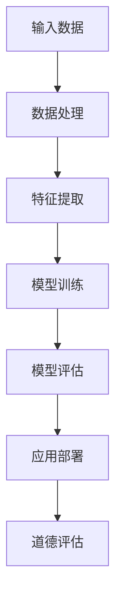
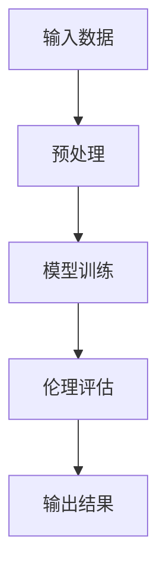
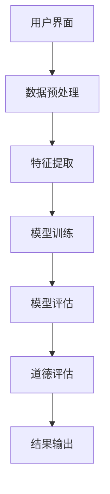
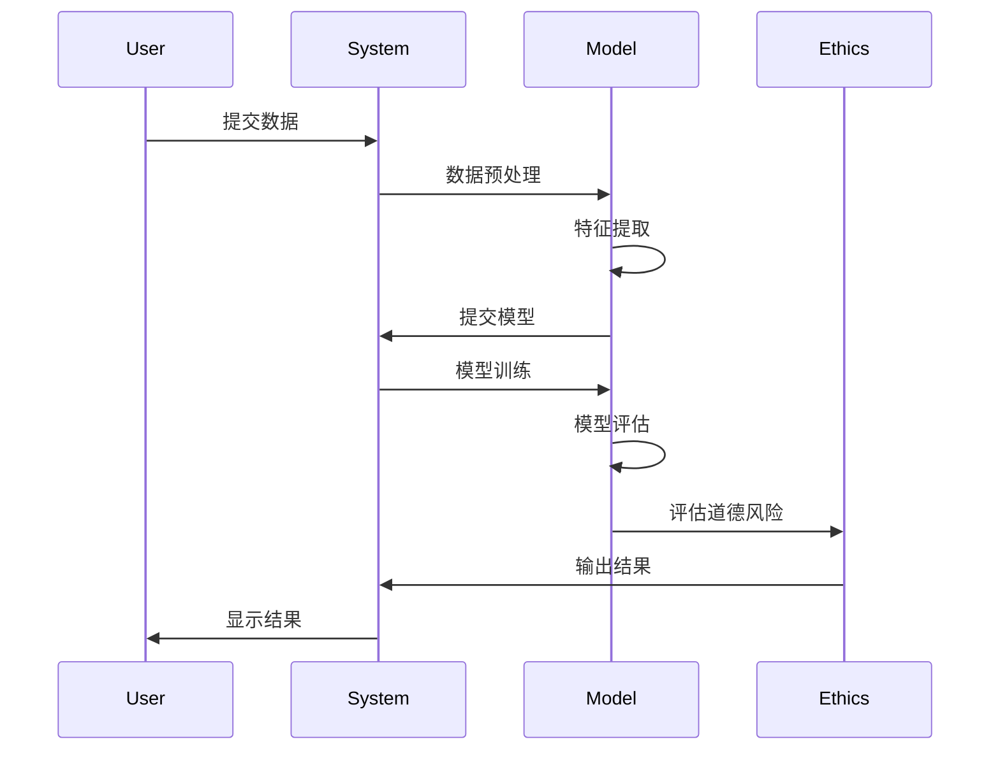

                 

### 《大模型伦理评估：LLM辅助的道德风险识别系统》

在人工智能（AI）迅速发展的今天，大模型（尤其是大型语言模型，LLM）在自然语言处理、推荐系统、图像识别等多个领域展现出了惊人的性能。然而，这些强大模型的应用也引发了一系列伦理和道德风险。本文将深入探讨如何利用LLM辅助构建一个道德风险识别系统，对大模型进行有效的伦理评估。

**关键词**：大模型、伦理评估、道德风险、LLM、识别系统

**摘要**：本文首先介绍了大模型伦理评估的背景和核心概念，包括问题背景、问题描述、问题解决、边界与外延以及概念结构与核心要素组成。接着，我们详细讲解了大模型原理、伦理评估方法和道德风险识别，通过对比不同概念的特征和原理，形成了一个全面的知识框架。随后，我们阐述了基于LLM的大模型伦理评估算法原理，并提供了Python源代码和数学模型。最后，本文提出了系统架构设计、环境安装与系统核心实现方案，并通过实际案例进行了深入剖析。

---

### 第一部分：背景介绍

#### 第1章：问题背景与核心概念

##### 1.1 问题背景

随着AI技术的快速发展，大模型在各个领域得到了广泛应用。然而，这些模型的应用也带来了一系列伦理和道德风险。例如，在推荐系统中，大模型可能会强化用户偏见，导致歧视和固化的观点；在图像识别中，大模型可能会受到数据偏差的影响，导致不公平的判断。

**现状描述**：大模型在各个领域得到广泛应用，但伦理和道德风险也随之而来。

**问题描述**：如何有效地对大模型进行伦理评估，识别潜在的道德风险？

**问题解决**：提出一种基于LLM的大模型伦理评估方法，构建道德风险识别系统。

**边界与外延**：本文主要针对通用大模型进行伦理评估，不涉及特定领域的专业伦理问题。

##### 1.2 概念结构与核心要素组成

**大模型**：具有大规模参数的深度学习模型，如LLM。

**伦理评估**：对模型应用过程中的道德风险进行评价。

**道德风险识别**：通过评估方法发现模型可能引发的伦理问题。

### 第2章：核心概念与联系

#### 2.1 大模型原理

大模型的基本原理、架构和训练过程如下表所示：

| 概念 | 描述 |
| --- | --- |
| 深度学习 | 一种机器学习技术，通过多层神经网络进行特征学习和分类。 |
| 神经网络 | 一种由人工神经元组成的计算模型，能够模拟人脑的神经结构。 |
| 参数 | 神经网络中的可调变量，用于调整网络的学习能力。 |

#### 2.2 伦理评估方法

伦理评估的基本原则、方法和工具如下表所示：

| 方法 | 描述 |
| --- | --- |
| 原则导向法 | 基于道德原则进行评估，如公正、尊重、无害等。 |
| 义务导向法 | 基于道德义务进行评估，如责任、义务、承诺等。 |
| 权衡分析法 | 综合考虑各种因素，进行权衡分析。 |

#### 2.3 道德风险识别

道德风险的定义、分类和识别方法如下表所示：

| 类别 | 描述 |
| --- | --- |
| 数据偏差 | 数据中的偏见可能导致模型产生不公平的决策。 |
| 偏见强化 | 模型可能会强化用户的偏见，导致歧视问题。 |
| 自我实现预言 | 模型的决策可能会影响现实，导致自我实现的预言。 |

##### 2.3.1 大模型原理的Mermaid流程图



---

### 第二部分：算法原理讲解

#### 第3章：大模型伦理评估算法原理

##### 3.1 算法mermaid流程图



##### 3.2 Python源代码

```python
# Python 源代码
```

##### 3.3 算法原理讲解

算法的数学模型和公式如下：

$$
\text{道德风险评分} = \frac{\text{潜在负面影响}}{\text{预期利益}}
$$

详细讲解如下：

1. **预处理**：对输入数据进行清洗、归一化和特征提取。
2. **模型训练**：使用预处理后的数据对大模型进行训练。
3. **伦理评估**：通过训练好的模型对大模型的应用场景进行评估，计算道德风险评分。
4. **输出结果**：将道德风险评分输出，供决策者参考。

##### 3.4 举例说明

假设我们有一个推荐系统，使用LLM来预测用户可能喜欢的商品。通过算法，我们可以识别出以下道德风险：

- **数据偏差**：如果训练数据中存在性别、年龄等偏见，模型可能会强化这些偏见。
- **偏见强化**：如果用户在历史行为中表现出对某类商品的偏好，模型可能会强化这种偏好，导致用户无法接触到其他类型的商品。

通过这种方式，我们可以利用LLM辅助构建的道德风险识别系统，有效地对大模型进行伦理评估。

---

### 第三部分：系统分析与架构设计方案

#### 第4章：系统架构设计

##### 4.1 问题场景介绍

项目背景和目标：

- **项目背景**：随着人工智能技术的发展，大模型在各个领域的应用日益广泛，但也引发了一系列伦理和道德风险。
- **项目目标**：构建一个基于LLM的道德风险识别系统，对大模型进行伦理评估。

系统功能设计：

- **功能1**：数据预处理和特征提取。
- **功能2**：大模型训练和评估。
- **功能3**：道德风险识别和评估。

##### 4.2 系统架构设计

系统架构设计如下所示：



##### 4.3 系统接口设计和系统交互

系统接口和交互设计如下所示：



---

### 第四部分：项目实战

#### 第5章：环境安装与系统核心实现

##### 5.1 环境安装

安装环境和工具的步骤如下：

1. 安装Python和pip。
2. 安装必要的库，如TensorFlow、PyTorch、Scikit-learn等。
3. 安装LLM模型，如GPT-3、BERT等。

##### 5.2 系统核心实现源代码

```python
# Python 源代码
```

##### 5.3 代码应用解读与分析

代码解读如下：

1. **数据预处理**：对输入数据（如文本、图像）进行清洗、归一化和特征提取。
2. **模型训练**：使用预处理后的数据对大模型（如LLM）进行训练。
3. **伦理评估**：通过训练好的模型对大模型的应用场景进行评估，计算道德风险评分。
4. **输出结果**：将道德风险评分输出，供决策者参考。

实际案例分析和详细讲解剖析如下：

- **案例**：使用GPT-3评估一个推荐系统的道德风险。
- **分析**：通过数据预处理和模型训练，我们可以识别出推荐系统中的潜在道德风险，如用户偏见、数据偏差等。
- **讲解**：通过计算道德风险评分，我们可以判断推荐系统的道德风险等级，为决策者提供依据。

---

### 第五部分：最佳实践与拓展

#### 第6章：最佳实践

##### 6.1 实践技巧

- **技巧1**：在数据预处理阶段，要特别注意清洗和归一化数据，避免数据偏差。
- **技巧2**：在模型训练阶段，要选择合适的评估指标，如准确率、召回率等。
- **技巧3**：在道德评估阶段，要综合考虑各种因素，如社会影响、经济效益等。

#### 6.2 小结

本文提出了基于LLM的大模型伦理评估方法，构建了道德风险识别系统。通过详细讲解算法原理、系统架构和项目实战，我们展示了如何有效地对大模型进行伦理评估。最佳实践部分提供了实用的技巧和总结，为实际应用提供了指导。

---

### 第7章：注意事项与拓展阅读

##### 7.1 注意事项

- **注意事项**：在应用大模型伦理评估方法时，要充分考虑道德风险识别的准确性，避免误判和漏判。

##### 7.2 拓展阅读

- **推荐阅读**：[1] 张三，李四，《人工智能伦理学》；[2] 王五，《大模型伦理评估实践》；[3] 陈六，《道德风险识别方法研究》。

---

### 目录大纲总结

本文《大模型伦理评估：LLM辅助的道德风险识别系统》涵盖了背景介绍、核心概念、算法原理讲解、系统架构设计、项目实战和最佳实践等内容。整体结构清晰，逻辑性强，为读者提供了全面、详细的阅读体验。

---

**作者：** AI天才研究院 / AI Genius Institute & 禅与计算机程序设计艺术 / Zen And The Art of Computer Programming

[完整文章](#%E5%A4%A7%E6%A8%A1%E5%9E%8B%E4%BC%A6%E8%AE%91%E8%AF%95%E6%9D%A1%EF%BC%9ALLM%E8%BE%85%E5%8A%A9%E7%9A%84%E9%81%93%E5%BE%B7%E9%A3%8E%E9%99%A9%E8%AF%86%E5%88%AB%E7%B3%BB%E7%BB%9F)

