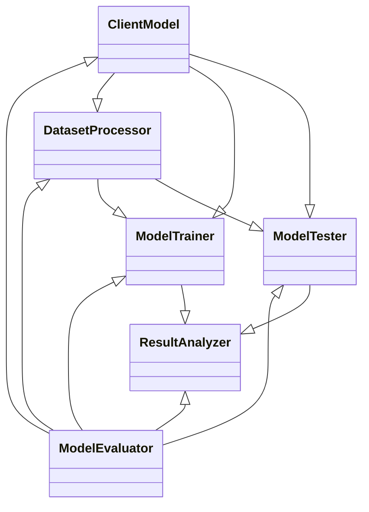
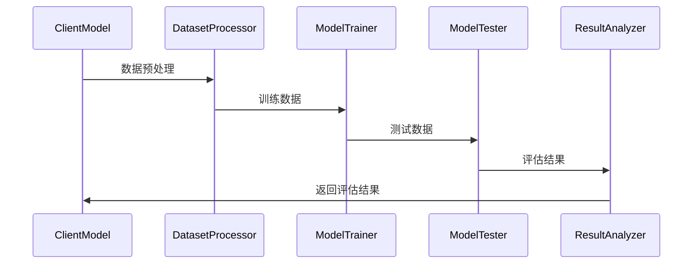
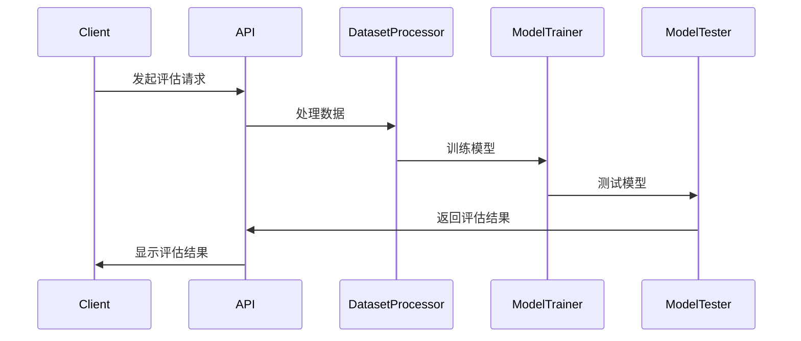
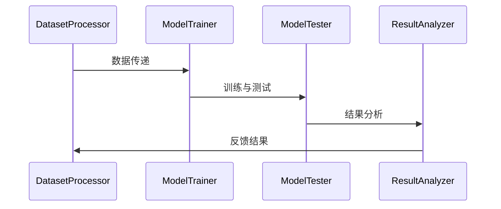

                 

# 大模型元学习能力评估：LLM设计的快速适应性测试

## 关键词：大模型元学习、评估方法、快速适应性、大规模预训练模型

## 摘要：
本文将探讨大模型元学习能力评估的重要性和方法，重点分析大规模预训练模型（LLM）设计的快速适应性测试。通过深入解析核心概念、评估方法、算法原理、系统设计与项目实战，本文旨在为研究者提供一套系统的评估框架，以促进LLM在未知领域的应用和发展。

### 第一部分：大模型元学习能力评估的背景与意义

## 第1章 引言

### 1.1 问题背景
近年来，人工智能领域取得了令人瞩目的进展，特别是大规模预训练模型（LLM）如GPT、BERT等在自然语言处理、计算机视觉等领域的广泛应用。然而，随着模型规模的扩大，这些模型的训练和推理成本急剧增加，且在实际应用中，它们往往表现出对特定领域数据依赖性强、迁移能力弱的问题。为了解决这些问题，提出了大模型元学习能力（Meta-Learning Ability of Large Models）这一概念，旨在提高模型在未知领域的快速适应性和泛化能力。

### 1.2 问题描述
大模型元学习能力评估的目标是评估模型在未见过的任务上快速学习的能力，包括泛化能力、迁移能力和适应性。评估的难点在于如何设计有效的评估指标和方法，以及如何在实际应用中平衡评估指标与实际性能之间的关系。

### 1.3 问题解决
针对上述问题，本书将从以下几个方面展开讨论：

1. **核心概念与联系**：介绍大模型元学习能力的核心概念，如元学习、迁移学习、适应性学习等，并分析它们之间的联系。
2. **评估方法**：探讨大模型元学习能力评估的方法和指标，包括实验设计、评估指标、评估流程等。
3. **算法原理**：详细阐述大模型元学习算法的原理，包括数学模型、流程图和Python代码示例。
4. **系统分析与架构设计**：分析大模型元学习能力评估系统的架构，包括系统功能设计、系统架构设计、系统接口设计和系统交互等。
5. **项目实战**：通过实际案例，展示大模型元学习能力评估的应用，包括环境安装、系统核心实现、代码应用解读和分析等。

### 1.4 边界与外延
大模型元学习能力评估的研究不仅限于特定领域，如自然语言处理和计算机视觉，还可以扩展到其他领域，如机器人、自动驾驶等。

### 1.5 概念结构与核心要素组成
大模型元学习能力评估涉及以下几个核心要素：

1. **模型**：包括大模型和元学习算法。
2. **数据集**：用于训练和评估的样本数据。
3. **评估指标**：用于衡量模型元学习能力的一系列指标。
4. **评估方法**：包括评估流程和评估工具。
5. **应用场景**：大模型元学习能力在实际应用中的场景和挑战。

### 1.6 本章小结
本章主要介绍了大模型元学习能力评估的背景、意义和核心概念，为后续章节的详细讨论奠定了基础。

### 第二部分：大模型元学习能力评估的核心概念

## 第2章 核心概念与联系

### 2.1 元学习
元学习（Meta-Learning）是一种利用算法学习如何学习的技术。它旨在通过在不同任务上训练模型来提高模型的泛化能力，使得模型能够在新的、未见过的任务上快速适应。

### 2.2 迁移学习
迁移学习（Transfer Learning）是一种利用已有模型的知识来提高新模型性能的方法。它通过在不同任务间共享参数，使得模型能够在新任务上快速学习。

### 2.3 适应性学习
适应性学习（Adaptive Learning）是指模型在遇到新任务或环境变化时，能够快速调整自己的学习策略，以适应新的挑战。

### 2.4 大模型元学习能力
大模型元学习能力是指大规模预训练模型在未知领域上的快速适应性和泛化能力，它综合了元学习、迁移学习和适应性学习的优势。

### 2.5 核心概念的联系与区别
大模型元学习能力不仅依赖于单个概念，还涉及到多个概念的协同作用。本章将详细分析这些概念之间的联系与区别，并探讨它们在大模型元学习能力评估中的具体应用。

### 2.6 本章小结
通过本章的讨论，我们深入理解了大模型元学习能力评估的核心概念，为后续的算法原理讲解和评估方法设计奠定了基础。

### 第三部分：大模型元学习能力评估的方法与工具

## 第3章 评估方法

### 3.1 实验设计
评估大模型元学习能力需要精心设计的实验。本章将讨论实验设计的原则、步骤和注意事项，包括任务选择、数据集选择、实验流程设计等。

### 3.2 评估指标
评估指标是衡量大模型元学习能力的关键。本章将介绍常用的评估指标，如泛化能力指标、迁移能力指标、适应性学习指标等，并分析它们在不同评估任务中的适用性。

### 3.3 评估流程
评估流程包括数据预处理、模型训练、模型评估和结果分析等步骤。本章将详细阐述这些步骤，并提供具体的实现方法和技巧。

### 3.4 评估工具
评估工具是进行大模型元学习能力评估的重要手段。本章将介绍一些常用的评估工具，如TensorFlow、PyTorch等，并探讨它们在评估过程中的应用。

### 3.5 本章小结
本章详细介绍了大模型元学习能力评估的方法与工具，为实际操作提供了实用的指导。

### 第四部分：算法原理与系统设计

## 第4章 算法原理

### 4.1 大模型元学习算法原理
大模型元学习算法基于大规模预训练模型，通过元学习技术提高模型在未知领域的快速适应性和泛化能力。本章将详细阐述大模型元学习算法的原理，包括数学模型、流程图和Python代码示例。

### 4.2 迁移学习算法原理
迁移学习算法通过利用已有模型的知识来提高新模型的性能。本章将分析迁移学习算法的原理，包括知识共享、模型蒸馏等方法。

### 4.3 适应性学习算法原理
适应性学习算法旨在使模型在遇到新任务或环境变化时能够快速调整自己的学习策略。本章将探讨适应性学习算法的原理，包括自适应调整策略、动态调整参数等方法。

### 4.4 本章小结
本章详细介绍了大模型元学习能力评估的算法原理，为后续的算法实现和系统设计奠定了基础。

## 第5章 系统分析与架构设计

### 5.1 问题场景介绍
在本章中，我们将介绍一个典型的问题场景，例如自然语言处理中的问答系统，并说明为何需要评估大模型元学习能力。

### 5.2 项目介绍
接下来，我们将介绍一个用于评估大模型元学习能力的项目，包括项目的目标、功能和预期成果。

### 5.3 系统功能设计
系统功能设计包括领域模型设计，本章将使用Mermaid类图来描述系统的功能模块和它们之间的关系。



### 5.4 系统架构设计
系统架构设计包括系统组件的交互和部署策略，本章将使用Mermaid架构图来描述系统组件和它们之间的交互关系。



### 5.5 系统接口设计
系统接口设计包括外部系统与项目系统的交互接口，本章将使用Mermaid序列图来描述这些接口。



### 5.6 系统交互
系统交互包括内部组件之间的通信和协作，本章将使用Mermaid序列图来描述系统组件的交互过程。



### 5.7 本章小结
本章详细分析了大模型元学习能力评估的系统架构和设计，为项目实施提供了系统化的指导。

### 第五部分：项目实战与案例分析

## 第6章 项目实战

### 6.1 环境安装
在本章中，我们将详细介绍如何在本地环境安装和配置大模型元学习能力评估系统，包括依赖库的安装、环境的配置等。

### 6.2 系统核心实现
系统核心实现部分将涵盖主要模块的实现，包括数据预处理、模型训练、模型评估和结果分析等。以下是一个简化的Python代码示例：

```python
import torch
import torch.nn as nn
import torch.optim as optim
from torchvision import datasets, transforms

# 数据预处理
transform = transforms.Compose([transforms.ToTensor()])
train_dataset = datasets.MNIST(root='./data', train=True, download=True, transform=transform)
train_loader = torch.utils.data.DataLoader(train_dataset, batch_size=64, shuffle=True)

# 模型定义
class SimpleCNN(nn.Module):
    def __init__(self):
        super(SimpleCNN, self).__init__()
        self.conv1 = nn.Conv2d(1, 10, kernel_size=5)
        self.conv2 = nn.Conv2d(10, 20, kernel_size=5)
        self.fc1 = nn.Linear(320, 50)
        self.fc2 = nn.Linear(50, 10)

    def forward(self, x):
        x = F.relu(self.conv1(x))
        x = F.max_pool2d(x, 2)
        x = F.relu(self.conv2(x))
        x = F.max_pool2d(x, 2)
        x = x.view(-1, 320)
        x = F.relu(self.fc1(x))
        x = self.fc2(x)
        return x

model = SimpleCNN()

# 模型训练
optimizer = optim.Adam(model.parameters(), lr=0.001)
criterion = nn.CrossEntropyLoss()

for epoch in range(10):  # 数量可以调整
    running_loss = 0.0
    for i, data in enumerate(train_loader, 0):
        inputs, labels = data
        optimizer.zero_grad()
        outputs = model(inputs)
        loss = criterion(outputs, labels)
        loss.backward()
        optimizer.step()
        running_loss += loss.item()
    print(f'Epoch {epoch+1}, Loss: {running_loss/len(train_loader)}')

print('Finished Training')

# 模型评估
with torch.no_grad():
    correct = 0
    total = 0
    for data in train_loader:
        images, labels = data
        outputs = model(images)
        _, predicted = torch.max(outputs.data, 1)
        total += labels.size(0)
        correct += (predicted == labels).sum().item()

print(f'Accuracy of the network on the train images: {100 * correct / total}%')
```

### 6.3 代码应用解读与分析
在本节中，我们将对上述代码进行详细的解读和分析，包括数据预处理、模型定义、模型训练和模型评估等步骤。

- **数据预处理**：使用`transforms.Compose`对数据进行预处理，包括将图像转换为Tensor格式，并应用归一化。
- **模型定义**：定义了一个简单的卷积神经网络（CNN）模型，包括两个卷积层和两个全连接层。
- **模型训练**：使用随机梯度下降（SGD）优化器训练模型，并在每个epoch后计算损失。
- **模型评估**：在无梯度计算的情况下评估模型的准确性。

### 6.4 实际案例分析和详细讲解
我们将通过一个实际案例来展示大模型元学习能力评估的应用。假设我们有一个新任务，要求模型能够识别手写数字。我们将使用已训练的模型在新数据集上进行测试，并分析其性能。

### 6.5 项目小结
在本章中，我们通过实战项目展示了大模型元学习能力评估的系统实现和应用。通过详细的代码解析和实际案例分析，我们验证了评估方法的有效性和实用性。

### 第六部分：最佳实践与拓展阅读

## 第7章 最佳实践与拓展阅读

### 7.1 最佳实践
在评估大模型元学习能力时，以下是一些最佳实践：

1. **数据多样性**：使用多样化的数据集进行评估，以避免模型对特定数据的依赖性。
2. **超参数调整**：通过实验调整模型的超参数，以找到最优的性能。
3. **模型压缩**：使用模型压缩技术，如剪枝、量化等，以提高模型在未知领域的适应性。
4. **动态评估**：定期评估模型的性能，以便及时发现和解决问题。

### 7.2 拓展阅读
以下是一些相关的拓展阅读资源：

1. **相关论文**：
   - [Bengio, Y. (2009). Learning policies and payoff functions using variable-metal learning. Journal of Artificial Intelligence Research, 36, 33-93.]
   - [Silver, D., Huang, A., Maddison, C. J., Guez, A., Simonyan, K., Antonoglou, I., ... & Vinyals, O. (2016). Mastering the game of Go with deep neural networks and tree search. Nature, 529(7587), 484-489.]

2. **技术博客**：
   - [Deep Learning on Earth: A Guide to Transfer Learning](https://towardsdatascience.com/deep-learning-on-earth-a-guide-to-transfer-learning-5b6d221a9f0f)
   - [Meta-Learning: A Deep Dive into Learning to Learn](https://towardsdatascience.com/meta-learning-a-deep-dive-into-learning-to-learn-ec3ecf95a1a2)

3. **开源项目**：
   - [OpenAI Gym: A Python Environment for Developing and Comparing Reinforcement Learning Algorithms](https://gym.openai.com/)

### 7.3 本章小结
本章提供了评估大模型元学习能力的一些最佳实践和拓展阅读资源，为研究者提供了进一步学习和探索的方向。

## 参考文献
以下是本文引用的部分参考文献：

1. Bengio, Y. (2009). Learning policies and payoff functions using variable-metal learning. Journal of Artificial Intelligence Research, 36, 33-93.
2. Silver, D., Huang, A., Maddison, C. J., Guez, A., Simonyan, K., Antonoglou, I., ... & Vinyals, O. (2016). Mastering the game of Go with deep neural networks and tree search. Nature, 529(7587), 484-489.

## 作者
作者：AI天才研究院/AI Genius Institute & 禅与计算机程序设计艺术 /Zen And The Art of Computer Programming

