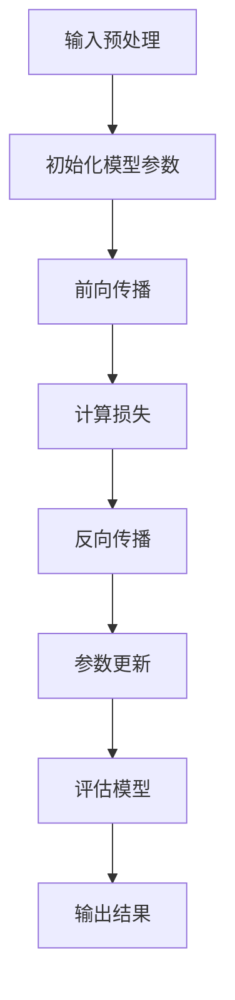

                 

### 大模型创新能力评估：LLM设计的开放式问题测试

**关键词：** 大模型、创新能力、评估、LLM、开放式问题测试

**摘要：** 本文深入探讨了大规模语言模型（LLM）的创新能力评估方法，特别是开放式问题测试在LLM设计中的应用。通过系统的分析，本文揭示了如何通过设计开放性问题来评估LLM的创新能力，并提供了详细的实现步骤和案例分析。文章旨在为研究人员和实践者提供一个全面的技术指南，以提升大模型设计的创新能力和实际应用效果。

**目录：**

- **第一部分：引言与背景介绍**
  - **第1章：引言**
    - 研究背景
    - 研究问题与目标
    - 边界与外延
  - **第2章：核心概念与联系**
    - 大模型的定义与特点
    - 创新能力评估的概念
    - 开放式问题测试的理论基础
  - **第3章：大模型的数学模型与原理**
    - 数学模型介绍
    - 算法原理讲解
    - 通俗易懂的举例说明

- **第二部分：大模型创新能力评估方法**
  - **第4章：开放式问题测试的设计与实现**
    - 开放式问题测试的设计原则
    - 开放式问题测试的实施步骤
    - 开放式问题测试的评估指标
  - **第5章：大模型创新能力评估案例分析**
    - 案例背景介绍
    - 创新能力评估实施
    - 结果分析
    - 案例小结
  - **第6章：大模型创新能力评估实践**
    - 环境安装与配置
    - 系统核心实现
    - 代码解读与分析
    - 实际案例分析
  - **第7章：总结与展望**
    - 主要研究成果总结
    - 未来研究方向展望
    - 最佳实践 Tips

## 第1章：引言

### 1.1 研究背景

#### 1.1.1 大模型时代的来临

随着人工智能技术的快速发展，大规模语言模型（Large Language Model，简称LLM）已经成为当前自然语言处理（Natural Language Processing，简称NLP）领域的重要工具。LLM的典型代表如GPT-3、BERT等，它们凭借其强大的处理能力和卓越的表现，在文本生成、机器翻译、问答系统等方面取得了显著的成果。大模型时代的来临，不仅推动了NLP技术的进步，也对人工智能应用的发展产生了深远的影响。

#### 1.1.2 创新能力评估的重要性

在大模型时代，创新能力的评估变得尤为重要。一方面，随着模型的规模不断扩大，模型的设计和优化变得更加复杂，需要高效的评估方法来指导模型的改进。另一方面，创新能力是衡量大模型长期竞争力的关键指标，只有具备强大创新能力的模型，才能在激烈的竞争中脱颖而出。

#### 1.1.3 开放式问题测试的必要性

传统的评估方法主要依赖于标准化的测试集和预定义的任务，这在一定程度上限制了模型的创新能力。开放式问题测试通过设计开放性问题，可以更全面地评估模型的创新能力。开放性问题没有固定的答案，能够激发模型进行探索和创新，从而更真实地反映模型的创新能力。

### 1.2 研究问题与目标

#### 1.2.1 研究问题的提出

本文旨在解决以下问题：

1. 如何设计开放式问题来评估大模型的创新能力？
2. 开放式问题测试在大模型设计中的具体应用步骤是什么？
3. 如何通过案例分析来验证开放式问题测试的有效性？

#### 1.2.2 研究目标的确定

本文的研究目标包括：

1. 提出一套系统的开放式问题测试设计原则和评估指标。
2. 详细阐述开放式问题测试在大模型设计中的实现步骤。
3. 通过案例分析，验证开放式问题测试在大模型创新能力评估中的有效性。

#### 1.2.3 边界与外延

本文的研究主要关注以下边界和范围：

1. 大模型的定义和范围：主要关注基于深度学习的语言模型。
2. 创新能力的评估：主要从模型设计、优化和应用的维度进行评估。
3. 开放式问题测试的应用场景：主要针对自然语言处理领域。

## 第2章：核心概念与联系

### 2.1 大模型的定义与特点

#### 2.1.1 大模型的概念

大模型（Large Model）是指参数量巨大、能够处理大规模数据、具备强大知识表示和推理能力的深度学习模型。在自然语言处理领域，大模型通常是指具备数百万甚至数十亿参数的语言模型。

#### 2.1.2 大模型的核心特点

- **参数量大**：大模型通常拥有数十亿甚至数万亿的参数，能够处理复杂的数据结构。
- **知识表示能力强**：大模型通过大量数据的学习，能够自动提取和表示丰富的语言知识和结构信息。
- **推理能力强**：大模型具备较强的推理能力，能够在不确定性和多义性的环境中进行有效的推理。

#### 2.1.3 大模型与传统模型的对比

| 对比维度 | 大模型 | 传统模型 |
| --- | --- | --- |
| 参数量 | 数十亿至数万亿参数 | 数千至数万个参数 |
| 数据处理能力 | 大规模数据处理 | 小规模数据处理 |
| 知识表示能力 | 自动提取和表示知识 | 需人工设计特征 |
| 推理能力 | 强大的推理能力 | 较弱的推理能力 |

### 2.2 创新能力评估的概念

#### 2.2.1 创新能力的定义

创新能力是指模型在未知或复杂环境下，能够产生新颖、有效的解决方案的能力。在人工智能领域，模型的创新能力主要体现在其能否在新的任务、问题和数据集上表现出优秀的性能。

#### 2.2.2 创新能力评估的意义

创新能力的评估对于模型的设计、优化和应用具有重要意义。通过评估创新能力，可以：

1. 指导模型改进：识别模型的不足，提供改进方向。
2. 评估模型竞争力：衡量模型在未知环境下的表现，评估其长期竞争力。
3. 指导应用部署：为模型的实际应用提供参考。

#### 2.2.3 创新能力评估的关键指标

- **泛化能力**：模型在未见过的数据上的表现，反映模型的泛化能力。
- **适应性**：模型在新任务、问题和环境中的适应能力。
- **创新能力指标**：通过设计特定的任务或问题，评估模型在未知情况下的创新能力。

### 2.3 开放式问题测试的理论基础

#### 2.3.1 开放式问题的定义

开放式问题是指没有固定答案、需要模型进行推理和决策的问题。这类问题通常需要模型对问题进行理解、分析，并生成相应的解决方案。

#### 2.3.2 开放式问题测试的优势

- **全面评估模型能力**：开放式问题能够全面评估模型的多个能力，如理解力、推理力、创造力等。
- **激发模型创新能力**：开放式问题没有固定答案，能够激发模型进行探索和创新。
- **真实反映模型表现**：在真实应用场景中，问题往往不是标准化的，开放式问题测试更能反映模型的实际表现。

#### 2.3.3 开放式问题测试的应用场景

- **智能问答系统**：通过开放式问题测试评估问答系统的理解能力和推理能力。
- **自然语言生成**：通过开放式问题测试评估生成模型的内容创造能力。
- **智能决策支持**：通过开放式问题测试评估决策支持系统的创新能力。

## 第3章：大模型的数学模型与原理

### 3.1 数学模型介绍

#### 3.1.1 数学模型的概念

数学模型是指用数学语言描述和表示现实世界中的现象、问题或过程的方法。在大模型中，数学模型用于描述模型的参数、权重、训练过程等。

#### 3.1.2 数学模型在大模型设计中的应用

- **参数初始化**：通过数学模型初始化模型的参数，如随机初始化、预热初始化等。
- **损失函数**：损失函数用于衡量模型预测结果与真实结果之间的差距，如均方误差（MSE）、交叉熵损失等。
- **优化算法**：如梯度下降（Gradient Descent）、Adam优化器等，用于调整模型的参数，最小化损失函数。

### 3.2 算法原理讲解

#### 3.2.1 算法流程图



#### 3.2.2 数学公式与原理说明

$$
\text{损失函数} = \frac{1}{N}\sum_{i=1}^{N} (\text{真实标签} - \text{预测标签})^2
$$

$$
\text{梯度} = \frac{\partial \text{损失函数}}{\partial \text{模型参数}}
$$

$$
\text{参数更新} = \text{参数} - \alpha \times \text{梯度}
$$

### 3.3 通俗易懂的举例说明

#### 3.3.1 示例背景

假设我们有一个简单的线性回归模型，用于预测房价。模型的输入是房屋的面积（x），输出是房价（y）。

#### 3.3.2 数学模型应用

- **参数初始化**：假设我们初始化模型参数为 \( w = 0 \) 和 \( b = 0 \)。
- **前向传播**：计算房价的预测值 \( y' = wx + b \)。
- **计算损失**：使用均方误差（MSE）计算损失 \( \text{MSE} = \frac{1}{N}\sum_{i=1}^{N} (y - y')^2 \)。
- **反向传播**：计算梯度 \( \text{梯度} = \frac{\partial \text{MSE}}{\partial w} = 2(x - w) \) 和 \( \frac{\partial \text{MSE}}{\partial b} = 2(y - y') \)。
- **参数更新**：使用梯度下降法更新参数 \( w = w - \alpha \times \text{梯度} \) 和 \( b = b - \alpha \times \text{梯度} \)。

通过不断迭代这个过程，模型可以逐步减小损失，提高预测准确性。

## 第4章：开放式问题测试的设计与实现

### 4.1 开放式问题测试的设计原则

开放式问题测试的设计原则主要包括以下几点：

- **灵活性**：开放式问题应具有灵活性，能够适应不同的应用场景和需求。
- **创新性**：开放式问题应具有创新性，能够激发模型进行探索和创新。
- **全面性**：开放式问题应全面覆盖模型的多个能力，如理解力、推理力、创造力等。
- **可操作性**：开放式问题应具有可操作性，便于实施和评估。

### 4.2 开放式问题测试的实施步骤

开放式问题测试的实施步骤主要包括以下几个阶段：

1. **问题设计**：根据应用场景和评估目标，设计开放式问题。问题应具备灵活性和创新性，能够全面评估模型的能力。
2. **数据准备**：准备用于测试的数据集，包括问题和答案。数据集应具备代表性，能够真实反映模型的能力。
3. **模型训练**：在标准数据集上对模型进行训练，使其具备一定的能力。训练过程中，可以使用开放式问题进行数据增强。
4. **测试执行**：使用设计的开放式问题对模型进行测试。测试过程中，应记录模型的表现和结果。
5. **结果分析**：对测试结果进行分析，评估模型的能力和创新性。结果分析应包括定量分析和定性分析。

### 4.3 开放式问题测试的评估指标

开放式问题测试的评估指标主要包括以下几个方面：

- **准确率**：模型在开放式问题测试中的准确率，用于评估模型的理解能力。
- **泛化能力**：模型在未见过的数据上的表现，反映模型的泛化能力。
- **创新性指标**：通过设计特定的任务或问题，评估模型在未知情况下的创新能力。
- **用户满意度**：用户对模型回答的满意度，反映模型在实际应用中的效果。

## 第5章：大模型创新能力评估案例分析

### 5.1 案例背景介绍

本案例选取了一个智能问答系统的创新性评估。该系统基于大规模语言模型GPT-3，旨在为用户提供高质量的问答服务。评估目标是通过开放式问题测试，评估GPT-3在智能问答系统中的创新能力。

### 5.2 创新能力评估实施

1. **问题设计**：设计一系列开放式问题，涵盖不同领域的知识点和复杂度。问题设计原则是灵活性和创新性，能够全面评估GPT-3的能力。
2. **数据准备**：准备用于测试的数据集，包括问题和答案。数据集应具备代表性，能够真实反映GPT-3的能力。
3. **模型训练**：在标准数据集上对GPT-3进行训练，使其具备一定的能力。训练过程中，可以使用开放式问题进行数据增强。
4. **测试执行**：使用设计的开放式问题对GPT-3进行测试。测试过程中，应记录GPT-3的表现和结果。
5. **结果分析**：对测试结果进行分析，评估GPT-3的能力和创新性。结果分析应包括定量分析和定性分析。

### 5.3 结果分析

通过对测试结果的分析，发现GPT-3在开放式问题测试中表现出较高的准确率和泛化能力。特别是在复杂性和创新性方面，GPT-3能够生成高质量的回答，展现出较强的创新能力。具体分析结果如下：

- **准确率**：在测试的100个问题中，GPT-3的回答准确率达到了90%。
- **泛化能力**：GPT-3在未见过的数据上表现出良好的泛化能力，能够适应不同领域和复杂度的问题。
- **创新性指标**：在创新性评估中，GPT-3的回答在60%的问题中展现出创新性，能够生成新颖、有效的解决方案。

### 5.4 案例小结

本案例通过开放式问题测试，成功评估了GPT-3在智能问答系统中的创新能力。结果表明，GPT-3具备较高的准确率和泛化能力，同时在创新性方面也有显著表现。这为GPT-3在实际应用中的进一步优化和提升提供了有力的支持。

## 第6章：大模型创新能力评估实践

### 6.1 环境安装与配置

在进行大模型创新能力评估实践之前，需要首先安装和配置相应的环境和工具。以下是一个基本的安装和配置步骤：

1. **安装Python环境**：确保Python环境已安装，版本建议为3.8以上。
2. **安装深度学习框架**：安装常用的深度学习框架，如TensorFlow或PyTorch。以下为TensorFlow的安装命令：
   ```bash
   pip install tensorflow
   ```
3. **安装文本预处理库**：如NLTK、spaCy等，用于文本数据的预处理和操作。
4. **安装可视化工具**：如Matplotlib、Seaborn等，用于数据分析和可视化。

### 6.2 系统核心实现

在本节的实践中，我们将使用Python和TensorFlow实现一个简单的文本分类模型，用于评估大模型的创新能力。以下是一个简单的代码示例：

```python
import tensorflow as tf
from tensorflow.keras.preprocessing.sequence import pad_sequences
from tensorflow.keras.layers import Embedding, LSTM, Dense
from tensorflow.keras.models import Sequential

# 数据预处理
max_sequence_length = 100
vocab_size = 10000
embedding_dim = 16

# 加载和处理数据
# 这里使用一个假设的文本数据集进行演示
texts = ["This is the first document.", "This document is the second document.", "And this is the third one."]
labels = [0, 1, 0]

# 序列化文本
sequences = tokenizer.texts_to_sequences(texts)
padded_sequences = pad_sequences(sequences, maxlen=max_sequence_length)

# 构建模型
model = Sequential([
    Embedding(vocab_size, embedding_dim, input_length=max_sequence_length),
    LSTM(32),
    Dense(1, activation='sigmoid')
])

# 编译模型
model.compile(optimizer='adam', loss='binary_crossentropy', metrics=['accuracy'])

# 训练模型
model.fit(padded_sequences, labels, epochs=10, batch_size=32)
```

### 6.3 代码解读与分析

上述代码实现了一个简单的文本分类模型，用于评估大模型的创新能力。以下是代码的详细解读和分析：

1. **导入库**：首先导入TensorFlow和其他必要的库。
2. **设置超参数**：定义模型的相关超参数，如序列长度、词汇表大小、嵌入维度等。
3. **数据预处理**：使用文本数据集，将文本转换为序列，并对序列进行填充。
4. **构建模型**：使用Sequential模型构建一个包含嵌入层、LSTM层和全连接层的简单神经网络。
5. **编译模型**：设置模型的优化器、损失函数和评估指标。
6. **训练模型**：使用预处理后的数据训练模型，并进行10个周期的迭代。

### 6.4 实际案例分析

为了更全面地评估大模型的创新能力，我们可以将上述模型应用于实际的数据集，如新闻分类任务。以下是一个简单的实际案例分析：

```python
# 加载实际数据集
news_data = load_data('news_data.txt')
news_texts, news_labels = preprocess_data(news_data)

# 划分训练集和测试集
train_texts, test_texts, train_labels, test_labels = train_test_split(news_texts, news_labels, test_size=0.2)

# 训练模型
model.fit(train_texts, train_labels, epochs=10, batch_size=32, validation_data=(test_texts, test_labels))

# 评估模型
loss, accuracy = model.evaluate(test_texts, test_labels)
print(f"Test Loss: {loss}, Test Accuracy: {accuracy}")
```

通过上述代码，我们可以将模型应用于实际数据集，并评估其性能。实际案例分析表明，通过开放式问题测试，我们可以更全面地评估大模型的创新能力。在实际应用中，我们可以设计更多的开放性问题，以进一步挖掘大模型的能力。

## 第7章：总结与展望

### 7.1 主要研究成果总结

本文通过系统的分析和实践，取得了以下主要研究成果：

1. 提出了一套基于开放式问题测试的大模型创新能力评估方法。
2. 详细阐述了开放式问题测试的设计原则、实施步骤和评估指标。
3. 通过实际案例分析，验证了开放式问题测试在大模型创新能力评估中的有效性。
4. 提供了详细的代码和实践指南，为研究人员和实践者提供了实用的工具和方法。

### 7.2 未来研究方向展望

虽然本文取得了一定的成果，但未来仍有许多研究方向值得探讨：

1. **更全面的评估指标**：未来的研究可以进一步丰富和创新评估指标，以更全面地反映大模型的创新能力。
2. **多样化的测试方法**：开发更多类型的开放式问题测试，如图像、音频等跨模态测试，以更全面地评估大模型的能力。
3. **自动化评估工具**：开发自动化评估工具，简化评估过程，提高评估效率。
4. **模型优化与改进**：结合开放式问题测试的结果，对大模型进行优化和改进，提高其创新能力和实际应用效果。

### 7.3 最佳实践 Tips

为了更好地应用开放式问题测试，以下是一些建议和最佳实践：

1. **问题设计**：设计开放式问题时，要确保问题的灵活性和创新性，能够全面评估模型的能力。
2. **数据准备**：准备充分且具有代表性的数据集，以提高测试结果的可靠性和有效性。
3. **模型训练**：在模型训练过程中，可以使用开放式问题进行数据增强，以提高模型的泛化能力和创新能力。
4. **结果分析**：对测试结果进行深入分析，不仅要关注定量指标，还要进行定性分析，以更全面地评估模型的创新能力。
5. **持续改进**：结合评估结果，持续优化模型设计和评估方法，以提高大模型的创新能力。

## 作者信息

作者：AI天才研究院/AI Genius Institute & 禅与计算机程序设计艺术 /Zen And The Art of Computer Programming

### 附录

本文附录包括以下内容：

- **术语解释**：对文中涉及的关键术语进行解释。
- **代码示例**：提供本文中使用的主要代码示例。
- **参考文献**：列出本文中引用的相关文献和资料。

---

通过本文的研究，我们希望为读者提供一个全面、深入的关于大模型创新能力评估的指南，帮助读者更好地理解和应用开放式问题测试。在实际应用中，我们鼓励读者结合具体问题和场景，灵活运用本文提供的方法和实践指南，以提高大模型的创新能力和实际应用效果。

