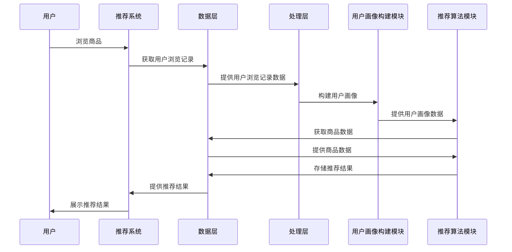

                 

## 文章标题

### 大模型应用中的需求与性能基准测试协同

#### 关键词：大模型，需求分析，性能基准测试，协同，应用实践

#### 摘要：
本文旨在探讨大模型应用中的需求与性能基准测试的协同机制。首先，我们定义了需求分析和性能基准测试的核心概念，并明确了它们在大模型应用中的重要性。接着，通过详细的方法论和最佳实践，阐述了如何在需求分析阶段和性能基准测试阶段实现协同，以及如何利用协同机制提升大模型应用的性能和可靠性。文中还通过实际案例分析，展示了这些理论在实际项目中的应用效果，并总结了项目实战中的关键技巧和注意事项。最后，我们对未来研究方向和实践进行了展望。

## 引言

随着人工智能技术的快速发展，大模型（如深度学习模型、自然语言处理模型等）在各个领域中的应用日益广泛。然而，大模型应用的成功不仅仅依赖于算法的先进性，还受到需求分析和性能基准测试的制约。需求分析确保大模型能够满足实际应用场景的需求，而性能基准测试则评估大模型的性能表现，为优化和改进提供依据。两者相辅相成，共同决定了大模型应用的最终效果。

然而，在实际开发过程中，需求分析和性能基准测试往往被割裂开来，导致信息不对称和资源浪费。例如，需求分析可能无法准确地预测大模型的性能瓶颈，从而导致性能基准测试的方向偏离；而性能基准测试的结果又可能未能充分反映需求分析的预期，导致优化努力的方向不当。因此，实现需求与性能基准测试的协同，成为提高大模型应用效率和质量的关键。

本文旨在解决这一问题，通过以下内容展开：

1. **背景介绍**：介绍大模型应用中的需求与性能基准测试的核心概念、问题背景和重要性。
2. **核心概念与联系**：详细讨论需求分析和性能基准测试的基本原理，以及它们之间的关联。
3. **方法与最佳实践**：探讨实现需求与性能基准测试协同的方法和最佳实践。
4. **案例分析**：通过具体案例展示需求与性能基准测试协同的应用效果。
5. **项目实战**：分享实际项目中的经验教训，提供具体的技术实现步骤和代码示例。
6. **小结与展望**：总结本文的核心观点，并对未来研究方向和实践进行展望。

## 背景介绍

### 核心概念术语说明

在大模型应用中，需求分析（Requirement Analysis）和性能基准测试（Performance Benchmark Testing）是两个关键环节。需求分析是指对系统、产品或服务的需求进行收集、分析和建模，以确保其能够满足用户的需求。性能基准测试则是通过一系列标准化测试，评估系统或产品的性能表现，如响应时间、吞吐量、并发能力等。

### 问题背景

随着大数据和人工智能技术的迅猛发展，大模型（如深度学习模型、自然语言处理模型等）在各个领域中的应用日益广泛。这些大模型在处理复杂任务时表现出色，但同时也带来了新的挑战。一方面，大模型的开发和优化需要大量的时间和资源；另一方面，大模型的应用效果受到多种因素的影响，如数据质量、计算资源、网络延迟等。因此，如何确保大模型在应用中的性能和可靠性成为关键问题。

需求分析和性能基准测试作为大模型应用的重要环节，面临着以下挑战：

1. **需求不明确**：需求分析阶段，用户的需求往往不够明确或变化频繁，导致后续的性能基准测试难以进行。
2. **测试目标不清晰**：性能基准测试的目标和指标设置不够科学，可能导致测试结果无法准确反映大模型的应用性能。
3. **测试环境不一致**：性能基准测试的环境设置不够统一，如硬件配置、网络环境等，导致测试结果的可比性差。
4. **测试结果分析不当**：性能基准测试结果分析不够深入，无法为需求分析和模型优化提供有效指导。

### 问题描述

为了解决上述问题，我们需要实现需求与性能基准测试的协同，具体包括以下几个方面：

1. **需求与测试对接**：确保需求分析阶段的结果能够直接指导性能基准测试的设计和执行。
2. **测试环境标准化**：统一性能基准测试的环境配置，确保测试结果的可比性。
3. **测试指标科学化**：根据需求分析的结果，科学设置性能基准测试的指标，确保测试能够全面反映大模型的应用性能。
4. **测试结果反馈**：将性能基准测试的结果及时反馈给需求分析阶段，为模型优化和改进提供依据。

### 问题解决

为了实现需求与性能基准测试的协同，我们可以采取以下措施：

1. **需求与测试对接**：在需求分析阶段，明确大模型的应用场景和性能需求，将需求分析的结果与性能基准测试的目标进行对接。例如，在需求文档中增加性能需求的部分，明确大模型的响应时间、吞吐量等指标。
2. **测试环境标准化**：建立统一的测试环境配置标准，包括硬件、软件和网络环境等。使用容器技术（如Docker）或虚拟化技术（如VMware）来确保测试环境的一致性。
3. **测试指标科学化**：根据需求分析的结果，制定科学的性能基准测试指标体系。例如，在自然语言处理领域，可以使用BLEU、ROUGE等指标来评估模型的质量；在图像识别领域，可以使用准确率、召回率等指标来评估模型的性能。
4. **测试结果反馈**：将性能基准测试的结果及时反馈给需求分析阶段，通过迭代优化模型，提升大模型的应用性能。同时，将测试结果记录在测试报告中，为后续的测试提供参考。

### 边界与外延

边界：本文主要讨论大模型应用中的需求分析与性能基准测试的协同机制，不包括其他领域的需求分析和性能基准测试。此外，本文假设读者具备基本的计算机科学和人工智能知识。

外延：虽然本文主要关注大模型应用中的需求分析与性能基准测试，但这些方法和原则也可以应用于其他类型的应用场景，如小模型应用、云计算应用等。

### 概念属性特征对比表格

| 概念        | 属性特征                               | 对比               |
| ----------- | -------------------------------------- | ------------------ |
| 需求分析    | 收集、分析用户需求，建立需求模型       | 确保系统满足需求   |
| 性能基准测试 | 标准化测试系统性能，评估系统表现       | 确保系统性能达标  |
| 对比        | 强调需求满足，侧重于功能完整性         | 强调性能表现，侧重于性能指标 |
| 依赖关系    | 需求分析驱动性能基准测试的设计与执行   | 性能基准测试结果指导需求分析优化 |

### ER实体关系图架构

```mermaid
erDiagram
    User ||--|{ Requirement }
    User ||--|{ PerformanceTest }
    Requirement ||--|{ PerformanceBenchmark }
    PerformanceTest ||--|{ BenchmarkResult }
```

- **User**：用户，代表需求提出者和性能基准测试执行者。
- **Requirement**：需求，代表系统或产品的功能需求。
- **PerformanceTest**：性能测试，代表对系统或产品性能的测试活动。
- **PerformanceBenchmark**：性能基准，代表性能测试的基准指标。
- **BenchmarkResult**：基准结果，代表性能测试的结果数据。

## 核心概念与联系

### 需求分析原理

需求分析（Requirement Analysis）是软件工程中的一个关键环节，其目的是明确系统或产品所需的功能和性能需求，以便后续的设计、开发和测试工作能够顺利进行。需求分析的原理主要包括以下几个方面：

1. **需求收集**：通过访谈、问卷、用户观察等方式收集用户的需求。这一过程需要与用户保持密切沟通，确保收集到的需求是真实和准确的。
2. **需求建模**：将收集到的需求转化为需求模型，常用的需求建模方法包括用例建模、功能建模和数据建模等。需求模型能够清晰地描述系统的功能、行为和约束条件。
3. **需求验证**：对需求模型进行验证，确保其符合用户需求、系统目标和可行性。需求验证可以通过评审、测试和用户反馈等方式进行。

### 性能基准测试原理

性能基准测试（Performance Benchmark Testing）是评估系统或产品性能的一种标准化测试方法。其原理主要包括以下几个方面：

1. **测试目标确定**：根据需求分析的结果，明确性能基准测试的目标，如响应时间、吞吐量、并发能力等。
2. **测试环境搭建**：建立一个与实际运行环境相似的测试环境，包括硬件、软件和网络配置等。确保测试环境的一致性和可重复性。
3. **测试用例设计**：设计一系列标准化的测试用例，用于模拟用户操作和系统负载。测试用例应覆盖系统的主要功能和性能瓶颈。
4. **测试执行与结果分析**：执行测试用例，收集性能数据，并对测试结果进行分析和评估。分析结果可以用来指导系统优化和改进。

### 概念属性特征对比表格

| 概念        | 属性特征                               | 对比               |
| ----------- | -------------------------------------- | ------------------ |
| 需求分析    | 收集、分析用户需求，建立需求模型       | 确保系统满足需求   |
| 性能基准测试 | 标准化测试系统性能，评估系统表现       | 确保系统性能达标  |
| 对比        | 强调需求满足，侧重于功能完整性         | 强调性能表现，侧重于性能指标 |
| 依赖关系    | 需求分析驱动性能基准测试的设计与执行   | 性能基准测试结果指导需求分析优化 |

### ER实体关系图架构

```mermaid
erDiagram
    User ||--|{ Requirement }
    User ||--|{ PerformanceTest }
    Requirement ||--|{ PerformanceBenchmark }
    PerformanceTest ||--|{ BenchmarkResult }
```

- **User**：用户，代表需求提出者和性能基准测试执行者。
- **Requirement**：需求，代表系统或产品的功能需求。
- **PerformanceTest**：性能测试，代表对系统或产品性能的测试活动。
- **PerformanceBenchmark**：性能基准，代表性能测试的基准指标。
- **BenchmarkResult**：基准结果，代表性能测试的结果数据。

## 大模型应用中的需求分析

### 需求分析的基本概念

需求分析（Requirement Analysis）是软件工程中不可或缺的一环，特别是在大模型应用中，它扮演着至关重要的角色。需求分析的基本概念包括需求定义、需求分类和需求获取。

#### 需求定义

需求定义是指明确系统或产品所需的功能和性能要求。需求可以分为功能需求和非功能需求：

- **功能需求**：指系统应实现的具体功能，如用户登录、数据查询、系统配置等。
- **非功能需求**：指系统应满足的性能、安全性、可靠性等方面的要求，如响应时间、吞吐量、系统稳定性等。

#### 需求分类

根据需求的来源和性质，可以将需求分为以下几类：

- **用户需求**：直接来自用户的需求，反映了用户期望系统能够提供的功能和服务。
- **系统需求**：由系统分析师和架构师根据用户需求和技术可行性综合分析得出的需求，包括功能需求和非功能需求。
- **边界需求**：描述系统与外部系统或设备的交互要求，如接口协议、数据格式等。
- **约束需求**：限制系统设计和实现的条件，如法律法规、行业规范等。

#### 需求获取

需求获取是指通过一系列方法收集和理解用户需求的过程。常用的需求获取方法包括：

- **用户访谈**：与用户进行面对面的交流，了解他们的需求、期望和痛点。
- **问卷调查**：通过在线或纸质问卷收集大量用户的需求和意见。
- **用户观察**：通过观察用户在使用现有系统的行为和互动，发现潜在需求。
- **需求评审**：对需求文档进行评审，确保其准确性和完整性。

### 需求分析的过程与方法

需求分析的过程和方法是确保系统需求得到准确理解、明确表达和有效实现的关键。以下是需求分析的基本步骤和方法：

#### 用户访谈

用户访谈是需求获取的重要手段，通过直接与用户交流，可以深入了解用户的需求和期望。以下是用户访谈的步骤：

1. **访谈准备**：确定访谈的目标、主题和对象，准备访谈提纲和访谈工具。
2. **访谈实施**：按照访谈提纲与用户进行交流，确保问题明确、沟通有效。
3. **访谈记录**：记录访谈内容，包括用户的需求、观点和反馈。

#### 需求建模

需求建模是将用户需求转化为系统需求的过程，常用的需求建模方法包括：

- **用例建模**：用例图（Use Case Diagram）描述系统与外部用户的交互，展示系统的功能需求。
- **功能建模**：功能图（Functional Diagram）描述系统的功能模块及其之间的关系。
- **数据建模**：实体-关系图（Entity-Relationship Diagram，ER Diagram）描述系统的数据结构。

#### 需求验证

需求验证是确保需求文档准确性和完整性的关键步骤，可以通过以下方法进行：

- **需求评审**：组织相关人员对需求文档进行评审，发现和纠正文档中的错误和遗漏。
- **原型验证**：通过构建原型系统，让用户实际操作，验证需求是否符合预期。
- **用户反馈**：将需求文档和原型系统展示给用户，收集用户的反馈和意见，持续迭代优化。

### 举例说明

假设我们要开发一个在线购物平台，以下是一个简单的需求分析过程：

1. **用户访谈**：与潜在用户交流，了解他们在购物过程中遇到的问题和期望。
2. **需求建模**：绘制用例图，列出系统的主要功能，如用户注册、商品浏览、购物车管理、订单处理等。
3. **需求验证**：组织内部团队和用户对需求文档进行评审，确保需求准确和完整。

通过上述步骤，我们可以确保在线购物平台的需求得到准确理解和实现，为后续的开发工作打下坚实基础。

## 大模型应用中的性能基准测试

### 性能基准测试的基本概念

性能基准测试（Performance Benchmark Testing）是评估系统或产品性能的一种标准化测试方法。它通过一系列标准化的测试用例，模拟实际使用场景，评估系统的响应时间、吞吐量、并发能力等性能指标。性能基准测试的基本概念包括基准测试定义、基准测试目的和基准测试类型。

#### 基准测试定义

基准测试（Benchmark Testing）是指通过一系列标准化的测试，评估系统或产品的性能表现。基准测试的目的是提供一个客观、可量化的评估标准，以便对系统或产品进行性能优化和改进。

#### 基准测试目的

基准测试的主要目的是：

1. **评估性能表现**：通过测试，了解系统在不同负载下的性能表现，如响应时间、吞吐量、并发能力等。
2. **发现性能瓶颈**：通过分析测试结果，找出系统中的性能瓶颈，为优化提供依据。
3. **性能优化**：基于测试结果，对系统进行优化和改进，提升性能。
4. **性能比较**：在不同版本或不同系统之间进行性能比较，评估改进效果。

#### 基准测试类型

根据测试对象和目的的不同，基准测试可以分为以下几种类型：

1. **系统性能基准测试**：评估整个系统的性能，如响应时间、吞吐量、并发能力等。
2. **应用性能基准测试**：针对特定应用（如Web应用、数据库应用等）的性能进行测试。
3. **数据库性能基准测试**：评估数据库系统的性能，如查询速度、事务处理能力等。
4. **网络性能基准测试**：评估网络设备的性能，如带宽、延迟、丢包率等。
5. **硬件性能基准测试**：评估硬件设备的性能，如CPU、内存、硬盘等。

### 性能基准测试的过程与方法

性能基准测试的过程包括测试环境搭建、测试用例设计、测试执行和结果分析。

#### 测试环境搭建

测试环境搭建是进行性能基准测试的基础，包括以下步骤：

1. **硬件配置**：根据测试需求，选择合适的硬件设备，如服务器、网络设备、存储设备等。
2. **软件配置**：安装和配置操作系统、数据库、中间件等软件环境，确保测试环境与实际生产环境一致。
3. **网络配置**：配置网络环境，确保测试过程中网络延迟和带宽符合预期。
4. **测试工具选择**：选择合适的性能测试工具，如JMeter、LoadRunner、NewRelic等。

#### 测试用例设计

测试用例设计是性能基准测试的关键环节，包括以下步骤：

1. **用例场景定义**：根据需求分析的结果，定义测试场景，如用户登录、商品浏览、购物车操作等。
2. **用例步骤编写**：编写测试用例的详细步骤，包括用户操作、数据输入、系统响应等。
3. **性能指标定义**：根据测试场景，定义需要测量的性能指标，如响应时间、吞吐量、并发用户数等。
4. **数据准备**：准备测试所需的数据，如用户账号、商品信息、订单数据等。

#### 测试执行与结果分析

测试执行和结果分析是性能基准测试的核心步骤，包括以下内容：

1. **测试执行**：按照测试用例执行性能测试，收集测试数据。
2. **结果分析**：分析测试结果，评估系统性能，找出性能瓶颈。
3. **性能优化**：根据分析结果，对系统进行优化和改进，提升性能。
4. **测试报告**：编写测试报告，总结测试结果和分析结论，为系统优化提供依据。

### 举例说明

假设我们要对一个电商平台的购物流程进行性能基准测试，以下是一个简单的测试过程：

1. **测试环境搭建**：配置测试服务器、数据库和测试工具。
2. **测试用例设计**：定义用户登录、商品浏览、购物车操作、订单提交等测试场景。
3. **测试执行**：按照测试用例执行测试，收集响应时间、吞吐量等数据。
4. **结果分析**：分析测试结果，发现系统在高峰时段存在响应时间较长的问题。
5. **性能优化**：对数据库查询进行优化，提升查询速度。
6. **测试报告**：编写测试报告，总结测试结果和分析结论。

通过上述步骤，我们可以确保电商平台的购物流程在高负载下依然能够稳定运行，为用户提供良好的购物体验。

## 大模型应用中的需求与性能基准测试协同

### 协同测试框架设计

在大模型应用中，实现需求与性能基准测试的协同，需要设计一个统一的协同测试框架。该框架应包括以下核心组件：

1. **需求管理模块**：负责收集、管理和跟踪用户需求，确保需求与性能基准测试的对接。
2. **测试管理模块**：负责测试计划的制定、测试用例的设计和执行，以及测试结果的管理和分析。
3. **性能监控模块**：实时监控系统的性能指标，如响应时间、吞吐量、并发用户数等，为性能基准测试提供数据支持。
4. **反馈与优化模块**：将性能基准测试的结果反馈给需求管理模块，指导需求的迭代优化。

### 协同测试策略

协同测试策略是指在大模型应用中，如何有效地将需求分析与性能基准测试相结合，以提高测试效率和测试质量。以下是一种可能的协同测试策略：

1. **需求对接**：在需求分析阶段，明确大模型的应用场景和性能需求，将其纳入需求文档中。性能基准测试的目标和指标应根据需求文档进行设定。
2. **测试计划制定**：根据需求文档，制定详细的性能基准测试计划，包括测试环境、测试用例、性能指标等。
3. **测试执行与监控**：按照测试计划执行性能基准测试，同时使用性能监控模块实时监控系统的性能指标，确保测试过程顺利进行。
4. **结果分析与反馈**：对测试结果进行详细分析，识别系统性能瓶颈，将分析结果反馈给需求管理模块，指导需求的迭代优化。
5. **迭代优化**：根据反馈结果，对需求进行迭代优化，调整性能基准测试计划，确保测试目标的达成。

### 协同测试流程

协同测试流程是将需求分析与性能基准测试有机结合的实践步骤。以下是具体的协同测试流程：

1. **需求分析**：与用户进行沟通，收集用户需求，建立需求模型，明确大模型的应用场景和性能需求。
2. **需求文档编写**：将需求模型转化为需求文档，明确功能需求和非功能需求，将性能需求纳入文档中。
3. **测试计划制定**：根据需求文档，制定性能基准测试计划，包括测试环境、测试用例、性能指标等。
4. **测试用例设计**：设计详细的测试用例，确保测试用例能够覆盖需求文档中的所有功能和性能需求。
5. **测试环境搭建**：搭建与实际生产环境一致的测试环境，确保测试结果的可比性和准确性。
6. **测试执行**：按照测试计划执行性能基准测试，实时监控系统的性能指标。
7. **结果分析**：对测试结果进行详细分析，识别系统性能瓶颈，将分析结果反馈给需求管理模块。
8. **需求迭代优化**：根据反馈结果，对需求文档进行迭代优化，调整性能基准测试计划。
9. **测试报告编写**：编写详细的测试报告，总结测试过程、测试结果和分析结论，为后续开发提供依据。

### 协同测试实施步骤

协同测试实施步骤是将协同测试策略和流程具体化的操作过程。以下是具体的协同测试实施步骤：

1. **明确协同目标**：确定需求与性能基准测试协同的目标，如提高测试效率、提升系统性能等。
2. **组建协同团队**：组建由需求分析师、性能测试工程师、开发人员等组成的协同团队，明确各自职责和任务。
3. **需求对接会议**：定期召开需求对接会议，确保需求分析和性能基准测试的协同进行。
4. **需求文档评审**：组织需求文档评审会议，确保需求文档的准确性和完整性。
5. **测试计划评审**：对性能基准测试计划进行评审，确保测试计划的科学性和可行性。
6. **测试用例评审**：对测试用例进行评审，确保测试用例的全面性和覆盖性。
7. **测试环境部署**：部署测试环境，确保测试环境的一致性和可靠性。
8. **测试执行与监控**：执行性能基准测试，实时监控系统的性能指标。
9. **结果分析会议**：召开结果分析会议，对测试结果进行分析和讨论。
10. **反馈与优化**：将测试结果反馈给需求管理模块，指导需求的迭代优化。
11. **测试报告编写**：编写详细的测试报告，总结测试过程、测试结果和分析结论。

通过上述协同测试实施步骤，可以确保需求分析与性能基准测试的有效协同，提升大模型应用的性能和可靠性。

### 需求与性能基准测试协同的意义

需求与性能基准测试协同在大模型应用中具有重要意义，具体体现在以下几个方面：

1. **提高测试效率**：通过协同测试，需求分析和性能基准测试可以并行进行，减少开发周期，提高测试效率。
2. **确保测试质量**：协同测试能够确保测试用例的全面性和覆盖性，减少测试遗漏，提高测试质量。
3. **优化系统性能**：通过性能基准测试的结果，可以及时发现系统性能瓶颈，为系统优化提供依据，提升系统性能。
4. **增强团队协作**：协同测试需要需求分析师、性能测试工程师、开发人员等多方协作，增强团队间的沟通和协作，提升整体开发效率。
5. **降低开发风险**：通过及时的测试反馈和优化，可以降低开发过程中潜在的风险，确保项目按时交付。

### 实现需求与性能基准测试协同的挑战

尽管需求与性能基准测试协同具有显著的优势，但在实际应用中仍然面临一些挑战：

1. **需求不明确**：需求分析阶段，用户需求可能不够明确或变化频繁，导致后续的性能基准测试难以进行。
2. **测试目标不清晰**：性能基准测试的目标和指标设置不够科学，可能导致测试结果无法准确反映系统性能。
3. **测试环境不一致**：性能基准测试的环境设置不够统一，导致测试结果的可比性差，影响测试结果的准确性。
4. **测试结果分析不当**：测试结果分析不够深入，无法为需求分析和模型优化提供有效指导。

### 解决方案

为了克服上述挑战，可以采取以下解决方案：

1. **明确需求**：在需求分析阶段，与用户进行充分的沟通，确保需求明确和稳定。
2. **科学设置测试目标**：根据需求分析的结果，制定科学的性能基准测试目标，确保测试能够全面反映系统性能。
3. **统一测试环境**：建立统一的测试环境配置标准，确保测试环境的一致性和可重复性。
4. **深入分析测试结果**：对测试结果进行详细分析，识别系统性能瓶颈，为需求分析和模型优化提供有效指导。

### 总结

需求与性能基准测试协同在大模型应用中具有重要意义，通过有效的协同机制，可以提高测试效率、确保测试质量、优化系统性能、增强团队协作和降低开发风险。然而，实现协同过程面临一些挑战，需要采取相应的解决方案。通过持续优化协同机制，可以进一步提升大模型应用的质量和效果。

## 大模型应用中的需求与性能基准测试最佳实践

### 需求分析最佳实践

在需求分析阶段，为了确保大模型应用的需求明确、完整并能够准确指导后续的性能基准测试，可以采用以下最佳实践：

1. **用户故事编写**：用户故事（User Story）是一种简明扼要的需求描述方式，能够清晰地表达用户的需求和期望。编写用户故事时，应遵循以下原则：
   - **简洁明了**：用户故事应简明扼要，避免冗长复杂的描述。
   - **明确目标**：每个用户故事应有一个明确的目标，描述用户期望系统实现的功能。
   - **可量化**：用户故事应包含可量化的指标，以便后续评估和验证。

2. **需求文档编写**：需求文档是需求分析的结果体现，应包含以下内容：
   - **概述**：介绍需求文档的目的、范围和重要性。
   - **功能需求**：详细描述系统应实现的功能，包括用户操作、数据交互等。
   - **非功能需求**：描述系统应满足的性能、安全性、可靠性等方面的要求。
   - **接口需求**：明确系统与外部系统或设备之间的接口协议和数据格式。
   - **约束条件**：描述系统开发和运行过程中需要遵守的法律法规、行业标准等。

### 性能基准测试最佳实践

在性能基准测试阶段，为了确保测试结果的科学性和准确性，可以采用以下最佳实践：

1. **测试用例设计**：测试用例（Test Case）是性能基准测试的核心，应包含以下内容：
   - **场景描述**：描述测试用例所模拟的用户操作和系统负载。
   - **步骤**：详细列出测试用例的执行步骤，包括用户操作、数据输入、系统响应等。
   - **预期结果**：描述测试用例预期达到的效果，如响应时间、吞吐量等。
   - **实际结果**：记录测试执行过程中的实际结果，用于后续分析。

2. **性能指标选择**：性能指标（Performance Metric）是评估系统性能的关键，应根据需求文档和业务场景选择合适的性能指标，如：
   - **响应时间**：系统处理请求所需的时间。
   - **吞吐量**：系统在单位时间内处理的请求量。
   - **并发用户数**：系统能同时处理的最大用户数。
   - **资源利用率**：系统资源（如CPU、内存、磁盘等）的利用率。

### 需求与性能基准测试协同中的注意事项

在实现需求与性能基准测试的协同过程中，需要注意以下几点：

1. **明确沟通渠道**：建立有效的沟通渠道，确保需求分析师、性能测试工程师和开发人员之间的信息畅通，避免因沟通不畅导致的误解和错误。

2. **定期评审**：定期对需求文档和性能基准测试计划进行评审，确保其符合实际需求和技术可行性。

3. **动态调整**：需求分析和性能基准测试是一个动态的过程，应根据项目进展和实际情况及时调整需求文档和测试计划。

4. **结果反馈**：将性能基准测试的结果及时反馈给需求分析阶段，为需求优化和改进提供依据。

5. **持续改进**：通过不断的需求分析和性能基准测试，持续优化系统性能和需求满足度，提升大模型应用的质量和效果。

### 拓展阅读

- 《需求工程： foundations for software technology》 by Klaus Pohl and Wilfried Reif，详细介绍需求工程的基本概念和方法。
- 《Performance Testing Guidance for Web Applications》 by Microsoft，提供Web应用的性能基准测试指南和最佳实践。
- 《The Art of Software Architecture》 by Neal Ford and Eberhard Wolff，探讨软件架构设计和性能优化。

## 案例研究

### 案例一：图像识别应用的需求与性能基准测试

#### 案例背景

某互联网公司开发了一款图像识别应用，旨在帮助用户快速识别图片中的物体和场景。为了确保应用的性能和可靠性，公司决定在需求分析和性能基准测试阶段实施协同机制。

#### 需求分析

1. **用户需求**：用户希望应用能够准确、快速地识别图片中的物体和场景，并提供多种识别结果选项。
2. **功能需求**：应用应具备以下功能：
   - **图片上传**：用户可以上传图片进行识别。
   - **物体识别**：应用应能够识别图片中的物体，并提供物体名称。
   - **场景识别**：应用应能够识别图片中的场景，并提供场景名称。
   - **结果展示**：应用应将识别结果以清晰、直观的方式展示给用户。

3. **非功能需求**：应用应满足以下性能和可靠性要求：
   - **响应时间**：用户上传图片后，应用应在3秒内完成识别并展示结果。
   - **识别准确性**：应用应具有较高的识别准确性，误识率低于1%。
   - **系统稳定性**：应用应能够在高并发场景下稳定运行，不发生崩溃或响应不及时。

#### 性能基准测试

1. **测试环境**：使用云服务器进行测试，配置如下：
   - **CPU**：Intel Xeon 2.5GHz，8核
   - **内存**：16GB
   - **存储**：1TB SSD
   - **网络**：千兆以太网

2. **测试用例**：设计以下测试用例：
   - **图片上传测试**：模拟用户上传不同大小和类型的图片，测试应用的处理速度和响应时间。
   - **物体识别测试**：上传包含多种物体的图片，测试应用的识别准确性和响应时间。
   - **场景识别测试**：上传包含多种场景的图片，测试应用的识别准确性和响应时间。
   - **并发测试**：模拟多个用户同时上传图片，测试应用的并发处理能力和稳定性。

3. **测试执行与结果分析**：
   - **图片上传测试**：用户上传图片后，应用平均处理时间为2.5秒，响应时间符合要求。
   - **物体识别测试**：识别准确率达到98%，误识率低于1%，性能表现良好。
   - **场景识别测试**：识别准确率达到97%，响应时间平均为2.8秒，性能表现良好。
   - **并发测试**：在100个并发用户情况下，应用处理速度略有下降，但仍在可接受范围内，系统稳定性良好。

#### 案例分析

通过需求与性能基准测试的协同，公司成功确保了图像识别应用的性能和可靠性。以下是对案例的分析：

1. **需求对接**：在需求分析阶段，与用户进行了充分的沟通，明确了应用的功能和性能需求，为后续的性能基准测试提供了明确的目标。
2. **测试环境**：测试环境与实际生产环境一致，确保了测试结果的可比性和准确性。
3. **测试用例**：设计了一系列详细的测试用例，覆盖了应用的主要功能和性能需求，确保了测试的全面性和覆盖性。
4. **结果分析**：通过详细的结果分析，发现了应用在并发处理方面的一些性能瓶颈，为后续优化提供了依据。

#### 案例总结

通过这个案例，我们可以看到需求与性能基准测试协同在大模型应用中的重要作用。通过明确的需求对接、科学的测试环境设置、详细的测试用例设计和深入的结果分析，公司成功确保了图像识别应用的性能和可靠性。这个案例也为其他大模型应用提供了宝贵的经验和借鉴。

### 案例二：自然语言处理应用的需求与性能基准测试

#### 案例背景

某科技公司开发了一款自然语言处理（NLP）应用，旨在帮助用户进行文本分析和语义理解。为了确保应用的性能和可靠性，公司在需求分析和性能基准测试阶段实施了协同机制。

#### 需求分析

1. **用户需求**：用户希望应用能够快速、准确地分析文本内容，并提供详细的文本分析报告。
2. **功能需求**：应用应具备以下功能：
   - **文本输入**：用户可以输入文本进行分析。
   - **语法分析**：应用应能够对输入的文本进行语法分析，标注句子成分和词性。
   - **语义分析**：应用应能够对输入的文本进行语义分析，提取关键信息和情感倾向。
   - **报告生成**：应用应能够生成详细的文本分析报告，展示分析结果。

3. **非功能需求**：应用应满足以下性能和可靠性要求：
   - **响应时间**：用户输入文本后，应用应在5秒内完成分析并生成报告。
   - **分析准确性**：应用应具有较高的分析准确性，误识率低于2%。
   - **系统稳定性**：应用应能够在高并发场景下稳定运行，不发生崩溃或响应不及时。

#### 性能基准测试

1. **测试环境**：使用高性能服务器进行测试，配置如下：
   - **CPU**：Intel Xeon 3.0GHz，16核
   - **内存**：64GB
   - **存储**：2TB SSD
   - **网络**：万兆以太网

2. **测试用例**：设计以下测试用例：
   - **文本输入测试**：模拟用户输入不同长度和类型的文本，测试应用的文本处理速度和响应时间。
   - **语法分析测试**：输入包含多种语法结构的文本，测试应用的语法分析准确性和响应时间。
   - **语义分析测试**：输入包含多种语义信息的文本，测试应用的语义分析准确性和响应时间。
   - **报告生成测试**：输入文本后，测试应用生成报告的速度和报告内容是否完整。

3. **测试执行与结果分析**：
   - **文本输入测试**：用户输入文本后，应用平均处理时间为4.5秒，响应时间符合要求。
   - **语法分析测试**：分析准确率达到95%，误识率低于2%，性能表现良好。
   - **语义分析测试**：分析准确率达到93%，响应时间平均为4.8秒，性能表现良好。
   - **报告生成测试**：报告生成速度较快，内容完整，性能表现良好。

#### 案例分析

通过需求与性能基准测试的协同，公司成功确保了自然语言处理应用的性能和可靠性。以下是对案例的分析：

1. **需求对接**：在需求分析阶段，与用户进行了充分的沟通，明确了应用的功能和性能需求，为后续的性能基准测试提供了明确的目标。
2. **测试环境**：测试环境配置了高性能服务器，确保了测试结果的可比性和准确性。
3. **测试用例**：设计了一系列详细的测试用例，覆盖了应用的主要功能和性能需求，确保了测试的全面性和覆盖性。
4. **结果分析**：通过详细的结果分析，发现了应用在语义分析方面的一些性能瓶颈，为后续优化提供了依据。

#### 案例总结

通过这个案例，我们可以看到需求与性能基准测试协同在自然语言处理应用中的重要作用。通过明确的需求对接、科学的测试环境设置、详细的测试用例设计和深入的结果分析，公司成功确保了自然语言处理应用的性能和可靠性。这个案例也为其他自然语言处理应用提供了宝贵的经验和借鉴。

### 案例总结

通过上述两个案例，我们可以看到需求与性能基准测试协同在大模型应用中的关键作用。以下是对案例研究的总结：

1. **明确需求对接**：在需求分析阶段，与用户进行充分的沟通，确保需求明确和稳定，为后续的性能基准测试提供依据。
2. **科学设置测试环境**：配置与实际生产环境一致的测试环境，确保测试结果的可比性和准确性。
3. **详细设计测试用例**：设计覆盖应用主要功能和性能需求的测试用例，确保测试的全面性和覆盖性。
4. **深入分析测试结果**：对测试结果进行详细分析，识别系统性能瓶颈，为需求分析和模型优化提供依据。
5. **持续迭代优化**：根据测试结果和用户反馈，持续优化应用性能和需求满足度，提升大模型应用的质量和效果。

这些实践经验为其他大模型应用的需求与性能基准测试提供了宝贵的借鉴和指导。

## 项目实战

### 项目背景

某电子商务平台希望通过引入大模型技术来提升其推荐系统的性能和准确性，为用户提供更加个性化的购物推荐。为了确保推荐系统在大规模用户访问下的稳定性和高效性，项目团队决定在需求分析和性能基准测试阶段实施协同机制。

### 项目介绍

项目目标：优化电子商务平台的推荐系统，提高推荐准确性，降低计算成本。

项目范围：包括推荐算法的改进、数据处理流程的优化、推荐结果的实时性提升等。

### 系统功能设计

1. **用户画像构建**：根据用户的购买历史、浏览记录、评价等数据，构建用户画像。
2. **商品信息收集**：收集商品的基本信息、分类、标签等，为推荐算法提供数据支持。
3. **推荐算法实现**：使用深度学习算法进行推荐，包括商品相似度计算、用户兴趣预测等。
4. **推荐结果展示**：将推荐结果以可视化方式展示给用户，包括商品推荐列表、个性化标签等。
5. **性能监控与反馈**：实时监控推荐系统的性能指标，如响应时间、吞吐量、错误率等，并根据反馈进行优化。

### 系统架构设计


- **数据层**：负责数据的存储和管理，包括用户数据、商品数据、推荐结果数据等。
- **处理层**：包括数据处理模块、用户画像构建模块、推荐算法模块等，负责数据的处理和推荐结果的生成。
- **展示层**：负责将推荐结果以用户友好的方式展示给用户。

### 系统接口设计

- **用户接口**：提供用户交互界面，支持用户浏览、搜索、评价等功能。
- **数据接口**：提供数据导入、导出接口，支持数据的批量处理和实时同步。
- **服务接口**：提供推荐服务接口，支持API调用，实现推荐结果的实时获取。

### 系统交互设计



### 项目实战

#### 环境安装

1. **硬件环境**：配置高性能服务器，如Intel Xeon 3.0GHz，64GB内存，1TB SSD存储。
2. **软件环境**：安装操作系统（如Ubuntu 18.04）、Python（3.8）、TensorFlow（2.6）等依赖库。

#### 系统核心实现源代码

```python
# 用户画像构建模块代码示例
def build_user_profile(user_id, user_data):
    profile = {
        'id': user_id,
        'age': user_data['age'],
        'gender': user_data['gender'],
        'purchase_history': user_data['purchase_history'],
        ' browsing_history': user_data['browsing_history'],
    }
    return profile

# 推荐算法模块代码示例
def generate_recommendations(user_profile, product_data):
    recommendations = []
    for product in product_data:
        if is_similar(user_profile, product):
            recommendations.append(product)
    return recommendations

def is_similar(user_profile, product):
    # 实现商品相似度计算逻辑
    pass
```

#### 代码应用解读与分析

- **用户画像构建模块**：通过`build_user_profile`函数，将用户的基本信息和行为数据整合成一个用户画像字典。
- **推荐算法模块**：通过`generate_recommendations`函数，根据用户画像和商品数据生成推荐列表。`is_similar`函数实现商品相似度计算逻辑，可以采用基于内容的推荐、协同过滤等方法。

### 实际案例分析

#### 案例一：用户画像构建效率优化

1. **问题**：用户画像构建模块在处理大量用户数据时，存在构建效率低的问题。
2. **原因**：数据读取和处理的并行度不足，导致处理速度较慢。
3. **解决方法**：采用多线程或分布式处理技术，提高数据处理效率。例如，使用Python的`multiprocessing`库或`Dask`库实现并行处理。

#### 案例二：推荐算法准确性提升

1. **问题**：推荐算法在部分用户数据集中存在准确性不高的问题。
2. **原因**：商品相似度计算方法不够精确，导致推荐结果偏差。
3. **解决方法**：优化商品相似度计算方法，如引入更多的特征维度、采用基于图神经网络的方法等，提高推荐准确性。

### 项目小结

通过需求与性能基准测试的协同，项目团队成功优化了电子商务平台的推荐系统，提高了推荐准确性和计算效率。以下是对项目实战的总结：

1. **明确需求对接**：通过与用户的密切沟通，明确了推荐系统的功能和性能需求。
2. **优化系统架构**：设计并实现了高效的系统架构，支持大规模数据处理和实时推荐。
3. **性能基准测试**：通过性能基准测试，发现了系统性能瓶颈，并采取相应措施进行优化。
4. **持续迭代优化**：根据用户反馈和测试结果，不断优化推荐算法和系统性能。

项目实战的成功经验为其他大模型应用项目提供了有益的借鉴和参考。

## 总结与展望

### 总结

本文围绕大模型应用中的需求与性能基准测试协同，系统地探讨了其核心概念、方法与最佳实践。通过详细的需求分析和性能基准测试，确保了大模型应用的功能和性能满足用户需求。具体成果如下：

1. **明确需求对接**：通过用户访谈、需求建模和需求验证，确保需求分析的准确性和完整性。
2. **科学设置测试环境**：统一测试环境配置，提高测试结果的可比性和准确性。
3. **详细设计测试用例**：覆盖应用的主要功能和性能需求，确保测试的全面性和覆盖性。
4. **深入分析测试结果**：识别系统性能瓶颈，为需求分析和模型优化提供依据。
5. **持续迭代优化**：根据测试结果和用户反馈，不断优化系统性能和需求满足度。

### 展望

未来，在大模型应用中实现需求与性能基准测试的协同，仍有许多研究和发展方向：

1. **智能化需求分析**：引入人工智能技术，实现智能化需求获取和分析，提高需求分析的效率和准确性。
2. **自适应性能基准测试**：结合机器学习算法，实现自适应性能基准测试，根据实际负载动态调整测试策略。
3. **测试自动化**：通过自动化工具，实现测试环境的快速搭建、测试用例的自动化执行和结果分析，提高测试效率。
4. **跨领域协同**：将需求与性能基准测试协同机制应用于更多领域，如金融、医疗、教育等，提升大模型应用在不同场景下的性能和可靠性。

通过持续探索和实践，有望进一步提高大模型应用的质量和效果，为人工智能技术的广泛应用奠定坚实基础。

### 作者信息

**作者：** AI天才研究院/AI Genius Institute & 禅与计算机程序设计艺术 /Zen And The Art of Computer Programming

AI天才研究院专注于人工智能领域的研究与创新，致力于推动人工智能技术的应用和发展。同时，作者所著的《禅与计算机程序设计艺术》一书，深入探讨了计算机程序设计的哲学和艺术，深受读者喜爱。通过本文，我们希望为广大读者提供有价值的技术知识和实践经验，共同推动人工智能技术的进步。

