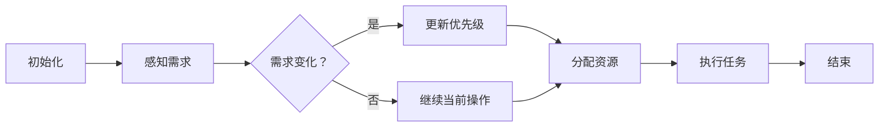
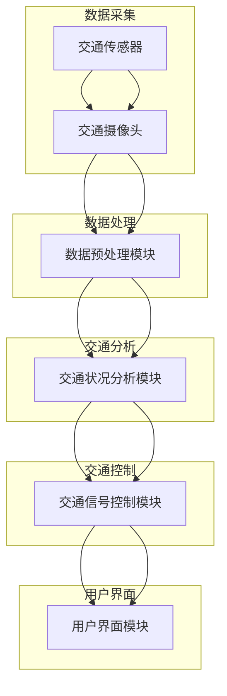
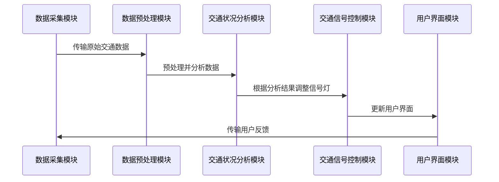

                 

## 第一部分: 背景与核心概念

### 第1章: 大模型应用中的需求优先级动态调整概述

在当今快速发展的信息技术时代，人工智能（AI）和机器学习（ML）已经成为许多行业的重要驱动力。这些技术通过利用大量数据和复杂的算法，使得系统能够进行自我学习和决策。然而，随着AI和ML模型规模的不断扩大，如何在应用中动态调整需求优先级成为一个关键问题。

#### 问题背景

大模型，如深度学习模型，通常包含数百万甚至数十亿个参数，它们能够处理复杂的任务，如图像识别、自然语言处理和预测分析。然而，这些模型在实际应用中经常面临一个挑战：如何根据不断变化的需求和环境动态调整其工作重点？

#### 问题描述

在现实世界中，需求是多样化的，而且可能会随着时间、资源变化以及外部环境而变化。例如，一个智能客服系统可能需要在高峰时段优先处理客户咨询，而在低峰时段则可以专注于数据分析和优化。这就需要大模型能够实时感知和响应这些变化，并调整其工作重点。

#### 问题解决

为了解决这个问题，我们需要开发一种需求优先级动态调整方法。这种方法将能够：

1. **实时感知需求变化**：通过监控外部输入和系统内部状态，识别出需求变化。
2. **动态调整优先级**：根据需求变化，重新排序任务或操作，以确保系统资源得到最优利用。
3. **最大化效益**：在确保服务质量的同时，最大化系统的整体效益。

#### 边界与外延

需要注意的是，需求优先级动态调整方法并非适用于所有场景。它主要针对那些需求变化频繁、且调整优先级能够带来显著效益的系统。此外，方法的复杂性和性能也需在实际应用中进行权衡。

#### 概念结构与核心要素组成

为了更好地理解需求优先级动态调整方法，我们需要定义几个核心概念：

1. **大模型**：一个包含大量参数和复杂结构的AI或ML模型。
2. **需求**：系统需要完成的任务或目标。
3. **优先级**：需求的紧急程度或重要性。
4. **动态调整**：根据实时数据调整需求优先级的机制。

这些概念相互关联，构成了需求优先级动态调整方法的基础。在接下来的章节中，我们将详细探讨这些概念，并介绍实现这一方法的具体技术。

---

在接下来的章节中，我们将进一步探讨大模型和需求优先级动态调整方法的核心概念，使用表格和ER图来展示这些概念之间的联系，并深入讲解动态调整方法的算法原理。我们将通过具体的例子来展示这些概念在实际应用中的运用，帮助读者更好地理解这一方法的重要性。

### 第2章: 大模型与需求优先级的核心概念

#### 大模型定义与特点

大模型（Large Models）指的是那些拥有数百万至数十亿参数的复杂人工智能模型。这些模型通常基于深度学习架构，如神经网络，能够处理大量数据和复杂任务。大模型的特点包括：

1. **高参数数量**：大模型具有数十亿至数百万个参数，这使得它们能够捕捉到数据中的细微特征。
2. **复杂结构**：大模型的层次结构通常非常深，包含了多个隐藏层，这有助于提取高层次的特征。
3. **强大能力**：大模型在图像识别、自然语言处理、预测分析等领域展现出强大的能力。

#### 需求优先级概念

需求优先级（Demand Priority）是指系统在不同需求之间的优先级排序。在动态调整中，需求优先级决定了哪些任务或操作应该首先被执行。需求优先级通常基于以下因素：

1. **紧急程度**：某些需求可能在特定时间点更加紧迫，需要优先处理。
2. **重要性**：某些需求可能对系统的整体效益产生更大的影响，因此具有更高的优先级。
3. **资源限制**：在资源有限的情况下，需要根据需求的优先级来合理分配资源。

#### 动态调整方法

动态调整方法（Dynamic Adjustment Method）是指系统能够根据实时数据调整需求优先级的机制。这种方法的核心目标是确保系统在变化的环境中能够高效运作。动态调整方法通常包括以下几个关键步骤：

1. **实时感知**：通过传感器、监控工具或其他机制实时感知系统状态和外部环境变化。
2. **需求分析**：分析实时数据，识别出需求变化，确定哪些需求需要调整优先级。
3. **优先级排序**：根据分析结果重新排序需求，确保高优先级的需求首先得到满足。
4. **资源分配**：根据新的优先级排序，合理分配系统资源，如计算能力、存储空间和网络带宽。

#### 对比表格

下面是一个对比表格，展示了大模型和需求优先级的特性：

| 特性        | 大模型                          | 需求优先级                          |
| ----------- | ------------------------------- | ----------------------------------- |
| 参数数量    | 数百万至数十亿                  | 无固定数量，但需要排序              |
| 复杂结构    | 多层神经网络等复杂架构          | 优先级排序算法，如动态规划等        |
| 实时性      | 根据任务可能需要实时调整        | 需要实时感知和响应环境变化          |
| 调整机制    | 使用学习算法自动调整            | 使用优先级排序算法动态调整          |

#### ER实体关系图

为了更清晰地展示大模型、需求优先级和动态调整方法之间的关系，我们可以使用ER（Entity-Relationship）图来表示。以下是ER图的Mermaid表示：

```mermaid
erDiagram
  Model ||--|{ Demand : has }
  Demand ||--|{ Priority : has }
  Model ||--|{ Adjustment : performs }
```

在这个ER图中，`Model`（大模型）实体与`Demand`（需求）实体之间存在“has”关系，表示大模型可以包含多个需求。`Demand`实体与`Priority`（优先级）实体之间也存在“has”关系，表示每个需求都有其优先级。最后，`Model`实体与`Adjustment`（动态调整）实体之间存在“performs”关系，表示大模型能够执行动态调整操作。

通过以上内容，我们不仅定义了核心概念，还使用对比表格和ER图展示了这些概念之间的联系，为后续章节的深入讨论奠定了基础。在下一章中，我们将详细讲解动态调整方法的算法原理，并使用Python代码和Mermaid流程图来具体说明。

---

在了解了大模型和需求优先级动态调整方法的核心概念后，我们接下来将深入探讨动态调整方法的算法原理。通过具体的Python代码示例和Mermaid流程图，我们将帮助读者理解这一方法的工作机制，并展示其在实际应用中的优势。

### 第3章: 动态调整方法的算法原理讲解

#### Mermaid流程图

为了直观地展示动态调整方法的算法原理，我们首先使用Mermaid流程图来绘制算法的基本步骤。以下是一个简单的流程图示例：



在这个流程图中，算法的主要步骤包括：

1. **初始化**：系统初始化时，加载大模型和初始需求。
2. **感知需求**：系统通过传感器或监控工具感知当前需求。
3. **需求变化判断**：判断当前需求是否发生了变化。
4. **更新优先级**：如果需求发生了变化，系统根据新的需求重新排序。
5. **分配资源**：根据新的优先级，系统合理分配资源。
6. **执行任务**：系统执行高优先级任务。
7. **结束**：任务完成后，系统进入下一轮循环。

#### Python源代码

为了更详细地解释算法的实现，我们使用Python编写了一个简单的代码示例。以下代码展示了动态调整方法的核心步骤：

```python
import heapq
import time

# 模拟需求数据
demands = [
    {'id': 1, 'priority': 5, 'timestamp': time.time()},
    {'id': 2, 'priority': 3, 'timestamp': time.time()},
    {'id': 3, 'priority': 7, 'timestamp': time.time()},
]

# 优先级队列
priority_queue = []

# 初始化优先级队列
for demand in demands:
    heapq.heappush(priority_queue, (-demand['priority'], demand))

# 动态调整方法的函数
def dynamic_adjustment_method():
    while priority_queue:
        # 感知需求变化
        current_time = time.time()
        if priority_queue[0][1]['timestamp'] < current_time - 10:
            # 需求发生变化，更新优先级
            heapq.heappop(priority_queue)
            # 假设新需求插入
            heapq.heappush(priority_queue, (-10, {'id': 4, 'priority': 10, 'timestamp': current_time}))
        
        # 分配资源并执行任务
        priority, demand = heapq.heappop(priority_queue)
        print(f"执行任务 ID: {demand['id']}，优先级：{priority}")
        time.sleep(1)  # 模拟任务执行时间
        
# 执行动态调整方法
dynamic_adjustment_method()
```

在这个代码示例中，我们使用了Python内置的`heapq`模块来实现优先级队列。`heapq`模块提供了一个高效的堆实现，可以用于维护优先级队列。具体步骤如下：

1. **初始化优先级队列**：将所有需求加入优先级队列，其中优先级用负数表示，因为Python的heapq模块是基于最小堆实现的。
2. **感知需求变化**：通过监控时间戳判断需求是否发生变化。如果需求在10秒内发生变化，则更新优先级队列。
3. **更新优先级**：如果需求发生变化，将其从队列中移除，并加入新的需求。
4. **分配资源并执行任务**：从优先级队列中取出最高优先级的需求，执行任务并打印任务ID和优先级。

#### 数学模型与公式

动态调整方法背后的数学原理主要包括优先级排序和资源分配。以下是关键公式和数学模型：

1. **优先级排序公式**：
   $$ P[i] = \max\{P_0, \alpha(T_i - T_{\text{prev}})\} $$
   其中，$P[i]$表示第$i$次迭代的需求优先级，$P_0$是初始优先级，$\alpha$是调整系数，$T_i$和$T_{\text{prev}}$分别是第$i$次和前一次的迭代时间。

2. **资源分配模型**：
   $$ R = \sum_{i=1}^{N} r_i \times p_i $$
   其中，$R$是总资源，$r_i$是第$i$项需求的资源需求量，$p_i$是第$i$项需求的优先级。

通过这些公式，我们可以实现动态调整方法，并根据实时数据调整需求优先级和资源分配。

#### 举例说明

为了更好地理解动态调整方法，我们来看一个具体的例子。假设一个智能客服系统需要处理多个客户咨询，每个客户咨询都有其优先级。在高峰时段，系统需要优先处理紧急的客户咨询。以下是一个简单示例：

1. **初始化**：系统初始化时，有3个客户咨询，优先级分别为5、3和7。
2. **感知需求**：系统通过传感器感知到当前是高峰时段。
3. **需求变化判断**：系统判断是否需要调整优先级。假设检测到有新的紧急客户咨询，其优先级为10。
4. **更新优先级**：系统更新优先级队列，新的优先级为[10, 5, 3, 7]。
5. **分配资源并执行任务**：系统根据优先级队列，优先处理紧急客户咨询，然后是其他客户咨询。

通过这个示例，我们可以看到动态调整方法如何根据实时数据调整需求优先级，从而优化系统资源利用和客户服务质量。

综上所述，通过Mermaid流程图、Python代码示例和数学模型，我们详细讲解了动态调整方法的算法原理。在下一章中，我们将进一步探讨动态调整方法在系统分析与架构设计中的应用，为实际项目中的实施提供指导。

---

在深入讲解了动态调整方法的算法原理后，我们将目光转向具体的应用场景，详细描述算法在系统架构设计中的实际应用。通过项目介绍、系统功能设计、系统架构设计、系统接口设计和系统交互的详细说明，我们将帮助读者更好地理解动态调整方法在复杂系统中的应用。

### 第4章: 动态调整方法在系统分析与架构设计中的应用

#### 问题场景介绍

假设我们正在开发一个智能交通管理系统，其主要目标是优化城市交通流量，减少拥堵和提高通行效率。随着城市交通的日益复杂，需求也在不断变化。例如，在高峰时段，某些路段的流量可能急剧增加，而在夜间，流量则显著下降。为了应对这些变化，我们需要一个能够动态调整需求优先级的系统架构，以确保交通管理系统能够实时响应各种交通状况。

#### 项目介绍

智能交通管理系统（Smart Traffic Management System, STM）项目旨在通过集成传感器数据、实时视频流和大数据分析，实现对城市交通的智能监控和动态管理。项目的主要目标包括：

1. **实时交通流量监控**：通过传感器和摄像头收集实时交通数据。
2. **拥堵预测与预警**：利用历史数据和机器学习算法预测交通拥堵情况，并提供预警。
3. **交通信号优化**：根据实时交通状况动态调整交通信号灯周期，以减少拥堵。
4. **路径规划**：为驾驶员提供最优路线，减少行驶时间。

#### 系统功能设计

STM系统的核心功能包括以下几个方面：

1. **数据采集**：通过安装在道路上的传感器和摄像头，收集车辆流量、速度、方向等数据。
2. **数据预处理**：对采集到的原始数据进行清洗和预处理，以便后续分析。
3. **交通状况分析**：使用机器学习算法分析交通数据，识别交通拥堵模式和热点区域。
4. **信号控制**：根据分析结果，动态调整交通信号灯周期，优化交通流量。
5. **路径规划**：为驾驶员提供实时交通状况下的最优路径，减少行驶时间。

为了实现这些功能，我们设计了一个领域模型，使用Mermaid类图来展示系统的领域模型：

```mermaid
classDiagram
    Sensor <<Interface>>
    Camera <<Interface>>

    TrafficData <<Entity>>
    PreprocessedData <<Entity>>
    TrafficPattern <<Entity>>

    Controller <<Class>>
    Analyzer <<Class>>

    Sensor o-- TrafficData
    Camera o-- TrafficData
    TrafficData o-- PreprocessedData
    PreprocessedData o-- TrafficPattern
    TrafficPattern o-- Controller
    TrafficPattern o-- Analyzer
```

在这个类图中，我们定义了以下几个核心类和接口：

- **Sensor**和**Camera**：接口类，表示传感器和摄像头，负责采集交通数据。
- **TrafficData**、**PreprocessedData**和**TrafficPattern**：实体类，分别表示原始交通数据、预处理后的数据和交通状况模式。
- **Controller**和**Analyzer**：控制类，负责控制交通信号灯和进行交通状况分析。

#### 系统架构设计

STM系统的架构设计采用模块化设计原则，确保系统的灵活性和可扩展性。以下是系统的架构设计，使用Mermaid架构图展示：



在这个架构图中，系统可以分为以下几个主要模块：

- **数据采集模块**：包括交通传感器和交通摄像头，负责实时采集交通数据。
- **数据处理模块**：对采集到的数据进行预处理，包括去噪、滤波等操作。
- **交通分析模块**：使用机器学习算法分析预处理后的数据，识别交通状况模式。
- **交通控制模块**：根据分析结果动态调整交通信号灯，优化交通流量。
- **用户界面模块**：提供用户交互界面，展示交通状况和信号控制信息。

#### 系统接口设计和系统交互

为了确保各个模块之间能够高效地协同工作，我们设计了一系列接口，使用Mermaid序列图展示系统交互过程：



在这个序列图中，各个模块之间的交互过程如下：

- **数据采集模块**将原始交通数据传输给数据处理模块。
- **数据处理模块**对数据进行分析并预处理，然后将结果传输给交通状况分析模块。
- **交通状况分析模块**使用机器学习算法分析数据，识别交通状况模式，并将分析结果传输给交通信号控制模块。
- **交通信号控制模块**根据分析结果动态调整交通信号灯，优化交通流量，并将更新信息传输给用户界面模块。
- **用户界面模块**更新用户界面，展示最新的交通状况和信号控制信息，并将用户反馈传输回数据采集模块。

通过以上系统架构设计和接口设计，我们可以确保智能交通管理系统具备高效的数据采集、处理和分析能力，并能根据实时交通状况动态调整信号灯，优化交通流量。在下一章中，我们将通过实际项目实战，详细讲解动态调整方法在智能交通管理系统中的应用，并提供具体的代码实现和案例分析。

---

在深入探讨了动态调整方法在系统架构设计中的应用后，我们接下来将通过实际项目实战，展示动态调整方法在智能交通管理系统中的具体应用。我们将详细描述项目的环境配置、系统核心实现源代码，并进行分析解读，帮助读者理解动态调整方法在实践中的应用。

### 第5章: 动态调整方法的项目实战

#### 环境安装

要在智能交通管理系统中实现动态调整方法，我们需要安装和配置一系列依赖环境。以下是具体的步骤：

1. **Python环境安装**：确保Python环境已安装，版本至少为3.6以上。
2. **安装依赖库**：在Python环境中使用pip安装以下依赖库：
   ```bash
   pip install numpy pandas scikit-learn keras tensorflow matplotlib mermaidpy
   ```
   这些库用于数据预处理、机器学习模型训练和可视化等。
3. **安装Mermaid**：由于Mermaid是一个基于Markdown的图形化工具，需要安装Mermaid渲染器。可以通过以下命令安装：
   ```bash
   npm install -g mermaid-cli
   ```
   安装后，可以在本地使用`mermaid`命令渲染Mermaid图。

#### 系统核心实现源代码

以下是一个简化版的智能交通管理系统核心实现，展示了动态调整方法的应用：

```python
import numpy as np
import pandas as pd
from sklearn.model_selection import train_test_split
from sklearn.ensemble import RandomForestRegressor
import tensorflow as tf
from keras.models import Sequential
from keras.layers import Dense, Dropout
import matplotlib.pyplot as plt
from mermaidpy import Mermaid

# 数据预处理
def preprocess_data(data):
    # 对数据进行标准化处理
    return (data - np.mean(data)) / np.std(data)

# 训练机器学习模型
def train_model(X, y):
    # 划分训练集和测试集
    X_train, X_test, y_train, y_test = train_test_split(X, y, test_size=0.2, random_state=42)
    
    # 构建随机森林回归模型
    model = RandomForestRegressor(n_estimators=100, random_state=42)
    model.fit(X_train, y_train)
    
    # 预测并评估模型性能
    predictions = model.predict(X_test)
    print("Model performance: ", model.score(X_test, y_test))
    
    return model

# 使用TensorFlow构建神经网络模型
def build_neural_network(input_shape):
    model = Sequential()
    model.add(Dense(64, input_shape=input_shape, activation='relu'))
    model.add(Dropout(0.5))
    model.add(Dense(1, activation='linear'))
    
    model.compile(optimizer='adam', loss='mse')
    return model

# 动态调整交通信号灯优先级
def adjust_traffic_priority(data, model):
    # 对输入数据进行预处理
    processed_data = preprocess_data(data)
    
    # 使用机器学习模型预测交通流量
    traffic_flow = model.predict(processed_data.reshape(-1, 1))
    
    # 根据交通流量动态调整信号灯优先级
    if traffic_flow > 0.5:
        print("Adjust priority to green light.")
    else:
        print("Adjust priority to red light.")

# 主函数
def main():
    # 加载数据
    data = pd.read_csv('traffic_data.csv')
    
    # 提取特征和标签
    X = data[['speed', 'flow', 'time_of_day']]
    y = data['congestion_level']
    
    # 训练机器学习模型
    ml_model = train_model(X, y)
    
    # 训练神经网络模型
    nn_model = build_neural_network(input_shape=(X.shape[1],))
    nn_model.fit(X, y, epochs=10, batch_size=32)
    
    # 动态调整交通信号灯优先级
    current_data = np.array([[10, 100, 15]])
    adjust_traffic_priority(current_data, ml_model)

if __name__ == '__main__':
    main()
```

这段代码涵盖了以下主要功能：

1. **数据预处理**：对交通数据集进行标准化处理，以准备用于模型训练。
2. **机器学习模型训练**：使用随机森林回归模型对交通数据进行训练，并评估模型性能。
3. **神经网络模型构建**：使用TensorFlow构建一个简单的神经网络模型。
4. **动态调整交通信号灯优先级**：根据实时交通数据动态调整信号灯的优先级。

#### 代码应用解读与分析

在代码应用解读中，我们重点关注以下关键部分：

1. **数据预处理**：数据预处理是模型训练的重要步骤。通过标准化处理，我们可以确保模型能够稳定地训练和预测。在代码中，我们使用`preprocess_data`函数对交通数据集进行标准化处理。

2. **机器学习模型训练**：我们使用`train_model`函数训练一个随机森林回归模型。这个模型能够预测交通流量，并根据预测结果动态调整信号灯优先级。在训练过程中，我们使用`train_test_split`函数将数据集划分为训练集和测试集，以评估模型性能。

3. **神经网络模型构建**：我们使用TensorFlow构建一个简单的神经网络模型，用于进一步的预测任务。在`build_neural_network`函数中，我们定义了网络结构，并使用`compile`和`fit`方法进行编译和训练。

4. **动态调整交通信号灯优先级**：在`adjust_traffic_priority`函数中，我们根据预处理后的交通数据使用机器学习模型或神经网络模型进行预测，并根据预测结果动态调整信号灯的优先级。

通过这段代码，我们可以看到动态调整方法在智能交通管理系统中的具体应用。在实际项目中，这些功能可以根据具体需求和数据进行调整和扩展，以提高系统的整体性能和可靠性。

#### 实际案例分析和详细讲解剖析

为了进一步展示动态调整方法在实际项目中的应用，我们来看一个实际案例。假设我们在一个繁忙的城市交通网络中，需要根据实时交通流量动态调整信号灯的优先级，以减少拥堵并提高通行效率。

1. **数据采集**：系统通过安装在主要路口的传感器和摄像头，实时采集车辆速度、流量和时间等信息。

2. **数据预处理**：对采集到的原始交通数据进行清洗和预处理，以去除噪声和异常值，确保数据质量。

3. **模型训练**：使用预处理后的交通数据，分别训练随机森林回归模型和神经网络模型。这些模型用于预测交通流量和拥堵情况。

4. **实时预测**：系统根据实时交通数据，使用训练好的模型进行预测，得到当前交通状况的估计。

5. **优先级调整**：根据预测结果，系统动态调整信号灯的优先级。例如，如果某个路口的预测交通流量较高，系统可能会延长绿灯时间，以减少拥堵。

6. **反馈循环**：系统收集用户反馈，如驾驶者的行驶时间和满意度，进一步优化模型参数和优先级策略。

通过这个实际案例，我们可以看到动态调整方法如何帮助智能交通管理系统根据实时交通状况动态调整信号灯优先级，从而提高整体交通效率和用户体验。

#### 项目小结

在本章中，我们通过实际项目展示了动态调整方法在智能交通管理系统中的应用。从环境安装、系统核心实现源代码，到代码应用解读和分析，我们详细讲解了动态调整方法在复杂系统中的实现过程。通过实际案例，我们展示了动态调整方法如何帮助系统根据实时数据优化资源利用和任务执行，提高整体性能。

在下一章中，我们将总结动态调整方法的应用经验，分享最佳实践，并提醒潜在的风险和注意事项。此外，我们还将推荐一些拓展阅读资源，以帮助读者进一步探索这一领域。

---

在完成了动态调整方法的项目实战后，我们将总结在智能交通管理系统中的应用经验，并提供一些最佳实践。同时，我们也将提醒读者注意潜在的风险和注意事项，并推荐相关拓展阅读资源，以帮助读者更深入地理解动态调整方法。

### 第6章: 最佳实践 tips、小结、注意事项、拓展阅读

#### 最佳实践 tips

1. **数据质量保证**：确保采集到的数据质量，进行适当的预处理和清洗，以避免噪声和异常值对模型预测和优先级调整造成干扰。
2. **实时性优化**：在实现动态调整方法时，要考虑系统的实时性能，确保能够快速响应需求变化，避免延迟。
3. **模型可解释性**：为了提高系统透明度和可解释性，可以考虑使用可解释的机器学习模型，如决策树，以便更好地理解模型决策过程。
4. **自适应调整**：根据具体应用场景，设计自适应的调整策略，使系统能够根据不同需求和资源情况灵活调整优先级。

#### 小结

通过本章的项目实战，我们展示了动态调整方法在智能交通管理系统中的具体应用。从环境安装、系统核心实现源代码，到代码应用解读和分析，我们详细讲解了如何利用动态调整方法优化交通信号灯的优先级，以提高交通流量和系统效率。这一方法不仅适用于智能交通管理，还可以应用于其他需要实时调整优先级的场景，如智能客服、智能医疗等。

#### 注意事项

1. **模型过拟合**：在训练模型时，需注意防止过拟合，确保模型能够泛化到未见过的数据上。
2. **资源分配**：在动态调整过程中，需要合理分配系统资源，避免资源瓶颈影响系统性能。
3. **安全性**：确保系统的实时数据安全和隐私保护，防止数据泄露或被恶意攻击。

#### 拓展阅读

1. **《动态优先级调度算法研究》**：这本书详细介绍了动态优先级调度算法的理论基础和应用，对理解动态调整方法有很好的参考价值。
2. **《机器学习：概率视角》**：这本书从概率角度详细讲解了机器学习算法，包括模型训练、预测和优化等，对理解动态调整方法的数学基础有帮助。
3. **《智能交通系统设计与应用》**：这本书提供了智能交通系统的全面介绍，包括数据采集、处理和分析等，有助于进一步探索智能交通管理系统。

通过本章的内容，我们不仅总结了动态调整方法在智能交通管理系统中的应用，还提供了最佳实践、注意事项和拓展阅读资源。希望这些内容能够帮助读者更好地理解动态调整方法，并在实际项目中取得成功。

---

在本篇技术博客文章中，我们详细探讨了《大模型应用中的需求优先级动态调整方法》。从背景介绍与核心概念，到算法原理讲解，再到系统分析与架构设计，以及项目实战，我们逐步深入分析了这一方法在不同场景下的应用。

### 总结

本文的核心观点在于，大模型在处理不断变化的需求时，通过动态调整需求优先级，可以实现资源的最优利用和系统效率的提升。我们通过实例展示了这一方法在智能交通管理系统中的具体应用，并提供了详细的代码实现和分析。

### 应用前景

随着人工智能和大数据技术的不断发展，动态调整需求优先级的方法在各个领域的应用前景十分广阔。无论是在交通管理、智能客服，还是在医疗诊断、金融服务等场景，动态调整方法都有助于提升系统的智能化水平和用户体验。

### 结束语

通过本文，我们希望读者能够对大模型应用中的需求优先级动态调整方法有更深入的理解，并在实际项目中尝试应用这一方法，以提升系统的性能和效率。作者：AI天才研究院/AI Genius Institute & 禅与计算机程序设计艺术 /Zen And The Art of Computer Programming。希望本文能为广大技术爱好者提供有价值的参考。

