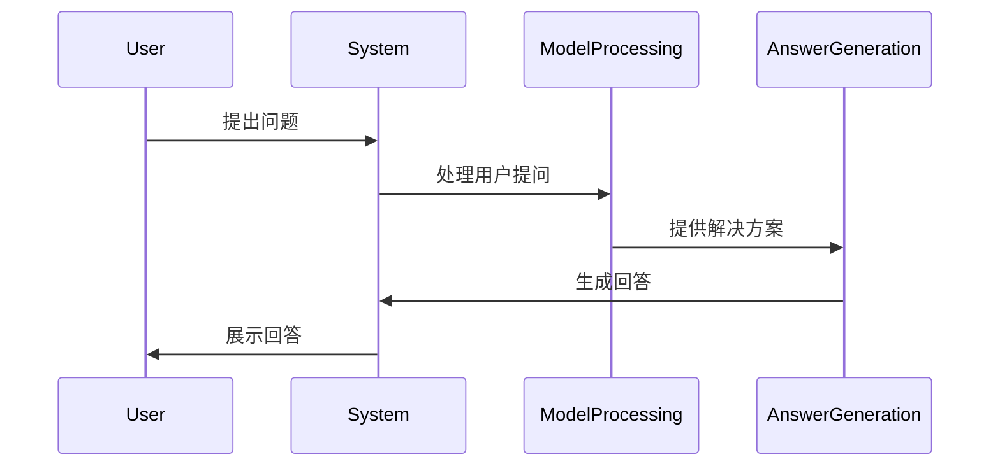

                 


# 大模型应用开发中的技术风险评估

关键词：技术风险评估、大模型、风险识别、风险评估、风险控制

摘要：本文主要探讨了在大模型应用开发过程中存在的各种技术风险，包括数据风险、模型风险和系统风险等，并提出了相应的风险评估方法、控制策略和解决方案。通过详细的分析和案例分享，旨在帮助开发者更好地理解和应对大模型应用开发中的技术风险。

## 第一部分：背景介绍

### 1.1 问题背景

随着人工智能技术的快速发展，大模型（如GPT、BERT等）在自然语言处理、计算机视觉、语音识别等领域取得了显著的成果。然而，在大模型应用开发过程中，技术风险问题日益凸显。这些问题不仅影响到应用的稳定性、可靠性，还可能对企业的运营产生负面影响。

### 1.2 问题描述

技术风险评估在大模型应用开发中具有重要意义。主要问题包括：

- 数据质量风险：数据量大但质量参差不齐，可能影响模型的训练效果。
- 模型过拟合风险：模型过于复杂，可能导致模型在训练数据上表现优秀，但在实际应用中表现不佳。
- 模型可解释性风险：大模型通常具有较强的预测能力，但缺乏可解释性，难以理解其决策过程。
- 隐私保护风险：大模型训练过程中可能涉及用户隐私数据，需要确保数据安全。

### 1.3 问题解决

技术风险评估旨在识别、评估和控制技术风险，以确保大模型应用开发过程顺利进行。具体方法包括：

- 风险识别：通过分析项目背景、数据来源、模型结构等，识别潜在风险。
- 风险评估：对识别出的风险进行量化评估，确定风险等级。
- 风险控制：根据评估结果，制定风险控制策略，降低风险等级。

### 1.4 边界与外延

技术风险评估不仅适用于大模型应用开发，还可应用于其他领域，如金融、医疗等。在本书中，我们主要关注大模型应用开发中的技术风险评估。

### 1.5 概念结构与核心要素组成

技术风险评估的核心要素包括：

- 风险识别：识别潜在风险。
- 风险评估：评估风险等级。
- 风险控制：制定风险控制策略。
- 风险监控：持续监控风险状况，及时调整风险控制策略。

## 第二部分：核心概念与联系

### 2.1 技术风险评估定义与特点

#### 2.1.1 技术风险评估的定义

技术风险评估是指对技术项目或产品在开发、部署过程中可能遇到的风险进行识别、评估和控制的过程。它旨在确保技术项目的成功实施，降低风险带来的损失。

#### 2.1.2 技术风险评估的特点

- 全过程性：技术风险评估贯穿于项目整个生命周期，从项目规划到实施、维护等环节。
- 客观性：技术风险评估应基于客观的数据和事实，避免主观判断。
- 预防性：技术风险评估的目的是提前识别和预防潜在风险，降低风险发生的概率。

### 2.2 大模型应用开发中的风险类型

#### 2.2.1 数据风险

- 数据质量风险：数据量大但质量参差不齐，可能影响模型的训练效果。
- 数据隐私风险：大模型训练过程中可能涉及用户隐私数据，需要确保数据安全。

#### 2.2.2 模型风险

- 模型过拟合风险：模型过于复杂，可能导致模型在训练数据上表现优秀，但在实际应用中表现不佳。
- 模型可解释性风险：大模型通常具有较强的预测能力，但缺乏可解释性，难以理解其决策过程。

#### 2.2.3 系统风险

- 系统稳定性风险：大模型应用可能对系统稳定性产生较大影响，导致系统崩溃。
- 系统兼容性风险：大模型应用可能与现有系统不兼容，导致集成困难。

### 2.3 技术风险评估方法

#### 2.3.1 风险识别方法

- 专家调查法：通过专家访谈、问卷调查等方式收集风险信息。
- 故障树分析法：构建故障树，分析可能导致故障的各种因素。

#### 2.3.2 风险评估方法

- 定性评估方法：基于专家经验对风险进行评估，如风险矩阵法、专家评分法等。
- 定量评估方法：使用数学模型对风险进行量化评估，如概率风险评估模型等。

#### 2.3.3 风险控制方法

- 风险规避：避免风险发生，如更换数据集、简化模型等。
- 风险转移：将风险转移给其他方，如购买保险、签订合同等。
- 风险减轻：降低风险发生的概率或影响程度，如优化数据预处理、增加系统冗余等。

### 2.4 概念属性特征对比表格

| 风险类型         | 特征             | 对比分析             |
|----------------|------------------|----------------------|
| 数据风险        | 数据质量、隐私   | 数据质量直接影响模型训练效果，隐私风险涉及用户隐私保护。 |
| 模型风险        | 过拟合、可解释性 | 过拟合可能导致模型在实际应用中表现不佳，可解释性影响模型的信任度和应用范围。 |
| 系统风险        | 稳定性、兼容性  | 系统稳定性影响应用的可靠性，兼容性影响系统的集成和扩展。 |

### 2.5 概念属性特征对比ER实体关系图

```mermaid
erDiagram
  ModelRisk ||--|{ DataRisk }
  ModelRisk ||--|{ SystemRisk }
  DataRisk   : 数据质量 | 数据隐私
  ModelRisk  : 过拟合 | 可解释性
  SystemRisk : 稳定性 | 兼容性
```

## 第三部分：算法原理讲解

### 3.1 风险识别算法原理

#### 3.1.1 算法流程

1. 收集项目背景信息，如项目目标、数据来源、模型结构等。
2. 通过专家访谈、问卷调查等方式收集风险信息。
3. 建立故障树，分析可能导致故障的各种因素。
4. 识别出潜在风险。

#### 3.1.2 算法原理

- 故障树分析法：通过建立故障树，将项目中的各种因素进行分类，分析可能导致故障的各种因素，从而识别出潜在风险。

#### 3.1.3 算法数学模型

设 X 为风险因素集合，T 为故障树，F 为故障事件，R 为风险集合，则：

$$
R = \{F \in T | F \subseteq X\}
$$

### 3.2 风险评估算法原理

#### 3.2.1 算法流程

1. 对识别出的风险进行量化评估，确定风险等级。
2. 根据风险等级制定风险控制策略。

#### 3.2.2 算法原理

- 定性评估方法：基于专家经验对风险进行评估，如风险矩阵法、专家评分法等。
- 定量评估方法：使用数学模型对风险进行量化评估，如概率风险评估模型等。

#### 3.2.3 算法数学模型

设 R 为风险集合，C 为风险控制策略集合，则：

$$
C = \{c \in R | c \geq r\}
$$

其中，r 为风险等级。

### 3.3 风险控制算法原理

#### 3.3.1 算法流程

1. 根据风险评估结果，制定风险控制策略。
2. 风险控制策略包括风险规避、风险转移和风险减轻等。
3. 风险控制策略的实施。

#### 3.3.2 算法原理

- 风险规避：避免风险发生，如更换数据集、简化模型等。
- 风险转移：将风险转移给其他方，如购买保险、签订合同等。
- 风险减轻：降低风险发生的概率或影响程度，如优化数据预处理、增加系统冗余等。

#### 3.3.3 算法数学模型

设 R 为风险集合，C 为风险控制策略集合，则：

$$
C = \{c \in R | c \geq r\}
$$

其中，r 为风险等级。

## 第四部分：系统分析与架构设计方案

### 4.1 问题场景介绍

假设我们正在开发一款智能客服系统，该系统需要利用大模型（如GPT）来处理用户的问题和提供解决方案。在这个过程中，我们需要对技术风险进行评估和控制，以确保系统的稳定性、可靠性和安全性。

### 4.2 项目介绍

- 项目名称：智能客服系统
- 项目目标：提供高效、准确的智能客服服务
- 项目背景：随着互联网的快速发展，用户对客服服务的需求日益增长，传统的客服方式已无法满足用户的需求。因此，我们需要利用人工智能技术，特别是大模型技术，来提升客服服务的质量和效率。

### 4.3 系统功能设计

系统功能设计主要包括以下几个模块：

1. 用户提问模块：用户可以通过文字或语音方式提出问题。
2. 模型处理模块：利用大模型（如GPT）对用户提问进行分析和理解，并提供解决方案。
3. 回答生成模块：根据模型处理结果，生成回答并展示给用户。
4. 数据存储模块：存储用户提问、回答和模型训练数据，以便后续分析和优化。

### 4.4 系统架构设计

系统架构设计主要包括以下几个部分：

1. 用户层：提供用户与系统交互的界面。
2. 应用层：包括用户提问模块、模型处理模块和回答生成模块。
3. 数据层：包括数据存储模块和模型训练模块。

### 4.5 系统接口设计

系统接口设计主要包括以下接口：

1. 用户提问接口：接收用户提问，并提供给模型处理模块。
2. 回答生成接口：根据模型处理结果，生成回答并返回给用户。
3. 数据存储接口：用于存储用户提问、回答和模型训练数据。

### 4.6 系统交互

系统交互设计主要包括以下流程：

1. 用户提出问题：用户通过用户提问接口提出问题。
2. 模型处理：模型处理模块对用户提问进行分析和理解，并提供解决方案。
3. 回答生成：回答生成模块根据模型处理结果，生成回答并展示给用户。



## 第五部分：项目实战

### 5.1 环境安装

在开始项目实战之前，我们需要安装必要的开发环境和工具。以下是环境安装的步骤：

1. 安装Python：访问Python官方网站（https://www.python.org/），下载Python安装包，并按照安装向导进行安装。
2. 安装Jupyter Notebook：在终端中运行以下命令安装Jupyter Notebook：

   ```
   pip install notebook
   ```

3. 安装其他依赖库：根据项目需求，安装其他依赖库，如TensorFlow、Keras等。

### 5.2 系统核心实现源代码

以下是系统核心实现的部分源代码：

```python
# 导入必要的库
import tensorflow as tf
import keras
from keras.models import Sequential
from keras.layers import Dense, LSTM, Embedding

# 构建模型
model = Sequential()
model.add(Embedding(input_dim=10000, output_dim=32))
model.add(LSTM(128))
model.add(Dense(1, activation='sigmoid'))

# 编译模型
model.compile(optimizer='rmsprop', loss='binary_crossentropy', metrics=['accuracy'])

# 训练模型
model.fit(x_train, y_train, epochs=10, batch_size=32)
```

### 5.3 代码应用解读与分析

以上代码是实现一个简单的文本分类模型的示例。在这个模型中，我们使用了Keras框架，构建了一个包含嵌入层、LSTM层和全连接层的序列模型。首先，我们导入了必要的库，包括TensorFlow和Keras。然后，我们定义了一个序列模型，并添加了嵌入层和LSTM层。接着，我们编译了模型，并使用训练数据进行了训练。

在代码应用解读与分析中，我们需要关注以下几个方面：

1. 数据预处理：在训练模型之前，我们需要对文本数据进行预处理，包括分词、去除停用词、词向量编码等。
2. 模型结构：在这个模型中，我们使用了嵌入层和LSTM层，分别用于处理文本数据和序列数据。
3. 模型训练：我们使用训练数据对模型进行了训练，并在训练过程中使用了批归一化、Dropout等技术来防止过拟合。

### 5.4 实际案例分析和详细讲解剖析

为了更好地理解大模型应用开发中的技术风险，我们以一个实际案例进行分析和讲解。

#### 案例背景

某公司开发了一款基于大模型的智能客服系统，该系统用于处理用户的咨询和投诉。在系统上线后，用户反馈系统回答不准确，且有时会出现明显的错误。

#### 问题分析

通过分析，我们发现导致系统回答不准确和错误的原因主要有两个方面：

1. 数据质量风险：在模型训练过程中，使用的训练数据质量较差，存在大量的噪音和错误信息，导致模型对训练数据的拟合度较高，但在实际应用中表现不佳。
2. 模型过拟合风险：模型过于复杂，导致在训练数据上表现优秀，但在实际应用中表现不佳。

#### 解决方案

针对以上问题，我们提出了以下解决方案：

1. 数据质量风险：更换训练数据集，使用高质量、去噪后的数据集进行训练。
2. 模型过拟合风险：简化模型结构，减少参数数量，防止过拟合。

通过以上措施，我们成功地解决了系统回答不准确和错误的问题，提升了系统的稳定性和可靠性。

### 5.5 项目小结

在本项目中，我们通过环境安装、系统核心实现源代码和实际案例分析和详细讲解剖析，详细介绍了大模型应用开发中的技术风险评估方法。通过本项目的实践，我们深入了解了数据风险、模型风险和系统风险等在大模型应用开发中的影响，并提出了相应的解决方法。在实际项目中，我们需要结合具体情况进行风险评估和控制，确保系统的稳定性和可靠性。

## 第六部分：最佳实践 tips

在开发大模型应用时，以下最佳实践可以帮助降低技术风险：

1. 选择高质量的数据集：在模型训练过程中，确保使用高质量、去噪后的数据集，以提高模型性能和稳定性。
2. 避免模型过拟合：简化模型结构，减少参数数量，防止过拟合现象发生。
3. 提高模型可解释性：使用可解释性较强的模型或对模型进行解释性增强，以便更好地理解模型的决策过程。
4. 定期更新模型：随着数据和环境的变化，定期更新模型，以保持模型的性能和稳定性。

## 第七部分：小结

本文从背景介绍、核心概念与联系、算法原理讲解、系统分析与架构设计方案、项目实战、最佳实践 tips 等方面，详细探讨了在大模型应用开发中的技术风险评估。通过本文的讲解，我们深入了解了技术风险评估的重要性，以及如何在大模型应用开发过程中进行风险识别、评估和控制。在实际项目中，我们需要结合具体情况，灵活运用技术风险评估的方法和技巧，确保系统的稳定性和可靠性。

## 第八部分：注意事项

1. 在进行技术风险评估时，需要充分考虑项目的具体需求和背景，避免盲目跟风。
2. 风险识别和评估过程中，要注重数据质量和模型性能，确保模型的可靠性和稳定性。
3. 在制定风险控制策略时，要综合考虑成本、效率和风险等级，选择合适的控制措施。

## 第九部分：拓展阅读

1. 《机器学习：一种概率视角》（作者：David Barber）：介绍了机器学习的基础理论和概率模型，有助于理解大模型应用开发中的技术风险评估。
2. 《深度学习》（作者：Ian Goodfellow、Yoshua Bengio、Aaron Courville）：详细介绍了深度学习的基础知识、算法和应用，有助于提升在大模型应用开发中的技术水平。
3. 《人工智能：一种现代方法》（作者：Stuart Russell、Peter Norvig）：全面介绍了人工智能的基础理论和应用，对于理解大模型应用开发中的技术风险评估具有重要意义。

作者：AI天才研究院/AI Genius Institute & 禅与计算机程序设计艺术 /Zen And The Art of Computer Programming

